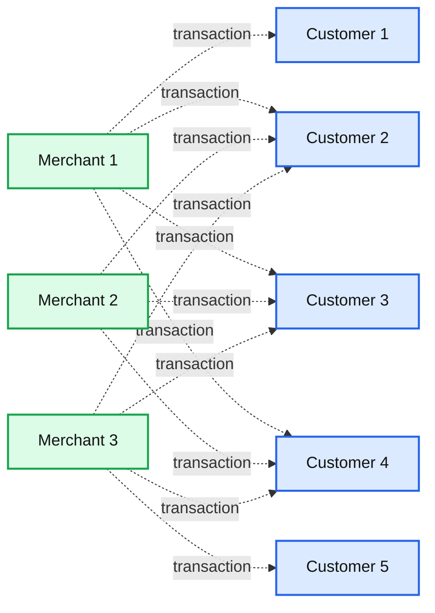
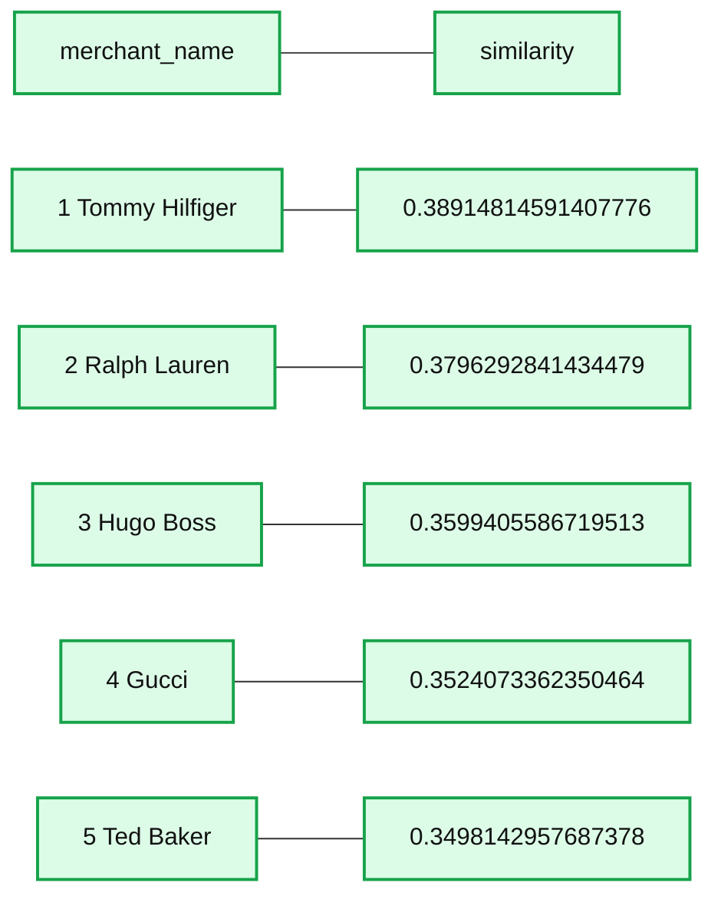
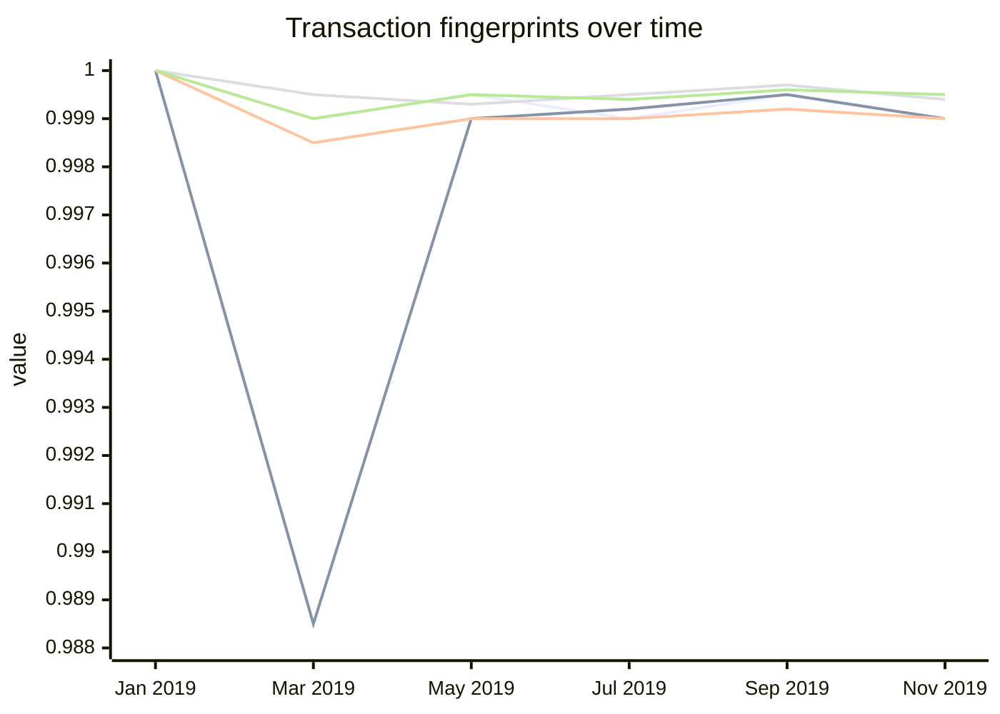
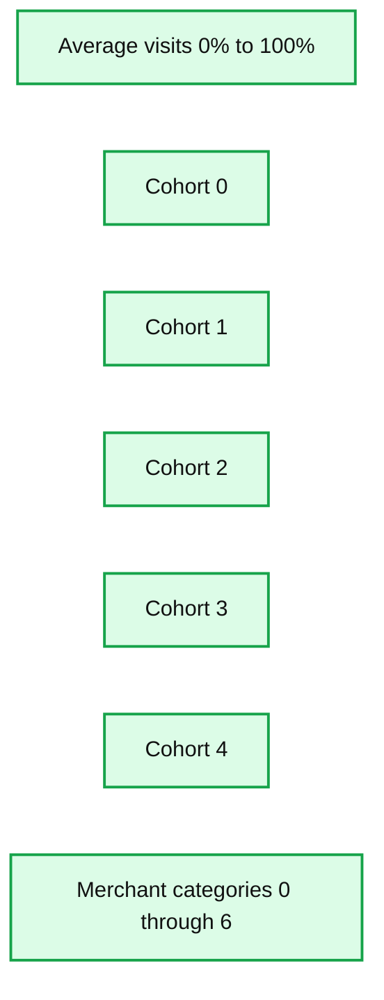

# Hyper-Personalization Accelerator for Banks and Fintechs Using Credit Card Transactions

*Lakehouse for Financial Services as the strategic platform to accelerate digital transformation in retail banking*

- Source: https://www.databricks.com/blog/2022/03/03/hyper-personalization-accelerator-for-banks-and-fintechs-using-credit-card-transactions.html
- Published: 2022-03-03
- Authors: Antoine Amend
- Categories: engineering, solution-accelerators
- Images: 5 total, 4 extracted as architecture

Just as Netflix and Tesla disrupted the media and automotive industry, many fintech companies are transforming the Financial Services industry by winning the hearts and minds of a digitally active population through personalized services, numberless credit cards that promise more security, and frictionless omnichannel experiences. [NuBank's](https://www.reuters.com/business/finance/latin-americas-nubank-prices-shares-9-each-ipo-source-2021-12-08/) success story as an eight-year old startup becoming Latin America's most valuable bank is not an isolated case; over 280 other [fintechs unicorns](https://fintechlabs.com/115-fintech-unicorns-of-the-21st-century-changes-to-the-list-october-2020/) are also willing to disrupt the entire payment industry. As noted in the Financial Conduct Authority (FCA) [study](https://www.fca.org.uk/publication/multi-firm-reviews/strategic-review-retail-banking-business-models-final-report-2022.pdf), "*There are signs that some of the historic advantages of large banks may be starting to weaken through innovation, digitization and changing consumer behavior*." Faced with the choice of either disrupting or being disrupted, many traditional financial services institutions (FSIs) like JP Morgan Chase have recently announced significant strategic [investments](https://www.jpmorganchase.com/news-stories/tech-investment-could-disrupt-banking) to compete with fintech companies on their own grounds – on the cloud, using data and artificial intelligence (AI).

Given the volume of data required to drive advanced personalization, the complexity of operating AI from experiments (proof of concepts/POCs) to enterprise scale data pipelines, combined with strict data and privacy regulations on the use of customer data on cloud infrastructure, [Lakehouse for Financial Services](https://www.databricks.com/solutions/industries/financial-services) has quickly emerged as the strategic platform for many disruptors and incumbents alike to accelerate digital transformation and provide millions of customers with personalized insights and enhanced banking experiences (see how [HSBC](https://www.databricks.com/customers/hsbc) is reinventing mobile banking with AI).

In our previous [solution accelerator](https://www.databricks.com/blog/2021/05/10/improving-customer-experience-with-transaction-enrichment.html), we showed how to identify brands and merchants from credit card transactions. In our new solution accelerator (inspired from the 2019 [study](https://arxiv.org/pdf/1907.07225.pdf) of Bruss et. al. and from our experience working with global retail banking institutions), we capitalized on that work to build a modern hyper-personalization data asset strategy that captures a full picture of the consumer and goes beyond traditional demographics, income, product and services (who you are) and extends to transactional behavior and shopping preferences (how you bank). As a data asset, the same can be applied to many downstream use cases, such as loyalty programs for online banking applications, fraud prevention for core banking platforms or credit risk for "buy now pay later" (BNPL) initiatives.

## Transactional context

While the common approach to any segmentation use case is a simple clustering model, there are only a few off-the-shelf techniques. Alternatively, when converting data from its original archetype, one can access a wider range of techniques that often yield unexpected results. In this solution accelerator, we convert our original card transaction data into graph paradigm and leverage techniques originally designed for Natural Language Processing (NLP).

**Summary:** The diagram represents card transactions as a bipartite graph connecting merchants with customers.

**Components:**

- Merchant 1 - technology unspecified
- Merchant 2 - technology unspecified
- Merchant 3 - technology unspecified
- Customer 1 - technology unspecified
- Customer 2 - technology unspecified
- Customer 3 - technology unspecified
- Customer 4 - technology unspecified
- Customer 5 - technology unspecified

**Flows:**

- Merchant 1 -> Customer 1: card transaction relationship
- Merchant 1 -> Customer 2: card transaction relationship
- Merchant 1 -> Customer 3: card transaction relationship
- Merchant 1 -> Customer 4: card transaction relationship
- Merchant 2 -> Customer 2: card transaction relationship
- Merchant 2 -> Customer 3: card transaction relationship
- Merchant 2 -> Customer 4: card transaction relationship
- Merchant 3 -> Customer 2: card transaction relationship
- Merchant 3 -> Customer 3: card transaction relationship
- Merchant 3 -> Customer 4: card transaction relationship
- Merchant 3 -> Customer 5: card transaction relationship

**Numbers:** Merchant 1, Merchant 2, Merchant 3, Customer 1, Customer 2, Customer 3, Customer 4, Customer 5; none with units or percentages.

source image: https://www.databricks.com/wp-content/uploads/2022/02/hyper-personalization-accelerator-blog-image-1.jpg

Similar to NLP techniques where the meaning of a word is defined by its surrounding context, a merchant's category can be learned from its customer base and the other brands that their consumers support. In order to build this context, we generate "shopping trips" by simulating customers walking from one shop to another, up and down our graph structure. The aim is to learn "embeddings," a mathematical representation of the contextual information carried by the customers in our network. In this example, two merchants contextually close to one another would be embedded into large vectors that are mathematically close to one another. By extension, two customers exhibiting the same shopping behavior will be mathematically close to one another, paving the way for a more advanced customer segmentation strategy.

## Merchant embeddings

[Word2Vec](https://arxiv.org/abs/1301.3781) was developed by Tomas Mikolov, et. al. at Google to make the neural network training of the embedding more efficient, and has since become the de facto standard for developing pre-trained word embedding algorithms. In our solution, we will use the default wordVec model from the Apache Spark™ ML API that we train against our shopping trips defined earlier.

The most obvious way to quickly validate our approach is to eyeball its results and apply domain expertise. In this example of brands like "Paul Smith", our model can find Paul Smiths' closest competitors to be "Hugo Boss", "Ralph Lauren" or "Tommy Hilfiger."

**Summary:** The table ranks five merchants by their similarity to Paul Smith.

**Components:**

- merchant_name column
- similarity column
- Ranked merchant rows

**Flows:**

- none

**Numbers:** 1, 2, 3, 4, 5, 0.38914814591407776, 0.3796292841434479, 0.3599405586719513, 0.3524073362350464, 0.3498142957687378

source image: https://www.databricks.com/wp-content/uploads/2022/02/hyper-personalization-accelerator-blog-image-2.jpg

We did not simply detect brands within the same category (i.e. fashion industry) but detected brands with a similar price tag. Not only could we classify different lines of businesses using customer behavioral data, but our customer segmentation could also be driven by the quality of goods they purchase. This observation corroborates the findings by Bruss et. al.

## Merchant clustering

Although the preliminary results were troubling, there might be groups of merchants more or less similar than others that we may want to identify further. The easiest way to find those significant groups of merchants/brands is to visualize our embedded vector space into a 3D plot. For that purpose, we apply machine learning techniques like Principal Component Analysis (PCA) to reduce our embedded vectors into 3 dimensions.

Using a simple plot, we could identify distinct groups of merchants. Although these merchants may have different lines of business, and may seem dissimilar at first glance, they all have one thing in common: they attract a similar customer base. We can better confirm this hypothesis through a clustering model (KMeans).

## Transactional fingerprints

One of the odd features of the word2vec model is that sufficiently large vectors could still be aggregated while maintaining high predictive value. To put it another way, the significance of a document could be learned by averaging the vector of each of its word constituents (see [whitepaper](https://arxiv.org/pdf/1405.4053v2.pdf) from Mikolov et. al.). Similarly, customer spending preferences can be learned by aggregating vectors of each of their preferred brands. Two customers having similar tastes for luxury brands, high-end cars and fine liquor would theoretically be close to one another, hence belonging to the same segment.

It is worth mentioning that such an aggregated view would generate a transactional fingerprint that is unique to each of our end consumers. Although two fingerprints may share similar traits (same shopping preferences), these unique signatures can be used to track unique individual customer behaviors over time.

When a signature drastically differs from previous observations, this could be a sign of fraudulent activities (e.g. sudden interest for gambling companies). When signature drifts over time, this could be indicative of life events (having a newborn child). This approach is key to driving hyper-personalization in retail banking: the ability to track customer preferences against real-time data will help banks provide personalized marketing and offers, such as push notifications, across various life events, positive or negative.

**Summary:** The chart shows transaction fingerprints over time for five customers, with values remaining close to 1 throughout 2019.

**Components:**

- Date axis: Jan 2019 through Nov 2019
- Value axis: transaction fingerprint values
- Customer traces: 38550, 356519, 381521, 541573, and 571542

**Flows:**

- None visible

**Numbers:** 38550, 356519, 381521, 541573, 571542, 1, 0.998, 0.996, 0.994, 0.992, 0.99, 0.988, Jan 2019, Mar 2019, May 2019, Jul 2019, Sep 2019, Nov 2019

source image: https://www.databricks.com/wp-content/uploads/2022/02/hyper-personalization-accelerator-blog-image-4.png

## Customer segmentation

Although we were able to generate some signal that offers great predictive value to customer behavioral analytics, we still haven't addressed our actual segmentation problem. Borrowing from retail counterparts that are often more advanced when it comes to customer 360 use cases including segmentation, churn prevention or customer lifetime value, we can use a different [solution accelerator](https://www.databricks.com/solutions/accelerators/customer-segmentation) from our [Lakehouse for Retail](https://www.databricks.com/solutions/industries/retail-industry-solutions) that walks us through different segmentation techniques used by best-in-class retail organizations.

Following retail industry best practices, we were able to segment our entire customer base against 5 different groups exhibiting different shopping characteristics.

**Summary:** Stacked bar chart showing merchant-category distributions across customer cohorts 0 through 4.

**Components:**

- Average visits percentage axis
- Cohort axis
- Cohorts 0, 1, 2, 3, and 4
- Merchant categories 0 through 6

**Flows:**

- none

**Numbers:** 0%, 20%, 40%, 60%, 80%, 100%; cohorts 0, 1, 2, 3, 4; merchant categories 0, 1, 2, 3, 4, 5, 6

source image: https://www.databricks.com/wp-content/uploads/2022/02/hyper-personalization-accelerator-blog-image-5.png

While cluster #0 seems to be biased towards gambling activities (merchant category 4 in the above graph), another group is more centered around online businesses and subscription-based services (merchant category 6), probably indicative of a younger generation of customers. We invite our readers to complement this view with additional data points they already know about their customers (original segments, products and services, average income, demographics, etc.) to better understand each of those behavioral driven segments and its impact for credit decisioning, next-best action, personalized services, customer satisfaction, debt collection or marketing analytics.

## Closing thoughts

In this solution accelerator, we have successfully applied concepts from the world of NLP to card transactions for customer segmentation in retail banking. We also demonstrated the relevance of the Lakehouse for Financial Services to address this challenge where graph analytics, matrix calculation, NLP, and clustering techniques must all be combined into one platform, secured and scalable. Compared to traditional segmentation methods easily addressed through the world of SQL, the disruptive future of segmentation builds a fuller picture of the consumer and can only be solved with data + AI, at scale and in real time.

Although we've only scratched the surface of what was possible using off-the-shelf models and data at our disposal, we proved that customer spending patterns can more effectively drive hyper-personalization than demographics, opening up an exciting range of new opportunities from cross-sell/upsell and pricing/targeting activities to customer loyalty and fraud detection strategies.

Most importantly, this technique allowed us to learn from new-to-bank individuals or underrepresented consumers without a known credit history by leveraging information from others. With 1.7 billion adults worldwide who do not have access to a bank account according to the [World Economic Forum](https://www.weforum.org/agenda/2021/05/technology-help-unbanked-access-ecommerce/), and 55 million underbanked in the US alone in 2018 according to the [Federal Reserve](https://www.federalreserve.gov/publications/2019-economic-well-being-of-us-households-in-2018-banking-and-credit.htm), such an approach could pave the way towards a more customer-centric and inclusive future for retail banking.

Try the accelerator [notebooks](https://notebooks.databricks.com/notebooks/fsi/transbed/index.html) on Databricks to test your customer 360 data asset strategy today and [contact us](https://www.databricks.com/company/contact) to learn more about how we have helped customers with similar use cases.
