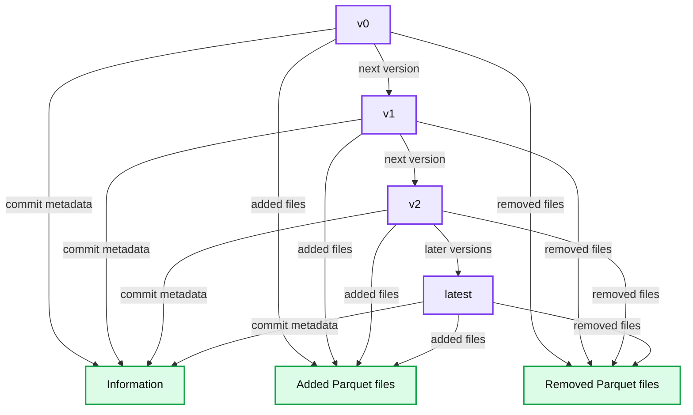
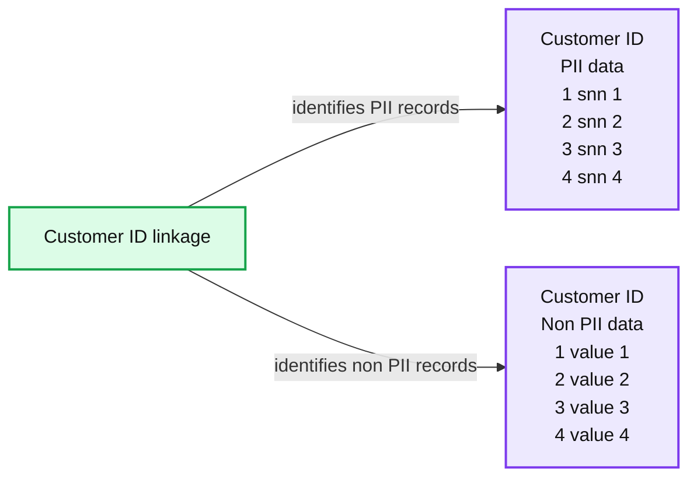

# Implementing the GDPR 'Right to be Forgotten' in Delta Lake

- Source: https://www.databricks.com/blog/2022/03/23/implementing-the-gdpr-right-to-be-forgotten-in-delta-lake.html
- Published: 2022-03-23
- Authors: Milos Colic, Oleksandra Bovkun, Sundararaman Sankaranarayanan
- Categories: engineering, data-engineering
- Images: 3 total, 2 extracted as architecture

[Databricks' Lakehouse](https://www.databricks.com/blog/2020/01/30/what-is-a-data-lakehouse.html) platform empowers organizations to build scalable and resilient data platforms that allow them to drive value from their data. As the amount of data has exploded over the last decades, more and more restrictions have come in place to protect data owners and data companies with regards to data usage. Regulations like [California Consumer Privacy Act](https://oag.ca.gov/privacy/ccpa) (CCPA) and [General Data Protection Regulation](https://ec.europa.eu/info/law/law-topic/data-protection/data-protection-eu_en) (GDPR) emerged, and compliance with these regulations is a necessity. Among other data management and data governance requirements, these regulations require businesses to potentially delete all personal information about a consumer upon request. In this blog post we explore the ways to comply with this requirement while utilizing the Lakehouse architecture with [Delta Lake](https://www.databricks.com/product/delta-lake-on-databricks).

Before we dive deep into the technical details, let’s paint the bigger picture.

## Identity + Data = Idatity

We didn’t invent this term, but we absolutely love it! It merges the two focal points of any organization that operates in the digital space. How to identify their customers - identity, and how to describe their customers - data. The term was originally coined by William James Adams Jr. (more commonly known as will.i.am). The famous rapper first used this term during the World Economic Forum back in 2014 ([see](https://www.economist.com/open-future/2019/01/21/we-need-to-own-our-data-as-a-human-right-and-be-compensated-for-it)). In an attempt to postulate what individuals and organizations will care about in 2019 he said “**Idatity**” - and he was spot on!

Just a few months before the start of 2019, in May 2018, EU General Data Protection Regulation (GDPR) came into effect. To be fair, GDPR was adopted in 2016 but only became enforceable beginning May 25, 2018. This legislation is aimed to help individuals protect their data and define rights one has over their data ([details](https://eur-lex.europa.eu/legal-content/EN/TXT/?uri=CELEX:32016R0679R(02))). A similar act, California Consumer Privacy Act (CCPA) was introduced in the United States in 2018 and came into effect on January 1, 2020.

## Homo digitalis

*This new species thrives in a habitat with omnipresent and permanently connected screens and displays* ([see](https://santanderglobaltech.com/en/from-homo-sapiens-to-homo-digitalis/)).

The data and identity are truly gaining their deserved level of attention. If we observe humans from an Internet of Things angle, we quickly realize that each one of us generates insane amounts of data in each passing second. Our phones, laptops, toothbrushes, toasters, fridges, cars – all of them are devices that emit data. The line between the digital world and the physical world is getting ever more blurred.

 The evolution of Homo Digitalis - santanderglobaltech.com

We as a species are on a journey to transcend the physical world - the first earthly species that left the earth (in a less physical way). Similar to the physical world, rules of engagement are required in order to protect the inhabitants of this brave new digital world.

This is precisely why general data protection regulations such as the aforementioned GDPR and CCPA are crucial to protect data subjects.

## Definition of ‘Personal data’

According to GDPR, [personal data](https://eur-lex.europa.eu/legal-content/EN/TXT/?uri=CELEX%3A02016R0679-20160504&qid=1532348683434) refers to *any information relating to an identified or identifiable natural person (‘data subject’); an identifiable natural person is one who can be identified, directly or indirectly, in particular by reference to an identifier such as a name, an identification number, location data, an online identifier or to one or more factors specific to the physical, physiological, genetic, mental, economic, cultural or social identity of that natural person.*

According to CCPA, [personal data](https://leginfo.legislature.ca.gov/faces/codes_displayText.xhtml?division=3.&part=4.&lawCode=CIV&title=1.81.5) refers to *any information that identifies, relates to, describes, is reasonably capable of being associated with, or could reasonably be linked, directly or indirectly, with a particular consumer or household.*

One thing worth noting is that these legislations aren't exact copies of each other. In the definitions above, we can note that CCPA has a broader definition of what personal data is by referring to a household while GDPR refers to an individual. This doesn't mean that techniques discussed in this article are not applicable to CCPA, it simply means that due to broader application of CCPA further design considerations may be needed.

## The right to be forgotten

The focus of our blog will be on the “[right to be forgotten](https://gdpr.eu/article-17-right-to-be-forgotten/)” (or the “right to erasure”), one of the key issues covered by the general data protection regulations such as the aforementioned GDPR and CCPA. “The right to be forgotten” article regulates the data erasure obligations. According to this article, *personal data must be erased without undue delay [typically within 30 days of receipt of request] where the data are no longer needed for their original processing purpose, the data subject has withdrawn their consent and there is no other legal ground for processing, the data subject has objected and there are no overriding legitimate grounds for the processing, or erasure is required to fulfill a statutory obligation under the EU law or the right of the Member States …* (for full set of obligations [see](https://gdpr-info.eu/issues/right-to-be-forgotten/)).

Is my data used appropriately? Is my data used only while it is needed? Am I leaving data breadcrumbs all over the internet? Can my data end up in the wrong hands? These are indeed serious questions. Scary even. “The right to be forgotten” addresses these concerns and is designed to provide a level of protection to the data subject. In a very simplified way we can read “the right to be forgotten”: we have the right to have our data deleted if the data processor doesn't need it to provide us a service and/or if we have explicitly requested that they delete our data.

## Forget-me-nots are expensive!

Behind our floral arrangement lies a not so hidden message about fines and penalties in case of data protection violations in accordance with GDPR. According to [Art. 83 GDPR](https://gdpr.eu/article-83-conditions-for-imposing-administrative-fines/) the penalties can range from 10 million euros or 2% in case of undertaking (whichever is higher) for less severe violations to 20 million euros or 4% in the case of undertaking for more serious violations ([see](https://gdpr.eu/fines/)). These only include regulator imposed penalties - damage to reputation and brand damage are much harder to quantify. The examples of these regulatory actions are many, for instance, Google got fined $8 million by Sweden’s Data Protection Authority (DPA) back in March 2020 ([see more](https://venturebeat.com/2020/03/11/sweden-fines-google-8-million-for-right-to-be-forgotten-violations-and-demands-it-keep-websites-in-the-dark/)) for the improper disposal of search result links.

In the world of big data, enforcement of GDPR, or in our case, “the right to be forgotten” can be a massive challenge. However, the risks attached to it are simply too high for any organization to ignore this use case for their data.

## ACID + Time Travel = Law abiding data

We believe that [Delta](https://delta.io/) is the gold standard format for storing data in the [Databricks Lakehouse](https://www.databricks.com/blog/2020/01/30/what-is-a-data-lakehouse.html) platform. With it, we can guarantee that our data is stored with good governance and performance in mind. Delta helps that tables in our Delta lake (lakehouse storage layer) are ACID (atomic, consistent, isolated, durable).

On top of bringing the consistency and governance of data warehouses to the lakehouse, Delta allows us to maintain the version history of our tables. Every atomic operation on top of a Delta table will result in a new version of the table. Each version will contain information about the data commit and the parquet files that are added/removed in this version ([see](https://www.databricks.com/blog/2019/08/21/diving-into-delta-lake-unpacking-the-transaction-log.html)). These versions can be referenced via the version number or by the logical timestamp. Moving between versions is what we refer to as [“Delta Time Travel”](https://www.databricks.com/blog/2019/02/04/introducing-delta-time-travel-for-large-scale-data-lakes.html). Check out a [hands-on demo](https://www.youtube.com/watch?v=o-zcZvfSUyI) if you’d like to learn more about Delta Time Travel.

*Versions of a delta table*

**Summary:** The diagram shows successive Delta Lake table versions, each associated with commit information, added Parquet files, and removed Parquet files.

**Components:**

- Delta table versions: v0, v1, v2, and latest
- Commit information: Delta transaction log metadata
- Added Parquet part files: durable table data
- Removed Parquet files: files logically removed from the table

**Flows:**

- v0 -> v1: table version progression
- v1 -> v2: table version progression
- v2 -> latest: table version progression
- Each version -> Information: commit metadata
- Each version -> Added files: added Parquet part files
- Each version -> Removed files: removed Parquet part files

**Numbers:** v0, v1, v2

source image: https://www.databricks.com/wp-content/uploads/2022/03/db-39-blog-img-1.jpg

 Versions of a delta table

Having our data well maintained and using technologies that operate with the data/tables in an atomic manner can be of critical importance for GDPR compliance. Such technologies perform writes in a coherent manner - either all resulting rows are written out or data remains unchanged - this effectively avoids data leakage due to partial writes.

While Delta Time Travel is a powerful tool, it still should be used within the domain of reason. Storing a history that is too long can cause performance degradation. This can happen both due to accumulation of too much data and metadata required for version control.

Let’s look at some of the potential approaches to implementing the “right to be forgotten” requirement on your data lake. Although the focus of this blog post is mainly on Delta lake, it’s essential to have proper mechanisms in place to make all components of the data platform compliant with regulations. As most of the data resides in the cloud storage, setting up retention policies is one of the best practices.

## Approach 1 - Data Amnesia

With Delta, we have one more tool at our disposal to address GDPR compliance and, in particular, “the right to be forgotten” - [VACUUM.](https://docs.delta.io/latest/delta-utility.html#remove-files-no-longer-referenced-by-a-delta-table) Vacuum operation removes the files that are no longer needed and that are older than a predefined retention period. The default retention period is 30 days to align with GDPR definition of undue delay. Our earlier [blog](https://www.databricks.com/blog/2019/12/18/make-your-data-lake-ccpa-compliant.html) on a similar topic explains in detail how you can find and delete personal information related to a consumer by running two commands:

 Different layers in the medallion architecture may have different retention periods associated with their Delta tables.

With Vacuum, we permanently remove data that requires erasure from our Delta table. However, Vacuum removes all the versions of our table that are older than the retention period. This leaves us in a situation of digital obsolescence - data amnesia. We have effectively removed the data we needed to, but in the process we have deleted the evolutionary lineage of our table. In simple terms, we have limited our ability to time travel through the history of our Delta tables.

This reduces our ability to retain the audit trail of the data transformations that were performed on our Delta tables. Can’t we just have both the erasure assurance and audit trail? Let’s look into other possibilities.

## Approach 2 - Anonymization

Another way of defining “deletion of data” is transforming the data in a way that cannot be reversed. This way the original data is destroyed but our ability to extract statistical information will be preserved. If we observe “the right to be forgotten” requirement from this angle, we can apply transformations to the data so that the person cannot be identified by the information obtained after these transformations. During the decades of software practices, more and more sophisticated techniques were developed to anonymise data. While anonymization is a widely used approach, it has some downsides.

The main challenge with anonymization is that it should be part of the engineering practices from the very beginning. Introducing it at later stages leads to inconsistent state of the data storage with the possibility that highly sensitive data is made available for the broad audience by mistake. This approach will work fine with small (in terms of number of columns) datasets and when applied from the very beginning of the development process.

## Approach 3 - Pseudonymization/Normalized tables

Normalizing tables is a common practice in the relational database world. We all have heard about [six commonly used normalized forms](https://mariadb.com/kb/en/database-normalization/) (or at least a subset of them). In the area of data warehouses this approach evolved into dimensional data modeling, when data is not strictly normalized but presented in a form of facts and dimensions. Within the domain of big data technologies, normalization became a less widely used tool.

In the case of "the right to be forgotten” requirement, normalization (or [pseudonymization](https://docs.databricks.com/security/privacy/gdpr-delta.html#pseudonymize-data)) can actually lead to a possible solution. Let’s imagine a Delta table that contains ‘personally identifiable information’ (PII) columns and data (not PII) columns. Rather than deleting all records we can split the table into two:

- PII table that contains sensitive data
- All other data that is not sensitive and loses its ability to identify a person without the other table

In this case, we can still apply the approach of “data amnesia” to the first table and keep the main dataset intacted. This approach has the following benefits:

- It’s reasonably easy to implement
- It gives the possibility to keep the most of the data available for reuse (for instance for the ML models) while being compliant with regulations

*Split PII and non-PII tables*

**Summary:** The diagram shows customer data split into separate PII and non-PII tables linked by Customer ID.

**Components:**

- PII table with Customer ID and PII data
- Non-PII table with Customer ID and Non PII data

**Flows:**

- Customer ID linkage -> PII table: identifies corresponding PII records
- Customer ID linkage -> Non-PII table: identifies corresponding non-PII records

**Numbers:** 1, 2, 3, 4, snn 1, snn 2, snn 3, snn 4, value 1, value 2, value 3, value 4

source image: https://www.databricks.com/wp-content/uploads/2022/03/db-39-blog-img-2.png

 Split PII and non-PII tables

While it sounds like a good approach, we should also consider the downside of it. Normalization/Pseudonymization comes hand in hand with the necessity to join datasets, which leads to unexpected costs and performance penalties. When normalization means splitting one table into two, this approach might be reasonable, but without control it can easily go into multiple tables just to get simple information from the dataset. Also splitting tables in PII and non-PII data can quickly lead to doubling of the number of tables and causing data governance hell.

Another caveat to keep in mind is: without control, it introduces ambiguity in data structure. Say for example, you need to extend your data with a new column, where are you going to add it: to the PII and non-PII table?

This approach works the best if the organization is already using normalized datasets, either with Delta or migrating to Delta. If the normalization is already a part of data layout, then implementing “data amnesia” to only PII data is a logical approach.
