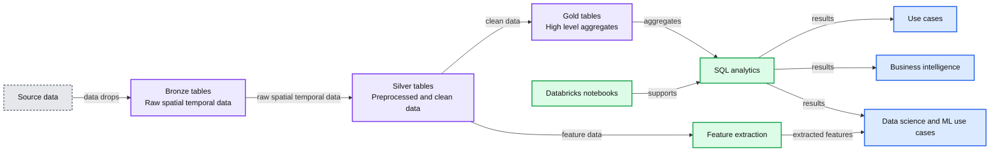
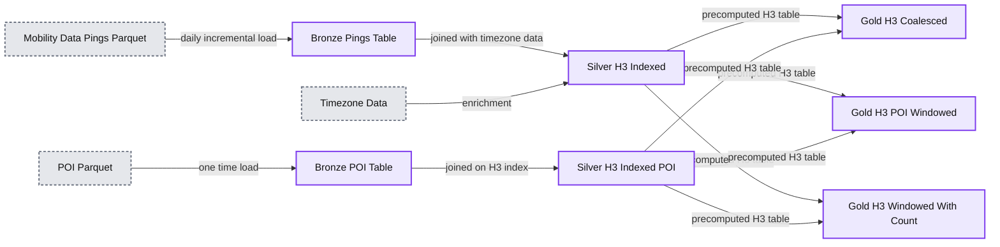

# Building a Geospatial Lakehouse, Part 2

*One system, unified architecture design, all functional teams, diverse use cases *

- Source: https://www.databricks.com/blog/2022/03/28/building-a-geospatial-lakehouse-part-2.html
- Published: 2022-03-28
- Authors: Alex Barreto, Yong Sheng Huang, Jake Therianos
- Categories: engineering, data-science-machine-learning
- Images: 5 total, 2 extracted as architecture

This blog is outdated. Please refer to [this Spatial SQL blog](https://www.databricks.com/blog/introducing-spatial-sql-databricks-80-functions-high-performance-geospatial-analytics) for up-to-date approaches to storing and processing geospatial data within your Databricks Lakehouse.

In [Part 1 of this two-part series on how to build a Geospatial Lakehouse](https://www.databricks.com/blog/2021/12/17/building-a-geospatial-lakehouse-part-1.html), we introduced a reference architecture and design principles to consider when building a Geospatial Lakehouse. The Lakehouse paradigm combines the best elements of data lakes and data warehouses. It simplifies and standardizes data engineering pipelines for enterprise-based on the same design pattern. Structured, semi-structured, and unstructured data are managed under one system, effectively eliminating data silos.

In Part 2, we focus on the practical considerations and provide guidance to help you implement them. We present an example reference implementation with sample code, to get you started.

## Design Guidelines

To realize the benefits of the Databricks Geospatial Lakehouse for processing, analyzing, and visualizing geospatial data, you will need to:

1. **Define** and **break-down** your **geospatial-driven problem**. What problem are you solving? Are you analyzing and/or modeling in-situ location data (e.g., map vectors aggregated with satellite TIFFs) to aggregate with, for example, time-series data (weather, soil information)? Are you seeking insights into or modeling movement patterns across geolocations (e.g., device pings at points of interest between residential and commercial locations) or multi-party relationships between these? Depending on your workload, each use case will require different underlying geospatial libraries and tools to process, query/model and render your insights and predictions.
2. **Decide** on the **data format standards**. Databricks recommends Delta Lake format based on the open Apache Parquet format for your Geospatial data. Delta comes with data skipping and Z-ordering, which are particularly well suited for geospatial indexing (such as geohashing, hexagonal indexing), bounding box min/max x/y generated columns, and geometries (such as those generated by Sedona, Geomesa). A shortlist of these standards you will allow you to better best understand the minimal viable pipeline needed.
3.

**Know** and **scope** the **volumes**, **timeframes** and use cases required for:

  - **raw data** and **data processing** at the Bronze layer
  - **analytics** at the Silver and Gold layers
  - **modeling** at the Gold layers and beyond

Geospatial analytics and modeling performance and scale depend greatly on format, transforms, indexing and metadata decoration. Data windowing can be applicable to geospatial and other use cases, when windowing and/or querying across broad timeframes overcomplicates your work without any analytics/modeling value and/or performance benefits. Geospatial data is rife with enough challenges around frequency, volume, the lifecycle of formats throughout the data pipeline, without adding very expensive, grossly inefficient extractions across these.

4. **Select** from a **shortlist** of **recommended libraries**, **technologies** and **tools** optimized for Apache Spark; those targeting your data format standards together with the defined problem set(s) to be solved. Consider whether the data volumes being processed in each stage and run of your data analytics and modeling can fit into memory or not. Consider what types of queries you will need to run (e.g., range, spatial join, kNN, kNN join, etc.) and what types of training and production algorithms you will need to execute, together with Databricks recommendations, to understand and choose how to best support these.
5. **Define**, **design** and **implement** the logic to process your **multi-hop pipeline**. For example, with your Bronze tables for mobility and POI data, you can generate geometries from your raw data and decorate these with a first order partitioning schema (such as a suitable “region” superset of postal code/district/US-county, subset of province/US-state) together with secondary/tertiary partitioning (such as hexagonal index). With Silver tables, you can focus on additional orders of partitioning, applying Z-ordering, and further optimizing with Delta OPTIMIZE + VACUUM. For Gold, you can consider data coalescing, windowing (where applicable, and across shorter, contiguous timeframes), and LOB segmentation together with further Delta optimizations specific to these tighter data sets. You also may find you need a further post-processing layer for your Line of Business (LOB) or data science/ML users. With each layer, **validate** these optimizations and understand their applicability.
6. Leverage Databricks **SQL Analytics** for your top layer consumption of your Geospatial Lakehouse.
7. **Define** the **orchestration** to drive your pipeline, with **idempotency** in mind. Start with a simple notebook that calls the notebooks implementing your raw data ingestion, Bronze=>Silver=>Gold layer processing, and any post-processing needed. Assure that any component of your pipeline can be idempotently executed and debugged. Elaborate from there only as necessary. Integrate your orchestrations into you management and monitoring and CI/CD ecosystem as simply and minimally as possible.
8. **Apply** the distributed programming **observability** paradigm - the Spark UI, MLflow experiments, Spark and MLflow logs, metrics, and even more logs - for troubleshooting issues. If you have applied the previous step correctly, this is a straightforward process. There is no “easy button” to magically solve issues in distributed processing you need good old fashioned distributed software debugging, **reading logs**, and using other **observability tools**. Databricks offers self-paced and instructor-led trainings to guide you if needed.
From here, configure your end-to-end data and ML pipeline to monitor these logs, metrics, and other observability data and reflect and report these. There is more depth on these topics available in the [Databricks Machine Learning blog](https://www.databricks.com/blog/2021/05/27/introducing-databricks-machine-learning-a-data-native-collaborative-full-ml-lifecycle-solution.html) along with [Drifting Away: Testing ML models in Production](https://www.databricks.com/session_na21/drifting-away-testing-ml-models-in-production) and [AutoML Toolkit - Deep Dive](https://www.databricks.com/session_na20/automl-toolkit-deep-dive) from 2021’s Data + AI Summit.

## Implementation considerations

### Data pipeline

For your Geospatial Lakehouse, in the Bronze Layer, we recommend landing raw data in their “original fidelity” format, then standardizing this data into the most workable format, cleansing then decorating the data to best utilize Delta Lake’s data skipping and compaction optimization capabilities. In the Silver Layer, we then incrementally process pipelines that load and join high cardinality data, multi-dimensional cluster and+ grid indexing, and decorating the data further with relevant metadata to support highly-performant queries and effective data management. These are the prepared tables/views of effectively queryable geospatial data in a standard, agreed taxonomy. For Gold, we provide segmented, highly-refined data sets from which data scientists develop and train their models and data analysts glean their insights, which are optimized specifically for their use cases. These tables carry LOB specific data for purpose built solutions in data science and analytics.

Putting this together for your Databricks Geospatial Lakehouse: There is a progression from raw, easily transportable formats to highly-optimized, manageable, multidimensionally clustered and indexed, and most easily queryable and accessible formats for end users.

### Queries

Given the plurality of business questions that geospatial data can answer, it’s critical that you choose the technologies and tools that best serve your requirements and use cases. To best inform these choices, you must evaluate the types of geospatial queries you plan to perform.

The **principal geospatial query types** include:

- Range-search query
- Spatial-join query
- Spatial k-nearest-neighbor query (kNN query)
- Spatial k-nearest-neighbor join query (kNN-join query)
- Spatio-textual operations

Libraries such as GeoSpark/Sedona support range-search, spatial-join and kNN queries (with the help of UDFs), while GeoMesa (with Spark) and LocationSpark support range-search, spatial-join, kNN and kNN-join queries.

### Partitioning

It is a well-established pattern that data is first queried coarsely to determine broader trends. This is followed by querying in a finer-grained manner so as to isolate everything from data hotspots to machine learning model features.

This pattern applied to spatio-temporal data, such as that generated by geographic information systems (GIS), presents several challenges. Firstly, the data volumes make it prohibitive to index broadly categorized data to a high resolution (see the next section for more details). Secondly, geospatial data defies uniform distribution regardless of its nature -- geographies are clustered around the features analyzed, whether these are related to points of interest (clustered in denser metropolitan areas), mobility (similarly clustered for foot traffic, or clustered in transit channels per transportation mode), soil characteristics (clustered in specific ecological zones), and so on. Thirdly, certain geographies are demarcated by multiple timezones (such as Brazil, Canada, Russia and the US), and others (such as China, Continental Europe, and India) are not.

It’s difficult to avoid data skew given the lack of uniform distribution unless leveraging specific techniques. Partitioning this data in a manner that reduces the standard deviation of data volumes across partitions ensures that this data can be processed horizontally. **We recommend** to first **grid index** (in our use case, **geohash**) raw spatio-temporal data based on **latitude and longitude coordinates**, which **groups** the indexes based on data density rather than logical geographical definitions; then partition this data based on the lowest grouping that reflects the most evenly distributed data shape as an effective data-defined **region**, while still decorating this data with logical geographical definitions. Such regions are defined by the number of data points contained therein, and thus can represent everything from large, sparsely populated rural areas to smaller, densely populated districts within a city, thus serving as a partitioning scheme better distributing data more uniformly and avoiding data skew.

At the same time, Databricks is developing a library, known as Mosaic, to standardize this approach; see our blog [*Efficient Point in Polygons via PySpark and BNG Geospatial Indexing*](https://www.databricks.com/blog/2021/10/11/efficient-point-in-polygon-joins-via-pyspark-and-bng-geospatial-indexing.html), which covers the approach we used. An extension to the [Apache Spark](https://spark.apache.org/) framework, Mosaic allows easy and fast processing of massive geospatial datasets, which includes built in indexing applying the above patterns for performance and scalability.

### Geolocation fidelity:

In general, the **greater the geolocation fidelity** (resolutions) used for indexing geospatial datasets, the more **unique index values** will be generated. Consequently, the data volume itself post-indexing can dramatically increase by orders of magnitude. For example, increasing resolution fidelity from 24000ft2 to 3500ft2 increases the number of possible unique indices from 240 billion to 1.6 trillion; from 3500ft2 to 475ft2 increases the number of possible unique indices from 1.6 trillion to 11.6 trillion.

We should always step back and question the necessity and value of high-resolution, as their practical applications are really limited to highly-specialized use cases. For example, consider **POIs**; on average these range from 1500-4000ft2 and can be sufficiently captured for analysis well below the highest resolution levels; analyzing traffic at higher resolutions (covering 400ft2, 60ft2 or 10ft2) will only require greater cleanup (e.g., coalescing, rollup) of that traffic and exponentiates the unique index values to capture. With mobility + POI data analytics, you will **in all likelihood never need** resolutions beyond **3500ft2**

For another example, consider **agricultural analytics**, where relatively smaller land parcels are densely outfitted with sensors to determine and understand fine grained soil and climatic features. Here the **logical zoom** lends the use case to **applying higher resolution indexing**, given that each point’s **significance** will be **uniform**.

If a valid use case calls for high geolocation fidelity, **we recommend only applying higher resolutions to subsets of data filtered by specific, higher level classifications, such as those partitioned uniformly by data-defined region** (as discussed in the previous section). For example, if you find a particular POI to be a hotspot for your particular features at a resolution of 3500ft2, it may make sense to increase the resolution for that POI data subset to 400ft2 and likewise for similar hotspots in a manageable geolocation classification, while maintaining a relationship between the finer resolutions and the coarser ones on a case-by-case basis, all while broadly partitioning data by the region concept we discussed earlier.

### Geospatial library architecture & optimization:

Geospatial libraries vary in their designs and implementations to run on Spark. The bases of these factors greatly into performance, scalability and optimization for your geospatial solutions.

Given the commoditization of cloud infrastructure, such as on Amazon Web Services (AWS), Microsoft Azure Cloud (Azure), and Google Cloud Platform (GCP), geospatial frameworks may be designed to take advantage of scaled cluster memory, compute, and or IO. Libraries such as GeoSpark/Apache Sedona are designed to favor cluster **memory**; using them naively, you may experience memory-bound behavior. These technologies may require data repartition, and cause a large volume of data being sent to the driver, leading to performance and stability issues. Running queries using these types of libraries are better suited for experimentation purposes on smaller datasets (e.g., lower-fidelity data). Libraries such as Geomesa are designed to favor cluster **IO**, which use multi-layered indices in persistence (e.g., Delta Lake) to efficiently answer geospatial queries, and well suit the Spark architecture at scale, allowing for large-scale processing of higher-fidelity data. Libraries such as sf for R or GeoPandas for Python are optimized for a range of queries operating on a single machine, better used for smaller-scale experimentation with even lower-fidelity data.

At the same time, Databricks is actively developing a library, known as Mosaic, to standardize this approach. An extension to the Spark framework, Mosaic provides native integration for easy and fast processing of very large geospatial datasets. It includes built-in geo-indexing for high performance queries and scalability, and encapsulates much of the data engineering needed to generate geometries from common data encodings, including the well-known-text, well-known-binary, and JTS Topology Suite (JTS) formats.

See our blog on [Efficient Point in Polygons via PySpark and BNG Geospatial Indexing](https://www.databricks.com/blog/2021/10/11/efficient-point-in-polygon-joins-via-pyspark-and-bng-geospatial-indexing.html) for more on the approach.

### Rendering:

What data you plan to render and how you aim to render them will drive choices of libraries/technologies. We must consider how well rendering libraries suit distributed processing, large data sets; and what input formats (GeoJSON, H3, Shapefiles, WKT), interactivity levels (from none to high), and animation methods (convert frames to mp4, native live animations) they support. Geovisualization libraries such as **kepler.gl**, **plotly** and **deck.gl** are well suited for rendering large datasets quickly and efficiently, while providing a high degree of interaction, native animation capabilities, and ease of embedding. Libraries such as **folium** can render large datasets with more limited interactivity.

### Language and platform flexibility:

Your data science and machine learning teams may write code principally in Python, R, Scala or SQL; or with another language entirely. In selecting the libraries and technologies used with implementing a Geospatial Lakehouse, we need to think about the core language and platform competencies of our users. Libraries such as Geospark/Apache Sedona and Geomesa support **PySpark**, **Scala** and **SQL**, whereas others such as Geotrellis support Scala only; and there are a body of **R** and **Python** packages built upon the C **Geospatial Data Abstraction Library (GDAL)**.

## Example implementation using mobility and point-of-interest data

### Architecture

As presented in Part 1, the general architecture for this Geospatial Lakehouse example is as follows:

*Diagram 1*

**Summary:** The diagram shows a geospatial data pipeline from source data through Bronze, Silver, and Gold tables to SQL analytics and downstream use cases.

**Components:**

- POI data
- CBG data
- Sensor data
- Mobile pings data
- Map and satellite imagery
- Bronze tables with raw spatial temporal data
- Silver tables with preprocessed and clean data
- Feature extraction
- Gold tables with high-level aggregates
- SQL analytics
- Databricks notebooks
- Use cases
- Business intelligence
- Data science and ML use cases

**Flows:**

- POI data -> Bronze tables: POI data drops
- CBG data -> Bronze tables: CBG data
- Sensor data -> Bronze tables: sensor data
- Mobile pings data -> Bronze tables: mobile pings
- Map and satellite imagery -> Bronze tables: imagery
- Bronze tables -> Silver tables: raw spatial temporal data
- Silver tables -> Gold tables: preprocessed and clean data
- Silver tables -> Feature extraction: feature data
- Gold tables -> SQL analytics: high-level aggregates
- SQL analytics -> Use cases: analytical results
- SQL analytics -> Business intelligence: analytical results
- SQL analytics -> Data science and ML use cases: analytical results
- Feature extraction -> Data science and ML use cases: extracted features

**Numbers:** none

source image: https://www.databricks.com/wp-content/uploads/2022/03/db-21-blog-img-1.jpg

Diagram 1

Applying this architectural design pattern to our previous example use case, we will implement a reference pipeline for ingesting two example geospatial datasets, point-of-interest ([Safegraph](https://www.safegraph.com/)) and mobile device pings ([Veraset](https://www.veraset.com/)), into our Databricks Geospatial Lakehouse. We primarily focus on the three key stages – Bronze, Silver, and Gold.

*Diagram 2*

**Summary:** A Bronze-Silver-Gold Delta Lake pipeline ingests mobility pings and POI data, enriches them with timezone and H3 indexing, and produces precomputed geospatial serving tables.

**Components:**

- Mobility Data Pings Parquet - raw external input
- POI Parquet - raw external input
- Bronze `us_pings_by_date` - Delta Lake table partitioned by UTC date and organized by H3 index
- Bronze `cleansed_safegraph_poi` - Delta Lake table partitioned by region
- Timezone data - enrichment data
- Silver `silver_h3_indexed` - Delta Lake table joining POIs and pings at H3 resolution 12
- Silver `h3_indexed_safegraph_poi` - Delta Lake table partitioned by region and Z-ordered by H3 index
- Gold `gold_h3_coalesced` - serving table with H3 index rollup by uplevelled geolocation
- Gold `gold_h3_poi_windowed` - serving table with H3 index and ID rollup by time window
- Gold `gold_h3_windowed_with_count` - serving table with H3 index and ID rollup by count and daily windows
- Notebook workflows - pipeline processing
- Pipeline - orchestration

**Flows:**

- Mobility Data Pings Parquet -> `us_pings_by_date`: daily incremental load
- POI Parquet -> `cleansed_safegraph_poi`: one-time load
- `us_pings_by_date` -> `silver_h3_indexed`: joined with timezone data
- `cleansed_safegraph_poi` -> `h3_indexed_safegraph_poi`: joined on H3 index
- `silver_h3_indexed` -> `gold_h3_coalesced`: precomputed resolution 12 H3 table for each POI
- `silver_h3_indexed` -> `gold_h3_poi_windowed`: precomputed resolution 12 H3 indexed table for each POI
- `silver_h3_indexed` -> `gold_h3_windowed_with_count`: precomputed resolution 12 H3 indexed table for each POI
- `h3_indexed_safegraph_poi` -> `gold_h3_coalesced`: precomputed resolution 12 H3 table for each POI
- `h3_indexed_safegraph_poi` -> `gold_h3_poi_windowed`: precomputed resolution 12 H3 indexed table for each POI
- `h3_indexed_safegraph_poi` -> `gold_h3_windowed_with_count`: precomputed resolution 12 H3 indexed table for each POI
- Notebook workflows -> Bronze, Silver, and Gold tables: notebook workflows
- Pipeline -> Bronze, Silver, and Gold tables: pipeline orchestration

**Numbers:** 2 datasets, Bronze, Silver, Gold, daily, one-time, H3 resolution 12, 3 Gold tables, 2 notebook workflow markers, 3 pipeline markers

source image: https://www.databricks.com/wp-content/uploads/2022/03/db-21-blog-img-2.jpg

Diagram 2

As per the aforementioned approach, architecture, and design principles, we used a combination of Python, Scala and SQL in our example code.

We next walk through each stage of the architecture.

### Raw Data Ingestion:

We start by loading a sample of raw Geospatial data point-of-interest (POI) data. This POI data can be in any number of formats. In our use case, it is CSV.

### Bronze Tables: Unstructured, proto-optimized ‘semi raw’ data

For the Bronze Tables, we transform raw data into **geometries** and then clean the geometry data. Our example use case includes ***pings*** (GPS, mobile-tower triangulated device pings) with the raw data indexed by geohash values. We then apply UDFs to transform the WKTs into geometries, and index by geohash ‘regions’.

### Silver Tables: Optimized, structured & fixed schema data

For the Silver Tables, we recommend incrementally processing pipelines that load and join high-cardinality data, indexing and decorating the data further to support highly-performant queries. In our example, we used ***pings*** from the Bronze Tables above, then we aggregated and transformed these with ***point-of-interest (POI) data*** and **hex-indexed** these data sets using H3 queries to write Silver Tables using Delta Lake. These tables were then partitioned by region, postal code and Z-ordered by the H3 indices. We also processed US Census Block Group (CBG) data capturing US Census Bureau profiles, indexed by GEOID codes to aggregate and transform these codes using Geomesa to generate geometries, then hex-indexed these aggregates/transforms using H3 queries to write additional Silver Tables using Delta Lake. These were then partitioned and Z-ordered similar to the above. These Silver Tables were optimized to support fast queries such as “find all device pings for a given POI location within a particular time window,” and “coalesce frequent pings from the same device + POI into a single record, within a time window.”

### Gold Tables: Highly-optimized, structured data with evolving schema

For the Gold Tables, respective to our use case, we effectively a) sub-queried and further coalesced frequent pings from the Silver Tables to produce a next level of optimization b) decorated coalesced pings from the Silver Tables and window these with well-defined time intervals c) aggregated with the CBG Silver Tables and transform for modelling/querying on CBG/ACS statistical profiles in the United States. The resulting Gold Tables were thus refined for the line of business queries to be performed on a daily basis together with providing up to date training data for machine learning.

## Results

For a practical example, we applied a use case ingesting, aggregating and transforming mobility data in the form of geolocation ***pings*** (providers include Veraset, Tamoco, Irys, inmarket, Factual) with ***point of interest (POI)*** data (providers include Safegraph, AirSage, Factual, Cuebiq, Predicio) and with US Census Bureau Group (CBG) and American Community Survey (ACS), to model POI features vis-a-vis traffic, demographics and residence.

### Bronze Tables: Unstructured, proto-optimized ‘semi raw’ data

We found that the sweet spot for loading and processing of historical, raw mobility data (which typically is in the range of 1-10TB) is best performed on large clusters (e.g., a dedicated 192-core cluster or larger) over a shorter elapsed time period (e.g., 8 hours or less). Cluster sharing other workloads is ill-advised as loading Bronze Tables is one of the most resource intensive operations in any Geospatial Lakehouse. One can reduce DBU expenditure by a factor of 6x by dedicating a large cluster to this stage. Of course, results will vary depending upon the data being loaded and processed.

### Silver Tables: Optimized, structured & fixed schema data

While H3 indexing and querying performs and scales out far better than non-approximated point in polygon queries, it is often tempting to apply hex indexing resolutions to the extent it will overcome any gain. With mobility data, as used in our example use case, we found our “80/20” H3 resolutions to be 11 and 12 for effectively “zooming in” to the finest grained activity. H3 resolution 11 captures an average hexagon area of **2150m2/3306ft2**; 12 captures an average hexagon area of **307m2/3305ft2**. For reference regarding POIs, an average Starbucks coffeehouse has an area of **186m2/2000m2**; an average Dunkin’ Donuts has an area of **242m2/2600ft2**; and an average Wawa location has an area of **372m2/4000ft2**. H3 resolution 11 captures up to 237 billion unique indices; 12 captures up to 1.6 trillion unique indices. Our findings indicated that the balance between H3 index data explosion and data fidelity was best found at resolutions 11 and 12.

Increasing the resolution level, say to 13 or 14 (with average hexagon areas of 44m2/472ft2 and 6.3m2/68ft2), one finds the exponentiation of H3 indices (to 11 trillion and 81 trillion, respectively) and the resultant storage burden plus performance degradation far outweigh the benefits of that level of fidelity.

Taking this approach has, from experience, led to total Silver Tables capacity to be in the 100 trillion records range, with disk footprints from 2-3 TB.

### Gold Tables: Highly-optimized, structured data with evolving schema

In our example use case, we found the pings data as bound (spatially joined) within POI geometries to be somewhat noisy, with what effectively were redundant or extraneous pings in certain time intervals at certain POIs. To remove the data skew these introduced, we aggregated pings within narrow time windows in the same POI and high resolution geometries to reduce noise, decorating the datasets with additional partition schemes, thus providing further processing of these datasets for frequent queries and EDA. This approach reduces the capacity needed for Gold Tables by 10-100x, depending on the specifics. While may need a plurality of Gold Tables to support your Line of Business queries, EDA or ML training, these will greatly reduce the processing times of these downstream activities and outweigh the incremental storage costs.

### For visualizations, we rendered specific analytics and modelling queries from selected Gold Tables to best reflect specific insights and/or features, using **kepler.gl**

With kepler.gl, we can quickly render millions to billions of points and perform spatial aggregations on the fly, visualizing these with different layers together with a high degree of interactivity.

You can render multiple resolutions of data in a reductive manner -- execute broader queries, such as those across regions, at a lower resolution.

#### Below are some examples of the renderings across different layers with kepler.gl:

Here we use a set of coordinates of NYC (The Alden by Central Park West) to produce a hex index at resolution 6. We can then find all the children of this hexagon with a fairly fine-grained resolution, in this case, resolution 11:

Diagram 3

Next, we query POI data for Washington DC postal code 20005 to demonstrate the relationship between polygons and H3 indices; here we capture the polygons for various POIs as together with the corresponding hex indices computed at resolution 13. Supporting data points include attributes such as the location name and street address:

Diagram 4

Zoom in at the location of the National Portrait Gallery in Washington, DC, with our associated polygon, and overlapping hexagons at resolutions 11, 12 and 13 B, C; this illustrates how to break out polygons from individuals hex indexes to constrain the total volume of data used to render the map.

Diagram 5

You can explore and validate your points, polygons, and hexagon grids on the map in a Databricks notebook, and create similarly useful maps with these.

## Technologies

For our example use cases, we used GeoPandas, Geomesa, H3 and KeplerGL to produce our results. In general, you will expect to use a combination of either GeoPandas, with Geospark/Apache Sedona or Geomesa, together with H3 + kepler.gl, plotly, folium; and for raster data, Geotrellis + Rasterframes.

Below we provide a list of geospatial technologies integrated with Spark for your reference:

- Ingestion
  - [GeoPandas](https://geopandas.org/)
    - Simple, easy to use and robust ingestion of formats from ESRI ArcSDE, PostGIS, Shapefiles through to WKBs/WKTs
    - Can scale out on Spark by ‘manually’ partitioning source data files and running more workers
  - [GeoSpark/Apache Sedona](https://sedona.apache.org/)
    - GeoSpark is the original Spark 2 library; Sedona (in incubation with the Apache Foundation as of this writing), the Spark 3 revision
    - GeoSpark ingestion is straightforward, well documented and works as advertised
    - Sedona ingestion is WIP and needs more real world examples and documentation
  - [GeoMesa](https://www.geomesa.org/)
    - Spark 2 & 3
    - GeoMesa ingestion is generalized for use cases beyond Spark, therefore it requires one to understand its architecture more comprehensively before applying to Spark. It is well documented and works as advertised.
  - [CARTO's Spatial Extension for Databricks](https://carto.com/databricks/spatial-extension/)
    - Spark 3
    - Provides import optimizations and tooling for Databricks for common spatial encodings, including geoJSON, Shapefiles, KML, CSV, and GeoPackages
    - Scala API
  - Databricks Mosaic (to be released)
    - Spark 3
    - This project is currently under development. More details on its ingestion capabilities will be available upon release.
    - Easy conversion between common spatial encodings
    - Python, Scala and SQL APIs
- Geometry processing
  - [GeoSpark/Apache Sedona](https://sedona.apache.org/)
    - GeoSpark is the original Spark 2 library; Sedona (in incubation with the Apache Foundation as of this writing), the Spark 3 revision
    - As with ingestion, GeoSpark is well documented and robust
    - As with in
    - RDDs and Dataframes
    - Bi-level spatial indexing
    - Range joins, Spatial joins, KNN queries
    - Python, Scala and SQL APIs
  - [GeoMesa](https://www.geomesa.org/)
    - Spark 2 & 3
    - RDDs and Dataframes
    - Tri-level spatial indexing via global grid
    - Range joins, Spatial joins, KNN queries, KNN joins
    - Python, Scala and SQL APIs
  - [CARTO's Spatial Extension for Databricks](https://carto.com/databricks/spatial-extension/)
    - Spark 3
    - Provides UDFs that leverage [Geomesa’s SparkSQL](https://www.geomesa.org/documentation/stable/user/spark/sparksql_functions.html) geospatial capabilities in your Databricks cluster
    - Scala API
  - Databricks Mosaic (to be released)
    - Spark 3
    - This project is currently under development. More details on its geometry processing capabilities will be available upon release.
    - Optimizations for performing point-in-polygon joins [co-developed with Ordnance Survey](https://www.databricks.com/blog/2021/10/11/efficient-point-in-polygon-joins-via-pyspark-and-bng-geospatial-indexing.html)
    - Python, Scala and SQL APIs
- Raster map processing
  - [Geotrellis](https://geotrellis.io/documentation)
    - Spark 2 & 3
    - RDDs
    - Cropping, Warping, Map Algebra
    - Scala APIs
  - [Rasterframes](https://rasterframes.io/raster-join.html)
    - Spark 2, active Spark 3 branch
    - Dataframes
    - Map algebra, Masking, Tile aggregation, Time series, Raster joins
    - Python, Scala, and SQL APIs
- Grid/Hexagonal indexing and querying
  - [H3](https://h3geo.org/)
    - Compatible with Spark 2, 3
    - C core
    - Scala/Java, Python APIs (along with bindings for JavaScript, R, Rust, Erlang and many other languages)
    - KNN queries, Radius queries
  - Databricks Mosaic (to be released)
    - Spark 3
    - This project is currently under development. More details on its indexing capabilities will be available upon release.
- Visualization
  - [Kepler.gl](https://kepler.gl/) - Python, Scala
  - [Plotly](https://plotly.com/python/) - Python, Scala
  - [Folium](http://python-visualization.github.io/folium/) - Python
  - [CARTO Cartoframes](https://carto.com/developers/cartoframes/) - Python
  - Databricks Mosaic (to be released)
    - Native integration with [Kepler.gl](https://kepler.gl/)

We will continue to add to this list and technologies develop.

## Downloadable notebooks

For your reference, you can download the following example notebook(s)

1. [Raw to Bronze processing of Geometries](https://www.databricks.com/wp-content/uploads/notebooks/geospatial-part2/01_Raw_to_Bronze_Safegraph_Geometries.html): Notebook with example of simple ETL of Pings data incrementally from raw parquet to bronze table with new columns added including H3 indexes, as well as how to use Scala UDFs in Python, which then runs incremental load from Bronze to Silver Tables and indexes these using H3
2. [Silver Processing of datasets with geohashing](https://www.databricks.com/wp-content/uploads/notebooks/geospatial-part2/02_Bronze_to_Silver_H3_Indexed.html): Notebook that shows example queries that can be run off of the Silver Tables, and what kind of insights can be achieved at this layer
3. [Silver to Gold processing](https://www.databricks.com/wp-content/uploads/notebooks/geospatial-part2/03_Silver_to_Gold_Coalesced.html): Notebook that shows example queries that can be run off of the Silver Tables to produce useful Gold Tables, from which line of business intelligence can be gleaned
4. [KeplerGL rendering](https://www.databricks.com/wp-content/uploads/notebooks/geospatial-part2/04_Visualisation_KeplerGL.html): Notebook that shows example queries that can be run off of the Gold Tables and demonstrates using the KeplerGL library to render over these queries. Please note that this is slightly different from using a Juypter notebook as in the Kepler documentation examples

## Summary

The Databricks Geospatial Lakehouse can provide an optimal experience for geospatial data and workloads, affording you the following advantages: domain-driven design; the power of Delta Lake, Databricks SQL, and collaborative notebooks; data format standardization; distributed processing technologies integrated with Apache Spark for optimized, large-scale processing; powerful, high-performance geovisualization libraries -- all to deliver a rich yet flexible platform experience for spatio-temporal analytics and machine learning. There is no one-size-fits-all solution, but rather an architecture and platform enabling your teams to customize and model according to your requirements and the demands of your problem set. The Databricks Geospatial Lakehouse supports static and dynamic datasets equally well, enabling seamless spatio-temporal unification and cross-querying with tabular and raster-based data, and targets very large datasets from the 100s of millions to trillions of rows. Together with the collateral we are sharing with this article, we provide a practical approach with real-world examples for the most challenging and varied spatio-temporal analyses and models. You can explore and visualize the full wealth of geospatial data easily and without struggle and gratuitous complexity within Databricks SQL and notebooks.

## Next Steps

Start with the aforementioned notebooks to begin your journey to highly available, performant, scalable and meaningful geospatial analytics, data science and machine learning today, and contact us to learn more about how we assist customers with geospatial use cases.

The above notebooks are not intended to be run in your environment as is. You will need access to geospatial data such as POI and Mobility datasets as demonstrated with these notebooks. Access to live ready-to-query data subscriptions from Veraset and Safegraph are available seamlessly through [Databricks Delta Sharing](https://www.databricks.com/product/delta-sharing). Please reach out to [datapartners@databricks.com](mailto:datapartners@databricks.com) if you would like to gain access to this data.
