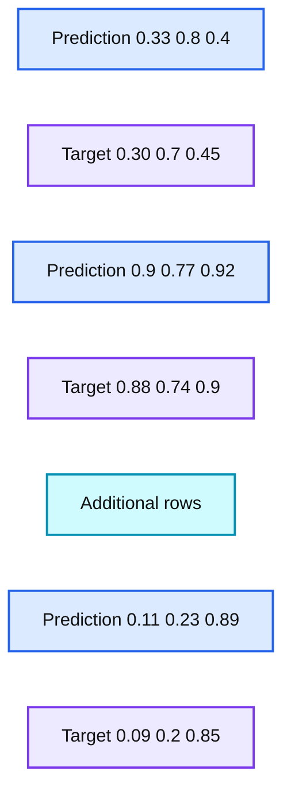

# Model Evaluation in MLflow

- Source: https://www.databricks.com/blog/2022/04/19/model-evaluation-in-mlflow.html
- Published: 2022-04-19
- Authors: Mark Zhang
- Categories: machine-learning, data-science-machine-learning
- Images: 5 total, 2 extracted as architecture

Many data scientists and ML engineers today use MLflow to manage their models. MLflow is an open-source platform that enables users to govern all aspects of the ML lifecycle, including but not limited to experimentation, reproducibility, deployment, and model registry. A critical step during the development of ML models is the evaluation of their performance on novel datasets.

## Motivation

### Why Do We Evaluate Models?

Model evaluation is an integral part of the ML lifecycle. It enables data scientists to measure, interpret, and explain the performance of their models. It accelerates the model development timeframe by providing insights into how and why models are performing the way that they are performing. Especially as the complexity of ML models increases, being able to swiftly observe and understand the performance of ML models is essential in a successful ML development journey.

### State of Model Evaluation in MLflow

Currently, many users evaluate the performance of their MLflow model of the [python_function (pyfunc) model flavor](https://www.mlflow.org/docs/latest/models.html#pyfunc-model-flavor) through the `[mlflow.evaluate](https://mlflow.org/docs/latest/python_api/mlflow.html#mlflow.evaluate)` API, which supports the evaluation of classification and regression models. It computes and logs a set of built-in task-specific performance metrics, model performance plots, and model explanations to the [MLflow Tracking](https://www.mlflow.org/docs/latest/tracking.html#tracking) server.

To evaluate MLflow models against custom metrics not included in the built-in evaluation metric set, users would have to define a custom model evaluator plugin. This would involve creating a custom evaluator class that implements the [ModelEvaluator interface](https://github.com/mlflow/mlflow/blob/4e444efdf73c710644ee039b44fa36a31d716f69/mlflow/models/evaluation/base.py#L449), then registering an evaluator entry point as part of an [MLflow plugin](https://www.mlflow.org/docs/latest/plugins.html#writing-your-own-mlflow-plugins). This rigidity and complexity could be prohibitive for users.

According to an internal customer survey, 75% of respondents say they frequently or always use specialized, business-focused metrics in addition to basic ones like accuracy and loss. Data scientists often utilize these custom metrics as they are more descriptive of business objectives (e.g. conversion rate), and contain additional heuristics not captured by the model prediction itself.

In this blog, we introduce an easy and convenient way of evaluating MLflow models on user-defined custom metrics. With this functionality, a data scientist can easily incorporate this logic at the model evaluation stage and quickly determine the best-performing model without further downstream analysis.

*Note: In [MLflow 2.4](https://www.databricks.com/blog/announcing-mlflow-24-llmops-tools-robust-model-evaluation), [mlflow.evaluate](https://mlflow.org/docs/latest/python_api/mlflow.html#mlflow.evaluate) is expanded to support LLM text, text summarization, and question answering models

## Usage

### Built-in Metrics

MLflow bakes in a set of commonly used performance and model explainability metrics for both classifier and regressor models. Evaluating models on these metrics is straightforward. All we need is to create an evaluation dataset containing the test data and targets and make a call to `[mlflow.evaluate](https://mlflow.org/docs/latest/python_api/mlflow.html#mlflow.evaluate)`.

Depending on the type of model, different metrics are computed. Refer to the [Default Evaluator behavior section](https://mlflow.org/docs/latest/python_api/mlflow.html#mlflow.evaluate) under the API documentation of `[mlflow.evaluate](https://mlflow.org/docs/latest/python_api/mlflow.html#mlflow.evaluate)` for the most up-to-date information regarding built-in metrics.

#### Example

Below is a simple example of how a classifier MLflow model is evaluated with built-in metrics.

First, import the necessary libraries

Then, we split the dataset, fit the model, and create our evaluation dataset

Finally, we start an MLflow run and call `[mlflow.evaluate](https://mlflow.org/docs/latest/python_api/mlflow.html#mlflow.evaluate)`

We can find the logged metrics and artifacts in the MLflow UI:

### Custom Metrics

To evaluate a model against custom metrics, we simply pass a list of custom metric functions to the `[mlflow.evaluate](https://mlflow.org/docs/latest/python_api/mlflow.html#mlflow.evaluate)` API.

#### Function Definition Requirements

Custom metric functions should accept two required parameters and one optional parameter in the following order:

1. `eval_df`: a Pandas or Spark DataFrame containing a `prediction` and a `target` column.

E.g. If the output of the model is a vector of three numbers, then the `eval_df` DataFrame would look something like:

**Summary:** The table compares prediction vectors with corresponding target vectors for model evaluation.

**Components:**

- Prediction vector containing three numeric values
- Target vector containing three numeric values
- Ellipsis indicating additional rows

**Flows:**

- none visible

**Numbers:** 0.33, 0.8, 0.4, 0.30, 0.7, 0.45, 0.9, 0.77, 0.92, 0.88, 0.74, 0.9, 0.11, 0.23, 0.89, 0.09, 0.2, 0.85

source image: https://www.databricks.com/wp-content/uploads/2022/04/db-142-blog-img-3.jpg

2. `builtin_metrics`: a dictionary containing the built-in metrics

E.g. For a regressor model, `builtin_metrics` would look something like:

3. (Optional) `artifacts_dir`: path to a temporary directory that can be used by the custom metric function to temporarily store produced artifacts before logging to MLflow.

E.g. Note that this will look different depending on the specific environment setup. For example, on MacOS it look something like this:

If file artifacts are stored elsewhere than `artifacts_dir`, ensure that they persist until after the complete execution of `[mlflow.evaluate](https://mlflow.org/docs/latest/python_api/mlflow.html#mlflow.evaluate)`.

#### Return Value Requirements

The function should return a dictionary representing the produced metrics and can optionally return a second dictionary representing the produced artifacts. For both dictionaries, the key for each entry represents the name of the corresponding metric or artifact.

While each metric must be a scalar, there are various ways to define artifacts:

- The path to an artifact file
- The string representation of a JSON object
- A pandas DataFrame
- A numpy array
- A matplotlib figure
- Other objects will be attempted to be pickled with the default protocol

Refer to the documentation of `[mlflow.evaluate](https://mlflow.org/docs/latest/python_api/mlflow.html#mlflow.evaluate)` for more in-depth definition details.

#### Example

Let’s walk through a concrete example that uses custom metrics. For this, we’ll create a toy model from the [California Housing](https://scikit-learn.org/stable/datasets/real_world.html#california-housing-dataset) dataset.

Then, setup our dataset and model

Here comes the exciting part: defining our custom metrics function, and a custom artifact!!

Finally, to tie all of these together, we’ll start an MLflow run and call `[mlflow.evaluate](https://mlflow.org/docs/latest/python_api/mlflow.html#mlflow.evaluate)`:

Logged custom metrics and artifacts can be found alongside the default metrics and artifacts. The red boxed regions show the logged custom metrics and artifacts on the run page.

### Accessing Evaluation Results Programmatically

So far, we have explored evaluation results for both built-in and custom metrics in the MLflow UI. However, we can also access them programmatically through the `[EvaluationResult](https://www.mlflow.org/docs/latest/python_api/mlflow.models.html#mlflow.models.EvaluationResult)` object returned by `[mlflow.evaluate](https://mlflow.org/docs/latest/python_api/mlflow.html#mlflow.evaluate)`. Let’s continue our custom metrics example above and see how we can access its evaluation results programmatically. (Assuming `result` is our `[EvaluationResult](https://www.mlflow.org/docs/latest/python_api/mlflow.models.html#mlflow.models.EvaluationResult)` instance from here on).

We can access the set of computed metrics through the `result.metrics` dictionary containing both the name and scalar values of the metrics. The content of `result.metrics` should look something like this:

Similarly, the set of artifacts is accessible through the `result.artifacts` dictionary. The values of each entry is an `[EvaluationArtifact](https://www.mlflow.org/docs/latest/python_api/mlflow.models.html#mlflow.models.EvaluationArtifact)` object. `result.artifacts` should look something like this:

### Example Notebooks

- [Short Example](https://www.databricks.com/wp-content/uploads/notebooks/custom-metrics-short-example.html)
- [Comprehensive Example](https://www.databricks.com/wp-content/uploads/notebooks/custom-metrics-comprehensive-example.html)

## Underneath the Hood

The diagram below illustrates how this all works under the hood:

**Summary:** The diagram shows how MLflow evaluates model predictions with built-in and custom metrics, validates results, stores metrics and artifacts, and displays them in the MLflow UI.

**Components:**

- User Code: Python code defining custom metric functions.
- Custom Metric Definitions: Functions returning metrics and artifacts.
- Evaluation Call: `mlflow.evaluate` invoked with custom metrics.
- DefaultEvaluator: MLflow evaluation engine.
- Existing DefaultEvaluator Operations: Built-in prediction processing.
- Predictions and Targets Dataframe: Predictions and optional targets.
- Built-in Metrics and Artifacts: Default evaluation outputs.
- Custom Metric Evaluation: Executes each custom metric function.
- Format Validation: Validates returned metric values.
- Artifact Type Detection: Identifies returned artifacts.
- Produced Metrics: Validated custom and built-in metrics.
- Produced Artifacts: Detected custom and built-in artifacts.
- Metrics Store: Persistent MLflow metric storage.
- Artifact Repository: Persistent artifact storage.
- MLflow UI: Displays stored metrics and artifacts.

**Flows:**

- Custom Metric Definitions -> Evaluation Call: Custom metric functions passed as parameters.
- Evaluation Call -> DefaultEvaluator: Evaluation request.
- DefaultEvaluator -> Existing DefaultEvaluator Operations: Invokes built-in evaluation operations.
- Existing DefaultEvaluator Operations -> Predictions and Targets Dataframe: Predictions from the raw dataset.
- Existing DefaultEvaluator Operations -> Built-in Metrics and Artifacts: Built-in evaluation results.
- Predictions and Targets Dataframe -> Custom Metric Evaluation: Predictions and targets for custom metrics.
- Built-in Metrics and Artifacts -> Produced Metrics: Built-in metrics.
- Built-in Metrics and Artifacts -> Produced Artifacts: Built-in artifacts.
- Custom Metric Evaluation -> Format Validation: Custom metric return values.
- Format Validation -> Produced Metrics: Validated metrics.
- Format Validation -> Artifact Type Detection: Values for artifact identification.
- Artifact Type Detection -> Produced Artifacts: Identified artifacts.
- Produced Metrics -> Metrics Store: Metrics are written.
- Produced Artifacts -> Artifact Repository: Artifacts are written.
- Metrics Store -> MLflow UI: Metrics are displayed.
- Artifact Repository -> MLflow UI: Artifacts are displayed.

**Numbers:** none

```mermaid
%% MLflow model evaluation flow from user code to stored results
flowchart LR
    A[User Code] -->|passes custom metrics| B[Evaluation Call]
    B -->|evaluation request| C[DefaultEvaluator]
    C -->|runs operations| D[Predictions and Targets]
    C -->|produces defaults| E[Built In Metrics and Artifacts]
    D -->|inputs| F[Custom Metric Evaluation]
    E -->|built in metrics| G[Produced Metrics]
    E -->|built in artifacts| H[Produced Artifacts]
    F -->|return values| I[Format Validation]
    I -->|validated metrics| G
    I -->|values to inspect| J[Artifact Type Detection]
    J -->|identified artifacts| H
    G -->|writes metrics| K[Metrics Store]
    H -->|writes artifacts| L[Artifact Repository]
    K -->|displays metrics| M[MLflow UI]
    L -->|displays artifacts| M

    classDef client   fill:#dbeafe,stroke:#2563eb,stroke-width:2px,color:#111
    classDef service  fill:#dcfce7,stroke:#16a34a,stroke-width:2px,color:#111
    classDef store    fill:#ede9fe,stroke:#7c3aed,stroke-width:2px,color:#111
    classDef cache    fill:#fef3c7,stroke:#d97706,stroke-width:2px,color:#111
    classDef queue    fill:#cffafe,stroke:#0891b2,stroke-width:2px,color:#111
    classDef critical fill:#fee2e2,stroke:#dc2626,stroke-width:4px,color:#111
    classDef external fill:#e5e7eb,stroke:#6b7280,stroke-width:2px,color:#111,stroke-dasharray:4 3
    classDef decision fill:#fce7f3,stroke:#db2777,stroke-width:2px,color:#111

    class A,B client
    class C,D,E,F,I,J service
    class G,H store
    class K,L store
    class M client
```

source image: https://www.databricks.com/wp-content/uploads/2022/04/db-142-blog-img-5.png

## Conclusion

In this blog post, we covered:

- The significance of model evaluation and what’s currently supported in MLflow.
- Why having an easy way for MLflow users to incorporate custom metrics into their MLflow models is important.
- How to evaluate models with default metrics.
- How to evaluate models with custom metrics.
- How MLflow handles model evaluation behind the scenes.
