# Simplifying Change Data Capture With Databricks Delta Live Tables

- Source: https://www.databricks.com/blog/2022/04/25/simplifying-change-data-capture-with-databricks-delta-live-tables.html
- Published: 2022-04-25
- Authors: Mojgan Mazouchi
- Categories: engineering, data-science-machine-learning
- Images: 2 total, 2 extracted as architecture

This guide will demonstrate how you can leverage Change Data Capture in Delta Live Tables pipelines to identify new records and capture changes made to the dataset in your data lake. Delta Live Tables pipelines enable you to develop scalable, reliable and low latency data pipelines, while performing Change Data Capture in your data lake with minimum required computation resources and seamless out-of-order data handling.

Note: We recommend following the [Getting Started with Delta Live Tables](https://www.databricks.com/discover/pages/getting-started-with-delta-live-tables) which explains creating scalable and reliable pipelines using Delta Live Tables (DLT) and its declarative ETL definitions.

## Background on Change Data Capture

Change Data Capture ([CDC](https://en.wikipedia.org/wiki/Change_data_capture)) is a process that identifies and captures incremental changes (data deletes, inserts and updates) in databases, like tracking customer, order or product status for near-real-time data applications. CDC provides real-time data evolution by processing data in a continuous incremental fashion as new events occur.
 Since [over 80% of organizations plan on implementing multi-cloud strategies by 2025](https://solutionsreview.com/data-integration/whats-changed-2020-gartner-magic-quadrant-for-data-integration-tools/), choosing the right approach for your business that allows seamless real-time centralization of all data changes in your ETL pipeline across multiple environments is critical.

By capturing CDC events, Databricks users can re-materialize the source table as Delta Table in Lakehouse and run their analysis on top of it, while being able to combine data with external systems. The MERGE INTO command in Delta Lake on Databricks enables customers to efficiently upsert and delete records in their data lakes – you can check out our previous deep dive on the topic [here](https://www.databricks.com/blog/2018/10/29/simplifying-change-data-capture-with-databricks-delta.html). This is a common use case that we observe many of Databricks customers are leveraging Delta Lakes to perform, and keeping their data lakes up to date with real-time business data.

While Delta Lake provides a complete solution for real-time CDC synchronization in a data lake, we are now excited to announce the Change Data Capture feature in Delta Live Tables that makes your architecture even simpler, more efficient and scalable. DLT allows users to ingest CDC data seamlessly using SQL and Python.

Earlier CDC solutions with delta tables were using MERGE INTO operation which requires manually ordering the data to avoid failure when multiple rows of the source dataset match while attempting to update the same rows of the target Delta table. To handle the out-of-order data, there was an extra step required to preprocess the source table using a foreachBatch implementation to eliminate the possibility of multiple matches, retaining only the latest change for each key (See the Change data capture example). The new APPLY CHANGES INTO operation in DLT pipelines automatically and seamlessly handles out-of-order data without any need for data engineering manual intervention.

## CDC with Databricks Delta Live Tables

In this blog, we will demonstrate how to use the APPLY CHANGES INTO command in Delta Live Tables pipelines for a common CDC use case where the CDC data is coming from an external system. A variety of CDC tools are available such as Debezium, Fivetran, Qlik Replicate, Talend, and StreamSets. While specific implementations differ, these tools generally capture and record the history of data changes in logs; downstream applications consume these CDC logs. In our example data is landed in cloud object storage from a CDC tool such as Debezium, Fivetran, etc.

We have data from various CDC tools landing in a cloud object storage or a message queue like Apache Kafka. Typically we see CDC used in an ingestion to what we refer as the medallion architecture. A medallion architecture is a data design pattern used to logically organize data in a Lakehouse, with the goal of incrementally and progressively improving the structure and quality of data as it flows through each layer of the architecture. Delta Live Tables allows you to seamlessly apply changes from CDC feeds to tables in your Lakehouse; combining this functionality with the medallion architecture allows for incremental changes to easily flow through analytical workloads at scale. Using CDC together with the medallion architecture provides multiple benefits to users since only changed or added data needs to be processed. Thus, it enables users to cost-effectively keep gold tables up-to-date with the latest business data.

NOTE: The example here applies to both SQL and Python versions of CDC and also on a specific way to use the operations, to evaluate variations, please see the official documentation [here](https://docs.databricks.com/data-engineering/delta-live-tables/delta-live-tables-cdc.html#python).

### Prerequisites

To get the most out of this guide, you should have a basic familiarity with:

- SQL or Python
- Delta Live Tables
- Developing ETL pipelines and/or working with Big Data systems
- Databricks interactive notebooks and clusters
- You must have access to a Databricks Workspace with permissions to create new clusters, run jobs, and save data to a location on external cloud object storage or [DBFS](https://docs.gcp.databricks.com/data/databricks-file-system.html).
- For the pipeline we are creating in this blog, "Advanced" product edition which supports enforcement of data quality constraints, needs to be selected.
  

### The Dataset

Here we are consuming realistic looking CDC data from an external database. In this pipeline, we will use the [Faker](https://github.com/joke2k/faker) library to generate the dataset that a CDC tool like Debezium can produce and bring into cloud storage for the initial ingest in Databricks. Using [Auto Loader](https://docs.databricks.com/spark/latest/structured-streaming/auto-loader.html) we incrementally load the messages from cloud object storage, and store them in the Bronze table as it stores the raw messages. The Bronze tables are intended for data ingestion which enable quick access to a single source of truth. Next we perform APPLY CHANGES INTO from the cleaned Bronze layer table to propagate the updates downstream to the Silver Table. As data flows to Silver tables, generally it becomes more refined and optimized ("just-enough") to provide an enterprise a view of all its key business entities. See the diagram below.

**Summary:** Shows a CDC ingestion flow from external database clients through CloudFiles and Autoloader into Delta Live Tables bronze and silver tables.

**Components:**

- External database clients with products, items, and transactions
- MySQL source database
- External CDC tools including Debezium and Fivetran
- CloudFiles streaming source
- Autoloader for incremental loading of new data
- Cloud Storage using S3, ADLS, or GCS
- Delta Live Tables pipeline
- customer_bronze raw full CDC history
- customer_bronze_clean_v cleaned bronze table
- customer_silver silver table
- DLT SQL using Apply Changes Into
- applyChanges configuration enabled

**Flows:**

- MySQL -> External CDC tools: Extracted change data capture
- External database clients -> External CDC tools: Database records
- External CDC tools -> Cloud Storage: CDC files
- Cloud Storage -> CloudFiles: Streaming source files
- CloudFiles -> Autoloader: New incremental data
- Autoloader -> customer_bronze raw full CDC history: Incrementally loaded CDC records
- customer_bronze raw full CDC history -> customer_bronze_clean_v: Raw CDC history
- customer_bronze_clean_v -> customer_silver: Applied changes
- DLT SQL -> customer_silver: Apply Changes Into

**Numbers:** none

```mermaid
%% Shows CDC ingestion through CloudFiles, Autoloader, and Delta Live Tables
flowchart LR
    mysql[MySQL]
    clients[External database clients]
    tools[Debezium and Fivetran]
    storage[Cloud Storage S3 ADLS GCS]
    cloudfiles[CloudFiles streaming source]
    autoloader[Autoloader incremental load]
    bronze[customer_bronze raw full CDC history]
    clean[customer_bronze_clean_v]
    dlt[Delta Live Tables pipeline]
    sql[DLT SQL Apply Changes Into]
    silver[customer_silver]

    clients -->|database records| tools
    mysql -->|CDC extraction| tools
    tools -->|CDC files| storage
    storage -->|streaming files| cloudfiles
    cloudfiles -->|new incremental data| autoloader
    autoloader -->|loaded CDC records| bronze
    bronze -->|raw CDC history| clean
    clean -->|cleaned changes| sql
    sql -->|applied changes| silver
    dlt -.->|contains| sql

    classDef client fill:#dbeafe,stroke:#2563eb,stroke-width:2px,color:#111
    classDef service fill:#dcfce7,stroke:#16a34a,stroke-width:2px,color:#111
    classDef store fill:#ede9fe,stroke:#7c3aed,stroke-width:2px,color:#111
    classDef cache fill:#fef3c7,stroke:#d97706,stroke-width:2px,color:#111
    classDef queue fill:#cffafe,stroke:#0891b2,stroke-width:2px,color:#111
    classDef critical fill:#fee2e2,stroke:#dc2626,stroke-width:4px,color:#111
    classDef external fill:#e5e7eb,stroke:#6b7280,stroke-width:2px,color:#111,stroke-dasharray:4 3
    classDef decision fill:#fce7f3,stroke:#db2777,stroke-width:2px,color:#111

    class mysql,clients external
    class tools service
    class storage,bronze,clean,silver store
    class cloudfiles,autoloader queue
    class dlt,sql service
```

source image: https://www.databricks.com/wp-content/uploads/2022/04/db-129-blog-img-2.png

This blog focuses on a simple example that requires a JSON message with four fields of customers name, email, address and id along with the two fields: operation (which stores operation code (DELETE, APPEND, UPDATE, CREATE), and operation_date (which stores the date and timestamp for the record came for each operation action) to describe the changed data.

To generate a sample dataset with the above fields, we are using a Python package that generates fake data, Faker. You can find the notebook related to this data generation section [here](https://www.databricks.com/wp-content/uploads/notebooks/DB-129/1-cdc-data-generator.html). In this notebook we provide the name and storage location to write the generated data there. We are using the DBFS functionality of Databricks, [see the DBFS documentation](https://docs.databricks.com/user-guide/dbfs-databricks-file-system.html) to learn more about how it works. Then, we use a PySpark User-Defined-Function to generate the synthetic dataset for each field, and write the data back to the defined storage location, which we will refer to in other notebooks for accessing the synthetic dataset.

### Ingesting the raw dataset using Auto Loader

According to the Medallion architecture paradigm, the bronze layer holds the most raw data quality. At this stage we can incrementally read new data using Autoloader from a location in cloud storage. Here we are adding the path to our generated dataset to the configuration section under pipeline settings, which allows us to load the source path as a variable. So now our configuration under pipeline settings looks like below:

Then we load this configuration property in our notebooks.

Let's take a look at the Bronze table we will ingest, a. In SQL, and b. Using Python

a. SQL

b. Python

The above statements use the Auto Loader to create a Streaming Live Table called customer_bronze from json files. When using Autoloader in Delta Live Tables, you do not need to provide any location for schema or checkpoint, as those locations will be managed automatically by your DLT pipeline.

Auto Loader provides a Structured Streaming source called cloud_files in SQL and cloudFiles in Python, which takes a cloud storage path and format as parameters.
 To reduce compute costs, we recommend running the DLT pipeline in Triggered mode as a micro-batch assuming you do not have very low latency requirements.

### Expectations and high-quality data

In the next step to create high-quality, diverse, and accessible dataset, we impose quality check expectation criteria using Constraints. Currently, a constraint can be either retain, drop, or fail. For more detail [see here](https://docs.databricks.com/data-engineering/delta-live-tables/delta-live-tables-expectations.html). All constraints are logged to enable streamlined quality monitoring.

a. SQL

b. Python

### Using APPLY CHANGES INTO statement to propagate changes to downstream target table

Prior to executing the Apply Changes Into query, we must ensure that a target streaming table which we want to hold the most up-to-date data exists. If it does not exist we need to create one. Below cells are examples of creating a target streaming table. Note that at the time of publishing this blog, the target streaming table creation statement is required along with the Apply Changes Into query, and both need to be present in the pipeline, otherwise your table creation query will fail.

a. SQL

b. Python

Now that we have a target streaming table, we can propagate changes to the downstream target table using the Apply Changes Into query. While CDC feed comes with INSERT, UPDATE and DELETE events, DLT default behavior is to apply INSERT and UPDATE events from any record in the source dataset matching on primary keys, and sequenced by a field which identifies the order of events. More specifically it updates any row in the existing target table that matches the primary key(s) or inserts a new row when a matching record does not exist in the target streaming table. We can use APPLY AS DELETE WHEN in SQL, or its equivalent apply_as_deletes argument in Python to handle DELETE events.

In this example we used "id" as my primary key, which uniquely identifies the customers and allows CDC events to apply to those identified customer records in the target streaming table. Since "operation_date" keeps the logical order of CDC events in the source dataset, we use "SEQUENCE BY operation_date" in SQL, or its equivalent "sequence_by = col("operation_date")" in Python to handle change events that arrive out of order. Keep in mind that the field value we use with SEQUENCE BY (or sequence_by) should be unique among all updates to the same key. In most cases, the sequence by column will be a column with timestamp information.

Finally we used "COLUMNS * EXCEPT (operation, operation_date, _rescued_data)" in SQL, or its equivalent "except_column_list"= ["operation", "operation_date", "_rescued_data"] in Python to exclude three columns of "operation", "operation_date", "_rescued_data" from the target streaming table. By default all the columns are included in the target streaming table, when we do not specify the "COLUMNS" clause.

a. SQL

b. Python

To check out the full list of available clauses see [here](https://docs.databricks.com/data-engineering/delta-live-tables/delta-live-tables-cdc.html#requirements).
 Please note that, at the time of publishing this blog, a table that reads from the target of an APPLY CHANGES INTO query or apply_changes function must be a live table, and cannot be a streaming live table.

A [SQL](https://www.databricks.com/wp-content/uploads/notebooks/DB-129/2-retail-dlt-cdc-sql.html) and [python](https://www.databricks.com/wp-content/uploads/notebooks/DB-129/2-Retail_DLT_CDC_Python.html) notebook is available for reference for this section. Now that we have all the cells ready, let's create a Pipeline to ingest data from cloud object storage. Open Jobs in a new tab or window in your workspace, and select "Delta Live Tables".

The pipeline associated with this blog, has the following DLT pipeline settings:

1. Select "Create Pipeline" to create a new pipeline
2. Specify a name such as "Retail CDC Pipeline"
3. Specify the Notebook Paths that you already created earlier, one for the generated dataset using Faker package, and another path for the ingestion of the generated data in DLT. The second notebook path can refer to the notebook written in SQL, or Python depending on your language of choice.
4. To access the data generated in the first notebook, add the dataset path in configuration. Here we stored data in "/tmp/demo/cdc_raw/customers", so we set "source" to "/tmp/demo/cdc_raw/" to reference "source/customers" in our second notebook.
5. Specify the Target (which is optional and referring to the target database), where you can query the resulting tables from your pipeline.
6. Specify the Storage Location in your object storage (which is optional), to access your DLT produced datasets and metadata logs for your pipeline.
7. Set Pipeline Mode to [Triggered](https://docs.databricks.com/data-engineering/delta-live-tables/delta-live-tables-user-guide.html#continuous-and-triggered-pipelines). In Triggered mode, DLT pipeline will consume new data in the source all at once, and once the processing is done it will terminate the compute resource automatically. You can toggle between Triggered and Continuous modes when editing your pipeline settings. Setting "continuous": false in the JSON is equivalent to setting the pipeline to Triggered mode.
8. For this workload you can disable the autoscaling under Autopilot Options, and use only 1 worker cluster. For production workloads, we recommend enabling autoscaling and setting the maximum numbers of workers needed for cluster size.
9. Select "Start"
10. Your pipeline is created and running now!

**Summary:** A Delta Live Tables pipeline propagates customer data from bronze through an intermediate table into a silver table.

**Components:**

- customer bronze source table using Delta Live Tables
- customer bronze intermediate table using Delta Live Tables
- customer silver target table using Delta Live Tables
- Pipeline status and schema panel

**Flows:**

- customer bronze -> customer bronze intermediate: customer records and changes
- customer bronze intermediate -> customer silver: cleaned and merged customer records

**Numbers:** 10/2/2022, 8:05:17 PM, 8:08:53 PM, 6s, 4s, 8s, 100K, 0, 99K, 1.2K

```mermaid
%% Shows customer data flowing through a Delta Live Tables pipeline
flowchart LR
    A[customer bronze] -->|customer records and changes| B[customer bronze intermediate]
    B -->|cleaned and merged customer records| C[customer silver]

    classDef client fill:#dbeafe,stroke:#2563eb,stroke-width:2px,color:#111
    classDef service fill:#dcfce7,stroke:#16a34a,stroke-width:2px,color:#111
    classDef store fill:#ede9fe,stroke:#7c3aed,stroke-width:2px,color:#111
    classDef cache fill:#fef3c7,stroke:#d97706,stroke-width:2px,color:#111
    classDef queue fill:#cffafe,stroke:#0891b2,stroke-width:2px,color:#111
    classDef critical fill:#fee2e2,stroke:#dc2626,stroke-width:4px,color:#111
    classDef external fill:#e5e7eb,stroke:#6b7280,stroke-width:2px,color:#111,stroke-dasharray:4 3
    classDef decision fill:#fce7f3,stroke:#db2777,stroke-width:2px,color:#111

    class A store
    class B service
    class C store
```

source image: https://www.databricks.com/sites/default/files/inline-images/db-129-blog-img-3.png

## DLT Pipeline Lineage Observability, and Data Quality Monitoring

All DLT pipeline logs are stored in the pipeline's storage location. You can specify your storage location only when you are creating your pipeline. Note once the pipeline is created you can no longer modify storage location.

You can check out our previous deep dive on the topic [here](https://www.databricks.com/discover/pages/getting-started-with-delta-live-tables#pipeline-observability). Try [this notebook](https://www.databricks.com/wp-content/uploads/notebooks/DB-129/3-retail-dlt-cdc-monitoring.html) to see pipeline observability and data quality monitoring on the example DLT pipeline associated with this blog.

## Conclusion

In this blog, we showed how we made it seamless for users to efficiently implement change data capture (CDC) into their Lakehouse platform with Delta Live Tables (DLT). DLT provides built-in quality controls with deep visibility into pipeline operations, observing pipeline lineage, monitoring schema, and quality checks at each step in the pipeline. DLT supports automatic error handling and best in class auto-scaling capability for streaming workloads, which enables users to have quality data with optimum resources required for their workload.

Data engineers can now easily implement CDC with a new declarative [APPLY CHANGES INTO API](https://docs.databricks.com/data-engineering/delta-live-tables/delta-live-tables-cdc.html?_gl=1*d51pfv*_gcl_aw*R0NMLjE2NDYyNTYzOTkuQ2p3S0NBaUF5UHlRQmhCNkVpd0FGVXVha29wck1CWldNUG5INUNpczB3cnMwUGZfd2JxOV9vRWU4bVFITkptZWVaOV9lVFVIYVk0a3Bob0NkYWtRQXZEX0J3RQ..&_ga=2.123024395.1232434169.1646524051-1547688913.1627598437&_gac=1.158632392.1646256400.CjwKCAiAyPyQBhB6EiwAFUuakoprMBZWMPnH5Cis0wrs0Pf_wbq9_oEe8mQHNJmeeZ9_eTUHaY4kphoCdakQAvD_BwE) with DLT in either SQL or Python. This new capability lets your ETL pipelines easily identify changes and apply those changes across tens of thousands of tables with low-latency support.

**Ready to get started and try out CDC in Delta Live Tables for yourself?**
 Please watch [this webinar](https://www.databricks.com/p/webinar/tackle-data-transformation) to learn how Delta Live Tables simplifies the complexity of data transformation and ETL, and see our [Change data capture with Delta Live Tables](https://docs.databricks.com/data-engineering/delta-live-tables/delta-live-tables-cdc.html?_gl=1*d51pfv*_gcl_aw*R0NMLjE2NDYyNTYzOTkuQ2p3S0NBaUF5UHlRQmhCNkVpd0FGVXVha29wck1CWldNUG5INUNpczB3cnMwUGZfd2JxOV9vRWU4bVFITkptZWVaOV9lVFVIYVk0a3Bob0NkYWtRQXZEX0J3RQ..&_ga=2.123024395.1232434169.1646524051-1547688913.1627598437&_gac=1.158632392.1646256400.CjwKCAiAyPyQBhB6EiwAFUuakoprMBZWMPnH5Cis0wrs0Pf_wbq9_oEe8mQHNJmeeZ9_eTUHaY4kphoCdakQAvD_BwE) document, official [github](https://github.com/databricks/delta-live-tables-notebooks) and follow the steps in this [video](https://vimeo.com/700994477) to create your pipeline!
