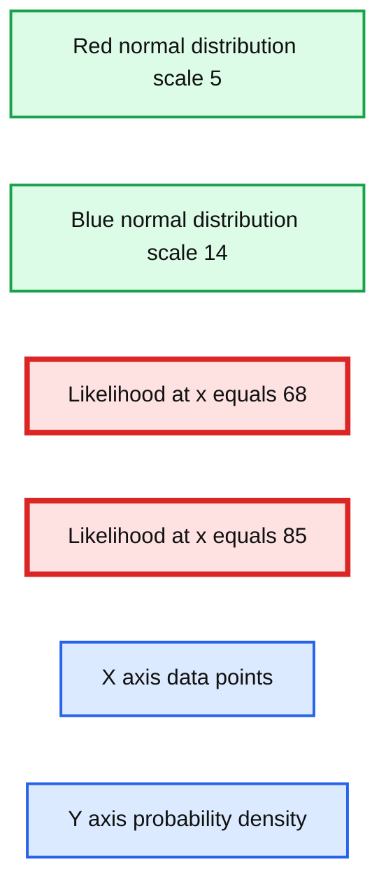
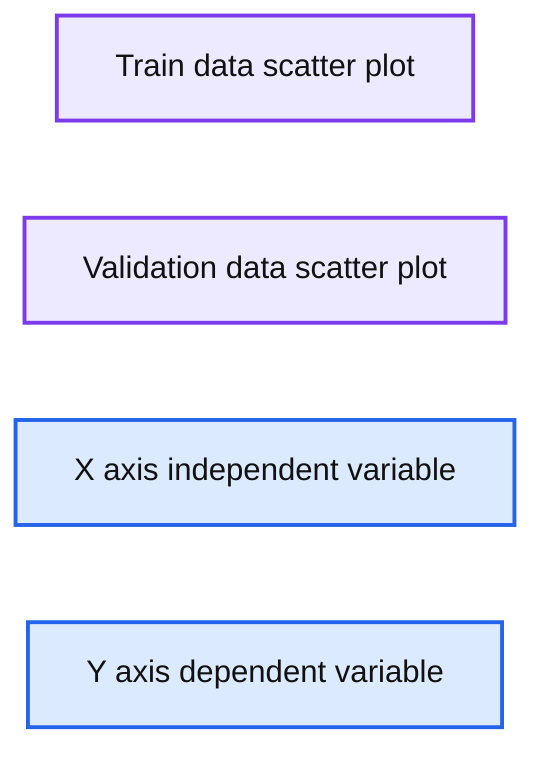
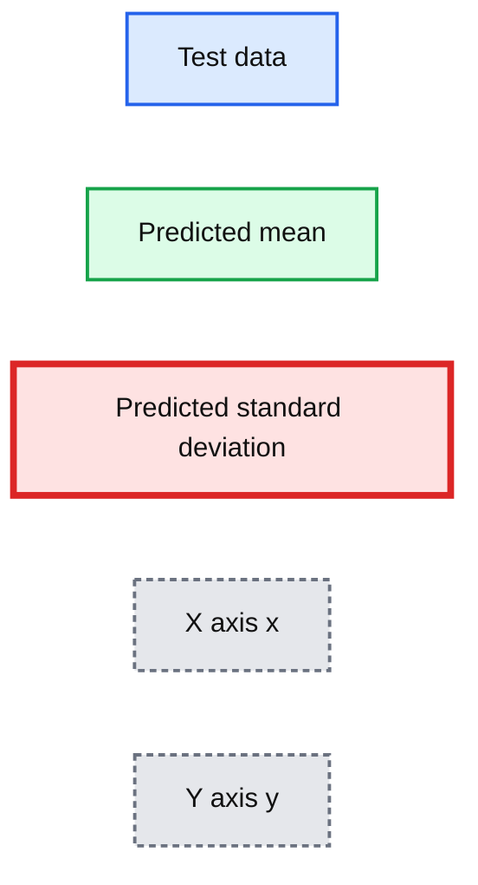
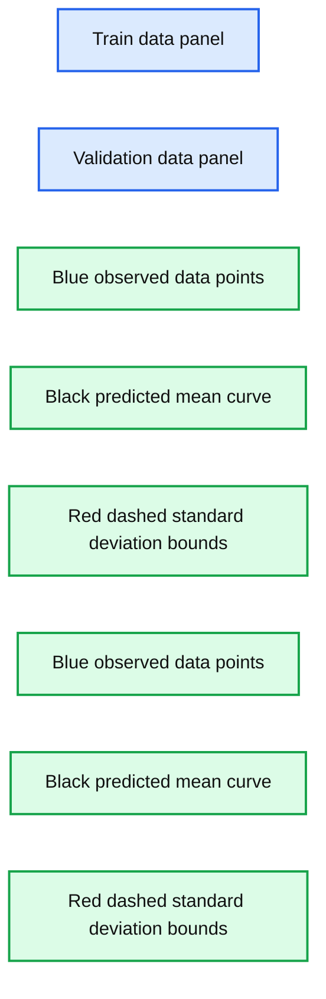
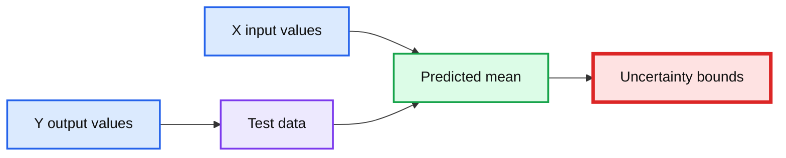
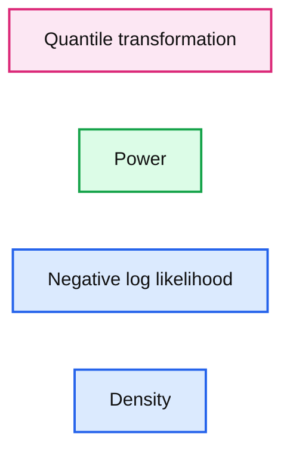

# How Wrong Is Your Model?

*Quantifying uncertainty with Tensorflow Probability*

- Source: https://www.databricks.com/blog/2022/04/28/how-wrong-is-your-model.html
- Published: 2022-04-28
- Authors: Srijith Rajamohan, Ph.D., Vini Jaiswal
- Categories: engineering, data-science-machine-learning
- Images: 7 total, 6 extracted as architecture

In this blog, we look at the topic of uncertainty quantification for machine learning and deep learning. By no means is this a new subject, but the introduction of tools such as [Tensorflow Probability](https://www.tensorflow.org/probability) and [Pyro](https://pyro.ai/) have made it easy to perform probabilistic modeling to streamline uncertainty calculations. Consider the scenario in which we predict the value of an asset like a house, based on a number of features, to drive purchasing decisions. Wouldn’t it be beneficial to know how certain we are of these predicted prices? Tensorflow Probability allows you to use the familiar Tensorflow syntax and methodology but adds the ability to work with distributions. In this introductory post, we leave the priors and the Bayesian treatment behind and opt for a simpler probabilistic treatment to illustrate the basic principles. We use the likelihood principle to illustrate how an uncertainty measure can be obtained along with predicted values by applying them to a deep learning regression problem.

## Uncertainty quantification

Uncertainty can be divided into two types:

1. Epistemic uncertainty
2. Aleatoric uncertainty

Epistemic uncertainty is a result of the model not having information, but this information can be obtained from providing new data to the model or increasing the representation capacity of the model by increasing its complexity. This type of uncertainty can potentially be addressed and reduced. Aleatoric uncertainty, on the other hand, stems from the inherent stochasticity in the data-generating process. In stochastic processes, there are a number of parameters and only a subset of these parameters are observable. So, theoretically, if there was a way to measure all these parameters, we would be able to reproduce an event exactly. However, in most real-life scenarios, this is not the case. In this work, we are trying to quantify the epistemic uncertainty, which stems from the lack of knowledge in our network or model parameters.

## Problem definition

The goal here is to quantify the uncertainty of predictions. In other words, along with getting the predicted values, a measure of certainty or confidence would also be computed for each predicted value. We are going to illustrate this uncertainty analysis using a regression problem. Here we model the relationship between the independent variables and the dependent variable using a neural network. Instead of the neural network outputting a single predicted value y_pred, the network will now predict the parameters of a distribution. This probability distribution is chosen based on the type of the target or dependent variable. For classification, the MaxLike [[https://www.nbi.dk/~petersen/Teaching/Stat2015/Week3/AS2015_1201_Likelihood.pdf](https://www.nbi.dk/~petersen/Teaching/Stat2015/Week3/AS2015_1201_Likelihood.pdf)] principle tells us that the network weights are updated to maximize the likelihood or probability of seeing the true data class given the model (network + weights). A Normal distribution is a baseline; however, it may not be appropriate for all scenarios. For example, if the target variable represents count data, we would choose a Poisson distribution. For a Normal distribution, the neural network would output two values, the parameters of the distribution y_mean and y_std, for every input data point. We are assuming a parametric distribution in the output or target variable, which may or may not be valid. For more complex modeling, you may want to consider a mixture of Gaussians or a Mixture Density network instead.

Normally, the error of the predicted values is computed using a number of loss functions such as the MSE, cross-entropy, etc. Since we have probabilistic outputs, MSE is not an appropriate way to measure the error. Instead, we choose the likelihood function, or rather the Negative Log-likelihood (NLL) as a baseline loss function. In fact, apart from the differences in interpretation of one being deterministic and the other being probabilistic in nature, it can be shown that cross-entropy and NLL are equivalent [REFERENCE]. To illustrate this, two Normal distributions are plotted in Fig. 1 below with the dotted lines indicating the likelihood as the probability density at two different data points. The narrower distribution is shown in red, while the wider distribution is plotted in blue. The likelihood of the data point given by x=68 is higher for the narrower distribution, while the likelihood for the point given by x=85 is higher for the wider distribution.

*Fig. 1 Likelihood at two different points*

**Summary:** The chart compares normal distributions with scales 5 and 14, showing likelihood densities at x=68 and x=85.

**Components:**

- Red normal distribution, scale 5
- Blue normal distribution, scale 14
- Likelihood marker at x=68
- Likelihood marker at x=85
- X axis data points
- Y axis probability density

**Flows:**

- none

**Numbers:** 0, 0.01, 0.02, 0.03, 0.04, 0.05, 0.06, 0.07, 0.08, 20, 40, 60, 68, 80, 85, 100, 120, 140, 5, 14

source image: https://www.databricks.com/wp-content/uploads/2022/04/db-103-blog-img-1.jpg

Fig. 1 Likelihood at two different points

Using the MaxLike principle [REFERENCE] and under assumptions of independence of data points, the objective here is to maximize the likelihood of each data point. As a result of the independence assumption, the total likelihood is therefore the product of the individual likelihoods. For numerical stability, we use the log-likelihood as opposed to the likelihood. The NLLs are summed up for each point to obtain the total loss for each iteration.

We want to capture the non-linear relationships that may exist between the independent and dependent variables, therefore we use multiple hidden layers with activation functions for both parameters y_mean and y_std. This allows non-monotonic variations for both parameters. One could simplify this in two ways:

1. Fixed variance: only a single parameter y_mean is estimated
2. Linear variance: y_std is also estimated but now this is a function of a single hidden layer and no activation function

The examples below show non-linear variance of standard deviation. The first example illustrates how to fit a linear model (linear variation for y_mean) and will be followed by non-linear variation of y_mean to capture more complex phenomena.

## What is Tensorflow Probability (TFP)?

Tensorflow Probability is a framework that builds upon TensorFlow but can work with and perform operations on distributions of data. You can define distributions and sample from it, as shown in the following section.

What distributions are available?

Common distributions such as the Bernoulli, Binomial, Normal, Gamma, etc. are available. More information about these distributions can be found here [[https://www.tensorflow.org/probability/api_docs/python/tfp/distributions](https://www.tensorflow.org/probability/api_docs/python/tfp/distributions)]

## Predictions with uncertainty using Tensorflow Probability on synthetic data

In order to illustrate how TFP can be used to quantify the uncertainty of a prediction, we start off with a synthetic one-dimensional dataset. Synthetic data allows us to perform a controlled experiment and the single dimension makes it easy to visualize the uncertainty associated with each data point and prediction.

#### Synthetic data generation

The goal here is to generate some synthetic data with non-constant variance. This property of the data is referred to as heteroscedasticity. This data is generated in segments and then concatenated together, as shown below.

#### Fit a linear model with non-constant standard deviation

Some noise is added to the above data, and we generate the target variable ‘y’ from the independent variable ‘x’ and the noise. The relationship between them is:

 

y=2.7*x+noise

 This data is then split into a training set and a validation set to assess performance. The relationship between the dependent and independent variables can be visualized in Fig. 2 for both the training set and the validation set.

 

*Fig. 2 - Generated data*

**Summary:** The figure compares plotted train data and validation data showing the relationship between independent variable x and dependent variable y.

**Components:**

- Train data scatter plot using filled blue points
- Validation data scatter plot using hollow blue points
- X axis for the independent variable
- Y axis for the dependent variable

**Flows:**

- none

**Numbers:** x-axis ticks: -1, 0, 1, 2, 3, 4, 5, 6. Y-axis ticks: -30, -20, -10, 0, 10, 20, 30, 40, 50.

source image: https://www.databricks.com/wp-content/uploads/2022/04/db-103-blog-img-2.jpg

Fig. 2 - Generated data

#### Define the model

The model that we build is a fairly simple one with three dense layers applied to the data and two outputs, corresponding to the mean y_mean and the standard deviation y_std. These parameters are concatenated and passed to the distribution function ‘my_dist’.

In the function ‘my_dist,’ the Normal distribution is parameterized by the mean and scale (standard deviation). The mean is the first index in the two-dimensional variable ‘params,’ and standard deviation is defined through a softplus operation because we are computing the log of the standard deviation or log y_std. This is because the standard deviation is always a positive value and the output of the neural network layer can be positive or negative. Therefore the transformation helps to constrain the output to just positive values.

The function ‘NLL’ computes the Negative Log-likelihood (NLL) of the input data given the network parameters, as the name indicates and returns them. This will be the loss function.

Three models are generated:

1. Model - outputs y_mean and y_std for the output distribution
2. Model_mean - outputs the mean of the distribution returned from ‘my_dist’
3. Model_std - outputs the standard deviation of the distribution returned from ‘my_dist’

#### Evaluating the results

Once the model is trained and the convergence plot is inspected, we can also observe the sum of NLLs for the test data. We will look at this in more detail in the next section. This can be used to tune the model and evaluate the fit, but care should be taken to not perform comparisons across different datasets. The sum of NLLs can be computed as shown below.

The model fitted on the training and validation data is shown below. A linear model was fit as a result of the training, and the black line obtained from y_mean captures this trend. The variance is indicated by the dotted red lines, which aligns with the variance that was incorporated into the generated data. Finally, this is evaluated on the test data set.

*Fig. 3 Predicted mean and standard deviation on the test data*

**Summary:** Test data points are compared with a linear predicted mean and dotted red standard-deviation bounds.

**Components:**

- Test data: technology not specified
- Predicted mean: black linear trend
- Predicted standard deviation: red dotted bounds
- X axis: x
- Y axis: y

**Flows:**

- No arrows are visible.

**Numbers:** -1, 0, 1, 2, 3, 4, 5, 6, -30, -20, -10, 0, 10, 20, 30, 40, 50

source image: https://www.databricks.com/wp-content/uploads/2022/04/db-103-blog-img-3.jpg

Fig. 3 Predicted mean and standard deviation on the test data

#### Fit a non-linear model with non-constant standard deviation

Here, the relationship between the dependent and independent variables vary in a non-linear manner due to the squared term and is shown below.

 

y = 2.7x + x^2 + noise

 

In order to obtain this nonlinear behavior, we add an activation function (non-linear) to the output of y_mean. Similar to what was done before, we fit the model and plot the predicted mean and standard deviation at each data point for the training, validation and test data points as shown below.

Fig. 4 Non-linear generated data - training and validation

*Fig. 5 Predicted mean and standard deviation on the training and validation data*

**Summary:** Training and validation scatter plots show predicted mean and standard deviation for a nonlinear model.

**Components:**

- Train data panel
- Validation data panel
- Blue observed data points
- Black predicted mean curve
- Red dashed predicted standard deviation bounds
- X axis
- Y axis

**Flows:**

- none

**Numbers:** x-axis ticks -1, 0, 1, 2, 3, 4, 5, 6; y-axis ticks -30, -20, -10, 0, 10, 20, 30, 40, 50

source image: https://www.databricks.com/wp-content/uploads/2022/04/db-103-blog-img-5.jpg

Fig. 5 Predicted mean and standard deviation on the training and validation data

*Fig. 6 Predicted mean and standard deviation on the test data*

**Summary:** Test data points are compared with a predicted mean curve and red dashed uncertainty bounds.

**Components:**

- Test data: blue scatter points
- Predicted mean: black line
- Uncertainty bounds: red dashed lines
- X axis: input variable
- Y axis: output variable

**Flows:**

- X axis -> Predicted mean: input values
- Test data -> Predicted mean: observed outputs
- Predicted mean -> Uncertainty bounds: estimated prediction variability

**Numbers:** x ticks -1, 0, 1, 2, 3, 4, 5, 6; y ticks -30, -20, -10, 0, 10, 20, 30, 40, 50

source image: https://www.databricks.com/wp-content/uploads/2022/04/db-103-blog-img-6.jpg

Fig. 6 Predicted mean and standard deviation on the test data

Unlike the data previously generated, real-life tends to not have desirable properties such as unit standard deviation; therefore, preprocessing the data is often a good idea. This is particularly important for techniques where assumptions of Normality in the data distribution are made for the techniques to be valid. The dataset used here is the Diabetes dataset [REFERENCE]. This is a regression problem with numerical features and targets.

#### Data preprocessing

There are two transformations applied to the data here.

1. Standardization
2. Power transformation or Quantile transformation

The data is standardized and one of two transforms is applied to the data. The Power transformation can include either the Box-Cox transform [G.E.P. Box and D.R. Cox, “An Analysis of Transformations”, Journal of the Royal Statistical Society B, 26, 211-252 (1964).], which assumes that all values are positive, or the Yeo-Johnson transform [[​​I.K. Yeo and R.A. Johnson, “A new family of power transformations to improve normality or symmetry.” Biometrika, 87(4), pp.954-959, (2000).], which makes no such assumption about the nature of the data. In the Quantile transformer. Both of these transform the data to more Gaussian-like distribution. [The quantile information of each feature is used to map it to the desired distribution, which here is the Normal distribution](https://scikit-learn.org/stable/modules/generated/sklearn.preprocessing.quantile_transform.html).

#### Model fit and evaluate

#### Evaluating the results

As mentioned before, apart from the convergence plots, you can evaluate model uncertainty based on the performance on the test set using the sum of NLL. This metric gives us a way to compare different models. We can also look at the distribution of the NLLs that are obtained on the test data set to understand how the model has generalized to new data points. Outliers could have contributed to a large NLL, which would be obvious from inspecting the distribution.

Here, the NLL for each point is accumulated in the array ‘neg_log_array’ and the histogram is plotted. We compare two scenarios: one where the quantile transformation is applied to the target and the power-transformed version is applied to the other. We want most of the density in the histogram to be close to 0, indicating that most of the data points had a low NLL, i.e. the model fit those points well. Fig. 7 illustrates this for the two transformation techniques, the quantile transformation seems to have marginally better performance if your goal is to minimize the outliers in the uncertainty of model predictions. This can also be used to perform hyperparameter tuning of the model and select an optimal model.

*Fig. 7 Histogram of NLL, ideally we want more density towards 0*

**Summary:** Histogram comparing the negative log-likelihood distributions of quantile transformation and power transformation.

**Components:**

- Quantile transformation series
- Power transformation series
- Negative log-likelihood axis
- Density axis

**Flows:**

- none

**Numbers:** x-axis values 0.75, 1.25, 1.75, 2.25, 2.75, 3.25, 3.75, 4.25, 4.75; y-axis values 0, 0.1, 0.2, 0.3, 0.4, 0.5, 0.6, 0.7, 0.8

source image: https://www.databricks.com/wp-content/uploads/2022/04/db-103-blog-img-7.jpg

Fig. 7 Histogram of NLL, ideally we want more density towards 0

## Conclusion

This post shows how uncertainty quantification can be beneficial in predictive modeling. Additionally, we walked through using Tensorflow Probability to quantify uncertainty from a probabilistic perspective on a deep learning problem. This approach avoids a full Bayesian treatment and tends to be more approachable introduction to uncertainty estimation.

Try out the examples shown here on Databricks on our ML runtimes!
