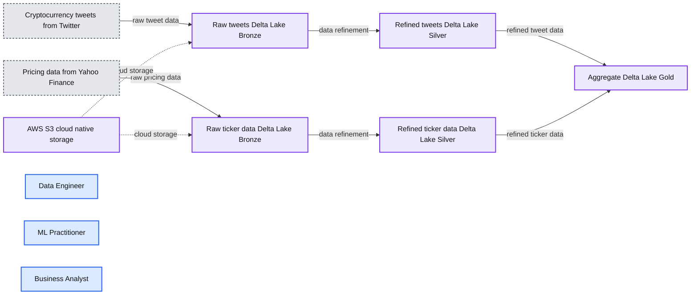
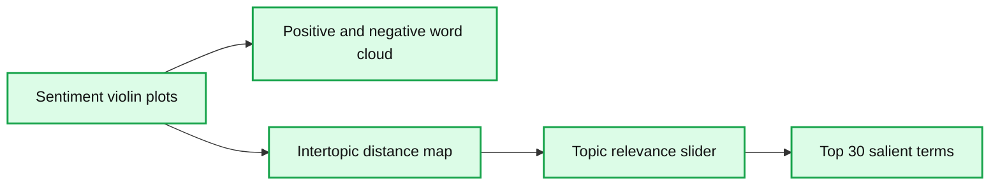

# Introduction to Analyzing Crypto Data Using Databricks

*Creating a Databricks Lakehouse to organize data pipeline for exploration of Twitter sentiment impact on cryptocurrency price.*

- Source: https://www.databricks.com/blog/2022/05/02/introduction-to-analyzing-crypto-data-using-databricks.html
- Published: 2022-05-02
- Authors: Monica Lin, Christoph Meier, Matthew Parker, Kiran Ravella
- Categories: data-science-machine-learning
- Images: 7 total, 4 extracted as architecture

The market capitalization of cryptocurrencies increased [from $17 billion in 2017 to $2.25 trillion in 2021](https://www.tradingview.com/chart/?symbol=CRYPTOCAP%3ATOTAL). That's over a 13,000% ROI in a short span of 5 years! Even with this growth, cryptocurrencies remain incredibly volatile, with their value being impacted by a multitude of factors: market trends, politics, technology…and Twitter. Yes, that's right. There have been instances where their prices were impacted on account of [tweets by famous personalities](https://www.vox.com/recode/2021/5/18/22441831/elon-musk-bitcoin-dogecoin-crypto-prices-tesla).

As part of a data engineering and analytics course at the Harvard Extension School, our group worked on a project to create a cryptocurrency data lake for different data personas – including data engineers, ML practitioners and BI analysts – to analyze trends over time, particularly the impact of social media on the price volatility of a crypto asset, such as Bitcoin (BTC). We leveraged [the Databricks Lakehouse Platform](https://www.databricks.com/blog/2020/01/30/what-is-a-data-lakehouse.html) to ingest unstructured data from Twitter using [the Tweepy library](https://www.tweepy.org/) and traditional structured pricing data from [Yahoo Finance](https://pypi.org/project/yfinance/) to create a machine learning prediction model that analyzes the impact of investor sentiment on crypto asset valuation. The aggregated trends and actionable insights are presented on a [Databricks SQL](https://www.databricks.com/product/databricks-sql) dashboard, allowing for easy consumption to relevant stakeholders.

This blog walks through how we built this ML model in just a few weeks by leveraging Databricks and its collaborative notebooks. We would like to thank the Databricks University Alliance program and the extended team for all the support.

## Overview

One advantage of cryptocurrency for investors is that it is traded 24/7 and the market data is available round the clock. This makes it easier to analyze the correlation between the Tweets and crypto prices. A high-level architecture of the data and ML pipeline is presented in Figure 1 below.

*Figure 1: Crypto Lake using Delta*

**Summary:** The diagram shows a cryptocurrency data pipeline using Delta Lake Bronze, Silver, and Gold layers with AWS cloud-native storage.

**Components:**

- Cryptocurrency tweets from Twitter - Twitter
- Pricing data - Yahoo Finance
- Raw tweets - Delta Lake Bronze
- Refined tweets - Delta Lake Silver
- Raw ticker data - Delta Lake Bronze
- Refined ticker data - Delta Lake Silver
- Aggregate - Delta Lake Gold
- Cloud Native Storage - AWS S3
- Data Engineer
- ML Practitioner
- Business Analyst

**Flows:**

- Cryptocurrency tweets from Twitter -> Raw tweets: raw tweet data
- Pricing data -> Raw ticker data: raw pricing data
- Raw tweets -> Refined tweets: data refinement
- Raw ticker data -> Refined ticker data: data refinement
- Refined tweets -> Aggregate: refined tweet data
- Refined ticker data -> Aggregate: refined ticker data
- Cloud Native Storage -> Raw tweets: cloud storage
- Cloud Native Storage -> Raw ticker data: cloud storage

**Numbers:** none

source image: https://www.databricks.com/wp-content/uploads/2022/04/db-107-blog-img-1.png

Figure 1: Crypto Lake using Delta

The full orchestration workflow runs a sequence of Databricks notebooks that perform the following tasks:

### Data ingestion pipeline

- Imports the raw data into the Cryptocurrency Delta Lake Bronze tables

### Data science

- Cleans data and applies the Twitter sentiment machine learning model into Silver tables
- Aggregates the refined Twitter and Yahoo Finance data into an aggregated Gold Table
- Computes the correlation ML model between price and sentiment

### Data analysis

- Runs updated SQL BI queries on the Gold Table

The [Lakehouse](https://www.databricks.com/blog/2020/01/30/what-is-a-data-lakehouse.html) paradigm combines key capabilities of Data Lakes and Data Warehouses to enable all kinds of BI and AI use cases. The use of the Lakehouse architecture enabled rapid acceleration of the pipeline creation to just one week. As a team, we played specific roles to mimic different data personas and this paradigm facilitated the seamless handoffs between data engineering, machine learning, and business intelligence roles without requiring data to be moved across systems.

## Data/ML pipeline

### Ingestion using a Medallion Architecture

The two primary data sources were Twitter and Yahoo Finance. A lookup table was used to hold the crypto tickers and their Twitter hashtags to facilitate the subsequent search for associated tweets.

We used [yfinance python library](https://pypi.org/project/yfinance/) to download historical crypto exchange market data from Yahoo Finance's API in 15 min intervals. The raw data was stored in a Bronze table containing information such as ticker symbol, datetime, open, close, high, low and volume. We then created a Delta Lake Silver table with additional data, such as the relative change in price of the ticker in that interval. Using Delta Lake made it easy to reprocess the data, as it guarantees atomicity with every operation. It also ensures that schema is enforced and prevents bad data from creeping into the lake.

We used tweepy python library to download Twitter data. We stored the raw tweets in a Delta Lake Bronze table. We removed unnecessary data from the Bronze table and also filtered out non-ASCII characters like emojis. This refined data was stored in a Delta Lake Silver table.

## Data science

The data science portion of our project consists of 3 major parts: exploratory data analysis, sentiment model, and correlation model. The objective is to build a sentiment model and use the output of the model to evaluate the correlation between sentiment and the prices of different cryptocurrencies, such as Bitcoin, Ethereum, Coinbase and Binance. In our case, the sentiment model follows a supervised, multi-class classification approach, while the correlation model uses a linear regression model. Lastly, we used [MLflow](https://www.mlflow.org/) for both models' lifecycle management, including experimentation, reproducibility, deployment, and a central model registry. MLflow Registry collaboratively manages the full lifecycle of an MLflow Model by offering a centralized model store, set of APIs and UI. Some of its most useful features include model lineage (which MLflow experiment and run produced the model), model versioning, stage transitions (such as from staging to production or archiving), and annotations.

### Exploratory data analysis

The EDA section provides insightful visualizations on the dataset. For example, we looked at the distribution of tweet lengths for each sentiment category using violin plots from [Seaborn](https://seaborn.pydata.org/). Word clouds (using [matplotlib](https://matplotlib.org/) and [wordcloud](https://pypi.org/project/wordcloud/) libraries) for positive and negative tweets were also used to show the most common words for the two sentiment types. Lastly, an interactive topic modeling dashboard was built, using [Gensim](https://pypi.org/project/gensim/), to provide insights on the top most common topics in the dataset and the most frequently used words in each topic, as well as how similar the topics are to each other.

*Figure 4: Interactive topic modeling dashboard*

**Summary:** Interactive dashboard presenting cryptocurrency tweet sentiment, word frequency, topic similarity, and salient-term analysis.

**Components:**

- Sentiment violin plots - technology not shown
- Positive and negative word cloud - technology not shown
- Intertopic distance map - technology not shown
- Topic relevance slider - technology not shown
- Top 30 most salient terms chart - technology not shown

**Flows:**

- none

**Numbers:** 0, 1, 2, 3, 4, 5, 6, 7, 8, 9, 10, 15, 20, 25, 30, 20,000, 40,000, 60,000, 80,000, 100,000, 0.0, 0.2, 0.4, 0.6, 0.8, 1.0, 2%, 5%, 10%

source image: https://www.databricks.com/wp-content/uploads/2022/04/db-107-blog-img-2.png

Figure 4: Interactive topic modeling dashboard

### Sentiment analysis model

Developing a proper sentiment analysis model has been one of the core tasks within the project. In our case, the goal of this model was to classify the polarities that are expressed in raw tweets as input using a mere polar view of sentiment, (i.e., tweets were categorized as "positive", "neutral" or "negative"). Since sentiment analysis is a problem of great practical relevance, it is no surprise that multiple ML strategies related to it can be found in literature:

| **Sentiment lexicons algorithms** | **Off-the-shelf sentiment analysis systems** |
|---|---|
| Compare each word in a tweet to a database of words that are labeled as having positive or negative sentiment. A tweet with more positive words than negative would be scored as a positive and vice versa **Pros: **straightforward approach. **Cons:** performs poorly in general and greatly depends on the quality of the database of words. | Exemplary systems: Amazon Comprehend, Google Cloud Services, Stanford Core NLP **Pros:** do not require great pre-processing of the data and allow the user to directly start a prediction "out of the box'' **Cons: **limited fine-tuning for the underlying use-case (re-training might be needed to adjust the model performance) |
| **Classical ML algorithms** | **Deep Learning (DL) algorithms** |
| Application of traditional supervised classifiers like Logistic Regression, Random Forest, Support Vector Machine or Naive Bayes **Pros:** well-known, often financially and computationally cheap, easy to interpret **Cons:** in general, performance on unstructured data like text is expected to be worse compared to structured data and necessary pre-processing can be extensive | Application of NLP related neural network architectures like BERT, GPT-2 / GPT-3 mainly via transfer learning **Pros:** many pre-trained neural networks for word embeddings and sentiment prediction already exist (particularly helpful for transfer learning), DL models scale effectively with data **Cons: **difficult and computationally expensive to tune architecture and hyperparameters |

In this project, we focused on the latter two approaches since they are supposed to be the most promising. Thereby, we used [SparkNLP](https://nlp.johnsnowlabs.com/) as the NLP library of choice due to its extensive functionality, its scalability (fully supported by Apache Spark™) and accuracy (e.g., it contains multiple state-of-the-art embeddings and allows users to make use of transfer learning). First, we built a sentiment analysis pipeline using the aforementioned classical ML algorithms. The following figure shows its high-level architecture consisting of three parts: pre-processing, feature vectorization and finally training including hyperparameter tuning.

*Figure 5: Machine learning model pipeline*

**Summary:** The diagram shows a machine learning pipeline progressing from text preprocessing through feature vectorization to classifier training and tuning.

**Components:**

- Document Assembler
- Tokenizer
- Normalizer
- Stopwords Cleaner
- Lemmatizer
- Stemmer
- Finisher
- HashingTF
- IDF
- Classifier using LogReg, NB, RF, and SVC
- Training and Tuning

**Flows:**

- Document Assembler -> Tokenizer: assembled documents
- Tokenizer -> Normalizer: tokenized text
- Normalizer -> Stopwords Cleaner: normalized text
- Stopwords Cleaner -> Lemmatizer: cleaned text
- Lemmatizer -> Stemmer: lemmatized text
- Stemmer -> Finisher: stemmed text
- Finisher -> HashingTF: finalized text
- HashingTF -> IDF: feature vectors
- IDF -> Classifier: weighted features
- Classifier -> Training and Tuning: model training
- Training and Tuning -> Classifier: tuned model iteration

**Numbers:** none

source image: https://www.databricks.com/wp-content/uploads/2022/04/db-107-blog-img-3.png

Figure 5: Machine learning model pipeline

We run this pipeline for every classifier and compare their corresponding accuracies on the test set. As a result, the Support Vector Classifier achieved the highest accuracy with 75.7% closely followed by [Logistic Regression](https://en.wikipedia.org/wiki/Logistic_regression#:~:text=Logistic%20regression%20is%20a%20statistical,a%20form%20of%20binary%20regression).) (75.6%), [Naïve Bayes](https://en.wikipedia.org/wiki/Naive_Bayes_classifier) (74%) and finally [Random Forest](https://en.wikipedia.org/wiki/Random_forest#:~:text=Random%20forests%20or%20random%20decision,decision%20trees%20at%20training%20time.&text=Random%20forests%20generally%20outperform%20decision,lower%20than%20gradient%20boosted%20trees.) (71.9%). To improve the performance, other supervised classifiers like [XGBoost](https://en.wikipedia.org/wiki/XGBoost) or [GradientBoostedTrees](https://spark.apache.org/docs/latest/api/python/reference/api/pyspark.mllib.tree.GradientBoostedTrees.html) could be tested. Besides, the individual algorithms could be combined to an ensemble, which is then used for prediction (e.g. majority voting, stacking).

In addition to this first pipeline, we developed a second Spark pipeline with a similar architecture making use of the rich SparkNLP functionalities regarding pre-trained word embeddings and DL models. Starting with the standard Document Assembler annotator, we only used a Normalizer annotator to remove twitter handles, alphanumeric characters, hyperlinks, html tags and timestamps but no further pre-processing related annotators. In terms of the training stage, we used a pre-trained (on the well-known IMDb dataset) sentiment DL model provided by SparkNLP. Using the default hyperparameter settings, we already achieved a test set accuracy of 83%, which could potentially be even enhanced using other pre-trained word [embeddings](https://nlp.johnsnowlabs.com/docs/en/annotators#sentenceembeddings) or sentiment DL [models](https://nlp.johnsnowlabs.com/models?task=Sentiment+Analysis). Thus, the DL strategy clearly outperformed the pipeline in Figure 5 with the Support Vector Classifier by around 7.4 percent points.

### Correlation model

The project requirement included a correlation model on sentiment and price; therefore, we built a linear regression model using [scikit-learn](https://scikit-learn.org/stable/) and [mlflow.sklearn](https://www.mlflow.org/docs/latest/python_api/mlflow.sklearn.html) for this task.

We quantified the sentiment by assigning negative tweets a score of -1, neutral tweets a score of 0, and positive tweets a score of 1. The total sentiment score for each cryptocurrency is then calculated by adding up the scores for each cryptocurrency in 15-minute intervals. The linear regression model is built using the total sentiment score in each window for all companies to predict the % change in cryptocurrency prices. However, the model shows no clear linear relationship between sentiment and change in price. A possible future improvement for the correlation model is using sentiment polarity to predict the change in price instead.

*Figure 6: Correlation model pipeline*

**Summary:** The diagram shows a correlation model pipeline from finance and sentiment data through transformation and linear regression to evaluation metrics.

**Components:**

- Finance and Sentiment data
- Transformation preprocessing
- Linear Regression training
- Evaluation metrics

**Flows:**

- Finance and Sentiment -> Transformation: preprocessing
- Transformation -> Linear Regression: transformed data
- Linear Regression -> Evaluation metrics: predictions and scores

**Numbers:** MAE 1.6; MSE 29.4; RMSE 5.42; R2 0.01

```mermaid
%% Correlation model pipeline
flowchart LR
    A[Finance and Sentiment] -->|preprocessing| B[Transformation]
    B -->|transformed data| C[Linear Regression]
    C -->|predictions and scores| D[MAE 1.6 MSE 29.4 RMSE 5.42 R2 0.01]

    subgraph L[Legend]
        L1[client clients edge gateway LB]
        L2[service stateless compute]
        L3[store databases durable storage]
        L4[cache Redis CDN losable]
        L5[queue Kafka streams async pipes]
        L6[critical bottleneck or SPOF]
        L7[external third party]
        L8[decision trade off point]
    end

    classDef client fill:#dbeafe,stroke:#2563eb,stroke-width:2px,color:#111
    classDef service fill:#dcfce7,stroke:#16a34a,stroke-width:2px,color:#111
    classDef store fill:#ede9fe,stroke:#7c3aed,stroke-width:2px,color:#111
    classDef cache fill:#fef3c7,stroke:#d97706,stroke-width:2px,color:#111
    classDef queue fill:#cffafe,stroke:#0891b2,stroke-width:2px,color:#111
    classDef critical fill:#fee2e2,stroke:#dc2626,stroke-width:4px,color:#111
    classDef external fill:#e5e7eb,stroke:#6b7280,stroke-width:2px,color:#111,stroke-dasharray:4 3
    classDef decision fill:#fce7f3,stroke:#db2777,stroke-width:2px,color:#111

    class A,B,C,D service
    class L1 client
    class L2 service
    class L3 store
    class L4 cache
    class L5 queue
    class L6 critical
    class L7 external
    class L8 decision
```

source image: https://www.databricks.com/wp-content/uploads/2022/04/db-107-blog-img-4.png

Figure 6: Correlation model pipeline

## Business intelligence

Understanding stock correlation models was a key component of generating buy/sell predictions, but communicating results and interacting with the information is equally critical to make well-informed decisions. The market is so dynamic, so a real-time visualization is required to aggregate and organize trending information. Databricks Lakehouse enabled all of the BI analyst tasks to be coordinated in one place with streamlined access to the Lakehouse data tables. First, a set of SQL queries were generated to extract and aggregate information from the Lakehouse. Then the data tables were easily imported with a GUI tool to rapidly create dashboard views. In addition to the dashboards, alert triggers were created to notify users of critical activities like stock movement up/down by > X%, increases in Twitter activity about a particular crypto hashtag or changes in overall positive/negative sentiment about each cryptocurrency.

### Dashboard generation

The business intelligence dashboards were created using [Databricks SQL](https://docs.databricks.com/sql/index.html). This system provides a full ecosystem to generate [SQL queries](https://en.wikipedia.org/wiki/SQL), create data views and charts, and ultimately organizes all of the information using [Databricks Dashboards](https://docs.databricks.com/notebooks/dashboards.html).

The use of the SQL Editor in Databricks was key to making the process fast and simple. For each query, the editor GUI enables the selection of different views of the data including tables, charts, and summary statistics to immediately see the output. From there, views could be imported directly into the dashboards. This eliminated redundancy by utilizing the same query for different visualizations.

### Visualization

For the topic of Twitter sentiment analysis, there are three key views to help users interact with the data on a deeper level.

**View 1**: Overview Page, taking a high-level view of Twitter influencers, stock movement, and frequency of tweets related to particular cryptos.

Figure 7: Overview Dashboard View with Top Level Statistics

**View 2**: Sentiment Analysis, to understand whether each tweet is positive, negative, or neutral. Here you can easily visualize which cryptocurrencies are receiving the most attention in a given time window.

Figure 8: Sentiment Analysis Dashboard

**View 3**: Stock Volatility to provide the user with more specific information about the price for each cryptocurrency with trends over time.

Figure 9: Stock Ticker Dashboard

### Summary

Our team of data engineers, data scientists, and BI analysts was able to leverage the Databricks tools to investigate the complex issue of Twitter usage and cryptocurrency stock movement. The Lakehouse design created a robust data environment with smooth ingestion, processing, and retrieval by the whole team. The data collection and cleaning pipelines deployed using Delta tables were easily managed even at high update frequencies. The data was analyzed by a natural language sentiment model and a stock correlation model using MLflow, which made the organization of various model versions simple. Powerful analytics dashboards were created to view and interpret the results using built-in SQL and Dashboard features. The functionality of Databricks' end-to-end product tools removed significant technical barriers, which enabled the entire project to be completed in less than 4 weeks with minimal challenges. This approach could easily be applied to other technologies where streamlined data pipelines, machine learning, and BI analytics can be the catalyst for a deeper understanding of your data.

## Our findings

These are additional conclusions from the data analysis to highlight the extent of Twitter users' influence on the price of cryptocurrencies.

**Volume of tweets correlated with volatility in cryptocurrency price
 There is a clear** correlation in periods of high tweet frequency to the movement of a cryptocurrency. Note this happens before and after a stock price change, indicating some tweet frenzies precede price change and are likely influencing value, and others are in response to big shifts in price.

**Twitter users with more followers don't actually have more influence on crypto stock price**
 This is often discussed in media events, particularly with lesser-known currencies. Some extreme influencers like Elon Musk gained a reputation for being able to drive enormous market swings with a small number of targeted tweets. While it is true that a single tweet can impact cryptocurrency price, there is not an underlying correlation between number of followers to movement of the currency price. There is also a slightly negative correlation to number of retweets vs. price movement, indicating the twitter activity by influencers might have broader reach as it moves into other mediums like new articles rather than reaching directly to investors.

**Databricks platform was incredibly useful for solving complex problems like merging Twitter and stock data.**
 Overall, the use of Databricks to coordinate the pipeline from data ingestions, the Lakehouse data structure, and the BI reporting dashboards was hugely beneficial to completing this project efficiently. In a short period of time, the team was able to build the data pipeline, complete machine learning models, and produce high-quality visualizations to communicate results. The infrastructure provided by the Databricks platform removed many of the technical challenges and enabled the project to be successful.

While this tool will not enable you to outwit the cryptocurrency markets, we strongly believe it will predict periods of increased volatility which can be advantageous for specific investing conditions.

**Disclaimer:** This article takes no responsibility for financial investment decisions. Nothing contained in this website should be construed as investment advice.

## Try notebooks

Please try out the referenced Databricks Notebooks

- [Group 5 Final Project](https://www.databricks.com/wp-content/uploads/notebooks/finalproject5/html/group-5-final-project.html)
- [Data Science](https://www.databricks.com/wp-content/uploads/notebooks/finalproject5/html/finals_project_data_science.html)
- [Orchestrator](https://www.databricks.com/wp-content/uploads/notebooks/finalproject5/html/final_project_5_orchestrator.html)
- [Tweepy](https://www.databricks.com/wp-content/uploads/notebooks/finalproject5/html/tweepy_group5_finalproject.html)
- [Merge to Gold](https://www.databricks.com/wp-content/uploads/notebooks/finalproject5/html/final_project_merge_to_gold.html)
- [Inference](https://www.databricks.com/wp-content/uploads/notebooks/finalproject5/html/final_project_5_inference.html)
- [Y_Finance](https://www.databricks.com/wp-content/uploads/notebooks/finalproject5/html/yfinance_group5_finalproject.html)
