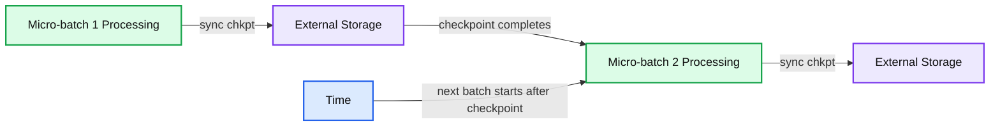
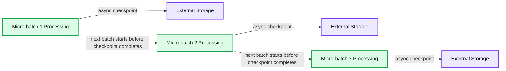

# Speed Up Streaming Queries With Asynchronous State Checkpointing

- Source: https://www.databricks.com/blog/2022/05/02/speed-up-streaming-queries-with-asynchronous-state-checkpointing.html
- Published: 2022-05-02
- Authors: Craig Ng
- Categories: engineering, data-engineering, data-streaming
- Images: 2 total, 2 extracted as architecture

## Background / Motivation

Stateful streaming is becoming more prevalent as stakeholders make increasingly sophisticated demands on greater volumes of data. The tradeoff, however, is that the computational complexity of stateful operations increases data latency, making it that much less actionable. Asynchronous state checkpointing, which separates the process of persisting state from the regular micro-batch checkpoint, provides a way to minimize processing latency while maintaining the two hallmarks of Structured Streaming: high throughput and reliability.

Before getting into the specifics, it’s helpful to provide some context and motivation as to why we developed this stream processing feature. The industry consensus regarding the main barometer for streaming performance is the absolute latency it takes for a pipeline to process a single record. However, we’d like to present a more nuanced view on evaluating overall performance: instead of considering just the end-to-end latency of a single record, it’s important to look at a combination of throughput and latency over a period of time and in a reliable fashion. That’s not to say that certain operational use cases don’t require the bare minimum absolute latency – those are valid and important. However, is it better for analytical and ETL use cases to process 200,000 records / second or 20M records / minute? It always depends on the use case, but we believe that volume and cost-effectiveness are just as important as velocity for streaming pipelines. There are fundamental tradeoffs between efficiency and supporting very low latency within the streaming engine implementations, so we encourage our customers to go through the exercise of determining whether the incremental cost is worth the marginal decrease in data latency.

Structured Streaming’s micro-batch execution model seeks to strike a balance between high throughput, reliability and data latency.

### High throughput

Thinking about streaming conceptually, all incoming data are considered unbounded, irrespective of the volume and velocity. Applying that concept to Structured Streaming, we can think of every query as generating an unbounded dataframe. Under the hood, Apache Spark™ breaks up the data coming in as an unbounded dataframe into smaller micro-batches that are also dataframes. This is important for two reasons:

- It allows the engine to apply the same optimizations available to batch / ad-hoc queries for each of those dataframes, maximizing efficiency and throughput
- It gives users the same simple interface and fault tolerance as batch / ad-hoc queries

### Reliability

On the reliability front, Structured Streaming writes out a checkpoint after each micro-batch, which tracks the progress of what it processed from the data source, intermediate state (for aggregations and joins), and what was written out to the data sink. In the event of failure or restart, the engine uses that information to ensure that the query only processes data exactly once. Structured Streaming stores these checkpoints on some type of durable storage (e.g., cloud blob storage) to ensure that the query properly recovers after failure. For **stateful** queries, the checkpoint includes writing out the state of all the keys involved in stateful operations to ensure that the query restarts with the proper values.

### Data latency

As data volumes increase, the number of keys and size of state maintained increases, making state management that much more important and time consuming. In order to further reduce the data latency for stateful queries, we’ve developed asynchronous checkpointing specifically for the state of the various keys involved in stateful operations. By separating this from the normal checkpoint process into a background thread, we allow the query to move on to the next micro-batch and make data available to the end users more quickly, while still maintaining reliability.

## How it works

Typically, Structured Streaming utilizes synchronous state checkpointing, meaning that the engine writes out the current state of all keys involved in stateful operations as part of the normal checkpoint for each micro-batch before proceeding to the next one. The benefit of this approach is that, if a streaming query fails, the application can quickly recover the progress of a stream and only needs to re-process starting from the failed micro-batch. The tradeoff for fast recovery is increased duration for normal micro-batch execution.

**Summary:** Synchronous state checkpointing writes each micro-batch’s state to external storage before the next micro-batch begins.

**Components:**

- Micro-batch 1 Processing
- Micro-batch 2 Processing
- External Storage
- Synchronous state checkpointing
- Time progression

**Flows:**

- Micro-batch 1 Processing -> External Storage: synchronous state checkpoint
- External Storage -> Micro-batch 2 Processing: checkpoint completion allows the next batch to start
- Micro-batch 2 Processing -> External Storage: synchronous state checkpoint
- Time -> Micro-batch 2 Processing: next batch starts after the previous checkpoint completes

**Numbers:** 1, 2

source image: https://www.databricks.com/wp-content/uploads/2022/04/db-94-blog-img-1.png

Asynchronous state checkpointing separates the checkpointing of state from the normal micro-batch execution. With the feature enabled, Structured Streaming doesn’t have to wait for checkpoint completion of the current micro-batch before proceeding to the next one – it starts immediately after. The executors send the status of the asynchronous commit back to the driver and once they all complete, the driver marks the micro-batch as fully committed. As of current, the feature allows for up to one micro-batch to be pending checkpoint completion. The tradeoff for lower data latency is that, on failure, the query may need to re-process two micro-batches to give the same fault-tolerance guarantees: the current micro-batch undergoing computation and the prior micro-batch whose state checkpoint was in process.

**Summary:** The diagram shows asynchronous state checkpointing, where micro-batch processing overlaps with asynchronous checkpoint writes to external storage.

**Components:**

- Micro-batch 1 Processing
- Micro-batch 2 Processing
- Micro-batch 3 Processing
- External Storage for each checkpoint
- Time axis

**Flows:**

- Micro-batch 1 Processing -> External Storage: async checkpoint
- Micro-batch 2 Processing -> External Storage: async checkpoint
- Micro-batch 3 Processing -> External Storage: async checkpoint
- Time axis -> Micro-batch processing: time progression

**Numbers:** 1, 2, 3

source image: https://www.databricks.com/wp-content/uploads/2022/04/db-94-blog-img-2.png

A metaphor for explaining this is shaping dough in a bakery. Bakers commonly use both hands to shape a single piece of dough, which is slower, but if they make a mistake, they only need to start over on that single piece. Some bakers may decide to shape two pieces of dough at once, which increases their throughput, but potential mistakes could necessitate recreating both pieces. In this example, synchronous processing is using two hands to shape one piece of dough and asynchronous processing is using two hands to shape separate pieces.

For queries bottlenecked on state updates, asynchronous state checkpointing provides a low cost way to reduce data latency without sacrificing any reliability.

## Identifying candidate queries

We want to reiterate that asynchronous state checkpointing only helps with certain workloads: stateful streams whose state checkpoint commit latency is a major contributing factor to overall micro-batch execution latency.

Here’s how users can identify good candidates:

- **Stateful operations**: the query includes stateful operations like windows, aggregations, [flat]mapGroupsWithState or stream-stream joins.
- **State checkpoint commit latency**: users can inspect the metrics from within a StreamingQueryListener event to understand the impact of the commit latency on overall micro-batch execution time. The log4j logs on the driver also contain the same information.

See below for an example of how to analyze a StreamingQueryListener event for good candidate query:

There’s a lot of rich information in the example above, but users should focus on certain metrics:

- Batch duration (**durationMs.triggerExecution**) is around 547 secs
- The aggregate state store commit time across all tasks (**stateOperators[0].commitTimeMs**) is around 3186 secs
- Tasks related to the state store (**stateOperators[0].numShufflePartitions**) is 64, which means that each task that contained the state operator added an average of 50 seconds of wall clock time (3186 seconds / 64 tasks) to each batch. Assuming all 64 tasks ran concurrently, the commit step accounted for around 9% (50 secs / 547 secs) of the batch duration. If the maximum number of concurrent tasks is less than 64, the percentage could increase. For example, if there were 32 concurrent tasks, then it would actually account for 18% of total execution time

## Enabling asynchronous state checkpointing

Provision a cluster with Databricks Runtime 10.4 or newer and use the following Spark configurations:

A few items to note:

- Asynchronous state checkpointing only supports the RocksDB-based state store
- Any failure related to storing an asynchronous state checkpoint will cause the query to fail after a predefined number of retries. This behavior is different from synchronous checkpointing (which is executed as part of a task) where Spark has the ability to retry failed tasks multiple times before failing a query

Through testing a combination of in-house and customer workloads on both file and message bus sources, we've found average micro-batch duration can improve by up to 25% for streams that have large state sizes with millions of entries. Anecdotally, we've seen even bigger improvements in peak micro-batch duration (the longest time it takes for the stream to process a micro-batch).

## Conclusion

Asynchronous state checkpointing isn’t a feature we’ve developed in isolation – it’s the next in a [series](https://docs.databricks.com/spark/latest/structured-streaming/production.html#state-operator-flatmapgroupswithstate-improvements) of new features we’ve released that simplify the operation and maintenance of stateful streaming queries. We’re continuing to make big investments in our streaming capabilities and are laser-focused on making it easy for our customers to deliver more data, more quickly, to their end users. Stay tuned!
