# Streaming Windows Event Logs into the Cybersecurity Lakehouse

*An architecture for endpoint log collection into the delta lake*

- Source: https://www.databricks.com/blog/2022/05/05/streaming-windows-event-logs-into-the-cybersecurity-lakehouse.html
- Published: 2022-05-05
- Authors: Derek King
- Categories: security-and-trust, engineering, data-engineering, data-streaming
- Images: 6 total, 2 extracted as architecture

*Free Edition has replaced Community Edition, offering enhanced features at no cost. Start using *[*Free Edition *](https://login.databricks.com/?intent=SIGN_UP&amp;signup_experience_step=EXPRESS&amp;provider=DB_FREE_TIER&amp;dbx_source=www)*today.*
 

## Streaming windows events into the Cybersecurity Lakehouse

Enterprise customers often ask, what is the easiest and simplest way to send Windows endpoint logs into Databricks in real time, perform ETL and run detection searches for security events against the data. This makes sense. Windows logs in large environments must be monitored but can be very noisy and consume considerable resources in traditional SIEM products. Ingesting system event logs into Delta tables and performing [streaming analytics](https://www.databricks.com/product/data-streaming) has many cost and performance benefits.

This blog focuses on how organizations can collect Windows event logs from endpoints, directly into a cybersecurity [lakehouse](https://www.databricks.com/discoverlakehouse). Specifically, we will demonstrate how to create a pipeline for Microsoft sysmon process events, and transform the data into a common information model (CIM) format that can be used for downstream analytics.

 

> "How can we ingest and hunt windows endpoints at scale, whilst also maintaining our current security architecture?"Curious Databricks Customer

### Proposed architecture

For all practical purposes, Windows endpoint logs must be shipped via a forwarder into a central repository for analysis. There are many vendor-specific executables to do this, so we have focused on the most universally applicable architecture available to everyone, using winlogbeats and a Kafka cluster. The [elastic winlogbeats](https://www.elastic.co/downloads/beats/winlogbeat) forwarder has both free and open source licensing, and [Apache Kafka](https://kafka.apache.org/) is also an open-source distributed event streaming platform. You can find a sample configuration file for both in the notebook or create your own specific configuration for Windows events using the winlogbeats manual. If you want to use a Kafka server for testing purposes, I created a [github repository](https://github.com/DerekKing001/kafka-in-docker) to make it easy. You may need to make adjustments to this architecture if you use other software.

**Summary:** Windows event logs flow from enterprise systems through Winlogbeat and Kafka into Databricks Spark Structured Streaming, then are written to Delta Lake in AWS Cloud.

**Components:**

- Enterprise: Windows systems generating event logs
- Winlogbeat: Kafka output
- Kafka: Event streaming platform
- Spark: Structured Streaming reader using Kafka format
- Databricks: Streaming processing platform
- Delta Lake: Durable lakehouse storage using Delta format
- AWS Cloud: Cloud environment hosting Kafka, Databricks, and Delta Lake

**Flows:**

- Enterprise -> Kafka: Windows event logs via Winlogbeat Kafka output
- Kafka -> Databricks: Streamed events read with spark readStream using Kafka format
- Databricks -> Delta Lake: Processed data written with df write using Delta format

**Numbers:** none

```mermaid
%% Shows Windows event logs streaming from enterprise systems into Delta Lake
flowchart LR
    E[Enterprise Windows systems]
    W[Winlogbeat Kafka output]
    K[Kafka]
    S[Spark streaming reader]
    D[Databricks]
    L[Delta Lake]
    A[AWS Cloud]

    E -->|Windows event logs| W
    W -->|Kafka events| K
    K -->|spark readStream Kafka format| S
    S -->|Streaming data| D
    D -->|df write Delta format| L

    subgraph AWS[AWS Cloud]
        K
        S
        D
        L
    end

    classDef client fill:#dbeafe,stroke:#2563eb,stroke-width:2px,color:#111
    classDef service fill:#dcfce7,stroke:#16a34a,stroke-width:2px,color:#111
    classDef store fill:#ede9fe,stroke:#7c3aed,stroke-width:2px,color:#111
    classDef cache fill:#fef3c7,stroke:#d97706,stroke-width:2px,color:#111
    classDef queue fill:#cffafe,stroke:#0891b2,stroke-width:2px,color:#111
    classDef critical fill:#fee2e2,stroke:#dc2626,stroke-width:4px,color:#111
    classDef external fill:#e5e7eb,stroke:#6b7280,stroke-width:2px,color:#111,stroke-dasharray:4 3
    classDef decision fill:#fce7f3,stroke:#db2777,stroke-width:2px,color:#111

    class E client
    class W,S,D service
    class K queue
    class L store
    class A external
```



<sub>source image: https://www.databricks.com/wp-content/uploads/2022/04/db-116-blog-img-1.png</sub>

### The data set

We have also installed [Microsoft system monitor](https://docs.microsoft.com/en-us/sysinternals/downloads/sysmon) (sysmon) due to its effectiveness for targeted collection used for security use cases. We will demonstrate how to parse the raw JSON logs from the sysmon/operational log and apply a common information model to the most relevant events. Once run, the notebook will produce [silver level](https://www.databricks.com/blog/2021/06/09/how-to-simplify-cdc-with-delta-lakes-change-data-feed.html) Delta Lake tables for the following events.

**Summary:** The table maps Windows Sysmon event categories to DataFrames and silver Delta tables.

**Components:**

- Processes: Event IDs 1, 5, 18; DataFrame sysmonProcess; Delta table default.Process
- Registry: Event IDs 12, 13, 14; DataFrame sysmonRegistry; Delta table default.Registry
- Service: Event ID 4; DataFrame sysmonService; Delta table default.Service
- File: Event IDs 11, 23; DataFrame sysmonFile; Delta table default.File
- Network: Event ID 3; DataFrame sysmonNetwork; Delta table default.Network
- WMI: Event IDs 19, 20, 21; DataFrame sysmonWMI; Delta table default.WMI

**Flows:**

- none

**Numbers:** 1, 5, 18, 12, 13, 14, 4, 11, 23, 3, 19, 20, 21

```text
%% mermaid failed to render; kept as text
%% Sysmon event mappings to DataFrames and Delta tables
flowchart TD
    A[Processes: 1 5 18 | sysmonProcess | default.Process]
    B[Registry: 12 13 14 | sysmonRegistry | default.Registry]
    C[Service: 4 | sysmonService | default.Service]
    D[File: 11 23 | sysmonFile | default.File]
    E[Network: 3 | sysmonNetwork | default.Network]
    F[WMI: 19 20 21 | sysmonWMI | default.WMI]

    classDef client fill:#dbeafe,stroke:#2563eb,stroke-width:2px,color:#111
    classDef service fill:#dcfce7,stroke:#16a34a,stroke-width:2px,color:#111
    classDef store fill:#ede9fe,stroke:#7c3aed,stroke-width:2px,color:#111
    classDef cache fill:#fef3c7,stroke:#d97706,stroke-width:2px,color:#111
    classDef queue fill:#cffafe,stroke:#0891b2,stroke-width:2px,color:#111
    classDef critical fill:#fee2e2,stroke:#dc2626,stroke-width:4px,color:#111
    classDef external fill:#e5e7eb,stroke:#6b7280,stroke-width:2px,color:#111,stroke-dasharray:4 3
    classDef decision fill:#fce7f3,stroke:#db2777,stroke-width:2px,color:#111

    class A,B,C,D,E,F service
```

<sub>source image: https://www.databricks.com/wp-content/uploads/2022/04/db-116-blog-img-2.png</sub>

Using the winlogbeats configuration file in the notebook, endpoints will also send WinEventLog:Security, WinEventLog:System, WinEventLog:Application, Windows Powershell and WinEventLog:WMI log files, which can also be used by the interested reader.

### Ingesting the data set through Kafka

You may be forgiven for thinking that getting data out of Kafka and into Delta Lake is a complicated business! However, it could not be simpler. With [Apache Spark](https://spark.apache.org/)™, the Kafka connector is ready to go and can stream data directly into Delta Lake using [Spark Streaming](https://docs.databricks.com/spark/latest/structured-streaming/kafka.html).

Tell spark.readStream to use the apache spark Kafka connector, located at
`kafka.bootstrap.servers`
ip address. subscribe to the topic that the windows events arrive on, and you are off to the races!

For readability, we'll show only the most prevalent parts of the code, however, the full notebook can be downloaded using the link at the bottom of the article, including a link to a community edition of Databricks if required.

Using the code above we read the raw Kafka stream using the read_kafka_topic function, and apply some top level extractions, primarily used to partition the bronze level table.

This is a great start. Our endpoint is streaming logs in real time to our Kafka cluster and into a Databricks dataframe. However, it appears we have some more work to do before that dataframe is ready for analytics!

Taking a closer look, the event_data field is nested in a struct, and looks like a complex json problem.

Before we start work transforming columns, we write the data frame into the bronze level table, partitioned by _*event_date,* and *_sourcetype*. Choosing these partition columns will allow us to efficiently read only the log source we need when filtering for events to apply our CIM transformations on.

The above data frame is the result of reading back the bronze table, flattening the columns and filtering for only process related events (process start, process end and pipe connected).

With the flattened column structure and a filtered data frame consisting of process related events, the final stage is to apply a data dictionary to normalize the field names. For this, we use the [OSSEM project](https://github.com/OTRF/OSSEM) naming format, and apply a function that takes the input dataframe, and a transformation list, and returns the final normalized dataframe.

The resulting data frame has been normalized to be CIM compliant and has been written to a silver table, partitioned by _event_date. Silver level tables are considered suitable for running detection rules against. *et-voila!*

Optionally, a good next step to increase the performance of the silver table, would be to [z-order](https://docs.databricks.com/delta/optimizations/file-mgmt.html#z-ordering-multi-dimensional-clustering) it based on the columns most likely used for filtering on. The columns *process_name *and *event_id* would be good candidates. Similarly applying a [bloom filter](https://docs.databricks.com/delta/optimizations/bloom-filters.html) based on the *user_name* column would speed up read activity when doing entity based searches. An example below.

### Conclusion

We have seen how to create a scalable streaming pipeline from enterprise endpoints that contains complex structures, directly into the lakehouse. This offers two major benefits. Firstly, the opportunity for targeted but often noisy data that can be analyzed downstream using detection rules, or AI for threat detection. Secondly the ability to maintain granular levels of historic endpoint data using Delta tables in cost effective storage, for long term retention and look backs if and when required.

Look out for future blogs, where we will dive deeper into some analytics using these data sets. Download the full [notebook](https://github.com/DerekKing001/databricks_cyber_notebooks/blob/master/winlogbeats-kafka-sysmon/winlogbeats-kafka-sysmon-example.py)and a [preconfigured Kafka server](https://github.com/DerekKing001/kafka-in-docker) to get started streaming Windows endpoint data into the lakehouse today! If you are not already a Databricks customer, feel free to spin up a [Community Edition](https://www.databricks.com/try-databricks) from here too.
