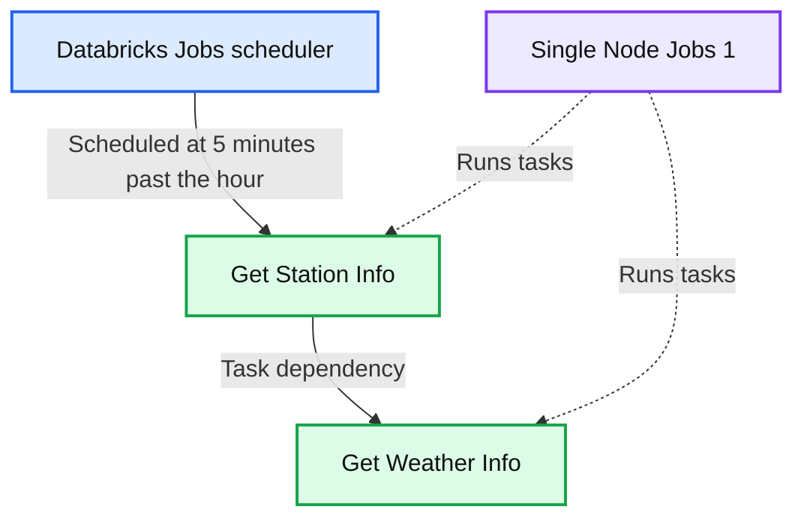
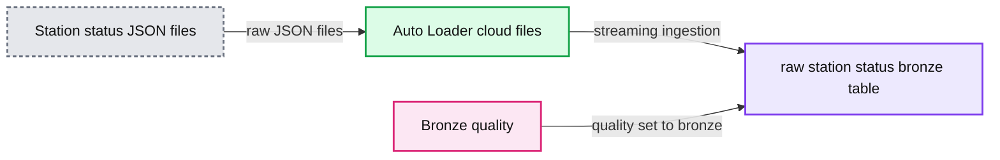
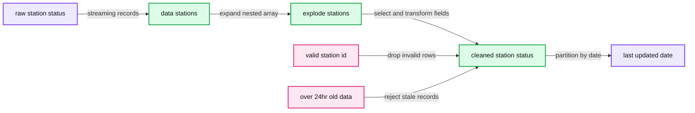

# How I Built A Streaming Analytics App With SQL and Delta Live Tables

- Source: https://www.databricks.com/blog/2022/05/19/how-i-built-a-streaming-analytics-app-with-sql-and-delta-live-tables.html
- Published: 2022-05-19
- Authors: Richard Tomlinson
- Categories: platform, product, data-streaming
- Images: 10 total, 5 extracted as architecture

## Planning my journey

I'd like to take you through the journey of how I used Databricks' [recently launched](https://www.databricks.com/blog/2021/05/27/announcing-the-launch-of-delta-live-tables-reliable-data-engineering-made-easy.html) Delta Live Tables product to build an end-to-end analytics application using [real-time data](https://www.databricks.com/product/data-streaming) with a SQL-only skillset.

I joined [Databricks](http://www.databricks.com/) as a Product Manager in early November 2021. I'm clearly still a newbie at the company but I've been working in data warehousing, BI, and business analytics since the mid-'90s. I've built a fair number of data warehouses and data marts in my time (Kimball or Inmon, take your pick) and have used practically every ETL and BI tool under the sun at one time or another.

I'm not a data engineer by today's standards. I know SQL well, but I'm more of a clicker than a coder. My technical experience is with tools like [Informatica](https://www.informatica.com/), Trifacta (now part of [Alteryx](https://www.alteryx.com/about-us/newsroom/press-release/alteryx-closes-acquisition-of-trifacta)), [DataStage](https://www.ibm.com/products/datastage), etc. vs. languages like Python and Scala. My persona I think, is more like what our friends at [dbt labs](https://www.getdbt.com/) would call an [Analytics Engineer](https://www.getdbt.com/what-is-analytics-engineering/) vs. a Data Engineer.

So with all this as a backdrop and in a bid to learn as many Databricks products as I can (given my newbie status in the company), I set out on the journey to build my app. And I didn't want it to be just another boring static BI dashboard. I wanted to build something much more akin to a production app with actual live data.

Since I live in Chicago, I'm going to use the [Divvy Bikes](https://ride.divvybikes.com/system-data) data. I've seen a lot of demos using their [static datasets](https://divvy-tripdata.s3.amazonaws.com/index.html) but hardly any using their [real-time APIs](https://gbfs.divvybikes.com/gbfs/gbfs.json). These APIs track the 'live' station status (e.g. # bikes available, # docks available, etc.) of all 842 stations across the city. Given bicycle rentals are so dependent on the weather, I'll join this data with real-time weather information at each station using the [OpenWeather APIs](https://openweathermap.org/current). That way we can see the impact of the brutal Chicago winter on Divvy Bike usage.

## Capturing and ingesting the source data

Given our data sources are the [Divvy Bikes](https://ride.divvybikes.com/system-data) and [OpenWeather](https://openweathermap.org/current) APIs, the first thing I need to do is figure out how to capture this data so it's available in our cloud data lake (i.e. ADLS in my case, as my Databricks Workspace is running in [Azure](https://azuremarketplace.microsoft.com/en-us/marketplace/apps/Microsoft.Databricks)).

There are lots of [data ingest](https://www.databricks.com/product/data-ingestion) tools I could choose for this task. Many of these, like [Fivetran](https://www.fivetran.com/), are available in just a couple of clicks via our [Partner Connect](https://www.databricks.com/partnerconnect) ecosystem. However, for the sake of simplicity, I just created [3 simple Python scripts](https://github.com/databricks/delta-live-tables-notebooks/tree/main/divvy-bike-demo) to call the APIs and then write the results into the data lake.

Once built and tested, I configured the scripts as two distinct [Databricks Jobs](https://docs.databricks.com/jobs.html).

The first job gets the real-time station status every minute, returning a single JSON file with the current status of all 1,200 or so Divvy Bike stations in Chicago. A sample payload looks like [this](https://gbfs.divvybikes.com/gbfs/en/station_status.json). Managing data volumes and the number of files will be of concern here. We are retrieving the status for every station, every minute. This will collect 1,440 JSON files (60 files/hour*24hrs) and ~1.7M new rows every day. At that rate, one year of data gives us ~520k JSON files and ~630M rows to process.

The second job consists of two tasks that run every hour.

**Summary:** A scheduled Databricks job runs station-information and weather-information tasks sequentially on a single-node cluster.

**Components:**

- Get Station Info task using a station-information API ingest
- Get Weather Info task using an Altimeter weather-information API ingest
- Single Node Jobs 1 cluster using Apache Spark 3.1.2 and Scala 2.12
- Databricks Jobs scheduler

**Flows:**

- Get Station Info -> Get Weather Info: sequential task dependency
- Databricks Jobs scheduler -> Get Station Info: scheduled execution
- Databricks Jobs scheduler -> Get Weather Info: scheduled job workflow

**Numbers:** 487; 1; 5 minutes; UTC+00:00; 0 workers; 9.1 LTS; Apache Spark 3.1.2; Scala 2.12



<sub>source image: https://www.databricks.com/wp-content/uploads/2022/05/db-171-blog-img-1.png</sub>

The first task retrieves descriptive information for every station such as name, type, lat, long, etc. This is a classic 'slowly changing dimension' in data warehousing terms since we do not expect this information to change frequently. Even so, we will refresh this data every hour just in case it does; for example, a new station might come online, or an existing one could be updated or deactivated. Check out a sample payload [here](https://gbfs.divvybikes.com/gbfs/en/station_information.json).

The second task in the job then fetches real-time weather information for each of the 1200 or so stations. [This](https://api.openweathermap.org/data/2.5/weather?lat=41.886976&lon=-87.612813&appid=02326bd6ed06462cbc8e570e2260bd14) is an example payload for one of the stations. We call the API using its lat/long coordinates. Since we will call the OpenWeather API for every station we will end up with 28,800 files every day (1200*24). Extrapolating for a year gives us ~10.5M JSON files to manage.

These scripts have been running for a while now. I started them on January 4th, 2022 and they have been merrily creating new files in my data lake ever since.

## Realizing my "simple" demo is actually quite complex

Knowing that I now need to blend and transform all this data, and having done the math on potential volumes, and looked at data samples a bit, this is where I start to sweat. Did I bite off more than I can chew? There are a few things that make this challenging vs. your average 'static' dashboard:

1. I've no idea how to manage thousands of new JSON files that are constantly arriving throughout the day. I also want to capture several months of data to look at historical trends. That's millions of JSON files to manage!
2. How do I build a real-time ETL pipeline to get the data ready for fast analytics? My source data is raw JSON and needs cleansing, transforming, joining with other sources, and aggregating for analytical performance. There will be tons of steps and dependencies in my pipeline to consider.
3. How do I handle incremental loads? I obviously cannot rebuild my tables from scratch when data is constantly streaming into the data lake and we want to build a real-time dashboard. So I need to figure out a reliable way to handle constantly moving data.
4. The OpenWeather JSON schema is unpredictable. I quickly learned that the schema can change over time. For example, if it's not snowing, you don't get snow metrics returned in the payload. How do you design a target schema when you can't predict the source schema!?
5. What happens if my data pipeline fails? How do I know when it failed and how do I restart it where it left off? How do I know which JSON files have already been processed, and which haven't?
6. What about query performance in my dashboards? If they are real-time dashboards they need to be snappy. I can't have unfinished queries when new data is constantly flowing in. To compound this, I'll quickly be dealing with hundreds of millions (if not billions) of rows. How do I performance tune for this? How do I optimize and maintain my source files over time? Help!

OK, I'll stop now. I'm getting flustered just writing this list and I'm sure there are a hundred other little hurdles to jump over. Do I even have the time to build this? Maybe I should just watch some videos of other people doing it and call it a day?

No. I will press on!

## De-stressing with Delta Live Tables

OK, so next up — how to write a real-time ETL pipeline. Well, not 'real' real-time. I'd call this near real-time — which I'm sure is what 90% of people really mean when they say they need real-time. Given I'm only pulling data from the APIs every minute, I'm not going to get fresher data than that in my analytics app. Which is fine for a monitoring use case like this.

Databricks recently announced full availability for [Delta Live Tables](https://www.databricks.com/blog/2022/04/05/announcing-generally-availability-of-databricks-delta-live-tables-dlt.html) (aka DLT). DLT happens to be perfect for this as it offers *"a simple declarative approach to building reliable data pipelines while automatically managing infrastructure at scale, so data analysts and engineers can spend less time on tooling and focus on getting value from data."* Sounds good to me!

DLT also allows me to build pipelines in [SQL](https://docs.microsoft.com/en-us/azure/databricks/data-engineering/delta-live-tables/delta-live-tables-sql-ref) which means I can keep to my SQL-only goal. For what it's worth, it also allows you to build pipelines in [Python](https://docs.microsoft.com/en-us/azure/databricks/data-engineering/delta-live-tables/delta-live-tables-python-ref) if you so choose - but that's not for me.

The big win is that DLT allows you to write declarative ETL pipelines, meaning rather than hand-coding low-level ETL logic, I can spend my time on the 'what' to do, and not the 'how' to do it. With DLT, I just specify how to transform and apply business logic, while DLT automatically manages all the dependencies within the pipeline. This ensures all the tables in my pipeline are correctly populated and in the right order.

This is great as I want to build out a [medallion architecture to simplify change data capture](https://www.databricks.com/blog/2021/06/09/how-to-simplify-cdc-with-delta-lakes-change-data-feed.html) and enable multiple use cases on the same data, including those that involve data science and machine learning - one of the many reasons to go with a [Lakehouse](https://www.databricks.com/blog/2020/01/30/what-is-a-data-lakehouse.html) over just a data warehouse.

**Summary:** Delta Lake medallion architecture showing streaming and batch loads moving through Bronze, Silver, and Gold tables to business intelligence and machine learning.

**Components:**

- Streaming Loads using Delta Lake
- Batch Loads using Delta Lake
- Ingestion Tables Bronze using Delta Lake
- Refined Tables Silver using Delta Lake
- Feature and Aggregate Tables Gold using Delta Lake
- Business Intelligence using Gold tables
- Machine Learning using Gold tables

**Flows:**

- Streaming Loads -> Ingestion Tables Bronze: streaming data
- Batch Loads -> Ingestion Tables Bronze: batch data
- Ingestion Tables Bronze -> Refined Tables Silver: refined data
- Refined Tables Silver -> Feature and Aggregate Tables Gold: features and aggregates
- Feature and Aggregate Tables Gold -> Business Intelligence: analytics data
- Feature and Aggregate Tables Gold -> Machine Learning: machine learning data

**Numbers:** none



<sub>source image: https://www.databricks.com/wp-content/uploads/2022/05/db-171-blog-img-2.png</sub>

```mermaid
%% Shows Delta Lake medallion architecture for streaming and batch use cases
flowchart LR
    SL[Streaming Loads] -->|streaming data| B[Ingestion Tables Bronze]
    BL[Batch Loads] -->|batch data| B
    B -->|refined data| S[Refined Tables Silver]
    S -->|features and aggregates| G[Feature and Aggregate Tables Gold]
    G -->|analytics data| BI[Business Intelligence]
    G -->|machine learning data| ML[Machine Learning]

    classDef client fill:#dbeafe,stroke:#2563eb,stroke-width:2px,color:#111
    classDef service fill:#dcfce7,stroke:#16a34a,stroke-width:2px,color:#111
    classDef store fill:#ede9fe,stroke:#7c3aed,stroke-width:2px,color:#111
    classDef cache fill:#fef3c7,stroke:#d97706,stroke-width:2px,color:#111
    classDef queue fill:#cffafe,stroke:#0891b2,stroke-width:2px,color:#111
    classDef critical fill:#fee2e2,stroke:#dc2626,stroke-width:4px,color:#111
    classDef external fill:#e5e7eb,stroke:#6b7280,stroke-width:2px,color:#111,stroke-dasharray:4 3
    classDef decision fill:#fce7f3,stroke:#db2777,stroke-width:2px,color:#111

    class SL,BL client
    class B,S,G store
    class BI,ML external
```

Other big benefits of DLT include:

- Data quality checks to validate records as they flow through the pipeline based on expectations (rules) I set
- Automatic error handling and recovery — so if my pipeline goes down, it can recover!
- Out-of-the-box monitoring so I can look at real-time pipeline health statistics and trends
- Single-click deploy to production and rollback options, allowing me to follow CI/CD patterns should I choose

And what is more, DLT works in batch or continuously! This means I can keep my pipeline 'always on' and don't have to know complex stream processing or how to implement recovery logic.

Ok, so I think this addresses most of my concerns from the previous section. I can feel my stress levels subsiding already.

## A quick look at the DLT SQL code

So what does this all look like? You can download my DLT SQL notebook [here](https://github.com/databricks/delta-live-tables-notebooks/blob/main/divvy-bike-demo/dlt-sql-streaming-divvybikes.sql) if you want to get hands-on; it's dead simple, but I will walk you through the highlights.

First, we build out our Bronze tables in our medallion architecture. These tables simply represent the raw JSON in a table format. Along the way, we are converting the JSON data to [Delta Lake](https://www.databricks.com/product/delta-lake-on-databricks) format, which is an open format storage layer that delivers reliability, security, and performance on the data lake. We are not really transforming the data in this step. Here's an example for one of the tables:

**Summary:** Databricks SQL defines a bronze streaming live table that ingests raw JSON station status data from cloud files using Auto Loader.

**Components:**

- `raw_station_status` - Delta Live Tables streaming live table
- `/FileStore/DivvyBikes/api_response/station_status` - JSON source directory
- Auto Loader via `cloud_files`
- Bronze quality expectation

**Flows:**

- `/FileStore/DivvyBikes/api_response/station_status` -> `raw_station_status`: raw JSON ingestion through Auto Loader

**Numbers:** none



<sub>source image: https://www.databricks.com/wp-content/uploads/2022/05/db-171-blog-img-3.png</sub>

First, notice that we have defined this as a 'STREAMING' live table. This means the table will automatically support updates based on continually arriving data without having to recompute the entire table.

You will also notice that we are also using [Auto Loader](https://docs.databricks.com/spark/latest/structured-streaming/auto-loader.html?_gl=1*5acdci*_gcl_aw*R0NMLjE2NDM0MDI5ODQuQ2owS0NRaUF4YzZQQmhDRUFSSXNBSDhIZmYyXzJWNU9RVFVzT0dkSmNGZUxHNzZfSGdQSnZWTlpyMXhlSXBnZVgtRHdwVG12YU1Hb3g5b2FBb3NNRUFMd193Y0I.&_ga=2.173734947.1071520941.1646062649-1555867528.1635725885&_gac=1.127430783.1643402985.Cj0KCQiAxc6PBhCEARIsAH8Hff2_2V5OQTUsOGdJcFeLG76_HgPJvVNZr1xeIpgeX-DwpTmvaMGox9oaAosMEALw_wcB) (cloud_files) to read the raw JSON from object storage (ADLS). Auto Loader is a critical part of this pipeline, and provides a seamless way to load the raw data at low cost and latency with minimal DevOps effort.

Auto Loader incrementally processes new files as they land on cloud storage so I don't need to manage any state information. It efficiently tracks new files as they arrive by leveraging cloud services without having to list all the files in a directory. Which is scalable even with millions of files in a directory. It is also incredibly easy to use, and will automatically set up all the internal notifications and message queue services required for incremental processing.

It also handles schema inference and evolution. You can read more on that [here](https://docs.databricks.com/spark/latest/structured-streaming/auto-loader.html#schema-inference-and-evolution) but in short, it means I don't have to know the JSON schema in advance, and it will gracefully handle 'evolving' schemas over time without failing my pipeline. Perfect for my OpenWeather API payload - yet another stress factor eliminated.

Once I have defined all my Bronze level tables I can start doing some real ETL work to clean up the raw data. Here's an example of how I create a 'Silver' medallion table:

**Summary:** DLT SQL creates a cleaned Silver streaming table from the raw station status stream by exploding station records, transforming timestamps, and enforcing data quality rules.

**Components:**

- `raw_station_status` - Delta Live Tables streaming source
- `data.stations` - Nested station array
- `EXPLODE` - SQL transformation that expands station records
- `cleaned_station_status` - Delta Live Tables Silver streaming table
- `valid_station_id` - DLT expectation requiring non-null station IDs
- `over_24hr_old_data` - DLT expectation rejecting stale records
- `last_updated_date` - Partitioning field
- `quality = silver` - Silver medallion table property

**Flows:**

- `raw_station_status -> data.stations`: Streams raw station status records
- `data.stations -> EXPLODE`: Expands the nested station array
- `EXPLODE -> cleaned_station_status`: Selects and transforms station fields
- `valid_station_id -> cleaned_station_status`: Drops rows with null station IDs
- `over_24hr_old_data -> cleaned_station_status`: Rejects records older than the allowed threshold

**Numbers:** 86400 seconds, 24hr



<sub>source image: https://www.databricks.com/wp-content/uploads/2022/05/db-171-blog-img-4.png</sub>

You'll notice a number of cool things here. First, it is another streaming table, so as soon as the data arrives in the source table (raw_station_status), it will be streamed over to this table right away.

Next, notice that I have set a rule that station_id is NOT NULL. This is an example of a [DLT expectation or data quality constraint](https://docs.databricks.com/data-engineering/delta-live-tables/delta-live-tables-expectations.html). I can declare as many of these as I like. An expectation consists of a description, a rule (invariant), and an action to take when a record fails the rule. Above I decided to drop the row from the table if a NULL station_id is encountered. Delta Live Tables captures Pipeline events in logs so I can easily monitor things like how often rules are triggered to help me assess the quality of my data and take appropriate action.

I also added a comment and a table property as this is a best practice. Who doesn't love metadata?

Finally, you can unleash the full power of SQL to transform the data exactly how you want it. Notice how I [explode](https://docs.databricks.com/sql/language-manual/functions/explode.html) my JSON into multiple rows and perform a whole bunch of datetime transformations for reporting purposes further downstream.

## Handling slowly changing dimensions

The example above outlines ETL logic for loading up a transactional or [fact table](https://www.kimballgroup.com/2008/11/fact-tables/). So the next common design pattern we need to handle is the concept of [slowly changing dimensions](https://towardsdatascience.com/data-analysts-primer-to-slowly-changing-dimensions-d087c8327e08) (SCD). Luckily DLT handles these too!

Databricks just announced DLT [support for common CDC patterns](https://www.databricks.com/blog/2022/02/10/databricks-delta-live-tables-announces-support-for-simplified-change-data-capture.html) with a new declarative APPLY CHANGES INTO feature for SQL and Python. This new capability lets ETL pipelines easily detect source data changes and apply them to datasets throughout the lakehouse. DLT processes data changes into the Delta Lake incrementally, flagging records to be inserted, updated, or deleted when handling CDC events.

Our station_information dataset is a great example of when to use this.

Instead of simply appending, we update the row if it already exists (based on station_id) or insert a new row if it does not. I could even delete records using the APPLY AS DELETE WHEN condition but I learned a long time ago that we never delete records in a data warehouse. So this is classified as an [SCD type 1](https://en.wikipedia.org/wiki/Slowly_changing_dimension#Type_1:_overwrite).

## Deploying the data pipeline

I've only created bronze and silver tables in my pipeline so far but that's ok. I could create gold level tables to pre-aggregate some of my data ahead of time enabling my reports to run faster, but I don't know if I need them yet and can always add them later.

So the deployed data pipeline currently looks like this:

**Summary:** A continuously running Delta Live Tables pipeline transforms three raw bronze tables into silver tables, including an intermediate exploded station view.

**Components:**

- raw_station_status - Delta Live Tables SQL bronze table
- cleaned_station_status - Delta Live Tables SQL silver table
- raw_weather_information - Delta Live Tables SQL bronze table
- cleaned_weather_information - Delta Live Tables SQL silver table
- raw_station_information - Delta Live Tables SQL bronze table
- exploded_raw_station_status - Delta Live Tables SQL intermediate view
- cleaned_station_information - Delta Live Tables SQL silver table

**Flows:**

- raw_station_status -> cleaned_station_status: station status data
- raw_weather_information -> cleaned_weather_information: weather data
- raw_station_information -> exploded_raw_station_status: raw station information
- exploded_raw_station_status -> cleaned_station_information: exploded station data

**Numbers:** 141h 50m 14s, 141h 50m 13s, 2 days ago, 14 hours ago, 2/22/2022, 7:04:10 PM

```text
%% mermaid failed to render; kept as text
%% Shows the bronze to silver Delta Live Tables data flow
flowchart LR
    A[raw station status] -->|station status data| B[cleaned station status]
    C[raw weather information] -->|weather data| D[cleaned weather information]
    E[raw station information] -->|raw station information| F[exploded raw station status]
    F -->|exploded station data| G[cleaned station information]

    classDef client   fill:#dbeafe,stroke:#2563eb,stroke-width:2px,color:#111
    classDef service  fill:#dcfce7,stroke:#16a34a,stroke-width:2px,color:#111
    classDef store    fill:#ede9fe,stroke:#7c3aed,stroke-width:2px,color:#111
    classDef cache    fill:#fef3c7,stroke:#d97706,stroke-width:2px,color:#111
    classDef queue    fill:#cffafe,stroke:#0891b2,stroke-width:2px,color:#111
    classDef critical fill:#fee2e2,stroke:#dc2626,stroke-width:4px,color:#111
    classDef external  fill:#e5e7eb,stroke:#6b7280,stroke-width:2px,color:#111,stroke-dasharray:4 3
    classDef decision fill:#fce7f3,stroke:#db2777,stroke-width:2px,color:#111

    A,C,E service
    B,D,G store
    F service
```

<sub>source image: https://www.databricks.com/wp-content/uploads/2022/05/db-171-blog-img-6.png</sub>

3 bronze (raw) tables, an intermediate view (needed for some JSON gymnastics), and 3 silver tables that are ready to be reported on.

Deploying the pipeline was easy, too. I just threw all of my SQL into a Notebook and created a continuous (vs. triggered) DLT pipeline. Since this is a demo app I haven't moved it into production yet but there's a button for that, I can toggle between development and production modes here to change the underlying infrastructure the pipeline runs on. In development mode, I can avoid automatic retries and cluster restarts, but switch these on for production. I can also start and stop this pipeline as much as I want. DLT just keeps track of all the files it has loaded so knows exactly where to pick up from.

## Creating amazing dashboards with Databricks SQL

The final step is to build out some dashboards to visualize how all this data comes together in real-time. The focus of this particular blog is more on DLT and the data engineering side of things, so I'll talk about the types of queries I built in a follow-up article to this.

You can also download my dashboard SQL queries [here](https://github.com/databricks/delta-live-tables-notebooks/blob/main/divvy-bike-demo/dbsql-divvybike-dashboard-sql.sql).

My queries, visualizations, and dashboards were built using [Databricks SQL](https://www.databricks.com/product/databricks-sql) (DB SQL). I could go on at length about the amazing [record-breaking](https://www.databricks.com/blog/2021/11/02/databricks-sets-official-data-warehousing-performance-record.html) capabilities of the [Photon](https://www.databricks.com/product/photon) query engine, but that is also for another time.

Included with DB SQL are data visualization and dashboarding capabilities, which I used in this case, but you can also connect your favorite BI or Data Visualization tool, all of which work seamlessly.

I ended up building 2 dashboards. I'll give a quick tour of each.

The first dashboard focuses on real-time monitoring. It shows the current status of any station in terms of the availability of bikes/docks along with weather stats for each station. It also shows trends over the last 24 hrs. The metrics displayed for 'now' are never more than one minute old, so it's a very actionable dashboard. It's worth noting that 67.22°F is nice and warm for Chicago in early May!

Another cool feature is that you can switch to any day, hour, and minute to see what the status was in the past. For example, I can change my 'Date and Time' filter to look at Feb 2nd, 2022 at 9 am CST to see how rides were impacted during a snowstorm.

I can also look at stations with zero availability on a map in real-time, or for any date and time in the past.

The second dashboard shows trends over time from when the data was first collected until now:

In terms of dashboard query performance, all I can say is that I haven't felt the need to create any aggregated or 'Gold' level tables in my medallion architecture yet. SQL query performance is just fine as-is. No query runs for any longer than ~3 seconds, and most run within a second or two.

Apart from the exceptional query performance of the Photon engine, one of the key benefits of DLT is that it also performs routine maintenance tasks such as a full [OPTIMIZE](https://docs.databricks.com/spark/latest/spark-sql/language-manual/delta-optimize.html) operation followed by [VACUUM](https://docs.databricks.com/spark/latest/spark-sql/language-manual/delta-vacuum.html) on my pipeline tables every 24 hours. This not only helps improve query performance but also reduces costs by removing older versions of tables that are no longer needed.

## Summary

I've come to the end of this part of my journey, which was also my first journey with Databricks. I'm surprised at how straightforward it was to get here considering many of the concerns I outlined earlier. I achieved my goal to build a full end-to-end analytics app with real-time data without needing to write any code or pick up the batphone to get the assistance of a 'serious' data engineer.

There are lots of data and analytics experts with similar backgrounds and skill sets to me, and I feel products like Delta Live Tables will truly unlock Databricks to way more data and analytics practitioners. It will also help more sophisticated data engineers by streamlining and automating laborious operational tasks so they can focus on their core mission — innovating with data.

If you would like to learn more about Delta Live Tables please visit our [web page](https://www.databricks.com/product/delta-live-tables). There you will find links to [eBooks](https://www.databricks.com/p/ebook/data-management-101), technical guides to [get you started](https://www.databricks.com/discover/pages/getting-started-with-delta-live-tables), and [webinars](https://www.databricks.com/p/webinar/tackle-data-transformation). You can also watch a recorded demo walking through the [Divvy Bike demo](https://youtu.be/BIxwoO65ylY) on our YouTube channel and download the [demo assets](https://github.com/databricks/delta-live-tables-notebooks/tree/main/divvy-bike-demo) on Github.

Thanks!
