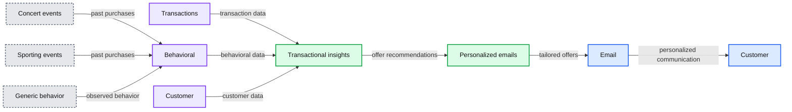
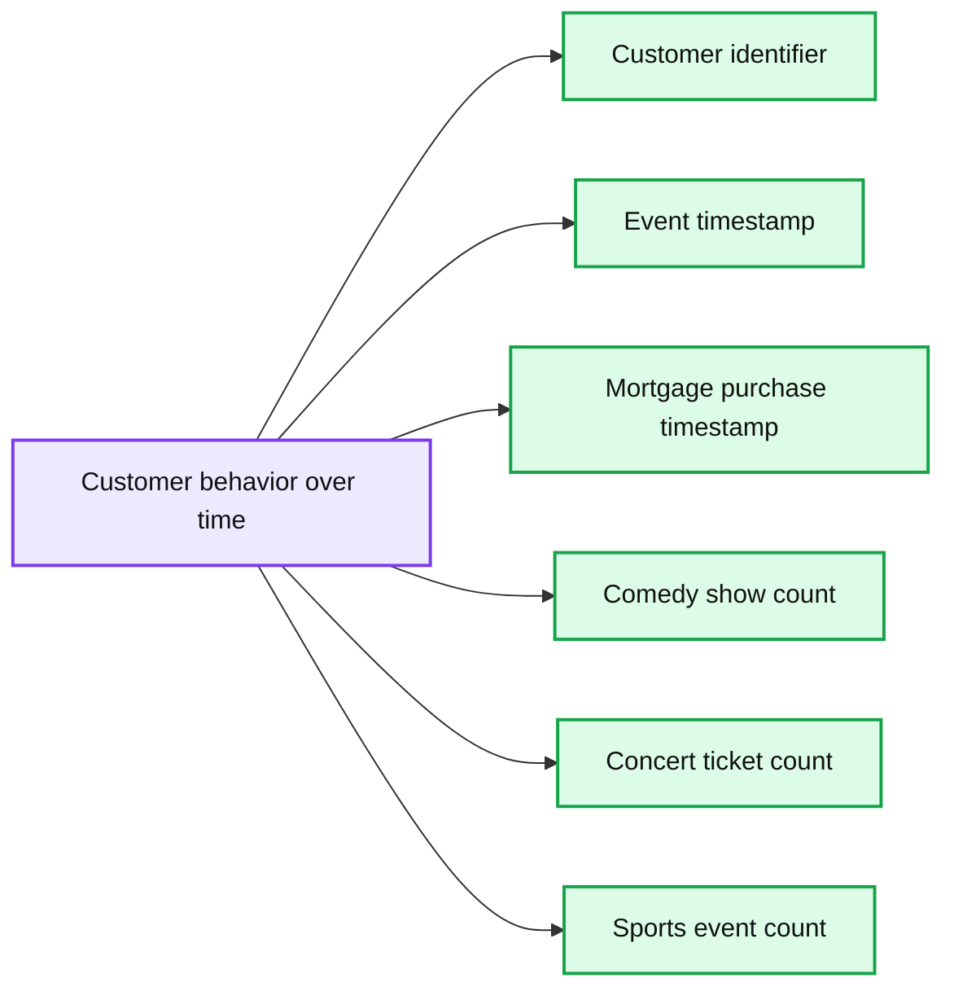
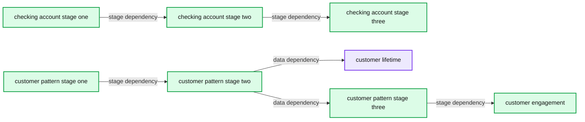

# Design Patterns for Real-time Insights in Financial Services

*Streaming Foundations for Personalization*

- Source: https://www.databricks.com/blog/2022/05/20/design-patterns-for-real-time-insights-in-financial-services.html
- Published: 2022-05-20
- Authors: Ricardo Portilla
- Categories: engineering, solution-accelerators
- Images: 8 total, 5 extracted as architecture

Personalization is a competitive differentiator for most every financial services institution (FSIs, for short), from banking to insurance and now investment management platforms. While every FSI wants to offer intelligent and real-time personalization to customers, the foundations are often glossed over or implemented with incomplete platforms, leading to stale insights, long time-to-market, and loss of productivity due to the need to glue streaming, AI, and reporting services together.

This blog will demonstrate how to lay a robust foundation for real-time insights for financial services use cases with the Databricks Lakehouse platform, from OLTP database Change Data Capture (CDC) data to reporting dashboard. Databricks has long supported streaming, which is native to the platform. The recent release of [Delta Live Tables](https://www.databricks.com/product/delta-live-tables) (DLT) has made streaming even simpler and more powerful with new CDC capabilities. We have covered a guide to CDC using DLT in a recent comprehensive [blog](https://www.databricks.com/blog/2022/04/25/simplifying-change-data-capture-with-databricks-delta-live-tables.html). In this blog, we focus on streaming for FSIs and show how these capabilities help streamline new product differentiators and internal insights for FSIs.

## Why streaming ingestion is critical

Before getting into technical details, let’s discuss why Databricks is best for personalization use cases, and specifically why implementing streaming should be the first step. Many Databricks customers who are implementing Customer 360 projects or full-funnel marketing strategies typically have the base requirements below. Note the temporal (time-related) data flow.

### FSI Data Flow and Requirements

1. User app saves and updates data such as clickstream, user updates, and geolocation data - requires operational databases
2. Third party behavioral data is delivered incrementally via object storage or is available in a database in a cloud account - requires streaming capabilities to *incrementally* add/update/delete new data in single source of truth for analytics
3. FSI has an automated process to export all database data including user updates, clickstream, and user behavioral data into data lake - requires Change Data Capture (CDC) ingestion and processing tool, as well as support for semi-structured and unstructured data
4. Data engineering teams run automated data quality checks and ensure the data is fresh - requires data quality tool and native streaming
5. Data science teams use data for next best action or other predictive analytics - requires native ML capabilities
6. Analytics engineers and Data analysts will materialize data models and use data for reporting - requires dashboard integration and native visualization

The core requirements here are data freshness for reporting, data quality to maintain integrity, CDC ingestion, and ML-ready data stores. In Databricks, these map directly to Delta Live Tables (notably Auto Loader, Expectations, and DLT’s SCD Type I API), [Databricks SQL](https://docs.databricks.com/sql/index.html), and [Feature Store](https://docs.databricks.com/applications/machine-learning/feature-store/index.html). Since reporting and AI-driven insights depend upon a steady flow of high-quality data, streaming is the logical first step to master.

**Summary:** The diagram shows transactional, behavioral, and customer data informing personalized emails with exclusive offers.

**Components:**

- Customer: recipient of personalized email
- Email: communication channel
- Personalized emails: tailored exclusive offers
- Transactions: transaction data source
- Behavioral: behavioral data source
- Customer: customer data source
- Transactional insights: derived decision input
- Concert events: behavioral example
- Sporting events: behavioral example
- Generic behavior: behavioral example

**Flows:**

- Transactions -> Transactional insights: transaction data
- Behavioral -> Transactional insights: behavioral data
- Customer -> Transactional insights: customer data
- Transactional insights -> Personalized emails: personalized offer recommendations
- Concert events -> Behavioral: past purchase behavior
- Sporting events -> Behavioral: past purchase behavior
- Generic behavior -> Behavioral: observed behavior
- Personalized emails -> Email: tailored exclusive offers
- Email -> Customer: personalized communication

**Numbers:** 360°

source image: https://www.databricks.com/wp-content/uploads/2022/05/db-168-blog-img-1.jpg

Consider, for example, a retail bank wanting to use digital marketing to attract more customers and improve brand loyalty. It is possible to identify key trends in customer buying patterns and send personalized communication with exclusive product offers in real time tailored to the exact customer needs and wants. This is a simple, but an invaluable use case that's only possible with streaming and change data capture (CDC) - both capabilities required to capture changes in consumer behavior and risk profiles.

For a sneak peak at the types of data we handle in our reference DLT pipeline, see the samples below. Notice the temporal nature of the data - all banking or lending systems have time-ordered transactional data, and a trusted data source means having to incorporate late-arriving and out-of-order data. The core datasets shown include transactions from, say, a checking account (Figure 2), customer updates, but also behavioral data (Figure 3) which may be tracked from transactions or upstream third-party data.

**Summary:** Sample checking-account transaction records for customer 3 over time.

**Components:**

- customer_id: customer identifier, technology not specified
- scheduled_payment: payment schedule indicator, technology not specified
- txn_amount: transaction amount, technology not specified
- debit_or_credit: debit or credit indicator, technology not specified
- updt_ts: transaction update timestamp, technology not specified
- initial_balance: starting account balance, technology not specified

**Flows:**

- none

**Numbers:** Row numbers 1, 2, 3, 4, 5, 6, 7; customer_id 3; scheduled_payment 1; txn_amount values 3, 3, 13, 23, 33, 43, 53; debit_or_credit values 0, 1, 1, 1, 1, 1, 1; timestamps 2022-05-02T03:29:54.337+0000, 2022-05-02T03:29:56.011+0000, 2022-05-03T03:29:57.201+0000, 2022-05-04T03:29:58.370+0000, 2022-05-05T03:29:59.532+0000, 2022-05-06T03:30:00.692+0000, 2022-05-07T03:30:01.854+0000; initial_balance 10000 in every row

source image: https://www.databricks.com/wp-content/uploads/2022/05/db-168-blog-img-2.png

**Summary:** Sample per-customer behavioral data tracked over time, including mortgage purchase status and entertainment activity counts.

**Components:**

- customer_id: customer identifier, technology not specified
- event_ts: event timestamp, technology not specified
- home_mortgage_purchased_ts: mortgage purchase timestamp, technology not specified
- number_of_comedy_shows: comedy attendance count, technology not specified
- number_of_concert_tickets: concert ticket count, technology not specified
- number_of_sport_events: sports event count, technology not specified

**Flows:**

- none

**Numbers:** Row numbers 1 through 9; customer_id 3; event timestamps 2022-05-05 03:11:27, 2022-05-15 03:11:38, 2022-05-25 03:11:49, 2022-06-04 03:11:59, 2022-06-14 03:12:09, 2022-06-24 03:12:20, 2022-07-04 03:12:30, 2022-07-14 03:12:41, 2022-07-24 03:12:51; home_mortgage_purchased_ts 1658632371000; comedy counts 1, 2, 3, 3, 3, 3, 4, 4, 4; concert counts 6, 7, 8, 8, 8, 8, 9, 9, 9; sports counts 2, 3, 3, 3, 3, 4, 4, 4, 4.

source image: https://www.databricks.com/wp-content/uploads/2022/05/db-168-blog-img-3.png

## Getting started with Streaming

In this section, we will demonstrate a simple end-to-end data flow so that it is clear how to capture continuous changes from transactional databases and store them in a Lakehouse using Databricks streaming capabilities.

Our starting point are records mocked up from standard formats from transactional databases. The diagram below provides an end-to-end picture of how data might flow through an FSI’s infrastructure, including the many varieties of data which ultimately land in Delta Lake, are cleaned, and summarized and served in a dashboard. There are three main processes mentioned in this diagram, and in the next section we'll break down some prescriptive options for each one.

*End-to-end architecture of how data might flow through an FSI’s infrastructure, illustrating the myriad data which ultimately land in Delta Lake, is cleaned, and summarized and served in a dashboard.*

**Summary:** End-to-end financial-services data flow from operational sources through streaming ingestion, Delta Lake processing, and personalized customer offers.

**Components:**

- Customer banking app
- Operational Data Storage: users, loan requests, card transactions, checking and savings transactions, third-party behavioral data
- Change Data Capture
- Data Ingestion: Amazon Kinesis, Confluent, Cloud Pub/Sub
- Pre-built Delta Lake Connectors: Fivetran, Arcion, Confluent Delta Lake Sink Connector
- Users Change Feed: Delta Lake
- Users Silver View: Delta Live Tables
- Transactions: Delta Lake
- Behavioral: Delta Lake
- Customer Reporting: personalized offers and personalized loans

**Flows:**

- Customer banking app -> Operational Data Storage: operational data
- Operational Data Storage -> Change Data Capture: database changes
- Change Data Capture -> Data Ingestion: change events
- Data Ingestion -> Users Change Feed: users change feed
- Users Change Feed -> Users Silver View: CDC apply changes
- Users Silver View -> Transactions: processed user data
- Users Silver View -> Customer Reporting: user insights
- Transactions -> Customer Reporting: transaction data
- Behavioral -> Customer Reporting: behavioral data
- Behavioral -> Transactions: behavioral data
- Transactions -> Users Silver View: transaction data

**Numbers:** 1, 2, 3, Type 2

```mermaid
%% End-to-end financial services data flow into Delta Lake and customer reporting
flowchart LR
    app[Customer banking app]
    ops[Operational data storage]
    cdc[Change data capture]
    ingest[Data ingestion<br/>Kinesis<br/>Confluent<br/>Cloud Pub Sub]
    feed[Users change feed<br/>Delta Lake]
    silver[Users silver view<br/>Delta Live Tables]
    txn[Transactions<br/>Delta Lake]
    behavior[Behavioral data<br/>Delta Lake]
    report[Customer reporting<br/>Personalized offers<br/>Personalized loans]

    app -->|operational data| ops
    ops -->|database changes| cdc
    cdc -->|change events| ingest
    ingest -->|users change feed| feed
    feed -->|CDC apply changes| silver
    silver -->|processed user data| txn
    silver -->|user insights| report
    txn -->|transaction data| report
    behavior -->|behavioral data| report
    behavior -->|behavioral data| txn

    classDef client fill:#dbeafe,stroke:#2563eb,stroke-width:2px,color:#111
    classDef service fill:#dcfce7,stroke:#16a34a,stroke-width:2px,color:#111
    classDef store fill:#ede9fe,stroke:#7c3aed,stroke-width:2px,color:#111
    classDef cache fill:#fef3c7,stroke:#d97706,stroke-width:2px,color:#111
    classDef queue fill:#cffafe,stroke:#0891b2,stroke-width:2px,color:#111
    classDef critical fill:#fee2e2,stroke:#dc2626,stroke-width:4px,color:#111
    classDef external fill:#e5e7eb,stroke:#6b7280,stroke-width:2px,color:#111,stroke-dasharray:4 3
    classDef decision fill:#fce7f3,stroke:#db2777,stroke-width:2px,color:#111

    class app client
    class ops,feed,silver,txn,behavior store
    class cdc,ingest queue
    class report service
```

source image: https://www.databricks.com/wp-content/uploads/2022/05/db-168-blog-img-4.png

 End-to-end architecture of how data might flow through an FSI’s infrastructure, illustrating the myriad data which ultimately land in Delta Lake, is cleaned, and summarized and served in a dashboard.

### Process #1 - Data ingestion

#### Native structured streaming ingestion option

With the proliferation of data that customers provide via banking and insurance apps, FSIs have been forced to devise strategies around collecting this data for downstream teams to consume for various use cases. One of the most basic decisions these companies face is how to capture all changes from app services which customers have in production: from users, to policies, to loan apps and credit card transactions. Fundamentally, these apps are backed by transactional data stores, whether it’s MySQL databases or more unstructured data residing in NoSQL databases such as MongoDB.

Luckily, there are many open source tools, like Debezium, that can ingest data out of these systems. Alternatively, we see many customers writing their own stateful clients to read in data from transactional stores, and write to a distributed message queue like a managed Kafka cluster. Databricks has tight integration with Kafka, and a direct connection along with a streaming job is the recommended pattern when the data needs to be as fresh as possible. This setup enables near real-time insights to businesses, such as real-time cross-sell recommendations or real-time views of loss (cash rewards effect on balance sheets). The pattern is as follows:

1. Set up CDC tool to write change records to Kafka
2. Set up Kafka sink for Debezium or other CDC tool
3. Parse and process Change Data Capture (CDC) records in Databricks using Delta Live Tables, first landing data directly from Kafka into Bronze tables

#### Considerations

##### Pros

- Data arrives continuously with lower latencies, so consumers get results in near real-time without relying on batch updates
- Full control of the streaming logic
- Delta Live Tables abstracts cluster management away for the bronze layer, while enabling users to efficiently manage resources by offering auto-scaling
- Delta Live Tables provides full data lineage, and seamless data quality monitoring for the landing into bronze layer

##### Cons

- Directly reading from Kafka requires some parsing code when landing into the Bronze staging layer
- This relies on extra third party CDC tools to extract data from databases and feed into a message store rather than using a tool that establishes a direct connection

#### Partner ingestion option

The second option for getting data into a dashboard for continuous insights is Databricks [Partner Connect](https://www.databricks.com/partnerconnect), the broad network of data ingestion partners that simplify data ingestion into Databricks. For this example, we'll ingest data via a Delta connector created by [Confluent](https://www.confluent.io/), a robust managed Kafka offering which integrates closely with Databricks. Other popular tools like Fivetran & Arcion have hundreds of connectors to core transactional systems.

Both options abstract away much of the core logic for reading raw data and landing it in Delta Lake through the use of [COPY INTO](https://docs.databricks.com/spark/latest/spark-sql/language-manual/delta-copy-into.html) commands. In this pattern, the following steps are performed:

1. Set up CDC tool to write change records to Kafka (same as before)
2. Set up the [Databricks Delta Lake Sink Connector for Confluent Cloud](https://docs.confluent.io/cloud/current/connectors/cc-databricks-delta-lake-sink/cc-databricks-delta-lake-sink.html) and hook this up to the relevant topic

The main difference between this option and the native streaming option is the use of Confluent’s Delta Lake Sink Connector. See the trade-offs for understanding which pattern to select.

#### Considerations

##### Pros

- Low-code CDC through partner tools supports high speed replication of data from on-prem legacy sources, databases, and mainframes (e.g. Fivetran, Arcion, and others with direct connection to databases)
- Low-code data ingestion for data platform teams familiar with streaming partners (such as Confluent Kafka) and preferences to land data into Delta Lake without the use of Apache Spark™
- Centralized management of topics and sink connectors in Confluent Cloud (similarly with [Fivetran](https://www.databricks.com/partners/fivetran))

##### Cons

- Less control over data transformation and payload parsing with Spark and third party libraries in the initial ETL stages
- Databricks cluster configuration required for the connector

#### File-based ingestion

Many data vendors — including mobile telematics providers, tick data providers, and internal data producers — may deliver files to clients. To best handle incremental file ingestion, Databricks introduced [Auto Loader](https://docs.databricks.com/spark/latest/structured-streaming/auto-loader.html), a simple, automated streaming tool which tracks state for incremental data such as intraday feeds for trip data, trade-and-quote (TAQ) data, or even alternative data sets such as sales receipts to predict earnings forecasts.

Auto Loader is now available to be used in the Delta Live Tables pipelines, enabling you to easily consume hundreds of data feeds without having to configure lower level details. Auto Loader can scale massively, handling millions of files per day with ease. Moreover, it is simple to use within the context of Delta Live Tables APIs (see SQL example below):

### Process #2 - Change Data Capture

Change Data Capture solutions are necessary since they ultimately save changes from core systems to a centralized data store without imposing additional stress on transactional databases. With abundant streams of digital data, capturing changes to customers' behavior are paramount to personalizing the banking or claims experience.

From a technical perspective, we are using Debezium as our highlighted CDC tool. Of importance to note is the sequence key, which is Debezium’s `datetime_updated` epoch time, which Delta Live Tables (DLT) uses to sort through records to find the latest change and apply to the target table in real time. Again, because a user journey has an important temporal component, the `APPLY CHANGES INTO` functionality from DLT is an elegant solution since it abstracts the complexity of having to update the user state - DLT simply updates the state in near real-time with a one-line command in SQL or Python (say, updating customer preferences in real-time from 3 concert events attended to 5, signifying an opportunity for a personalized offer).

In the code below, we are using SQL streaming functionality which allows us to specify a continuous stream landing into a table to which we apply changes to see the latest customer or aggregate update. See the full pipeline configuration below. The full code is available [here](https://github.com/databricks/delta-live-tables-notebooks/tree/main/financial-services-examples/Personalization).

Here are some basic terms to note:

- The `**STREAMING**` keyword indicates a table (like customer transactions) which accept incremental insert/updates/deletes from a streaming source (e.g. Kafka)
- The `**LIVE**` keyword indicates the dataset is internal, meaning it has already been saved using the DLT APIs and comes with all the auto-managed capabilities (including auto-compaction, cluster management, and pipeline configurations) that DLT offers
- `**APPLY CHANGES INTO**` is the elegant CDC API that DLT offers, handling out-of-order and late-arriving data by maintaining state internally — without users having to write extra code or SQL commands.

**Summary:** Databricks pipeline details show parallel checking-account and customer-pattern stages feeding downstream customer lifetime and customer engagement stages.

**Components:**

- checking_account stage using Databricks pipeline processing
- customer_pattern stage using Databricks pipeline processing
- customer_lifetime stage using Databricks pipeline processing
- customer_engagement stage using Databricks pipeline processing

**Flows:**

- checking_account -> checking_account: pipeline stage dependency
- customer_pattern -> customer_pattern: pipeline stage dependency
- customer_pattern -> customer_lifetime: data dependency
- customer_pattern -> customer_engagement: data dependency
- customer_engagement -> customer_engagement: pipeline stage dependency

**Numbers:** 5/16/2022, 12:22:26 AM, 2m 43s, 2m 42s, 2m 40s, 2m 41s

source image: https://www.databricks.com/wp-content/uploads/2022/05/db-168-blog-img-6.jpg

### Process #3 - Summarizing Customer Preferences and Simple Offers

To cap off the simple ingestion pipeline above, we now highlight a Databricks SQL dashboard to show what types of features and insights are possible with the Lakehouse. All of the metrics, segments, and offers seen below are produced from the real-time data feeds mocked up for this insights pipeline. These can be scheduled to refresh every minute, and more importantly, the data is fresh and ML-ready. Metrics to note are customer lifetime, prescriptive offers based on a customer’s account history and purchasing patterns, and cash back losses and break even thresholds. Simple reporting on real-time data can highlight key metrics that will inform how to release a specific product, such as cash back offers. Finally, reporting dashboards (Databricks or BI partners such as Power BI or Tableau) can surface these insights; when AI insights are available, they can easily be added to such a dashboard since the underlying data is centralized in one Lakehouse.

 Databricks SQL dashboard showing how streaming hydrates the Lakehouse and produces actionable guidance on offer losses, opportunities for personalized offers to customers, and customer favorites for new products

## Conclusion

This blog highlights multiple facets of the data ingestion process, which is important to support various personalization use cases in financial services. More importantly, Databricks supports near real-time use cases natively, offering fresh insights and abstracted APIs ([Delta Live Tables](https://docs.databricks.com/data-engineering/delta-live-tables/delta-live-tables-cdc.html#sql)) for handling change data, supporting both Python and SQL out-of-the-box.

With more banking and insurance providers incorporating more personalized customer experiences, it will be critical to support the model development but more importantly, create a robust foundation for incremental data ingestion. Ultimately, Databricks' Lakehouse platform is second-to-none in that it delivers both streaming and AI-driven personalization at scale to deliver higher CSAT/NPS, lower CAC/churn, and happier and more profitable customers.

To learn more about the Delta Live Tables methods applied in this blog, find all the sample data and [code](https://github.com/databricks/delta-live-tables-notebooks/tree/main/financial-services-examples/Personalization) in this GitHub repository.
