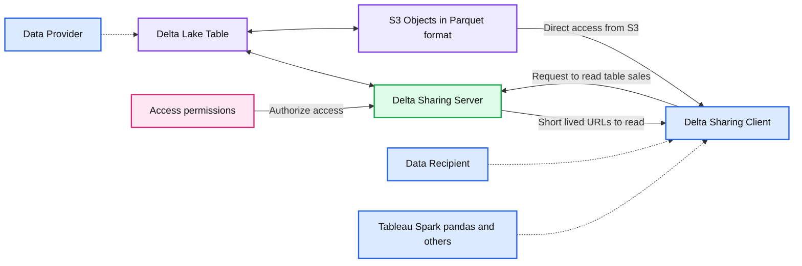
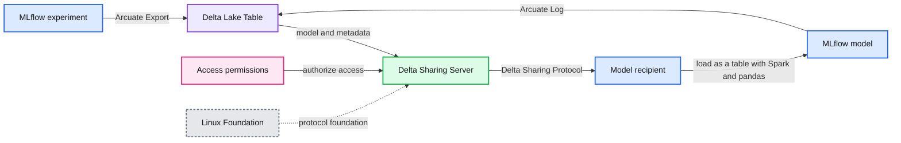

# Arcuate - Machine Learning Model Exchange With Delta Sharing and MLflow

*Developing an open data marketplace*

- Source: https://www.databricks.com/blog/2022/05/24/arcuate-machine-learning-model-exchange-with-delta-sharing-and-mlflow.html
- Published: 2022-05-24
- Authors: Vuong Nguyen, Milos Colic
- Categories: machine-learning, engineering
- Images: 2 total, 2 extracted as architecture

Stepping into this brave new digital world we are certain that data will be a central product for many organizations. The way to convey their knowledge and their assets will be through data and analytics. During the Data + AI Summit 2021, Databricks announced [Delta Sharing](https://www.databricks.com/blog/2021/05/26/introducing-delta-sharing-an-open-protocol-for-secure-data-sharing.html), the world's first open protocol for secure and scalable real-time data sharing. This simple REST secure data sharing protocol can become a differentiating factor for your data consumers and the ecosystem you are building around your data products.

**Summary:** The diagram shows a Delta Sharing data exchange where a provider authorizes requests and returns short-lived S3 URLs for a recipient to read shared table data.

**Components:**

- Data Provider
- Delta Lake Table
- Delta Sharing Server
- S3 Objects in Parquet format
- Data Recipient
- Delta Sharing Client
- Tableau, Spark, pandas, and other clients
- Access permissions

**Flows:**

- Delta Lake Table -> Delta Sharing Server: shared table metadata and access control
- Delta Sharing Server -> Delta Lake Table: table access interaction
- Delta Sharing Client -> Delta Sharing Server: request to read table sales
- Delta Sharing Server -> Delta Sharing Client: short-lived URLs for reading data
- Delta Lake Table -> S3 Objects: table data in Parquet format
- S3 Objects -> Delta Sharing Client: direct access from S3

**Numbers:** none

source image: https://www.databricks.com/wp-content/uploads/2022/05/db-92-blog-img-1.png

Since the [preview](https://www.databricks.com/product/delta-sharing) launch, we have seen tremendous engagement from customers across industries to collaborate and develop a data-sharing solution fit for all purposes and open to all. Customers have already shared petabytes of data using the Delta Sharing REST APIs. Through our customer conversations, there is a lot of anticipation of how Delta Sharing can be extended to non-tabular assets, such as machine learning experiments and models.

## Arcuate - a Databricks Labs project that extends Delta Sharing for ML

Platforms like MLflow have emerged as a go-to option for many data scientists, ensuring smooth transition/experience when managing the machine learning lifecycle. [MLflow](https://mlflow.org/) is an open-source platform developed by Databricks to manage the ML lifecycle, including experimentation, reproducibility, deployment, and a central model registry.

Due to MLflow ubiquity, Arcuate combines MLflow with Delta Lake to leverage Delta Sharing capabilities to enable machine learning models exchange.

Using Delta Sharing also allows Arcuate to share other relevant metadata such as training parameters, model accuracy, artifacts, etc.

The project name takes inspiration from the term, [arcuate delta](https://www.brainkart.com/article/Types-of-Delta_33787/) - the wide fan-shaped river delta. We believe that enabling model exchange will have a wide impact on many digitally connected industries.

**Summary:** Arcuate exports MLflow experiments and models to Delta Lake tables, shares them through a Delta Sharing Server, and lets recipients load them as tables or MLflow models.

**Components:**

- MLflow experiment
- Delta Lake Table
- Delta Sharing Server
- Access permissions
- Delta Sharing Protocol
- Linux Foundation
- Spark and pandas
- Model recipient
- MLflow model

**Flows:**

- MLflow experiment -> Delta Lake Table: Arcuate Export
- Delta Lake Table -> Delta Sharing Server: model and metadata
- Delta Sharing Server -> Model recipient: shared table through the Delta Sharing Protocol
- Access permissions -> Delta Sharing Server: access control
- Model recipient -> MLflow model: Arcuate Load
- MLflow model -> Delta Lake Table: Arcuate Log

**Numbers:** none

source image: https://www.databricks.com/wp-content/uploads/2022/05/db-92-blog-img-2.png

## How it works

Arcuate is provided as a Python library that can be installed on a Databricks cluster, or on your local machine. It integrates directly with MLflow, offering options to extract either an MLflow experiment, or an MLflow model into a Delta table. These tables are then shared via Delta Sharing ([how it works](https://delta.io/sharing/)), allowing recipients to load them into their own MLflow server.

For simplicity, Arcuate comes with two sets of APIs for both providers & recipients:

- Python APIs to be used in any Python programs.
- IPython magic %arcuate that provides SQL syntax in a notebook.

The end-to-end workflow would look like this:

- Experiment or train models in any environment (including Databricks), store it in MLflow
- Add an MLflow experiment to a Delta Sharing share:

- Add an MLflow model to a Delta Sharing share:
- Recipients can then load MLflow models/experiments seamlessly:

## Roadmap

This first version of Arcuate is just a start. As we develop the project, we can extend the implementation to sharing other objects, such as dashboards or arbitrary files. We believe that the future of data sharing is open, and we are thrilled to bring this approach to other sharing workflows.

## Getting started with Arcuate

With Delta Sharing, for the first time ever, we have a data sharing protocol that is truly open. Now with Arcuate, we are able to have an open ML model sharing protocol.

We will soon release Arcuate as a [Databricks Labs](https://www.databricks.com/learn/labs) project, so please keep an eye out for it. To try out the open source project Delta Sharing release, follow the instructions at [delta.io/sharing](http://delta.io/sharing). Or, if you are a Databricks customer, [sign up](https://www.databricks.com/product/unity-catalog) for updates on our service. We are very excited to hear your feedback!
