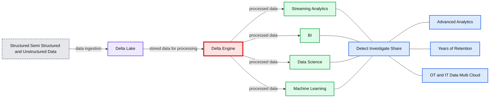
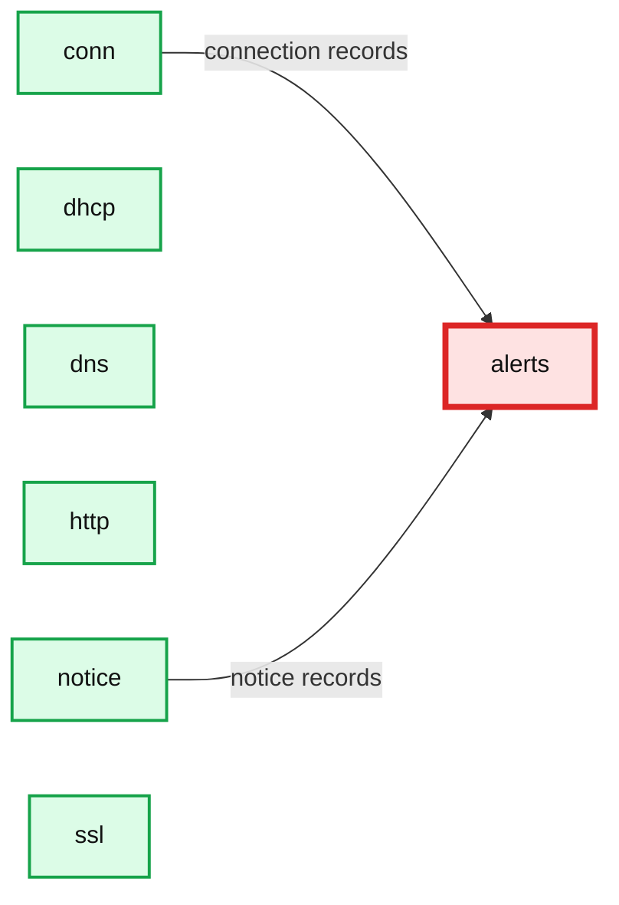

# Building ETL pipelines for the cybersecurity lakehouse with Delta Live Tables

- Source: https://www.databricks.com/blog/2022/06/03/building-etl-pipelines-for-the-cybersecurity-lakehouse-with-delta-live-tables.html
- Published: 2022-06-03
- Authors: Silvio Fiorito
- Categories: security-and-trust, data-engineering
- Images: 3 total, 3 extracted as architecture

Databricks recently introduced [Workflows](https://www.databricks.com/blog/2022/05/10/introducing-databricks-workflows.html) to enable data engineers, data scientists, and analysts to build reliable data, analytics, and ML workflows on any cloud without needing to manage complex infrastructure. Workflows allows users to build ETL pipelines that are automatically managed, including ingestion, and lineage, using [Delta Live Tables](https://www.databricks.com/product/delta-live-tables). The benefits of Workflows and Delta Live Tables easily apply to security data sources, allowing us to scale to any volume or latency required for our operational needs.

In this article we'll demonstrate some of the key benefits of Delta Live Tables for ingesting and processing security logs, with a few examples of common data sources we've seen our customers load into their cyber Lakehouse.

**Summary:** The diagram shows structured, semi-structured, and unstructured data flowing into Delta Lake, powering the Delta Engine and downstream analytics workloads.

**Components:**

- Structured, semi-structured, and unstructured data sources
- Delta Lake durable storage
- Delta Engine processing layer
- Streaming Analytics workload
- BI workload
- Data Science workload
- Machine Learning workload
- Detect, Investigate, Share outcome
- Advanced Analytics capability
- Years of Retention capability
- OT and IT Data across multi-cloud environments

**Flows:**

- Structured, semi-structured, and unstructured data -> Delta Lake: data ingestion
- Delta Lake -> Delta Engine: stored data for processing
- Delta Engine -> Streaming Analytics: processed data
- Delta Engine -> BI: processed data
- Delta Engine -> Data Science: processed data
- Delta Engine -> Machine Learning: processed data

**Numbers:** 0, 1

source image: https://www.databricks.com/wp-content/uploads/2022/05/db-172-blog-img-1.png

## Working with security log data sources in Databricks

The first data source we'll cover is CloudTrail, which produces [logs](https://aws.amazon.com/cloudtrail/) that can be used to monitor activity in our AWS accounts. CloudTrail logs are published to an S3 bucket in compressed JSON format every 5 minutes. While JSON makes these logs simple to query, this is an inefficient format for analytical and reporting needs, especially at the scale required for months or even years of data. In order to support incident response and advanced monitoring or ML use cases, we'd get much better performance and reliability, not to mention data versioning if we were to use a more efficient open-source format like Delta Lake.

CloudTrail also has a fairly complex, highly nested schema that may evolve over time as new services are brought on board or request/response patterns change. We want to avoid having to manually manage schema changes or, even worse, potentially lose data if the event parsing fails at runtime. This requires a flexible but reliable schema evolution that minimizes downtime and avoids any code changes that could break our SLAs.

On AWS, we can also use [VPC flow logs](https://docs.aws.amazon.com/vpc/latest/userguide/flow-logs-s3.html) to monitor and analyze the network traffic flowing through our environments. Again, these are delivered to an S3 bucket with a configurable frequency and either in text or Parquet format. The schema and format in this case is more consistent than CloudTrail, but again we want to make this data available in a reliable and performant manner for our cyber threat analytical and reporting needs.

Finally, for another example of network monitoring we use [Zeek](https://zeek.org/) logs. Similar to VPC flow logs these help us monitor network activity within our environment, but Zeek generates more detailed logs based on the protocol and includes some lightweight detections for unusual activity.

For all three data sources we want pipelines that are simple to implement, deploy, and monitor. For ensuring the quality and reliability of the data we're also going to use Delta Live Tables [expectations](https://docs.databricks.com/data-engineering/delta-live-tables/delta-live-tables-expectations.html). This is a declarative model for defining data quality constraints and how to handle records as they're ingested by the pipeline. Delta Live Tables provides built-in monitoring for these conditions, which we can also use for threat detections for our data sources.

## Implementation with Delta Live Tables

For these three use cases our sample logs land on S3 and are ingested incrementally into our Lakehouse using Delta Live Tables (DLT). DLT is a new declarative model for defining data flow pipelines, based on Structured Streaming and Delta Lake. With DLT we can build reliable, scalable, and efficient data pipelines with automatic indexing, file optimization, and even integrated data quality controls. What's more, Databricks manages the operational complexities around deploying and executing our DLT pipelines (including retries and autoscaling based on the backlog of incoming data) so we can just focus on declaring the pipeline, and letting DLT worry about everything else.

For more details about DLT, please see previous articles such as [Announcing the Launch of Delta Live Tables](https://www.databricks.com/blog/2021/05/27/announcing-the-launch-of-delta-live-tables-reliable-data-engineering-made-easy.html) and [Implementing Intelligent Data Pipelines with Delta Live Tables](https://www.databricks.com/blog/2021/09/08/5-steps-to-implementing-intelligent-data-pipelines-with-delta-live-tables.html).

## CloudTrail

The first pipeline we'll review is for CloudTrail. As described earlier, AWS lands compressed JSON files containing our CloudTrail logs in an S3 bucket. We use [Databricks Auto Loader](https://docs.databricks.com/spark/latest/structured-streaming/auto-loader.html) to efficiently discover and load new files each execution. In production scenarios we suggest using [file notification](https://docs.databricks.com/spark/latest/structured-streaming/auto-loader.html#leveraging-file-notifications) mode, in which S3 events are pushed to an SQS topic. This avoids having to perform slower S3 file listings to detect new files.

We also enable Auto Loader's [schema inference mode](https://docs.databricks.com/spark/latest/structured-streaming/auto-loader-schema.html) given the large and complex [schema](https://docs.aws.amazon.com/awscloudtrail/latest/userguide/cloudtrail-event-reference-record-contents.html) for CloudTrail files. This uses a sampling from new files to infer the schema, saving us from having to manually define and manage the schema ourselves. As the schema changes, Delta Live Tables automatically merges those changes downstream to our target Delta tables as part of the transaction.

In the case of CloudTrail, there are a few columns we prefer keeping in a loosely typed format: `requestParameters, responseElements, resources, serviceEventDetails,` and `additionalEventData`. These parameters all have different structures depending on the service being called and the request/response of the event. With schema inference, in this case we'll end up with large, highly nested columns from a superset of all possible formats, where most values will be null for each event. This will make the columns difficult to understand and visualize for our security analysts. Instead, we can use schema hints to tell Auto Loader to treat these particular columns as simple map types with string key/value pairs. This keeps the structure clean and easier to use for analysts, while still preserving the information we need.

**Summary:** The diagram shows a CloudTrail ingestion pipeline writing parsed records to a CloudTrail logs table with data quality results.

**Components:**

- `cloudtrail_ingest` - Delta Live Tables ingestion pipeline
- `cloudtrail_logs` - Delta Live Tables output table
- Data Quality - DLT expectation metrics
- Parsed CloudTrail fields - structured and map-based event data

**Flows:**

- `cloudtrail_ingest -> cloudtrail_logs`: parsed CloudTrail records

**Numbers:** 1m 26s; 155K; 0; 100%; 154,785; 0%; 0

source image: https://www.databricks.com/wp-content/uploads/2022/05/db-172-blog-img-2.png

Finally, to ensure we're ingesting properly parsed and formatted data, we apply DLT [expectations](https://docs.databricks.com/data-engineering/delta-live-tables/delta-live-tables-expectations.html) to each entry. Each CloudTrail entry is an array of Record objects, so if the file is properly parsed we expect one or more values in the array. We also shouldn't see any columns failing to parse and ending up in the [rescued data column](https://docs.databricks.com/spark/latest/structured-streaming/auto-loader-json.html#rescued-data-column), so we verify that with our expectations too. We run these checks before any additional processing or storage, which in DLT is done using a view. If either of these quality checks fail we stop the pipeline to immediately address the issues and avoid corrupting our downstream tables.

Once the data passes these quality checks, we explode the data to get one row per event and add a few enrichment columns such as eventDate for partitioning, and the original source filename.

## Zeek and VPC Flow Logs

We can apply this same model for Zeek and VPC flow logs. These logs are more consistent as they have a fixed format compared to CloudTrail, so we define the expected schemas up-front.

The pipeline for VPC flow logs is very simple. Again, it uses Auto Loader to ingest the new files from S3, does some simple conversions from Unix epoch time to timestamps for the `start` and `end` columns, then generates an `eventDate` partition column. Again, we use data quality expectations to ensure that the timestamp conversions have been successful.

The Zeek pipeline uses a slightly different pattern to reduce code and simplify managing several tables for each type of log. Each one has a defined schema, but rather than also defining a table for each individually, we do so dynamically at run time using a helper method that takes in a table name, log source path, and schema. This method then generates a table dynamically based on those parameters. All of the log sources have some common columns such as a timestamp so we apply some simple conversions and data quality checks, just as we did for the VPC flow logs.

`# This method dynamically generates a live table based on path, schema, and table name`

Finally, to identify any suspicious activity from Zeek's built-in detections, we join the `connections` table with the `notices` table to create a [silver](https://www.databricks.com/glossary/medallion-architecture) `alerts` table. Here, we use [watermarking and a time-based](https://spark.apache.org/docs/latest/structured-streaming-programming-guide.html#inner-joins-with-optional-watermarking) join to ensure we don't have to maintain boundless state, even in the case of late or out-of-order events.

**Summary:** The diagram shows Zeek-derived cybersecurity tables feeding a silver `alerts` table through a Delta Live Tables pipeline.

**Components:**

- `conn` - Zeek connection table
- `dhcp` - Zeek DHCP table
- `dns` - Zeek DNS table
- `http` - Zeek HTTP table
- `notice` - Zeek notices table
- `ssl` - Zeek SSL table
- `alerts` - Silver alerts table

**Flows:**

- `conn -> alerts`: connection records
- `notice -> alerts`: notice records

**Numbers:** 23M, 0, 5m 58s, 1.5K, 7s, 428K, 15s, 2M, 45s, 682, 6s, 56K, 8s, 387, 48s

source image: https://www.databricks.com/wp-content/uploads/2022/05/db-172-blog-img-3.png

When DLT executes the pipeline, the runtime builds the dependency graph for all the base tables and the alert table. Again, here we rely on DLT to scale based on the number of concurrent streams and amount of ingested data.

## Conclusion

With a few lines of code for each pipeline, the result is a well-optimized and well-structured security lakehouse that is far more efficient than the original raw data we started with. These pipelines can run as frequently as we need: either continuously for low-latency, or on a periodic basis such as every hour or day. DLT will scale or retry the pipelines as necessary, and even manage the complicated end-to-end schema evolution for us, greatly reducing the operational burden required to maintain our cyber lakehouse.

In addition, the Databricks Lakehouse Platform lets you store, process and analyze your data at multi-petabyte scale, allowing for much longer retention and lookback periods and advanced threat detection with data science and machine learning. What's more, you can even [query them via your SIEM tool](https://www.databricks.com/blog/2021/07/23/augment-your-siem-for-cybersecurity-at-cloud-scale.html), providing a 360 degree view of your security events.

You can find the code for these 3 pipelines here: [CloudTrail](https://www.databricks.com/wp-content/uploads/notebooks/db-172-dlt/cloudtrail-dlt-pipeline.html), [VPC flow logs](https://www.databricks.com/wp-content/uploads/notebooks/db-172-dlt/vpc-flow-logs-dlt-pipeline.html), [Zeek](https://www.databricks.com/wp-content/uploads/notebooks/db-172-dlt/zeek-dlt-pipeline.html).

We encourage you to try [Delta Live Tables](https://www.databricks.com/product/delta-live-tables) on Databricks for your own data sources and look forward to your questions and suggestions. You can reach us at [cybersecurity@databricks.com](mailto:cybersecurity@databricks.com).
