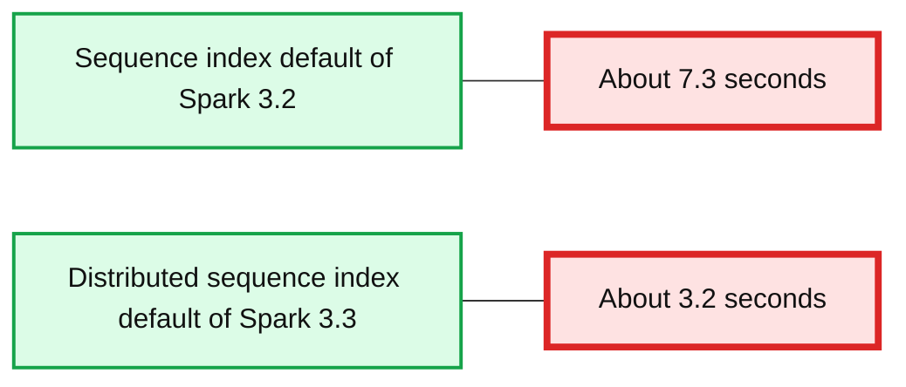

# Introducing Apache Spark™ 3.3 for Databricks Runtime 11.0

- Source: https://www.databricks.com/blog/2022/06/15/introducing-apache-spark-3-3-for-databricks-runtime-11-0.html
- Published: 2022-06-15
- Authors: Maxim Gekk, Wenchen Fan, Hyukjin Kwon, Serge Rielau, Yingyi Bu, Xiao Li, Reynold Xin
- Categories: engineering, open-source
- Images: 9 total, 3 extracted as architecture

*Free Edition has replaced Community Edition, offering enhanced features at no cost. Start using *[*Free Edition *](https://login.databricks.com/?intent=SIGN_UP&amp;signup_experience_step=EXPRESS&amp;provider=DB_FREE_TIER&amp;dbx_source=www)*today.*
 

Today we are happy to announce the availability of [Apache Spark™ 3.3](https://spark.apache.org/releases/spark-release-3-3-0.html) on Databricks as part of [Databricks Runtime 11.0](https://docs.databricks.com/release-notes/runtime/11.0.html). We want to thank the Apache Spark community for their valuable contributions to the Spark 3.3 release.

The number of monthly [PyPI](https://pypi.org/) downloads of PySpark has rapidly increased to **21 million**, and Python is now the most popular API language. This year-over-year growth rate represents a doubling of monthly PySpark downloads in the last year. Also, the number of monthly Maven downloads exceeded **24 million**. Spark has become the most widely-used engine for scalable computing.

**Summary:** The chart shows monthly PyPI downloads of PySpark increasing from May 2021 to May 2022, reaching 21,360,696 downloads with year-over-year growth above 100%.

**Components:**

- PyPI downloads of PySpark, using the Python package index.
- Monthly data points from May 2021 through May 2022.
- Linear growth trend line.

**Flows:**

- May 21 -> Jun 21: monthly PyPI downloads increase.
- Jun 21 -> Jul 21: monthly PyPI downloads increase.
- Jul 21 -> Aug 21: monthly PyPI downloads increase.
- Aug 21 -> Sep 21: monthly PyPI downloads increase.
- Sep 21 -> Oct 21: monthly PyPI downloads increase.
- Oct 21 -> Nov 21: monthly PyPI downloads increase.
- Nov 21 -> Dec 21: monthly PyPI downloads increase.
- Dec 21 -> Jan 22: monthly PyPI downloads increase.
- Jan 22 -> Feb 22: monthly PyPI downloads increase slightly.
- Feb 22 -> Mar 22: monthly PyPI downloads increase sharply.
- Mar 22 -> Apr 22: monthly PyPI downloads increase.
- Apr 22 -> May 22: monthly PyPI downloads increase to the peak.

**Numbers:**

- 21,360,696
- May 22
- >100%
- 22,000,000
- 16,500,000
- 11,000,000
- 5,500,000
- 0
- May 21
- July 21
- Sept 21
- Nov 21
- Jan 22
- Mar 22
- May 22


<sub>source image: https://www.databricks.com/wp-content/uploads/2022/06/db-209-blog-img-1.png</sub>

Continuing with the objectives to make Spark even more unified, simple, fast, and scalable, Spark 3.3 extends its scope with the following features:

- Improve join query performance via Bloom filters with up to 10x speedup.
- Increase the Pandas API coverage with the support of popular Pandas features such as [datetime.timedelta](https://docs.python.org/3/library/datetime.html#timedelta-objects) and [merge_asof](https://pandas.pydata.org/docs/reference/api/pandas.merge_asof.html?highlight=pa).
- Simplify the migration from traditional data warehouses by improving ANSI compliance and supporting dozens of new built-in functions.
- Boost development productivity with better error handling, autocompletion, performance, and profiling.

## Performance Improvement

**Bloom Filter Joins** ([SPARK-32268](https://issues.apache.org/jira/browse/SPARK-32268)): Spark can inject and push down Bloom filters in a query plan when appropriate, in order to filter data early on and reduce intermediate data sizes for shuffle and computation. Bloom filters are row-level runtime filters designed to complement dynamic partition pruning ([DPP](https://www.databricks.com/session_eu19/dynamic-partition-pruning-in-apache-spark)) and dynamic file pruning ([DFP](https://docs.databricks.com/delta/optimizations/dynamic-file-pruning.html)) for cases when dynamic file skipping is not sufficiently applicable or thorough. As shown in the following graphs, we ran the TPC-DS benchmark over three different variations of data sources: Delta Lake without tuning, Delta Lake with tuning, and raw Parquet files, and observed up to ~10x speedup by enabling this Bloom filter feature. Performance improvement ratios are larger for cases lacking storage tuning or accurate statistics, such as Delta Lake data sources before tuning or raw Parquet file based data sources. In these cases, Bloom filters make query performance more robust regardless of storage/statistics tuning.

**Summary:** Benchmark chart comparing TPCDS query latency reduction ratios with and without Bloom filters across tuned Delta, untuned Delta, and raw Parquet data.

**Components:**

- Untuned Delta benchmark using TPCDS and 3TB data
- Tuned Delta benchmark using TPCDS and 3TB data
- Raw Parquet benchmark using TPCDS and 3TB data
- Without Bloom filter series
- With Bloom filter series
- Latency reduction ratio scale

**Flows:**

- TPCDS queries -> Untuned Delta benchmark: latency reduction measurements
- TPCDS queries -> Tuned Delta benchmark: latency reduction measurements
- TPCDS queries -> Raw Parquet benchmark: latency reduction measurements
- Without Bloom filter -> Benchmark panels: baseline ratios
- With Bloom filter -> Benchmark panels: Bloom filter ratios

**Numbers:** 1, 0.75, 0.5, 0.25, 0, 3TB, q1, q14, q23, q40, q59, q78, q80, q85, q94, q95, q16, q32, q61, q80, q85, q92, q94, q16, q24, q32, q37, q61, q82, q94, q95, q85, q32

```text
%% mermaid failed to render; kept as text
%% Shows TPCDS latency reduction ratios across three storage benchmark configurations
flowchart LR
    U[Untuned Delta 3TB]
    T[Tuned Delta 3TB]
    P[Raw Parquet 3TB]
    W[Without Bloom filter]
    B[With Bloom filter]
    R[Latency reduction ratio 0 to 1]

    W --> U: baseline ratios
    B --> U: Bloom ratios
    W --> T: baseline ratios
    B --> T: Bloom ratios
    W --> P: baseline ratios
    B --> P: Bloom ratios
    U --> R: query measurements
    T --> R: query measurements
    P --> R: query measurements

    classDef client   fill:#dbeafe,stroke:#2563eb,stroke-width:2px,color:#111
    classDef service  fill:#dcfce7,stroke:#16a34a,stroke-width:2px,color:#111
    classDef store    fill:#ede9fe,stroke:#7c3aed,stroke-width:2px,color:#111
    classDef cache    fill:#fef3c7,stroke:#d97706,stroke-width:2px,color:#111
    classDef queue    fill:#cffafe,stroke:#0891b2,stroke-width:2px,color:#111
    classDef critical fill:#fee2e2,stroke:#dc2626,stroke-width:4px,color:#111
    classDef external fill:#e5e7eb,stroke:#6b7280,stroke-width:2px,color:#111,stroke-dasharray:4 3
    classDef decision fill:#fce7f3,stroke:#db2777,stroke-width:2px,color:#111

    class U,T,P service
    class W,B cache
    class R decision
```

<sub>source image: https://www.databricks.com/wp-content/uploads/2022/06/db-209-blog-img-2.png</sub>

**Query Execution Enhancements:** A few adaptive query execution ([AQE](https://docs.databricks.com/spark/latest/spark-sql/aqe.html)) improvements have landed in this release:

1. Propagating intermediate empty relations through Aggregate/Union ([SPARK-35442](https://issues.apache.org/jira/browse/SPARK-35442))
2. Optimizing one-row query plans in the normal and AQE optimizers ([SPARK-38162](https://issues.apache.org/jira/browse/SPARK-38162))
3. Supporting eliminating limits in the AQE optimizer ([SPARK-36424](https://issues.apache.org/jira/browse/SPARK-36424)).

Whole-stage codegen coverage is further improved in multiple areas, including:

- Full outer sort merge join ([SPARK-35352](https://issues.apache.org/jira/browse/SPARK-35352), 20%~30% speedup)
- Full outer shuffled hash join ([SPARK-32567](https://issues.apache.org/jira/browse/SPARK-32567), 10%~20% speedup)
- Existence sort merge join ([SPARK-37316](https://issues.apache.org/jira/browse/SPARK-37316))
- Sort aggregate without grouping keys ([SPARK-37564](https://issues.apache.org/jira/browse/SPARK-37564))

**Parquet Complex Data Types** ([SPARK-34863](https://issues.apache.org/jira/browse/SPARK-34863)): This improvement adds support in Spark's vectorized Parquet reader for complex types such as lists, maps, and arrays. As [micro-benchmarks](https://github.com/apache/spark/pull/33695) show, Spark obtains an average of ~15x performance improvement when scanning struct fields, and ~1.5x when reading arrays comprising elements of struct and map types.

## Scale Pandas

**Optimized Default Index:** In this release, in the Pandas API on Spark ([SPARK-37649](https://issues.apache.org/jira/browse/SPARK-37649)), we switched the default index from 'sequence' to 'distributed-sequence', where the latter is amenable to optimization with the Catalyst Optimizer. Scanning data with the default index in Pandas API on Spark became 2 times faster in the benchmark of i3.xlarge 5 node cluster.

**Summary:** Benchmark chart comparing 5 GB scan times using sequence and distributed-sequence indexes.

**Components:**

- Sequence index, default of Spark 3.2
- Distributed-sequence index, default of Spark 3.3
- Scan time axis in seconds

**Flows:**

- none

**Numbers:** 5 GB, 3.2, 3.3, 0, 2, 4, 6, 8, seconds



<sub>source image: https://www.databricks.com/wp-content/uploads/2022/06/db-209-blog-img-3.png</sub>

**Pandas API Coverage:**
PySpark now natively understands [datetime.timedelta](https://docs.python.org/3/library/datetime.html#timedelta-objects) ([SPARK-37275](https://issues.apache.org/jira/browse/SPARK-37275), [SPARK-37525](https://issues.apache.org/jira/browse/SPARK-37525)) across Spark SQL and Pandas API on Spark. This Python type now maps to the date-time interval type in Spark SQL. Also, many missing parameters and new API features are now supported for Pandas API on Spark in this release. Examples include endpoints like ps.merge_asof ([SPARK-36813](https://issues.apache.org/jira/browse/SPARK-36813)), ps.timedelta_range ([SPARK-37673](https://issues.apache.org/jira/browse/SPARK-37673)) and ps.to_timedelta ([SPARK-37701](https://issues.apache.org/jira/browse/SPARK-37701)).

## Migration Simplification

**ANSI Enhancements:** This release completes the support of the ANSI interval data types ([SPARK-27790](https://issues.apache.org/jira/browse/SPARK-27790)). Now we can read/write interval values from/to tables, and use intervals in many functions/operators to do date/time arithmetic, including aggregation and comparison. Implicit casting in ANSI mode now supports safe casts between types while protecting against data loss. A growing library of "try" functions, such as "try_add" and "try_multiply", complement ANSI mode allowing users to embrace the safety of ANSI mode rules while also still allowing for fault tolerant queries.

**Built-in Functions:** Beyond the try_* functions ([SPARK-35161](https://issues.apache.org/jira/browse/SPARK-35161)), this new release now includes nine new linear regression functions and statistical functions, four new string processing functions, aes_encryption and decryption functions, generalized floor and ceiling functions, "to_number" formatting, and many others.

## Boosting Productivity

**Error Message Improvements:** This release starts a journey wherein users observe the introduction of explicit error classes like "DIVIDE_BY_ZERO." These make it easier to search online for more context about errors, including in the formal [documentation](https://docs.databricks.com/error-messages/index.html).

For many runtime errors Spark now returns the exact context where the error occurred, such as the line and column number in a specified nested view body.

**Profiler for Python/Pandas UDFs** ([SPARK-37443](https://issues.apache.org/jira/browse/SPARK-37443)): This release introduces a new Python/Pandas UDFs profiler, which provides deterministic profiling of UDFs with useful statistics. Below is an example by running PySpark with the new infrastructure:

**Better Auto-Completion with Type Hint Inline Completion** ([SPARK-39370](https://issues.apache.org/jira/browse/SPARK-39370)):
All type hints have migrated from stub files to inlined type hints in this release in order to enable better autocompletion. For example, showing the type of parameters can help provide useful context.

In this blog post, we summarize some of the higher-level features and improvements in Apache Spark 3.3.0. Please keep an eye out for upcoming posts that dive deeper into these features. For a comprehensive list of major features across all Spark components and JIRA tickets resolved, please visit the Apache Spark 3.3.0 [release notes](https://spark.apache.org/releases/spark-release-3-3-0.html).

## Get started with Spark 3.3 today

To try out Apache Spark 3.3 in Databricks Runtime 11.0, please sign up for the [Databricks Community Edition or Databricks Trial](https://www.databricks.com/try-databricks), both of which are free, and get started in minutes. Using Spark 3.3 is as simple as selecting version "11.0" when launching a cluster.

Databricks Runtime 11.0 (Beta)
