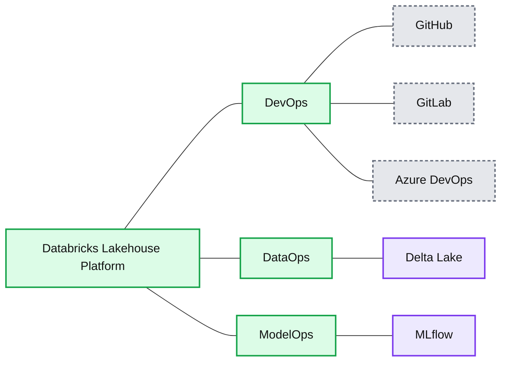
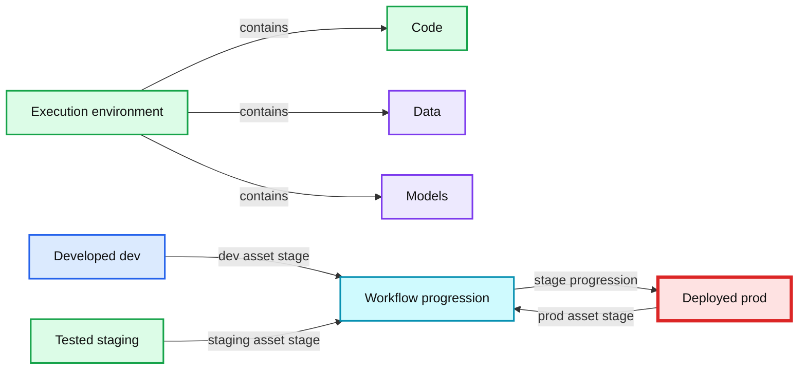
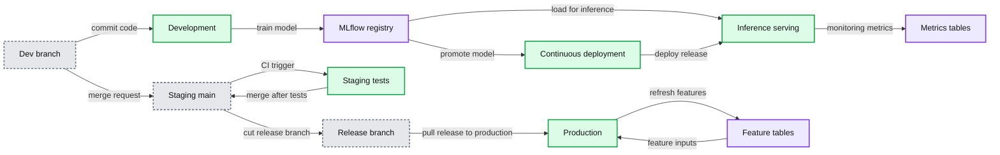

# Architecting MLOps on the Lakehouse

*A new data-centric approach to building robust MLOps practices*

- Source: https://www.databricks.com/blog/2022/06/22/architecting-mlops-on-the-lakehouse.html
- Published: 2022-06-22
- Authors: Joseph Bradley, Rafi Kurlansik, Matthew Thomson, Niall Turbitt
- Categories: industry-insights, product, best-practices, data-strategy, engineering, platform, data-science-machine-learning
- Images: 3 total, 3 extracted as architecture

Here at Databricks, we have helped thousands of customers put Machine Learning (ML) into production. Shell has over [160 active AI projects](https://www.databricks.com/customers/shell) saving millions of dollars; Comcast manages [100s of machine learning models](https://www.databricks.com/customers/comcast) with ease with MLflow; and [many others](https://www.databricks.com/customers) have built successful ML-powered solutions.

Before working with us, many customers struggled to put ML into production—for a good reason: [Machine Learning Operations (MLOps)](https://www.databricks.com/glossary/mlops) is challenging. MLOps involves jointly managing code (DevOps), data (DataOps), and models (ModelOps) in their journey towards production. The most common and painful challenge we have seen is a gap between data and ML, often split across poorly connected tools and teams.

To solve this challenge, [Databricks Machine Learning](https://www.databricks.com/product/machine-learning) builds upon the [Lakehouse architecture](https://www.databricks.com/blog/2020/01/30/what-is-a-data-lakehouse.html) to extend its key benefits—simplicity and openness—to MLOps.

Our platform simplifies ML by defining a *data-centric* workflow that unifies best practices from DevOps, DataOps, and ModelOps. Machine learning pipelines are ultimately data pipelines, where data flows through the hands of several personas. Data engineers ingest and prepare data; data scientists build models from data; ML engineers monitor model metrics; and business analysts examine predictions. Databricks simplifies production machine learning by enabling these data teams to collaborate and manage this abundance of data on a single platform, instead of silos. For example, our [Feature Store](https://www.databricks.com/blog/2022/04/29/announcing-general-availability-of-databricks-feature-store.html) allows you to productionize your models and features jointly: data scientists create models that are "aware" of what features they need so that ML engineers can deploy models with simpler processes.

The Databricks approach to MLOps is built on open industry-wide standards. For DevOps, we integrate with Git and CI/CD tools. For DataOps, we build upon [Delta Lake](https://delta.io/) and the lakehouse, the de facto architecture for open and performant data processing. For ModelOps, we build upon [MLflow](https://mlflow.org/), the most popular open-source tool for model management. This foundation in open formats and APIs allows our customers to adapt our platform to their diverse requirements. For example, customers who centralize model management around [our MLflow offering](https://www.databricks.com/product/managed-mlflow) may use our built-in model serving or other solutions, depending on their needs.

We are excited to share our MLOps architecture in this blog post. We discuss the challenges of joint DevOps + DataOps + ModelOps, overview our solution, and describe our reference architecture. For deeper dives, download [The Big Book of MLOps](https://www.databricks.com/p/ebook/the-big-book-of-mlops) and attend MLOps talks at the upcoming [Data+AI Summit 2022](https://www.databricks.com/dataaisummit/north-america-2022).

*Building MLOps on top of a lakehouse platform helps to simplify the joint management of code, data and models.*

**Summary:** The diagram shows the Databricks Lakehouse Platform jointly supporting DevOps, DataOps, and ModelOps.

**Components:**

- DevOps: GitHub, GitLab, and Azure DevOps
- DataOps: Delta Lake
- ModelOps: MLflow
- Platform: Databricks Lakehouse Platform

**Flows:**

- none

**Numbers:** none

source image: https://www.databricks.com/wp-content/uploads/2022/06/db-237-blog-img-1.png

Building MLOps on top of a lakehouse platform helps to simplify the joint management of code, data and models.

## Jointly managing code, data, and models

MLOps is a **set of processes and automation** to manage code, data, and models to meet the two goals of **stable performance and long-term efficiency in ML systems.** In short, MLOps = DevOps + DataOps + ModelOps.

### Development, staging and production

In their journey towards business- or customer-facing applications, ML assets (code, data, and models) pass through a series of stages. They need to be developed ("development" stage), tested ("staging" stage), and deployed ("production" stage). This work is done within execution environments such as Databricks workspaces.

All the above—execution environments, code, data and models—are divided into dev, staging and prod. These divisions can be understood in terms of quality guarantees and access control. Assets in development may be more widely accessible but have no quality guarantees. Assets in production are generally business critical, with the highest guarantees of testing and quality but with strict controls on who can modify them.

*MLOps requires jointly managing execution environments, code, data and models. All four are separated into dev, staging and prod stages.*

**Summary:** The diagram shows that ML workflow assets include execution environments, code, data, and models, managed through development, staging, and production stages.

**Components:**

- Execution environment: technology unspecified
- Code: technology unspecified
- Data: technology unspecified
- Models: technology unspecified
- Developed dev stage: technology unspecified
- Tested staging stage: technology unspecified
- Deployed prod stage: technology unspecified

**Flows:**

- Developed dev stage -> Workflow progression: dev asset stage
- Tested staging stage -> Workflow progression: staging asset stage
- Deployed prod stage -> Workflow progression: prod asset stage
- Workflow progression -> Production direction: stage progression

**Numbers:** none

source image: https://www.databricks.com/wp-content/uploads/2022/06/db-237-blog-img-2.png

MLOps requires jointly managing execution environments, code, data and models. All four are separated into dev, staging and prod stages.

### Key challenges

The above set of requirements can easily explode in complexity: how should one manage code, data and models, across development, testing and production, across multiple teams, with complications like access controls and multiple technologies in play? We have observed this complexity leading to a few key challenges.

**Operational processes**
 DevOps ideas do not directly translate to MLOps. In DevOps, there is a close correspondence between execution environments, code and data; for example, the production environment only runs production-level code, and it only produces production-level data. ML models complicate the story, for *model and code lifecycle phases often operate asynchronously*. You may want to push a new model version before pushing a code change, and vice versa. Consider the following scenarios:

- To detect fraudulent transactions, you develop an ML pipeline that retrains a model weekly. You update the code quarterly, but each week a new model is automatically trained, tested and moved to production. In this scenario, the model lifecycle is faster than the code lifecycle.
- To classify documents using large neural networks, training and deploying the model is often a one-time process due to cost. But as downstream systems change periodically, you update the serving and monitoring code to match. In this scenario, the code lifecycle is faster than the model lifecycle.

**Collaboration and management**
 MLOps must balance the need for data scientists to have flexibility and visibility to develop and maintain models with the conflicting need for ML engineers to have control over production systems. Data scientists need to run their code on production data and to see logs, models, and other results from production systems. ML engineers need to limit access to production systems to maintain stability and sometimes to preserve data privacy. Resolving these needs becomes even more challenging when the platform is stitched together from multiple disjoint technologies that do not share a single access control model.

**Integration and customization**
 Many tools for ML are not designed to be open; for example, some ML tools export models only in black-box formats such as JAR files. Many data tools are not designed for ML; for example, data warehouses require exporting data to ML tools, raising storage costs and governance headaches. When these component tools are not based on open formats and APIs, it is impossible to integrate them into a unified platform.

## Simplifying MLOps with the Lakehouse

To meet the requirements of MLOps, Databricks built its approach on top of the [Lakehouse architecture](https://www.databricks.com/blog/2020/01/30/what-is-a-data-lakehouse.html). Lakehouses unify the capabilities from data lakes and data warehouses under a single architecture, where this simplification is made possible by using open formats and APIs that power both types of data workloads. Analogously, for MLOps, we offer a simpler architecture because we build MLOps around open data standards.

Before we dive into the details of our architectural approach, we explain it at a high level and highlight its key benefits.

**Operational processes**
 Our approach extends DevOps ideas to ML, defining clear semantics for what "moving to production" means for code, data and models. Existing DevOps tooling and CI/CD processes can be reused to manage code for ML pipelines. Feature computation, inference, and other data pipelines follow the same deployment process as model training code, simplifying operations. A designated service—the MLflow Model Registry—permits code and models to be updated independently, solving the key challenge in adapting DevOps methods to ML.

**Collaboration and management**
 Our approach is based on a unified platform that supports data engineering, exploratory data science, production ML and business analytics, all underpinned by a shared lakehouse data layer. ML data is managed under the same lakehouse architecture used for other data pipelines, simplifying hand-offs. Access controls on execution environments, code, data and models allow the right teams to get the right levels of access, simplifying management.

**Integration and customization**
 Our approach is based on open formats and APIs: Git and related CI/CD tools, Delta Lake and the Lakehouse architecture, and MLflow. Code, data and models are stored in your cloud account (subscription) in open formats, backed by services with open APIs. While the reference architecture described below can be fully implemented within Databricks, each module can be integrated with your existing infrastructure and customized. For example, model retraining may be fully automated, partly automated, or manual.

## Reference architecture for MLOps

We are now ready to review a reference architecture for implementing MLOps on the Databricks Lakehouse platform. This architecture—and Databricks in general—is cloud-agnostic, usable on one or multiple clouds. As such, this is a *reference architecture* meant to be adapted to your specific needs. Refer to [The Big Book of MLOps](https://www.databricks.com/p/ebook/the-big-book-of-mlops) for more discussion of the architecture and potential customization.

### Overview

This architecture explains our MLOps process at a high level. Below, we describe the architecture's key components and the step-by-step workflow to move ML pipelines to production.

*This diagram illustrates the high-level MLOps architecture across dev, staging and prod environments.*

**Summary:** High-level MLOps workflow moving code, data, features, and models through development, staging, and production environments.

**Components:**

- Source control with dev, staging main, and release branches using Git.
- Development environment for exploratory data analysis, feature table refresh, model training, and inference and serving.
- Staging environment for CI triggers, unit tests, and integration tests using Git-based workflows.
- Production environment for feature table refresh, model training, continuous deployment, inference and serving, and monitoring.
- MLflow Model Registry with None, Staging, and Production stages.
- Data tables.
- Feature tables.
- Metrics tables.

**Flows:**

- Create dev branch -> Development environment: branch creation.
- Development environment -> Source control: commit code.
- Dev branch -> Staging main: merge request.
- Staging main -> Staging environment: CI trigger.
- Staging environment -> Staging main: merge after tests.
- Staging main -> Release branch: cut release branch.
- Release branch -> Production environment: pull release branch to production.
- Data tables -> Exploratory data analysis: input data.
- Data tables -> Feature table refresh: source data.
- Feature tables -> Model training: training features.
- Feature table refresh -> Feature tables: refreshed features.
- Model training -> MLflow Model Registry: push model.
- MLflow Model Registry -> Model training: load model for testing.
- MLflow Model Registry -> Inference and serving: load model for inference.
- MLflow Model Registry -> Continuous deployment: promote model to production.
- Continuous deployment -> Inference and serving: deploy release.
- Inference and serving -> Metrics tables: monitoring metrics.
- Production feature table refresh -> Feature tables: refreshed production features.
- Production model training -> Feature tables: training data.
- Feature tables -> Production model training: feature inputs.

**Numbers:** 1, 2, 3, 4, 5, 6, 7, 8, 9, 10, 11, 12, 13, 14, 15

source image: https://www.databricks.com/wp-content/uploads/2022/06/db-237-blog-img-3.png

This diagram illustrates the high-level MLOps architecture across dev, staging and prod environments.

### Components

We define our approach in terms of managing a few key assets: execution environments, code, data and models.

**Execution environments** are where models and data are created or consumed by code. Environments are defined as Databricks workspaces ([AWS](https://docs.databricks.com/workspace/index.html), [Azure](https://docs.microsoft.com/en-us/azure/databricks/workspace/), [GCP](https://docs.gcp.databricks.com/workspace/index.html)) for development, staging, and production, with workspace access controls used to enforce separation of roles.
 In the architecture diagram, the blue, red and green areas represent the three environments.

Within environments, each ML pipeline (small boxes in the diagram) runs on compute instances managed by our Clusters service ([AWS](https://docs.databricks.com/clusters/index.html), [Azure](https://docs.microsoft.com/en-us/azure/databricks/clusters/), [GCP](https://docs.gcp.databricks.com/clusters/index.html)). These steps may be run manually or automated via Workflows and Jobs ([AWS](https://docs.databricks.com/data-engineering/index.html), [Azure](https://docs.microsoft.com/en-us/azure/databricks/data-engineering/), [GCP](https://docs.gcp.databricks.com/data-engineering/index.html)). Each step should by default use a Databricks Runtime for ML with preinstalled libraries ([AWS](https://docs.databricks.com/runtime/mlruntime.html), [Azure](https://docs.microsoft.com/en-us/azure/databricks/runtime/mlruntime), [GCP](https://docs.gcp.databricks.com/runtime/mlruntime.html)), but it can also use custom libraries ([AWS](https://docs.databricks.com/libraries/index.html), [Azure](https://docs.microsoft.com/en-us/azure/databricks/libraries/), [GCP](https://docs.gcp.databricks.com/libraries/index.html)).

**Code** defining ML pipelines is stored in Git for version control. ML pipelines can include featurization, model training and tuning, inference, and monitoring. At a high level, "moving ML to production" means promoting code from development branches, through the staging branch (usually `main`), and to release branches for production use. This alignment with DevOps allows users to integrate existing CI/CD tools. In the architecture diagram above, this process of promoting code is shown at the top.

When developing ML pipelines, data scientists may start with notebooks and transition to modularized code as needed, working in Databricks or in IDEs. [Databricks Repos](https://www.databricks.com/product/repos) integrate with your git provider to sync notebooks and source code with Databricks workspaces ([AWS](https://docs.databricks.com/repos/index.html), [Azure](https://docs.microsoft.com/en-us/azure/databricks/repos/), [GCP](https://docs.gcp.databricks.com/repos/index.html)). Databricks developer tools let you connect from IDEs and your existing CI/CD systems ([AWS](https://docs.databricks.com/dev-tools/index.html), [Azure](https://docs.microsoft.com/en-us/azure/databricks/dev-tools/), [GCP](https://docs.gcp.databricks.com/dev-tools/index.html)).

**Data** is stored in a [lakehouse architecture](https://www.databricks.com/blog/2020/01/30/what-is-a-data-lakehouse.html), all in your cloud account. Pipelines for featurization, inference and monitoring can all be treated as data pipelines. For example, model monitoring should follow the [medallion architecture](https://www.databricks.com/glossary/medallion-architecture) of progressive data refinement from raw query events to aggregate tables for dashboards. In the architecture diagram above, data are shown at the bottom as general "Lakehouse" data, hiding the division into development-, staging- and production-level data.

By default, both raw data and feature tables should be stored as Delta tables for performance and consistency guarantees. [Delta Lake](https://delta.io/) provides an open, efficient storage layer for structured and unstructured data, with an optimized Delta Engine in Databricks ([AWS](https://docs.databricks.com/delta/index.html), [Azure](https://docs.microsoft.com/en-us/azure/databricks/delta/), [GCP](https://docs.gcp.databricks.com/delta/index.html)). [Feature Store](https://www.databricks.com/product/feature-store) tables are simply Delta tables with additional metadata such as lineage ([AWS](https://docs.databricks.com/applications/machine-learning/feature-store/index.html), [Azure](https://docs.microsoft.com/en-us/azure/databricks/applications/machine-learning/feature-store/), [GCP](https://docs.gcp.databricks.com/applications/machine-learning/feature-store/index.html)). Raw files and tables are under access control that can be granted or restricted as needed.

**Models** are managed by [MLflow](https://mlflow.org/), which allows uniform management of models from any ML library, for any deployment mode, both within and without Databricks. Databricks provides a [managed version of MLflow](https://www.databricks.com/product/managed-mlflow) with access controls, scalability to millions of models, and a superset of open-source MLflow APIs.

In development, the MLflow Tracking server tracks prototype models along with code snapshots, parameters, metrics, and other metadata ([AWS](https://docs.databricks.com/applications/mlflow/tracking.html), [Azure](https://docs.microsoft.com/en-us/azure/databricks/applications/mlflow/tracking), [GCP](https://docs.gcp.databricks.com/applications/mlflow/tracking.html)). In production, the same process saves a record for reproducibility and governance.

For continuous deployment (CD), the MLflow Model Registry tracks model deployment status and integrates with CD systems via webhooks ([AWS](https://docs.databricks.com/applications/mlflow/model-registry-webhooks.html), [Azure](https://docs.microsoft.com/en-us/azure/databricks/applications/mlflow/model-registry-webhooks), [GCP](https://docs.gcp.databricks.com/applications/mlflow/model-registry-webhooks.html)) and via APIs ([AWS](https://docs.databricks.com/reference/mlflow-api.html), [Azure](https://docs.microsoft.com/en-us/azure/databricks/reference/mlflow-api), [GCP](https://docs.gcp.databricks.com/reference/mlflow-api.html)). The Model Registry service tracks model lifecycles separately from code lifecycles. This loose coupling of models and code provides flexibility to update production models without code changes, and vice versa. For example, an automated retraining pipeline can train an updated model (a "development" model), test it ("staging" model) and deploy it ("production" model), all within the production environment.

The table below summarizes the semantics of "development," "staging" and "production" for code, data and models.

| Asset | Semantics of dev/staging/prod | Management | Relation to execution environments |
|---|---|---|---|
| Code | *Dev*: Untested pipelines. *Staging*: Pipeline testing. *Prod*: Pipelines ready for deployment. | ML pipeline code is stored in Git, separated into dev, staging and release branches. | The prod environment should only run prod-level code. The dev environment can run any level code. |
| Data | *Dev*: "Dev" data means data produced in the dev environment. (ditto for Staging, Prod) | Data sits in the Lakehouse, shareable as needed across environments via table access controls or cloud storage permissions. | Prod data may be readable from the dev or staging environments, or it could be restricted to meet governance requirements. |
| Models | *Dev*: New model. *Staging*: Testing versus current prod models. *Prod*: Model ready for deployment. | Models are stored in the MLflow Model Registry, which provides access controls. | Models can go through their dev->staging->prod lifecycle within each environment. |

### Workflow

With the main components of the architecture explained above, we can now walk through the workflow of taking ML pipelines from development to production.

**Development environment:** Data scientists primarily operate in the development environment, building code for ML pipelines which may include feature computation, model training, inference, monitoring, and more.

1. *Create dev branch*: New or updated pipelines are prototyped on a development branch of the Git project and synced with the Databricks workspace via Repos.
2. *Exploratory data analysis (EDA)*: Data scientists explore and analyze data in an interactive, iterative process using notebooks, visualizations, and Databricks SQL.
3. *Feature table refresh*: Featurization logic is encapsulated as a pipeline which can read from the Feature Store and other Lakehouse tables and which writes to the Feature Store. Feature pipelines may be managed separately from other ML pipelines, especially if they are owned by separate teams.
4. *Model training and other pipelines*: Data scientists develop these pipelines either on read-only production data or on redacted or synthetic data. In this reference architecture, the pipelines (not the models) are promoted towards production; see the full whitepaper for discussion of promoting models when needed.
5. *Commit code*: New or updated ML pipelines are committed to source control. Updates may affect a single ML pipeline or many at once.

**Staging environment**: ML engineers own the staging environment, where ML pipelines are tested.

1. *Merge (pull) request:* A merge request to the staging branch (usually the “main” branch) triggers a continuous integration (CI) process.
2. *Unit tests (CI):* The CI process first runs unit tests which do not interact with data or other services.
3. *Integration tests (CI):* The CI process then runs longer integration tests which test ML pipelines jointly. Integration tests which train models may use small data or few iterations for speed.
4. *Merge:* If the tests pass, the code can be merged to the staging branch.
5. *Cut release branch:* When ready, the code can be deployed to production by cutting a code release and triggering the CI/CD system to update production jobs.

**Production environment:** ML engineers own the production environment, where ML pipelines are deployed.

1. *Feature table refresh:* This pipeline ingests new production data and refreshes production Feature Store tables. It can be a batch or streaming job which is scheduled, triggered or continuously running.
2. *Model training:* Models are trained on the full production data and pushed to the MLflow Model Registry. Training can be triggered by code changes or by automated retraining jobs.
3. *Continuous Deployment (CD):* A CD process takes new models (in Model Registry “stage=None”), tests them (transitioning through “stage=Staging”), and if successful deploys them (promoting them to “stage=Production”). CD may be implemented using [Model Registry webhooks](https://www.databricks.com/blog/2022/02/01/streamline-mlops-with-mlflow-model-registry-webhooks.html) and/or your own CD system.
4. *Inference & serving:* The Model Registry’s production model can be deployed in multiple modes: batch and streaming jobs for high-throughput use cases and online serving for low-latency (REST API) use cases.
5. *Monitoring:* For any deployment mode, the model’s input queries and predictions are logged to Delta tables. From there, jobs can monitor data and model drift, and [Databricks SQL](https://www.databricks.com/product/databricks-sql) dashboards can display status and send alerts. In the development environment, data scientists can be granted access to logs and metrics to investigate production issues.
6. *Retraining:* Models can be retrained on the latest data via a simple schedule, or monitoring jobs can trigger retraining.

## Implement your MLOps architecture

We hope this blog has given you a sense of how a data-centric MLOps architecture based around the Lakehouse paradigm simplifies the joint management of code, data and models. This blog is necessarily short, omitting many details. To get started with implementing or improving your MLOps architecture, we recommend the following:

- **Read the full eBook**, which provides more details of workflow steps and discussion of options and customization. Download it [here](https://www.databricks.com/p/ebook/the-big-book-of-mlops).
- **Attend the June 27-30 [Data+AI Summit 2022](https://www.databricks.com/dataaisummit/event-archive/) talks on MLOps**. Top picks include:
  - High-level talks
    - [Day 2 Opening Keynotes](https://www.databricks.com/dataaisummit/event-archive/): Co-founders and Product Managers share the latest vision and roadmaps for open-source and Databricks projects around DS & ML.
    - [ML on the Lakehouse: Bringing Data and ML Together to Accelerate AI Use Cases](https://www.databricks.com/dataaisummit/event-archive/): Databricks Product Managers and a customer overview machine learning in a Lakehouse architecture.
  - Deep-dives from Databricks on MLOps
    - [MLOps on Databricks: A How-To Guide](https://www.databricks.com/dataaisummit/event-archive/): The authors of this blog post will talk through the details of the [eBook](https://www.databricks.com/p/ebook/the-big-book-of-mlops) guidance and will demo the MLOps process in Databricks.
    - [MLflow Pipelines: Accelerating MLOps from Development to Production](https://www.databricks.com/dataaisummit/event-archive/): Databricks engineers deep-dive on this latest innovation in MLflow.
    - [Enable Production ML with Databricks Feature Store](https://www.databricks.com/dataaisummit/event-archive/): Databricks engineers deep-dive on the feature store.
  - Customers discussing their ML platforms

 

    - [Building and Scaling Machine Learning-Based Products in the World's Largest Brewery](https://www.databricks.com/dataaisummit/event-archive/)
    - [Building a Lakehouse for Data Science at DoorDash](https://www.databricks.com/dataaisummit/event-archive/)
- **Speak with your Databricks account team**, who can guide you through a discussion of your requirements, help to adapt this reference architecture to your projects, and engage more resources as needed for training and implementation.

For more background on MLOps, we recommend:

- [Need for Data-centric ML Platforms](https://www.databricks.com/blog/2021/06/23/need-for-data-centric-ml-platforms.html) → This post explains MLOps and the need for data-centricity in more detail, and it walks through a concrete example of a data team developing a new ML-powered application.
- [Three Principles for Selecting Machine Learning Platforms](https://www.databricks.com/blog/2021/06/24/three-principles-for-selecting-machine-learning-platforms.html) → This post is one level higher than the current post. It discusses technology selection for ML platforms, gives high-level guidelines, and cites related customer stories.
- [The Comprehensive Guide to Feature Stores](https://www.databricks.com/p/ebook/the-comprehensive-guide-to-feature-stores) → Feature Stores are an entire topic unto themselves. This guide does a deep dive.
