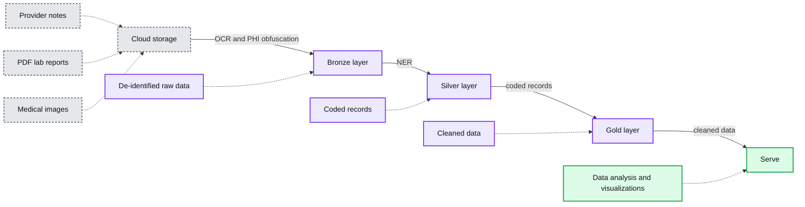
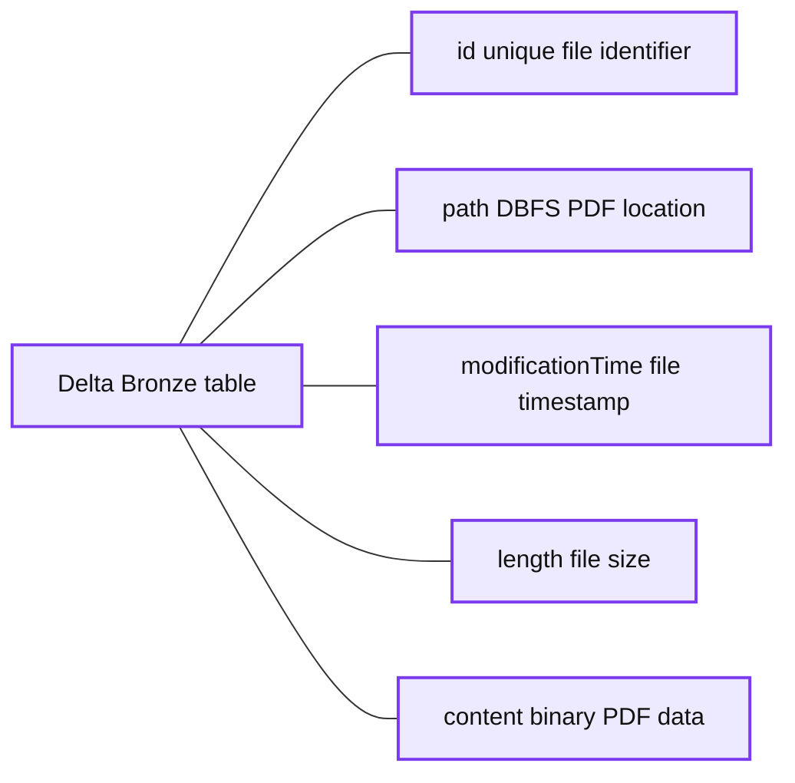
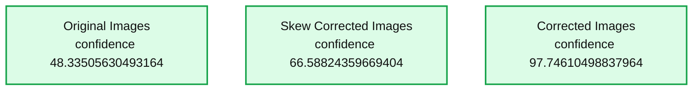

# Automating PHI Removal from Healthcare Data With Natural Language Processing

*Introducing Databricks and John Snow Labs’ Solution Accelerator for PHI De-Identification and Obfuscation at Scale*

- Source: https://www.databricks.com/blog/2022/06/22/automating-phi-removal-from-healthcare-data-with-natural-language-processing.html
- Published: 2022-06-22
- Authors: Amir Kermany, Moritz Steller, David Talby, Michael Ortega, Mike Sanky
- Categories: engineering, solution-accelerators
- Images: 10 total, 4 extracted as architecture

## Minimum necessary standard and PHI in healthcare research

Under the [Health Insurance Portability and Accountability Act (HIPAA)](https://www.hipaajournal.com/ahima-hipaa-minimum-necessary-standard-3481/), minimum necessary standard, HIPAA-covered entities (such as health systems and insurers) are required to make reasonable efforts to ensure that access to Protected Health Information (PHI) is limited to the minimum necessary information to achieve the intended purpose of a particular use, disclosure, or request.

In Europe, the [GDPR](https://docs.databricks.com/security/privacy/gdpr-delta.html) lays out requirements for anonymization and pseudo-anonymization that companies must meet before they can analyze or share medical data. In some cases, these requirements go beyond US regulations by also requiring that companies redact gender identity, ethnicity, religious, and union affiliations. Almost every country has similar legal protections on sensitive personal and medical information.

## The challenges of working with personally identifiable health data

Minimum necessary standards such as these can create obstacles to advancing population-level healthcare research. This is because much of the value in healthcare data is in the semi-structured narrative text and unstructured images, which often contain personally identifiable health information that is challenging to remove. Such PHI makes it difficult to enable clinicians, researchers, and data scientists within an organization to annotate, train, and develop models that have the power to predict disease progression, as an example.

Beyond compliance, another key reason for the de-identification of PHI and medical data before analysis — especially for data science projects — is to prevent bias and learning from spurious correlations. Removing data fields such as patients' addresses, last names, ethnicity, occupation, hospital names, and doctor names prevents machine learning algorithms from relying on these fields when making predictions or recommendations.

## Automating PHI removal with Databricks and John Snow Labs

John Snow Labs, the leader in Healthcare natural language processing (NLP), and Databricks are working together to help organizations process and analyze their text data at scale with a series of Solution Accelerator notebook templates for common NLP use cases. You can learn more about our partnership in our previous blog, [Applying Natural Language Processing to Health Text at Scale](https://www.databricks.com/blog/2021/09/22/extracting-oncology-insights-from-real-world-clinical-data-with-nlp.html).

To help organizations automate the removal of sensitive patient information, we built a [joint Solution Accelerator for PHI removal](https://notebooks.databricks.com/notebooks/HLS/ocr-phi-masking/index.html#ocr-phi-masking_1.html) that builds on top of the Databricks Lakehouse for Healthcare and Life Sciences. John Snow Labs provides two commercial extensions on top of the open-source Spark NLP library — both of which are useful for de-identification and anonymization tasks — that are used in this Accelerator:

- Spark NLP for Healthcare is the world's most widely-used NLP library for the healthcare and life science industries. Optimized to run on Databricks, Spark NLP for Healthcare seamlessly extracts, classifies, and structures clinical and biomedical text data with state-of-the-art accuracy at scale.
- [Spark OCR](https://www.johnsnowlabs.com/spark-ocr/) provides production-grade, trainable, and scalable algorithms and models for a variety of visual image tasks, including document understanding, form understanding, and information extraction. It extends the core libraries' ability to analyze digital text to also read and write PDF and DOCX documents as well as extract text from images - either within such files or from JPG, TIFF, DICOM, and similar formats.

A high-level walkthrough of our Solution Accelerator is included below.

## PHI removal in action

In this Solution Accelerator, we show you how to remove PHI from medical documents so that they can be shared or analyzed without compromising a patient's identity. Here is a high-level overview of the workflow:

- Build an OCR pipeline to process PDF documents
- Detect and extract PHI entities from unstructured text with NLP models
- Use obfuscation to de-identify data, such as PHI text
- Use redaction to de-identify PHI in the visual document view

You can [access the notebooks](https://notebooks.databricks.com/notebooks/HLS/ocr-phi-masking/index.html#ocr-phi-masking_1.html) for a full walkthrough of the solution.

**Summary:** End-to-end Databricks Lakehouse workflow for removing PHI from healthcare documents and images.

**Components:**

- Cloud storage: provider notes, PDF lab reports, and medical images containing HIPAA protected data
- Bronze layer: de-identified raw data stored in Delta Lake
- Silver layer: coded records stored in Delta Lake
- Gold layer: cleaned data stored in Delta Lake
- Serve: data analysis and visualizations
- OCR and PHI obfuscation: extracts and de-identifies PHI
- NER: identifies named entities for further processing

**Flows:**

- Cloud storage -> Bronze layer: documents and images through OCR and PHI obfuscation
- Bronze layer -> Silver layer: de-identified raw data through NER
- Silver layer -> Gold layer: coded records
- Gold layer -> Serve: cleaned data

**Numbers:** none

source image: https://www.databricks.com/wp-content/uploads/2022/06/db-173-blog-img-1.png

## Parsing the files through OCR

As a first step, we load all PDF files from our cloud storage, assign a unique ID to each one, and store the resulting DataFrames into the Bronze layer of the Lakehouse. Note that the raw PDF content is stored in a binary column and can be accessed in the downstream steps.

**Summary:** Sample Delta Bronze table storing uniquely identified PDF files, their paths, modification times, lengths, and binary content.

**Components:**

- `id` column with unique file identifiers
- `path` column with DBFS PDF locations
- `modificationTime` column with file timestamps
- `length` column with file sizes
- `content` column with binary PDF data
- Delta Bronze table

**Flows:**

- none

**Numbers:**

- `MT_OCR_00.pdf`
- `MT_OCR_01.pdf`
- `MT_OCR_02.pdf`
- `2022-02-26T04:21:01.000+0000`
- `2022-02-26T04:21:02.000+0000`
- `230676`
- `165397`
- `841095`

source image: https://www.databricks.com/wp-content/uploads/2022/06/db-173-blog-img-2.png

In the next step, we extract raw text from each file. Since PDF files can have more than one page, it is more efficient to first transform each page into an image (using PdfToImage()) and then extract the text from the image by using ImageToText() for each image.

Similar to SparkNLP, transform is a standardized step in Spark OCR for aligning with any Spark-related transformers and can be executed in one line of code.

Note that you can view each individual image directly within the notebook, as shown below:

After applying this pipeline, we then store the extracted text and raw image in a DataFrame. Note that the linkage between image, extracted text and the original PDF is preserved via the path to the PDF file (and the unique ID) within our cloud storage.

Often, scanned documents are low quality (due to skewed image, poor resolution, etc.) which results in less accurate text and poor data quality. To address this problem, we can use built-in image pre-processing methods within sparkOCR to improve the quality of the extracted text.

## Skew correction and image processing

In the next step, we process images to increase confidence. Spark OCR has **ImageSkewCorrector** which detects the skew of the image and rotates it. Applying this tool within the OCR pipeline helps to adjust images accordingly. Then, by also applying the **ImageAdaptiveThresholding** tool, we can compute a threshold mask image based on a local pixel neighborhood and apply it to the image. Another image processing method that we can add to the pipeline is the use of morphological operations. We can use **ImageMorphologyOperation** which supports Erosion (removing pixels on object boundaries), Dilation (*adding pixels to the boundaries of objects in an image*), Opening (*removing small objects and thin lines from an image while preserving the shape and size of larger objects in the image*) and Closing (*the opposite of opening and useful for filling small holes in an image*).

Removing background objects **ImageRemoveObjects** can be used as well as adding **ImageLayoutAnalyzer** to the pipeline, to analyze the image and determine the regions of text. The code for our fully developed OCR pipeline can be found within the Accelerator [notebook](https://notebooks.databricks.com/notebooks/HLS/ocr-phi-masking/index.html#ocr-phi-masking_1.html).

Let's see the original image and the corrected image.

After the image processing, we have a cleaner image with an increased confidence of 97%.

**Summary:** The image compares confidence scores for original, skew-corrected, and corrected images, showing improvement from 48.33505630493164 to 97.74610498837964.

**Components:**

- Original Images - technology not shown
- Skew Corrected Images - technology not shown
- Corrected Images - technology not shown
- Confidence tables - technology not shown

**Flows:**

- No arrows are visible in the image.

**Numbers:** 1, 48.33505630493164, 1, 66.58824359669404, 1, 97.74610498837964

source image: https://www.databricks.com/wp-content/uploads/2022/06/db-173-blog-img-6.png

Now that we have corrected for image skewness and background noise, and extracted the corrected text from images we write the resulting DataFrame into the Silver layer in Delta.

## Extracting and obfuscating PHI entities

Once we've finished using Spark OCR to process our documents, we can use a clinical Named Entity Recognition (NER) pipeline to detect and extract entities of interest (like name, birthplace, etc.) in our document. We covered this process in more detail in a [previous blog post](https://www.databricks.com/blog/2021/09/22/extracting-oncology-insights-from-real-world-clinical-data-with-nlp.html) about extracting oncology insights from lab reports.

However, there are often PHI entities within clinical notes that can be used to identify and link an individual to the identified clinical entities (for example disease status). As a result, it is critical to identify PHI within the text and obfuscate those entities.

There are two steps in the process: extract the PHI entities, and then hide them; while ensuring that the resulting dataset contains valuable information for downstream analysis.

Similar to clinical NER, we use a medical NER model (`ner_deid_generic_augmented`) to detect PHI and then we use the "faker method" to obfuscate those entities. Our full PHI extraction pipeline can also be found in the Accelerator [notebook](https://notebooks.databricks.com/notebooks/HLS/ocr-phi-masking/index.html#ocr-phi-masking_1.html).

The pipeline detects PHI entities, which we can then visualize with the NerVisualizer as shown below.

Now to construct an end-to-end deidentification pipeline, we simply add the obfuscation step to the PHI extraction pipeline which replaces PHI with fake data.

In the following example, we redact the birthplace of the patient and replace it with a fake location:

In addition to obfuscation, SparkNLP for Healthcare offers pre-trained models for redaction. Here is a screenshot showing the output of those redaction pipelines.

PDF images are updated with a black line to redact PHI entities

SparkNLP and Spark OCR work well together for de-identification of PHI at scale. In many scenarios, Federal and industry regulations prohibit the distribution or sharing of the original text file. As demonstrated, we can create a scalable and automated production pipeline to classify text within PDFs, obfuscate or redact PHI entities, and write the resulting data back into the Lakehouse. Data teams can then comfortably share this "cleansed" data and de-identified information with downstream analysts, data scientists, or business users without compromising a patient's privacy. Included below is a summary chart of this data flow on Databricks.

*Data flow chart for PHI obfuscation using Spark OCR abd SparkNLP on Databricks.*

**Summary:** The diagram shows a Databricks pipeline that extracts text from oncology PDFs, identifies and masks PHI, and stores de-identified clinical notes.

**Components:**

- MT Oncology PDF files: source documents.
- Clinical notes: PDF files matching `mt_ocr_*.pdf`.
- Extract text: SparkOCR processing.
- Extracted text: stored OCR output.
- PHI extraction and masking: SparkNLP processing.
- De-identified notes: final masked clinical notes.
- `pdf_df`, `pdf_processed_silver_df`, `processed_pdf_df`, and `obfuscated_pdf_df`: intermediate data frames.

**Flows:**

- MT Oncology PDF files -> Clinical notes: `mt_ocr_*.pdf` files.
- Clinical notes -> Extract text: `pdf_df`.
- Extract text -> Extracted text: `pdf_processed_silver_df`.
- Extracted text -> PHI extraction and masking: `processed_pdf_df`.
- PHI extraction and masking -> De-identified notes: `obfuscated_pdf_df`.

**Numbers:** none

source image: https://www.databricks.com/wp-content/uploads/2022/06/db-173-blog-img-10.png

```mermaid
%% Shows the PHI extraction and masking data flow
flowchart LR
    A[MT Oncology PDF files] -->|mt_ocr_*.pdf| B[(Clinical notes)]
    B -->|pdf_df| C[Extract text SparkOCR]
    C -->|pdf_processed_silver_df| D[(Extracted text)]
    D -->|processed_pdf_df| E[PHI extraction and masking SparkNLP]
    E -->|obfuscated_pdf_df| F[(De-identified notes)]

    classDef client fill:#dbeafe,stroke:#2563eb,stroke-width:2px,color:#111
    classDef service fill:#dcfce7,stroke:#16a34a,stroke-width:2px,color:#111
    classDef store fill:#ede9fe,stroke:#7c3aed,stroke-width:2px,color:#111
    classDef cache fill:#fef3c7,stroke:#d97706,stroke-width:2px,color:#111
    classDef queue fill:#cffafe,stroke:#0891b2,stroke-width:2px,color:#111
    classDef critical fill:#fee2e2,stroke:#dc2626,stroke-width:4px,color:#111
    classDef external fill:#e5e7eb,stroke:#6b7280,stroke-width:2px,color:#111,stroke-dasharray:4 3
    classDef decision fill:#fce7f3,stroke:#db2777,stroke-width:2px,color:#111

    class A client
    class B,D,F store
    class C,E service
```

Data flow chart for PHI obfuscation using Spark OCR abd SparkNLP on Databricks.

## Start building your PHI removal pipeline

With this Solution Accelerator, Databricks and John Snow Labs make it easy to automate the de-identification and obfuscation of sensitive data contained within PDF medical documents.

To use this Solution Accelerator, you can preview the [notebooks online](https://notebooks.databricks.com/notebooks/HLS/ocr-phi-masking/index.html#ocr-phi-masking_1.html) and import them directly into your Databricks account. The notebooks include guidance for installing the related John Snow Labs NLP libraries and license keys.

You can also visit our [Lakehouse for Healthcare and Life Sciences](https://www.databricks.com/solutions/industries/healthcare-and-life-sciences) page to learn about all of our solutions.
