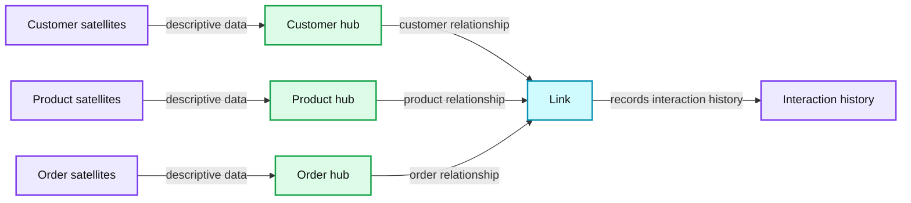
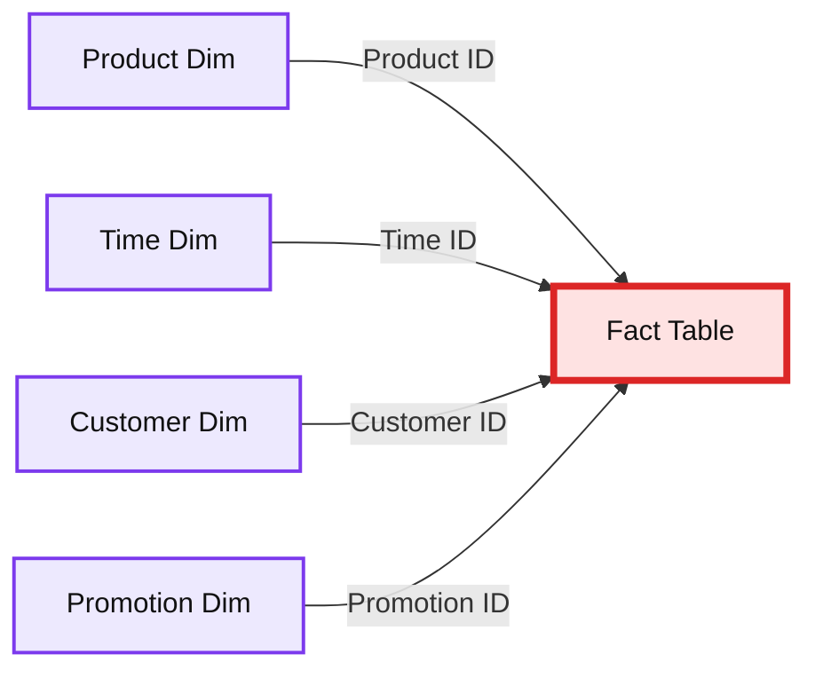
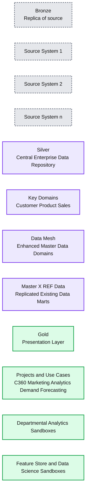
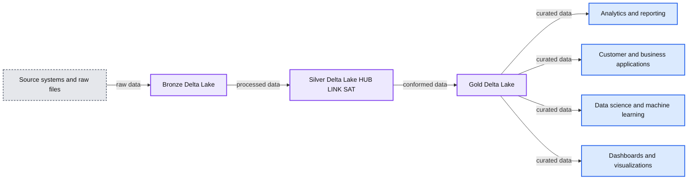
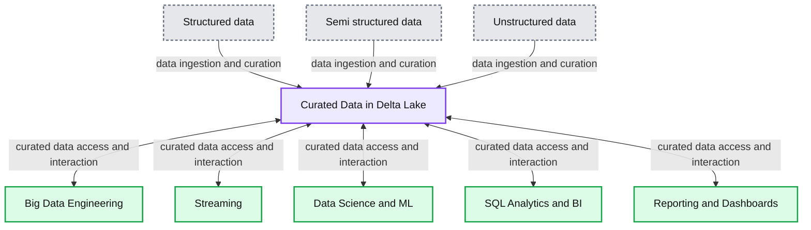

# Data Warehousing Modeling Techniques and Their Implementation on the Databricks Lakehouse Platform

*Using Data Vaults and Star Schemas on the Lakehouse*

- Source: https://www.databricks.com/blog/2022/06/24/data-warehousing-modeling-techniques-and-their-implementation-on-the-databricks-lakehouse-platform.html
- Published: 2022-06-24
- Authors: Soham Bhatt, Deepak Sekar
- Categories: platform, solutions, data-warehousing, uncategorized
- Images: 5 total, 5 extracted as architecture

The lakehouse is a new data platform paradigm that combines the best features of data lakes and data warehouses. It is designed as a large-scale enterprise-level data platform that can house many use cases and data products. It can serve as a single unified enterprise data repository for all of your:

- data domains,
- real-time streaming use cases,
- data marts,
- disparate data warehouses,
- data science feature stores and data science sandboxes, and
- departmental self-service analytics sandboxes.

Given the variety of the use cases — different data organizing principles and modeling techniques may apply to different projects on a lakehouse. Technically, the [Databricks Lakehouse Platform](https://www.databricks.com/product/data-lakehouse) can support many different data modeling styles. In this article, we aim to explain the implementation of the Bronze/Silver/Gold data organizing principles of the lakehouse and how different data modeling techniques fit in each layer.

## What is a Data Vault?

A [Data Vault](https://www.databricks.com/glossary/data-vault) is a more recent data modeling design pattern used to build data warehouses for enterprise-scale analytics compared to Kimball and Inmon methods.

Data Vaults organize data into three different types:** hubs**, **links**, and **satellites**. Hubs represent core business entities, links represent relationships between hubs, and satellites store attributes about hubs or links.

Data Vault focuses on agile data warehouse development where scalability, data integration/ETL and development speed are important. Most customers have a landing zone, Vault zone and a data mart zone which correspond to the Databricks organizational paradigms of Bronze, Silver and Gold layers. The Data Vault modeling style of hub, link and satellite tables typically fits well in the Silver layer of the Databricks Lakehouse.

Learn more about Data Vault modeling at [Data Vault Alliance](https://datavaultalliance.com/).

*A diagram showing how Data Vault modeling works, with hubs, links, and satellites connecting to one another.*

**Summary:** The diagram shows a Data Vault model connecting customer, product, and order hubs through a link that records interaction history, with satellites storing descriptive data.

**Components:**

- Customer hub: unique customer business keys
- Product hub: unique product business keys
- Order hub: unique order business keys
- Link: relationships, associations, and interaction history
- Customer satellites: descriptive customer data
- Product satellites: descriptive product data
- Order satellites: descriptive order data

**Flows:**

- Customer satellites -> Customer: descriptive data
- Product satellites -> Product: descriptive data
- Order satellites -> Order: descriptive data
- Customer -> Link: customer relationship
- Product -> Link: product relationship
- Order -> Link: order relationship
- Link -> interaction history: records interaction history

**Numbers:** none

source image: https://www.databricks.com/wp-content/uploads/2022/06/db-241-blog-img-1.png

A diagram showing how Data Vault modeling works, with hubs, links, and satellites connecting to one another.

## What is Dimensional Modeling?

Dimensional modeling is a bottom-up approach to designing data warehouses in order to optimize them for analytics. Dimensional models are used to denormalize business data into **dimensions** (like time and product) and **facts** (like transactions in amounts and quantities), and different subject areas are connected via conformed dimensions to navigate to different fact tables.

The most common form of dimensional modeling is the [star schema](https://www.databricks.com/glossary/star-schema). A star schema is a multi-dimensional data model used to organize data so that it is easy to understand and analyze, and very easy and intuitive to run reports on. Kimball-style star schemas or dimensional models are pretty much the gold standard for the presentation layer in data warehouses and data marts, and even semantic and reporting layers. The star schema design is optimized for querying large data sets.

*A star schema example*

**Summary:** A star schema connects a fact table to product, time, customer, and promotion dimension tables.

**Components:**

- Product Dim: product dimension, technology not specified
- Time Dim: time dimension, technology not specified
- Customer Dim: customer dimension, technology not specified
- Promotion Dim: promotion dimension, technology not specified
- Fact Table: fact table, technology not specified

**Flows:**

- Product Dim -> Fact Table: Product ID
- Time Dim -> Fact Table: Time ID
- Customer Dim -> Fact Table: Customer ID
- Promotion Dim -> Fact Table: Promotion ID

**Numbers:** none

source image: https://www.databricks.com/wp-content/uploads/2022/06/db-241-blog-img-2.png

A star schema example

Both normalized Data Vault (write-optimized) and denormalized dimensional models (read-optimized) data modeling styles have a place in the Databricks Lakehouse. The Data Vault's hubs and satellites in the Silver layer are used to load the dimensions in the star schema, and the Data Vault's link tables become the key driving tables to load the fact tables in the dimension model. Learn more about dimensional modeling from the [Kimball Group](https://www.kimballgroup.com/data-warehouse-business-intelligence-resources/books/).

## Data organization principles in each layer of the Lakehouse

A modern lakehouse is an all-encompassing enterprise-level data platform. It is highly scalable and performant for all kinds of different use cases such as ETL, BI, data science and streaming that may require different data modeling approaches. Let's see how a typical lakehouse is organized:

*A diagram showing characteristics of the Bronze, Silver, and Gold layers of the Data Lakehouse Architecture.*

**Summary:** The diagram presents the Bronze, Silver, and Gold layers of a Data Lakehouse Architecture and their purposes.

**Components:**

- Bronze: replica of source data for landing, archiving, reprocessing, and lineage; technology not specified
- Silver: central enterprise data repository, 3NF-like, Data Vault-like, and write-optimized; technology not specified
- Gold: presentation layer using star schema, Kimball, and read-optimized models; technology not specified
- Source System 1: source system; technology not specified
- Source System 2: source system; technology not specified
- Source System n: source system; technology not specified
- Key Domains: customer, product, and sales organization; technology not specified
- Data Mesh: enhanced master data domains contributed by business units; technology not specified
- Master and X-REF Data: replicated existing data marts; technology not specified
- Projects and Use Cases: C360, marketing analytics, and demand forecasting; technology not specified
- Departmental Analytics Sandboxes: departmental analysis environment; technology not specified
- Feature Store and Data Science Sandboxes: machine learning and data science environment; technology not specified

**Flows:**

- none

**Numbers:** 3NF-like, Source System 1, Source System 2, Source System n, C360

source image: https://www.databricks.com/wp-content/uploads/2022/06/db-241-blog-img-3.png

A diagram showing characteristics of the Bronze, Silver, and Gold layers of the Data Lakehouse Architecture.

## Bronze layer — the Landing Zone

The Bronze layer is where we land all the data from source systems. The table structures in this layer correspond to the source system table structures "as-is," aside from optional metadata columns that can be added to capture the load date/time, process ID, etc. The focus in this layer is on change data capture (CDC), and the ability to provide an historical archive of source data (cold storage), data lineage, auditability, and reprocessing if needed — without rereading the data from the source system.

In most cases, it's a good idea to keep the data in the Bronze layer in Delta format, so that subsequent reads from the Bronze layer for ETL are performant — and so that you can do updates in Bronze to write CDC changes. Sometimes, when data arrives in JSON or XML formats, we do see customers landing it in the original source data format and then stage it by changing it to Delta format. So sometimes, we see customers manifest the logical Bronze layer into a physical landing and staging zone.

Storing raw data in the original source data format in a landing zone also helps with consistency wherein you ingest data via ingestion tools that don't support Delta as a native sink or where source systems dump data onto object stores directly. This pattern also aligns well with the autoloader ingestion framework wherein sources land the data in landing zone for raw files and then [Databricks AutoLoader](https://docs.databricks.com/ingestion/auto-loader/index.html) converts the data to Staging layer in Delta format.

## Silver layer — the Enterprise Central Repository

In the Silver layer of the Lakehouse, the data from the Bronze layer is matched, merged, conformed and cleaned ("just-enough") so that the Silver layer can provide an "enterprise view" of all its key business entities, concepts and transactions. This is akin to an Enterprise Operational Data Store (ODS) or a Central Repository or Data domains of a Data Mesh (e.g. master customers, products, non-duplicated transactions and cross-reference tables). This enterprise view brings the data from different sources together, and enables self-service analytics for ad-hoc reporting, advanced analytics and ML. It also serves as a source for departmental analysts, data engineers and data scientists to further create data projects and analysis to answer business problems via enterprise and departmental data projects in the Gold layer.

In the Lakehouse Data Engineering paradigm, typically the (Extract-Load-Transform) ELT methodology is followed vs. traditional Extract-Transform-Load(ETL). ELT approach means only minimal or "just-enough" transformations and data cleansing rules are applied while loading the Silver layer. All the "enterprise level" rules are applied in the Silver layer vs. project-specific transformational rules, which are applied in the Gold layer. Speed and agility to ingest and deliver the data in Lakehouse is prioritized here.

From a data modeling perspective, the Silver Layer has more 3rd-Normal Form like data models. Data Vault-like write-performant data architectures and data models can be used in this layer. If using a Data Vault methodology, both the raw Data Vault and Business Vault will fit in the logical Silver layer of the lake — and the Point-In-Time (PIT) presentation views or materialized views will be presented in the Gold Layer.

## Gold layer — the Presentation Layer

In the Gold layer, multiple data marts or warehouses can be built as per dimensional modeling/Kimball methodology. As discussed earlier, the Gold layer is for reporting and uses more denormalized and read-optimized data models with fewer joins compared to the Silver layer. Sometimes tables in the Gold Layer can be completely denormalized, typically if the data scientists want it that way to feed their algorithms for feature engineering.

ETL and data quality rules that are "project-specific" are applied when transforming data from the Silver layer to Gold layer. Final presentation layers such as data warehouses, data marts or data products like customer analytics, product/quality analytics, inventory analytics, customer segmentation, product recommendations, marketing/sales analytics etc. are delivered in this layer. Kimball style star-schema based data models or Inmon style Data marts fit in this Gold Layer of the Lakehouse. Data Science Laboratories and Departmental Sandboxes for self-service analytics also belong in the Gold Layer.

## The Lakehouse Data Organization Paradigm

**Summary:** The diagram shows data progressing through Bronze, Silver, and Gold layers within a Delta Lake lakehouse, producing analytics and data science outputs.

**Components:**

- Source systems and raw files
- Bronze layer using Delta Lake
- Silver layer using Delta Lake, with HUB, LINK, and SAT structures
- Gold layer using Delta Lake
- Analytics and reporting consumers
- Customer and business applications
- Data science and machine learning consumers
- Dashboards and visualizations

**Flows:**

- Source systems and raw files -> Bronze layer: raw source data
- Bronze layer -> Silver layer: processed and integrated data
- Silver layer -> Gold layer: conformed and modeled data
- Delta Lake -> Analytics and reporting consumers: curated data
- Delta Lake -> Customer and business applications: curated data
- Delta Lake -> Data science and machine learning consumers: curated data
- Delta Lake -> Dashboards and visualizations: curated data

**Numbers:** 0, 1, 0101

source image: https://www.databricks.com/wp-content/uploads/2022/06/db-241-blog-img-4.png

 

To summarize, data is curated as it moves through the different layers of a Lakehouse.

- The **Bronze layer** uses the data models of source systems. If data is landed in raw formats, it is converted to DeltaLake format within this layer.
- The **Silver layer** for the first time brings the data from different sources together and conforms it to create an Enterprise view of the data — typically using a more normalized, write-optimized data models that are typically 3rd-Normal Form-like or Data Vault-like.
- The **Gold layer** is the presentation layer with more denormalized or flattened data models than the Silver layer, typically using Kimball-style dimensional models or star schemas. The Gold layer also houses departmental and data science sandboxes to enable self-service analytics and data science across the enterprise. Providing these sandboxes and their own separate compute clusters prevents the Business teams from creating their own copies of data outside of the Lakehouse.

This Lakehouse data organization approach is meant to break data silos, bring teams together, and empower them to do ETL, streaming, and BI and AI on one platform with proper governance. Central data teams should be the enablers of innovation in the organization, speeding up the onboarding of new self-service users, as well as the development of many data projects in parallel — rather than the data modeling process becoming the bottleneck. The [Databricks Unity Catalog](https://www.databricks.com/product/unity-catalog) provides search & discovery, governance and lineage on the Lakehouse to ensure good data governance cadence.

[Build your Data Vaults and star schema data warehouses with Databricks SQL today](https://www.databricks.com/product/databricks-sql).

*How data is curated as it moves through the various Lakehouse layers.*

**Summary:** The diagram shows structured, semi-structured and unstructured data flowing into curated Delta Lake data for multiple analytics and engineering workloads.

**Components:**

- Big Data Engineering - technology not specified
- Streaming - technology not specified
- Data Science and ML - technology not specified
- SQL Analytics and BI - technology not specified
- Reporting and Dashboards - technology not specified
- Curated Data - stored in Delta Lake
- Structured data - source type
- Semi-structured data - source type
- Unstructured data - source type

**Flows:**

- Structured data -> Curated Data: data ingestion and curation
- Semi-structured data -> Curated Data: data ingestion and curation
- Unstructured data -> Curated Data: data ingestion and curation
- Curated Data -> Big Data Engineering: curated data access
- Big Data Engineering -> Curated Data: data interaction
- Curated Data -> Streaming: curated data access
- Streaming -> Curated Data: data interaction
- Curated Data -> Data Science and ML: curated data access
- Data Science and ML -> Curated Data: data interaction
- Curated Data -> SQL Analytics and BI: curated data access
- SQL Analytics and BI -> Curated Data: data interaction
- Curated Data -> Reporting and Dashboards: curated data access
- Reporting and Dashboards -> Curated Data: data interaction

**Numbers:** none

source image: https://www.databricks.com/wp-content/uploads/2022/06/db-241-blog-img-5.png

How data is curated as it moves through the various Lakehouse layers.

## Further reading:

- [Five Simple Steps for Implementing a Star Schema in Databricks With Delta Lake](https://www.databricks.com/blog/2022/05/20/five-simple-steps-for-implementing-a-star-schema-in-databricks-with-delta-lake.html)
- [Best practices to implement a Data Vault model in Databricks Lakehouse](https://www.databricks.com/blog/2022/06/24/prescriptive-guidance-for-implementing-a-data-vault-model-on-the-databricks-lakehouse-platform.html)
- [Dimensional Modeling Best practice & Implementation on Modern Lakehouse](https://www.databricks.com/blog/data-modeling-best-practices-implementation-modern-lakehouse)
- [Identity Columns to Generate Surrogate Keys Are Now Available in a Lakehouse Near You!](https://www.databricks.com/blog/2022/08/08/identity-columns-to-generate-surrogate-keys-are-now-available-in-a-lakehouse-near-you.html)
- [Load an EDW Dimensional Model in Real Time With Databricks Lakehouse](https://www.databricks.com/blog/2022/11/07/load-edw-dimensional-model-real-time-databricks-lakehouse.html)
