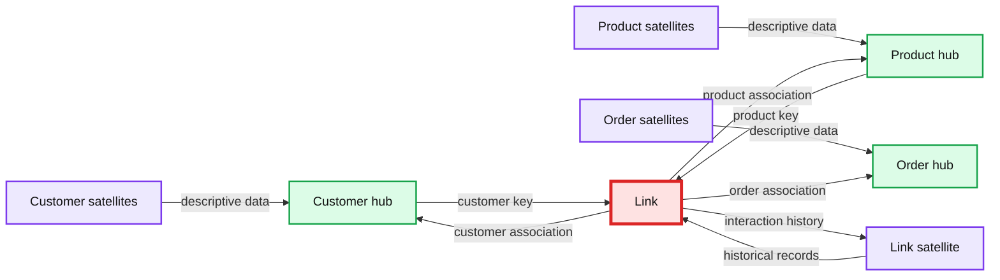

# Prescriptive Guidance for Implementing a Data Vault Model on the Databricks Lakehouse Platform

- Source: https://www.databricks.com/blog/2022/06/24/prescriptive-guidance-for-implementing-a-data-vault-model-on-the-databricks-lakehouse-platform.html
- Published: 2022-06-24
- Authors: Soham Bhatt, Tanveer Shaikh, Glenn Wiebe
- Categories: platform, solutions, data-warehousing
- Images: 2 total, 2 extracted as architecture

There are many different data models that you can use when designing an analytical system, such as industry-specific domain models, Kimball, Inmon, and Data Vault methodologies. Depending on your unique requirements, you can use these different modeling techniques when designing a [lakehouse](https://www.databricks.com/research/lakehouse-a-new-generation-of-open-platforms-that-unify-data-warehousing-and-advanced-analytics). They all have their strengths, and each can be a good fit in different use cases.

Ultimately, a data model is nothing more than a construct defining different tables with one-to-one, one-to-many, and many-to-many relationships defined. Data platforms must provide best practices for physicalizing the data model, to help with easier information retrieval and better performance.

In a previous article, we covered [Five Simple Steps for Implementing a Star Schema in Databricks With Delta Lake](https://www.databricks.com/blog/2022/05/20/five-simple-steps-for-implementing-a-star-schema-in-databricks-with-delta-lake.html). In this article, we aim to explain what a Data Vault is, how to implement it within the Bronze/Silver/Gold layer and how to get the best performance of Data Vault with Databricks Lakehouse Platform.

## Data Vault modeling, defined

The goal of Data Vault modeling is to adapt to fast-paced changing business requirements and support faster and agile development of data warehouses by design. A Data Vault is well suited to the lakehouse methodology since the data model is easily extensible and granular with its hub, link and satellite design so design and ETL changes are easily implemented.

Let's understand a few building blocks for a Data Vault. In general, a Data Vault model has three types of entities:

- **Hubs** — A Hub represents a core business entity, like customers, products, orders, etc. Analysts will use the natural/business keys to get information about a Hub. The primary key of Hub tables is usually derived by a combination of business concept ID, load date, and other metadata information.
- **Links** — Links represent the relationship between Hub entities. It has only the join keys. It is like a Factless Fact table in the dimensional model. No attributes - just join keys.
- **Satellites** — Satellite tables have the attributes of the entities in the Hub or Links. They have descriptive information on core business entities. They are similar to a normalized version of a Dimension table. For example, a customer hub can have many satellite tables such as customer geographical attributes, , customer credit score, customer loyalty tiers, etc.

One of the major advantages of using Data Vault methodology is that existing ETL jobs need significantly less refactoring when the data model changes. Data Vault is a "write-optimized" modeling style and supports agile development approaches and is a great fit for data lakes and lakehouse approach.

*A diagram shows how data vault modeling works, with hubs, links, and satellites connected to one another.*

**Summary:** The diagram shows a Data Vault model connecting customer, product, and order hubs through links and descriptive satellites.

**Components:**

- Customer hub: Data Vault hub for unique customer business keys
- Product hub: Data Vault hub for unique product business keys
- Order hub: Data Vault hub for unique order business keys
- Link: Data Vault link recording customer, product, and order relationships
- Customer satellites: Data Vault satellites containing customer descriptive data
- Product satellites: Data Vault satellites containing product descriptive data
- Order satellites: Data Vault satellites containing order descriptive data

**Flows:**

- Customer satellites -> Customer hub: Descriptive customer data
- Product satellites -> Product hub: Descriptive product data
- Order satellites -> Order hub: Descriptive order data
- Customer hub -> Link: Customer business key
- Product hub -> Link: Product business key
- Link -> Customer hub: Customer relationship association
- Link -> Product hub: Product relationship association
- Link -> Order hub: Order relationship association
- Link -> Link satellite: Interaction history
- Link satellite -> Link: Historical interaction records

**Numbers:** none

source image: https://www.databricks.com/wp-content/uploads/2022/06/db-242-blog-img-1.png

A diagram shows how data vault modeling works, with hubs, links, and satellites connected to one another.

## How Data Vault fits in a Lakehouse

Let's see how some of our customers are using Data Vault Modeling in a Databricks Lakehouse architecture:

*Data Vault Architecture on the Lakehouse*

**Summary:** The diagram shows data flowing from enterprise applications and OLTP databases through bronze landing zones and silver raw and business vaults into gold star schema marts for AI/ML and reporting.

**Components:**

- Enterprise Applications: source systems
- OLTP Databases: operational database sources
- CSV Files: staged file extracts
- Bronze Landing Zones: Databricks lakehouse landing layer
- Processing Pipelines: transformation and ingestion processes
- Silver Raw Vault: raw Data Vault layer
- Silver Business Vault: business Data Vault layer
- Gold Star Schema Data Marts and Views: analytics presentation layer
- AI ML: machine learning consumers
- Reporting: reporting consumers

**Flows:**

- Enterprise Applications -> CSV Files: application data extracts
- OLTP Databases -> CSV Files: operational data extracts
- CSV Files -> Bronze Landing Zones: staged CSV files
- Bronze Landing Zones -> Processing Pipelines: landing-zone data
- Processing Pipelines -> Silver Raw Vault: processed source data
- Silver Raw Vault -> Silver Business Vault: raw vault data
- Silver Business Vault -> Gold Star Schema Data Marts and Views: business-ready data
- Gold Star Schema Data Marts and Views -> AI ML: analytical data
- Gold Star Schema Data Marts and Views -> Reporting: reporting data

**Numbers:** none

source image: https://www.databricks.com/wp-content/uploads/2022/06/db-242-blog-img-2.png

```mermaid
%% Shows Data Vault data flow across Databricks lakehouse layers
flowchart LR
    A[Enterprise Applications] -->|data extracts| C[CSV Files]
    B[OLTP Databases] -->|data extracts| C
    C -->|staged files| D[Bronze Landing Zones]
    D -->|landing data| E[Processing Pipelines]
    E -->|processed data| F[Silver Raw Vault]
    F -->|vault data| G[Silver Business Vault]
    G -->|business data| H[Gold Star Schema Data Marts and Views]
    H -->|analytics data| I[AI ML]
    H -->|reporting data| J[Reporting]

    classDef client fill:#dbeafe,stroke:#2563eb,stroke-width:2px,color:#111
    classDef service fill:#dcfce7,stroke:#16a34a,stroke-width:2px,color:#111
    classDef store fill:#ede9fe,stroke:#7c3aed,stroke-width:2px,color:#111
    classDef cache fill:#fef3c7,stroke:#d97706,stroke-width:2px,color:#111
    classDef queue fill:#cffafe,stroke:#0891b2,stroke-width:2px,color:#111
    classDef critical fill:#fee2e2,stroke:#dc2626,stroke-width:4px,color:#111
    classDef external fill:#e5e7eb,stroke:#6b7280,stroke-width:2px,color:#111,stroke-dasharray:4 3
    classDef decision fill:#fce7f3,stroke:#db2777,stroke-width:2px,color:#111

    class A,B external
    class C,D,F,G,H store
    class E service
    class I,J client
```

Data Vault Architecture on the Lakehouse

## Considerations for implementing a Data Vault Model in Databricks Lakehouse

- Data Vault modeling recommends using a hash of business keys as the primary keys. Databricks supports [hash](https://docs.databricks.com/sql/language-manual/functions/hash.html), [md5](https://docs.databricks.com/spark/latest/spark-sql/language-manual/functions/sha2.html), and [SHA](https://docs.databricks.com/spark/latest/spark-sql/language-manual/functions/sha2.html) functions out of the box to support business keys.
- Data Vault layers have the concept of a landing zone (and sometimes a staging zone). Both these physical layers naturally fit the Bronze layer of the data lakehouse. If the landing zone data arrives such as Avro, CSV, parquet, XML, JSON formats, it is converted to Delta-formatted tables in the staging zone, so that the subsequent ETL can be highly performant.
- Raw Vault is created from the landing or staging zone. Data is modeled as Hubs, Links and Satellite tables in the Raw Data Vault. Additional "business" ETL rules are not typically applied while loading the Raw Data Vault.
- All the ETL business rules, data quality rules, cleansing and conforming rules are applied between Raw and Business Vault. Business Vault tables can be organized by data domains - which serve as an enterprise "central repository" of standardized cleansed data. Data stewards and SMEs own the governance, data quality and business rules around their areas of the Business Vault.
- Query-helper tables such as Point-in-Time (PIT) and Bridge tables are created for the presentation layer on top of the business vault. The PIT tables will bolster query performance as some satellites and hubs are pre-joined and provide some WHERE conditions with "point in time" filtering. Bridge tables pre-joins hubs or entities to provide a flattened "dimensional table" like views for Entities. [Delta Live Tables](https://www.databricks.com/product/delta-live-tables) are exactly like Materialized Views and can be used to create Point-in-Time tables as well as Bridge tables in the Gold/Presentation layer on top of the Business Data Vault.
- As business processes change and adapt, the Data Vault model can be easily extended without massive refactoring like the dimensional models. Additional hubs (subject areas) can be easily added to links (pure join tables) and additional satellites (e.g. customer segmentations) can be added to a Hub (customer) with minimal changes.
- Also loading a dimensional model Data Warehouse in Gold layer becomes easier for the following reasons:
  - Hubs make key management easier (natural keys from hubs can be converted to surrogate keys via [Identity columns](https://docs.databricks.com/sql/language-manual/sql-ref-syntax-ddl-create-table-using.html)).
  - Satellites make loading dimensions easier because they contain all the attributes.
  - Links make loading fact tables quite straightforward because they contain all the relationships.

## Tips to get best performance out of a Data Vault Model in Databricks Lakehouse

- Use Delta Formatted tables for Raw Vault, Business Vault and Gold layer tables.
- Make sure to use [OPTIMIZE and Z-order](https://docs.databricks.com/spark/latest/spark-sql/language-manual/delta-optimize.html) indexes on all join keys of Hubs, Links and Satellites.
- Do not over partition the tables -especially the smaller satellites tables. Use [Bloom filter indexing](https://docs.databricks.com/spark/2.x/spark-sql/language-manual/create-bloomfilter-index.html) on Date columns, current flag columns and predicate columns that are typically filtered on to ensure best performance - especially if you need to create additional indices apart from Z-order.
- Delta Live Tables (Materialized Views) makes creating and managing PIT tables very easy.
- Reduce the `optimize.maxFileSize` to a lower number, such as 32-64MB vs. the default of 1 GB. By [creating smaller files](https://docs.databricks.com/delta/optimizations/file-mgmt.html?_gl=1*4h0z45*_gcl_aw*R0NMLjE2NTM2NjUxMTYuQ2p3S0NBanc3Y0dVQmhBOUVpd0FyQkF2b2t2QVVLRUYyY1IxaWpCQUE2dTc1Z0JuOXdHVk15cnlNa24wR285bDdJNmdNd09ZTDlYMUNob0NQUDBRQXZEX0J3RQ..&_ga=2.187696104.1166404933.1654027881-1494630188.1622042196&_gac=1.54275674.1653665118.CjwKCAjw7cGUBhA9EiwArBAvokvAUKEF2cR1ijBAA6u75gBn9wGVMyryMkn0Go9l7I6gMwOYL9X1ChoCPP0QAvD_BwE#id4), you can benefit from file pruning and minimize the I/O retrieving the data you need to join.
- Data Vault model has comparatively more joins, so use the latest version of DBR which ensures that the Adaptive Query Execution is ON by default so that the best Join strategy is automatically used. Use [Join hints](https://docs.databricks.com/spark/latest/spark-sql/language-manual/sql-ref-syntax-qry-select-hints.html#join-hints) only if necessary. ( for advanced performance tuning).

Learn more about Data Vault modeling at [Data Vault Alliance](https://datavaultalliance.com/).

## Get started on building your Data Vault in the Lakehouse

[Try Databricks free for 14 days](https://www.databricks.com/try-databricks?itm_data=datavault-blog).
