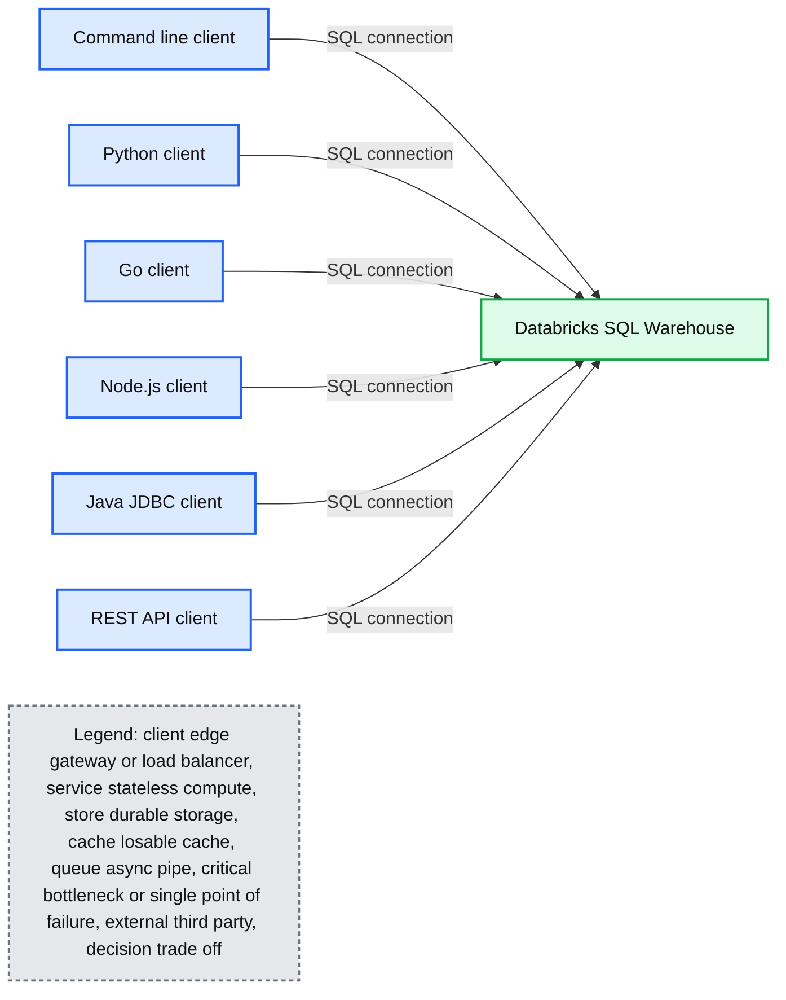

# Connect From Anywhere to Databricks SQL

*Announcing open-source Go, Node.js, Python, and CLI connectors to Databricks SQL*

- Source: https://www.databricks.com/blog/2022/06/29/connect-from-anywhere-to-databricks-sql.html
- Published: 2022-06-29
- Authors: Reynold Xin, Shant Hovsepian, Bilal Aslam, Tao Tao, Arik Fraimovich, Moe Derakhshani, Cyrielle Simeone
- Categories: engineering, open-source, data-warehousing
- Images: 1 total, 1 extracted as architecture

Today we are thrilled to announce a full lineup of open source connectors for [Go](https://github.com/databricks/databricks-sql-go), [Node.js](https://github.com/databricks/databricks-sql-nodejs), [Python](https://github.com/databricks/databricks-sql-python), as well as a new [CLI](https://github.com/databricks/databricks-sql-cli) that makes it simple for developers to connect to Databricks SQL from any application of their choice. Along the same theme of empowering developers, we have also published the official Databricks JDBC driver on [the Maven central repository](https://search.maven.org/artifact/com.databricks/databricks-jdbc/), making it possible to use it in your build system and confidently package it with your applications.

**Summary:** Multiple client technologies connect to a Databricks SQL Warehouse.

**Components:**

- Command line client using a terminal
- Python client using Python
- Go client using Go
- Node.js client using Node.js
- Java client using JDBC
- REST client using REST API
- Databricks SQL Warehouse

**Flows:**

- Command line client -> Databricks SQL Warehouse: SQL connection
- Python client -> Databricks SQL Warehouse: SQL connection
- Go client -> Databricks SQL Warehouse: SQL connection
- Node.js client -> Databricks SQL Warehouse: SQL connection
- Java JDBC client -> Databricks SQL Warehouse: SQL connection
- REST API client -> Databricks SQL Warehouse: SQL connection

**Numbers:** none

source image: https://www.databricks.com/wp-content/uploads/2022/06/connectors.png

 Databricks SQL connectors: connect from anywhere and
 build data apps powered by your lakehouse

Since its [GA](https://www.databricks.com/blog/2022/01/26/building-data-applications-on-the-lakehouse-with-the-databricks-sql-connector-for-python.html) earlier this year, the Databricks SQL Connector for Python has seen tremendous adoption from our developer community, averaging over 1 million downloads a month. We are excited to announce that the connector is now completely open source.

We would like to thank the contributors to the open source projects that provided the basis for our new Databricks SQL connectors. We invite the community to join us on GitHub and collaborate on the future of data connectivity.

### **Databricks SQL Go Driver**

[Go](https://go.dev/) is a popular open source language commonly used for building reliable cloud and network services and web applications. Our open source [driver](https://github.com/databricks/databricks-sql-go) implements the idiomatic [database/sql](https://golang.org/pkg/database/sql) standard for database access.

Here’s a quick example of how to submit SQL queries to Databricks from Go:

Output:

You can find additional examples in the [examples](https://github.com/databricks/databricks-sql-go/tree/main/examples) folder of the repo. We are looking forward to the community’s contributions and feedback on [GitHub](https://github.com/databricks/databricks-sql-go).

### **Databricks SQL Node.js Driver**

Node.js is very popular for building services in JavaScript and TypeScript. The native [Node.js driver](https://github.com/databricks/databricks-sql-nodejs), written entirely in TypeScript with minimum external dependencies, supports the async/await pattern for idiomatic, non-blocking operations. It can be installed using NPM (Node.js 14+):

Here is a quick example to create a table, insert data, and query data:

Output:

The driver also provides direct APIs to get table metadata such as getColumns. You can find more [samples in the repo](https://github.com/databricks/databricks-sql-nodejs/tree/master/examples). We are looking forward to the Node.js community’s feedback.

### **Databricks SQL CLI**

[Databricks SQL CLI](https://github.com/databricks/databricks-sql-cli) is a new command line interface (CLI) for issuing SQL queries and performing all SQL operations.As it is built on the popular open source [DBCLI](https://github.com/dbcli) package, it supports auto-completion and syntax highlighting. The CLI supports both interactive querying as well as the ability to run SQL files.You can install it using pip (Python 3.7+).

To connect, you can provide the hostname, HTTP path, and PAT as command line arguments like below, by setting environment variables, or by writing them into the [credentials] section of the config file.

You can now run dbsqlcli from your terminal, with a query string or .sql file.

Use --help or check the [repo](https://github.com/databricks/databricks-sql-cli) for more documentation and examples.

### **Databricks JDBC Driver on Maven**

Java and JVM developers use JDBC as a standard API for accessing databases. Databricks JDBC Driver is now available on the [Maven Central repository](https://search.maven.org/artifact/com.databricks/databricks-jdbc/), letting you use this driver in your build system and CI/CD runs. To include it in your Java project, add the following entry to your application’s pom.xml:

Here is some sample code to query data using JDBC driver:

### **Connect to the Lakehouse from Anywhere**

With these additions, Databricks SQL now has native connectivity to Python, Go, Node.js, the CLI, ODBC/JDBC, as well as a new SQL Execution REST API that is in Private Preview. We have exciting upcoming features on the roadmap including: additional authentication schemes, support for Unity Catalog, support for SQLAlchemy, and performance improvements. We can’t wait to see all the great data applications that our partner and developer communities will build with Databricks SQL.

The best data warehouse is a Lakehouse. We are excited to enable everybody to connect to the lakehouse from anywhere! Please try out the connectors, and we would love to hear your feedback and suggestions on what’s next to build! (Contact us on GitHub and the [Databricks Community](https://community.databricks.com/s/))

Join the conversation in the [Databricks Community](https://community.databricks.com/s/) where data-obsessed peers are chatting about Data + AI Summit 2022 announcements and updates. Learn. Network. Celebrate.
