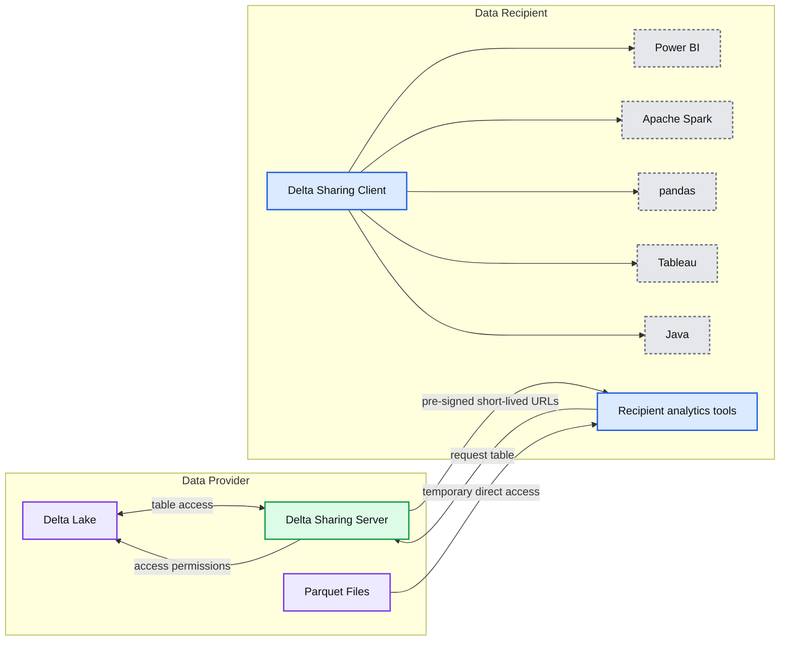

# Designing a Java Connector for Delta Sharing Recipient

- Source: https://www.databricks.com/blog/2022/06/29/designing-a-java-connector-for-delta-sharing-recipient.html
- Published: 2022-06-29
- Authors: Milos Colic, Vuong Nguyen
- Categories: engineering, open-source
- Images: 3 total, 2 extracted as architecture

## **Making an open data marketplace**

Stepping into this brave new digital world we are certain that data will be a central product for many organizations. The way to convey their knowledge and their assets will be through data and analytics. During the Data + AI Summit 2021, Databricks announced [Delta Sharing](https://www.databricks.com/blog/2021/05/26/introducing-delta-sharing-an-open-protocol-for-secure-data-sharing.html), the world’s first open protocol for secure and scalable real-time data sharing. This simple REST protocol can become a differentiating factor for your data consumers and the ecosystem you are building around your data products.

**Summary:** The diagram shows Delta Sharing data exchange between a cloud data provider and data recipients using temporary direct access to Parquet files.

**Components:**

- Data Provider
- Delta Lake
- Delta Sharing Server
- Parquet Files
- Data Recipient
- Recipient analytics tools
- Delta Sharing Client
- Power BI
- Apache Spark
- pandas
- Tableau
- Java

**Flows:**

- Delta Lake -> Delta Sharing Server: shared table metadata and access permissions
- Delta Sharing Server -> Delta Lake: table access
- Data Recipient -> Delta Sharing Server: request table
- Delta Sharing Server -> Data Recipient: pre-signed short-lived URLs
- Parquet Files -> Data Recipient: temporary direct file access
- Delta Sharing Client -> Power BI: shared data access
- Delta Sharing Client -> Apache Spark: shared data access
- Delta Sharing Client -> pandas: shared data access
- Delta Sharing Client -> Tableau: shared data access
- Delta Sharing Client -> Java: shared data access

**Numbers:** none

source image: https://www.databricks.com/wp-content/uploads/2022/06/db-6398-data_provider_diagram-img-1.png

While this protocol assumes that the data provider resides on the cloud, data recipients don’t need to be on the same cloud storage platform as the provider, or even in the cloud at all — sharing works across clouds and even from cloud to on-premise users. There are open-source connectors using Python native libraries like pandas and frameworks like Apache Spark™, and a wide array of partners that have built-in integration with Delta Sharing.

In this blog we want to clear the pathway for other clients to implement their own data consumers. How can we consume data supplied by Delta Sharing when there is no Apache Spark or Python? The answer is -- Java Connector for Delta Sharing!

## **A mesh beyond one cloud**

Why do we believe this connector is an important tool? For 3 main reasons:

- Firstly, it expands the ecosystem allowing Java and Scala-based solutions to integrate seamlessly with Delta Sharing protocol.
- Secondly, it is platform-agnostic, and works both on cloud and on-prem. The connector only requires the existence of the JVM and a local file system. That in effect means we can abstract ourselves from where our Java applications will be hosted. This greatly expands the reach of Delta Sharing protocol beyond Apache Spark and Python.
- Lastly, it introduces ideas and concepts on how connectors for other programming languages can be similarly developed. For example, an R native connector that would allow RStudio users to read data from Delta Sharing directly into their environment, or perhaps a low-level C++ Delta Sharing connector.

With the ever expanding ecosystem of digital applications and newly emerging programming languages these concepts are becoming increasingly important.

Delta Sharing protocol with its multiple connectors then has the potential to unlock the [data mesh architecture](https://www.k2view.com/what-is-data-mesh) in its truest form. A data mesh that spans across both clouds & on-prem, with mesh nodes being served where best fits the skill set of the user base and whose services best match the workloads’ demands, compliance and security constraints

With Delta Sharing for the first time ever we have a data sharing protocol that is truly open, not only open sourced, but also open to any hosting platform and programming language.

## **Paving the way to Supply chain 4.0**

Data exchange is a pervasive topic - it is weaved into the fabrics of basically every industry vertical out there. One example particularly comes to mind -- that of supply chain - the data is the new “precious metal” that needs transportation and invites derivation. Through data exchange and combination we can elevate each and every industry that operates both in physical and

McKinsey defines Industry 4.0 as digitization of the manufacturing sector, with embedded sensors in virtually all product components and manufacturing equipment, ubiquitous cyberphysical systems, and analysis of all relevant data. ([see more](https://www.mckinsey.com/~/media/McKinsey/Business%20Functions/Operations/Our%20Insights/Industry%2040%20How%20to%20navigate%20digitization%20of%20the%20manufacturing%20sector/Industry-40-How-to-navigate-digitization-of-the-manufacturing-sector.ashx#:~:text=To%20clarify%20terms%20at%20the,analysis%20of%20all%20relevant%20data.)) Reflecting on the aforementioned quote opens up a broad spectrum of topics. These topics are pertinent to the world that is transitioning from physical to digital problems. In this context data is the new gold, the data contains the knowledge of the past and the data holds the keys to the future, the data captures the patterns of the end users, the data captures the way your machinery and your workforce operate on a daily basis. In short - the data is critical and allencopasing.

A separate article by McKinsey defines supply chain 4.0 as: “Supply Chain 4.0 - the application of the Internet of Things, the use of advanced robotics, and the application of advanced analytics of big data in supply chain management: place sensors in everything, create networks everywhere, automate anything, and analyze everything to significantly improve performance and customer satisfaction.” ([see more](https://www.mckinsey.com/business-functions/operations/our-insights/supply-chain-40--the-next-generation-digital-supply-chain)) While McKinsey is approaching the topic from a very manufacturing cetric angle, we want to elevate the discussion - we argue that digitalization is a pervasive concept, it is a motion that all industry verticals are undergoing at the moment.

With the rise of digitalisation the data becomes an integral product in your supply chain -- it transcends your physical supply chain to a data supply chain. Data sharing is an essential component to drive business value as companies of all sizes look to securely exchange data with their customers, suppliers and partners ([see more](https://www.databricks.com/blog/2022/01/14/top-three-data-sharing-use-cases-with-delta-sharing.html)). We propose a new Delta Sharing Java connector that expands the ecosystem of data providers and data recipients, bringing together an ever expanding set of Java based systems.

## **A ubiquitous technology**

Why did we choose Java for this connector implementation? Java is ubiquitous, it is present both on and off the cloud. Java has become so pervasive that in 2017 there were more that 38 billion active Java Virtual Machines (JVM) and more than 21 billion cloud-connected JVMs ([source](https://www.oracle.com/java/moved-by-java/timeline/)). Berkeley Extension includes Java in their “Most in demand programming languages of 2022 “. Java is without a question one of the most important programming languages.

Another very important consideration is that Java is a foundation for Scala -- yet another very widely used programming language that brings the power of functional programming into the Java ecosystem. Building a connector in Java addresses two key user groups -- the Java programmers and the Scala programmers.

Lastly, Java is simple to set up and can run on practically any system: Linux, Windows, MacOS and even Solaris ([source](https://java.com/en/download/help/sysreq.html)). This means that we can abstract from the underlying compute, and focus on bringing the data to evermore data consumers. Whether we have an application server that needs to ingest remote data, or we have a BI platform that combines the data from several nodes in our Data Mesh it shouldn't matter. This is where our Java connector sits, bridging the ingestion between a whole range of destination solutions and a unified data sharing protocol.

## **Bring the data when your consumers are**

Java connector for Delta Sharing brings the data to your consumers both on and off the cloud. Given the pervasive nature of Java and the fact it can be easily installed on practically any computing platform, we can blur the edges of the cloud. We have designed our connector with these principles in mind.

**Summary:** High-level protocol showing a Java Connector reading Delta Sharing table metadata and Parquet data while reducing provider egress through a persisted cache.

**Components:**

- Delta Lake Table
- Delta Sharing Server
- Access permissions
- ADLS, S3, and GCS objects in Parquet format
- Java Connector
- Auth file
- Persisted Cache
- Cache refresh process

**Flows:**

- Delta Lake Table -> Delta Sharing Server: Shared table access
- Delta Sharing Server -> Java Connector: Read table metadata
- Java Connector -> Delta Sharing Server: Read table if metadata changed
- Java Connector -> Persisted Cache: Serve data via persisted cache
- Persisted Cache -> Java Connector: Cached data
- ADLS, S3, and GCS objects -> Persisted Cache: Direct access from cloud storage
- Cache refresh process -> ADLS, S3, and GCS objects: Refresh persisted cache when metadata changes

**Numbers:** 1, 2, 3, 4

```mermaid
%% Shows the Delta Sharing Java Connector protocol and persisted cache flow
flowchart LR
    table[Delta Lake Table]
    server[Delta Sharing Server]
    storage[ADLS S3 GCS Objects]
    connector[Java Connector]
    auth[Auth file]
    cache[Persisted Cache]
    refresh[Cache Refresh Process]

    table -->|Shared table access| server
    server -->|Read table metadata| connector
    connector -->|Read table if metadata changed| server
    connector -->|Serve data via persisted cache| cache
    cache -->|Cached data| connector
    storage -->|Direct access from cloud storage| cache
    refresh -->|Refresh cache when metadata changes| storage

    classDef client   fill:#dbeafe,stroke:#2563eb,stroke-width:2px,color:#111
    classDef service  fill:#dcfce7,stroke:#16a34a,stroke-width:2px,color:#111
    classDef store    fill:#ede9fe,stroke:#7c3aed,stroke-width:2px,color:#111
    classDef cache    fill:#fef3c7,stroke:#d97706,stroke-width:2px,color:#111
    classDef queue    fill:#cffafe,stroke:#0891b2,stroke-width:2px,color:#111
    classDef critical fill:#fee2e2,stroke:#dc2626,stroke-width:4px,color:#111
    classDef external fill:#e5e7eb,stroke:#6b7280,stroke-width:2px,color:#111,stroke-dasharray:4 3
    classDef decision fill:#fce7f3,stroke:#db2777,stroke-width:2px,color:#111

    class connector client
    class server,refresh service
    class table,storage store
    class cache cache
    class auth external
```

source image: https://www.databricks.com/wp-content/uploads/2022/06/db-6398-data_provider-img-3.png

The Java connector follows the Delta Sharing protocol to read shared tables from a Delta Sharing Server. To further reduce and limit egress costs on the Data Provider side, we implemented a persistent cache to reduce and limit the egress costs on the Data Provider side by removing any unnecessary reads.

1. The data is served to the connector via persisted cache to limit the egress costs whenever possible.
  1. Instead of keeping all table data in memory, we will use file stream readers to serve larger datasets even when there isn't enough memory available.
  2. Each table will have a dedicated file stream reader per part file that is held in the persistent cache. File stream readers allow us to read the data in blocks of records and we can process data with more flexibility.
  3. Data records are provided as a set of Avro GenericRecords that provide a good balance between the flexibility of representation and integrational capabilities. GenericRecords can easily be exported to JSON and/or other formats using EncoderFactory in Avro.
2. Every time the data access is requested the connector will check for the metadata updates and refresh the table data in case of any metadata changes.

 

  1. The connector requests the metadata for the table based on its coordinate from the provider. The table coordinate is the profile file path following with `#` and the fully qualified name of a table (..
).
  2. A lookup of table to metadata is maintained inside the JVM. The connector then compares the received metadata with the last metadata snapshot. If there is no change, then the existing table data is served from cache. Otherwise, the connector will refresh the table data in the cache.
3. When the metadata changes are detected both the data and the metadata will be updated.
4. The connector will request the pre-signed urls for the table defined by the fully qualified table name. The connector will only download the file whose metadata has changed and will store these files into the persisted cache location.

In the current implementation, the persistent cache is located in dedicated temporary locations that are destroyed when the JVM is shutdown. This is an important consideration since it avoids persisting orphaned data locally.

The connector expects the [profile files](https://github.com/delta-io/delta-sharing/blob/main/PROTOCOL.md#profile-file-format) to be provided as a JSON payload, which contains a user's credentials to access a Delta Sharing Server.

*Scala ProviderJSON definition*

*Java ProviderJSON definition*

We advise that you store and retrieve this from a secure location, such as a key vault.

Once we have the provider JSON we can easily instantiate our Java Connector using the DeltaSharingFactory instance.

*Scala Sharing Client definition*

*Java Sharing Client definition*

Finally, we can initialize a TableReader instance that will allow us to consume the data.

*Scala Table Reader definition*

*Java Table Reader definition*

*Output example of tableReader.read()*

In three easy steps we were able to request the data that was shared with us and consume it into our Java/Scala application. TableReader instance manages a collection of file stream readers and can be easily extended to integrate with a multithreading execution context to leverage parallelism.

*“Sharing is a wonderful thing, Especially to those you've shared with.” - Julie Hebert, When We Share*

Try out the Java connector for Delta Sharing to accelerate your data sharing applications and [contact us](https://www.databricks.com/company/contact) to learn more about how we assist customers with similar use cases.

- Delta Sharing Java Connector is available as a [Databricks Labs](https://www.databricks.com/learn/labs) repository [here](https://github.com/databrickslabs/delta-sharing-java-connector).
- Detailed documentation is available [here](https://databrickslabs.github.io/delta-sharing-java-connector/).
- You can access the latest artifacts and binaries following the instructions provided [here](https://github.com/databrickslabs/delta-sharing-java-connector/blob/main/README.md).
