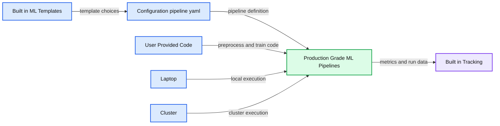
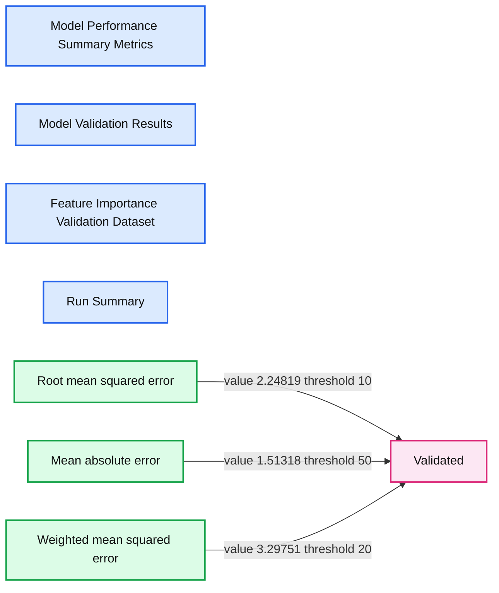

# Introducing MLflow Pipelines with MLflow 2.0

*Create production-grade ML workflows to automate and scale your MLOps process*

- Source: https://www.databricks.com/blog/2022/06/29/introducing-mlflow-pipelines-with-mlflow-2-0.html
- Published: 2022-06-29
- Authors: Ahmed Bilal, Jin Zhang, Corey Zumar, Xiangrui Meng
- Categories: engineering, data-science-machine-learning
- Images: 3 total, 2 extracted as architecture

Since we launched MLflow in 2018, MLflow has become the most popular MLOps framework, with over 11M monthly downloads! Today, teams of all sizes use MLflow to track, package, and deploy models. However, as demand for ML applications grows, teams need to develop and deploy models at scale. We are excited to announce that MLflow 2.0 is coming soon and will include MLflow Pipelines, making it simple for teams to automate and scale their ML development by building production-grade ML pipelines.

## **Challenges with operationalizing ML**

When deploying models, you need to do much more than just training them. You need to ingest and validate data, run and track experiment trials, and package, validate and deploy models. You also need to test models on live production data and monitor deployed models. Finally, you need to manage and update your models in production when new data comes in or conditions change.

You might get away with a manual process when managing a single model. But, when managing multiple models in production or even supporting a single model that needs to be frequently updated, you need to codify the process and deploy the workflow into production. That means you need to create a workflow that 1) includes all the ML processes listed above and 2) meets the requirements common to all production code, such as modularity, scalability, and testability. With all this work required to transition from exploration to production, teams are finding it hard to reliably and quickly implement ML systems in production.

## **MLflow Pipelines**

MLflow Pipelines provides a standardized framework for creating production-grade ML pipelines that combine modular ML code with software engineering best practices to make model deployment fast and scalable. With MLflow Pipelines, you can bootstrap ML projects, perform rapid iteration with ease and deploy pipelines into production while following DevOps best practices.

MLflow Pipelines introduces the following core components in MLflow:

- **Pipeline**: Each pipeline consists of steps and a blueprint for how those steps are connected to perform end-to-end machine learning operations, such as training a model or applying batch inference. A pipeline breaks down the complex MLOps process into multiple steps that each team can work on independently.
- **Steps**: Steps are manageable components that perform a single task, such as data ingestion or feature transformation. These tasks are often performed at different cadences during model development. Steps are connected through a well-defined interface to create a pipeline and can be reused across multiple pipelines. Steps can be customized through YAML configuration or through Python code.
- **Pipeline templates**: Pipeline templates provide an opinionated approach to solve distinct ML problems or operations, such as regression, classification, or batch inference. Each template includes a pre-defined pipeline with standard steps. MLflow provides built-in templates for common ML problems, and teams can create new pipeline templates to fit custom needs.

You can use the above pipeline components to codify your MLOps process, automate it and share it within your organization. By standardizing your MLOps process, you accelerate model deployment and scale ML to more use cases.
 Automating and Scaling MLOps with MLflow Pipelines

**Summary:** MLflow Pipelines combines built-in ML templates, configuration, and user-provided code to produce portable production-grade pipelines with built-in tracking for laptop and cluster environments.

**Components:**

- Built-in ML Templates: MLflow Pipelines templates for regression, classification, and recommendation.
- Configuration: `pipeline.yaml` defining template, data, target column, and pipeline steps.
- User-Provided Code: `preprocess.py` and `train.py`.
- Production-Grade ML Pipelines: Portable pipelines with built-in tracking.
- Laptop: Local pipeline execution environment.
- Cluster: Cloud or distributed pipeline execution environment.
- Built-in Tracking: MLflow tracking integrated into pipeline execution.

**Flows:**

- Built-in ML Templates -> Configuration: Template selection and pipeline settings.
- Configuration -> Production-Grade ML Pipelines: Configured pipeline definition.
- User-Provided Code -> Production-Grade ML Pipelines: Preprocessing and training logic.
- Laptop -> Production-Grade ML Pipelines: Local execution.
- Cluster -> Production-Grade ML Pipelines: Cluster execution.
- Production-Grade ML Pipelines -> Built-in Tracking: Metrics and run information.

**Numbers:** MLflow 2.0, regression/v1, split ratios 0.5, 0.25, 0.25

source image: https://www.databricks.com/wp-content/uploads/2022/06/mlppng.png

## **Automating and Scaling MLOps with MLflow Pipelines**

### **Standardize and accelerate the path to production ML**

MLflow Pipelines enable the Data Science team to create production-grade ML code that is deployable with little or no refactoring. It brings software engineering principles of modularity, testability, reproducibility, and code-config separation to machine learning while keeping the code accessible to the Data Science team. Pipelines also guarantee reproducibility across environments, producing consistent results on your laptop, Databricks, or other cloud environments. Importantly, the uniform project structure, modular code and standardized interfaces enable the Production team to easily integrate enterprise mechanisms for code deployments with the ML workflow. This enables organizations to empower Data Science teams to deploy ML pipelines following enterprise practices for production code deployment.

### **Focus on machine learning, skip the boilerplate code**

MLflow Pipelines provides templates that make it easy to bootstrap and build ML pipelines for common ML problems. The templates scaffold a pipeline with a predefined graph and a boilerplate code. You can then customize the individual steps using YAML configuration or by providing Python code. Each step also comes with an auto-generated step card that provides out-of-the-box visualizations that can help with debugging and troubleshooting, such as feature importance plots and highlighting observations that have large prediction errors. You can also create custom templates and share them within your enterprise.

**Summary:** Model validation results table showing three metrics, their values, thresholds, and validation status.

**Components:**

- Model Performance Summary Metrics tab
- Model Validation Results tab
- Feature Importance Validation Dataset tab
- Run Summary tab
- Validation results table
- Root mean squared error metric
- Mean absolute error metric
- Weighted mean squared error metric

**Flows:**

- Root mean squared error -> Validation status: compares value 2.24819 against threshold 10
- Mean absolute error -> Validation status: compares value 1.51318 against threshold 50
- Weighted mean squared error -> Validation status: compares value 3.29751 against threshold 20

**Numbers:** 0, 2.24819, 10, 1.51318, 50, 3.29751, 20

source image: https://www.databricks.com/wp-content/uploads/2022/06/step_card.png

### **Fast and efficient iterative development **

MLflow Pipelines accelerates model development by memorizing steps and only rerunning parts of the pipeline that are really needed. When training models, you have to run multiple experiments to test different model types or hyperparameters, with each experiment often only slightly different from another one. Running the full training pipeline every time for each experiment wastes time and compute resources. MLflow Pipelines automatically detects unchanged steps and reuses their outputs from the previous run, making experimentation faster and more efficient.

### **Same great MLflow tracking, now at the workflow level**

MLflow automatically tracks the metadata of each pipeline execution, including MLflow run, models, step outputs, code and config snapshot. MLflow also tracks the git commit of the template repo when a pipeline is executed. You can quickly see previous runs, compare results and reproduce a past result as needed.

### **Announcing the first release of MLflow Pipelines**

Today we are excited to announce the first iteration of MLflow Pipelines that offers a production-grade template for developing high-quality regression models. With the template, you get a scaffolded regression pipeline with pre-defined steps and boilerplate code. You can then customize individual steps–like data transforms or model training –and rapidly execute the pipeline locally or in the cloud.

## **Getting started with MLflow Pipelines**

Ready to get started or try it out for yourself? You can read more about MLflow Pipelines and how to use them in the [MLflow repo](https://github.com/mlflow/mlp-regression-template) or listen to the [Data+AI Summit 2022 talks on MLflow Pipelines](https://www.databricks.com/dataaisummit/session/mlflow-pipelines-accelerating-mlops-development-production). We are developing MLflow Pipelines as a core component of the open-source MLflow project and will encourage you to [provide feedback](https://github.com/mlflow/mlflow/discussions) to help us make it better.

Join the conversation in the [Databricks Community](https://community.databricks.com/s/topic/0TO8Y000000VJEhWAO/summit22) where data-obsessed peers are chatting about Data + AI Summit 2022 announcements and updates. Learn. Network. Celebrate.
