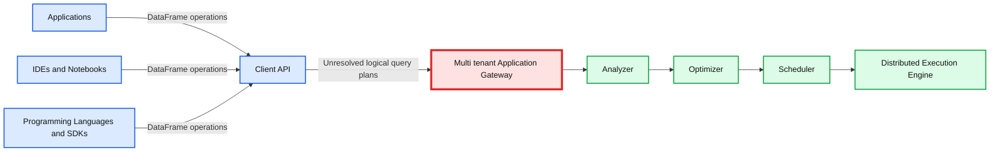
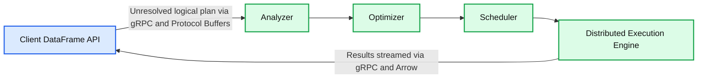

# Introducing Spark Connect - The Power of Apache Spark, Everywhere

- Source: https://www.databricks.com/blog/2022/07/07/introducing-spark-connect-the-power-of-apache-spark-everywhere.html
- Published: 2022-07-07
- Authors: Stefania Leone, Martin Grund, Herman van Hövell, Reynold Xin
- Categories: engineering, open-source
- Images: 3 total, 3 extracted as architecture

At last week's Data and AI Summit, we [highlighted](https://www.databricks.com/dataaisummit/session/day-1-opening-keynote) a new project called Spark Connect in the opening keynote. This blog post walks through the project's motivation, high-level proposal, and next steps.

Spark Connect introduces a decoupled client-server architecture for Apache Spark that allows remote connectivity to Spark clusters using the DataFrame API and unresolved logical plans as the protocol. The separation between client and server allows Spark and its open ecosystem to be leveraged from everywhere. It can be embedded in modern data applications, in IDEs, Notebooks and programming languages.

**Motivation**

Over the past decade, developers, researchers, and the community at large have successfully built tens of thousands of data applications using Spark. During this time, use cases and requirements of modern data applications have evolved. Today, every application, from web services that run in application servers, interactive environments such as notebooks and IDEs, to edge devices such as smart home devices, wants to leverage the power of data.

Spark's driver architecture is monolithic, running client applications on top of a scheduler, optimizer and analyzer. This architecture makes it hard to address these new requirements: there is no built-in capability to remotely connect to a Spark cluster from languages other than SQL. The current architecture and APIs require applications to run close to the REPL, i.e., on the driver, and thus do not cater to interactive data exploration, as is commonly done with [notebooks](https://docs.databricks.com/notebooks/index.html), or allow for building out the rich developer experience common in modern IDEs. Finally, programming languages without JVM interoperability cannot leverage Spark today.

*Spark's monolithic driver poses several challenges*

**Summary:** The diagram shows applications, IDEs, notebooks, and programming language SDKs constrained by Spark’s monolithic driver architecture.

**Components:**

- Modern data application in the Applications layer
- Jupyter and PyCharm in the IDEs and Notebooks layer
- Go, R, and Python in the Programming Languages and SDKs layer
- SQL only interface
- Close to REPL requirement
- No JVM Interop limitation
- Spark’s Monolith Driver containing Application Logic, Analyzer, Optimizer, Scheduler, and Distributed Execution Engine

**Flows:**

- Modern data application -> Spark’s Monolith Driver: application access constrained by SQL only
- Jupyter and PyCharm -> Spark’s Monolith Driver: interaction constrained to being close to the REPL
- Go, R, and Python -> Spark’s Monolith Driver: access limited by lack of JVM interoperation

**Numbers:** none

source image: https://www.databricks.com/wp-content/uploads/2022/07/db-254-blog-img-1.png

```mermaid
%% Shows clients and language SDKs constrained by Spark monolithic driver architecture
flowchart LR
    A[Modern data application]
    B[Jupyter and PyCharm]
    C[Go R and Python]
    D[SQL only]
    E[Close to REPL]
    F[No JVM Interop]
    G[Spark monolith driver]
    H[Application Logic]
    I[Analyzer]
    J[Optimizer]
    K[Scheduler]
    L[Distributed Execution Engine]
    M[Architecture challenges]

    A -->|constrained by| D
    B -->|constrained by| E
    C -->|limited by| F
    D -->|challenge| M
    E -->|challenge| M
    F -->|challenge| M
    M -->|impacts| G
    G --> H
    H --> I
    I --> J
    J --> K
    K --> L

    classDef client fill:#dbeafe,stroke:#2563eb,stroke-width:2px,color:#111
    classDef service fill:#dcfce7,stroke:#16a34a,stroke-width:2px,color:#111
    classDef store fill:#ede9fe,stroke:#7c3aed,stroke-width:2px,color:#111
    classDef cache fill:#fef3c7,stroke:#d97706,stroke-width:2px,color:#111
    classDef queue fill:#cffafe,stroke:#0891b2,stroke-width:2px,color:#111
    classDef critical fill:#fee2e2,stroke:#dc2626,stroke-width:4px,color:#111
    classDef external fill:#e5e7eb,stroke:#6b7280,stroke-width:2px,color:#111,stroke-dasharray:4 3
    classDef decision fill:#fce7f3,stroke:#db2777,stroke-width:2px,color:#111

    class A,B,C client
    class D,E,F decision
    class G,M critical
    class H,I,J,K,L service
```

Spark's monolithic driver poses several challenges

Additionally, Spark's monolithic driver architecture also leads to operational problems:

- **Stability:** Since all applications run directly on the driver, users can cause critical exceptions (e.g. out of memory) which may bring the cluster down for all users.
- **Upgradability:** the current entangling of the platform and client APIs (e.g., first and third-party dependencies in the classpath) does not allow for seamless upgrades between Spark versions, hindering new feature adoption.
- **Debuggability and observability:** The user may not have the correct security permission to attach to the main Spark process and debugging the JVM process itself lifts all security boundaries put in place by Spark. In addition, detailed logs and metrics are not easily accessible directly in the application.

## How Spark Connect works

To overcome all of these challenges, we introduce Spark Connect, a decoupled client-server architecture for Spark.

The client API is designed to be thin, so that it can be embedded everywhere: in application servers, IDEs, notebooks, and programming languages. The Spark Connect API builds on Spark's well-known and loved DataFrame API using unresolved logical plans as a language-agnostic protocol between the client and the Spark driver.

*Spark Connect provides a Client API for Spark*

**Summary:** Spark Connect embeds a thin Client API between applications, development environments, and SDKs and Spark’s Driver components.

**Components:**

- Applications with modern data applications
- IDEs and Notebooks with Jupyter and PyCharm
- Programming Languages and SDKs with Go, R, and Python
- Client API
- Spark’s Driver
- Multi-tenant Application Gateway
- Analyzer
- Optimizer
- Scheduler
- Distributed Execution Engine

**Flows:**

- Applications -> Client API: DataFrame operations
- IDEs and Notebooks -> Client API: DataFrame operations
- Programming Languages and SDKs -> Client API: DataFrame operations
- Client API -> Spark’s Driver: Unresolved logical query plans

**Numbers:** none

source image: https://www.databricks.com/wp-content/uploads/2022/07/db-254-blog-img-2.png

Spark Connect provides a Client API for Spark

The Spark Connect client translates DataFrame operations into unresolved logical query plans which are encoded using protocol buffers. These are sent to the server using the gRPC framework. In the example *below*, a sequence of dataframe operations (*project, sort, limit*) on the *logs* table is translated into a logical plan and sent to the server.

*Processing Spark Connect operations in Spark*

**Summary:** Spark Connect translates client DataFrame operations into an unresolved logical plan, sends it to a Spark Server, and streams results back after distributed execution.

**Components:**

- Client using the Spark Connect DataFrame API
- Logical parse plan containing limit, sort, project, and unresolved table operations
- Spark Server using the Analyzer
- Spark Server using the Optimizer
- Spark Server using the Scheduler
- Spark Server using the Distributed Execution Engine
- gRPC with Protocol Buffers for client to server communication
- gRPC with Arrow for server to client results

**Flows:**

- Client -> Spark Server: Unresolved logical plan via gRPC and Protocol Buffers
- Spark Server -> Client: Results streamed via gRPC and Arrow

**Numbers:** 10

source image: https://www.databricks.com/wp-content/uploads/2022/07/db-254-blog-img-3.png

Processing Spark Connect operations in Spark

The Spark Connect endpoint embedded on the Spark Server, receives and translates unresolved logical plans into Spark's logical plan operators. This is similar to parsing a SQL query, where attributes and relations are parsed and an initial parse plan is built. From there, the standard Spark execution process kicks in, ensuring that Spark Connect leverages all of Spark's optimizations and enhancements. Results are streamed back to the client via gRPC as Apache Arrow-encoded row batches.

## Overcoming multi-tenant operational issues

With this new architecture, Spark Connect mitigates today's operational issues:

- **Stability:** Applications that use too much memory will now only impact their own environment as they can run in their own processes. Users can define their own dependencies on the client and don't need to worry about potential conflicts with the Spark driver.
- **Upgradability:** Spark driver can now seamlessly be upgraded independently of applications, e.g. to benefit from performance improvements and security fixes. This means applications can be forward-compatible, as long as the server-side RPC definitions are designed to be backwards compatible.
- **Debuggability and Observability:** Spark Connect enables interactive debugging during development directly from your favorite IDE. Similarly, applications can be monitored using the application's framework native metrics and logging libraries.

### Next Steps

The Spark Improvement Process [proposal](https://issues.apache.org/jira/browse/SPARK-39375) was [voted](https://lists.apache.org/thread/smpwykpoqr0y5r5xgc9jpt1fjm72fvck) on and accepted by the community. We plan to work with the community to make Spark Connect available as an experimental API in one of the upcoming Apache Spark releases.

Our initial focus will be on providing DataFrame API coverage for PySpark to make the transition to this new API seamless. However, Spark Connect is a great opportunity for Spark to become more ubiquitous in other programming language communities and we're looking forward to seeing contributions of bringing Spark Connect clients to other languages.

We look forward to working with the rest of the Apache Spark community to develop this project. If you want to follow the development of Spark Connect in Apache Spark make sure to follow the [dev@spark.apache.org](mailto:dev@spark.apache.org) mailing list or submit your interest using [this form](https://forms.gle/6uwExG3JMsP6aK9o7).
