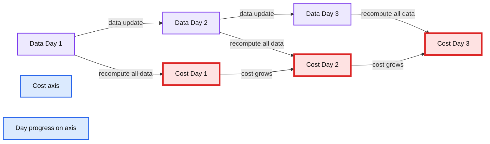
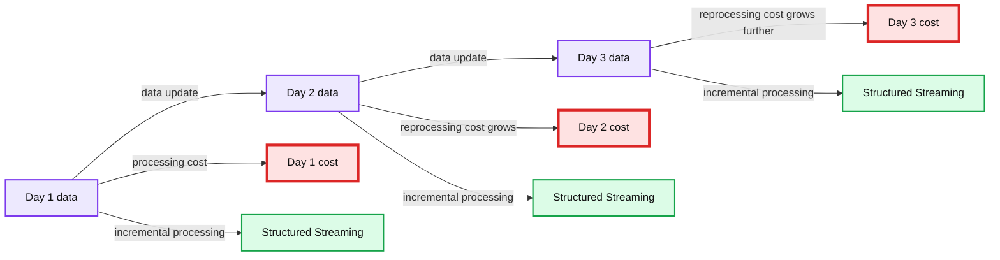
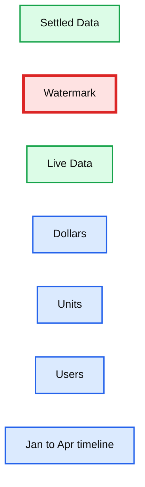

# Using Spark Structured Streaming to Scale Your Analytics

- Source: https://www.databricks.com/blog/2022/07/14/using-spark-structured-streaming-to-scale-your-analytics.html
- Published: 2022-07-14
- Authors: Spencer Elkington, Ben Tallman
- Categories: data-streaming, company, customers
- Images: 4 total, 3 extracted as architecture

This is a guest post from the [M Science](https://mscience.com/) Data Science & Engineering Team.

## Modern data doesn't stop growing

>  "Engineers are taught by life experience that doing something quick and doing something right are mutually exclusive! With Structured Streaming from Databricks, M Science gets both speed and accuracy from our analytics platform, without the need to rebuild our infrastructure from scratch every time." - Ben Tallman, CTO

Let's say that you, a "humble data plumber" of the Big Data era and have been tasked to create an analytics solution for an [online retail dataset](https://github.com/databricks/Spark-The-Definitive-Guide/blob/master/data/retail-data/all/online-retail-dataset.csv):

| Invoice No | Stock Code | Description | Quantity | Invoice Date | Unit Price | Customer ID | Country |
|---|---|---|---|---|---|---|---|
| 536365 | 85123A | WHITE HANGING HEA | 6 | 2012-01-10 | 2.55 | 17850 | United Kingdom |
| 536365 | 71053 | WHITE METAL LANTERN | 6 | 2012-01-10 | 3.39 | 17850 | United Kingdom |
| 536365 | 84406B | CREAM CUPID HEART | 8 | 2012-01-10 | 2.75 | 17850 | United Kingdom |
| … | … | … | … | … | … | … | … |

The analysis you've been asked for is simple - an aggregation of the number of dollars, units sold, and unique users for each day, and across each stock code. With just a few lines of PySpark, we can transform our raw data into a usable aggregate:

`With your new aggregated data, you can throw together a nice visualization to do... *business things.*`

This works - right?

An ETL process will work great for a static analysis where you don't expect the data to ever be updated - you assume the data you have now will be the only data you ever have. The problem with a static analysis?

 

**Modern data doesn't stop growing**

 

What are you going to do when you get more data?

The naive answer would be to just run that same code every day, but you'd re-process all the data every time you run the code, and each new update means re-processing data you've already processed before. When your data gets big enough, you'll be doubling down on what you spend in time and compute costs.

**Summary:** The chart shows that re-computing all data causes processing costs to grow as data updates accumulate over successive days.

**Components:**

- Data for Day 1
- Cost for Day 1
- Data for Day 2
- Cost for Day 2
- Data for Day 3
- Cost for Day 3
- Data update indicators
- Cost axis
- Day progression axis

**Flows:**

- Day 1 -> Day 2: additional data update and recomputation
- Day 2 -> Day 3: additional data update and recomputation
- Data -> Cost: re-computing all data increases cost

**Numbers:** 1, 2, 3; Day 1, Day 2, Day 3

source image: https://www.databricks.com/wp-content/uploads/2022/07/db-176-blog-img-2.jpg

With static analysis, you spend money on re-processing data you've already processed before.

There are very few modern data sources that aren't going to be updated. If you want to keep your analytics growing with your data source and save yourself a fortune on compute cost, you'll need a better solution.

## What do we do when our data grows?

In the past few years, the term "Big Data" has become... lacking. As the sheer volume of data has grown and more of life has moved online, the era of Big Data has become the era of "Help Us, It Just Won't Stop Getting Bigger Data." A good data source doesn't stop growing while you work; this growth can make keeping data products up-to-date a monumental task.

At [M Science](https://www.mscience.com/), our mission is to use alternative data - data outside of your typical quarterly report or stock trend data sources - to analyze, refine, and predict change in the market and economy.

Every day, our analysts and engineers face a challenge: alternative data grows really fast. I'd even go as far to say that, if our data ever stops growing, something in the economy has gone very, very wrong.

As our data grows, our analytics solutions need to handle that growth. Not only do we need to account for growth, but we also need to account for data that may come in late or out-of-order. This is a vital part of our mission - every new batch of data could be the batch that signals a dramatic change in the economy.

To make scalable solutions to the analytics products that [M Science](https://www.mscience.com/) analysts and clients depend on every day, we use Databricks Structured Streaming, an Apache Spark™ API for scalable and fault-tolerant stream processing built on the Spark SQL engine with the Databricks Lakehouse Platform. Structured Streaming assures us that, as our data grows, our solutions will also scale.

## Using Spark Structured Streaming

Structured Streaming comes into play when new batches of data are being introduced into your data sources. Structured Streaming leverages [Delta Lake's ability to track changes in your data](https://www.databricks.com/product/delta-lake-on-databricks?utm_medium=cpc&utm_source=google&utm_campaign=14270641620&utm_offer=product_delta-lake-on-databricks&utm_content=delta&utm_term=delta%20databricks&utm_ad_group_c=CTX-Delta-Core-P&gclid=Cj0KCQjwkIGKBhCxARIsAINMioKY7YUppXgeo1abMFo6kC20pkSg8WXLFYAGiRfLuh67ERh3a1bFQEMaAnDkEALw_wcB) to determine what data is part of an update and re-computes only the parts of your analysis that are affected by the new data.

It's important to re-frame how you think about streaming data. For many people, "streaming" means real-time data - streaming a movie, checking Twitter, checking the weather, et cetera. If you're an analyst, engineer, or scientist, any data that gets updated is a stream. The frequency of the update doesn't matter. It could be seconds, hours, days, or even months - if the data gets updated, the data is a stream. If the data is a stream, then Structured Streaming will save you a lot of headaches.

**Summary:** The chart compares growing data reprocessing costs with Structured Streaming costs across Days 1, 2, and 3.

**Components:**

- Data, shown as gray bars with a database icon
- Cost, shown as green bars with a dollar sign
- Structured Streaming, shown as green incremental cost bars
- Data update, shown as upward arrows
- Day 1, Day 2, and Day 3 comparison points

**Flows:**

- Data -> Data update: Previous data grows as new data arrives
- Data update -> Data: Updated data increases the total data volume
- Data update -> Cost: Reprocessing previous data increases cost
- Data update -> Structured Streaming: Incremental processing keeps cost relatively low

**Numbers:** Day 1, Day 2, Day 3

source image: https://www.databricks.com/wp-content/uploads/2022/07/db-176-blog-img-3.jpg

With Structured Streaming, you can avoid the cost of re-processing previous data

---

Let's step back into our hypothetical - you have an aggregate analysis that you need to deliver today and keep updating as new data rolls in. This time, we have the `DeliveryDate` column to remind us of the futility of our previous single-shot analysis:

| Invoice No | Stock Code | Description | Quantity | Invoice Date | Delivery Date | Unit Price | Customer ID | Country |
|---|---|---|---|---|---|---|---|---|
| 536365 | 85123A | WHITE HANGING HEA | 6 | 2012-01-10 | 2012-01-17 | 2.55 | 17850 | United Kingdom |
| 536365 | 71053 | WHITE METAL LANTERN | 6 | 2012-01-10 | 2012-01-15 | 3.39 | 17850 | United Kingdom |
| 536365 | 84406B | CREAM CUPID HEART | 8 | 2012-01-10 | 2012-01-16 | 2.75 | 17850 | United Kingdom |
| … | … | … | … | … | … | … | … | … |

Thankfully, the interface for Structured Streaming is incredibly similar to your original PySpark snippet. Here is your original static batch analysis code:

With just a few tweaks, we can adjust this to leverage Structured Streaming. To convert your previous code, you'll:

1. Read our input table as a **stream** instead of a static batch of data
2. Make a directory in your file system where **checkpoints** will be stored
3. Set a **watermark** to establish a boundary for how late data can arrive before it is ignored in the analysis
4. Modify some of your transformations to keep the saved checkpoint state from getting too large
5. Write your final analysis table as a stream that incrementally processes the input data

We'll apply these tweaks, run through each change, and give you a few options for how to configure the behavior of your stream.

Here is the `‚"stream-ified"‚` version of your old code:

Let's run through each of the tweaks we made to get Structured Streaming working:

1. [**Stream from a Delta Table**](https://docs.databricks.com/delta/delta-streaming.html#delta-table-as-a-source)

Of all of Delta tables' nifty features, this may be the niftiest: **You can treat them like a stream**. Because [Delta keeps track of updates](https://docs.databricks.com/delta/delta-streaming.html#delta-table-as-a-source), you can use `.readStream.table()` to stream new updates each time you run the process.

It's important to note that your input table **must** be a Delta table for this to work. It's possible to stream other data formats with different methods, but `.readStream.table()` **requires** a Delta table

2. [**Declare a checkpoint location**](https://spark.apache.org/docs/latest/streaming-programming-guide.html#checkpointing)

In Structured Streaming-jargon, the aggregation in this analysis is a [stateful transformation](https://spark.apache.org/docs/latest/streaming-programming-guide.html#checkpointing). Without getting too far in the weeds, Structured Streaming saves out the state of the aggregation as a **checkpoint** every time the analysis is updated.

This is what saves you a fortune in compute cost: instead of re-processing *all* the data from scratch every time, updates simply pick up where the last update left off.

3. [**Define a watermark**](https://spark.apache.org/docs/latest/structured-streaming-programming-guide.html#handling-late-data-and-watermarking)

When you get new data, there's a good chance that you may receive data out-of-order. **Watermarking** your data lets you define a cutoff for how far back aggregates can be updated. In a sense, **it creates a boundary between "live" and "settled" data.**

To illustrate: let's say this data product contains data up to the 7th of the month. We've set our watermark to 7 days. This means **aggregates from the 7th to the 1st are still "live"**. New updates could change aggregates from the 1st to the 7th, but any new data that lagged behind more than 7 days won't be included in the update - **aggregates prior to the 1st are "settled",** and updates for that period are ignored.

**Summary:** The chart shows settled historical data separated from live data by a watermark cutoff, with tracked metrics for dollars, units, and users.

**Components:**

- Settled Data - technology not specified
- Watermark - technology not specified
- Live Data - technology not specified
- Dollars - metric, technology not specified
- Units - metric, technology not specified
- Users - metric, technology not specified
- Time axis - months from Jan through Apr

**Flows:**

- none visible

**Numbers:** none

source image: https://www.databricks.com/wp-content/uploads/2022/07/db-176-blog-img-4.jpg

*New data that falls outside of the watermark is not incorporated into the analysis.*

It's important to note that the column you use to watermark must be either a Timestamp or a Window.

4. [**Use Structured Streaming-compatible transformations**](https://docs.databricks.com/delta/delta-streaming.html#delta-table-as-a-sink)

In order to keep your checkpoint states from ballooning, you may need to replace some of your transformations with more storage-efficient alternatives. For a column that may contain lots of unique individual values, the `approx_count_distinct` function will get you results within a defined relative standard deviation.

5. [**Create the output stream**](https://docs.databricks.com/delta/delta-streaming.html#delta-table-as-a-sink)

The final step is to output the analysis into a Delta table. With this comes a few options that determine how your stream will behave:

- `.outputMode("update")` configures the stream so that the aggregation will pick up where it left off each time the code runs instead of running from scratch. To re-do an aggregation from scratch, you can use `"complete"` - in effect, doing a traditional batch aggregate while still preserving the aggregation state for a future `"update"` run.
- `trigger(once = True)` will trigger the query once, when the line of output code is started, and then stop the query once all of the new data has been processed.
- `"checkpointLocation"` lets the program know where checkpoints should be stored.

These configuration options make the stream behave most closely like the original one-shot solution.

This all comes together to create a scalable solution to your growing data. If new data is added to your source, your analysis will take into account the new data without costing an arm and a leg.

---

You'd be hard pressed to find any context where data isn't going to be updated at some point. It's a soft agreement that data analysts, engineers, and scientists make when we work with modern data - it's going to grow, and we have to find ways to handle that growth.

With Spark Structured Streaming, we can use the latest and greatest data to deliver the best products, without the headaches that come with scale.
