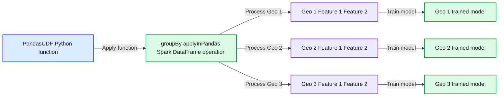
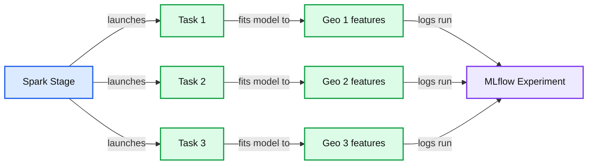
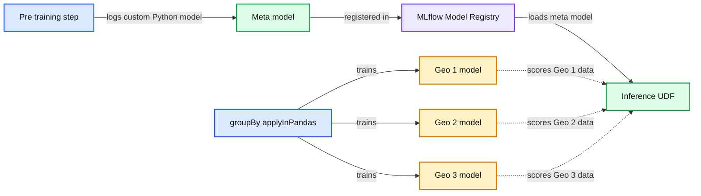

# Parallel ML: How Compass Built a Framework for Training Many Machine Learning Models on Databricks

- Source: https://www.databricks.com/blog/2022/07/20/parallel-ml-how-compass-built-a-framework-for-training-many-machine-learning-models-on-databricks.html
- Published: 2022-07-20
- Authors: Marshall Carter, Sujoy Dutta
- Categories: engineering, solution-accelerators, uncategorized
- Images: 4 total, 4 extracted as architecture

This is a collaborative post from Databricks and [Compass](https://www.compass.com/). We thank Sujoy Dutta, Senior Machine Learning Engineer at Compass, for his contributions.

 
 As a global real estate company, Compass processes massive volumes of demographic and economic data to monitor the housing market across many geographic locations. Analyzing and modeling differing regional trends requires parallel processing methods that can efficiently apply complex analytics at geographic levels.

In particular, machine learning model development and inference are complex. Rather than training a single model, dozens or hundreds of models may need to be trained. Sequentially training models extends the overall training time and hinders interactive experimentation.

Compass' first foray into parallel feature engineering and model training and inference was built on a Kubernetes cluster architecture leveraging Kubeflow. The additional complexity and technical overhead was substantial. Modifying workloads on Kubeflow was a multistep and tedious process that hampered the team's ability to iterate. There was also considerable time and effort required to maintain the Kubernetes cluster that was better suited to a specialized devops division and detracted from the team's core responsibility of building the best predictive models. Lastly, sharing and collaboration were limited because the Kubernetes approach was a niche workflow specific to the data science group, rather than an enterprise standard.

In researching other workflow options, Compass tested an approach based on the [Databricks Lakehouse Platform.](https://www.databricks.com/glossary/data-lakehouse) The approach leverages a simple-to-deploy Apache Spark™ computing cluster to distribute feature engineering and training and inference of XGBoost models at dozens of geographic levels. Challenges experienced with Kubernetes were mitigated. Databricks clusters were easy to deploy and thus did not require management by a specialized team. Model training were easily triggered, and Databricks provided a powerful, interactive and collaborative platform for exploratory data analysis and model experimentation. Furthermore, as an enterprise standard platform for data engineering, data science, and business analytics, code and data became easily shareable and re-usable across divisions at Compass.

The Databricks-based modeling approach was a success and is currently running in production. The workflow leverages built-in Databricks features: the [Machine Learning Runtime](https://docs.databricks.com/runtime/mlruntime.html), [Clusters](https://docs.databricks.com/clusters/index.html), [Jobs](https://docs.databricks.com/data-engineering/jobs/jobs.html), and [MLflow](https://docs.databricks.com/applications/mlflow/index.html). The solution can be applied to any problem requiring parallel model training and inference at different data grains, such as a geographic, [product](https://www.databricks.com/blog/2021/04/06/fine-grained-time-series-forecasting-at-scale-with-facebook-prophet-and-apache-spark-updated-for-spark-3.html), or time-period level.

An overview of the approach is documented below and the attached, self-contained Databricks notebook includes an example implementation.

## The approach

The parallel model training and inference workflow is [based on Pandas UDFs](https://docs.databricks.com/spark/latest/spark-sql/pandas-function-apis.html). Pandas UDFs provide an efficient way to apply Python functions to Spark Dataframes. They can receive a Pandas DataFrame as input, perform some computation, and return a Pandas DataFrame. There are multiple ways of applying a PandasUDF to a Spark DataFrame; we leverage the groupBy.applyInPandas method.

The groupBy.applyInPandas method applies an instance of a PandasUDF separately to each groupBy column of a Spark DataFrame; it allows us to process features related to each group in parallel.

*Training models in parallel on different groups of data*

**Summary:** PandasUDF is applied separately to each geographic group, training one model per group in parallel.

**Components:**

- PandasUDF, a Python function
- groupBy().applyInPandas, a Spark DataFrame operation
- Geo 1 feature dataset
- Geo 2 feature dataset
- Geo 3 feature dataset
- Geo 1 trained model
- Geo 2 trained model
- Geo 3 trained model

**Flows:**

- PandasUDF -> groupBy().applyInPandas: Python function
- groupBy().applyInPandas -> Geo 1 feature dataset: Applies function to Geo 1
- groupBy().applyInPandas -> Geo 2 feature dataset: Applies function to Geo 2
- groupBy().applyInPandas -> Geo 3 feature dataset: Applies function to Geo 3
- Geo 1 feature dataset -> Geo 1 trained model: Trains model
- Geo 2 feature dataset -> Geo 2 trained model: Trains model
- Geo 3 feature dataset -> Geo 3 trained model: Trains model

**Numbers:** 1, 2, 3, Feature 1, Feature 2

source image: https://www.databricks.com/wp-content/uploads/2022/07/db-58-blog-img-1.png

Training models in parallel on different groups of data

Our PandasUDF trains an XGBoost model as part of a scikit-learn pipeline. The UDF also performs hyper-parameter tuning using [Hyperopt](https://docs.databricks.com/applications/machine-learning/automl-hyperparam-tuning/index.html), a framework built into the Machine Learning Runtime, and logs fitted models and other artifacts to a single [MLflow Experiment run](https://docs.databricks.com/applications/mlflow/tracking.html#experiments).

After training, our experiment run contains separate folders for each model trained by our UDF. In the chart below, applying the UDF to a Spark DataFrame with three distinct groups trains and logs three separate models.

As part of a training run, we also log a single, [custom MLflow pyfunc model](https://www.mlflow.org/docs/latest/models.html#custom-python-models) to the run. This custom model is intended for inference and can be registered to the [MLflow Model Registry](https://docs.databricks.com/applications/machine-learning/manage-model-lifecycle/index.html), providing a way to log a single model that can reference the potentially many models fit by the UDF.

The PandasUDF ultimately returns a Spark DataFrame containing model metadata and validation statistics that is written to a Delta table. This Delta table will accumulate model information over time and can be analyzed using Notebooks or [Databricks SQL](https://docs.databricks.com/sql/index.html) and [Dashboards](https://docs.databricks.com/sql/user/dashboards/index.html). Model runs are delineated by timestamps and/or a unique id; the table can also include the associated MLflow run id for easy artifact lookup. The Delta-based approach is an effective method for model analysis and selection when many models are trained and visually analyzing results at the model level becomes too cumbersome.

## The environment

When applying the UDF in our use case, each model is trained in a separate Spark Task. By default, each Task will use a single CPU core from our cluster, though this is a parameter that can be configured. XGBoost and other commonly used ML libraries contain built-in parallelism so can benefit from multiple cores. We can increase the CPU cores available to each Spark Task by adjusting the Spark configuration in the Advanced settings section of the Clusters UI.

### spark.task.cpus 4

The total cores available in our cluster divided by the spark.task.cpus number indicates the number of model training routines that can be executed in parallel. For instance, if our cluster has 32 cores total across all virtual machines, and spark.task.cpus is set to 4, then we can train eight model's in parallel. If we have more than eight models to train, we can either increase the number of cluster cores by changing the instance type, adjusting spark.task.cpus, or adding more instances. Otherwise, eight models will be trained in parallel before moving on to the next eight.

*Logging multiple models to a single MLflow Experiment run*

**Summary:** Parallel Spark tasks fit separate geographic feature models and log each model to one MLflow Experiment.

**Components:**

- Spark Stage - Apache Spark execution stage
- Task - independent Spark model training tasks
- Geo 1 features - geographic model features
- Geo 2 features - geographic model features
- Geo 3 features - geographic model features
- MLflow Experiment - MLflow tracking destination
- PandasUDF - contains the MLflow logging logic

**Flows:**

- Spark Stage -> Task 1: launches an independent training task
- Spark Stage -> Task 2: launches an independent training task
- Spark Stage -> Task 3: launches an independent training task
- Task 1 -> Geo 1 features: fits a model to geographic features
- Task 2 -> Geo 2 features: fits a model to geographic features
- Task 3 -> Geo 3 features: fits a model to geographic features
- Geo 1 features -> MLflow Experiment: logs one model training run
- Geo 2 features -> MLflow Experiment: logs one model training run
- Geo 3 features -> MLflow Experiment: logs one model training run

**Numbers:** 1, 2, 3; three groups; three independent tasks; one MLflow Experiment; single run; separate artifact directory

source image: https://www.databricks.com/wp-content/uploads/2022/07/db-58-blog-img-2.png

Logging multiple models to a single MLflow Experiment run

For this specialized use case, we [disabled Adaptive Query Execution (AQE)](https://www.databricks.com/blog/2020/05/29/adaptive-query-execution-speeding-up-spark-sql-at-runtime.html). AQE should normally be left enabled, but it can combine small Spark tasks into larger tasks. If fitting models to smaller training datasets, AQE may limit parallelism by combining tasks, resulting in sequential fitting of multiple models within a Task. Our goal is to fit separate models in each Task and this behavior can be confirmed using example code in the attached solution accelerator. In cases where group-level datasets are especially small and there are many models that are quick to train, training multiple models within a Task may be preferred. In this case, a number of models will be trained sequentially within a Task.

## Artifact management and model inference

Training multiple versions of a machine learning algorithm on different data grains introduces workflow complexities compared to single model training. The model object and other artifacts can be logged to an MLflow Experiment run when training a single model. The logged MLflow model can be registered to the Model Registry where it can be managed and accessed.

With our multi-model approach, an MLflow Experiment run can contain many models, not just one, so what should be logged to the Model Registry? Furthermore, how can these models be applied to new data for inference?

We solve these issues by creating a single, custom MLflow pyfunc model that is logged to each model training Experiment run. A custom model is a Python class that inherits from MLflow and contains a "predict" method that can apply custom processing logic. In our case, the custom model is used for inference and contains logic to lookup and load a geography's model and use it to score records for the geography.

We refer to this model as a "meta model". The meta model is registered with the Model Registry where we can manage its Stage (Staging, Production, Archived) and import the model into Databricks inference Jobs. When we load a meta model from the Model Registry, all geographic-level models associated with the meta model's Experiment run are accessible through the meta model's predict method.

Similar to our model training UDF, we use a Pandas UDF to apply our custom MLflow inference model to different groups of data using the same groupBy.applyInPandas approach. The custom model contains logic to determine which geography's data it has received; it then loads the trained model for the geography, scores the records, and returns the predictions.

*Leveraging a custom MLflow model to load and apply different models*

**Summary:** The diagram shows how a custom MLflow meta model loads geography-specific models and applies them to grouped data.

**Components:**

- Pre-training step
- MLflow Experiment artifact directory
- Meta model
- Geo 1 model
- Geo 2 model
- Geo 3 model
- MLflow Model Registry
- groupBy applyInPandas inference UDF
- Custom MLflow model logic for selecting and applying the appropriate geography model

**Flows:**

- Pre-training step -> Meta model: logs a custom MLflow Python model to the experiment
- groupBy applyInPandas -> Geo 1 model: trains the geography-specific model
- groupBy applyInPandas -> Geo 2 model: trains the geography-specific model
- groupBy applyInPandas -> Geo 3 model: trains the geography-specific model
- Meta model -> MLflow Model Registry: registers the experiment meta model
- MLflow Model Registry -> groupBy applyInPandas inference UDF: provides the registered meta model
- Geo 1 model -> groupBy applyInPandas inference UDF: supplies the trained model for scoring
- Geo 2 model -> groupBy applyInPandas inference UDF: supplies the trained model for scoring
- Geo 3 model -> groupBy applyInPandas inference UDF: supplies the trained model for scoring

**Numbers:** 1, 2, 3

source image: https://www.databricks.com/wp-content/uploads/2022/07/db-58-blog-img-3.png

Leveraging a custom MLflow model to load and apply different models

*Generating predictions using each groups respective model*

**Summary:** The diagram shows grouped geography data being processed by a Pandas UDF using geography-specific MLflow models to generate predictions in a new Spark DataFrame.

**Components:**

- `groupBy applyInPandas inference UDF`: Spark grouped Pandas UDF.
- `Geography feature data`: Geography identifiers with Feature 1 and Feature 2.
- `Custom MLflow model`: Loads the model for each geography and scores its records.
- `New Spark DataFrame`: Contains each geography and its prediction.

**Flows:**

- `groupBy applyInPandas inference UDF -> Geography feature data`: Applies the Pandas UDF separately to each geography.
- `Geography feature data -> Custom MLflow model`: Sends each geography's features for model loading and scoring.
- `Custom MLflow model -> New Spark DataFrame`: Returns predictions for each geography.

**Numbers:** Geo 1, Geo 2, Geo 3, Feature 1, Feature 2

```mermaid
%% Shows geography grouped inference producing predictions
flowchart LR
    UDF[groupBy applyInPandas inference UDF]
    DATA[Geography feature data]
    MODEL[Custom MLflow model]
    OUT[New Spark DataFrame]

    UDF -->|applies separately by geography| DATA
    DATA -->|features for scoring| MODEL
    MODEL -->|predictions| OUT

    classDef client   fill:#dbeafe,stroke:#2563eb,stroke-width:2px,color:#111
    classDef service  fill:#dcfce7,stroke:#16a34a,stroke-width:2px,color:#111
    classDef store    fill:#ede9fe,stroke:#7c3aed,stroke-width:2px,color:#111
    classDef cache    fill:#fef3c7,stroke:#d97706,stroke-width:2px,color:#111
    classDef queue    fill:#cffafe,stroke:#0891b2,stroke-width:2px,color:#111
    classDef critical fill:#fee2e2,stroke:#dc2626,stroke-width:4px,color:#111
    classDef external fill:#e5e7eb,stroke:#6b7280,stroke-width:2px,color:#111,stroke-dasharray:4 3
    classDef decision fill:#fce7f3,stroke:#db2777,stroke-width:2px,color:#111

    class UDF client
    class DATA store
    class MODEL service
    class OUT store
```

source image: https://www.databricks.com/wp-content/uploads/2022/07/db-58-blog-img-4.png

Generating predictions using each groups respective model

## Model tuning

We leverage [Hyperopt for model hyperparamter tuning](https://www.databricks.com/blog/2021/04/15/how-not-to-tune-your-model-with-hyperopt.html) and this logic is contained within the inference UDF. Hyperopt is built into the ML Runtime and provides a more sophisticated method for hyper-parameter tuning compared to traditional grid search, which tests every possible combination of hyper-parameters specified in the search space. Hyperopt can explore a broad space, not just grid points, reducing the need to choose somewhat arbitrary hyperparameters values to test. Hyperopt efficiently searches hyperparameter combinations using Baysian techniques that focus on more promising areas of the space based on prior parameter results. Hyperopt parameter training runs are referred to as "Trials".

Early stopping is used throughout model training, both at an XGBoost training level and at the Hyperopt Trials level. For each Hyperopt parameter combination, we train XGBoost trees until performance stops improving; then, we test another parameter combination. We allow Hyperopt to continue searching the parameter space until performance stops improving. At that point we fit a final model using the best parameters and log that model to the Experiment run.

To recap, the model training steps are as follows; an example implementation is included in the attached Databricks notebook.

1. Define a Hyperopt search space
2. Allow Hyperopt to choose a set of parameters values to test
3. Train an XGBoost model using the chosen parameters values; leverage XGBoost early stopping to train additional trees until performance does not improve after a certain number of trees
4. Continue to allow Hyperopt to test parameter combinations; leverage Hyperopt early stopping to cease testing if performance does not improve after a certain number of Trials
5. Log parameter values and train/test validation statistics for the best model chosen by Hyperopt as an MLflow artifact in .csv format.
6. Fit a final model on the full dataset using the best model parameters chosen by Hyperopt; log the fitted model to MLflow

## Conclusion

The Databricks Lakehouse Platform mitigates the DevOps overhead inherent in many production machine learning workflows. Compute is easily provisioned and comes pre-configured for many common use cases. Compute options are also flexible; data scientist's developing Python-based models using libraries like scikit-learn can provision single-node clusters for model development. Training and inference can then be scaled up using a Cluster and the techniques discussed in this article. For deep learning model development, GPU-backed single node clusters are easily provisioned and related libraries such as Tensorflow and Pytorch are pre-installed.

Furthermore, Databricks' capabilities extend beyond the data scientist and ML engineering personas by providing a platform for both business analysts and data engineers. [Databricks SQL](https://docs.databricks.com/sql/index.html) provides a familiar user experience to business analysts accustomed to SQL editors. Data engineers can leverage Scala, Python, SQL and Spark to develop complex data pipelines to populate a [Delta Lake](https://docs.databricks.com/delta/index.html). All personas can leverage Delta tables directly using the same platform without any need to move data into multiple applications. As a result, execution speed of analytics projects increases while technical complexity and costs decline.

Please see the associated Databricks Repo that contains a tutorial on how to implement the above workflow, [https://github.com/marshackVB/parallel_models_blog](https://github.com/marshackVB/parallel_models_blog)
