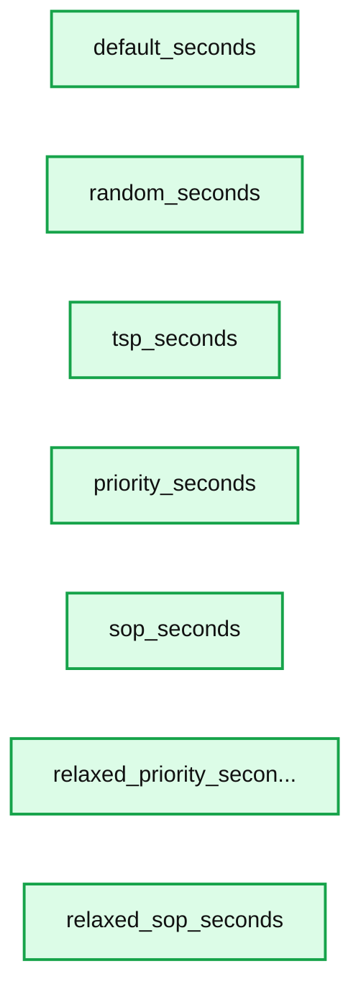

# Optimizing Order Picking to Increase Omnichannel Profitability with Databricks

- Source: https://www.databricks.com/blog/2022/08/04/optimizing-order-picking-to-increase-omnichannel-profitability-with-databricks.html
- Published: 2022-08-04
- Authors: Peyman Mohajerian, Bryan Smith
- Categories: engineering, solution-accelerators, industries, retail-and-consumer-goods
- Images: 2 total, 1 extracted as architecture

Check our new [Order Picking Optimization Solution Accelerator](https://www.databricks.com/solutions/accelerators/order-picking-optimization) for more details and to download the notebooks.

 

Demand for buy-online pickup in-store (BOPIS), curbside and same-day home delivery is [forcing](https://www.mckinsey.com/industries/retail/our-insights/retails-need-for-speed-unlocking-value-in-omnichannel-delivery) retailers to use local stores as rapid fulfillment centers. Caught off-guard in the early days of the pandemic, many retailers [scrambled](https://www.retaildive.com/news/how-covid-19-prompted-new-thinking-for-omnichannel/592010/) to introduce and expand the availability of these services, using existing store inventories and infrastructure to deliver goods in a timely manner. As shoppers return to stores, requests for these services are [unabated](https://www.chainstoreage.com/survey-digital-retail-big-dont-overlook-store), and recent surveys show expectations for still more and faster options will only [increase](https://www.dcvelocity.com/articles/53472-survey-99-of-retailers-will-offer-same-day-delivery-by-2025) in the years to come. This is leaving retailers asking how best to deliver these capabilities in the longer term.

The core challenge most retailers are facing today is not how to deliver goods to customers in a timely manner, but how to do so while retaining [profitability](https://www.retailtouchpoints.com/blog/whats-the-surprising-truth-about-ecommerces-profitability). It is estimated that margins are reduced 3 to 8 percentage-points on each order placed online for rapid fulfillment. The cost of sending a worker to store shelves to pick the items for each order is the [primary culprit](https://www.mckinsey.com/industries/retail/our-insights/achieving-profitable-online-grocery-order-fulfillment), and with the cost of labor only rising (and customers expressing little interest in paying a premium for what are increasingly seen as baseline services), retailers are feeling squeezed.

Concepts such as automated warehouses and dark stores optimized for picking efficiency have been proposed as solutions. However, the upfront capital investment required along with questions about the viability of such models in all but the largest markets have caused many to focus their attention on continued use of existing store footprints. In fact, Walmart, the world’s largest retailer, recently [announced](https://corporate.walmart.com/newsroom/2022/02/28/working-as-fulfillment-centers-walmart-stores-are-the-star-of-the-last-mile) its commitment to this direction though with some in-store changes intended to improve the efficiency of their efforts.

## The Store Layout Is Purposefully Inefficient

In the fulfillment models proposed by Walmart and many others, the existing store footprint is a core component of a [rapid fulfillment strategy](https://www.mckinsey.com/industries/retail/our-insights/beyond-the-distribution-center). In the most simplistic of these models, workers traverse the store layout, picking items for online orders which are then packaged and shipped from the counter or a backroom. In more sophisticated models, high demand items are organized in a backroom fulfillment area, limiting the need to send workers on to the store floor where picking productivity drops.

The decline in picking productivity on the store floor is [by design](https://www.moneycrashers.com/stores-trick-buying-spending-more/). In a traditional retail scenario, the retailer exploits the free labor provided by the customer to increase time in-store. By sending the customer from one end of the store to the other in order to pick the items frequently needed during a visit, the retailer increases the shopper’s exposure to the goods and services available. In doing so, the retailer increases the probability that an additional purchase will be made.

For workers tasked with picking orders on behalf of customers, impulse purchases are simply not an option, and long traversal times only add to the cost of fulfillment. As one analyst [notes](https://www.grocerydive.com/news/3-ways-grocers-are-elevating-online-order-picking-in-their-stores/623206/), “the killer of productivity in a store environment is travel distance.” The store design decisions that maximize the potential of the in-person shopper are at odds with those responsible for omnichannel fulfillment.

## Shoppers Know This, But Pickers May Not

Most shoppers recognize the inefficiency inherent in most store layouts. Frugal shoppers will typically carry a list of items to purchase and often optimize the sorting of items on the list to minimize back and forth between departments and aisles. Knowledge of product placement as well as the special handling needs of certain items ensure a more efficient passage through the store and minimize the potential for repeat journeys to replace items damaged in transit.

But this knowledge, built through years of experience and familiarity with the items being purchased, may not be available to a picker who is often a [gig worker](https://www.pewresearch.org/internet/2021/12/08/the-state-of-gig-work-in-2021/) picking orders for others as part of an occasional side-hustle. For these workers, the list of items to pick may offer no clues as to optimal sequencing, leaving the worker to traverse the store picking the items in the order presented.

## Optimizing Picking Sequences Can Help

In a recent paper titled [*The Buy-Online-Pick-Up-in-Store Retailing Model: Optimization Strategies for In-Store Picking and Packing*](https://www.mdpi.com/1999-4893/14/12/350/pdf), Pietri *et al*. examined the efficiency of several picking sequence optimizations for a real grocery store with a layout as shown in Figure 1.

**Figure 1.**

The layout of a store, divided into fifteen distinct zones, from which orders will be picked.

Using historical orders, the authors altered the picking sequence of items with various goals in mind such as minimizing total traversal time and minimizing product damage. They compared these to the default sort order provided to pickers which was based on the order in which items were originally added to the online cart. Their goal was not to identify one best approach for all retail scenarios but instead to provide a framework for the evaluation of different approaches that others could emulate as they seek ways to improve picking efficiency.

With this goal in mind, we’ve recreated portions of their work using the 3.3-million orders in the Instacart dataset mapped to the provided store layout as the proprietary order history used by the paper’s authors is unavailable to us. While the historical datasets differ, we found the relative impact of different sequencing approaches on picking times to closely mirror the authors’ findings (Figure 2).

*The average picking time (seconds) associated with orders leveraging various optimization strategies.*

**Summary:** The chart compares average order-picking times across seven optimization strategies.

**Components:**

- default_seconds strategy, technology not shown
- random_seconds strategy, technology not shown
- tsp_seconds strategy, technology not shown
- priority_seconds strategy, technology not shown
- sop_seconds strategy, technology not shown
- relaxed_priority_secon... strategy, technology not shown
- relaxed_sop_seconds strategy, technology not shown

**Flows:**

- none

**Numbers:** 0, 50, 100, 150, 200, 250, 300, 350 seconds

source image: https://www.databricks.com/wp-content/uploads/2022/07/db-287-blog-img-2.jpg

**Figure 2.**

The average picking time (seconds) associated with orders leveraging various optimization strategies.

## Databricks Can Make Optimization More Efficient

In the evaluation of optimization strategies, it is a common practice to apply various algorithms to a historical dataset. Using prior configurations and scenarios, the effects of optimization strategies can be assessed before being applied in the real-world. Such evaluations can help organizations avoid unexpected outcomes and assess the impact of small variations in approaches but can be quite time consuming to perform.

But by parallelizing the work, the days or even weeks often spent evaluating an approach can be reduced to hours or even minutes. The key is to identify discrete, independent units of work within the larger evaluation set and then to leverage technology to distribute these across a large, computational infrastructure.

In the picking optimization explored above, each order represents such a unit of work as the sequencing of the items in one order has no impact on the sequencing of any others. At the extreme end of things, we might execute optimizations on all 3.3-millions simultaneously to perform our work incredibly quickly. More typically, we might provision a smaller number of resources and distribute subsets of the larger set to each computational node, allowing us to balance the cost of provisioning infrastructure with the time for performing our analysis.

The power of Databricks in this scenario is that it makes the provisioning of resources in the cloud very simple. By loading our historical orders to a Spark dataframe, they are instantly distributed across the provisioned resources. If we provision more or fewer resources, the dataframe rebalances itself with no additional effort on our part.

The trick is then applying the optimization logic to each order. Using a [pandas user-defined function](https://www.databricks.com/blog/2020/05/20/new-pandas-udfs-and-python-type-hints-in-the-upcoming-release-of-apache-spark-3-0.html) (UDF), we are able to apply open source libraries and custom logic to each order in an efficient manner. Results are returned to the dataframe and can then be persisted and analyzed further. To see how this was done in the analysis referenced above or implement at your organziation, check our our solution accelerator for [Optimized Order Picking](https://www.databricks.com/solutions/accelerators/order-picking-optimization).
