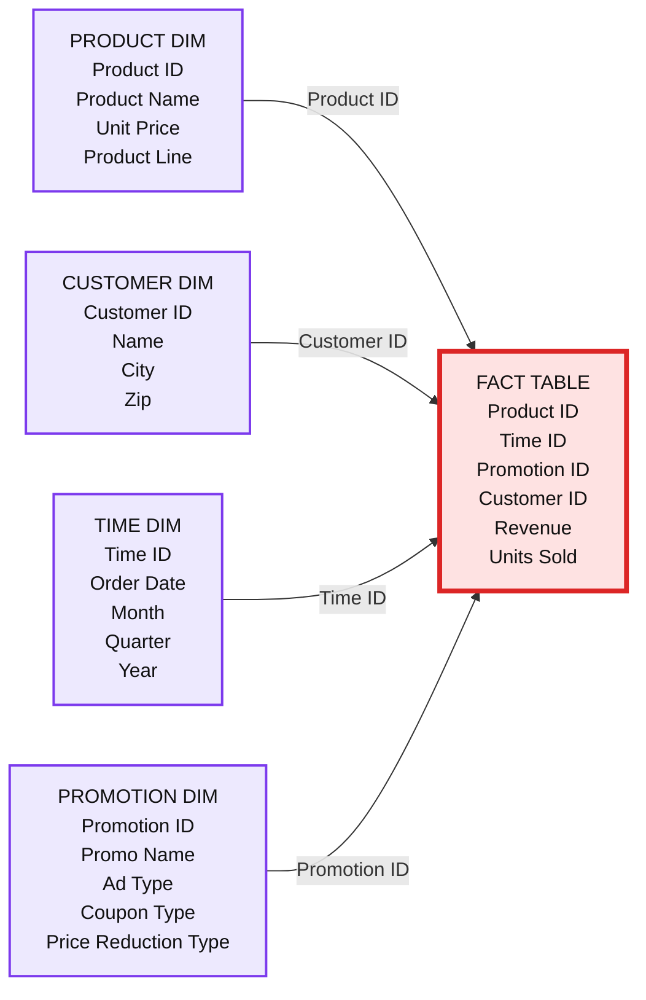

# Identity Columns to Generate Surrogate Keys Are Now Available in a Lakehouse Near You!

- Source: https://www.databricks.com/blog/2022/08/08/identity-columns-to-generate-surrogate-keys-are-now-available-in-a-lakehouse-near-you.html
- Published: 2022-08-08
- Authors: Franco Patano
- Categories: platform, product, data-warehousing
- Images: 1 total, 1 extracted as architecture

## What is an identity column?

An **identity column** is a column in a database that automatically generates a unique ID number for each new row of data. This number is not related to the row's content.

Identity columns are a form of **surrogate keys.** In data warehouses, it is common to use an additional key, called a surrogate key, to uniquely identify each row and keep track of changes to the data over time. Additionally, it is recommended to use surrogate keys over natural keys. Surrogate keys are systems generated and not reliant on several fields to identify the uniqueness of the row.

So, identity columns are used to create surrogate keys, which can serve as **primary and foreign keys** in dimensional models for data warehouses and data marts. As seen below, these keys are the columns that connect different tables to one another in a traditional dimensional model like a star schema.

*A Star Schema Example*

**Summary:** The diagram shows a star schema with a central fact table connected to product, customer, time, and promotion dimension tables through key relationships.

**Components:**

- Product Dim: product attributes, technology not specified
- Customer Dim: customer attributes, technology not specified
- Fact Table: product, time, promotion, customer keys and business measures, technology not specified
- Time Dim: date hierarchy attributes, technology not specified
- Promotion Dim: promotion attributes, technology not specified

**Flows:**

- Product Dim -> Fact Table: Product ID
- Customer Dim -> Fact Table: Customer ID
- Time Dim -> Fact Table: Time ID
- Promotion Dim -> Fact Table: Promotion ID

**Numbers:** none

source image: https://www.databricks.com/wp-content/uploads/2022/08/db-229-blog-img-1.png

A Star Schema Example

## Traditional approaches to generate surrogate keys on data lakes

Most big data technologies use parallelism, or the ability to divide a task into smaller parts that can be completed at the same time, to improve performance. In the early days of data lakes, there was no easy way to create unique sequences over a group of machines. This led to some data engineers using less reliable methods to generate surrogate keys without a proper feature, such as:

- `monotonically_increasing_id(),`
- `row_number(),`
- `Rank OVER,`
- `ZipWithIndex(),`
- `ZipWithUniqueIndex(),`
- Row Hash with `hash(),` and
- Row Hash with `md5()`.

While these functions are able to get the job done under certain circumstances, they are often fraught with many warnings and caveats around sparsely populating the sequences, performance issues at scale, and concurrent transaction issues.

Databases have been able to generate **sequences** since the early days, to generate surrogate keys to uniquely identify a row of data with the assistance of a centralized transaction manager. However, typical implementations require locks and transactional commits, which can be difficult to manage.

## Identity columns on Delta Lake make generating surrogate keys easier

Identity columns solve the issues mentioned above and provide a simple, performant solution for generating surrogate keys. **Delta Lake is the first data lake protocol to enable identity columns for surrogate key generation.**

Delta Lake now supports creating `IDENTITY` columns that can automatically generate unique, auto-incrementing ID numbers when new rows are loaded. While these ID numbers may not be consecutive, Delta makes the best effort to keep the gap as small as possible. You can use this feature to create surrogate keys for your data warehousing workloads easily.

## How to create a surrogate key with an identity column using SQL and Delta Lake

### [Recommended] Generate Always As Identity

Creating an identity column in SQL is as simple as creating a Delta Lake table. When declaring your columns, add a column name called `id`, or whatever you like, with a data type of `BIGINT`, then enter `GENERATED ALWAYS AS IDENTITY`.

Now, every time you perform an operation on this table where you insert data, omit this column from the insert, and Delta Lake will automatically generate a unique value for the `IDENTITY` column for each row inserted into the Delta Lake table.

Here is a simple example of how to use identity columns in Delta Lake:

Going forward, the identity column titled "`id`" will auto-increment whenever you insert new records into the table. You can then insert new data like so:

Notice how the surrogate key column titled "`id`" is missing from the `INSERT` part of the statement. Delta Lake will populate the surrogate keys when it writes the table to cloud object storage (e.g. AWS S3, Azure Data Lake Storage, or Google Cloud Storage). Learn more in the [documentation](https://docs.databricks.com/sql/language-manual/sql-ref-syntax-ddl-create-table-using.html).

### Generate by DEFAULT

There is also the `GENERATED BY DEFAULT AS IDENTITY` option, which allows the identity insertion to be overridden, whereas the `ALWAYS` option cannot be overridden.

There are a few caveats you should keep in mind when adopting this new feature. Identity columns cannot be added to existing tables; the tables will need to be recreated with the new identity column added. To do this, simply create a new table DDL with the identity column, and insert the existing columns into the new table, and surrogate keys will be generated for the new table.

## Get started with Identity Columns with Delta Lake on Databricks SQL today

Identity Columns are now GA (Generally Available) in Databricks Runtime 10.4+ and in Databricks SQL 2022.17+. With identity columns, you can now enable all your data warehousing workloads to have all the benefits of a Lakehouse architecture, accelerated by Photon. [Try out identity columns on Databricks SQL today](http://www.databricks.com/try-databricks).
