# Low-latency Streaming Data Pipelines with Delta Live Tables and Apache Kafka

- Source: https://www.databricks.com/blog/2022/08/09/low-latency-streaming-data-pipelines-with-delta-live-tables-and-apache-kafka.html
- Published: 2022-08-09
- Authors: Frank Munz
- Categories: platform, product, data-streaming
- Images: 2 total, 2 extracted as architecture

[Delta Live Tables (DLT)](https://www.databricks.com/product/delta-live-tables) is the first ETL framework that uses a simple declarative approach for creating reliable data pipelines and fully manages the underlying infrastructure at scale for batch and [streaming data](https://www.databricks.com/product/data-streaming). Many use cases require actionable insights derived from near real-time data. Delta Live Tables enables **low-latency streaming data pipelines** to support such use cases with low latencies by directly ingesting data from event buses like [Apache Kafka](https://kafka.apache.org/), [AWS Kinesis](https://aws.amazon.com/kinesis/), [Confluent Cloud](https://www.confluent.io/confluent-cloud), [Amazon MSK](https://www.youtube.com/watch?v=HtU9pb18g5Q), or [Azure Event Hubs](https://docs.microsoft.com/en-us/azure/event-hubs/).

This article will walk through using DLT with Apache Kafka while providing the required Python code to ingest streams. The recommended system architecture will be explained, and related DLT settings worth considering will be explored along the way.

## Streaming platforms

Event buses or message buses decouple message producers from consumers. A popular streaming use case is the collection of click-through data from users navigating a website where every user interaction is stored as an event in Apache Kafka. The event stream from Kafka is then used for real-time streaming data analytics. Multiple message consumers can read the same data from Kafka and use the data to learn about audience interests, conversion rates, and bounce reasons. The real-time, streaming event data from the user interactions often also needs to be correlated with actual purchases stored in a billing database.

### Apache Kafka

[Apache Kafka](https://kafka.apache.org/) is a popular open source event bus. Kafka uses the concept of a topic, an append-only distributed log of events where messages are buffered for a certain amount of time. Although messages in Kafka are not deleted once they are consumed, they are also not stored indefinitely. The message retention for Kafka can be configured per topic and defaults to 7 days. Expired messages will be deleted eventually.

This article is centered around Apache Kafka; however, the concepts discussed also apply to many other event busses or messaging systems.

## Streaming data pipelines

In a data flow pipeline, Delta Live Tables and their dependencies can be declared with a standard SQL Create Table As Select (CTAS) statement and the DLT keyword "live."

When developing DLT with Python, the `@dlt.table` decorator is used to create a Delta Live Table. To ensure the data quality in a pipeline, DLT uses [Expectations](https://docs.databricks.com/data-engineering/delta-live-tables/delta-live-tables-expectations.html) which are simple SQL constraints clauses that define the pipeline's behavior with invalid records.

Since streaming workloads often come with unpredictable data volumes, Databricks employs [enhanced autoscaling](https://www.databricks.com/blog/2022/06/29/delta-live-tables-announces-new-capabilities-and-performance-optimizations.html) for data flow pipelines to minimize the overall end-to-end latency while reducing cost by shutting down unnecessary infrastructure.

**Delta Live Tables** are fully recomputed, in the right order, exactly once for each pipeline run.

In contrast, **streaming Delta Live Tables** are stateful, incrementally computed and only process data that has been added since the last pipeline run. If the query which defines a streaming live tables changes, new data will be processed based on the new query but existing data is not recomputed. Streaming live tables always use a streaming source and only work over append-only streams, such as Kafka, Kinesis, or Auto Loader. Streaming DLTs are based on top of Spark Structured Streaming.

You can chain multiple streaming pipelines, for example, workloads with very large data volume and low latency requirements.

### Direct Ingestion from Streaming Engines

Delta Live Tables written in Python can directly ingest data from an event bus like Kafka using Spark Structured Streaming. You can set a short retention period for the Kafka topic to avoid compliance issues, reduce costs and then benefit from the cheap, elastic and governable storage that Delta provides.

As a first step in the pipeline, we recommend ingesting the data as is to a bronze (raw) table and avoid complex transformations that could drop important data. Like any Delta Table the bronze table will retain the history and allow to perform GDPR and other compliance tasks.

*Ingest streaming data from Apache Kafka*

**Summary:** The diagram shows streaming ingestion from Apache Kafka into a bronze Delta Live Table, followed by downstream streaming computation.

**Components:**

- Apache Kafka source
- Bronze raw Delta table
- Delta Live Tables Python pipeline using `@dlt.table` and `spark.readStream()`
- Downstream streaming live table

**Flows:**

- Kafka -> Bronze: Raw streaming data
- Bronze -> Downstream streaming live table: Full-refreshable downstream computation without losing source data

**Numbers:** none

source image: https://www.databricks.com/wp-content/uploads/2022/08/db-276-blog-img-1.png

```mermaid
%% Shows Kafka streaming ingestion into a bronze table and downstream live computation
flowchart LR
    A[Apache Kafka] -->|spark readStream raw events| B[Bronze raw Delta table]
    B -->|create streaming live table downstream computation| C[Downstream streaming live table]

    %% Legend
    %% client = clients edge gateway LB
    %% service = stateless compute
    %% store = databases durable storage
    %% cache = Redis CDN or losable data
    %% queue = Kafka streams async pipes
    %% critical = bottleneck or SPOF
    %% external = third party
    %% decision = trade off point

    classDef client fill:#dbeafe,stroke:#2563eb,stroke-width:2px,color:#111
    classDef service fill:#dcfce7,stroke:#16a34a,stroke-width:2px,color:#111
    classDef store fill:#ede9fe,stroke:#7c3aed,stroke-width:2px,color:#111
    classDef cache fill:#fef3c7,stroke:#d97706,stroke-width:2px,color:#111
    classDef queue fill:#cffafe,stroke:#0891b2,stroke-width:2px,color:#111
    classDef critical fill:#fee2e2,stroke:#dc2626,stroke-width:4px,color:#111
    classDef external fill:#e5e7eb,stroke:#6b7280,stroke-width:2px,color:#111,stroke-dasharray:4 3
    classDef decision fill:#fce7f3,stroke:#db2777,stroke-width:2px,color:#111

    class A queue
    class B store
    class C service
```

Ingest streaming data from Apache Kafka

When writing DLT pipelines in Python, you use the `@dlt.table` annotation to create a DLT table. There is no special attribute to mark streaming DLTs in Python; simply use `spark.readStream()` to access the stream. Example code for creating a DLT table with the name `kafka_bronze` that is consuming data from a Kafka topic looks as follows:

#### pipelines.reset.allowed

Note that event buses typically expire messages after a certain period of time, whereas Delta is designed for infinite retention.

This might lead to the effect that source data on Kafka has already been deleted when running a full refresh for a DLT pipeline. In this case, not all historic data could be backfilled from the messaging platform, and data would be missing in DLT tables. To prevent dropping data, use the following DLT table property:

`pipelines.reset.allowed=false`

Setting `pipelines.reset.allowed` to false prevents refreshes to the table but does not prevent incremental writes to the tables or new data from flowing into the table.

#### Checkpointing

If you are an experienced Spark Structured Streaming developer, you will notice the absence of checkpointing in the above code. In Spark Structured Streaming checkpointing is required to persist progress information about what data has been successfully processed and upon failure, this metadata is used to restart a failed query exactly where it left off.

Whereas checkpoints are necessary for failure recovery with exactly-once guarantees in Spark Structured Streaming, DLT handles state automatically without any manual configuration or explicit checkpointing required.

#### Mixing SQL and Python for a DLT Pipeline

A DLT pipeline can consist of multiple notebooks but one DLT notebook is required to be either entirely written in SQL or Python (unlike other Databricks notebooks where you can have cells of different languages in a single notebook).

Now, if your preference is SQL, you can code the data ingestion from Apache Kafka in one notebook in Python and then implement the transformation logic of your data pipelines in another notebook in SQL.

#### Schema mapping

When reading data from messaging platform, the data stream is opaque and a schema has to be provided.

The Python example below shows the schema definition of events from a fitness tracker, and how the value part of the [Kafka message is mapped](https://docs.databricks.com/spark/latest/structured-streaming/kafka.html) to that schema.

### Benefits

Reading streaming data in DLT directly from a message broker minimizes the architectural complexity and provides lower end-to-end latency since data is directly streamed from the messaging broker and no intermediary step is involved.

## Streaming Ingest with Cloud Object Store Intermediary

For some specific use cases you may want offload data from Apache Kafka, e.g., using a Kafka connector, and store your streaming data in a cloud object intermediary. In a Databricks workspace, the cloud vendor-specific object-store can then be mapped via the Databricks Files System (DBFS) as a cloud-independent folder. Once the data is offloaded, [Databricks Auto Loader](https://docs.databricks.com/ingestion/auto-loader/index.html) can ingest the files.

**Summary:** Kafka events are written to object storage, mapped through DBFS, ingested by Auto Loader, and delivered to a Streaming Live Table through DLT.

**Components:**

- Kafka: Apache Kafka event streaming
- Kafka FileSink S3 Connector: Kafka file sink connector
- Object Store / DBFS Directory: Cloud object storage mapped through DBFS
- Auto Loader: Databricks Auto Loader
- Streaming Live Table: Delta Live Tables streaming table
- DLT: Delta Live Tables

**Flows:**

- Kafka -> Kafka FileSink S3 Connector: streaming events
- Kafka FileSink S3 Connector -> Object Store / DBFS Directory: files
- Object Store / DBFS Directory -> Auto Loader: newly arrived files
- Auto Loader -> Streaming Live Table: incrementally ingested data

**Numbers:** none

source image: https://www.databricks.com/wp-content/uploads/2022/08/db-276-blog-img-2.png

```mermaid
%% Kafka streaming ingest through object storage and Delta Live Tables
flowchart LR
    A[Kafka] -->|streaming events| B[Kafka FileSink S3 Connector]
    B -->|files| C[Object Store DBFS Directory]
    C -->|newly arrived files| D[Auto Loader]
    D -->|incrementally ingested data| E[Streaming Live Table]

    class A queue
    class B service
    class C store
    class D service
    class E critical

    classDef client fill:#dbeafe,stroke:#2563eb,stroke-width:2px,color:#111
    classDef service fill:#dcfce7,stroke:#16a34a,stroke-width:2px,color:#111
    classDef store fill:#ede9fe,stroke:#7c3aed,stroke-width:2px,color:#111
    classDef cache fill:#fef3c7,stroke:#d97706,stroke-width:2px,color:#111
    classDef queue fill:#cffafe,stroke:#0891b2,stroke-width:2px,color:#111
    classDef critical fill:#fee2e2,stroke:#dc2626,stroke-width:4px,color:#111
    classDef external fill:#e5e7eb,stroke:#6b7280,stroke-width:2px,color:#111,stroke-dasharray:4 3
    classDef decision fill:#fce7f3,stroke:#db2777,stroke-width:2px,color:#111

    %% Legend
    %% client = clients edge gateway LB
    %% service = stateless compute
    %% store = databases durable storage
    %% cache = Redis CDN or anything losable
    %% queue = Kafka streams async pipes
    %% critical = bottleneck or SPOF
    %% external = third party
    %% decision = trade off point
```

Auto Loader can ingest data with with a single line of SQL code. The syntax to ingest JSON files into a DLT table is shown below (it is wrapped across two lines for readability).

Note that Auto Loader itself is a streaming data source and all newly arrived files will be processed exactly once, hence the streaming keyword for the raw table that indicates data is ingested incrementally to that table.

Since offloading streaming data to a cloud object store introduces an additional step in your system architecture it will also increase the end-to-end latency and create additional storage costs. Keep in mind that the Kafka connector writing event data to the cloud object store needs to be managed, increasing operational complexity.

Therefore Databricks recommends as a best practice to directly access event bus data from DLT using Spark Structured Streaming as described above.

## Other Event Buses or Messaging Systems

This article is centered around Apache Kafka; however, the concepts discussed also apply to other event buses or messaging systems. DLT supports any [data source that Databricks Runtime directly supports](https://docs.databricks.com/data-engineering/delta-live-tables/delta-live-tables-data-sources.html).

### Amazon Kinesis

In Kinesis, you write messages to a fully managed serverless stream. Same as Kafka, Kinesis does not permanently store messages. The default message retention in Kinesis is one day.

When using Amazon Kinesis, replace format(`"kafka"`) with format(`"kinesis"`) in the Python code for streaming ingestion above and add Amazon Kinesis-specific settings with `option`(). For more information, check the section about [Kinesis Integration](https://spark.apache.org/docs/latest/streaming-kinesis-integration.html) in the Spark Structured Streaming documentation.

### Azure Event Hubs

For Azure Event Hubs settings, check the official [documentation at Microsoft](https://docs.microsoft.com/en-us/azure/event-hubs/event-hubs-kafka-spark-tutorial) and the article [Delta Live Tables recipes: Consuming from Azure Event Hubs](https://alexott.blogspot.com/2022/06/delta-live-tables-recipes-consuming.html).

## Summary

DLT is much more than just the "T" in ETL. With DLT, you can easily ingest from streaming and batch sources, cleanse and transform data on the Databricks Lakehouse Platform on any cloud with guaranteed data quality.

Data from Apache Kafka can be ingested by directly connecting to a Kafka broker from a DLT notebook in Python. Data loss can be prevented for a full pipeline refresh even when the source data in the Kafka streaming layer expired.

## Get started

If you are a Databricks customer, simply follow the [guide to get started](https://www.databricks.com/discover/pages/getting-started-with-delta-live-tables). Read the release notes to learn more about what's included in this GA release. If you are not an existing Databricks customer, [sign up for a free trial](https://www.databricks.com/try-databricks), and you can view our detailed DLT Pricing [here](https://www.databricks.com/product/pricing).

Join the conversation in the [Databricks Community](https://community.databricks.com/s/topic/0TO8Y000000VJEhWAO/summit22) where data-obsessed peers are chatting about Data + AI Summit 2022 announcements and updates. Learn. Network.

Last but not least, enjoy the [Dive Deeper into Data Engineering](https://youtu.be/uhZabeKxXBw) session from the summit. In that session, I walk you through the code of another streaming data example with a Twitter live stream, Auto Loader, Delta Live Tables in SQL, and Hugging Face sentiment analysis.
