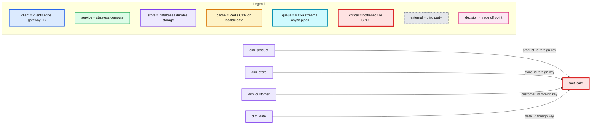
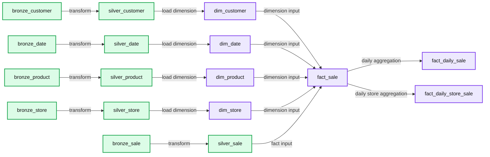
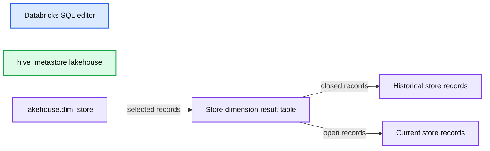

# Loading a Data Warehouse Data Model in Real Time with the Databricks Lakehouse

*Dimensional modeling implementation on the modern lakehouse using Delta Live Tables*

- Source: https://www.databricks.com/blog/2022/11/07/load-edw-dimensional-model-real-time-databricks-lakehouse.html
- Published: 2022-11-07
- Authors: Leo Mao, Soham Bhatt, Abhishek Dey
- Categories: platform, solutions, data-warehousing
- Images: 4 total, 4 extracted as architecture

Dimensional modeling is one of the most popular data modeling techniques for building a modern data warehouse. It allows customers to quickly develop facts and dimensions based on business needs for an enterprise. When helping customers in the field, we found many are looking for best practices and implementation reference architecture from Databricks.

In this article, we aim to dive deeper into the best practice of dimensional modeling on Databricks' Lakehouse Platform and provide a live example to load an EDW dimensional model in real-time using Delta Live Tables.

Here are the high-level steps we will cover in this blog:

1. Define a business problem
2. Design a dimensional model
3. Best practices and recommendations for dimensional modeling
4. Implementing a dimensional model in a Databricks Lakehouse
5. Conclusion

## 1. Define a business problem

Dimensional modeling is business-oriented; it always starts with a business problem. Before building a dimensional model, we need to understand the business problem to solve, as it indicates how the data asset will be presented and consumed by end users. We need to design the data model to support more accessible and faster queries.

The Business Matrix is a fundamental concept in Dimensional Modeling, below is an example of the business matrix, where the columns are shared dimensions and rows represent business processes. The defined business problem determines the grain of the fact data and required dimensions. The key idea here is that we could incrementally build additional data assets with ease based on the Business Matrix and its shared or conformed dimensions.

*A Business Matrix with Shared Dimensions and Business Processes*

**Summary:** A business matrix maps business processes to shared dimensional-model dimensions using checkmarks.

**Components:**

- Business processes: Internet Sales, Reseller Sales, General Ledger, Sales Plan, Inventory, Customer Surveys, Customer Service Calls. Technology not specified.
- Shared dimensions: Date, Customer, Product, Vendor, Promotion, Reseller, Sales Territory, Employee, Account, Organization. Technology not specified.

**Flows:**

- none

**Numbers:** none

```text
%% mermaid failed to render; kept as text
%% Shows business processes mapped to shared dimensions
flowchart LR
    P["Business processes<br/>Internet Sales ✓ Date Customer Product Vendor Promotion Sales Territory<br/>Reseller Sales ✓ Date Product Promotion Reseller Sales Territory Employee<br/>General Ledger ✓ Date Account Organization<br/>Sales Plan ✓ Date Product Sales Territory<br/>Inventory ✓ Date Product Vendor Account<br/>Customer Surveys ✓ Date Customer<br/>Customer Service Calls ✓ Date Customer Product Employee"]
    D["Shared dimensions<br/>Date<br/>Customer<br/>Product<br/>Vendor<br/>Promotion<br/>Reseller<br/>Sales Territory<br/>Employee<br/>Account<br/>Organization"]

    P -->|uses shared dimensions| D

    classDef client fill:#dbeafe,stroke:#2563eb,stroke-width:2px,color:#111
    classDef service fill:#dcfce7,stroke:#16a34a,stroke-width:2px,color:#111
    classDef store fill:#ede9fe,stroke:#7c3aed,stroke-width:2px,color:#111
    classDef cache fill:#fef3c7,stroke:#d97706,stroke-width:2px,color:#111
    classDef queue fill:#cffafe,stroke:#0891b2,stroke-width:2px,color:#111
    classDef critical fill:#fee2e2,stroke:#dc2626,stroke-width:4px,color:#111
    classDef external fill:#e5e7eb,stroke:#6b7280,stroke-width:2px,color:#111,stroke-dasharray:4 3
    classDef decision fill:#fce7f3,stroke:#db2777,stroke-width:2px,color:#111
    P,D service
```

<sub>source image: https://www.databricks.com/sites/default/files/inline-images/db-388-blog-img-1.png</sub>

A Business Matrix with Shared Dimensions and Business Processes

Here we assume that the business sponsor would like to team to build a report to give insights on:

1. What are the top selling products so they can understand product popularity
2. What are the best performing stores to learn good store practices

## 2. Design a dimensional model

Based on the defined business problem, the data model design aims to represent the data efficiently for reusability, flexibility and scalability. Here is the high-level data model that could solve the business questions above.

*Dimensional Model on the Lakehouse*

**Summary:** A dimensional star schema on the Databricks Lakehouse links the `fact_sale` table to product, store, customer, and date dimensions.

**Components:**

- `fact_sale` - sales fact table on the Databricks Lakehouse.
- `dim_product` - product dimension table on the Databricks Lakehouse.
- `dim_store` - store dimension table on the Databricks Lakehouse.
- `dim_customer` - customer dimension table on the Databricks Lakehouse.
- `dim_date` - date dimension table on the Databricks Lakehouse.
- SCD Type 2 metadata - `__START_AT` and `__END_AT` columns on dimension tables.

**Flows:**

- `fact_sale -> dim_product`: `product_id` foreign key relationship.
- `fact_sale -> dim_store`: `store_id` foreign key relationship.
- `fact_sale -> dim_customer`: `customer_id` foreign key relationship.
- `fact_sale -> dim_date`: `date_id` foreign key relationship.

**Numbers:** `2` in SCD Type 2.



<sub>source image: https://www.databricks.com/sites/default/files/inline-images/db-388-blog-img-2.png</sub>

Dimensional Model on the Lakehouse

The design should be easy to understand and efficient with different query patterns on the data. From the model, we designed the sales fact table to answer our business questions; as you can see, other than the foreign keys (FKs) to the dimensions, it only contains the numeric metrics used to measure the business, e.g. sales_amount.

We also designed dimension tables such as Product, Store, Customer, Date that provide contextual information on the fact data. Dimension tables are typically joined with fact tables to answer specific business questions, such as the most popular products for a given month, which stores are the best-performing ones for the quarter, etc.

## 3. Best practices and recommendations for dimensional modeling

With the Databricks Lakehouse Platform, one can easily design & implement dimensional models, and simply build the facts and dimensions for the given subject area.

Below are some of the best practices recommended while implementing a dimensional model:

- One should denormalize the dimension tables. Instead of the third normal form or snowflake type of model, dimension tables typically are highly denormalized with flattened many-to-one relationships within a single dimension table.
- Use conformed dimension tables when attributes in different dimension tables have the same column names and domain contents. This advantage is that data from different fact tables can be combined in a single report using conformed dimension attributes associated with each fact table.
- A usual trend in dimension tables is around tracking changes to dimensions over time to support as-is or as-was reporting. You can easily apply the following basic techniques for handling dimensions based on different requirements.
  - The type 1 technique overwrites the dimension attribute's initial value.
  - With the type 2 technique, the most common SCD technique, you use it for accurate change tracking over time.
 This can be easily achieved out of the box with Delta Live Tables implementation.
  - One can easily perform SCD type 1 or SCD type 2 using Delta Live Tables using [APPLY CHANGES INTO](https://docs.databricks.com/workflows/delta-live-tables/delta-live-tables-cdc.html#change-data-capture-with-delta-live-tables)
- **[Primary + Foreign Key](https://docs.databricks.com/spark/latest/spark-sql/language-manual/sql-ref-syntax-ddl-create-table-constraint.html#constraint-clause) Constraints** allow end users like yourselves to understand relationships between tables.
- **Usage of IDENTITY Columns** automatically generates unique integer values when new rows are added. Identity columns are a form of surrogate keys. Refer to the blog [link](https://www.databricks.com/blog/2022/08/08/identity-columns-to-generate-surrogate-keys-are-now-available-in-a-lakehouse-near-you.html) for more details.
- **Enforced [CHECK](https://docs.databricks.com/tables/constraints.html#set-a-check-constraint-in-databricks) Constraints** to never worry about data quality or data correctness issues sneaking up on you.

## 4. Implementing a dimensional model in a Databricks Lakehouse

Now, let us look at an example of Delta Live Tables based dimensional modeling implementation:

The example code below shows us how to create a dimension table (dim_store) using SCD Type 2, where change data is captured from the source system.

The example code below shows us how to create a fact table (fact_sale), with the constraint of **valid_product_id** we are able to ensure all fact records that are loaded have a valid product associated with it.

The Delta Live Table pipeline example could be found [here](https://github.com/dbsys21/databricks-lakehouse/blob/main/lakehouse-buildout/dimensional-modeling/E2E-Dimensional-Modeling-DLT.sql). Please refer to [Delta Live Tables quickstart](https://docs.databricks.com/workflows/delta-live-tables/delta-live-tables-quickstart.html#create-a-pipeline) on how to create a Delta Live Table pipeline. As seen below, DLT offers full visibility of the ETL pipeline and dependencies between different objects across bronze, silver, and gold layers following the [lakehouse medallion architecture](https://www.databricks.com/glossary/medallion-architecture).

*End to End DLT Pipeline*

**Summary:** Databricks Delta Live Tables pipeline showing bronze, silver, dimension, fact, and daily aggregate layers for dimensional modeling.

**Components:**

- bronze_customer - Databricks Delta Live Tables bronze layer
- silver_customer - Databricks Delta Live Tables silver layer
- dim_customer - Databricks dimension table
- bronze_date - Databricks Delta Live Tables bronze layer
- silver_date - Databricks Delta Live Tables silver layer
- dim_date - Databricks dimension table
- bronze_product - Databricks Delta Live Tables bronze layer
- silver_product - Databricks Delta Live Tables silver layer
- dim_product - Databricks dimension table
- bronze_store - Databricks Delta Live Tables bronze layer
- silver_store - Databricks Delta Live Tables silver layer
- dim_store - Databricks dimension table
- bronze_sale - Databricks Delta Live Tables bronze layer
- silver_sale - Databricks Delta Live Tables silver layer
- fact_sale - Databricks fact table
- fact_daily_sale - Databricks daily aggregate table
- fact_daily_store_sale - Databricks daily store aggregate table

**Flows:**

- bronze_customer -> silver_customer: customer data transformation
- silver_customer -> dim_customer: customer dimension loading
- bronze_date -> silver_date: date data transformation
- silver_date -> dim_date: date dimension loading
- bronze_product -> silver_product: product data transformation
- silver_product -> dim_product: product dimension loading
- bronze_store -> silver_store: store data transformation
- silver_store -> dim_store: store dimension loading
- bronze_sale -> silver_sale: sales data transformation
- dim_customer -> fact_sale: customer dimension input
- dim_date -> fact_sale: date dimension input
- dim_product -> fact_sale: product dimension input
- dim_store -> fact_sale: store dimension input
- silver_sale -> fact_sale: sales fact input
- fact_sale -> fact_daily_sale: daily sales aggregation
- fact_sale -> fact_daily_store_sale: daily store sales aggregation

**Numbers:** 22/09/2022, 21:43:14, 1s, 2s, 7s



<sub>source image: https://www.databricks.com/sites/default/files/inline-images/db-388-blog-img-5.png</sub>

End to End DLT Pipeline

Here is an example of how the dimension table **dim_store** gets updated based on the incoming changes. Below, the Store **Brisbane Airport** was updated to **Brisbane Airport V2**, and with the out-of-box SCD Type 2 support, the original record ended on Jan 07 2022, and a new record was created which starts on the same day with an open end date (NULL) - which indicates the latest record for the Brisbane airport.

*SCD Type 2 for Store Dimension*

**Summary:** The screenshot shows a Databricks SQL view of an SCD Type 2 store dimension, including historical and current store records.

**Components:**

- Databricks SQL editor
- `hive_metastore` lakehouse catalog
- `lakehouse.dim_store` durable dimension table
- Store dimension result table
- SCD Type 2 records with `START_AT` and `END_AT`

**Flows:**

- `lakehouse.dim_store -> Store dimension result table: selected store dimension records`

**Numbers:** 2, 1000, M, 1, 2, 3, 4, 5, 1, 2, 3, 01/10/21, 07/01/22, 08/01/22, 09/01/22, V2



<sub>source image: https://www.databricks.com/sites/default/files/inline-images/db-388-blog-img-6.png</sub>

SCD Type 2 for Store Dimension

For more implementation details, please refer to [here](https://github.com/dbsys21/databricks-lakehouse/blob/main/lakehouse-buildout/dimensional-modeling/E2E-Dimensional-Modeling-DLT.sql) for the full notebook example.

## 5. Conclusion

In this blog, we learned about dimensional modeling concepts in detail, best practices, and how to implement them using Delta Live Tables.

Learn more about dimensional modeling at [Kimball Technology](https://www.kimballgroup.com/data-warehouse-business-intelligence-resources/kimball-techniques/).

## Get started on building your dimensional models in the Lakehouse

[Try Databricks free for 14 days](https://www.databricks.com/try-databricks?itm_data=datavault-blog).
