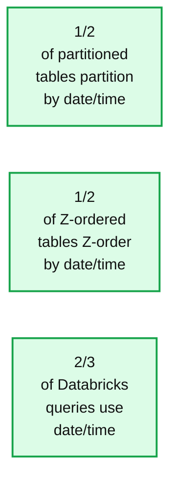
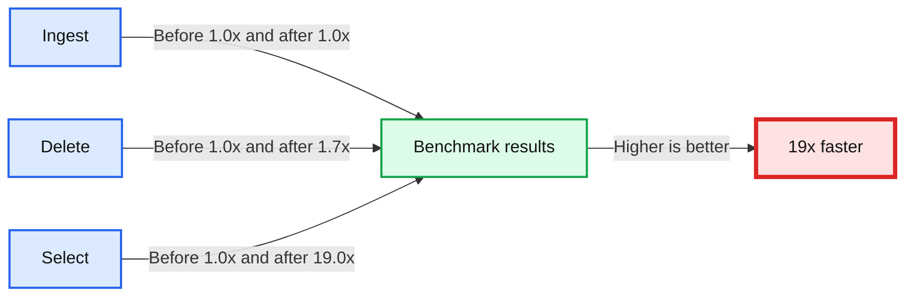

# Introducing Ingestion Time Clustering with Databricks SQL and Databricks Runtime 11.2

*19x faster query performance out-of-the-box*

- Source: https://www.databricks.com/blog/2022/11/18/introducing-ingestion-time-clustering-dbr-112.html
- Published: 2022-11-18
- Authors: Piyush Revuri, Tom van Bussel, Joe Widen, Bart Samwel, Sabir Akhadov, Carmen Kwan
- Categories: engineering, data-engineering
- Images: 3 total, 3 extracted as architecture

Databricks customers are processing over an exabyte of data every day on the Databricks Lakehouse platform using [Delta Lake](https://delta.io/), a significant amount of it being time-series based fact data. With such a large amount of data comes the need for customers to optimize their tables for read and write performance, which is commonly done by partitioning the table or using [OPTIMIZE ZORDER BY](https://docs.databricks.com/spark/latest/spark-sql/language-manual/delta-optimize.html?searchString=&from=0&sortby=_score&orderBy=desc&pageNo=1&aggregations=%5B%5D&uid=7dc8d13f-90bb-11e9-98a5-06d762ad9a62&resultsPerPage=10&exactPhrase=&withOneOrMore=&withoutTheWords=&pageSize=10&language=en&state=1&suCaseCreate=false#optimize-delta-lake-on-databricks). These optimizations change the table's data organization so that data can be retrieved and updated efficiently, by clustering data and enabling [data skipping](https://www.databricks.com/blog/2020/04/30/faster-sql-queries-on-delta-lake-with-dynamic-file-pruning.html). While effective, these techniques require significant user effort to attain optimal read and write query performance for their tables. Furthermore, they incur extra processing costs by rewriting the data.

At Databricks, one of our key goals is to provide customers with an industry-leading query performance out-of-the-box, without any additional configuration and optimizations. Throughout each and every use case, Databricks strives to reduce user action and configuration required to attain the best read and write query performance.

To provide our customers with time-series based fact tables with optimal query performance out of the box, we are excited to introduce **Ingestion Time Clustering.** Ingestion Time Clustering is Databricks' write optimization that enables natural clustering based on the time that data is ingested. By doing this, it removes the need for customers to optimize the layout of their time-series fact tables, providing great data skipping out of the box. In this blog, we will deep dive into the challenges associated with data clustering in Delta, how we solve them in ingestion time clustering, and the real-world query performance results of ingestion time clustered tables.

## Challenges with data clustering

Today, Delta Lake offers customers two powerful techniques to optimize the data layout for better performance: [partitioning](https://docs.databricks.com/spark/latest/spark-sql/language-manual/sql-ref-partition.html#partitions) and [z-ordering](https://docs.databricks.com/spark/latest/spark-sql/language-manual/delta-optimize.html?searchString=&from=0&sortby=_score&orderBy=desc&pageNo=1&aggregations=%5B%5D&uid=7dc8d13f-90bb-11e9-98a5-06d762ad9a62&resultsPerPage=10&exactPhrase=&withOneOrMore=&withoutTheWords=&pageSize=10&language=en&state=1&suCaseCreate=false#optimize-delta-lake-on-databricks). These optimizations to the data layout can significantly reduce the amount of data that queries have to read, reducing the amount of time spent scanning tables per operation.

While the query performance gains from partitioning and z-ordering are significant, some customers have had a difficult time implementing or maintaining these optimizations. Many customers have questions pertaining to which columns to use, how often or whether to z-order their tables, and when partitioning is useful or detrimental. To resolve these customer concerns, we aimed to provide customers with these optimizations out of the box without any user action.

## Introducing Ingestion Time Clustering

Our team went on a path-finding mission to figure out this out-of-the-box solution that was applicable to as many Delta tables as possible. So we dived deep into the data analysis and evidence gathering.

We noticed that most data is ingested incrementally and is often naturally sorted by time. Imagine, for example, an online store company that ingests their order data into Delta lake on a daily basis will do so in a time-ordered manner. This was confirmed by the fact that **51% of partitioned tables are being partitioned on date/time**, and similarly for z-ordering. In addition, we also saw that over two-thirds of queries in Databricks use date/time columns as predicates or join keys.

*Date/Time is the preferred way to partition and z-order in Delta.*

**Summary:** The chart shows that date/time is commonly used for partitioning, Z-ordering, and Databricks query predicates.

**Components:**

- Partitioned tables using date/time partitioning
- Z-ordered tables using date/time Z-ordering
- Databricks queries using date/time

**Flows:**

- none

**Numbers:**

- 1/2 of partitioned tables partition by date/time
- 1/2 of Z-ordered tables Z-order by date/time
- 2/3 of Databricks queries use date/time



<sub>source image: https://www.databricks.com/sites/default/files/inline-images/db-380-blog-image-1.png</sub>

Date/Time is the preferred way to partition and z-order in Delta.

Based on this analysis, we figured out that the simplest solution was also, as often is the case, the most effective one. We can just cluster the data based on the order the data was ingested by default for all tables. While this was a great solution, we found that usage of data manipulation commands, such as MERGE or DELETE, and compaction commands, such as OPTIMIZE, would cause this clustering to be lost over time. This loss of clustering required customers to run z-order regularly to maintain good clustering and attain good query performance.

To solve these challenges, we decided to introduce ingestion time clustering, a new write optimization for Delta tables. Ingestion time clustering addresses many of the challenges customers have with partitioning and z-ordering. It works out-of-the-box and requires no user action to maintain a naturally clustered table for faster query performance when using date/time predicates.

### What is Ingestion Time Clustering?

So what is ingestion time clustering? Ingestion time clustering ensures that clustering for tables is always maintained by ingestion time, enabling significant query performance gains through data skipping for queries that filter by date or time, markedly reducing the number of files needed to be read to answer the query.

*Ingestion time clustering ensures data is maintained in the order of ingestion, significantly improving clustering.*

**Summary:** The diagram shows new data files being ingested into a Delta Lake table while preserving ingestion-time clustering.

**Components:**

- New Data File Q01 with ID, Name, and Time columns
- New Data File Q02 with ID, Name, and Time columns
- New Data File Q03 with ID, Name, and Time columns
- Ingestion process
- Resulting Delta Table File Q01
- Resulting Delta Table File Q02
- Resulting Delta Table File Q03
- Delta Lake storage

**Flows:**

- New Data File Q01 -> Ingestion: data ordered by ingestion time
- New Data File Q02 -> Ingestion: data ordered by ingestion time
- New Data File Q03 -> Ingestion: data ordered by ingestion time
- Ingestion -> Resulting Delta Table Files: clustered data files

**Numbers:** 1, 2, 3, 4, 5, 6, T, T+1, T+2, T+3, T+4, T+5, Q01, Q02, Q03, 3

```text
%% mermaid failed to render; kept as text
%% Shows ingestion time clustering from new data files to a Delta Lake table
flowchart LR
    A[New Data File Q01] -->|Ingestion time T to T+1| I[Ingestion]
    B[New Data File Q02] -->|Ingestion time T+2 to T+3| I
    C[New Data File Q03] -->|Ingestion time T+4 to T+5| I
    I -->|Clustered files| D[Delta Lake]
    D --> E[Resulting File Q01]
    D --> F[Resulting File Q02]
    D --> G[Resulting File Q03]

    classDef client   fill:#dbeafe,stroke:#2563eb,stroke-width:2px,color:#111
    classDef service  fill:#dcfce7,stroke:#16a34a,stroke-width:2px,color:#111
    classDef store    fill:#ede9fe,stroke:#7c3aed,stroke-width:2px,color:#111
    classDef cache    fill:#fef3c7,stroke:#d97706,stroke-width:2px,color:#111
    classDef queue    fill:#cffafe,stroke:#0891b2,stroke-width:2px,color:#111
    classDef critical fill:#fee2e2,stroke:#dc2626,stroke-width:4px,color:#111
    classDef external fill:#e5e7eb,stroke:#6b7280,stroke-width:2px,color:#111,stroke-dasharray:4 3
    classDef decision fill:#fce7f3,stroke:#db2777,stroke-width:2px,color:#111
    A,B,C client
    I service
    D,E,F,G store
```

<sub>source image: https://www.databricks.com/sites/default/files/inline-images/db-380-blog-img-2.png</sub>

Ingestion time clustering ensures data is maintained in the order of ingestion, significantly improving clustering.

We already have significantly improved the clustering preservation of MERGE starting with Databricks Runtime 10.4 using our new [Low Shuffle MERGE](https://www.databricks.com/blog/2021/09/08/announcing-public-preview-of-low-shuffle-merge.html) implementation. As part of ingestion time clustering, we ensured that other manipulation and maintenance commands, like DELETE, UPDATE, and OPTIMIZE, also preserved the ingestion order to provide customers with consistent and significant performance gains. In addition to preserving the ingestion order, we also needed to ensure that the additional work we were doing to ingest in time order would not degrade ingestion performance. The benchmarks below will show exactly that using a real-world scenario.

## Large online retailer benchmarking - 19x improvement!

We worked with a large online retail customer to construct a benchmark that represented their analytical data. In this customer scenario, sales records are generated as they occur and ingested into a fact table. Most of the queries against this table were returning aggregated sales records within some time window, a common and broadly applicable pattern in any time-based analytics workloads. The benchmark measured the time to ingest new data, the time to run DELETE operations, and various SELECT queries, all run sequentially to validate the clustering preservation capabilities of ingestion time clustering.

Results showed that ingestion saw no degradation in performance with ingestion time clustering despite the additional work involved in preserving clustering. DELETE and SELECT queries, on the other hand, saw significant performance gains. Without ingestion time clustering, the DELETE statement dismantled the intended clustering and reduced data skipping effectiveness, slowing down any subsequent SELECT queries in the benchmark. With ingestion time clustering being preserved, the SELECT queries saw significant performance gains of 19x on average, markedly reducing the time required to query the table by preserving the intended clustering in the original ingestion order.

*Benchmarking showed significant improvement in query performance while no degradation in ingest performance.*

**Summary:** Benchmark results compare performance before and after Ingestion Time Clustering, showing a 19x SELECT speedup without ingest degradation.

**Components:**

- Benchmark categories: Ingest, Delete, and Select
- Before Ingestion Time Clustering measurements
- After Ingestion Time Clustering measurements
- Speed Up axis, ranging from 0.0x to 20.0x
- Higher is better indicator
- 19x faster callout

**Flows:**

- Before Ingestion Time Clustering -> Benchmark results: baseline performance
- After Ingestion Time Clustering -> Benchmark results: clustered performance

**Numbers:** 19x, 1.0x, 1.7x, 0.0x, 5.0x, 10.0x, 15.0x, 20.0x



<sub>source image: https://www.databricks.com/sites/default/files/inline-images/db-380-blog-image-3.png</sub>

Benchmarking showed significant improvement in query performance while no degradation in ingest performance.

## Getting started

We are very excited for customers to experience the out-of-the-box performance benefits of Ingestion Time Clustering. **Ingestion Time Clustering is enabled by default on [Databricks Runtime 11.2](https://docs.databricks.com/release-notes/runtime/11.2.html) and [Databricks SQL](https://www.databricks.com/product/databricks-sql) (version 2022.35 and above)**. All unpartitioned tables will automatically benefit from ingestion time clustering when new data is ingested. We recommend customers to not partition tables under 1TB in size on date/timestamp columns and let ingestion time clustering automatically take effect.
