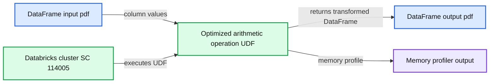

# Memory Profiling in PySpark

- Source: https://www.databricks.com/blog/2022/11/30/memory-profiling-pyspark.html
- Published: 2022-11-30
- Authors: Xinrong Meng, Takuya Ueshin, Allan Folting
- Categories: engineering, data-engineering
- Images: 4 total, 2 extracted as architecture

There are many factors in a PySpark program's performance. PySpark supports various profiling tools to expose tight loops of your program and allow you to make performance improvement decisions, see [more](https://www.databricks.com/blog/how-profile-pyspark). However, memory, as one of the key factors of a program's performance, had been missing in PySpark profiling. A PySpark program on the Spark driver can be profiled with [Memory Profiler](https://pypi.org/project/memory-profiler/) as a normal Python process, but there was not an easy way to profile memory on Spark executors.

PySpark UDFs, one of the most popular Python APIs, are executed by Python worker subprocesses spawned by Spark executors. They are powerful because they enable users to run custom code on top of the Apache Spark™ engine. However, it is difficult to optimize UDFs without understanding memory consumption. To help optimize PySpark UDFs and reduce the likelihood of out-of-memory errors, the PySpark memory profiler provides information about total memory usage. It pinpoints which lines of code in a UDF attribute to the most memory usage.

Implementing memory profiling on executors is challenging. Because executors are distributed on the cluster, result memory profiles have to be collected from each executor and aggregated properly to show the total memory usage. Meanwhile, a mapping between the memory consumption and each source code line has to be provided for debugging and pruning purposes. In [Databricks Runtime 12.0](https://docs.databricks.com/release-notes/runtime/12.0.html), PySpark overcame all those technical difficulties, and memory profiling was enabled on executors. In this blog, we provide an overview of user-defined functions (UDFs) and demonstrate how to use the memory profiler with UDFs.

## User-defined Functions(UDFs) overview

There are two main categories of UDFs supported in PySpark: Python UDFs and Pandas UDFs.

- Python UDFs are user-defined scalar functions that take/return Python objects serialized/deserialized by Pickle and operate one-row-at-a-time
- Pandas UDFs (a.k.a. Vectorized UDFs) are UDFs that take/return pandas Series or DataFrame serialized/deserialized by Apache Arrow and operate block by block. Pandas UDFs have some variations categorized by usage, with specific input and output types: `Series to Series`, `Series to Scalar`, and `Iterator to Iterator`.

Based on Pandas UDFs implementation, there are also Pandas Function APIs: Map (i.e., `mapInPandas`) and (Co)Grouped Map (i.e., `applyInPandas`), as well as an Arrow Function API - `mapInArrow`. The memory profiler applies to all UDF types mentioned above unless the function takes in/outputs an iterator.

## Enable Memory Profiling

To enable memory profiling on a cluster, we should install the [Memory Profiler](https://pypi.org/project/memory-profiler/) library and set the Spark config "`spark.python.profile.memory`" to "`true`" as shown below.

- Install the Memory Profiler library on the cluster.

- Enable the "`spark.python.profile.memory`" Spark configuration.

Then, we can profile the memory of a UDF. We will illustrate the memory profiler with [`GroupedData.applyInPandas`](https://spark.apache.org/docs/latest/api/python/reference/pyspark.sql/api/pyspark.sql.GroupedData.applyInPandas.html).

Firstly, a PySpark DataFrame with 4,000,000 rows is generated, as shown below. Later, we will group by the id column, which results in 4 groups with 1,000,000 rows per group.

Then a function `arith_op` is defined and applied to `sdf` as shown below.

Executing the code above and running `sc.show_profiles()` prints the following result profile. The result profile can also be dumped to disk by `sc.dump_profiles(path)`.

**Summary:** A Databricks `sc.show_profiles()` output showing memory usage and incremental memory by profiled UDF code line.

**Components:**

- UDF profile report
- `arith_op` function
- Memory usage table
- Line contents
- Databricks command metadata

**Flows:**

- none visible

**Numbers:** 1, 2, 3, 4, 5, 6, 492.9 MiB, 0.0 MiB, 647.5 MiB, 124.6 MiB, 4000004, 30.1 MiB, 4000000, 678.4 MiB, 10, 0.09 seconds, 245, 3799300719682840, 10/27/2022, 2:17:21 PM, 114005

```mermaid
%% Shows a Databricks UDF memory profile output
flowchart LR
  A[UDF profile id 245]
  B[arith_op function]
  C[Memory usage table]
  D[Line contents]
  E[Command metadata]
  A -.-> B
  B -.-> C
  C -.-> D
  D -.-> E

  classDef client fill:#dbeafe,stroke:#2563eb,stroke-width:2px,color:#111
  classDef service fill:#dcfce7,stroke:#16a34a,stroke-width:2px,color:#111
  classDef store fill:#ede9fe,stroke:#7c3aed,stroke-width:2px,color:#111
  classDef cache fill:#fef3c7,stroke:#d97706,stroke-width:2px,color:#111
  classDef queue fill:#cffafe,stroke:#0891b2,stroke-width:2px,color:#111
  classDef critical fill:#fee2e2,stroke:#dc2626,stroke-width:4px,color:#111
  classDef external fill:#e5e7eb,stroke:#6b7280,stroke-width:2px,color:#111,stroke-dasharray:4 3
  classDef decision fill:#fce7f3,stroke:#db2777,stroke-width:2px,color:#111
  class A,B,C,D,E service
```

source image: https://www.databricks.com/sites/default/files/inline-images/db-407-blog-img-3.png

The UDF id in the above result profile, `245`, matches that in the following Spark plan for `res` which can be shown by calling `res.explain()`.

In the body of the result profile of `sc.show_profiles()`, the column heading includes

- `Line #`, line number of the code that has been profiled,
- `Mem usage`, the memory usage of the Python interpreter after that line has been executed
- `Increment`, the difference in memory of the current line with respect to the last one
- `Occurrences`, the number of times this line has been executed
- `Line Contents`, the code that has been profiled

We can tell from the result profile that `Line 3 ("for x in pdf.v")` consumes the most memory: `~125 MiB;` and the total memory usage of the function is `~185 MiB`.

We can optimize the function to be more memory-efficient by removing the iteration of `pdf.v` as shown below.

The updated result profile is as shown below.

**Summary:** The image shows a Databricks PySpark memory profile for an optimized pandas UDF.

**Components:**

- Optimized arithmetic operation UDF
- DataFrame input `pdf`
- Column `pdf.v`
- Returned DataFrame `pdf`
- Databricks cluster SC-114005
- Memory profiler output

**Flows:**

- `pdf -> optimized arithmetic operation UDF`: DataFrame input
- `pdf.v -> optimized arithmetic operation UDF`: Column values multiplied by 10 and incremented by 1
- `optimized arithmetic operation UDF -> pdf`: Transformed DataFrame output

**Numbers:**

- UDF ID: 258
- Line 1 memory usage: 494.7 MiB
- Line 1 increment: 494.7 MiB
- Line 1 occurrences: 4
- Line 2 memory usage: 555.9 MiB
- Line 2 increment: 61.2 MiB
- Line 2 occurrences: 4
- Line 3 memory usage: 555.9 MiB
- Line 3 increment: 0.0 MiB
- Line 3 occurrences: 4
- Runtime: 0.09 seconds
- Date: 10/27/2022
- Time: 2:17:25 PM
- Cluster: SC-114005

source image: https://www.databricks.com/sites/default/files/inline-images/db-407-blog-img-4.png

The total memory usage for the `optimized_arith_op` is reduced to `~61 MiB` which uses 2x less memory.

The example above demonstrates how the memory profiler helps deeply understand the memory consumption of the UDF, identify the memory bottleneck, and make the function more memory-efficient.

## Conclusion

PySpark memory profiler is implemented based on [Memory Profiler](https://pypi.org/project/memory-profiler/). [Spark Accumulators](https://spark.apache.org/docs/latest/rdd-programming-guide.html#accumulators) also play an important role when collecting result profiles from Python workers. The memory profiler calculates the total memory usage of a UDF and pinpoints which lines of code attribute to the most memory usage. It is easy to use and available starting from [Databricks Runtime 12.0](https://docs.databricks.com/release-notes/runtime/12.0.html).

In addition, we have open sourced PySpark memory profiler to the Apache Spark™ community. The memory profiler will be available starting from Spark 3.4; see [SPARK-40281](https://issues.apache.org/jira/browse/SPARK-40281) for more information.
