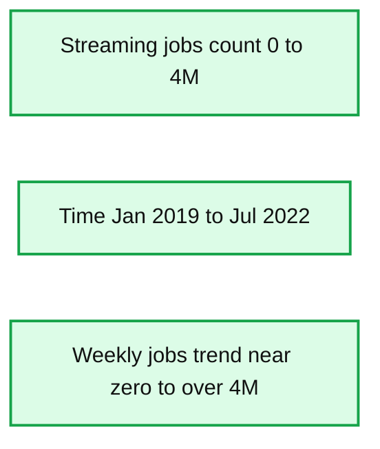
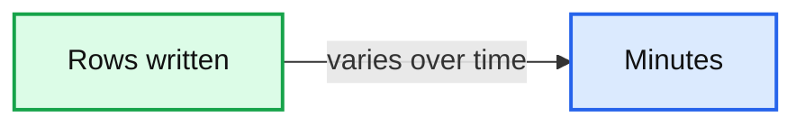
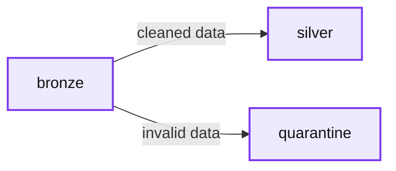
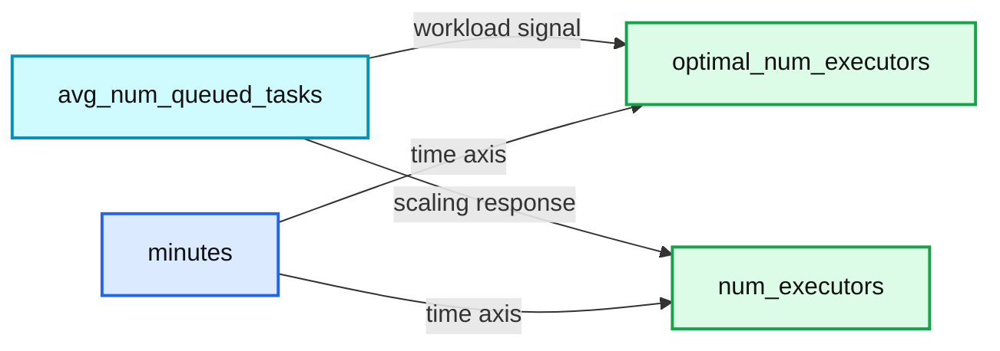

# Build Reliable and Cost Effective Streaming Data Pipelines With Delta Live Tables’ Enhanced Autoscaling

- Source: https://www.databricks.com/blog/2022/12/08/build-reliable-and-cost-effective-streaming-data-pipelines.html
- Published: 2022-12-08
- Authors: Paul Lappas, Li Zhang, Alex Ott, Kiavash Kianfar, Yuhong Chen, Prashanth Babu Velanati Venkata
- Categories: platform, product, data-engineering, data-streaming
- Images: 6 total, 5 extracted as architecture

This year we announced the general availability of [Delta Live Tables (DLT)](https://www.databricks.com/product/delta-live-tables), the first ETL framework to use a simple, declarative approach to building reliable data pipelines. Since the launch, [Databricks continues to expand DLT with new capabilities](https://www.databricks.com/blog/2022/06/29/delta-live-tables-announces-new-capabilities-and-performance-optimizations.html). Today we are excited to announce that [Enhanced Autoscaling](https://docs.databricks.com/workflows/delta-live-tables/delta-live-tables-concepts.html#databricks-enhanced-autoscaling) for [Delta Live Tables (DLT)](https://www.databricks.com/product/delta-live-tables) is now generally available. Analysts and data engineers can use DLT to quickly create production-ready [streaming](https://www.databricks.com/product/data-streaming) or batch data pipelines. You only need to define the transformations to perform on data using SQL or Python, and DLT understands your pipeline's dependencies and automates compute management, monitoring, data quality, and error handling.

DLT Enhanced Autoscaling is designed to handle streaming workloads which are spiky and unpredictable. It optimizes cluster utilization for streaming workloads to lower your costs while ensuring that your data pipeline has the resources it needs to maintain consistent SLAs. As a result, you can focus on working with data with the confidence that the business has access to the freshest data and that your costs are optimized. Many customers are already using Enhanced Autoscaling in production today, from startups to enterprises like [Nasdaq](https://www.youtube.com/watch?v=DXgtNmj5mdE) and [Shell](https://www.databricks.com/customers/shell). DLT Enhanced Autoscaling is powering production use cases at customers like [Berry Appleman & Leiden LLP](https://www.bal.com/) (BAL), the award-winning global immigration law firm:

> “DLT’s Enhanced Autoscaling enables a leading law firm like BAL to optimize our streaming data pipelines while preserving our latency requirements. We deliver report data to clients 4x faster than before, so they have the information to make more informed decisions about their immigration programs.” —Chanille Juneau, Chief Technology Officer, BAL

## Streaming data is mission critical

Streaming workloads are growing in popularity because they allow for quicker decision making on enormous amounts of new data. Real time processing provides the freshest possible data to an organization's analytics and machine learning models enabling them to make better, faster decisions, more accurate predictions, offer improved customer experiences, and more. Many Databricks users are adopting streaming on the [lakehouse](https://www.databricks.com/product/data-lakehouse) to take advantage of lower latency, fault tolerance, and support for incremental processing. We have seen [tremendous adoption](https://www.databricks.com/blog/2022/06/28/project-lightspeed-faster-and-simpler-stream-processing-with-apache-spark.html) of streaming among both open source Apache Spark users and Databricks customers. The graph below shows the weekly number of streaming jobs on Databricks over the past three years, which has grown from a few thousand to a few million and is still accelerating.

*Figure: Number of streaming jobs run on Databricks*

**Summary:** The chart shows weekly streaming jobs on Databricks increasing from near zero in January 2019 to over 4M by July 2022.

**Components:**

- Streaming jobs count
- Time axis from January 2019 to July 2022
- Blue weekly jobs trend line

**Flows:**

- none

**Numbers:** 0, 1M, 2M, 3M, 4M, Jan 2019, Jul 2019, Jan 2020, Jul 2020, Jan 2021, Jul 2021, Jan 2022, Jul 2022

source image: https://www.databricks.com/sites/default/files/inline-images/db-338-blog-img-2.png

[Figure: Number of streaming jobs run on Databricks](https://www.databricks.com/sites/default/files/inline-images/db-338-blog-img-2.png)

There are many types of workloads where data volumes vary over time: clickstream events, e-commerce transactions, service logs, and more. At the same time, our customers are asking for more predictable latency and guarantees on data availability and freshness.

Scaling infrastructure to handle streaming data while maintaining consistent SLAs is technically challenging, and it has different, more complicated needs than traditional batch processing. To solve this problem, data teams often size their infrastructure for peak loads, which results in low utilization and higher costs. Manually managing infrastructure is operationally complex and time consuming.

Databricks introduced [cluster autoscaling](https://www.databricks.com/blog/2018/05/02/introducing-databricks-optimized-auto-scaling.html) in 2018 to solve the problem of scaling compute resources in response to changes in compute demands. Cluster autoscaling has saved our customers money while ensuring the necessary capacity for workloads to avoid costly downtime. However, cluster autoscaling was designed for batch-oriented processes where the compute demands were relatively well known and did not fluctuate over the course of a workflow. DLT’s Enhanced Autoscaling was built to specifically handle the unpredictable flow of data that can come with streaming pipelines, helping customers save money and simplify their operations by ensuring consistent SLAs for streaming workloads.

## DLT Enhanced Autoscaling intelligently scales streaming and batch workloads

DLT with autoscaling spans many use cases across all industry verticals including retails, financial services, and more. In this example, we've picked a use case analyzing cybersecurity events.Let’s see how Enhanced Autoscaling for Delta Live Tables removes the need to manually manage infrastructure while delivering fresh results with low costs. We will illustrate this with a common, real-world example: using Delta Live Tables to detect cybersecurity events.

Cybersecurity workloads are naturally spiky - users log into their computers in the morning, walk away from desks for lunch, more users wake up in another timezone and the cycle repeats. Security teams need to process events as quickly as possible to protect the business while keeping costs under control.

In this demo, we will ingest and process connection logs produced by Zeek, a popular open source network monitoring tool.

*Figure: Number of rows written into landing zone*

**Summary:** Bar chart showing rows written over time in minutes, with strongly varying and highly spiky volumes.

**Components:**

- Rows axis: row count measured in millions
- Minutes axis: elapsed time in minutes
- Blue bars: rows written during each time interval

**Flows:**

- none

**Numbers:** 0, 20, 40, 60, 80, 100, 120 minutes; 0, 50M, 100M, 150M, 200M rows

source image: https://www.databricks.com/sites/default/files/inline-images/db-338-blog-img-3.png

[Figure: Number of rows written into landing zone](https://www.databricks.com/sites/default/files/inline-images/db-338-blog-img-3.png)

The Delta Live Tables pipeline follows the standard [medallion architecture](https://www.databricks.com/glossary/medallion-architecture) - it ingests JSON data into a bronze layer using [Databricks Auto Loader](https://docs.databricks.com/ingestion/auto-loader/index.html), and then moves cleaned data into a silver layer, adjusting data types, renaming columns, and applying [data expectations](https://docs.databricks.com/workflows/delta-live-tables/delta-live-tables-expectations.html) to handle bad data. The full streaming pipeline looks like this, and is created from just a [few lines of code](https://www.databricks.com/wp-content/uploads/notebooks/dlt-enhanced-autoscaling.dbc):

*Figure: Example cybersecurity DLT Pipeline*

**Summary:** Example cybersecurity Delta Live Tables pipeline flowing from bronze data into silver and quarantine tables.

**Components:**

- bronze - Delta Live Tables table
- silver - Delta Live Tables table
- quarantine - Delta Live Tables table

**Flows:**

- bronze -> silver: cleaned data
- bronze -> quarantine: invalid or bad data

**Numbers:** 2h 43m 5s; 2h 43m 4s; 2h 43m 4s

source image: https://www.databricks.com/sites/default/files/inline-images/db-338-blog-img-4.png

[Figure: Example cybersecurity DLT Pipeline](https://www.databricks.com/sites/default/files/inline-images/db-338-blog-img-4.png)

For analysis we will use information from the DLT [event log](https://docs.databricks.com/workflows/delta-live-tables/delta-live-tables-event-log.html), which is available as a Delta table.

The graph below shows how the cluster size with enhanced autoscaling increases with the data volume and decreases when the data volume decreases and the backlog is processed.

*Figure: Number of executors used by the DLT Pipeline using Enhanced Autoscaling.*

**Summary:** The chart shows how a Delta Live Tables pipeline using enhanced autoscaling increases and decreases executor count over time in response to data volume and backlog.

**Components:**

- Enhanced autoscaling, used by the DLT pipeline to adjust cluster size
- DLT pipeline, the streaming data pipeline being monitored
- Executors, the compute capacity being scaled
- Minutes, the time axis
- num_executors, the executor-count axis

**Flows:**

- DLT pipeline -> Enhanced autoscaling: data volume and backlog signals
- Enhanced autoscaling -> Executors: increase or decrease cluster size over time

**Numbers:** 0, 20, 40, 60, 80, 100, 120, 140, 160 minutes; executor counts 1, 2, 3, 4, 5, 6, 7, 10, 12, 14, 16; plotted values 1, 5, 16, 6, 14, 6, 3, 10, 6, 12, 6, 2, 1, 5, 3, 7, 4, 2; unit: minutes; label: num_executors

```mermaid
%% Enhanced autoscaling changes DLT pipeline executor count over time
flowchart LR
    A["0 to 10 min<br/>1 executor"] -->|"scale up"| B["10 to 16 min<br/>5 executors"]
    B -->|"scale up"| C["17 to 24 min<br/>16 executors"]
    C -->|"scale down"| D["25 to 34 min<br/>6 executors"]
    D -->|"scale up"| E["35 to 43 min<br/>14 executors"]
    E -->|"scale down"| F["44 to 50 min<br/>6 executors"]
    F -->|"scale down"| G["51 to 63 min<br/>3 executors"]
    G -->|"scale up"| H["64 to 72 min<br/>10 executors"]
    H -->|"scale down"| I["73 to 81 min<br/>6 executors"]
    I -->|"scale up"| J["82 to 89 min<br/>12 executors"]
    J -->|"scale down"| K["90 to 96 min<br/>6 executors"]
    K -->|"scale down"| L["97 to 104 min<br/>2 executors"]
    L -->|"scale down"| M["105 to 110 min<br/>1 executor"]
    M -->|"scale up"| N["111 to 130 min<br/>5 executors"]

    classDef client fill:#dbeafe,stroke:#2563eb,stroke-width:2px,color:#111
    classDef service fill:#dcfce7,stroke:#16a34a,stroke-width:2px,color:#111
    classDef store fill:#ede9fe,stroke:#7c3aed,stroke-width:2px,color:#111
    classDef cache fill:#fef3c7,stroke:#d97706,stroke-width:2px,color:#111
    classDef queue fill:#cffafe,stroke:#0891b2,stroke-width:2px,color:#111
    classDef critical fill:#fee2e2,stroke:#dc2626,stroke-width:4px,color:#111
    classDef external fill:#e5e7eb,stroke:#6b7280,stroke-width:2px,color:#111,stroke-dasharray:4 3
    classDef decision fill:#fce7f3,stroke:#db2777,stroke-width:2px,color:#111

    class A,B,C,D,E,F,G,H,I,J,K,L,M,N service
```

source image: https://www.databricks.com/sites/default/files/inline-images/db-338-blog-img-5.png

[Figure: Number of executors used by the DLT Pipeline using Enhanced Autoscaling.](https://www.databricks.com/sites/default/files/inline-images/db-338-blog-img-5.png)

As you can see from the graph, the ability to automatically increase and decrease the cluster's size significantly saves resources.

Delta Live Tables collects useful metrics about the data pipeline, including autoscaling and cluster events. Cluster resources events [provide information](https://docs.databricks.com/workflows/delta-live-tables/delta-live-tables-event-log.html) about the current number of executors and task slots, utilization of task slots and number of queued tasks. Enhanced Autoscaling uses this data in real-time to calculate the optimal number of executors for a given workload. For example, we can see in the graph below that an increase in the number of tasks results in an increase in the number of executors launched, and when the number of tasks goes down, executors are also removed to optimize cost:

*Figure: current vs projected optimal number of executors & average number of queued tasks*

**Summary:** The chart compares current and projected optimal executor counts against average queued tasks over time.

**Components:**

- `optimal_num_executors`: projected optimal executor count
- `num_executors`: current executor count
- `avg_num_queued_tasks`: average queued task count
- `minutes`: time axis

**Flows:**

- `avg_num_queued_tasks -> num_executors`: rising queued tasks correspond to more current executors
- `avg_num_queued_tasks -> optimal_num_executors`: queued-task levels inform projected optimal executors

**Numbers:**

- X-axis: 0, 20, 40, 60, 80, 100, 120, 140, 160 minutes
- Left Y-axis: 0, 2, 4, 6, 8, 10, 12, 14, 16 optimal/current executors
- Right Y-axis: 0, 50, 100, 150, 200, 250 average queued tasks

source image: https://www.databricks.com/sites/default/files/inline-images/db-338-blog-img-6.png

[Figure: current vs projected optimal number of executors & average number of queued tasks](https://www.databricks.com/sites/default/files/inline-images/db-338-blog-img-6.png)

## Conclusion

Given changing, unpredictable data volumes, manually sizing clusters for best performance can be difficult and risk overprovisioning. DLTs Enhanced Autoscaling maximizes cluster utilization while reducing the overall end-to-end latency to reduce costs.

In this blog article, we demonstrated how DLT's Enhanced Autoscaling scales up to meet streaming workload requirements by selecting the ideal amount of compute resources based on the current and projected data load. We also demonstrated how, in order to reduce expenses, Enhanced Autoscaling will scale down by deactivating cluster resources.

## Get started with Enhanced Autoscaling and Delta Live Tables on the Databricks Lakehouse Platform

Enhanced Autoscaling is enabled automatically for new pipelines created in the DLT user interface. We encourage users to enable Enhanced Autoscaling on existing DLT pipelines by clicking on the [Settings button](https://docs.databricks.com/workflows/delta-live-tables/delta-live-tables-ui.html#edit-settings) in the DLT UI. DLT pipelines created through the REST API must include a setting to enable Enhanced Autoscaling (see [docs](https://docs.databricks.com/workflows/delta-live-tables/delta-live-tables-concepts.html#databricks-enhanced-autoscaling)). For DLT pipelines where no autoscaling mode is specified in the settings, we will gradually roll out changes to make Enhanced Autoscaling the default.

Watch the demo below to discover the ease of use of DLT for data engineers and analysts alike:

If you are a Databricks customer, simply follow the [guide to get started](https://www.databricks.com/discover/pages/getting-started-with-delta-live-tables). If you are not an existing Databricks customer, [sign up for a free trial](https://www.databricks.com/try-databricks), and you can view our detailed DLT Pricing [here](https://www.databricks.com/product/pricing).
