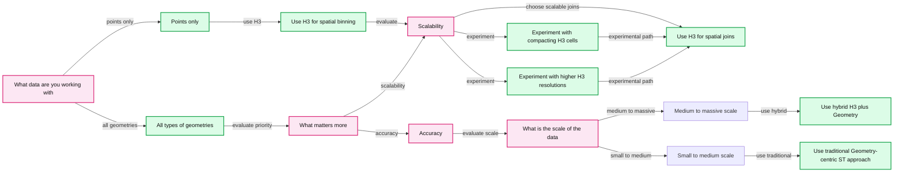
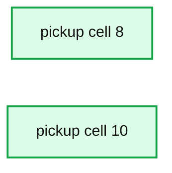

# Spatial Analytics at Any Scale With H3 and Photon

*A Comparison of Discrete, Vector, and Hybrid Approaches*

- Source: https://www.databricks.com/blog/2022/12/13/spatial-analytics-any-scale-h3-and-photon.html
- Published: 2022-12-07
- Authors: Kent Marten, Michael Johns, Menelaos Karavelas
- Categories: engineering, data-science-machine-learning
- Images: 9 total, 3 extracted as architecture

For working with geospatial data, see this post from Databricks announcing support for Spatial SQL: [Introducing Spatial SQL in Databricks: 80+ Functions for High-Performance Geospatial Analytics](https://www.databricks.com/blog/introducing-spatial-sql-databricks-80-functions-high-performance-geospatial-analytics)

H3's global grid indexing system is driving new patterns for spatial analytics across a variety of geospatial use-cases. Recently, Databricks added [built-in support for H3 expressions](https://www.databricks.com/blog/2022/09/14/announcing-built-h3-expressions-geospatial-processing-and-analytics.html) to give customers the most performant H3 API available, powered by [Photon](https://docs.databricks.com/runtime/photon.html) and ready to tackle these use-cases at any scale. In this blog, you will learn that when scale matters, H3 delivers the best performance over traditional geometry-driven approaches for improving speed to insight and reducing total cost of ownership.

## Decision tree for spatial analytics

When examining approaches to spatial analytics, you first need to understand the use case to be able to choose the right tool for the job. Let's start with one of the common subjects of geospatial analysis - mobility. Mobility data is often categorized as either human or vehicle; it is used across a wide range of domains, including retail, transportation, insurance, public policy, and more. Mobility data is usually massive, with records containing latitude, longitude, timestamp, and device-id fields, all captured at a high frequency. In the case of retail site selection, you would use mobility data to consider foot or vehicle traffic patterns at different times of day to help determine candidate locations. Further, you might incorporate geographic constraints like only looking at mobility within a neighborhood boundary, city block, or even geofence parking lots or building footprints to detect and understand various movement activity.

Autonomous vehicle use cases involve analyzing dense sensor data from GPS, HiDEF video from cameras, LiDAR, and RADAR to achieve location tracking and contextualized vehicle positioning to meet very high safety thresholds required by automotive AI applications [[road safety framework](https://www.databricks.com/customers/incite), [long-haul trucking](https://www.databricks.com/customers/embark-trucks), [EAVs](https://www.databricks.com/customers/rivian)]. Similar applications for real-time sensor data arise in [rail](https://www.databricks.com/customers/customer-story-artc) and [maritime](https://www.databricks.com/customers/kotahi) shipping. Dense sensor data is used in [precision agriculture](https://www.databricks.com/blog/2021/07/09/down-to-the-individual-grain-how-john-deere-uses-industrial-ai-to-increase-crop-yields-through-precision-agriculture.html), such as applying industrial AI for site specific crop management to increase yields while navigating equipment offroad. Across these and many other use cases, multidisciplinary approaches blend vector, raster, [geospatial science](https://geo-nsdi.er.usgs.gov/), and weather data formats, allowing businesses and institutions to monitor, forecast, and respond to various routine or anomalous weather, geological, and climate conditions such as greenhouse gas levels, fog, rain, ice, snow, wind, sea swell, flooding, and earthquakes.

Geospatial use-cases across a variety of industries benefit from highly scalable solutions.

To be effective with geospatial data analytics, you first want to understand the most important data processing factors. Does it matter how you aggregate the data? Do you need to combine multiple datasets? Does one of your datasets include geometries? Is your data simple or complex? How precise does your analysis need to be? Are you looking to standardize spatial data into global grid index values that can be used within SQL queries? The principal factors are Data Types, Scalability, and Accuracy, and your requirements of these factors should determine your spatial analytics approach.

We have directly implemented Discrete Spatial Analysis geospatial functions within the Databricks Lakehouse platform, enabling the most scalable solutions for vector data like the mobility examples previously mentioned. Working exclusively with H3 comes with some trade-offs. Precision is dependent on your index resolution, and the conversion of polygons to index space (e.g. using [h3_polyfillash3](https://docs.databricks.com/sql/language-manual/functions/h3_polyfillash3.html)) can produce non-indexed gaps along geometry boundaries. These gaps determine the accuracy of a spatial join. That is why we classify Discrete Spatial Analytics with H3 as highly scalable and for approximated analysis.

In the Databricks Lakehouse, there are several Spark-based libraries that can be installed or imported to enable Vector Spatial Analytics. Additionally, there are numerous language-specific single node libraries that can be used in parallelized execution, such as through [UDFs](https://docs.databricks.com/udf/index.html) like [applyInPandas](https://docs.databricks.com/spark/latest/spark-sql/pandas-function-apis.html) for python. Geometry-centric approaches provide high-precision spatial operations with the primary trade-off being performance, if unmitigated, which degrades with higher volumes of data and more complex input geometries. *In this blog, we compare the presence or absence of H3 global grid indexing to mitigate Geometry-centric performance.*

Many spatial libraries offer one form of local indexing or another, such as Apache Sedona's support for Quad-Tree and R-Tree indexing, which populate hierarchical trees using bounding boxes of geometries. [Esri's GeoAnalytics Engine](https://www.databricks.com/blog/2022/12/07/arcgis-geoanalytics-engine-databricks.html) is another example of optimized Geometry-Centric processing that uses local indexing to achieve performant spatial processing on DBR clusters. A downside of local indexing can be that trees need to be balanced or rebuilt as data changes, and can involve nested searching which might hit scaling limits. This is where H3 thrives, as H3 cell IDs only need to be calculated one time at a given resolution for geometries and are well suited for parallelized execution. H3 cell IDs also can be compared either at a single resolution (e.g. 12) or hierarchically (e.g. on-the-fly with [h3_toparent](https://docs.databricks.com/sql/language-manual/functions/h3_toparent.html)). A much added benefit is that the cell IDs themselves become field data (columns) usable in standard SQL functions or as a filter for Geometric-centric operations. Also, H3 computed columns stored within Delta Lake tables can be optimized using ZORDER which can improve query times substantially. When we use terms *non-indexed* or *unoptimized*, it is not to imply that localized indexes are unoptimized, but rather as short-hand to specifically reference the performance loss due to the absence of H3 global grid indexing within our tests.

There are also hybrid approaches which leverage discrete indexing, like with H3, along with spatial analysis using Geometry-centric spatial temporal (ST_) predicates from any number of libraries. Hybrid approaches balance trade-offs that solve for scale and skew, by being as accurate as the purely Geometry-centric approach yet much faster, while being somewhat slower still than approximation performance achieved by the H3-centric approach.

Refer to the decision-tree in Fig.1. which walks through a framework for choosing between Discrete and Vector Spatial Analytics using the H3-centric, H3-Geometry hybrid, and unoptimized / non-indexed Geometry-centric approaches.

*Figure 1. Decision Tree for Spatial Joins, driven by scalability and accuracy.*

**Summary:** Decision tree selecting H3, hybrid H3 plus geometry, or traditional geometry-centric spatial analytics based on data type, scalability, accuracy, and data scale.

**Components:**

- Data type decision: points only or all geometry types
- Discrete Spatial Analytics: H3 spatial binning and joins
- Vector Spatial Analytics: geometry-centric spatial analysis
- Scalability decision
- Accuracy decision
- Data scale decision
- H3 spatial binning
- H3 spatial joins
- Compacted H3 cells experiment
- Higher H3 resolution experiment
- Hybrid H3 plus Geometry approach
- Traditional Geometry-centric ST approach

**Flows:**

- Data type decision -> H3 spatial binning: points only
- Data type decision -> Vector Spatial Analytics: all types of geometries
- H3 spatial binning -> Scalability decision: evaluate scalability
- Scalability decision -> H3 spatial joins: choose scalable H3 processing
- Scalability decision -> Compacted H3 cells experiment: experiment with compacting H3 cells
- Scalability decision -> Higher H3 resolution experiment: experiment with higher H3 cell resolutions
- Compacted H3 cells experiment -> H3 spatial joins: experimental path
- Higher H3 resolution experiment -> H3 spatial joins: experimental path
- Vector Spatial Analytics -> Accuracy decision: evaluate scalability or accuracy
- Accuracy decision -> Scalability decision: prioritize scalability
- Accuracy decision -> Data scale decision: prioritize accuracy
- Data scale decision -> Hybrid H3 plus Geometry approach: medium to massive scale
- Data scale decision -> Traditional Geometry-centric ST approach: small to medium scale

**Numbers:** H3

source image: https://www.databricks.com/sites/default/files/inline-images/db-400-blog-img-2.png

Figure 1. Decision Tree for Spatial Joins, driven by scalability and accuracy.

Let's take a closer look with real-world examples, to better understand the scaled performance of each approach. This blog explains current approaches to working with geospatial data, but you should know that **we are working on improvements for H3 and Geometry-centric approaches to bring more simplicity, scalability, and flexibility to the platform.** Stay tuned.

## Comparing scalability

In order to ground the tradespace among Geometry-centric, H3-centric, and H3-Geometry hybrid approaches, we executed Point-In-Polygon for ~1.6 Billion trip pickups in ~260 Taxi Zones in the NYC metropolitan area (points actually contained within the polygons was ~1.222B). We focused here on introducing the three approaches, selecting a practical workload with smaller scale polygons to help the Geometry-centric execution times. We will examine alternate scenarios in future blogs.

For the workload we tested, Geometry-centric is unoptimized with no global indexing applied. Working at full data scale, the **H3-centric approach is up to 90x less expensive than Geometry-centric** and 2x less expensive than the H3-Geometry hybrid approach, both in DBUs and instance cost for this operation. The **H3-Geometry hybrid approach is 40x less expensive than the Geometry-centric** approach. The actual performance gains for a given workload will vary based on the complexity of polygons and scale of data, in favor of the H3 (centric + hybrid) approaches. We achieved this level of performance by leveraging the Photon-powered H3 API built into DBR 11.3.

### Understanding the data

Given that the trip table is 1.6 Billion points, we wanted to choose a balanced H3 index resolution that would minimize overall skew, given that certain areas are much denser than others such as midtown Manhattan. Skew can be tuned for compute-bound geospatial operations by tweaking a few [Adaptive Query Execution](https://docs.databricks.com/optimizations/aqe.html) settings, which are discussed in the notebooks that accompany this blog. Skew also can be addressed by smartly leveraging H3 index space to smooth out dense areas.

Taxi pick-up locations binned by H3 cells at resolution 12.

We evaluated multiple resolutions which are applicable to the H3-centric as well as H3-Geometry hybrid approaches, considering resolutions 8, 10, and 12. At the equator, cell areas are between .737km2 to .015km2, or .457mi2 to .009mi2. At the latitude of NYC, resolution 12 cells have a diameter of about 60 feet or 18.3 meters. We were able to easily convert from child to parent using the `h3_toparent` product API to conduct this evaluation and ultimately added all 3 resolutions as fields to the `trip` base table.

Resolution 12 for NYC trips offered the smoothest skew experience when considering the number of taxi pickups within a given cell, with max of ~1.7M events per cell and on average below 400K events. Resolution 10 yielded multiple outliers between 2M-10M with average range below 2M. Resolution 8 yields many outliers between 3M and 60M with average range below 3M.

**Summary:** The chart compares taxi pickup count skew profiles for H3 resolutions 8 and 10.

**Components:**

- `pickup_cell_8` - H3 resolution 8 spatial cells
- `pickup_cell_10` - H3 resolution 10 spatial cells
- `count` - Taxi pickup event counts

**Flows:**

- none

**Numbers:** 0, 10M, 20M, 30M, 40M, 50M, 60M, 2M, 4M, 6M, 8M, 10M

source image: https://www.databricks.com/sites/default/files/inline-images/db-400-blog-img-4.png

*Taxi trip skew profiles across the three different H3 resolutions: resolution 8 (top left), resolution 10 (top right), and resolution 12 (bottom).*

**Summary:** Scatter plot showing taxi pickup counts by pickup cell.

**Components:**

- `pickup_cell` - horizontal categorical axis
- `count` - vertical count metric
- Blue data points - pickup count observations

**Flows:**

- none

**Numbers:** 0, 0.2M, 0.4M, 0.6M, 0.8M, 1M, 1.2M, 1.4M, 1.6M, 1.8M

source image: https://www.databricks.com/sites/default/files/inline-images/db-400-blog-img-5.png

Taxi trip skew profiles across the three different H3 resolutions: resolution 8 (top left), resolution 10 (top right), and resolution 12 (bottom).

The NYC Taxi Zone Data consists of polygons having varied shapes and complexities.

NYC Taxi Zone boundaries.

### Partial data

With the (unoptimized) Geometry-centric approach, we would primarily want to only work on partial results (small to medium) from the full 1.6B trips. From the table below, 10 Million points from the `trip` table can be operated upon in under a minute with a (more powerful) cluster at $0.12 for the instance cost and using 0.37 DBUs which are then calculated for cost based on your [pricing tier](https://www.databricks.com/product/pricing). The cost merits more attention as the scale moves to 100 Million points, at $0.72 for the instance and 2.18 DBUs; especially considering the **time to process ~5% of the dataset with the Geometry-centric approach is already twice as slow as the best time to process the entire dataset with the H3-Geometry hybrid approach** shown further below. In summary, unoptimized Geometry-centric processing has utility for data scales below large scale data.

| Geometry-Centric | Mode | # Workers | Worker $ | DBU | # Results | Time |
|---|---|---|---|---|---|---|
| 100K | Precise | 10 (m5d.4xl) | ~$0.01 | ~0.04 | ~99.3K | ~5.3 secs |
| 1 Million | Precise | 10 (m5d.4xl) | ~$0.03 | ~0.08 | ~992K | ~10.6 secs |
| 10 Million | Precise | 10 (m5d.4xl) | ~$0.12 | ~0.37 | ~9.9M | ~48.3 secs |
| 100 Million | Precise | 10 (m5d.4xl) | ~$0.72 | ~2.18 | ~99.2M | ~4.77 mins |

*Point-in-polygon measurements using the Geometry-centric approach. The m5d.4xlarge instance price is *[*$0.904 per hour*](https://aws.amazon.com/ec2/pricing/on-demand/)* + *[*2.74 DBU per hour*](https://www.databricks.com/product/aws-pricing/instance-types)* (both billed fractionally).*

### Full data

The first tests used the default instance type, for AWS that is the [i3.xlarge](https://aws.amazon.com/ec2/pricing/on-demand/) family, which is well balanced for memory and compute operations and a solid choice for general processing needs. However, after running with a couple of configurations, it was clear that we would get more cost savings by switching to an instance type that had a higher ratio of CPUs to memory. For compute-bound workloads we recommend instances with 8-16 CPUs which will reduce shuffle while still allowing autoscaling to not be so chunky that it loses effectiveness. For AWS, we settled on the [m5d.4xlarge](https://aws.amazon.com/ec2/pricing/on-demand/) class, which was also used exclusively for the (unoptimized) Geometry-centric runs. A similar family on Azure Databricks might be general compute virtual machines, such as [D16ads_v5 or D16ds_v5](https://azure.microsoft.com/en-us/pricing/details/databricks/), but you would want to do some testing for your workload. On GCP, you want to make sure you are choosing from the [photon enabled instances](https://www.databricks.com/product/gcp-pricing/instance-types). The best cost performance configurations are shown in green below and the fastest configurations shown in **bold**.

| Approach | Mode | # Workers | Worker $ | DBU | # Results | Time |
|---|---|---|---|---|---|---|
| H3-Centric | Approx | 8 (i3.xl) | ~$0.23 | ~0.73 | ~1.220B | ~5.5 mins |
| H3-Geometry | Precise | 8 (i3.xl) | ~$0.51 | ~~1.63 | ~1.222B | ~12.2 mins |

*Point-in-polygon measurements comparing H3-centric and H3-Geometry hybrid approaches against the full 1.6B records. The i3.xlarge instance price is *[*$0.312 per hour*](https://aws.amazon.com/ec2/pricing/on-demand/)* + *[*1 DBU per hour*](https://www.databricks.com/product/aws-pricing/instance-types)* (both billed fractionally).*

Although not shown, the execution cost stays the same at 4 vs 8 workers for the i3.xlarge (default instance type for AWS), meaning for this operation 8 workers complete in ½ the time as 4 workers for the same total cost. Geometry-centric was not tested with these smaller instances given its slower performance. **In fact, in order to complete in under 90 minutes, Geometry-centric used 10 m5d.4xlarge workers instead of the 2 workers needed for the best cost performance runs with the H3 approaches.**

| Approach | Mode | # Workers | Worker $ | DBU | # Results | Time |
|---|---|---|---|---|---|---|
| **H3-Centric** | **Approx** | **2 (m5d.4xl)** | **~$0.12** | **~0.36** | **~1.220B** | **~3.9 mins** |
|  |  | **10 (m5d.4xl)** | ~$0.21 | ~0.64 | ~1.220B | **~1.4 mins** |
| **H3-Geometry** | **Precise** | **2 (m5d.4xl)** | **~$0.26** | **~0.79** | **~1.222B** | **~8.7 mins** |
|  |  | **10 (m5d.4xl)** | ~$.32 | ~0.96 | ~1.222B | **~2.1 mins** |
| Geometry-Centric | Precise | 10 (m5d.4xl) | ~$10.93 | ~33.15 | ~1.222B | ~1.21 hours |

*Point-in-polygon measurements comparing all three approaches against the full 1.6B records. The m5d.4xlarge instance price is *[*$0.904 per hour*](https://aws.amazon.com/ec2/pricing/on-demand/)* + *[*2.74 DBU per hour*](https://www.databricks.com/product/aws-pricing/instance-types)* (both billed fractionally).*

When not performance testing, you would most likely turn on cluster [autoscaling](https://docs.databricks.com/clusters/configure.html#cluster-size-and-autoscaling) to drive increased efficiencies, especially from within interactive notebook execution which often have lulls in execution. Also, due to skew and other partitioning challenges, clusters may not consistently utilize all available workers. An autoscaling cluster with 2-10+ m5d.4xlarge workers would be a good configuration for this workload.

## Detailing the three approaches

### Geometry-centric

This approach encounters challenges if indexing is not handled by either user or system. The worst performance is experienced by executions which result in cross joins that will run for a long time above medium scale. For Geometry-centric, we tested at more appropriate small to medium scales of 100K, 1M, and 10M as well as larger scales of 100M and the full 1.6B trips (see results listed above). The image below is of taxi zone polygons within NYC Financial District, having non-uniform shapes relative to each other.

Example of the level of detail included in the NYC taxi zone dataset.

Though we do not have the many benefits of H3 indexing for this approach, we can at least take advantage of the XY bounds of Geometries to use as `WHERE` clause conditions so that only points falling within the extent of a given geometry will be evaluated with the more computationally expensive `ST_Contains` operation. While all libraries are not created equal, **all libraries would suffer similarly when pushed to scale without an index**. For the Geometry-centric approach we happened to use Databricks Labs project [Mosaic](https://databrickslabs.github.io/mosaic/index.html), but did not use its built-in support for global grid indexing in order to evaluate unoptimized performance. We will explain how Mosaic can power the H3-Geometry hybrid approach as it really shines for data engineering at scale when combined with H3 for indexing.

To further improve execution, we leveraged /*+ `REPARTITION`() */ hints on both taxi zones and trips to smooth them out beyond default settings since the `ST_Contains` operation becomes compute heavy. The full `trip` table is large (but not yet massive) scale. **Using 10 m5d.4xlarge workers (with 160 cores) takes ~1.21 hours to complete, accurately finding the 1.222B matches.** The lack of indexing really starts to kick in at larger scales where the density of taxi pickups, in say the middle of Manhattan, are heavily skewed relative to suburbs. Given the numeric variability of each point value, we don't have a good column to use in skew join hints (vs with use of H3 cells shown in the next section).

### H3-Centric

We can efficiently approximate Point-in-Polygon using [h3_polyfillash3](https://docs.databricks.com/sql/language-manual/functions/h3_polyfillash3.html) by just comparing H3 index matches between the trips and taxi zones. The data has already been stored, compacted for file evenness, and z-ordered as part of the data engineering that generated the `trip_h3` and `taxi_zone_h3` tables. **With this approach we can most rapidly find results from the resulting polyfill approximation within the taxi zones in just ~3.9 minutes with 2 m5d.4xlarge workers (AWS) or even ~1.4 minutes with 10 workers.**

The image below shows H3 cells from taxi zones in NYC Financial District and illustrates the approximated effects at the more jagged areas of the polygon, especially around the piers on the south-east side, where some boundary information is either not contained in the results or index space captures slightly more than the polygon as part of the results.

H3 polyfill tessellation demonstrating the border effects.

Note the use of /*+ `SKEW('pickup_cell')` */ to hint for use of adaptive settings around H3 index space, leveraging tweaks set in the accompanying notebook (not shown here). This hinting was not possible in the Geometry-centric approach as polygons and cells were not indexed. Also, we were able to take advantage of increasing `autoBroadcastJoinThreshold` to help the H3 cell comparisons This approach only under-approximated results by ~1.5M (0.1%) than the actual.

### H3-geometry hybrid

As a much more performant approach than Geometry-centric, we can also get precise Point-in-Polygon results by considering H3 cell index matches prior to calling the more computationally expensive [ST_Contains](https://databrickslabs.github.io/mosaic/api/spatial-predicates.html#st-contains) predicate. The hybrid approach uses Databricks Labs project [Mosaic](https://databrickslabs.github.io/mosaic/index.html) which is tightly aligned with our geospatial product features and maximally leverages the [Databricks Runtime](https://docs.databricks.com/runtime/dbr.html#databricks-runtime). The data engineering is primarily accomplished through Mosaic's [Grid_TessellateExplode](https://databrickslabs.github.io/mosaic/api/spatial-indexing.html#grid-tessellateexplode) function, called to generate the index struct field in `taxi_zone_h3_chip` table.

**We were able to find the ~1.222B pickups from the resulting operation within the taxi zones in just ~8.7 minutes with 2 m5d.4xlarge workers (AWS) or even ~2.1 minutes with 10 workers.** The image below of taxi zones in NYC Financial district shows the ability for the hybrid approach to precisely chip at the Polygon boundaries (yellow lines), to include the jagged areas at the piers on the south-east side (light blue cells and chips), with the full boundary cell information (shown in brown) available for approximate use but delineated from the chips.

H3 tessellation demonstrating the resulting polygon chips after using grid_tessellateexplode.

Same as with H3-centric approach, this uses /*+ `SKEW('pickup_cell')` */ to hint for use of tweaked adaptive settings. For this approach, we additionally add:

These clauses using `index` are ultimately the difference between approximate and precise results.

With H3 expressions in Databricks, we offer customers an alternative way to perform traditional geospatial data processing and analytics. Discrete Spatial Analytics provides a pathway to achieving significant cost savings, while working with unlimited scale data. Both Discrete and Vector Spatial Analytics are important to Databricks customers, and we are continuing to work on improving support for H3-centric, H3-Geometry hybrid, and Geometry-centric approaches in the platform.

To learn more about the new expressions or how H3 is supported in Databricks, refer to the documentation [[AWS](https://docs.databricks.com/sql/language-manual/sql-ref-h3-geospatial-functions.html) | [ADB](https://learn.microsoft.com/en-us/azure/databricks/sql/language-manual/sql-ref-h3-geospatial-functions) | [GCP](https://docs.gcp.databricks.com/sql/language-manual/sql-ref-h3-geospatial-functions.html)]. If you are interested in looking more closely at the examples from this blog, you can refer to these notebooks – [*NB01: Data Prep H3-Geometry Approaches*](https://www.databricks.com/wp-content/uploads/notebooks/db-400-h3-geospatial/nb01-data-prep-h3-geometry-approaches.html) **|** [*NB02: Compare H3-Geometry Approaches*](https://www.databricks.com/wp-content/uploads/notebooks/db-400-h3-geospatial/nb02-compare-h3-geometry-approaches.html).
