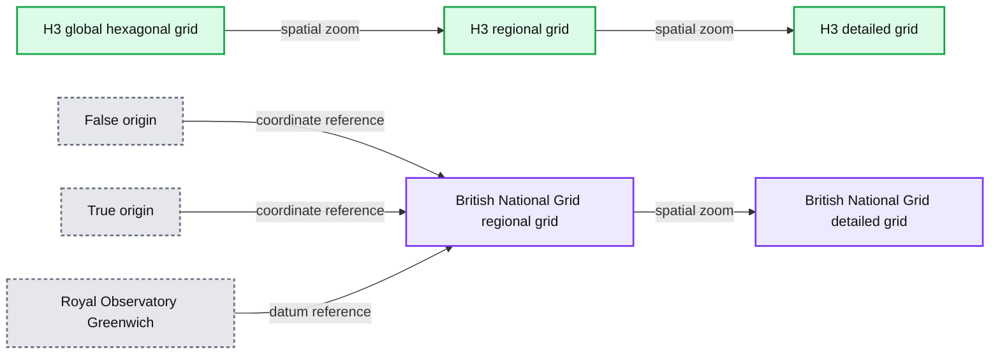
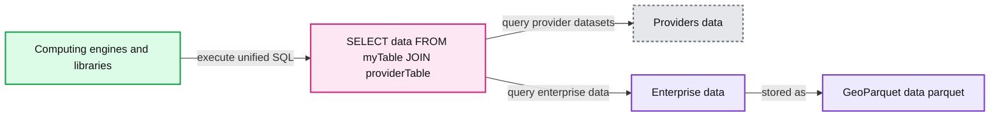
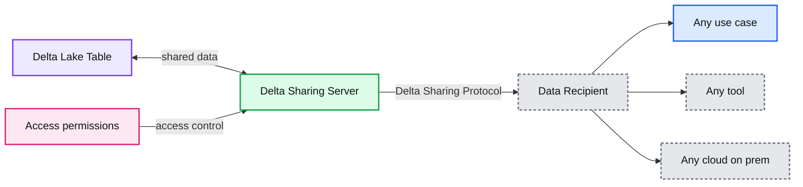

# Building Geospatial Data Products

- Source: https://www.databricks.com/blog/2023/01/06/building-geospatial-data-products.html
- Published: 2023-01-06
- Authors: Milos Colic
- Categories: engineering, data-science-machine-learning
- Images: 8 total, 3 extracted as architecture

This blog is outdated. Please refer to [this Spatial SQL blog](https://www.databricks.com/blog/introducing-spatial-sql-databricks-80-functions-high-performance-geospatial-analytics) for up-to-date approaches to storing and processing geospatial data within your Databricks Lakehouse.

Geospatial data has been driving innovation for centuries, through use of maps, cartography and more recently through digital content. For example, the oldest map has been found etched in a piece of mammoth tusk and dates [approximately 25000 BC](https://en.wikipedia.org/wiki/History_of_cartography). This makes geospatial data one of the oldest data sources used by society to make decisions. A more recent example, labeled as the birth of spatial analysis, is that of Charles Picquet in 1832 who used geospatial data to analyze [Cholera outbreaks in Paris](https://gallica.bnf.fr/ark:/12148/bpt6k842918.image), a couple of decades later John Snow in 1854 followed the same approach for [Cholera outbreaks in London](https://en.wikipedia.org/wiki/1854_Broad_Street_cholera_outbreak). These two individuals used geospatial data to solve one of the toughest problems of their times and in effect save countless lives. Fast tracking to the 20th century, the concept of [Geographic Information Systems (GIS)](https://education.nationalgeographic.org/resource/geographic-information-system-gis) was [first introduced](https://gisandscience.files.wordpress.com/2012/08/3-an-introduction-to-the-geo-information-system-of-the-canada-land-inventory.pdf) in 1967 in Ottawa, Canada by the Department of Forestry and Rural Development.

Today we are in the midst of the cloud computing industry revolution - supercomputing scale available to any organization, virtually infinitely scalable for both storage and compute. Concepts like [data mesh](https://www.databricks.com/blog/building-data-mesh-based-databricks-lakehouse-part-2) and [data marketplace](https://www.databricks.com/blog/2022/06/28/introducing-databricks-marketplace-an-open-marketplace-for-all-data-and-ai-assets.html) are emerging within the data community to address questions like platform federation and interoperability. How can we adopt these concepts to geospatial data, spatial analysis and GIS systems? By adopting the concept of data products and approaching the design of geospatial data as a product.

In this blog we will provide a point of view on how to design scalable geospatial data products that are modern and robust. We will discuss how Databricks Lakehouse Platform can be used to unlock the full potential of geospatial products that are one of the most valuable assets in solving the toughest problems of today and the future.

## What is a data product? And how to design one?

The most broad and the most concise definition of a "data product" was coined by DJ Patil (the first U.S. Chief Data Scientist) in [Data Jujitsu: The Art of Turning Data into Product](https://books.google.co.uk/books?id=TbXXWxDE8oMC&printsec=frontcover&redir_esc=y#v=onepage&q&f=false): "a product that facilitates an end goal through the use of data". The complexity of this definition (as admitted by Patil himself) is needed to encapsulate the breadth of possible products, to include dashboards, reports, excel spreadsheets, and even csv extracts shared via emails. You might notice that the examples provided deteriorate rapidly in quality, robustness and governance.

What are the concepts that differentiate a successful product versus an unsuccessful one? Is it the packaging? Is it the content? Is it the quality of the content? Or is it only the product adoption in the market? Forbes [defines](https://www.forbes.com/sites/kevinharrington/2013/10/08/10-qualities-of-a-successful-product/) the 10 must haves of a successful product. A good framework to summarize this is through the [value pyramid](https://www.mindtheproduct.com/what-qualities-make-a-product-great/#:~:text=Conclusion,the%20more%20they%20are%20used.).

[Figure 1: Product value pyramid (](https://www.databricks.com/sites/default/files/inline-images/db-435-blog-image-1.png)[source](https://www.mindtheproduct.com/what-qualities-make-a-product-great#:~:text=Conclusion,the%20more%20they%20are%20used.)[)](https://www.databricks.com/sites/default/files/inline-images/db-435-blog-image-1.png)

The value pyramid provides a priority on each aspect of the product. Not every value question we ask about the product carries the same amount of weight. If the output is not useful none of the other aspects matter - the output isn't really a product but becomes more of a *data pollutant *to the pool of useful results. Likewise, scalability only matters after simplicity and explainability are addressed.

How does the value pyramid relate to the data products? Each data output, in order to be a data product:

- **Should have clear usefulness.** The amount of the data society is generating is rivaled only by the amount of *data pollutants* we are generating. These are outputs lacking clear value and use, much less a strategy for what to do with them.
- **Should be explainable.** With the emergence of AI/ML, explainability has become even more important for data driven decision making. Data is as good as the metadata describing it. Think of it in terms of food - taste does matter, but a more important factor is the nutritional value of ingredients.
- **Should be simple.** An example of product misuse is using a fork to eat cereal instead of using a spoon. Furthermore, simplicity is essential but not sufficient, beyond simplicity the products should be intuitive. Whenever possible both intended and unintended uses of the data should be obvious.
- **Should be scalable.** Data is one of the few resources that grows with use. The more data you process the more data you have. If both inputs and outputs of the system are unbounded and ever-growing then the system has to be scalable in compute power, storage capacity and compute expressive power. Cloud data platforms like Databricks are in a unique position to answer for all of the three aspects.
- **Should generate habits.** In the data domain we are not concerned with customer retention as is the case for the retail products. However, the value of habit generation is obvious if applied to best practices. The systems and data outputs should exhibit the best practices and promote them *- it should be easier to use the data and the system in the intended way than the opposite.*

The geospatial data should adhere to all the aforementioned aspects, any data products should. On top of this tall order, geospatial data has some specific needs.

## Geospatial data standards

Geospatial data standards are used to ensure that geographic data is collected, organized, and shared in a consistent and reliable way. These standards can include guidelines for things like data formatting, coordinate systems, map projections, and metadata. Adhering to standards makes it easier to share data between different organizations, allowing for greater collaboration and broader access to geographic information.

The [Geospatial Commision (UK Government)](https://www.gov.uk/government/organisations/geospatial-commission) has defined the [UK Geospatial Data Standards Register](https://www.gov.uk/government/publications/uk-geospatial-data-standards-register/national-geospatial-data-standards-register) as a central repository for data standards to be applied in the case of geospatial data. Furthermore, the mission of this registry is to:

- *"Ensure UK geospatial data is more consistent and coherent and usable across a wider range of systems."* - These concepts are a call out for the importance of explainability, usefulness and habit generation (possibly other aspects of the value pyramid).
- *"Empower the UK geospatial community to become more engaged with the relevant standards and standards bodies."* - Habit generation within the community is as important as the robust and critical design on the standard. If not adopted standards are useless.
- *"Advocate the understanding and use of geospatial data standards within other sectors of government."* - Value pyramid applies to the standards as well - concepts like ease of adherence (usefulness/simplicity), purpose of the standard (explainability/usefulness), adoption (habit generation) are critical for the value generation of a standard.

A critical tool for achieving the data standards mission is the [FAIR](https://www.go-fair.org/fair-principles/) data principles:

- **F**indable - The first step in (re)using data is to find them. Metadata and data should be easy to find for both humans and computers. Machine-readable metadata are essential for automatic discovery of datasets and services.
- **A**ccessible - Once the user finds the required data, she/he/they need to know how they can be accessed, possibly including authentication and authorisation.
- **I**nteroperable - The data usually needs to be integrated with other data. In addition, the data needs to interoperate with applications or workflows for analysis, storage, and processing.
- **R**eusable - The ultimate goal of FAIR is to optimize the reuse of data. To achieve this, metadata and data should be well-described so that they can be replicated and/or combined in different settings.

We share the belief that the FAIR principles are crucial for the design of scalable data products we can trust. To be fair FAIR is based on common sense, so why is it key to our considerations? *"What I see in FAIR is not new in itself, but what it does well is to articulate, in an accessible way, the need for a holistic approach to data improvement. This ease in communication is why FAIR is being used increasingly widely as an umbrella for data improvement - and not just in the geospatial community."* - [A FAIR wind sets our course for data improvement](https://geospatialcommission.blog.gov.uk/2022/03/02/a-fair-wind-sets-our-course-for-data-improvement/).

To further support this approach, the [Federal Geographic Data Committee](https://www.fgdc.gov/standards) has developed the [National Spatial Data Infrastructure (NSDI) Strategic Plan](https://www.fgdc.gov/nsdi-plan/nsdi-strategic-plan-2021-2024.pdf) that covers the years 2021-2024 and was approved in November 2020. The goals of NSDI are in essence FAIR principles and convey the same message of designing systems that promote the circular economy of data - data products that flow between organizations following common standards and in each step through the data supply chain unlock new value and new opportunities. The fact that these principles are permeating different jurisdictions and are adopted across different regulators is a testament to the robustness and soundness of the approach.

[Figure 2: NDSI Strategic Goals](https://www.databricks.com/sites/default/files/inline-images/db-435-blog-image-2.png)

The FAIR concepts weave really well together with the data product design. In fact FAIR is traversing the whole product value pyramid and forms a value cycle. By adopting both the value pyramid and FAIR principles we design data products with both internal and external outlook. This promotes data reuse as opposed to data accumulation.

[Figure 3: FAIR + Value Pyramid](https://www.databricks.com/sites/default/files/inline-images/db-435-blog-image-3.png)

 

Why do FAIR principles matter for geospatial data and geospatial data products? FAIR is transcendent to geospatial data, it is actually transcendent to data, it is a simple yet coherent system of guiding principles for good design - and that good design can be applied to anything including geospatial data and geospatial systems.

 

## Grid index systems

In traditional GIS solutions' performance of spatial operations are usually achieved by building tree structures ([KD trees](https://en.wikipedia.org/wiki/K-d_tree), [ball trees](https://www.researchgate.net/publication/283471105_Ball-tree_Efficient_spatial_indexing_for_constrained_nearest-neighbor_search_in_metric_spaces), [Quad trees](https://en.wikipedia.org/wiki/Quadtree), etc). The issue with tree approaches is that they eventually break the scalability principle - when the data is too big to be processed in order to build the tree and the computation required to build the tree is too long and defeats the purpose. This also negatively affects the accessibility of data, if we cannot construct the tree we cannot access the complete data and in effect we cannot reproduce the results. In this case, grid index systems provide a solution.

Grid index systems are built from the start with the scalability aspects of the geospatial data in mind. Rather than building the trees, they define a series of grids that cover the area of interest. In the case of [H3](https://h3geo.org/) (pioneered by Uber), the grid covers the area of the Earth, in the case of local grid index systems (e.g. [British National Grid](https://en.wikipedia.org/wiki/Ordnance_Survey_National_Grid)) they may only cover the specific area of interest. These grids are composed of cells that have unique identifiers. There is a mathematical relationship between location and the cell in the grid. This makes the grid index systems very scalable and parallel in nature.

*Figure 4: Grid Index Systems (H3, British National Grid)*

**Summary:** The figure shows hierarchical spatial grid indexing, contrasting global H3 hexagonal cells with the British National Grid’s local square cells and zoomed grid references.

**Components:**

- H3 global hexagonal grid
- British National Grid
- H3 regional grid
- H3 detailed grid
- British National Grid regional grid
- British National Grid detailed grid
- Royal Observatory Greenwich
- False origin
- True origin

**Flows:**

- H3 global hexagonal grid -> H3 regional grid: spatial zoom
- H3 regional grid -> H3 detailed grid: spatial zoom
- British National Grid regional grid -> British National Grid detailed grid: spatial zoom
- False origin -> British National Grid regional grid: coordinate reference
- True origin -> British National Grid regional grid: coordinate reference
- Royal Observatory Greenwich -> British National Grid regional grid: datum reference

**Numbers:**

- 500 km
- 100 km
- 10 km
- 1 km
- 62°N
- 60°N
- 58°N
- 56°N
- 54°N
- 52°N
- 50°N
- 10°W
- 8°W
- 6°W
- 4°W
- 2°W
- 0°
- 2°E
- 4°E
- TQ 389 773
- Grid references and cell labels ranging from 00 through 99

source image: https://www.databricks.com/sites/default/files/inline-images/db-435-blog-image-4.png

[Figure 4: Grid Index Systems (H3, British National Grid)](https://www.databricks.com/sites/default/files/inline-images/db-435-blog-image-4.png)

Another important aspect of grid index systems is that they are open source, allowing index values to be universally leveraged by data producers and consumers alike. Data can be enriched with the grid index information at any step of its journey through the data supply chain. This makes the grid index systems an example of community driven data standards. Community driven data standards by nature do not require enforcement, which fully adheres to the habit generation aspect of value pyramid and meaningfully addresses interoperability and accessibility principles of FAIR.

[Figure 5: Example of using H3 to express flight holding patterns](https://www.databricks.com/sites/default/files/inline-images/db-435-blog-image-5.png)

Databricks has recently announced [native support for the H3 grid index system](https://www.databricks.com/blog/2022/09/14/announcing-built-h3-expressions-geospatial-processing-and-analytics.html) following the same value proposition. Adopting common industry standards driven by the community is the only way to properly drive habit generation and interoperability. To strengthen this statement, organizations like [CARTO](https://carto.com/blog/hexagons-for-location-intelligence/) , [ESRI](https://www.esri.com/arcgis-blog/products/bus-analyst/analytics/using-uber-h3-hexagons-arcgis-business-analyst-pro/) and [Google](https://opensource.googleblog.com/2017/12/announcing-s2-library-geometry-on-sphere.html) have been promoting the usage of grid index systems for scalable GIS system design. In addition, Databricks Labs project [Mosaic](https://databrickslabs.github.io/mosaic/) supports the [British National Grid](https://en.wikipedia.org/wiki/Ordnance_Survey_National_Grid) as the standard grid index system that is widely used in the UK government. Grid index systems are key for the scalability of geospatial data processing and for properly designing solutions for complex problems (e.g. figure 5 - flight holding patterns using H3).

## Geospatial data diversity

Geospatial data standards spend a solid amount of effort regarding data format standardization, and format for that matter is one of the most important considerations when it comes to interoperability and reproducibility. Furthermore, if the reading of your data is complex - how can we talk about simplicity? Unfortunately geospatial data formats are typically complex, as data can be produced in a number of formats including both open source and vendor-specific formats. Considering only vector data, we can expect data to arrive in WKT, WKB, GeoJSON, web CSV, CSV, Shape File, GeoPackage, and many others. On the other hand, if we are considering raster data we can expect data to arrive in any number of formats such as GeoTiff, netCDF, GRIB, or GeoDatabase; for a comprehensive list of formats please consult this [blog](https://gisgeography.com/gis-formats/).

Geospatial data domain is so diverse and has organically grown over the years around the use cases it was addressing. Unification of such a diverse ecosystem is a massive challenge. A recent effort by the Open Geospatial Consortium (OGC) to standardize to [Apache Parquet](https://parquet.apache.org/) and its geospatial schema specification [GeoParquet](https://geoparquet.org/) is a step in the right direction. Simplicity is one of the key aspects of designing a good scalable and robust product - unification leads to simplicity and addresses one of the main sources of friction in the ecosystem - the data ingestion. Standardizing to GeoParquet brings a lot of value that addresses all of the aspects of FAIR data and value pyramid.

*Figure 6: Geoparquet as a geospatial standard data format*

**Summary:** The diagram shows computing engines and libraries querying cloud provider data and enterprise GeoParquet data through a unified SQL interface.

**Components:**

- Computing engines and libraries: BigQuery, Databricks, Amazon Redshift, Snowflake, GeoPandas, Dremio, GDAL, Presto, Apache Spark
- SQL query: `SELECT data FROM myTable JOIN providerTable`
- Providers data: CARTO, Foursquare, Planet, SafeGraph
- Enterprise data: `data.parquet`

**Flows:**

- Computing engines and libraries -> SQL query: execute unified SQL
- SQL query -> Providers data: query provider datasets
- SQL query -> Enterprise data: query GeoParquet data

**Numbers:** none

source image: https://www.databricks.com/sites/default/files/inline-images/db-435-blog-image-6.png

[Figure 6: Geoparquet as a geospatial standard data format](https://www.databricks.com/sites/default/files/inline-images/db-435-blog-image-6.png)

Why introduce another format into an already complex ecosystem? GeoParquet isn't a new format - it is a schema specification for Apache Parquet format that is already widely adopted and used by the industry and the community. Parquet as the base format supports binary columns and allows for storage of arbitrary data payload, at the same time the format supports structured data columns that can store metadata together with the data payload. This makes it a choice that promotes interoperability and reproducibility. Finally, [Delta Lake](https://delta.io/) format has been built on top of parquet and brings [ACID](https://en.wikipedia.org/wiki/ACID) properties to the table. ACID properties of a format are crucial for reproducibility and for trusted outputs. In addition, delta is the format used by scalable data sharing solution [Delta Sharing](https://www.databricks.com/product/delta-sharing). Delta sharing enables enterprise scale data sharing between any public cloud using Databricks (DIY options for private cloud are available using open source building blocks). Delta sharing completely abstracts the need for custom built Rest APIs for exposing data to other 3rd parties. Any data asset stored in delta (using GeoParquet schema) automatically becomes a data product that can be exposed to external parties in a controlled and governed manner. Delta sharing has been built from the ground up with [security best practices in mind](https://www.databricks.com/blog/2022/08/01/security-best-practices-for-delta-sharing.html?utm_source=bambu&amp%3Butm_medium=social&amp%3Butm_campaign=advocacy&amp%3Bblaid=3352307).

*Figure 7: Delta sharing simplifying data access in the ecosystem*

**Summary:** Delta Sharing connects a data provider’s Delta Lake Table and Delta Sharing Server to recipients across use cases, tools, and cloud environments.

**Components:**

- Data Provider
- Delta Lake Table
- Delta Sharing Server
- Access permissions
- Delta Sharing Protocol
- Data Recipient
- Use cases: Analytics, BI, Data Science
- Tools: Power BI, Apache Spark, pandas, Tableau, Java
- Cloud and deployment environments: Google Cloud, AWS, Microsoft Azure, On-premises
- Databricks

**Flows:**

- Delta Lake Table -> Delta Sharing Server: shared data
- Delta Sharing Server -> Data Recipient: Delta Sharing Protocol
- Access permissions -> Delta Sharing Server: access control

**Numbers:** none

source image: https://www.databricks.com/sites/default/files/inline-images/db-435-blog-image-7.png

[Figure 7: Delta sharing simplifying data access in the ecosystem](https://www.databricks.com/sites/default/files/inline-images/db-435-blog-image-7.png)

## Circular data economy

Borrowing the concepts from the sustainability domain, we can define a circular data economy as a system in which data is collected, shared, and used in a way that maximizes its value while minimizing waste and negative impacts, such as unnecessary compute time, untrustworthy insights, or biased actions based data pollutants. Reusability is the key concept in this consideration, how can we minimize the "reinvention of the wheel". There are countless data assets out in the wild that represent the same area, same concepts with just ever slight alterations to better match a specific use case. Is this due to the actual optimizations or due to the fact it was easier to create a new copy of the assets than to reuse the existing ones? Or was it too hard to find the existing data assets, or maybe it was too complex to define data access patterns.

Data asset duplication has many negative aspects in both FAIR considerations and data value pyramid considerations - having many disparate similar (but different) data assets that represent the same area and same concepts can deteriorate simplicity considerations of the data domain - it becomes hard to identify the data asset we actually can trust. It can also have very negative implications towards habit generation, many niche communities will emerge that will standardize to themselves ignoring the best practices of the wider ecosystem, or worse yet they will not standardize at all.

In a circular data economy, data is treated as a valuable resource that can be used to create new products and services, as well as improving existing ones. This approach encourages the reuse and recycling of data, rather than treating it as a disposable commodity. Once again, we are using the sustainability analogy in a literal sense - we argue that this is the correct way of approaching the problem. Data pollutants are a real challenge for organizations both internally and externally. [An article by The Guardian](https://www.theguardian.com/news/datablog/2012/dec/19/big-data-study-digital-universe-global-volume) states that less than 1% of collected data is actually analyzed. There is too much data duplication, the majority of data is hard to access and deriving actual value is too cumbersome. Circular data economy promotes best practices and reusability of existing data assets allowing for a more consistent interpretation and insights across the wider data ecosystem.

[Figure 8: Databricks marketplace](https://www.databricks.com/sites/default/files/inline-images/db-435-blog-image-8.png)

Interoperability is a key component of FAIR data principles, and from interoperability a question of circularity comes to mind. How can we design an ecosystem that maximizes data utilization and data reuse? Once again, FAIR together with the value pyramid holds answers. Findability of the data is key to the data reuse and to solving for data pollution. With data assets that can be discovered easily we can avoid the recreation of same data assets in multiple places with just slight alteration, instead we gain a coherent data ecosystem with data that can be easily combined and reused. Databricks has recently announced the [Databricks Marketplace](https://www.databricks.com/blog/2022/06/28/introducing-databricks-marketplace-an-open-marketplace-for-all-data-and-ai-assets.html). The idea behind the marketplace is in line with the original definition of data product by DJ Patel. The marketplace will support sharing of datasets, notebooks, dashboards, and machine learning models. The critical building block for such a marketplace is the concept of delta sharing - the scalable, flexible and robust channel for sharing any data - geospatial data included.

Designing scalable data products that will live in the Marketplace is crucial. In order to maximize the value add of each data product one should strongly consider FAIR principles and the product value pyramid. Without these guiding principles we will only increase the issues that are already present in the current systems. Each data product should solve a unique problem and should solve it in a simple, reproducible and robust way.

You can read more on how Databricks Lakehouse Platform can help you accelerate time to value from your data products in the [eBook- A New Approach to data sharing](https://www.databricks.com/p/ebook/a-new-approach-to-data-sharing).
