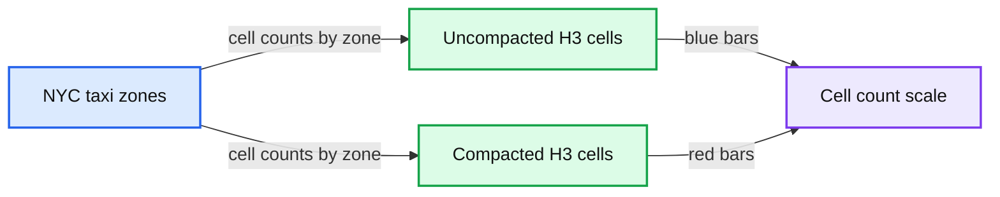
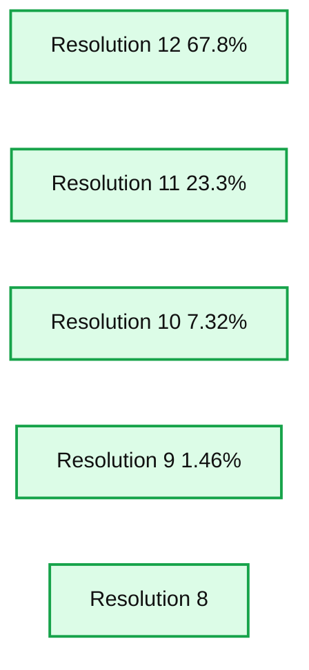
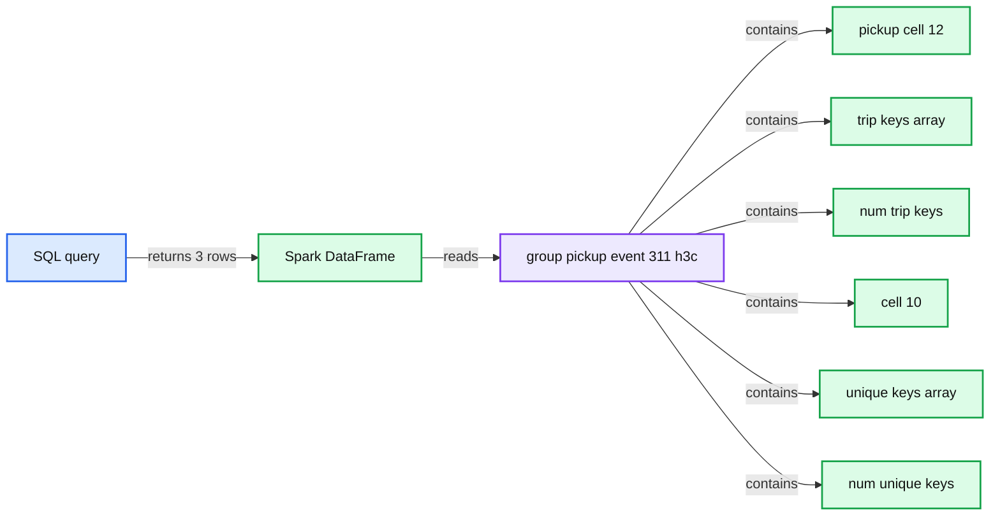

# Supercharging H3 for Geospatial Analytics

- Source: https://www.databricks.com/blog/2023/01/12/supercharging-h3-geospatial-analytics.html
- Published: 2023-01-12
- Authors: Kent Marten, Michael Johns, Menelaos Karavelas, Desmond Cheong
- Categories: platform, product, data-warehousing
- Images: 8 total, 4 extracted as architecture

For working with geospatial data, see this post from Databricks announcing support for Spatial SQL: [Introducing Spatial SQL in Databricks: 80+ Functions for High-Performance Geospatial Analytics](https://www.databricks.com/blog/introducing-spatial-sql-databricks-80-functions-high-performance-geospatial-analytics)

On the heels of the initial release of [H3 support in Databricks Runtime (DBR](https://www.databricks.com/blog/2022/09/14/announcing-built-h3-expressions-geospatial-processing-and-analytics.html)), we are happy to share ground-breaking performance improvements with H3, support for four additional expressions, and availability in [Databricks SQL](https://www.databricks.com/product/databricks-sql). In this blog, you will learn about the new expressions, performance benchmarks from our vectorized columnar implementation, and multiple approaches for point-in-polygon spatial joins using H3.

## Supercharging H3 performance

When we implemented built-in H3 capabilities in Databricks [[AWS](https://docs.databricks.com/sql/language-manual/sql-ref-h3-geospatial-functions.html) | [ADB](https://learn.microsoft.com/en-us/azure/databricks/sql/language-manual/sql-ref-h3-geospatial-functions) | [GCP](https://docs.gcp.databricks.com/sql/language-manual/sql-ref-h3-geospatial-functions.html)], we committed to making it best-in-class. Ultimately, this comes down to useful APIs and performance. Our original goals aimed at improving the performance of H3 expressions in [Photon](https://www.databricks.com/product/photon) by at least 20%. The results are far more exciting and impressive. In the table below, we have categorized each H3 expression by functional category and measured each function's performance against the performance of using the Java H3 library implementation (essentially, what you would get when importing the H3 library).

We strongly recommend using the BIGINT representation of H3 cell IDs. Comparing H3 cell IDs in H3-based joins using the BIGINT representation is more performant compared to using the STRING representation. We also strongly recommend using the H3 expression overloads that take BIGINTs as inputs. Moreover, for the expressions that would be typically used in H3-based joins, namely the traversal and predicate expressions, **the absolute runtime performance of the BIGINT-based expressions is several times faster than the STRING-based ones.**

| **Functional** **Category** | **Average** **Performance** **Gain** | **Expressions** | **Performance Gain** **DOUBLE inputs for longlat expressions** **WKB, WKT, GeoJSON for point or polyfill** |  |
|---|---|---|---|---|
| Import | 1.4x | h3_longlatash3 | 1.3x |  |
| h3_longlatash3string | 1.8x |  |  |  |
| h3_pointash3 | 1.7x |  |  |  |
| h3_pointash3string | 1.7x |  |  |  |
| h3_polyfillash3 | 1.2x |  |  |  |
| h3_polyfillash3string | 1.2x |  |  |  |
| h3_try_polyfillash3 | 1.2x |  |  |  |
| h3_try_polyfillash3string | 1.2x |  |  |  |
|  |  |  | **Performance Gain** **BIGINT** | **Performance Gain** **STRING** |
| Export | 1.5x | h3_boundaryasgeojson | 1.7x | 1.6x |
| h3_boundaryaswkb | 1.1x | 1.5x |  |  |
| h3_boundaryaswkt | 1.6x | 1.6x |  |  |
| h3_centerasgeojson | 1.8x | 1.9x |  |  |
| h3_centeraswkb | 1.3x | 1.8x |  |  |
| h3_centeraswkt | 1.7x | 1.9x |  |  |
| Conversions | 5.8x | h3_h3tostring | 4.2x | n/a |
| h3_stringtoh3 | n/a | 7.3x |  |  |
| Predicates & Validity | 5.5x | h3_ischildof | 1.5x | 12.0x |
| h3_ispentagon | 2.4x | 7.2x |  |  |
| h3_isvalid | 2.8x | 6.3x |  |  |
| h3_try_validate | 2.8x | 12.0x |  |  |
| h3_validate | 2.7x | 11.7x |  |  |
| Proximity | 2.0x | h3_distance | 1.9x | 2.7x |
| h3_hexring | 1.2x | 3.1x |  |  |
| h3_kring | 1.2x | 3.0x |  |  |
| h3_kringdistances | 1.2x | 2.7x |  |  |
| Traversal | 6.1x | h3_maxchild | 1.5x | 9.2x |
| h3_minchild | 1.4x | 9.0x |  |  |
| h3_resolution | 1.3x | 7.9x |  |  |
| h3_tochildren | 9.5x | 7.9x |  |  |
| h3_toparent | 2.9x | 10.8x |  |  |
| Compaction | 4.5x | h3_compact | 1.5x | 4.2x |
| h3_uncompact | 3.7x | 8.6x |  |  |

### What H3 expressions are new in Databricks SQL and Runtime?

There are four new expressions for using H3 for spatial analysis, starting with DBR 11.3 and available in current Databricks SQL. The first two, [`h3_maxchild`](https://docs.databricks.com/sql/language-manual/functions/h3_maxchild.html) and [`h3_minchild`](https://docs.databricks.com/sql/language-manual/functions/h3_minchild.html) provide an efficient method for traversing different resolutions of the indexing hierarchy. Here is an example for the min/max child expressions in action (tables not included):

- Points table: Includes h3_15 as a column with H3 cells at resolution 15.
- Polygons table: Includes h3_15_c as a column with compacted H3 cells (whose original resolutions were 15), and id as a column of polygon IDs.

The following query counts the number of points inside each polygon:

The min/max child expressions allow you to operate on H3 cell IDs that have resulted from compacting polygons and can act as filters to potentially speed up queries.

We also added simple functions for indexing point data that is already stored in a common geometry format: WKT, WKB, or GeoJSON. The functions are [`h3_pointash3`](https://docs.databricks.com/sql/language-manual/functions/h3_pointash3.html) and [`h3_pointash3string`](https://docs.databricks.com/sql/language-manual/functions/h3_pointash3string.html), and return H3 cell IDs as BIGINTs or STRINGs, respectively.

### Approximate point-in-polygon with H3 hierarchy

#### Query Pattern: Single Resolution Join

In a [previous blog](https://www.databricks.com/blog/2022/12/13/spatial-analytics-any-scale-h3-and-photon.html), we introduced point-in-polygon join approaches with and without H3. Here we want to briefly consider how to take advantage of the H3 hierarchy, starting from the same `*trip_h3*` and `*taxi_zone_h3*` tables and the following initial query:

We were able to achieve 1.22B approximate point-in-polygon in 1.4 minutes on 10 AWS m5d.4xlarge workers by preparing both the H3 tables with trip pickup (point) and taxi zone (polygon) geometries at H3 resolution 12, z-ordered by the cells for performance.

#### Hierarchy Query Pattern: Test H3 Parent Matches Join

Following on from the single resolution query pattern, we can improve performance further with the same cluster configuration by adding h3_toparent clause to test for trip and taxi zones having a matching H3 resolution 8 parent prior to testing for resolution 12 equality. **With the inclusion of an additional **[`**h3_toparent**`](https://docs.databricks.com/sql/language-manual/functions/h3_toparent.html)** clause, the same query can execute in just over 45 seconds, a 40% improvement!** This is because the data is more readily partitioned on the cluster by resolution 8 cells, which helps optimize query planning. See included notebook, [*H3 ToParent Discrete Spatial Analysis*](https://www.databricks.com/wp-content/uploads/notebooks/nb01-h3-toparent-discrete-spatial-analysis.html), for more; these queries can also be run in [DBSQL](https://docs.databricks.com/sql/index.html#what-is-databricks-sql).

The call to `h3_toparent` is fast and can be done on-the-fly or pre-computed as a column in your table. There are some hidden considerations when choosing the right parent. *A general rule of thumb is to pick a parent resolution at or around the minimum resolution you would get when compacting cells*. Even if you are not following a compact pattern, the information can be useful to inform queries that use the H3 hierarchy.

#### Hierarchy query pattern: H3 compact join

While using [`h3_polyfillash3`](https://docs.databricks.com/sql/language-manual/functions/h3_polyfillash3.html) to store and [ZORDER](https://docs.databricks.com/delta/data-skipping.html#data-skipping-with-z-order-indexes-for-delta-lake) polygons to a single H3 resolution as in the previous (non-compacted) query patterns yields the best overall performance for the NYC example, compacting polygon cells with [`h3_compact`](https://docs.databricks.com/sql/language-manual/functions/h3_compact.html) from a given resolution can also be beneficial. This operation analyzes an array of cells to find groups of provided child cells that can be reduced to their parents. **Compacting taxi zones, starting from resolution 12, results in 10x fewer cells after the operation.**

[Newark airport compacted from resolution 12 (left) and uncompacted to resolution 12 (right).](https://www.databricks.com/sites/default/files/inline-images/db-446-blog-img-1.png)

As the figure above shows, cell compaction can significantly reduce the number of cells per polygon. The image on the right is what you have before compaction and is the identical result after using [h3_uncompact](https://docs.databricks.com/sql/language-manual/functions/h3_uncompact.html) back to resolution 12. This means **h3_uncompact can *****safely***** return the same cells as those provided as input to h3_compact.**

As a notable example of cell reduction, taxi zone *Bloomfield / Emerson Hill* at the far left of the chart below goes from ~63K non-compacted resolution 12 cells (shown in blue) down to only ~2K compacted cells (shown in red).

*Comparison of NYC taxi zone H3 uncompacted at resolution 12 versus compacted.*

**Summary:** Bar chart comparing uncompacted and compacted H3 cell counts across NYC taxi zones.

**Components:**

- NYC taxi zones on the x axis
- SUM cell count uncompacted H3 cells shown in blue
- SUM compacted H3 cells shown in red
- Cell count scale on the y axis

**Flows:**

- NYC taxi zones -> Uncompacted H3 cells: cell counts by zone
- NYC taxi zones -> Compacted H3 cells: cell counts by zone

**Numbers:** 5, 2, 1, 10k, 5k, 2k, 1k

source image: https://www.databricks.com/sites/default/files/inline-images/db-446-blog-img-2.png

[Comparison of NYC taxi zone H3 uncompacted at resolution 12 versus compacted.](https://www.databricks.com/sites/default/files/inline-images/db-446-blog-img-2.png)

Compaction produces cells over a range of resolutions, instead of just one. To work with the H3 hierarchy it is useful to understand that each hexagon parent has seven children (a handful of cells have six children) that are slightly rotated, shown on the right. While this will produce some rendering gaps, especially among even to odd resolutions, it is important to note that logical containment is exact **– H3 is a lossless index on top of cells with their hierarchy derived from a specific resolution**, such as with compaction.

[H3 hierarchy](https://www.databricks.com/sites/default/files/inline-images/db-446-blog-image-3.png)[(source)](https://h3geo.org/docs/highlights/indexing/)[.](https://www.databricks.com/sites/default/files/inline-images/db-446-blog-image-3.png)

*The use of h3_compact especially offers benefits for polygons with both dense and sparse areas, e.g. state, region, country level data.* Assuming you have a good polygon ID, exploding the compacted cells and z-ordering on them yields the best performance. It is important to note here that you must always begin with the same resolution for all of your data (in this case 12), or else you will lose logical hierarchy containment index guarantees and your results will be inconsistent:

In other words, starting from data with the same nominal H3 resolution, traversing the H3 hierarchy up and down, using H3 traversal functions, up to the nominal resolution of the data is safe and logically equivalent to operating on the original data at the nominal resolution.

Overall, compaction can result in order of magnitude reduction in cells, e.g. 2.5M non-compacted vs 200K total compacted for taxi zones. This is achieved by the reduction of most resolution 12 cells into resolutions 11 (*7x*ꜜ), 10 (*49x*ꜜ), 9 (*343x*ꜜ), and 8 (*2,401x*ꜜ) cells.

*Percentage of NYC taxi zone H3 resolutions 8-12 after compaction.*

**Summary:** The chart shows the percentage distribution of NYC taxi zone H3 resolutions after compaction.

**Components:**

- res_count: H3 resolution count distribution
- Resolution 12: 67.8%
- Resolution 11: 23.3%
- Resolution 10: 7.32%
- Resolution 9: 1.46%
- Resolution 8: remaining slice, visually negligible

**Flows:**

- none

**Numbers:** 12, 11, 10, 9, 8, 67.8%, 23.3%, 7.32%, 1.46%

source image: https://www.databricks.com/sites/default/files/inline-images/db-446-blog-image-4.png

[Percentage of NYC taxi zone H3 resolutions 8-12 after compaction.](https://www.databricks.com/sites/default/files/inline-images/db-446-blog-image-4.png)

If you try to uncompact at a resolution < 12 (the compact resolution), you will see something like the following error:

H3_compact can be applied in workloads where you want the benefits of storing fewer cells, in this case table `taxi_zone_h3c_explode`, with the downside of some increased computational complexity relative to the non-compact query patterns. **The following query completes in under 2 minutes on the same 10 worker cluster configuration as used in prior tests and finds the same 1.22B results.** *But, it is important to understand that the evaluation of additional clauses reduces performance by around 0.5x to 2x relative to the non-compact queries which run in as low as 45 seconds up to 1.4 minutes.* So, the trade-offs must be weighed.

Table `taxi_zone_h3c_explode` stores each compact polygon cell, `c_cell`, per row:

The query applies the previous parent pattern and further tests whether a pickup is one of the compact cell's children with [`h3_ischildof`](https://docs.databricks.com/sql/language-manual/functions/h3_ischildof.html). You can see the rendering gaps but also see that pickups that fall within the logical index space are still found.

[Compact cells for Newark Airport with pickups at resolution 12, same results as non-compact.](https://www.databricks.com/sites/default/files/inline-images/db-446-blog-img-5.png)

#### Hierarchy query pattern: unexploded H3 compact join

The use of `h3_compact` is hands-down the winning strategy for when you want to follow an unexploded join pattern, meaning you don't want to store a join table with each polygon cell per row as was shown above with table `*taxi_zone_h3c_explode*`, but rather want to keep join tables unexploded along your data processing pipeline.

One particularly good use of the unexploded pattern arises when you are dealing with coincidental polygons, such as with 311 service request calls which involve many, often overlapping, unique events rather than a fixed boundary such as with taxi zones. There are easily thousands of these events within each lower resolution H3 cell in the most densely populated areas of NYC like Manhattan. **If you wish to uniquely combine thousands of 311 events with millions of taxi pickups for some H3 cells, the combinatorial volume of rows can quickly, and perhaps unnecessarily, grow into the trillions!** Below is an example [Data Lineage](https://docs.databricks.com/data-governance/unity-catalog/data-lineage.html) within [Unity Catalog](https://www.databricks.com/product/unity-catalog) representing various 311 event and taxi pickup tables generated in support of an unexploded join pattern. We see tables derived from other tables and (not shown) can click on columns to understand how they were derived as well.

*Data Lineage for preparing compacted 311 events (to min res 10) joined with taxi pickups (res 12).*

**Summary:** Unity Catalog lineage showing compacted 311 event H3 data joined with taxi pickup data.

**Components:**

- `event_311_h3c_compacted`: Unity Catalog table containing compacted 311 event geometries.
- `event_311_h3c_explode`: Unity Catalog table containing exploded H3 cells.
- `event_311_h3c_min_max`: Unity Catalog table containing minimum and maximum H3 cell values.
- `event_311_h3c_cell_unique_keys`: Unity Catalog table containing unique event keys by cell.
- `trip_h3`: Unity Catalog table containing taxi trips with pickup and dropoff H3 cells.
- `cell_trips`: Unity Catalog table mapping pickup cells to trip keys.
- `group_pickup_event_311_h3c`: Unity Catalog table grouping pickup trips with 311 event cells.

**Flows:**

- `event_311_h3c_compacted -> event_311_h3c_explode`: compacted event cells are exploded.
- `event_311_h3c_explode -> event_311_h3c_min_max`: exploded cells provide minimum and maximum cell values.
- `event_311_h3c_min_max -> event_311_h3c_cell_unique_keys`: cell ranges produce unique event keys.
- `trip_h3 -> cell_trips`: taxi pickup cells provide trip keys.
- `cell_trips -> group_pickup_event_311_h3c`: pickup cell trip mappings are grouped.
- `event_311_h3c_cell_unique_keys -> group_pickup_event_311_h3c`: unique event keys are joined with pickup groups.

**Numbers:** 311, 3, 8, 10, 12, 38, 39, 42

```mermaid
%% Unity Catalog lineage for compacted 311 events joined with taxi pickups
flowchart LR
    A[event 311 h3c compacted] -->|compacted event cells| B[event 311 h3c explode]
    B -->|exploded cells| C[event 311 h3c min max]
    C -->|cell ranges| D[event 311 h3c cell unique keys]
    E[trip h3] -->|pickup cells and trip keys| F[cell trips]
    F -->|pickup mappings| G[group pickup event 311 h3c]
    D -->|unique event keys| G

    classDef client fill:#dbeafe,stroke:#2563eb,stroke-width:2px,color:#111
    classDef service fill:#dcfce7,stroke:#16a34a,stroke-width:2px,color:#111
    classDef store fill:#ede9fe,stroke:#7c3aed,stroke-width:2px,color:#111
    classDef cache fill:#fef3c7,stroke:#d97706,stroke-width:2px,color:#111
    classDef queue fill:#cffafe,stroke:#0891b2,stroke-width:2px,color:#111
    classDef critical fill:#fee2e2,stroke:#dc2626,stroke-width:4px,color:#111
    classDef external fill:#e5e7eb,stroke:#6b7280,stroke-width:2px,color:#111,stroke-dasharray:4 3
    classDef decision fill:#fce7f3,stroke:#db2777,stroke-width:2px,color:#111

    class A,B,C,D,E,F,G store
```

source image: https://www.databricks.com/sites/default/files/inline-images/db-446-blog-img-6.png

[Data Lineage for preparing compacted 311 events (to min res 10) joined with taxi pickups (res 12).](https://www.databricks.com/sites/default/files/inline-images/db-446-blog-img-6.png)

The first 3 tables on the bottom left of the provided lineage follow a common pattern of handling compaction on the event polygons, from which the unexploded join tables are derived:

1. `*event_311_h3c*` compacts from resolution 12 which returns cells at resolutions 10-12
2. `*event_311_h3c_explode*` explodes each compact event cell (`c_cell`) into its own row
3. `*event_311_h3c_min_max*` identifies the `cell_10` minimum resolution for each compact cell in the 311 events

From there, we generate table `*cell_unique_keys*` which groups event identifiers into an array per minimum compacted resolution 10. Along the top of the lineage, we generate table `*cell_trips*` which groups a generated identifier for taxi pickups (from `*trip_h3*`) into an array per resolution 12 cells. *These are effectively now unexploded tables with minimal columns.* Here is a simple join, which tests for whether pickup cell (at resolution 12) is a child of event cell parents (at resolution 10) via `h3_ischildof`:

The clause `pickup_cell_12 < 631300000000000000` is unique for the taxi data to filter out some missing or errant geospatial coordinates resulting in cells well outside the NYC area. With the query above, the two tables are joined on the far right of the lineage into table `*group_pickup_event_311_h3c*` which maintains columns for pickups at resolution 12 and array `trip_keys` as well as events at resolution 10 and array event `unique_keys`.

*Unexploded taxi pickups at resolution 12 joined with 311 events at resolution 10.*

**Summary:** A Databricks SQL result displays exploded taxi pickup cells joined with 311 event cells, including pickup keys and arrays of unique event keys.

**Components:**

- Databricks SQL query using Spark SQL
- `group_pickup_event_311_h3c` table
- `pickup_cell_12` column
- `trip_keys` array
- `num_trip_keys` column
- `cell_10` column
- `unique_keys` array
- `num_unique_keys` column

**Flows:**

- SQL query -> Spark DataFrame: retrieves 3 rows
- `pickup_cell_12` -> `trip_keys`: associates resolution 12 pickup cells with trip keys
- `cell_10` -> `unique_keys`: associates resolution 10 cells with unique 311 event keys

**Numbers:** 3 rows, 1 trip key, 244 unique keys, resolution 12, resolution 10, 0.85 seconds runtime, 5 days ago

source image: https://www.databricks.com/sites/default/files/inline-images/db-446-blog-img-7.png

[Unexploded taxi pickups at resolution 12 joined with 311 events at resolution 10.](https://www.databricks.com/sites/default/files/inline-images/db-446-blog-img-7.png)

Below are the 100K most active resolution 12 taxi pickup cells and their corresponding resolution 10 parents colored by intensity of 311 events. This is rendered from the table above by simply dropping the two arrays leaving columns: `pickup_cell_12`, `num_trip_keys`, `cell_10`, and `num_unique_keys`.

[Taxi pickups at resolution 12 joined with 311 events at resolution 10.](https://www.databricks.com/sites/default/files/inline-images/db-446-blog-img-8.jpg)

You have many different choices when applying Discrete Spatial Analysis techniques. We hope this blog, and the [previous](https://www.databricks.com/blog/2022/12/13/spatial-analytics-any-scale-h3-and-photon.html), proves helpful for you to consider options that best meet your needs. Here are a few takeaway to highlights:

- Depending on the size (area), complexity (number of vertices) of your polygons and the resolution you have chosen for [`h3_polyfillash3`](https://docs.databricks.com/sql/language-manual/functions/h3_polyfillash3.html), the cell count of the resulting *unexploded* array might be quite large. Also, challenges working with array data will grow relative to the number of polygons in your dataset. As such, consider exploding after polyfill.
- Performance gains can be achieved with an additional [`h3_toparent`](https://docs.databricks.com/sql/language-manual/functions/h3_toparent.html) clause to queries. The reason for this is that the data is more readily partitioned by lower resolution cells, prior to testing higher resolution cells, which helps optimize query planning.
- [`ZORDER`](https://docs.databricks.com/delta/data-skipping.html#data-skipping-with-z-order-indexes-for-delta-lake) is effective on columns with exploded cells; otherwise, you would z-order by another field that is used in various `WHERE` clauses.
- You need to be aware of the pseudo-hierarchical nature of H3 and work from a common starting resolution to preserve logical index guarantees.
- The use of [`h3_compact`](https://docs.databricks.com/sql/language-manual/functions/h3_compact.html) has a lot of benefits for polygons where there are dense and sparse areas, e.g. state, region and country level data. Assuming you have a good polygon ID, you can still do well to explode the compact cells and z-order on those.
- Compaction is also the winning strategy for when you want to follow an unexploded pattern, but beware of the trade-offs that go with this choice.

### What's next?

H3 is the foundation for discrete spatial analytics in Databricks and our team continues to explore how to make your queries more efficient and expressions more flexible. If you want to experiment with H3 or try it out for yourself - refer to our getting started materials [[AWS](https://docs.databricks.com/sql/language-manual/sql-ref-h3-geospatial-functions.html) | [ADB](https://learn.microsoft.com/en-us/azure/databricks/sql/language-manual/sql-ref-h3-geospatial-functions) | [GCP](https://docs.gcp.databricks.com/sql/language-manual/sql-ref-h3-geospatial-functions.html)]. If you are interested in looking more closely at the examples from this blog, you can refer to these notebooks – [*NB01: H3 ToParent Discrete Spatial Analysis*](https://www.databricks.com/wp-content/uploads/notebooks/nb01-h3-toparent-discrete-spatial-analysis.html) | [*NB02: H3 Compact Discrete Spatial Analysis*](https://www.databricks.com/wp-content/uploads/notebooks/nb02-h3-compact-discrete-spatial-analysis.html) | [*NB03: Coincidental Event Discrete Spatial Analysis*](https://www.databricks.com/wp-content/uploads/notebooks/nb03-coincidental-event-discrete-spatial-analysis.html).
