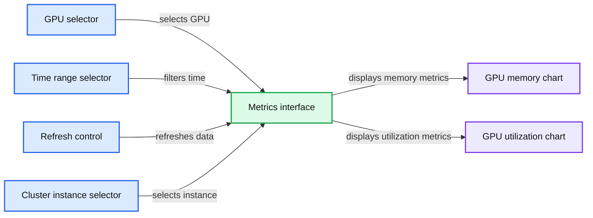

# Getting started with NLP using Hugging Face transformers pipelines

- Source: https://www.databricks.com/blog/2023/02/06/getting-started-nlp-using-hugging-face-transformers-pipelines.html
- Published: 2023-02-06
- Authors: Paul Ogilvie, Maddie Dawson
- Categories: engineering, data-science-machine-learning
- Images: 5 total, 1 extracted as architecture

Advances in Natural Language Processing (NLP) have unlocked unprecedented opportunities for businesses to get value out of their text data. Natural Language Processing can be used for a wide range of applications, including text summarization, named-entity recognition (e.g. people and places), sentiment classification, text classification, translation, and question answering. In many cases, you can get high-quality results from machine learning models that have been previously trained on large text datasets. Many of these pre-trained models are available in the open source and are free to use. [Hugging Face](https://huggingface.co/) is one great source of these models, and their [Transformers](https://huggingface.co/docs/transformers/index) library is an easy-to-use tool for applying the models and also adapting them to your own data. It's also possible to adjust these models using fine-tuning to your own data.

For example, a company with a support team could use pre-trained models to provide human-readable summaries of text to help employees quickly assess key issues in support cases. This company can also easily train world class classification algorithms based on the readily-available foundation models to automatically categorize their support data into their internal taxonomies.

Databricks is a great platform for running Hugging Face Transformers. Previous Databricks articles have discussed the use of transformers for [pre-trained model inference](https://www.databricks.com/blog/rapid-nlp-development-databricks-delta-and-transformers) and [fine-tuning](https://www.databricks.com/blog/2021/10/28/gpu-accelerated-sentiment-analysis-using-pytorch-and-huggingface-on-databricks.html), but this article consolidates those best practices to optimize performance and ease-of-use when working with transformers on the Lakehouse. This document includes in-line code samples alongside explanations of those best practices, and Databricks also provides complete notebook examples for pre-trained model inference and fine-tuning.

## Using pre-trained models

For many applications, such as sentiment analysis and text summarization, pre-trained models work well without any additional model training. 🤗 Transformers [pipelines](https://huggingface.co/docs/transformers/pipeline_tutorial) wrap the various components required for inference on text into a simple interface. For many NLP tasks, these components consist of a tokenizer and a model. Pipelines encode best practices, making it easy to get started. For example, pipelines make it easy to use GPUs when available and allow batching of items sent to the GPU for better throughput.

To distribute the inference on Spark, Databricks recommends encapsulating a pipeline in a [pandas UDF](https://www.databricks.com/blog/2020/05/20/new-pandas-udfs-and-python-type-hints-in-the-upcoming-release-of-apache-spark-3-0.html). Spark uses broadcast to efficiently transmit any objects required by the pandas UDFs to the worker nodes. Spark also automatically reassigns the GPUs to workers, so you can use a multi-GPU multi-machine cluster seamlessly.

Here's a sample summary for a snapshot of the Wikipedia article on the band Energy Orchard. Note that we did not clean up the Wikipedia markup before passing it to the summarizer.

Raw Wikipedia text for Energy Orchard

Output summary

This section demonstrated just how easy it is to get started using Hugging Face Transformers to process text at scale on Databricks. The next section describes how you can further tune the performance of these models.

### Tuning performance

There are two key aspects to tuning performance of the UDF. The first is that you want to use each GPU effectively, which you can adjust by changing the size of batch sizes for items sent to the GPU by the Transformers pipeline. The second is to make sure your dataframe is well-partitioned to utilize the entire cluster.

Your UDF should work out-of-the box with a `batch_size` of 1. However, this may not be efficiently utilizing the resources available to the workers. To get improved performance, you can tune the batch size to the model and hardware you are using. Databricks recommends trying various batch sizes for the pipeline on your cluster to find the best performance. Read more about pipeline batching and other [performance options](https://huggingface.co/docs/transformers/performance) in Hugging Face documentation. You can monitor GPU performance by viewing the live [metrics](https://docs.databricks.com/clusters/clusters-manage.html#cluster-metrics) for a cluster, such as "Per-GPU utilization" or “Per-GPU memory utilization (%)”.

*GPU utilization*

**Summary:** Databricks Metrics displays GPU memory utilization and GPU utilization over time for GPU 0.

**Components:**

- Databricks cluster metrics interface
- GPU selector
- Time range selector
- Refresh control
- Cluster instance selector
- Per GPU memory utilization chart
- Per GPU utilization chart

**Flows:**

- GPU selector -> Metrics charts: selects GPU metrics
- Time range selector -> Metrics charts: filters the displayed time window
- Refresh control -> Metrics charts: refreshes metric data
- Cluster instance selector -> Metrics charts: selects the monitored instance

**Numbers:** 1, 2023-04-18 14:20, 2023-04-18 14:35, i-019cab44630123c2b, GPU 0, 0%, 20%, 40%, 60%, 80%, 14:21, 14:23, 14:25, 14:27, 14:29, 14:31, 14:33, 14:35

source image: https://www.databricks.com/sites/default/files/inline-images/gpu-utilization.png

GPU utilization

Your goal with tuning the batch size is to set it large enough so that it drives the full GPU utilization but does not result in "CUDA out of memory" errors.

To make good utilization of the hardware in your cluster, you may need to repartition your Spark DataFrame. Generally some multiple of the number of GPUs on your workers (for GPU clusters) or number of cores across the workers in your cluster (for CPU clusters) works well in practice. Using the UDF is identical to using other UDFs on Spark. For example, you can use it in a select statement to create a column with the results of the model inference.

## Wrapping pre-built models as MLflow models

Storing a pre-trained model as an MLflow model makes it even easier to deploy a model for batch or [real-time inference](https://docs.databricks.com/mlflow/serverless-real-time-inference.html). This also allows model versioning through the [Model Registry](https://docs.databricks.com/mlflow/model-registry.html), and simplifies model loading code for your inference workloads.

The first step is to create a custom model for your pipeline, which encapsulates loading the model, initializing the GPU usage, and inference function.

The code closely parallels the code for creating and using a pandas_udf outlined above. One difference is that the pipeline is loaded from a file made available to the MLflow model's context. This is provided to MLflow when logging a model. Hugging Face transformers pipelines make it easy to save the model to a local file on the driver, which is then passed into the log_model function for the MLflow pyfunc interfaces.

## Batch inference using MLflow models

MLflow provides an easy interface to load any logged or registered model into a spark UDF. You can look up a model URI from the Model Registry or logged experiment run UI.

## Fine-tuning models on a single machine using 🤗 Transformers Trainer

Sometimes the pre-trained models do not serve your needs out-of-the-box and you must fine-tune the models on your own data. For example, you may want to create a text classifier based on a foundation model that classifies support tickets into your support teams' ontologies, or you may wish to create a custom spam classifier on your data.

You do not need to leave Databricks in order to fine-tune your models. For moderately sized datasets, you can do this on a single machine with GPU support. The Hugging Face transformers Trainer utility makes it very easy to set up and perform model training. For larger datasets, Databricks also supports [distributed multi-machine multi-GPU deep learning](https://docs.databricks.com/machine-learning/train-model/deep-learning.html).

The process is as follows: create a single machine cluster with GPU support, prepare and download your dataset to the driver, perform model training using Trainer, and log the resulting model to MLflow.

### Preparing and downloading data

Start by formatting your training data into a table meeting the expectations of the Trainer. For text classification, this is a table with two columns: a text column and a column of labels. In our [example notebook](https://www.databricks.com/wp-content/uploads/notebooks/mlflow-x-huggingface-finetune-a-text-classification-mode.dbc) we load some text message spam data:

Hugging Face transformers provides AutoModelForSequenceClassification as a model loader for text classification, which expects integer IDs as the category labels. However, you must also specify mappings from the integer labels to string labels and back. If you have a DataFrame with string labels, you can collect this information as follows:

Then create the integer ids as a label column with a `pandas_udf:`

Split the data into training/testing.

You can then use [Datasets](https://huggingface.co/docs/datasets/index) utilities to create training and evaluation datasets. Specifying a [DBFS](https://docs.databricks.com/dbfs/index.html) cache directory will allow you to efficiently download the dataset and reuse it in the future.

The model expects tokenized input, rather than the text in the downloaded data. To ensure compatibility with the base model, use the AutoTokenizer loaded from the base model. HuggingFace datasets allows you to directly apply the tokenizer consistently to both the training and testing data.

### Constructing a Trainer

The [Trainer](https://huggingface.co/docs/transformers/main/en/main_classes/trainer) classes need the user to provide metrics, a base model, and training configuration. By default, the Trainer will compute and use loss as a metric, which isn't very interpretable. Below is an example of creating metrics function that will additionally compute accuracy during model training.

For text classification, use [AutoModelForSequenceClassification](https://huggingface.co/docs/transformers/main/en/model_doc/auto#transformers.AutoModelForSequenceClassification) to load a base model for text classification. Here you provide the number of classes and the label mappings.

Finally, you must create the training configuration. The `TrainingArguments` class allows specification of the output directory, evaluation strategy, learning rate, and other [parameters](https://huggingface.co/docs/transformers/v4.26.0/en/main_classes/trainer#transformers.TrainingArguments).

Using a [data collator](https://huggingface.co/docs/transformers/main_classes/data_collator) batches input in training and evaluation datasets. Using the `DataCollatorWithPadding` with defaults gives good baseline performance for text classification.

With all of these parameters constructed, you can now create a Trainer.

### Running training and logging the model

Hugging Face interfaces nicely with MLflow, automatically logging metrics during model training using the [MLflowCallback](https://huggingface.co/docs/transformers/main/en/main_classes/callback#transformers.integrations.MLflowCallback). However, you must log the trained model yourself. Similar to the example above, Databricks recommends wrapping the trained model in a transformers pipeline and using MLflow's pyfunc `log_model` capabilities. To do so you will need a custom model class.

Wrap training in an mlflow run, constructing a transformers pipeline from tokenizer and the trained model, writing it to local disk. Finally, log the model to MLflow.

Loading the model for inference is the same as loading the MLflow wrapped pre-trained model.

This section demonstrated how you can directly use the Hugging Face Transformer Trainer APIs to fine-tune a model to a new text classification problem. You can fine-tune many more NLP models for a wide range of tasks, and the [AutoModel classes for Natural Language Processing](https://huggingface.co/docs/transformers/v4.26.0/en/model_doc/auto#natural-language-processing) provide a great foundation.

## Conclusion

This blog post demonstrated some best practices and showed how easy it is to get started using transformers for NLP tasks on Databricks.

The key points to recall for inference are:

- 🤗 Transformers pipelines make it easy to use transformers models,
- Repartition your data if needed to utilize the full cluster,
- You can tune your batch size for efficient use of GPUs,
- Spark assigns GPUs automatically on multi-machine GPU clusters,
- Pandas UDFs manage model broadcasting and batching data, and
- pipelines simplify logging transformers models to MLflow.

The key points to recall for single machine model training:

- 🤗 Transformers Trainers provide an accessible way to fine-tune models,
- Prepare your datasets on Spark, mapping any labels to ids if needed for the modeling task, leaving tokenization to 🤗 Transformers,
- Make the datasets available to the driver's filesystem,
- Tokenize the datasets using AutoTokenizer to load the right tokenizer for the model,
- Use Trainer to perform fine-tuning,
- Construct a pipeline from the tokenizer and fine-tuned model, and
- Log the model to MLflow using a custom model that wraps the pipeline.

Databricks continues to invest in simpler ways to scale model training and inference on Databricks. Stay tuned for improvements to data loading, distributed model training, and storing 🤗 Transformers pipelines and models as MLflow models.

To get started with these examples, import these notebooks for using pre-trained models and fine-tuning.
