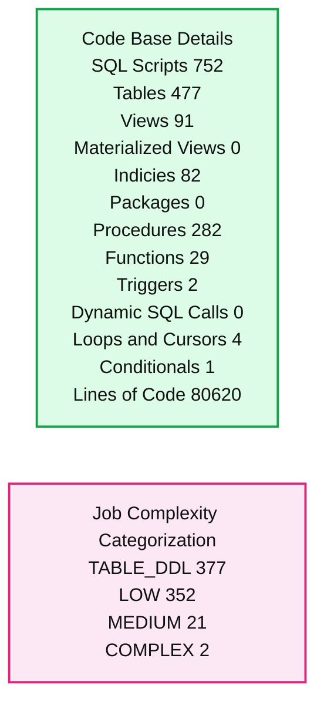
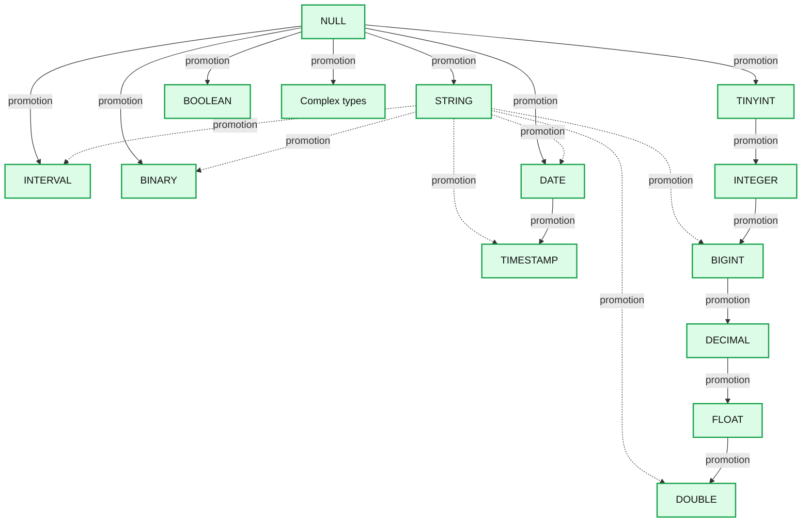

# The 3Ds of Migrating Teradata Workloads to Databricks

*Best practices for migrating Teradata workloads to Databricks*

- Source: https://www.databricks.com/blog/2023/02/22/3ds-migrating-teradata-workloads-databricks-lakehouse-platform.html
- Published: 2023-02-22
- Authors: Suresh Matlapudi, Mendelsohn Neil Chan , Abhishek Dey, Soham Bhatt
- Categories: platform, solutions, data-warehousing
- Images: 6 total, 3 extracted as architecture

**Key takeaways**

- Discover, develop, and deploy for systematically migrating Teradata workloads to the Databricks lakehouse architecture.
- Use scalable utilities like Teradata Parallel Transporter (TPT) and automated code conversion tools.
- Use Databricks Workflows to orchestrate anything anywhere, including any combination of notebooks, SQL, Spark, ML models, and more.

Many large enterprises have used Teradata data warehouses for years, but the storage and processing costs of on-premises infrastructure severely restricted who could use the resource and for what purposes. On top of that, an upgrade is a long process, plus Teradata needs to ship the customers the hardware and install it in the customer's data center in the event of an outage.

Migrating your legacy Teradata data warehouse to the Databricks Data + AI Platform can accelerate your data modernization journey. Still, it may seem complex and daunting, requiring a well-orchestrated and planned effort. During the initial scoping phase, you may discover that your organization has accumulated hundreds of jobs and thousands of SQL scripts over the years.

However, fear not! Enterprise customers like [Walgreens](https://www.databricks.com/customers/walgreens), [Sam's Club](https://www.databricks.com/session/building-an-enterprise-data-platform-with-azure-databricks-to-enable-machine-learning-and-data-science-at-scale-at-sams-club) and many others have successfully migrated their legacy Teradata Data Warehouse to Databricks, enabling them to save millions in infrastructure savings while at the same time accelerating innovation and productivity. This blog post presents a systematic strategy to accelerate your journey toward adopting the lakehouse in a framework encapsulated in an acronym, ***3Ds***: Discovery, Development, and Deployment.

If you are wondering how Databricks is different from Teradata, the summary matrix below illustrates how the Databricks Lakehouse Platform compares to a traditional data warehouse like Teradata:

### Capabilities comparison

|  | Databricks | On-Premises Teradata |
|---|---|---|
| **Data format** | Delta (open source) | Proprietary |
| **Data types** | Structured, Semi-structured, Unstructured | Structured, Semi-structured |
| **Languages supported** | SQL, Python, Scala, R | SQL only |
| **Use cases** | BI, SQL, Machine Learning/ Data Science, Real-Time Streaming | BI, SQL |
| **Reliability** | High-quality, reliable data with ACID transactions | High-quality, reliable data with ACID transactions |
| **Governance** | Fine-grained access control for tables, rows, columns with Unity Catalog | Fine-grained access control for tables, rows, columns |
| **Architectural paradigm** | Lakehouse Platform | Traditional Data Warehouse |
| **Licensing Model** | Consumption based | Annual subscription + Additional feature(s) + Support/ Maintenance + Upgrades cost |

## Step 1: Discovery

### Profile the Teradata Environment

The first step in the migration process is to comprehensively understand your Teradata environment to determine the overall scope and effort required for the initiative. Below are two key questions you'd want to know about your Teradata deployment:

**Question #1: What does my Teradata topology look like regarding hardware specs? *****(e.g., storage utilization, system utilization, warehouse objects information, query types)***

To answer this question, extracting and analyzing syslogs from your Teradata warehouse environment is a great place to start. To accelerate this process the Databricks migrations team has developed a Teradata Profiler tool to accelerate this process. The profiler uses Teradata's system tables and service called PDCR *(Performance Data Collection and Reporting)*, a data application that provides an understanding of system performance, workload utilization, and management. This migration assessment utility helps you automatically discover and profile the current Teradata Warehouse environment. In addition, the tool also helps in [DBU](https://www.databricks.com/product/pricing) (Databricks Unit) forecasting. The screenshot below illustrates the key insights generated by the Teradata Profiler dashboard *(for more information on running the profiler, please get in touch with your Databricks representative)*:

[This is a sample Teradata profiler dashboard](https://www.databricks.com/sites/default/files/inline-images/db-500-blog-img-1.png)

**Question #2: How many workloads do I need to migrate to Databricks? How easy or complex are my environment's jobs and code patterns?**

To answer this second question, you need to review the actual code, scripts, data warehouse objects, and jobs accumulated in your Teradata warehouse environment and create a summary inventory of these artifacts. To accelerate this analysis process, Databricks highly recommends utilizing a code profiler or analyzer (e.g., [BladeBridge](https://bladebridge.com/analyzer/), [LeapLogic](https://www.leaplogic.io/migration-to-databricks.html), [DataMetica](https://www.datametica.com/databricks-partnership/) etc.) or solution accelerators built by one of our [BrickBuilder Migration Solution partners](https://www.databricks.com/solutions/migration/data-warehouse#brick-build). These tools typically provide detailed reports of what's inside your environment and break down data pipelines and jobs into various buckets based on complexity. It allows you to scope out the effort required for the migration initiative and any code refactoring that may be necessary during this process.

In addition to analyzing jobs complexity, these analyzer tools produce several useful summaries, including a listed inventory of assets and artifacts in the Teradata environment; examples include

- SQL scripts
- Dynamic SQL
- Functions,
- Referenced Objects
- Program-Object Cross Reference
- Total Lines of Code

*Sample summary output of the BladeBridge Code Analyzer*

**Summary:** Summary output from the BladeBridge Code Analyzer showing Teradata code-base metrics and job complexity categories.

**Components:**

- Run date and time: 2022-02-24 23:01:10
- Code Base Details: SQL scripts, tables, views, materialized views, indices, packages, procedures, functions, triggers, dynamic SQL calls, loops and cursors, conditionals, and lines of code
- Job Complexity Categorization: TABLE_DDL, LOW, MEDIUM, and COMPLEX jobs

**Flows:**

- none

**Numbers:**

- Run date/time: 2022-02-24 23:01:10
- Total SQL Scripts: 752
- Total Tables: 477
- Total Views: 91
- Total Materialized Views: 0
- Total Indicies: 82
- Total Packages: 0
- Total Procedures: 282
- Total Functions: 29
- Total Triggers: 2
- Total Dynamic SQL Calls: 0
- Total Loops and Cursors: 4
- Total Conditionals: 1
- Total Lines of Code: 80620
- TABLE_DDL: 377
- LOW: 352
- MEDIUM: 21
- COMPLEX: 2

source image: https://www.databricks.com/sites/default/files/inline-images/db-500-blog-img-2.png

[Sample summary output of the BladeBridge Code Analyzer](https://www.databricks.com/sites/default/files/inline-images/db-500-blog-img-2.png)

The analyzer provides a good understanding of your Teradata warehouse environment by auto-analyzing the code/scripts, as you can do a detailed migration assessment and effort estimation. You are ready to embark on the next step in your migration journey!

## Step 2: Development

Now that you have assessed your Teradata workloads in the discovery step, the next step is the actual migration of historical data and associated workloads to the Databricks lakehouse architecture. This section will walk you through the development activities to achieve that.

### 2.1 Data Warehouse Extraction

To get started with data migration, the [Teradata Parallel Transporter](https://www.docs.teradata.com/r/Teradata-Parallel-Transporter-User-Guide/August-2020) (TPT) is a client utility that provides scalable, high-speed, and parallel data extraction and loading. Using TPT, you can extract the data from all your tables in Teradata at scale and then push the data files into cloud object stores such as AWS S3, Azure Data Lake Storage, or Google Cloud Storage. Utilizing TPT to unload data offers several critical benefits listed below:

- Ability to define field delimiter, date formats, and encoding type
- Control to determine resource allocation for data unloading to achieve better performance
- Define the number of generated output files and their corresponding file type
- Supports checkpointing and resume operations in case of failures and interruptions

Alternatively, you can use a CDC Ingestion tool of your choice, provided by our [Ingestion Partners,](https://docs.databricks.com/aws/en/integrations/#databricks-partner-connect-partners) to perform the above operation as well. You can push these extracted files to the cloud storage using cloud-native CLI or managed services or use any open source/third-party ingestion tools.

Once the extracted load-ready files in csv or text formats have landed on the cloud storage, you can use Databricks [Autoloader](https://docs.databricks.com/ingestion/auto-loader/index.html) for automatic incremental ingestion. It will take care of the historical data ingestion.

*Diagram illustrating the transfer of data from Teradata to AWS S3*

**Summary:** Teradata data is transferred through Teradata Parallel Transporter to raw files in Amazon S3, then transformed in Databricks.

**Components:**

- Teradata Database - Teradata
- Teradata Parallel Transporter - TPT
- Raw data files written to S3 - Amazon S3
- Data transformation in Databricks - Databricks

**Flows:**

- Teradata Database -> Teradata Parallel Transporter: data extraction
- Teradata Parallel Transporter -> Raw data files written to S3: raw data files
- Raw data files written to S3 -> Data transformation in Databricks: data transformation

**Numbers:** none

source image: https://www.databricks.com/sites/default/files/inline-images/db-500-blog-img-3.png

```mermaid
%% Data transfer from Teradata to S3 and transformation in Databricks
flowchart LR
    A[Teradata Database]
    B[Teradata Parallel Transporter TPT]
    C[Raw data files written to S3]
    D[Data transformation in Databricks]

    A -->|data extraction| B
    B -->|raw data files| C
    C -->|data transformation| D

    classDef client fill:#dbeafe,stroke:#2563eb,stroke-width:2px,color:#111
    classDef service fill:#dcfce7,stroke:#16a34a,stroke-width:2px,color:#111
    classDef store fill:#ede9fe,stroke:#7c3aed,stroke-width:2px,color:#111
    classDef cache fill:#fef3c7,stroke:#d97706,stroke-width:2px,color:#111
    classDef queue fill:#cffafe,stroke:#0891b2,stroke-width:2px,color:#111
    classDef critical fill:#fee2e2,stroke:#dc2626,stroke-width:4px,color:#111
    classDef external fill:#e5e7eb,stroke:#6b7280,stroke-width:2px,color:#111,stroke-dasharray:4 3
    classDef decision fill:#fce7f3,stroke:#db2777,stroke-width:2px,color:#111
    class A external
    class B service
    class C store
    class D service
```

[Diagram illustrating the transfer of data from Teradata to AWS S3](https://www.databricks.com/sites/default/files/inline-images/db-500-blog-img-3.png)

From an incremental load standpoint, you must ensure that the [ingestion](https://www.databricks.com/product/data-ingestion) process pushes the source data to the cloud storage location for all the tables in scope. We recommend using the original source systems directly to decouple the ingestion pipeline and remove dependency on Teradata as a source system. Usually, this is a CDC source, which is handled by ingestion tools like [Fivetran](https://www.databricks.com/partners/fivetran) (HVR), [Airbyte](https://www.databricks.com/blog/2022/07/11/using-airbyte-for-unified-data-integration-into-databricks.html), Debezium, Azure Data Factory, [AWS DMS](https://www.databricks.com/blog/2019/07/15/migrating-transactional-data-to-a-delta-lake-using-aws-dms.html), Arcion or others, depending on your choice of ingestion tooling and source system(s). In the case of existing logic using MLoad, TPT or Fast Load scripts, where you are performing incremental loads into Teradata today, that can be taken care of as part of [MERGE INTO](https://docs.databricks.com/sql/language-manual/delta-merge-into.html) functionality in Databricks.

 

### 2.2 Code conversion and pipeline development

When converting code from your Teradata Warehouse environment to Databricks, the primary goal is to leverage automated methods as much as possible. The conversion of the Teradata logic and functionality using one of our migration tooling ISV partners or a BrickBuilder solution simplifies and accelerates the modernization effort to a large extent. As a best practice for migration, we recommend that you group related code belonging to a data application end-to-end or subject area together and trace it backwards from the reporting layer to the base tables.

Migrating code that has accumulated over the years may seem to be an intimidating and daunting task. Let's break them down into four major categories listed below and explore each area in more detail to approach the code migration systematically:

- Data Type Conversion
- Table DDLs
- Table DMLs
- BTEQ Scripts
- Stored Procedures

Teradata has its dialect of the SQL language but conforms closely to the ANSI SQL that Databricks adheres to. Below are the indicative guidelines for code conversion between Teradata and Databricks:

***1. Data Type conversion***

The conversion of SQL data types from Teradata to Databricks is straightforward, due to the ANSI-compliance of Databricks SQL. DDL statements and scripts in Teradata can be ported over to Databricks seamlessly, with most source data types being retained.

On certain occasions, the process of type promotion will occur, which is the process of casting a type into another type of the same type family which contains all possible values of the original type. To illustrate with an example, **TINYINT** has a range from -128 to 127, and all its possible values can be safely promoted to **INTEGER**. For a full list of supported SQL data types in Databricks and their type precedence during the conversion process, kindly refer to the [link](https://docs.databricks.com/sql/language-manual/sql-ref-datatype-rules.html) here and our [release](https://docs.databricks.com/sql/release-notes/index.html#databricks-sql-release-notes) notes.

*A graphical representation of the type precedence hierarchy*

**Summary:** The diagram shows Databricks SQL type precedence, including promotion paths from NULL and STRING into supported data types.

**Components:**

- NULL - Databricks SQL null type
- STRING - Databricks SQL string type
- INTERVAL - Databricks SQL interval type
- BINARY - Databricks SQL binary type
- DATE - Databricks SQL date type
- TIMESTAMP - Databricks SQL timestamp type
- TINYINT - Databricks SQL tiny integer type
- INTEGER - Databricks SQL integer type
- BIGINT - Databricks SQL big integer type
- DECIMAL - Databricks SQL decimal type
- FLOAT - Databricks SQL floating point type
- DOUBLE - Databricks SQL double precision type
- BOOLEAN - Databricks SQL Boolean type
- ARRAY - Databricks SQL array type
- MAP - Databricks SQL map type
- STRUCT - Databricks SQL struct type

**Flows:**

- NULL -> STRING: type promotion
- NULL -> INTERVAL: type promotion
- NULL -> BINARY: type promotion
- NULL -> DATE: type promotion
- NULL -> TINYINT: type promotion
- NULL -> BOOLEAN: type promotion
- NULL -> ARRAY: type promotion
- NULL -> MAP: type promotion
- NULL -> STRUCT: type promotion
- STRING -> INTERVAL: type promotion
- STRING -> BINARY: type promotion
- STRING -> DATE: type promotion
- STRING -> TIMESTAMP: type promotion
- STRING -> BIGINT: type promotion
- STRING -> DOUBLE: type promotion
- DATE -> TIMESTAMP: type promotion
- TINYINT -> INTEGER: type promotion
- INTEGER -> BIGINT: type promotion
- BIGINT -> DECIMAL: type promotion
- DECIMAL -> FLOAT: type promotion
- FLOAT -> DOUBLE: type promotion

**Numbers:** none

source image: https://www.databricks.com/sites/default/files/inline-images/db-500-blog-img-4.png

[A graphical representation of the type precedence hierarchy](https://www.databricks.com/sites/default/files/inline-images/db-500-blog-img-4.png)

***2. Table DDLs using Identity Columns***

[Identity Columns](https://www.databricks.com/blog/2022/08/08/identity-columns-to-generate-surrogate-keys-are-now-available-in-a-lakehouse-near-you.html) are now GA (Generally Available) in Databricks Runtime 10.4 and beyond. Through identity columns, you can now enable all your data warehousing workloads to have all the benefits of a lakehouse architecture.

[An example of a Teradata DDL statement converted to Databricks equivalent](https://www.databricks.com/sites/default/files/inline-images/db-500-blog-img-5.png)

***3. Table DMLs and Function Substitutions***

Databricks SQL (DBSQL) supports many standard SQL functions; hence the most commonly used SQL functions in Teradata are also interoperable with DBSQL code without required refactoring. Any Teradata functions not supported in native DBSQL can be handled using User-Defined Functions (UDFs). This [link](https://docs.databricks.com/sql/language-manual/sql-ref-functions-builtin-alpha.html) contains an alphabetically ordered list of built-in functions and operators in Databricks.

***4. BTEQ Scripts***

If you have BTEQ scripts, you must convert them into SQL-based logic wrapped in Python and import them into your Databricks workspace environment as notebooks. A quick summary of the top 5 most common BTEQ functionality, commands and their equivalent converted state in Databricks is shown below:

| # | Teradata BTEQ Command | Databricks Equivalent |
|---|---|---|
| 1 | IMPORT | COPY INTO |
| 2 | EXPORT | INSERT OVERWRITE DIRECTORY |
| 3 | RUN | dbutils.notebook.run |
| 4 | IF THEN | Python if block |
| 5 | IF, ELSEIF, ELSE, ENDIF | Python if…elif…else block |

***5. Stored Procedures***

Teradata stored procedures can be easily migrated to Databricks using the newly supported [SQL scripting](https://docs.databricks.com/aws/en/sql/language-manual/sql-ref-scripting) that provides stored procedure functionality within Databricks. Databricks PySpark Notebooks and Workflows can also be used to modularize and orchestrate the stored procedure steps. The recommended approach is leveraging the automated code conversion tools mentioned above to accelerate this process. Following is a high-level summary of how most auto conversion tools handle Teradata Stored Procedures and its equivalent functionality in Databricks.

- **CREATE** Stored Procedure statements from the input code are converted to Databricks notebooks using Python and SQL in the output
- Each Stored Procedure maps to an equivalent Databricks notebook.
- **CALL** Stored Procedure statements to equivalent **dbutils.notebook.run** calls with appropriate parameter serialization and return value deserialization

[An example of a Teradata Stored Procedure converted to Databricks](https://www.databricks.com/sites/default/files/inline-images/db-500-blog-img-6.png)

The tabular matrix below summarizes specific Stored Procedure functionality in Teradata and how to migrate its features into Databricks:

| # | Teradata Stored Procedure Construct | Migration Process / Equivalent Component in Databricks |
|---|---|---|
| 1 | SQL Statements | Stored Procedures contain SQL statements that undergo the same conversion rules to Databricks as described in this blog's SQL conversion section |
| 2 | Parameters | Parameters are converted to output Python notebook parameters through Databricks' widgets functionality. Data type conversion from Teradata SQL types to Python types is taken care of in the conversion process |
| 3 | Variable declarations | Converted to Python variables with appropriate data type conversions |
| 4 | IF THEN | Converted to Python if block |
| 5 | IF, ELSEIF, ELSE, and ENDIF | Converted to Python if…elif..else block |
| 6 | CASE | Converted to Python if…elif..else block |
| 7 | CALL statements | Stored Procedure **CALL** statements are converted to **dbutils.notebook.run** calls with appropriate parameter serialization and return value deserialization. You can also share the context between different tasks using task values, if you want to break a large piece of code logically and leverage Databricks workflows effectively. |

### 2.3 Data modeling

Apart from the code, if you are worried about migrating your custom data model on Teradata, Databricks supports all data modeling paradigms. You can use that as-is on the [lakehouse](https://www.databricks.com/blog/2020/01/30/what-is-a-data-lakehouse.html). Data Modelers and architects can quickly re-engineer or reconstruct databases and their underlying tables or views on Databricks. You could leverage tools like [erwin Data Modeler](https://docs.databricks.com/partners/data-governance/erwin.html) with the Databricks lakehouse architecture to serve these needs and reverse engineer using the existing model to fast-track migration to Databricks. We recommend that you follow our [blogs](https://www.databricks.com/blog/2022/10/20/data-modeling-best-practices-implementation-modern-lakehouse.html) for data modeling best practices.

## Step 3: Deployment

Now that you have converted your core Teradata logic into Databricks equivalent, you are ready for deployment. There are several best practices of which you should be aware.

### 3.1 Workspace setup

When designing your [workspace](https://docs.databricks.com/workspace/index.html#navigate-the-workspace), there are various options to set up logical boundaries based on your existing data model, governance model and enterprise architectural design decisions:

1. Three workspace approaches based on environments - e.g., dev, stage and prod. In addition, we expect it to align with the logical separation of the corresponding schemas for the data.
2. Isolation by the line of business ( LOB ), and one would have LOB-based dev, stage and prod workspaces within each LOB. You could also have sub-LOBs within each LOB and, within that, different value streams or projects isolate the ownership. This could be aligned with the cloud account setup as well. This strategy works well with enterprises bound by privacy and regulatory requirements.
3. Create separate workspaces for each team that owns the data. This, in turn, allows each team to control the data it produces and helps ensure data ownership is evident. It works well for enterprises that want to implement data mesh architecture.

For more information, we recommend you follow these [best practices](https://www.databricks.com/blog/2022/03/10/functional-workspace-organization-on-databricks.html) on workspace setup.

Once the workspaces are set up, you can test your migrated workloads and deploy them into production. For CI/CD, you can use Databricks Repos and the [best practices](https://docs.databricks.com/repos/ci-cd-best-practices-with-repos.html) around it.

We typically help you perform a Total Cost of Ownership (TCO) analysis and consumption planning for the required Databricks Units (DBUs) to support these workloads from a budgeting standpoint. *Please contact your Databricks representative for this exercise.*

### 3.2 Orchestration using Workflows

Traditionally, Teradata workloads are orchestrated using schedulers like Control-M, Autosys or similar tools with Unix-based wrapper scripts. Enterprises also embed the ELT logic as part of the enterprise ETL components, which push down the SQL logic on execution.

With Databricks, you can use [Workflows](https://www.databricks.com/blog/2022/05/10/introducing-databricks-workflows.html) out of the box and orchestrate anything anywhere. Workflows are free of cost, and you can orchestrate any combination of notebooks, SQL, Spark, ML models, etc., as a Jobs workflow, including calls to other systems. These [Workflows](https://docs.databricks.com/workflows/index.html) can be scheduled using Databricks scheduler.

As part of the migration activity, you can modernize your Teradata workloads to Databricks and eliminate licensed scheduling tools to adopt the modern data stack as an option entirely. For example, if you have converted your BTEQ scripts into notebooks, you can now orchestrate them as Tasks using Workflows with the required dependencies for deploying the end-to-end pipeline.

### 3.3 Data validation and user acceptance testing

To deploy workloads successfully into production, you will need to plan for data validation by the end users/business analysts' teams. The business analysts' teams use row counts and summaries of key attributes or metrics of the tables in scope and compare them by running their SQL models on Teradata and Databricks. We recommend that you keep an overlapping window between the two systems for validations side by side. Once the teams sign off with the completion of User Acceptance Testing (UAT), you can plan for a cutover for all the related workloads. Usually, these capabilities are a subset of the BrickBuilder solutions or migration tooling ISV partners and can be easily automated for ease of use and accelerated journey.

Another critical factor during user acceptance testing is meeting the performance SLAs. You will get best-in-class performance by migrating to Databricks with a much lower TCO, as it uses a [Photon](https://www.databricks.com/product/photon) engine providing high-speed query performance at a low cost for all types of workloads directly on top of the lakehouse.

For more details, please visit this blog post on [data-warehousing-performance-record](https://www.databricks.com/blog/2021/11/02/databricks-sets-official-data-warehousing-performance-record.html).
To ensure you get the best performance, we recommend you follow the delta optimizations [best practices](https://docs.databricks.com/delta/best-practices.html).

### 3.4 Data governance strategy

Databricks brings fine-grained governance and security to lakehouse data with [Unity Catalog](https://www.databricks.com/product/unity-catalog). Unity Catalog allows organizations to manage fine-grained data permissions using standard ANSI SQL or a simple UI, enabling them to unlock their lakehouse for consumption safely. It works uniformly across clouds and data types.

Unity Catalog moves beyond managing tables to other data assets, such as machine learning models and files. As a result, enterprises can simplify how they govern all their data and AI assets. It is a critical architectural tenet for enterprises and one of the key reasons customers migrate to Databricks instead of using a traditional data warehousing platform.

In this case, you can easily migrate over the Teradata-based access controls to Databricks using Unity Catalog.

### 3.5 Repointing BI workloads

One of the critical requirements of a successful Teradata to Databricks migration is ensuring business continuity, enabling adoption and alleviating any downstream impacts. Databricks has validated integrations with your favorite BI tools, including Databricks [Dashboards](https://docs.databricks.com/notebooks/dashboards.html#dashboards), Power BI, Tableau, Redash, Preset, AWS Quicksight, Looker and others, allowing you to work with data through Databricks SQL warehouses. The general norm for a given set of reports for a given KPI is to ensure all the upstream tables and views are migrated, along with their associated workloads and dependencies.

Assuming the metadata is migrated to Unity Catalog, we could the following approach for seamless repointing of reports, as applicable. Let us assume that the new tables or views under UAT have the suffix _delta. Once the tables/views in scope with UAT are completed, and associated pipelines are migrated, you should rename the existing Teradata tables/views with the suffix ( e.g., _td) and rename the new tables/views (e.g., _delta) to the current table or view names. This approach ensures that end users do not have to refactor the table or view names within the SQL models or reports, and existing reports can be migrated using your automated solution with minimal syntax changes. Note: You could follow an approach with separate database/schema names maintained for the lakehouse, as dictated by your data strategy team as well.

Once you have migrated the 1st set of KPI dashboards or reports, you can now iterate through the remainder of the reporting layer and its migration.

## Practical tips from Accenture

Accenture shared some practical tips for [migrating from Teradata to Databricks in this webinar](https://www.databricks.com/resources/webinar/how-migrate-legacy-data-warehouses). Check it out to hear about how the migration worked at a utilities company! Highlights include:

- A Teradata migration is not just a database migration.
- Discovery is crucial to a high-confidence plan.
- Engage all of the stakeholders.
- Don't migrate what you don't need.
- Don't forget about history.

## Summary

A seamless migration is an important step to ensure the success of your business outcomes. In the above blog sections, we walked you through the important aspects of completing your migration journey.

### Next steps

Many enterprises today are running a hybrid architecture — data warehouses for business analytics and data lakes for machine learning. But with the advent of the data lakehouse, you can now unify both on a single modern platform. The Databricks lakehouse architecture overcomes traditional MPP data warehouse limitations because it is designed to manage all types of data - structured, semi-structured, and unstructured - and supports traditional BI workloads and Machine Learning / AI natively. It adds all this functionality to your data lake, creating a unified, single, and multicloud platform.

Migrating your Teradata environment to Databricks delivers significant business benefits, including

- Reduction of operational costs,
- Increased productivity of your data teams,
- Unlocking advanced analytics use cases while retaining full data warehouse capabilities.

Migration can be challenging. There will always be tradeoffs to balance and unexpected issues and delays to manage. You need proven partners and solutions for the migration's people, process, and technology aspects. We recommend trusting the experts at [Databricks Professional Services](https://www.databricks.com/professional-services) and our [certified migration partners](https://www.databricks.com/solutions/migration/data-warehouse), who have extensive experience delivering high-quality migration solutions promptly. [Reach out](https://www.databricks.com/company/contact) to get your migration assessment started.

We also have a complete [Teradata Server to Databricks Migration Guide–get your free copy here](https://www.databricks.com/sites/default/files/2025-05/databricks-migration-guide-teradata-fa.pdf).
