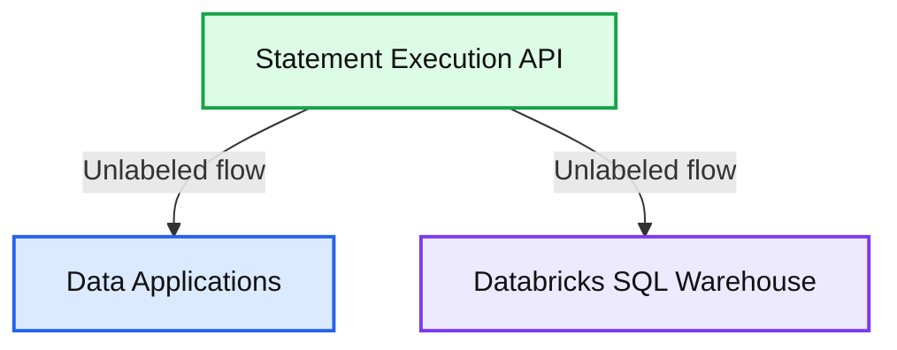

# Databricks SQL Statement Execution API – Announcing the Public Preview

- Source: https://www.databricks.com/blog/2023/03/07/databricks-sql-statement-execution-api-announcing-public-preview.html
- Published: 2023-03-07
- Authors: Adriana Ispas, Bogdan Ionut Ghit, Ben Fleis, Pearl Ubaru
- Categories: platform, product, data-warehousing
- Images: 1 total, 1 extracted as architecture

Today, we are excited to announce the public preview of the Databricks SQL Statement Execution API, available on AWS and Azure. You can now connect to your [Databricks SQL](https://www.databricks.com/product/databricks-sql) warehouse over a REST API to access and manipulate data managed by the [Databricks Lakehouse Platform](https://www.databricks.com/product/data-lakehouse).

The Databricks SQL Statement Execution API simplifies access to your data and makes it easier to build data applications tailored to your needs. The API is asynchronous, which removes the need to manage connections like you do with JDBC or ODBC. Moreover, you can connect to your SQL warehouse without having to first install a driver. You can use the Statement Execution API to connect your traditional and Cloud-based applications, services and devices to Databricks SQL. You can also create custom client libraries for your programming language of choice.

**Summary:** The Statement Execution API connects Data Applications with a Databricks SQL Warehouse.

**Components:**

- Data Applications: application technology unspecified.
- Statement Execution API: API for SQL statement execution.
- Databricks SQL Warehouse: Databricks SQL.

**Flows:**

- Statement Execution API -> Data Applications: unlabeled upward flow.
- Statement Execution API -> Databricks SQL Warehouse: unlabeled downward flow.

**Numbers:** none

source image: https://www.databricks.com/sites/default/files/inline-images/db-462-blog-img-1.png

In this blog, we review some key features available in the public preview and show how to leverage your data in a spreadsheet using the Statement Execution API and JavaScript.

## Statement Execution API in brief

The Statement Execution API manages the execution of [SQL statements](https://docs.databricks.com/sql/language-manual/index.html) and fetching of result data on all types of [Databricks SQL](https://www.databricks.com/product/databricks-sql) warehouses via HTTP endpoints for the following operations:

| Submit a SQL statement for execution | POST /sql/statements |
|---|---|
| Check the status and retrieve results | GET /sql/statements/{statement_id} |
| Cancel a SQL statement execution | POST /sql/statements/{statement_id}/cancel |

For example, let's assume we want to retrieve the monthly order revenue for the current year for display in our data application. Assuming data on orders is already managed by our Lakehouse, a SQL statement could be as shown below:

We can initiate the execution of our SQL statement by sending a **POST** request to the `/api/2.0/sql/statements` endpoint. The string representing the SQL statement is provided as a request body payload, along with the ID of a [SQL warehouse](https://docs.databricks.com/sql/admin/sql-endpoints.html#enable-serverless-sql-endpoints) to be used for executing the statement. The HTTP request must also contain the host component of your Databricks workspace URL and an [access token](https://docs.databricks.com/sql/user/security/personal-access-tokens.html) for authentication.

If the statement completes quickly, the API returns the results as a direct response to the POST request. Below is an example response:

If the statement takes longer, the API continues asynchronously. In this case, the response contains a statement ID and a status.

You can use the statement ID to check the execution status and, if ready, retrieve the results by sending a `**GET**` request to the `/api/2.0/sql/statements/{statement_id}` endpoint:

You can also use the statement ID to cancel the request by sending a `**POST**` request to the `/api/2.0/sql/statements/cancel` endpoint.

The API can be configured to behave synchronously or asynchronously by further configuring your requests. To find out more, check the tutorial ([AWS](https://docs.databricks.com/sql/api/sql-execution-tutorial.html) | [Azure](https://learn.microsoft.com/en-gb/azure/databricks/sql/api/sql-execution-tutorial)) and the documentation ([AWS](https://docs.databricks.com/sql/api/statements.html) | [Azure](https://learn.microsoft.com/en-us/azure/databricks/sql/api/statements)).

## Using the Databricks SQL Statement Execution API in JavaScript

You can send Databricks SQL Statement Execution API requests from any programming language. You can use methods like the [Fetch API](https://developer.mozilla.org/en-US/docs/Web/API/Fetch_API/Using_Fetch) in JavaScript; [Python Requests](https://requests.readthedocs.io/en/latest/) in Python; the [net/http](https://pkg.go.dev/net/http) package in Go, and so on.

We show how you can use the Statement Execution API to populate a Google Sheet using the JavaScript [Fetch API](https://developer.mozilla.org/en-US/docs/Web/API/Fetch_API/Using_Fetch) from a [Spreadsheet App](https://developers.google.com/apps-script/reference/spreadsheet/spreadsheet-app).

### Example Spreadsheet app

Let's imagine we want to build a Google Spreadsheet App that populates a spreadsheet with data on orders. Our users can fetch monthly order revenue data based on predefined criteria, such as the monthly order revenue for the current month, the current year, or between a start and an end date. For each criterion, we can write corresponding SQL statements, submit them for execution, fetch and handle the results using the Statement Execution API.

In the next section, we outline the main building blocks to implement this example. To follow along, you can [download](https://github.com/databricks-demos/dbsql-rest-api) the spreadsheet from GitHub.

### Building the Spreadsheet App

Given a statement that we want to execute using the SQL Statement API, the `executeStatement` function below captures the overall logic for handling the default mode of the API. In this mode, statement executions start synchronously and continue asynchronously after a default timeout of 10 seconds.

We start by submitting a statement for execution using the `submitStatement` function. If the statement completes within the defined timeout, we fetch the results by calling the `handleResult` function. Otherwise, the execution proceeds asynchronously, which means we need to poll for the execution status until completion – the `checkStatus` function covers the required logic. Once finished, we retrieve the results using the same `handleResult` function.

The `submitStatement` function defines the request body where we set execution parameters such as the wait timeout of 10 seconds (default), the execution mode and the SQL statement. It further invokes a generic `fetchFromUrl` function for submitting an HTTP request. We also define a `HTTP_REQUEST_BASE` constant to pass in the access token for the Databricks workspace user. We will reuse this constant for all HTTP requests we will be making.

The `fetchFromUrl` function is a generic function for submitting HTTP requests with minimal error handling, as shown below.

In the `checkStatus` function, if the wait timeout is exceeded, we poll the server to retrieve the status of the statement execution and determine when the results are ready to fetch.

In the `handleResult` function, if the statement has completed successfully and the results are available, a fetch response will always contain the first chunk of rows. The function handles the result and attempts to fetch the subsequent chunks if available.

All that is left is to connect the executeStatement function to JavaScript event handlers for the various user interface widgets, passing in the SQL statement corresponding to the user selection. The Google [Apps Script](https://developers.google.com/apps-script/reference/spreadsheet/spreadsheet-app) documentation provides instructions on populating the spreadsheet with the returned data.

## Getting started with the Databricks SQL Statement Execution API

The Databricks SQL Statement Execution API is available with the Databricks Premium and Enterprise tiers. If you already have a Databricks account, follow our tutorial ([AWS](https://docs.databricks.com/sql/api/sql-execution-tutorial.html) | [Azure](https://learn.microsoft.com/en-gb/azure/databricks/sql/api/sql-execution-tutorial)), the documentation ([AWS](https://docs.databricks.com/sql/api/statements.html) | [Azure](https://learn.microsoft.com/en-us/azure/databricks/sql/api/statements)), or check our [repository](https://github.com/databricks-demos/dbsql-rest-api) of code samples. If you are not an existing Databricks customer, sign up for a [free trial](https://www.databricks.com/try-databricks).

The Databricks SQL Statement Execution API complements the wide range of options to connect to your Databricks SQL warehouse. Check our [previous blog post](https://www.databricks.com/blog/2022/06/29/connect-from-anywhere-to-databricks-sql.html) to learn more about native connectivity to Python, Go, Node.js, the CLI, and ODBC/JDBC. Data managed by the Databricks Lakehouse Platform can truly be accessed from anywhere!

Join us at the [Data + AI Summit 2023](https://www.databricks.com/dataaisummit/?utm_medium=paid%20search&amp%3Butm_source=Google&amp%3Butm_campaign=15591221713&amp%3Butm_adgroup=130815653203&amp%3Butm_content=summit&amp%3Butm_offer=dataaisummit&amp%3Butm_ad=642349546761&amp%3Butm_term=data%20ai%20summit&amp%3Bgclid=CjwKCAiA2rOeBhAsEiwA2Pl7Q91a1-LcK-aElUD96b657eGmX1r32IUhFeGsdSrM83Oypese_SX4ehoCE5MQAvD_BwE) to learn more about the Databricks SQL Statement Execution API and to get updates on what is coming next.
