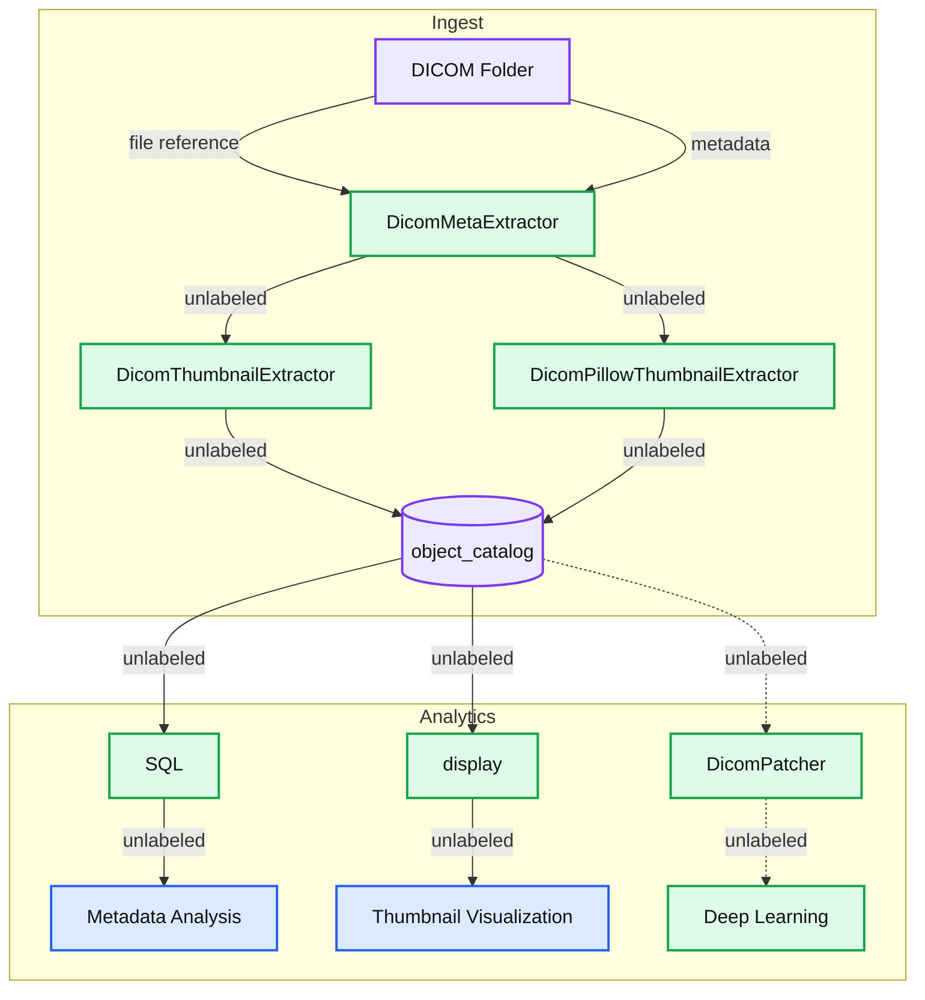

# Building the Lakehouse for Healthcare and Life Sciences - Processing DICOM images at scale with ease

- Source: https://www.databricks.com/blog/2023/03/16/building-lakehouse-healthcare-and-life-sciences-processing-dicom-images.html
- Published: 2023-03-16
- Authors: Douglas Moore
- Categories: healthcare-and-life-sciences, data-engineering
- Images: 3 total, 1 extracted as architecture

One of the biggest challenges in understanding patient health status and disease progression is unlocking insights from the vast amounts of semi-structured and unstructured data types in healthcare. DICOM, which stands for Digital Imaging and Communications in Medicine, is the standard for the communication and management of medical imaging information. Medical images, encompassing modalities like CT, X-Ray, PET, Ultrasound, and MRI, are essential to many diagnostic and treatment processes in healthcare in specialties ranging from orthopedics to oncology to obstetrics.

The use of deep learning on medical images has seen a surge due to the increase in computing power through graphics processing units and the accessibility of vast imaging datasets.

Deep learning is applied to train models that can be used to automate part of the diagnosis process, improve image quality, or extract informative biomarkers from the image to name a few. This has the potential to significantly reduce cost of care. However, successful application of deep learning on medical images requires access to a large number of images combined with other health information from the patient, as well as an infrastructure that can accommodate ML at scale, while adhering to regulatory constraints.

Traditional data management systems like data warehouses do not accommodate unstructured data types, while data lakes fail to catalog and store metadata, which is critical for the findability and accessibility of data. The Databricks Lakehouse for Healthcare and Life Sciences addresses these shortcomings by providing a scalable environment from which you can ingest, manage, and analyze all of your data types. Specifically in support of DICOM, Databricks has released a new Solution Accelerator, `databricks.pixels`, which makes integrating hundreds of imaging formats easy.

For example, we start with a library of 10,000 DICOM images, run that through the indexing, metadata extraction and thumbnail generation. We then save it to the reliable and fast Delta Lake. Upon querying the Object Catalog we reveal the DICOM image header metadata, a thumbnail, path, and file metadata as shown below:

Display of file path, file metadata, DICOM metadata, thumbnail

With these 7 commands from the `databricks.pixels` python package, user can easily generate a full catalog, metadata and prepare thumbnails:

In this blog post, we introduce databricks.pixels, a framework to accelerate Image file processing, with the inaugural launch capabilities that include:

- Cataloging files
- Extracting file based metadata
- Extracting metadata from DICOM file headers
- Selecting files based on metadata parameters via flexible SQL queries
- Generating and visualizing DICOM thumbnails

The `databricks.pixels` accelerator uses the extensible Spark ML Transformer paradigm, thus extending the capabilities and pipelining the capabilities becomes a trivial exercise to take advantage of the enormous power the Lakehouse architecture offers analytics users in the Healthcare and Life Sciences domain.

While the Databricks Lakehouse makes image file processing available to users, `databricks.pixel` makes it easy to integrate the hardened DICOM open source libraries, parallel processing of spark and the robust data architecture brought by Delta Lake together. The data flow is:

*Metadata Analysis of DICOM attributes using SQL*

**Summary:** DICOM files pass through metadata and thumbnail extractors into an object catalog that supports metadata analysis, thumbnail visualization, and deep learning.

**Components:**
- Ingest: processing group containing the DICOM folder, extractors, and catalog.
- DICOM Folder: source storage for DICOM files.
- DicomMetaExtractor: DICOM metadata extraction component.
- DicomThumbnailExtractor: DICOM thumbnail extraction component.
- DicomPillowThumbnailExtractor: thumbnail extraction component named for Pillow.
- object_catalog: catalog storage; storage technology is unspecified.
- Analytics: group containing analysis, visualization, and deep learning paths.
- SQL: SQL query component.
- Metadata Analysis: metadata analysis output using SQL.
- display: display component; technology is unspecified.
- Thumbnail Visualization: thumbnail visualization output.
- DicomPatcher: DICOM patching component; technology is unspecified.
- Deep Learning: processing destination; framework is unspecified.
- file reference: label on one folder-to-extractor flow.
- metadata: label on the other folder-to-extractor flow.

**Flows:**
- DICOM Folder -> DicomMetaExtractor: file reference.
- DICOM Folder -> DicomMetaExtractor: metadata.
- DicomMetaExtractor -> DicomThumbnailExtractor: extractor input; arrow is unlabeled.
- DicomMetaExtractor -> DicomPillowThumbnailExtractor: extractor input; arrow is unlabeled.
- DicomThumbnailExtractor -> object_catalog: extractor output; arrow is unlabeled.
- DicomPillowThumbnailExtractor -> object_catalog: extractor output; arrow is unlabeled.
- object_catalog -> SQL: catalog input; arrow is unlabeled.
- SQL -> Metadata Analysis: analysis output; arrow is unlabeled.
- object_catalog -> display: catalog input; arrow is unlabeled.
- display -> Thumbnail Visualization: visualization output; arrow is unlabeled.
- object_catalog -> DicomPatcher: dotted connection; arrow is unlabeled.
- DicomPatcher -> Deep Learning: dotted connection; arrow is unlabeled.

**Numbers:** none

source image: https://www.databricks.com/sites/default/files/inline-images/db-537-blog-img-2.png

Metadata Analysis of DICOM attributes using SQL

The gold standard for DICOM image processing are open source packages of [pydicom](https://support.google.com/docs/answer/12022089?visit_id=638137739207111612-1907161280&p=unrecognized_words&rd=1#unrecognized_words&zippy=%2Cabout-unrecognized-words), [python-gdcm](https://pypi.org/project/python-gdcm/) and the gdcm c++ library. However, the standard use of these libraries are limited to a single CPU core, the data orchestration is typically manual and lacks production grade error handling. The resulting (meta) data extraction is far from integrated with the larger vision of a Lakehouse.

We developed a `databricks.pixels` to simplify and scale the processing of DICOM and other "non-structured" data formats, providing the following benefits:

1. **Ease of use** - `databricks.pixels` easily catalogs your data files, capturing file and path metadata while Transformer technology extracts proprietary metadata. `databricks.pixels` democratizes metadata analysis as shown below.
2. **Scales** - `databricks.pixels` easily scales using the power Spark and Databricks cluster management from a single instance (1-8 cores) for small studies to 10 to 1000's of CPU cores as needed for historical processing or high volume production pipelines.
3. **Unified** - Break down the data silo currently storing and indexing your images, catalog and integrate them with electronic health record (EHR), claims, real world evidence (RWE), and genomics data for a fuller picture. Enable the collaboration and data governance between teams working on small studies and production pipelines curating data.

**How it all works**

The Databricks lakehouse platform is an unified platform for all of your processing needs related to DICOM images and other imaging file types. Databricks provides easy access to well tested open source libraries to perform your DICOM file reading. Databricks Spark provides a scalable micro-task data parallel orchestration framework to process python tasks in parallel. The Databricks cluster manager provides for auto scaling and easy access to the compute (CPU or GPU) needed. Delta Lake provides a reliable, flexible method to store the (meta) data extracted from the DICOM files. The Databricks workflows provides a means to integrate and monitor DICOM processing with the rest of your data and analytic workflows.

**Getting Started**

Review the README.md at [https://github.com/databricks-industry-solutions/pixels](https://github.com/databricks-industry-solutions/pixels) for more details and examples. To use the accelerator, please create a Databricks Cluster with **DBR 10.4 LTS**. The [01-dcm-demo.py notebook](https://github.com/databricks-industry-solutions/pixels/blob/main/01-dcm-demo.py) and job can be used immediately to start cataloging your images.

To run this accelerator, clone this [repo](https://github.com/databricks-industry-solutions/pixels) into a Databricks workspace. Attach the RUNME notebook to any cluster running a DBR 10.4 LTS or later runtime, and execute the notebook via Run-All. A multi-step-job describing the accelerator pipeline will be created, and the link will be provided. Execute the multi-step-job to see how the pipeline runs. The job configuration is written in the RUNME notebook in json format. The cost associated with running the accelerator is the user's responsibility.

The ingested images must be stored on S3 or mounted via [DBFS](https://docs.databricks.com/dbfs/index.html), use this path as an input to the demo notebook / job first parameter for path.

DICOM job parameters

Choose the catalog, schema and table to store the object_catalog. Select the update mode (overwrite or append) to choose how to update your object_catalog.

The demo job will demonstrate the loading and parsing of raw DICOM files. For analytics, filtering, SQL based queries, and Thumbnail display is demonstrated.

**Summary**

The `databricks.pixels` solution accelerator is an easy way to kickstart DICOM image ingestion in the Lakehouse.

**Further work**

`databricks.pixels` is designed to be a framework to scale file processing with ease. Users are looking to process PDFs, ZIP files, videos, and more. If you have a need please create a GitHub issue, contribute a transformer or [fix an existing github issue](https://github.com/databricks-industry-solutions/pixels/issues)!
