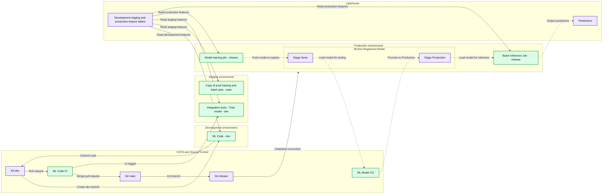

# Saving Mothers with ML: How CareSource uses MLOps to Improve Healthcare in High-Risk Obstetrics

- Source: https://www.databricks.com/blog/2023/04/03/saving-mothers-ml-how-mlops-improves-healthcare-high-risk-obstetrics.html
- Published: 2023-04-03
- Authors: Chengyin Eng, Russ Scoville, Arpit Gupta, Alvaro Aleman
- Categories: engineering, data-science-machine-learning
- Images: 1 total, 1 extracted as architecture

This blog post is in collaboration with Russ Scoville (Vice President of Enterprise Data Services), Arpit Gupta (Director of Predictive Analytics and Data Science), and Alvaro Aleman (Senior Data Scientist) at CareSource.

 In the United States, roughly 7 out of every 1000 mothers suffer from both pregnancy and delivery complications each year1. Of those mothers with pregnancy complications, 700 die but 60% of those deaths are preventable with the right medical attention, according to the CDC. Even among the 3.7 million successful births, 19% have either low birthweight or are delivered preterm. These high-risk pregnancies and deliveries, medically known as *obstetrics*, impose not only a risk to human life but also a considerable emotional and economic burden on families. A high-risk pregnancy can be nearly 10 times more expensive than a normal birth outcome, averaging $57,000 for a high-risk pregnancy vs $8,000 for a typical pregnancy2. [CareSource](https://www.caresource.com/), one of the largest Medicaid providers in the United States, aims to not only triage these high-risk pregnancies, but also partner with medical providers so they can provide lifesaving obstetrics care for their patients before it is too late. However, there are data bottlenecks that need to be solved.

CareSource wrestled with the challenge of not being able to use the entirety of their historical data for training their machine learning (ML) models. Being able to systematically track ML experiments and trigger model refreshes was also a pain point. All these constraints led to delay in sending time-sensitive obstetrics risk predictions to medical partners. In this blog post, we will briefly discuss how CareSource developed an ML model to identify high-risk obstetrics and then focus on how we built a standardized and automated production framework to accelerate ML model deployment.

## Environment and People Context

CareSource has a team of data scientists and DevOps engineers. Data scientists are responsible for developing ML pipelines whereas DevOps engineers configure the necessary infrastructure to support the ML pipelines in production.

In terms of environment setup, CareSource uses a single Azure Databricks workspace for `dev`, `staging`, and `production`. The team leverages different Git branches, backed by an Azure Repo, to differentiate between environments:

- `dev` or feature branches: development
- `main` branch: staging
- `release` branch: production

## ML Development

What stands out about high-risk obstetrics (HROB) data is that it not only contains health profiles but also other circumstantial factors, such as economic stability, that may affect the pregnant patient's well-being. There are over 500 features altogether and many of these clinical-related features are useful for related ML models, such as re-admission risk model. Hence, we used [Databricks Feature Store](https://www.databricks.com/product/feature-store) to store all cleaned and engineered features to allow reuse and collaboration across projects and teams.

For easier experimentation with different feature combinations, we expressed all feature selection and imputation methods in the form of YAML files without changing the actual model training code. We first mapped features into different groups in `feature_mappings.yml`. Then, we outlined which feature groups to keep or drop in `feature_selection_config.yml` as shown below. The advantage of this approach is that we did not need to edit model training code directly.

To allow training at scale on a full set of historical data, we utilized the distributed PySpark framework for data processing. We also used [Hyperopt](https://docs.databricks.com/machine-learning/automl-hyperparam-tuning/index.html#hyperparameter-tuning-with-hyperopt), an open-sourced tool that provides Bayesian hyperparameter search, leveraging results from past model configuration runs, to tune a PySpark model. With [MLflow](https://www.mlflow.org/docs/latest/index.html), all of these hyperparameter trials were automatically captured. This included their hyperparameters, metrics, any arbitrary files (e.g. images or feature importance files). Using MLflow removed the manual struggle of keeping track of various experimentation runs. Consistent with a [2022 perinatal health report](https://www.americanprogress.org/article/a-strong-start-in-life-how-public-health-policies-affect-the-well-being-of-pregnancies-and-families/) released by the Center for American Progress, we found from our preliminary experimentation that pregnancy risk is indeed a multi-faceted problem, influenced not only by health history but also by other socioeconomic determinants.

## ML Productionization

Typically, how we productionize models has a lot of variability across projects and teams even within the same organization. The same was true for CareSource as well. CareSource struggled with varying productionization standards across projects, slowing down model deployment. Furthermore, increased variability means more engineering overhead and more onboarding complications. Hence, the chief goal that we wanted to achieve at CareSource was to enable a standardized and automated framework to productionize models.

At the heart of our workflow is leveraging a templating tool, `Stacks` – a Databricks product under private preview – to generate standardized and automated CI/CD workflows for deploying and testing ML models.

### Introducing Stacks*

Stacks leverages the deploy-code pattern, through which we promote training code, rather than model artifacts to staging or production. (You can read more about deploy-code vs deploy-model in this [Big Book of MLOps](https://www.databricks.com/p/ebook/the-big-book-of-mlops).) It provides a [cookiecutter](https://www.cookiecutter.io/) template to set up infrastructure-as-code (IaC) and CI/CD pipelines for ML models in production. Using cookiecutter prompts, we configured the template with Azure Databricks environment values such as Databricks workspace URL and Azure storage account name. `Stacks`, by default, assumes different Databricks workspaces for `staging` and `production`. Therefore, we customized how Azure service principals are created, so that we could have two SPs, i.e. `staging-sp` and `prod-sp`, in the same workspace. Now that we have the CI/CD pipelines in place, we proceeded with adapting our ML code according to the cookiecutter template. The diagram below shows the overall architecture of the ML development and automated productionization workflow that we implemented.

**Note: `Stacks` is a Databricks product under private preview and is continually evolving to make future model deployments even easier. Stay tuned for the upcoming release!*

### Production Architecture and Workflow

*Note: MLflow Model Registry is also used in staging, but not shown in this picture for simplicity.*

**Summary:** Git-based CI/CD moves ML code through development, staging, and production, while Lakehouse feature tables support training and inference and MLflow manages model promotion.

**Components:**

- CI/CD and Source Control: Git repositories and branches with ML automation.
- `dev`: Git development branch.
- ML Code CI: continuous integration for ML code.
- `main`: Git main branch.
- `release`: Git release branch.
- ML Model CD: continuous delivery for registered models.
- Development environment: ML Code using the `dev` branch.
- Staging environment: integration tests that train a model using `dev`, plus a copy of production training/batch jobs using `main`.
- Production environment: model training and batch inference jobs using `release`.
- MLflow Registered Model: model registry containing `Stage: None` and `Stage: Production`.
- Lakehouse: feature tables for development, staging, and production.
- Predictions: output storage for batch inference results; storage technology unspecified.
- Legend: pipeline, CI/CD, reads, writes, model, model transition, repository, and branch symbols.

**Flows:**

- `dev` -> ML Code: create development branch.
- ML Code -> `dev`: commit code.
- `dev` -> ML Code CI: pull request.
- ML Code CI -> `main`: merge pull request.
- `main` -> `release`: cut branch.
- `release` -> Production environment: unlabeled deployment connection.
- ML Code CI -> Integration tests: CI trigger.
- Development feature tables -> ML Code: read features.
- Staging feature tables -> Copy of production training/batch jobs: read features.
- Staging feature tables -> Integration tests: read features.
- Production feature tables -> Model training job: read features.
- Model training job -> MLflow model at Stage None: push model to registry.
- MLflow model at Stage None -> ML Model CD: load model for testing.
- ML Model CD -> MLflow model at Stage Production: promote to production.
- MLflow model at Stage Production -> Batch Inference Job: load model for inference.
- Production feature tables -> Batch Inference Job: read features.
- Batch Inference Job -> Predictions: output predictions.

**Numbers:** none

source image: https://www.databricks.com/sites/default/files/inline-images/db-558-blog-img-1.png

Note: MLflow Model Registry is also used in staging, but not shown in this picture for simplicity.

In the `dev` environment:

- Data scientists are free to create any feature branches for model development and exploration
- They commit code against Git regularly to save any work-in-progress
- Once data scientists identify a candidate model to move forward with production:
 - They further modularize and parameterize ML code if need be
 - They implement unit and integration tests
 - They define paths to store MLflow experiments, MLflow models, training and inference job frequencies
- Lastly, they submit a pull request (PR) against the staging environment, i.e. `main` branch

In the `staging` environment:

- The PR triggers a series of unit tests and integration tests under the Continuous Integration (CI) step defined in Azure DevOps
 - Verify that the feature engineering and model training pipelines run successfully and produce results within expectation
- Register the candidate model in MLflow Model Registry and transition its stage to staging
- Once all tests pass, merge the PR into the `main` branch

In the `prod` environment:

- Data scientists cut a version of the `main` branch to the `release` branch to push the model to production
- A Continuous Delivery (CD) step in Azure DevOps is triggered
 - Similar to the `staging` environment, verify that the feature engineering and model training pipelines run successfully
- Once all tests pass, register the candidate model in the MLflow Model Registry and transition to `Production`, if this is the first model version
 - For future model version upgrades, the challenger model (version 2) has to exceed a performance threshold when compared to the current model in production (version 1), before it transitions to `Production`
- Load the model in MLflow Model Registry and generate batch predictions
 - Persist those predictions in Delta tables and conduct any post-processing steps

The standardized workflow describe above can now be applied to all other ML projects at CareSource. Another crucial element that simplifies model management is *automation*. We do not want to trigger tests manually when we have lots of models to manage. The embedded component within `Stacks` that allows automation is Terraform. We expressed all configurations as code, including compute resources to spin up feature engineering, model training, and inference jobs. The added bonus from Terraform is that we can now build and version these infra changes as code. Setting up IaC via Terraform and CI/CD is non-trivial from scratch, but luckily `Stacks` provides both bootstrapping automation and reference CI/CD code out of the box. For instance, using the Terraform resource below, `inference_job.tf`, we scheduled a `prod` batch inference jobs to run at 11am UTC daily, while pulling code from the `release` branch.

In this project, we also leveraged both project-wide and environment-specific configuration files. This enabled easy toggling between different configurations as the environment changed from `dev` to `staging`, for example. Generally, parameterized files help keep our ML pipeline clean and bug-free from parameter iterations:

### Outcome

To recap, we used Databricks Feature Store, MLflow, and Hyperopt to develop, tune, and track the ML model to predict obstetrics risk. Then, we leveraged `Stacks` to help instantiate a production-ready template for deployment and send prediction results at a timely schedule to medical partners. An end-to-end ML framework, complete with production best practices, can be challenging and time-consuming to implement. However, we established the ML development and productionization architecture detailed above within approximately 6 weeks.

So how did `Stacks` help us accelerate the productionization process at CareSource?

### Impact

`Stacks` provides a standardized and yet fully customizable ML project structure, infra-as-code, and CI/CD template. It is agnostic to how model development code is written so we had completely flexibility over how we wrote our ML code and which packages we used. The data scientists at CareSource can own this process completely and deploy models to production in a self-service fashion by following the guardrails `Stacks` provides. (As mentioned earlier, `Stacks` will get even easier to leverage as it undergoes improvements during this private preview phase!)

The CareSource team can now easily extend this template to support other ML use cases. An important learning from this work was that early collaboration between both the data science and DevOps (ML) engineering teams is instrumental to ensuring smooth productionization.

Migrating this high-risk obstetrics model to Databricks is only the beginning for CareSource. The accelerated transition between ML development and productionization not only enables data practitioners to fully unleash the power of data and ML, but at Caresource, it means having a chance to directly impact patients' health and lives before it is too late.

CareSource was selected as One of the Best Places to Work 2020 and won the Clinical Innovator Award. If you would like to join CareSource to improve their members' well-being, check out their career openings [here](https://careers.caresource.com/).

Watch the video of the CareSource story [here](https://youtu.be/AqO0BLYo0eg?si=FOll4gVlefcN9Gco). 

### Sources

1. Blue Cross Blue Shield Organization - the Health of America. (2020, June 17). *Trends in Pregnancy and Childbirth Complications in the U.S.* Retrieved March 23, 2023, from [https://www.bcbs.com/the-health-of-america/reports/trends-in-pregnancy-and-childbirth-complications-in-the-us](https://www.bcbs.com/the-health-of-america/reports/trends-in-pregnancy-and-childbirth-complications-in-the-us)
2. M. Lopez. (2020, August 6). Managing Costs in High-Risk Obstetrics. AJMC. [https://www.ajmc.com/view/a456_13mar_nwsltr](https://www.ajmc.com/view/a456_13mar_nwsltr)
