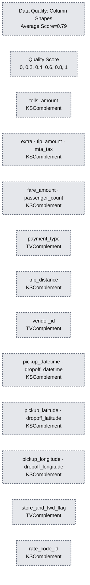
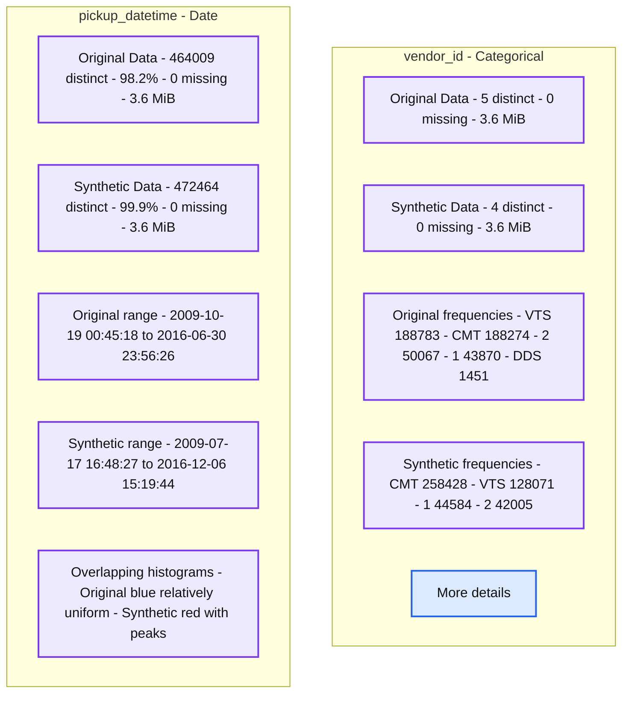
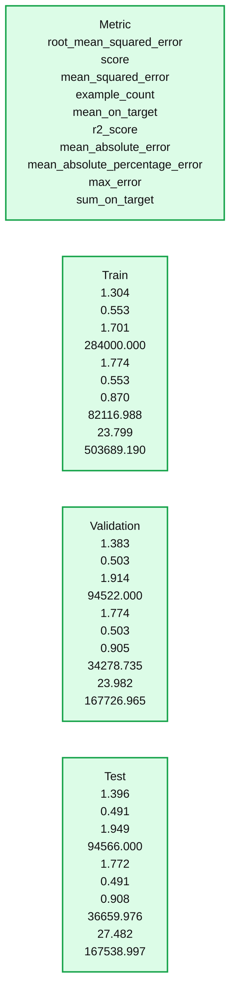
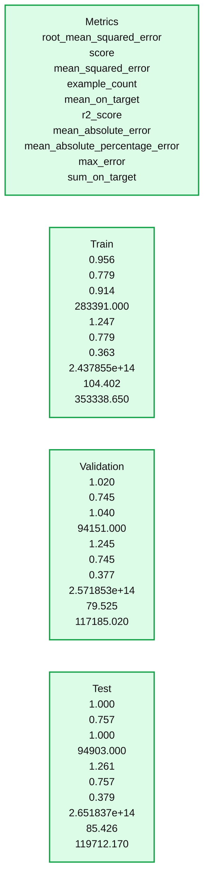

# Synthetic Data for Better Machine Learning

*Leverage AI to generate synthetic data for better models, or safer data sharing with data teams*

- Source: https://www.databricks.com/blog/2023/04/12/synthetic-data-better-machine-learning.html
- Published: 2023-04-12
- Authors: Sean Owen
- Categories: engineering, data-science-machine-learning
- Images: 9 total, 5 extracted as architecture

You've likely tried the buzziest advances in generative AI in the past year, tools like [ChatGPT](https://chat.openai.com/auth/login) and [DALL-E](https://openai.com/dall-e-2/). They consume complex data and generate *more data* in ways that feel startlingly like something intelligent. These and other new ideas ([diffusion models](https://en.wikipedia.org/wiki/Diffusion_model), [generative adversarial networks](https://en.wikipedia.org/wiki/Generative_adversarial_network) or GANs) are entertaining, even frightening to play with.

However, the median daily machine learning task is to forecast sales, predict customer churn with a mess of tabular data and 'normal' data science tools, and so on – not imagining how Bosch would have drawn a still life on Mars.

A still life on Mars in the style of Hieronymus Bosch, from DALL-E 2

What if generative AI could help with, say, a simple regression problem? There is a related class of ideas that can generate synthetic data like the real business data you have. **Synthetic data** is a key application of generative AI, conceived broadly.

This blog examines a few uses for synthetic data in a typical machine learning process. How can it assist that regression problem, or help with operational concerns about handling sensitive data? It will use the open source library [SDV (Synthetic Data Vault)](https://github.com/sdv-dev/SDV) for synthetic data modeling, and use [MLflow](https://mlflow.org/), [Apache Spark](https://spark.apache.org/) and [Delta](https://delta.io/) to manage the synthetic data generation, and finally explore how this impacts a regression problem with [Databricks Auto ML](https://www.databricks.com/product/automl).

## Why Synthetic Data for Machine Learning?

What use is made-up data for learning about the real world? Randomly made-up data wouldn't be useful. Data that closely resembles real data might be.

First, everyone wants more data, because it (sometimes) means better machine learning models. Machine learning *models* the real world, and so more data can create a fuller picture of that world, of what happens in corner cases, of what is just anomalous and what is repeatedly observed. Real data can be hard to come by, while an infinite amount of real-ish data is simple to obtain.

Yet synthetic data can only mimic the real data that is actually available. It can't reveal new subtleties that the real data set does not. Nevertheless, it's possible that it helpfully extrapolates what the real data implies, and that this can be beneficial in some cases.

Secondly, data is sometimes not freely shareable. It could contain sensitive personally identifiable information (PII). While it might be desirable to share the data with new teams to expedite their exploration and analysis work, sharing could require lengthy redaction, special handling, form-filling and other bureaucracy.

Synthetic data offers a middle ground, sharing data that is *like* sensitive data, but isn't real data. In some cases, even this may be problematic -- what if the synthetic data looks a little too like an actual data point in some cases? In other cases, it may be insufficient.

However, there are plenty of use cases where sharing synthetic data is good enough, and can speed up collaboration while retaining sufficient data security. Imagine you want a team of contractors to develop a reliable machine learning pipeline that solves a new problem, but you can't just share your sensitive data set with them. Sharing synthetic data might be more than enough for them to build a pipeline that will also work well when run on real data.

## Problem: Big Tippers

To illustrate, this blog will use a well-known NYC Taxi data set. In Databricks, this is available in `/databricks-datasets/nyctaxi/tables/nyctaxi_yellow`. It records basic information about taxi rides in New York City over more than a decade, including pickup and drop-off point, distance, fare, tolls, and tip. It's big, billions of rows, and this example will work on a sample that starts like this:

It's simple tabular data for a simple example, and here the problem will be to predict the tip that a rider adds at the end of a trip. Maybe the in-taxi payment system wants to tactfully suggest a tip amount, where it pays to not suggest something too high -- or low.

This is an unremarkable regression problem. Yet suppose that, for various reasons, this data is considered sensitive. It would be nice to share it with contractors or data science teams, but that could mean jumping through all kinds of legal hoops. How could one expect them to make an accurate model without sharing this data?

Don't share the raw data; try sharing a synthetic version of it.

## Synthetic Data in Minutes

[SDV](https://github.com/sdv-dev/SDV) is a Python library for synthesizing data. It can mimic data in a table, across multiple relational tables, or time series. It supports approaches to modeling data like [variational autoencoders](https://en.wikipedia.org/wiki/Variational_autoencoder) (VAEs), [generative adversarial networks](https://en.wikipedia.org/wiki/Generative_adversarial_network) (GANs), and [copulas](https://en.wikipedia.org/wiki/Copula_(probability_theory)). SDV can enforce generated data constraints, redact PII, and more. It's pleasantly simple to use, and in fact a first pass at modeling needs no more than this snippet, using the easy-mode [TabularPreset](https://sdv.dev/SDV/api_reference/lite/api/sdv.lite.tabular.TabularPreset.html#sdv.lite.tabular.TabularPreset) class:

At a glance, it sure looks plausible! Also included are data quality reports, which give some sense of how well the model believes its results match original data:

**Summary:** Column pair trends compare real and synthetic data, with an average similarity score of 0.83 and separate numerical correlation matrices.

**Components:**
- Data Quality: Column Pair Trends: report heading; technology unspecified.
- Real vs. Synthetic Similarity: heatmap comparing column pairs.
- Numerical Correlation Real Data: correlation heatmap for real data.
- Numerical Correlation Synthetic Data: correlation heatmap for synthetic data.
- Similarity axes: pickup_latitude, passenger_count, dropoff_latitude, tolls_amount, pickup_datetime, store_and_fwd_flag, pickup_longitude, mta_tax, trip_distance, payment_type, dropoff_datetime, rate_code_id, vendor_id, dropoff_longitude, tip_amount, extra, fare_amount.
- Correlation axes: dropoff_datetime, pickup_datetime, passenger_count, trip_distance, pickup_longitude, pickup_latitude, rate_code_id, dropoff_longitude, dropoff_latitude, fare_amount, extra, mta_tax, tip_amount, tolls_amount.

**Flows:**
- none. No arrows are visible.

**Numbers:**
- Average score: 0.83.
- Similarity scale: 0, 0.2, 0.4, 0.6, 0.8, 1.
- Correlation scale: -1, -0.5, 0, 0.5, 1. The negative tick labels have encoding artifacts.

source image: https://www.databricks.com/sites/default/files/inline-images/db-579-blog-img-4.png

These plots show how much each column's distribution of synthetic data matches the original, and how correlated the synthetic and real data is. It boils these down into scores between 0 and 100%, and overall gives this 75%. This is "OK". (The [SDMetrics library explains this](https://docs.sdv.dev/sdmetrics/reports/quality-report/whats-included) in a bit more detail.) It's unclear at this point why the column `store_and_fwd_flag` shows much worse fidelity than other columns.

## Evaluating Synthetic Data Quality

A closer look at that synthetic data (perhaps using the Data Visualization tab in Databricks!) reveals issues:

- Some monetary amounts are negative, in MTA tax or tip
- Passenger count and distance are 0 sometimes
- Distance is occasionally impossibly shorter than straight line distance
- Longitude and latitude are sometimes nowhere near New York City (or entirely invalid, like >90 degrees latitude)
- Monetary amounts have more than two decimal places
- Pickup time is occasionally after drop-off time, or sometimes more than a 12-hour shift long

In fact, many of these issues are found in the original data set. Like with any machine learning model -- garbage in, garbage out. It's worth fixing the issues in the source data, rather than attempting to emulate data with obvious problems. For simplicity, rows with evidently bad data can be removed, like any row where:

- Monetary amounts are negative
- Drop-off is before pickup, or unreasonably long after
- Locations are nowhere near New York City
- Distances aren't positive, or unreasonably large
- Distances are impossibly short given start and end point

To cut to the chase, starting over with an improved, filtered data set gives an 82% quality score. There is more to be done to improve the quality aside from fixing source data, however.

## Using Constraints

Above are some conditions that the real and synthetic data should meet. The models that generate data don't by nature have a semantic understanding of the values they're generating. For example, the original data set has no fractional passenger counts or negative distances (not anymore, at least). A good model would generally learn to imitate this, but may not perfectly, if it does not otherwise know these must be integers.

SDV provides a means to express these constraints. This helps the modeling process not spend time learning to not emit obviously bad data. [Constraints](https://sdv.dev/SDV/user_guides/single_table/constraints.html) look like this:

It's also possible to write custom constraints, involving user-supplied logic and multiple columns. For instance, pickup and drop-off latitude/longitude are given, as well as the taxi trip distance. While the trip distance between those two points can be *more* than the straight line distance between them, it can't be *less*! That's a non-obvious required relationship among five columns, involving [Haversine](https://en.wikipedia.org/wiki/Haversine_formula) distance. It's easy enough to write this as a custom constraint, even allowing a little bit of wiggle-room to account for imprecision in latitude/longitude from taxi GPS:

Before trying again, it's worth looking at more powerful models as well.

## Advanced Synthetic Data Modeling

The easy `TabularPreset` approach in SDV, used above, employs [Gaussian copulas](https://bochang.me/blog/posts/copula/). It may be an unfamiliar name, but it's surprisingly simple, fast and effective for many problems. Look no further if `TabularPreset` is working well for a problem.

For complex problems, more complex models could yield better results. SDV also supports approaches based on GANs and VAEs. Both ideas employ deep learning, but in different ways. GANs pit two models against each other, one generating data and one learning to spot synthetic data, in order to refine the generator until its output is hard to distinguish from the real thing. VAEs learn to encode real data such that not only can the *real* data be decoded afterwards, but new *synthetic* data can be 'decoded' out of thin air too.

Both are much more computationally intensive, and likely require a GPU to fit in reasonable time. If a data set is hard to emulate with simple approaches, or it'd just be great to say "yeah, we are leveraging GANs," at a cocktail party, then SDV's [CTGAN](https://sdv.dev/SDV/user_guides/single_table/ctgan.html) and [TVAE](https://sdv.dev/SDV/user_guides/single_table/tvae.html) are for you.

It's no more work to try TVAE in the upgraded example that follows. In addition, MLflow can be added to log the metrics, and even manage the TVAE model itself as a model whose predict function just generates more data:

Note the use of [MLflow](https://mlflow.org/)! Registering the model with MLflow records the exact model in a versioned registry. In addition to providing a record of the various models created during iterative development, the MLflow registry allows you to grant access to other users to take your model and generate synthetic data for themselves.

In fact, from MLflow we can check out these plots. Quality is up slightly to 83%, and a new plot is available, breaking down quality of synthesis for each column by itself:

**Summary:** Column shape quality scores compare synthetic data across 17 columns, with an average score of 0.79.

**Components:**
- Data Quality: Column Shapes: chart title.
- Quality Score: vertical axis.
- Metric: legend containing KSComplement and TVComplement.
- tolls_amount: KSComplement.
- extra: KSComplement.
- tip_amount: KSComplement.
- mta_tax: KSComplement.
- fare_amount: KSComplement.
- passenger_count: KSComplement.
- payment_type: TVComplement.
- trip_distance: KSComplement.
- vendor_id: TVComplement.
- pickup_datetime: KSComplement.
- dropoff_datetime: KSComplement.
- pickup_latitude: KSComplement.
- dropoff_latitude: KSComplement.
- pickup_longitude: KSComplement.
- dropoff_longitude: KSComplement.
- store_and_fwd_flag: TVComplement.
- rate_code_id: KSComplement.

**Flows:**
- none. No arrows are visible.

**Numbers:** Average Score=0.79. Quality Score axis ticks: 0, 0.2, 0.4, 0.6, 0.8, 1. Individual bars have no printed numeric values.

source image: https://www.databricks.com/sites/default/files/inline-images/db-579-blog-img-5.png

## Generating Synthetic Data

With that homework done, generating any amount of synthetic data is easy! Here some fresh new generated data lands in a Delta table. Just load the model from MLflow, write a simple Python function that uses the data generation model, and then "apply" it to dummy inputs in parallel with Spark (the UDF needs some input, but the data generation process doesn't actually need any input), and simply write the result.

Spark is very useful here to parallelize the generation, in case one needs to generate terabytes of it. This parallelizes as wide as desired.

Times, locations, and more are looking better indeed. [pandas-profiling](https://docs.profiling.ydata.ai/4.6/) can offer a different look at how the real and synthetic data compare. This is just a slice of the report:

**Summary:** Original and synthetic data are compared by vendor frequency, missing values, memory size, and pickup datetime distributions.

**Components:**
- vendor_id: categorical field with comparison statistics and frequency bars.
- pickup_datetime: date field with comparison statistics, minimum and maximum timestamps, and overlapping histograms.
- Original Data: blue bars representing original records.
- Synthetic Data: red bars representing synthetic records.
- More details: report control.
- No implementation technology is named.

**Flows:**
- none. No arrows are visible.

**Numbers:**
- vendor_id statistics, original / synthetic:
  - Distinct: 5 / 4.
  - Distinct percentage: < 0.1% / < 0.1%.
  - Missing: 0 / 0.
  - Missing percentage: 0.0% / 0.0%.
  - Memory size: 3.6 MiB / 3.6 MiB.
- Original vendor counts: VTS 188783; CMT 188274; vendor 2: 50067; vendor 1: 43870; DDS 1451.
- Synthetic vendor counts: CMT 258428; VTS 128071; vendor 1: 44584; vendor 2: 42005.
- pickup_datetime statistics, original / synthetic:
  - Distinct: 464009 / 472464.
  - Distinct percentage: 98.2% / 99.9%.
  - Missing: 0 / 0.
  - Missing percentage: 0.0% / 0.0%.
  - Memory size: 3.6 MiB / 3.6 MiB.
  - Minimum: 2009-10-19 00:45:18 / 2009-07-17 16:48:27.
  - Maximum: 2016-06-30 23:56:26 / 2016-12-06 15:19:44.
- Histogram timestamp labels: 2009-08-11 14:13:20; 2011-03-13 07:06:40; 2012-10-12 00:00:00; 2014-05-13 16:53:20; 2015-12-13 09:46:40.

source image: https://www.databricks.com/sites/default/files/inline-images/db-579-blog-img-7.png

This gives more detail on why the quality isn't 100%. There is for example curious non-uniformity in pickup and drop-off time in the synthetic data, whereas the original data was pretty uniform.

For now, this will do, but a synthetic data generation process might iterate from here just like any machine learning process, discovering new improvements in the data and synthesis process to improve quality.

## Modeling with Synthetic Data

The original task was to predict tips, not merely make up data. Can one usefully build machine learning models on synthetic data? Rather than spend time figuring out what a decent model might do with this data by hand, use Databricks Auto ML to make a first pass:

A few hours later:

**Summary:** Model evaluation metrics compare performance across Train, Validation, and Test datasets.

**Components:**
- Train: training metrics; technology unspecified.
- Validation: validation metrics; technology unspecified.
- Test: test metrics; technology unspecified.
- Metric labels: root_mean_squared_error, score, mean_squared_error, example_count, mean_on_target, r2_score, mean_absolute_error, mean_absolute_percentage_error, max_error, and sum_on_target.

**Flows:**
- None. No arrows are visible.

**Numbers:**

| Metric | Train | Validation | Test |
|---|---:|---:|---:|
| root_mean_squared_error | 1.304 | 1.383 | 1.396 |
| score | 0.553 | 0.503 | 0.491 |
| mean_squared_error | 1.701 | 1.914 | 1.949 |
| example_count | 284000.000 | 94522.000 | 94566.000 |
| mean_on_target | 1.774 | 1.774 | 1.772 |
| r2_score | 0.553 | 0.503 | 0.491 |
| mean_absolute_error | 0.870 | 0.905 | 0.908 |
| mean_absolute_percentage_error | 82116.988 | 34278.735 | 36659.976 |
| max_error | 23.799 | 23.982 | 27.482 |
| sum_on_target | 503689.190 | 167726.965 | 167538.997 |

source image: https://www.databricks.com/sites/default/files/inline-images/db-579-blog-img-8.png

The details of what model worked best don't matter here (congratulations, [lightgbm](https://lightgbm.readthedocs.io/en/v3.3.2/)), but this suggests that a decent model could achieve about an RMSE of 1.4 when predicting tips, with R2 of 0.49.

Does this hold up when the model is evaluated on a held-out sample of real data? Yes, as it turns out, this best model built on synthetic data also achieves an RMSE of about 1.52 and R2 of about 0.49. This is not great model performance, but it's not terrible.

In comparison, what would have happened here if starting instead from real data, not synthetic data? Re-run Auto ML, take a couple hours' break, and come back to find:

**Summary:** Regression evaluation metrics compare model performance across Train, Validation, and Test datasets.

**Components:**
- Train: Training dataset metrics; technology unspecified.
- Validation: Validation dataset metrics; technology unspecified.
- Test: Test dataset metrics; technology unspecified.
- Metric labels: root_mean_squared_error, score, mean_squared_error, example_count, mean_on_target, r2_score, mean_absolute_error, mean_absolute_percentage_error, max_error, and sum_on_target.

**Flows:**
- none. No arrows are visible.

**Numbers:**

| Metric | Train | Validation | Test |
|---|---:|---:|---:|
| root_mean_squared_error | 0.956 | 1.020 | 1.000 |
| score | 0.779 | 0.745 | 0.757 |
| mean_squared_error | 0.914 | 1.040 | 1.000 |
| example_count | 283391.000 | 94151.000 | 94903.000 |
| mean_on_target | 1.247 | 1.245 | 1.261 |
| r2_score | 0.779 | 0.745 | 0.757 |
| mean_absolute_error | 0.363 | 0.377 | 0.379 |
| mean_absolute_percentage_error | 2.437855e+14 | 2.571853e+14 | 2.651837e+14 |
| max_error | 104.402 | 79.525 | 85.426 |
| sum_on_target | 353338.650 | 117185.020 | 119712.170 |

source image: https://www.databricks.com/sites/default/files/inline-images/db-579-blog-img-9.png

Well, that's significantly better. Further, testing this best model on the same held-out sample of real data gives similar results: RMSE of 0.94 and R2 of 0.78.

In this case, modeling on real data would have produced a significantly more accurate model. Yet something was achieved by modeling on synthetic data. It proved out a viable *approach* to building models on this data set, without access to the real data. It even produced a passable model, and in other use cases, performance on synthetic data might even be comparable.

Don't underestimate this. This means that the modeling approach could be hashed out by, for example, contractors that can't access sensitive data. The pipeline was the important deliverable rather than the model; the pipeline could then be applied to real data by other teams. For more discussion of dividing up development and deployment of pipelines across teams, see the [Big Book of MLops](https://www.databricks.com/resources/ebook/the-big-book-of-mlops).

Finally, synthetic data can also be a strategy for data augmentation. For teams that *do* have access to real data, adding synthetic data could slightly improve a model. Without repeating the results, for the curious: this same approach with Auto ML, using a mix of real and synthetic data, yields RMSE of 0.95 and R2 of 0.77. Practically no difference, in this case, but possibly in others.

## Summary

The power of generative AI extends beyond funny chats. It can create realistic synthetic business data, which can be a useful stand-in for machine learning teams that are not easily able to secure access to sensitive real data. Tools like SDV can make this process just a few lines of code, and pairs well with Spark, Delta and MLflow for managing the resulting model and data.

[Try it now on Databricks!](https://www.databricks.com/wp-content/uploads/notebooks/sdv-data-synthesis.html)
