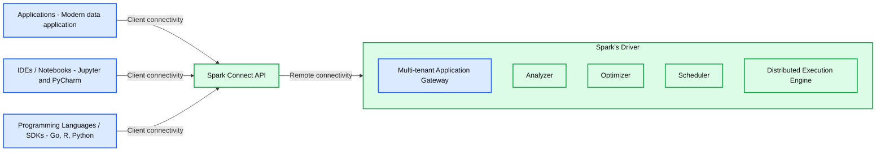

# Introducing Apache Spark™ 3.4 for Databricks Runtime 13.0

- Source: https://www.databricks.com/blog/2023/04/14/introducing-apache-sparktm-34-databricks-runtime-130.html
- Published: 2023-04-14
- Authors: Xinrong Meng, Daniel Tenedorio, Martin Grund, Allan Folting, Hyukjin Kwon, Herman van Hövell, Wenchen Fan, Ying Xiong, Jungtaek Lim, Xiao Li, Reynold Xin
- Categories: engineering, data-engineering
- Images: 3 total, 1 extracted as architecture

*Free Edition has replaced Community Edition, offering enhanced features at no cost. Start using *[*Free Edition *](https://login.databricks.com/?intent=SIGN_UP&amp;signup_experience_step=EXPRESS&amp;provider=DB_FREE_TIER&amp;dbx_source=www)*today.*
 

Today, we are happy to announce the availability of [Apache Spark™ 3.4](https://spark.apache.org/releases/spark-release-3-4-0.html) on Databricks as part of [Databricks Runtime 13.0](https://docs.databricks.com/release-notes/runtime/13.0.html). We extend our sincere appreciation to the Apache Spark community for their invaluable contributions to the Spark 3.4 release.

To further unify Spark, bring Spark to applications anywhere, increase productivity, simplify usage, and add new capabilities, Spark 3.4 introduces a range of new features, including:

- Connect to Spark from any application, anywhere with **Spark Connect**.
- Increase productivity with **new SQL functionality** like column DEFAULT values for multiple table formats, timestamp without timezone, UNPIVOT, and simpler queries with column alias references.
- **Improved Python developer experience** with a new PySpark error message framework and Spark executor memory profiling.
- **Streaming improvements** to improve performance, reduce cost with fewer queries and no intermediate storage needed, arbitrary stateful operation support for custom logic, and native support for reading and writing records in Protobuf format.
- Empower PySpark users to do **distributed training** with PyTorch on Spark clusters.

In this blog post, we provide a brief overview of some of the top-level features and enhancements in Apache Spark 3.4.0. For more information on these features, we encourage you to stay tuned for our upcoming blog posts which will go into greater detail. Additionally, if you're interested in a comprehensive list of major features and resolved JIRA tickets across all Spark components, we recommend checking out the Apache Spark 3.4.0 [release notes](https://spark.apache.org/releases/spark-release-3-4-0.html).

## Spark Connect

In Apache Spark 3.4, Spark Connect introduces a decoupled client-server architecture that enables remote connectivity to Spark clusters from any application, running anywhere. This separation of client and server, allows modern data applications, IDEs, Notebooks, and programming languages to access Spark interactively. Spark Connect leverages the power of the Spark DataFrame API ([SPARK-39375](https://issues.apache.org/jira/browse/SPARK-39375)).

With Spark Connect, client applications only impact their own environment as they can run outside the Spark cluster, dependency conflicts on the Spark driver are eliminated, organizations do not have to make any changes to their client applications when upgrading Spark, and developers can do client-side step-through debugging directly in their IDE.

Spark Connect powers the upcoming release of Databricks Connect.

*Spark Connect enables remote connectivity to Spark from any client application*

**Summary:** Spark Connect connects applications, IDEs, notebooks, and language SDKs through its API to the Apache Spark driver.

**Components:**
- Applications: contains a Modern data application; no specific technology named.
- IDEs / Notebooks: Jupyter and PyCharm.
- Programming Languages / SDKs: Go, R, and Python.
- Spark Connect API: shared interface for client connectivity.
- Spark’s Driver: Apache Spark driver containing the five components below.
- Multi-tenant Application Gateway: Spark driver gateway.
- Analyzer: Spark query analysis component.
- Optimizer: Spark query optimization component.
- Scheduler: Spark scheduling component.
- Distributed Execution Engine: Spark execution component.

**Flows:**
- Applications -> Spark Connect API: client connectivity; payload unspecified.
- IDEs / Notebooks -> Spark Connect API: client connectivity; payload unspecified.
- Programming Languages / SDKs -> Spark Connect API: client connectivity; payload unspecified.
- Spark Connect API -> Spark’s Driver: remote connectivity; payload unspecified.

**Numbers:** none

source image: https://www.databricks.com/sites/default/files/inline-images/db-559-blog-img-1.png

[Spark Connect enables remote connectivity to Spark from any client application](https://www.databricks.com/sites/default/files/inline-images/db-559-blog-img-1.png)

## [Distributed training on PyTorch ML models](https://www.databricks.com/sites/default/files/inline-images/db-559-blog-img-1.png)

[In Apache Spark 3.4, the TorchDistributor module is added to PySpark to help users do distributed training with PyTorch on Spark clusters. Under the hood, it initializes the environment and the communication channels between the workers and utilizes the CLI command `torch.distributed.run` to run distributed training across the worker nodes. The module supports distributing training jobs on both single node multi-GPU and multi-node GPU clusters. Here is an example code snippet of how to use it:](https://www.databricks.com/sites/default/files/inline-images/db-559-blog-img-1.png)

[For more details and example notebooks, see](https://www.databricks.com/sites/default/files/inline-images/db-559-blog-img-1.png)[https://docs.databricks.com/machine-learning/train-model/distributed-training/spark-pytorch-distributor.html](https://docs.databricks.com/machine-learning/train-model/distributed-training/spark-pytorch-distributor.html)

## Increased productivity

**Support for DEFAULT values for columns in tables** ([SPARK-38334](https://issues.apache.org/jira/browse/SPARK-38334)): SQL queries now support specifying default values for columns of tables in CSV, JSON, ORC, Parquet formats. This functionality works either at table creation time or afterwards. Subsequent INSERT, UPDATE, DELETE, and MERGE commands may thereafter refer to any column's default value using the explicit DEFAULT keyword. Or, if any INSERT assignment has an explicit list of fewer columns than the target table, corresponding column default values will be substituted for the remaining columns (or NULL if no default is specified).

For example, setting a DEFAULT value for a column when creating a new table:

It is also possible to use column defaults in UPDATE, DELETE, and MERGE statements, as shown in these examples:

**New TIMESTAMP WITHOUT TIMEZONE data type** ([SPARK-35662](https://issues.apache.org/jira/browse/SPARK-35662)): Apache Spark 3.4 adds a new data type to represent timestamp values without a time zone. Until now, values expressed using Spark's existing TIMESTAMP data type as embedded in SQL queries or passed through JDBC were presumed to be in session local timezone and cast to UTC before being processed. While these semantics are desirable in several cases such as dealing with calendars, in many other cases users would rather express timestamp values independent of time zones, such as in log files. To this end, Spark now includes the new TIMESTAMP_NTZ data type.

For example:

**Lateral Column Alias References** ([SPARK-27561](https://issues.apache.org/jira/browse/SPARK-27561)): In Apache Spark 3.4 it is now possible to use lateral column references in SQL SELECT lists to refer to previous items. This feature brings significant convenience when composing queries, often replacing the need to write complex subqueries and common table expressions.

For example:

**Dataset.to(StructType)** ([SPARK-39625](https://issues.apache.org/jira/browse/SPARK-39625)): Apache Spark 3.4 introduces a new API called Dataset.to(StructType) to convert the entire source dataframe to the specified schema. Its behavior is similar to table insertion where the input query is adjusted to match the table schema, but it's extended to work for inner fields as well. This includes:

- Reordering columns and inner fields to match the specified schema
- Projecting away columns and inner fields not needed by the specified schema
- Casting columns and inner fields to match the expected data types

For example:

**Parameterized SQL queries** ([SPARK-41271](https://issues.apache.org/jira/browse/SPARK-41271), [SPARK-42702](https://issues.apache.org/jira/browse/SPARK-42702)): Apache Spark 3.4 now supports the ability to construct parameterized SQL queries. This makes queries more reusable and improves security by preventing SQL injection attacks. The SparkSession API is now extended with an override of the `sql` method which accepts a map where the keys are parameter names, and the values are Scala/Java literals:

With this extension, the SQL text can now include named parameters in any positions where constants such as literal values are allowed.

Here is an example of parameterizing a SQL query this way:

**UNPIVOT / MELT operation** ([SPARK-39876](https://issues.apache.org/jira/browse/SPARK-39876), [SPARK-38864](https://issues.apache.org/jira/browse/SPARK-38864)): Until version 3.4, the Dataset API of Apache Spark provided the PIVOT method but not its reverse operation MELT. The latter is now included, granting the ability to unpivot a DataFrame from the wide format generated by PIVOT to its original long format, optionally leaving identifier columns set. This is the reverse of groupBy(...).pivot(...).agg(...), except for the aggregation, which cannot be reversed. This operation is useful to massage a DataFrame into a format where some columns are identifier columns, while all other columns ("values") are "unpivoted" to rows, leaving just two non-identifier columns, named as specified.

Example:

**The OFFSET clause** ([SPARK-28330](https://issues.apache.org/jira/browse/SPARK-28330), [SPARK-39159](https://issues.apache.org/jira/browse/SPARK-39159)): That's right, now you can use the OFFSET clause in SQL queries with Apache Spark 3.4. Before this version, you could issue queries and constrain the number of rows that come back using the LIMIT clause. Now you can do that, but also discard the first N rows with the OFFSET clause as well! Apache Spark™ will create and execute an efficient query plan to minimize the amount of work needed for this operation. It is commonly used for pagination, but also serves other purposes.

**Table-valued generator functions in the FROM clause** ([SPARK-41594](https://issues.apache.org/jira/browse/SPARK-41594)): As of 2021, the SQL standard now covers syntax for calling table-valued functions in section ISO/IEC 19075-7:2021 - Part 7: Polymorphic table functions. Apache Spark 3.4 now supports this syntax to make it easier to query and transform collections of data in standard ways. Existing and new built-in table-valued functions support this syntax.

Here is a simple example:

**Official NumPy instance support** ([SPARK-39405](https://issues.apache.org/jira/browse/SPARK-39405)): NumPy instances are now officially supported in PySpark so you can create DataFrames (spark.createDataFrame) with NumPy instances, and provide them as input in SQL expressions and even for ML.

## Improved developer experience

**Hardened SQLSTATE usage for error classes** ([SPARK-41994](https://issues.apache.org/jira/browse/SPARK-41994)): It has become standard in the database management system industry to represent return statuses from SQL queries and commands using a five-byte code known as [SQLSTATE](https://en.wikipedia.org/wiki/SQLSTATE). In this way, multiple clients and servers may standardize how they communicate with each other and simplify their implementation. This holds especially true for SQL queries and commands sent over JDBC and ODBC connections. Apache Spark 3.4 brings a significant majority of error cases into compliance with this standard by updating them to include SQLSTATE values matching those expected in the community. For example, the SQLSTATE value 22003 represents numeric value out of range, and 22012 represents division by zero.

**Improved error messages** ([SPARK-41597](https://issues.apache.org/jira/browse/SPARK-41597), [SPARK-37935](https://issues.apache.org/jira/browse/SPARK-37935)): More Spark exceptions have been migrated to the new error framework ([SPARK-33539](https://issues.apache.org/jira/browse/SPARK-33539)) with better error message quality. Also, PySpark exceptions now leverage the new framework and have error classes and codes classified so users can define desired behaviors for specific error cases when exceptions are raised.

Example:

**Memory profiler for PySpark user-defined functions** ([SPARK-40281](https://issues.apache.org/jira/browse/SPARK-40281)): The memory profiler for PySpark user-defined functions did not originally include support for profiling Spark executors. Memory, as one of the key factors of a program's performance, was missing in PySpark profiling. PySpark programs running on the Spark driver can be easily profiled with other profilers like any Python process, but there was no easy way to profile memory on Spark executors. PySpark now includes a memory profiler so users can profile their UDF line by line and check memory consumption.

Example:

## Streaming improvements

[Project Lightspeed: Faster and Simpler Stream Processing with Apache Spark](https://issues.apache.org/jira/browse/SPARK-40025) brings additional improvements in Spark 3.4:

**Offset Management** - Customer workload profiling and performance experiments indicate that offset management operations can consume up to 30-50% of the execution time for certain pipelines. By making these operations asynchronous and run at a configurable cadence, the execution times can be greatly improved.

**Supporting Multiple Stateful Operators** - Users can now perform stateful operations (aggregation, deduplication, stream-stream joins, etc) multiple times in the same query, including chained time window aggregations. With this, users no longer need to create multiple streaming queries with intermediate storage in between which incurs additional infrastructure and maintenance costs as well as not being very performant. Note that this only works with append mode.

**Python Arbitrary Stateful Processing** - Before Spark 3.4, PySpark did not support arbitrary stateful processing which forced users to use the Java/Scala API if they needed to express complex and custom stateful processing logic. Starting with Apache Spark 3.4, users can directly express stateful complex functions in PySpark. For more details, see the [Python Arbitrary Stateful Processing in Structured Streaming](https://www.databricks.com/blog/python-arbitrary-stateful-processing-structured-streaming) blog post.

**Protobuf Support** - Native support of Protobuf has been in high demand, especially for streaming use cases. In Apache Spark 3.4, users can now read and write records in Protobuf format using the built-in from_protobuf() and to_protobuf() functions.

## Other improvements in Apache Spark 3.4

Besides introducing new features, the latest release of Spark emphasizes usability, stability, and refinement, having resolved approximately 2600 issues. Over 270 contributors, both individuals and companies like Databricks, LinkedIn, eBay, Baidu, Apple, Bloomberg, Microsoft, Amazon, Google and many others, have contributed to this achievement. This blog post focuses on the notable SQL, Python, and streaming advancements in Spark 3.4, but there are various other improvements in this milestone not covered here. You can learn more about these additional capabilities in the release notes, including general availability of bloom filter joins, scalable Spark UI backend, better pandas API coverage, and more.

[If you want to experiment with Apache Spark 3.4 on](https://www.databricks.com/sites/default/files/inline-images/db-559-blog-image-2.png)[Databricks Runtime 13.0](https://docs.databricks.com/release-notes/runtime/13.0.html), you can easily do so by signing up for either the free Databricks Community Edition or the Databricks Trial. Once you have access, launching a cluster with Spark 3.4 is as easy as selecting version "13.0." This straightforward process allows you to get started with Spark 3.4 in a matter of minutes.
