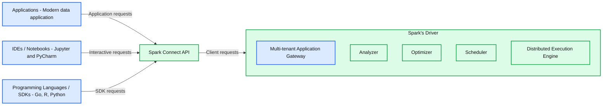
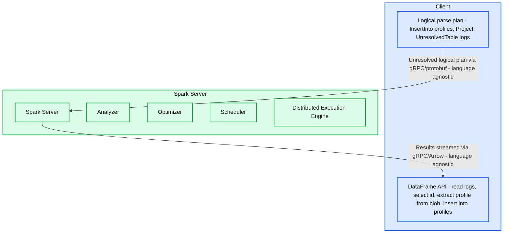

# Spark Connect Available in Apache Spark 3.4

*Run Spark Applications Everywhere*

- Source: https://www.databricks.com/blog/2023/04/18/spark-connect-available-apache-spark.html
- Published: 2023-04-18
- Authors: Allan Folting, Hyukjin Kwon, Xiao Li, Herman van Hövell, Stefania Leone, Martin Grund, Reynold Xin, Kris Mo
- Categories: engineering, open-source
- Images: 2 total, 2 extracted as architecture

Last year Spark Connect was [introduced](https://www.databricks.com/blog/2022/07/07/introducing-spark-connect-the-power-of-apache-spark-everywhere.html) at the Data and AI Summit. As part of the recently released Apache SparkTM 3.4, Spark Connect is now generally available. We have also recently re-architected Databricks Connect to be based on Spark Connect. This blog post walks through what Spark Connect is, how it works, and how to use it.

## Users can now connect IDEs, Notebooks, and modern data applications directly to Spark clusters

Spark Connect introduces a decoupled client-server architecture that enables remote connectivity to Spark clusters from any application, running anywhere. This separation of client and server, allows modern data applications, IDEs, Notebooks, and programming languages to access Spark interactively.

*Spark Connect enables remote connectivity to Spark from any client application*

**Summary:** Spark Connect connects applications, IDEs, notebooks, and programming language SDKs to Spark’s driver through the Spark Connect API.

**Components:**
- Applications: modern data application.
- IDEs / Notebooks: Jupyter and PyCharm.
- Programming Languages / SDKs: Go, R, and Python.
- Spark Connect API: interface between clients and Spark’s driver.
- Spark’s Driver: Apache Spark server components.
- Multi-tenant Application Gateway: driver application gateway.
- Analyzer: Spark analysis component.
- Optimizer: Spark optimization component.
- Scheduler: Spark scheduling component.
- Distributed Execution Engine: Spark execution component.

**Flows:**
- Applications -> Spark Connect API: application requests.
- IDEs / Notebooks -> Spark Connect API: interactive client requests.
- Programming Languages / SDKs -> Spark Connect API: SDK requests.
- Spark Connect API -> Spark’s Driver: client requests forwarded to Spark.

**Numbers:** none

source image: https://www.databricks.com/sites/default/files/inline-images/db-571-blog-img-1.png

Spark Connect enables remote connectivity to Spark from any client application

## Spark Connect improves Stability, Upgrades, Debugging, and Observability

With this new architecture, Spark Connect also mitigates common operational issues:

**Stability**: Applications that use a lot of memory will now only impact their own environment as they can run in their own processes outside the Spark cluster. Users can define their own dependencies in the client environment and don’t need to worry about potential dependency conflicts on the Spark driver.

For example, if you have a client application that retrieves a large data set from Spark for analysis or to make transformations, that application will no longer run on the Spark driver. This means that, if the application uses a lot of memory or CPU cycles, it will not compete for resources with other applications on the Spark driver, potentially causing those other applications to slow down or fail, because it now runs in its own separate, dedicated environment.

**Upgradability**: In the past, it was extremely painful to upgrade Spark, because all applications on the same Spark cluster had to be upgraded along with the cluster at the same time. With Spark Connect, applications can be upgraded independently of the server, due to the separation of client and server. This makes it much easier to upgrade because organizations do not have to make any changes to their client applications when upgrading Spark.

**Debuggability and observability**: Spark Connect enables interactive step-through debugging during development directly from your favorite IDE. Similarly, applications can be monitored using the application’s framework native metrics and logging libraries.

For example, you can interactively step through a Spark Connect client application in Visual Studio Code, inspect objects, and run debug commands to test and fix problems in your code.

## How Spark Connect works

The Spark Connect client library is designed to simplify Spark application development. It is a thin API that can be embedded everywhere: in application servers, IDEs, notebooks, and programming languages. The Spark Connect API builds on Spark’s DataFrame API using unresolved logical plans as a language-agnostic protocol between the client and the Spark driver.

The Spark Connect client translates DataFrame operations into unresolved logical query plans which are encoded using protocol buffers. These are sent to the server using the gRPC framework.

The Spark Connect endpoint embedded on the Spark driver receives and translates unresolved logical plans into Spark’s logical plan operators. This is similar to parsing a SQL query, where attributes and relations are parsed and an initial parse plan is built. From there, the standard Spark execution process kicks in, ensuring that Spark Connect leverages all of Spark’s optimizations and enhancements. Results are streamed back to the client through gRPC as Apache Arrow-encoded result batches.

*With Spark Connect, client applications communicate with Spark over gRPC*

**Summary:** Spark Connect sends client logical plans to a Spark server over gRPC/protobuf and streams results back over gRPC/Arrow.

**Components:**
- Client: uses the DataFrame API.
- DataFrame API: reads `logs`, selects `id`, extracts a profile from `blob`, and writes to `profiles`.
- Logical parse plan: contains InsertInto `profiles`, Project, and UnresolvedTable `logs`.
- Spark Server: hosts Spark processing components.
- Analyzer: Spark plan analysis.
- Optimizer: Spark plan optimization.
- Scheduler: Spark scheduling.
- Distributed Execution Engine: Spark distributed execution.

**Flows:**
- Client logical parse plan -> Spark Server: unresolved logical plan sent via language-agnostic gRPC/protobuf.
- Spark Server -> Client: results streamed back via language-agnostic gRPC/Arrow.

**Numbers:** none

source image: https://www.databricks.com/sites/default/files/inline-images/db-571-blog-img-2.png

With Spark Connect, client applications communicate with Spark over gRPC

## How to use Spark Connect

Starting with Spark 3.4, Spark Connect is available and supports PySpark and Scala applications. We will walk through an example of connecting to Apache Spark server with Spark Connect from a client application using the Spark Connect client library.

When writing Spark applications, the only time you need to consider Spark Connect is when you create Spark sessions. All the rest of your code is exactly the same as before.

To use Spark Connect, you can simply set an environment variable (`SPARK_REMOTE`) for your application to pick up, without making any code changes, or you can explicitly include Spark Connect in your code when creating Spark sessions.

Let’s take a look at a Jupyter notebook example. In this notebook we create a Spark Connect session to a local Spark cluster, create a PySpark DataFrame, and show the top 10 music artists by number of listeners.

In this example, we are explicitly specifying that we want to use Spark Connect by setting the remote property when we create our Spark session (`SparkSession.builder.remote...`).

*Jupyter notebook code using Spark Connect*

You can download the data set used in the example from here: [Music artists popularity | Kaggle](https://www.kaggle.com/datasets/pieca111/music-artists-popularity)

As illustrated in the following example, Spark Connect also makes it easy to switch between different Spark clusters, for example when developing and testing on a local Spark cluster and later moving your code to production on a remote cluster.

In this example, we set the TEST_ENV environment variable to drive which Spark cluster and data location our application will use so we don’t have to make any code changes to switch between our test, staging, and production clusters.

*Switching between different Spark clusters using an environment variable*

To read more about how to use Spark Connect visit the [Spark Connect Overview](https://spark.apache.org/docs/latest/spark-connect-overview.html) and [Spark Connect Quickstart](https://spark.apache.org/docs/latest/api/python/getting_started/quickstart_connect.html) pages.

### Databricks Connect is built on Spark Connect

Starting with [Databricks Runtime 13.0](https://docs.databricks.com/release-notes/runtime/13.0.html), Databricks Connect is now built on open-source Spark Connect. With this “v2” architecture, Databricks Connect becomes a thin client that is simple and easy to use. It can be embedded everywhere to connect to Databricks: in IDEs, Notebooks and any application, allowing customers and partners alike to build new (interactive) user experiences based on your Databricks Lakehouse. It is really easy to use: Users simply embed the [Databricks Connect library](https://pypi.org/project/databricks-connect/) into their applications and connect to their Databricks Lakehouse.

## APIs supported in Apache Spark 3.4

**PySpark**: In Spark 3.4, Spark Connect supports most PySpark APIs, including [DataFrame](https://spark.apache.org/docs/latest/api/python/reference/pyspark.sql/dataframe.html), [Functions](https://spark.apache.org/docs/latest/api/python/reference/pyspark.sql/functions.html), and [Column](https://spark.apache.org/docs/latest/api/python/reference/pyspark.sql/column.html). Supported PySpark APIs are labeled “Supports Spark Connect” in the [API reference](https://spark.apache.org/docs/latest/api/python/reference/index.html) documentation so you can check whether the APIs you are using are available before migrating existing code to Spark Connect.

**Scala**: In Spark 3.4, Spark Connect supports most Scala APIs, including [Dataset](https://spark.apache.org/docs/latest/api/scala/org/apache/spark/sql/Dataset.html), [functions](https://spark.apache.org/docs/latest/api/scala/org/apache/spark/sql/functions$.html), and [Column](https://spark.apache.org/docs/latest/api/scala/org/apache/spark/sql/Column.html).

Support for streaming is coming soon and we are looking forward to working with the community on delivering more APIs for Spark Connect in upcoming Spark releases.

Spark Connect in Apache Spark 3.4 opens up access to Spark from any application based on DataFrames/DataSets in PySpark and Scala and lays the foundation for supporting other programming languages in the future.

With simplified client application development, mitigated memory contention on the Spark driver, separate dependency management for client applications, independent client and server upgrades, step-through IDE debugging, and thin client logging and metrics, Spark Connect makes access to Spark ubiquitous.

To learn more about Spark Connect and get started, visit the [Spark Connect Overview](https://spark.apache.org/docs/latest/spark-connect-overview.html) and [Spark Connect Quickstart](https://spark.apache.org/docs/latest/api/python/getting_started/quickstart_connect.html)pages.
