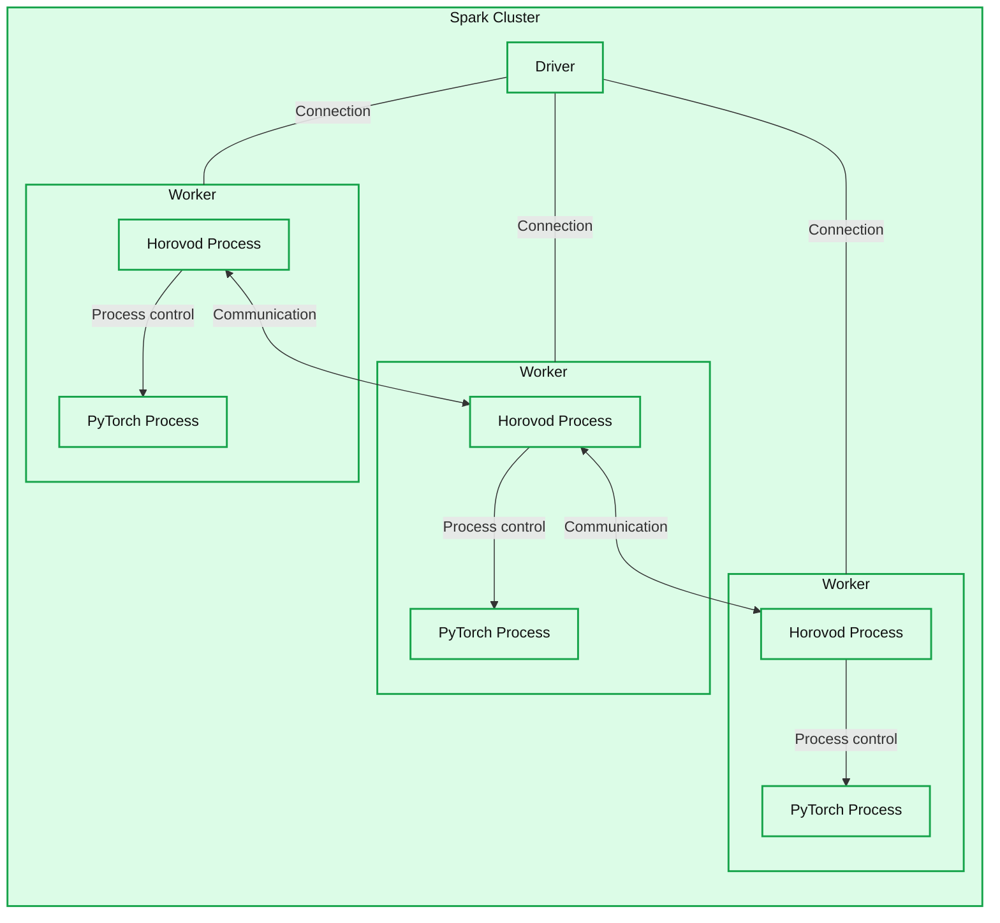
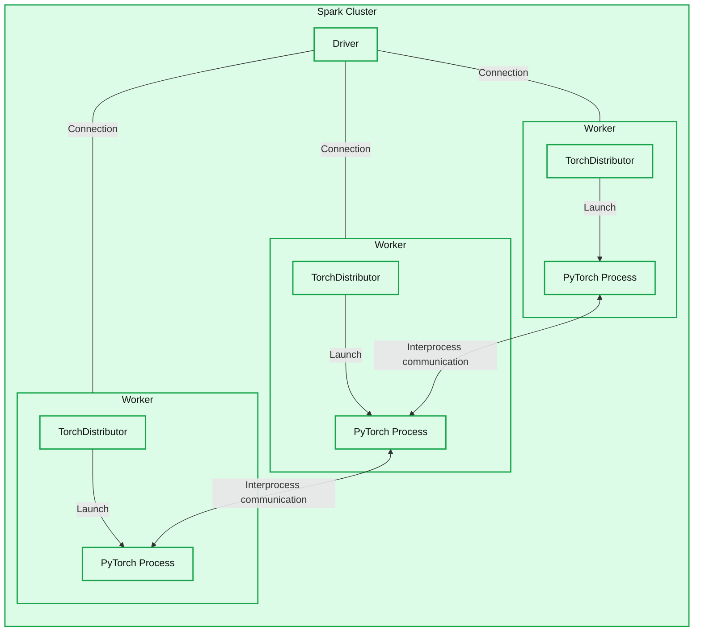
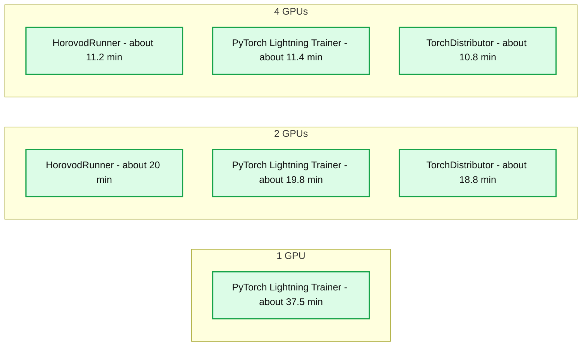
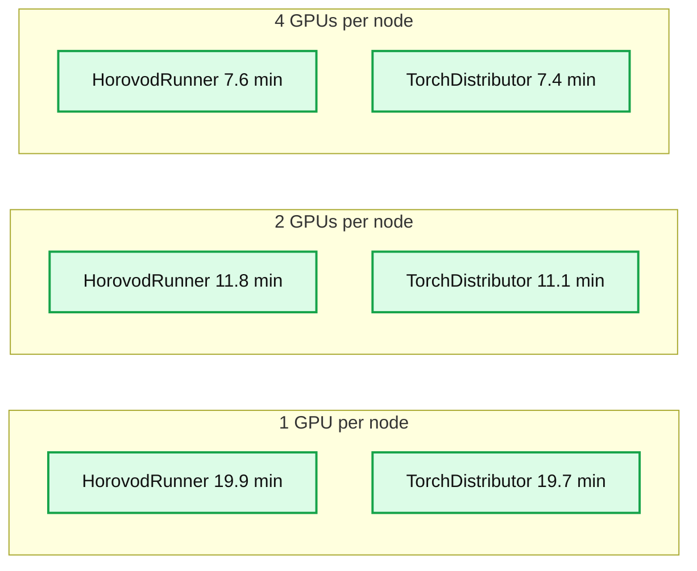

# PyTorch on Databricks - Introducing the Spark PyTorch Distributor

- Source: https://www.databricks.com/blog/2023/04/20/pytorch-databricks-introducing-spark-pytorch-distributor.html
- Published: 2023-04-20
- Authors: Brian Law, Rithwik Ediga Lakhamsani
- Categories: engineering, data-science-machine-learning
- Images: 4 total, 4 extracted as architecture

## Background and Motives

Deep Learning algorithms are complex and time consuming to train, but are quickly moving from the lab to production because of the value these algorithms help realize. Whether using pre-trained models with fine tuning, building a network from scratch or anything in between, the memory and computational load of training can quickly become a bottleneck. As a means toward combating these constraints, a common first line of defense is to leverage distributed training. Whilst tensorflow has long had the spark-tensorflow-distributor, there has been no equivalent for PyTorch.

We are pleased to finally announce the TorchDistributor library to simplify distributed PyTorch training on Apache Spark clusters. In this article, we will go through the new library and how to use it. Databricks is also proud to contribute this back to the open source community.

Historically, when working with Spark, [Horovod](https://horovod.ai/) was the main distribution mechanism and the preferred approach especially in the early, formative days of PyTorch when the APIs for distribution were quite raw. This mechanism however, required both reformatting of code as well as additional tuning and optimization in order to fully leverage the features that Horovod provided.

When distributing deep learning algorithms, there are two approaches, Data Parallel and Model Parallel. Model Parallel training remains an area of academic research and large industry research labs with Data Parallelism being the most common methodology to scale up training.

Data Parallelism has progressed a lot since the early days of the [torch data parallel implementation](https://pytorch.org/docs/stable/generated/torch.nn.DataParallel.html) (dp). Horovod, however, only tackles basic Data Parallel scenarios. That was enough historically, but the rise of Large Language Models (LLMs) means that GPU Ram is now a common bottleneck and newer more efficient Data Parallel methodologies are required.

Some of these newer native PyTorch Data Parallel implementations include Distributed Data Parallel, [`ddp`](https://pytorch.org/tutorials/intermediate/ddp_tutorial.html) and Fully Shared Data Parallel [`fsdp`](https://pytorch.org/docs/stable/fsdp.html). See [here](https://pytorch.org/tutorials/beginner/dist_overview.html) to see why ddp is much preferred over the legacy dp and [here](https://pytorch.org/tutorials/intermediate/FSDP_adavnced_tutorial.html?highlight=fsdphttps://pytorch.org/tutorials/intermediate/FSDP_adavnced_tutorial.html?highlight=fsdp) to understand fsdp. In short, ddp does not transmit as much data between GPUs as part of each training iteration and also parallelises more efficiently, reducing overhead. Fsdp breaks up the model across different GPUs in order to save RAM so that it becomes possible to both increase batch size and allow for bigger models to be trained without having to switch to Model Parallel techniques.

Amongst the wider open source community, libraries like [`deepspeed`](https://www.deepspeed.ai/) and [`colossal`](https://github.com/hpcaitech/ColossalAI) have shown promise in ensuring that scarce GPU resources are efficiently used. To take advantage of ddp, fsdp, deepspeed and colossal amongst others required either significant rework of Horovod or a new distribution mechanism.

It was with these advancements in mind that the TorchDistributor was developed. With it we will be able to better support these new distribution techniques and be able to readily support new innovations in the OSS community.

## Architectural Approaches

*Horovod Architecture with Horovod Process controlling the distribution of the workload.*

**Summary:** A Spark cluster contains a driver connected to three workers, each running a Horovod process that controls a PyTorch process, with communication between adjacent Horovod processes.

**Components:**
- Spark Cluster: Apache Spark cluster enclosing all components.
- Driver: Spark driver.
- Worker, top: Spark worker containing Horovod and PyTorch processes.
- Horovod Process, top: Horovod distribution process.
- PyTorch Process, top: PyTorch execution process.
- Worker, middle: Spark worker containing Horovod and PyTorch processes.
- Horovod Process, middle: Horovod distribution process.
- PyTorch Process, middle: PyTorch execution process.
- Worker, bottom: Spark worker containing Horovod and PyTorch processes.
- Horovod Process, bottom: Horovod distribution process.
- PyTorch Process, bottom: PyTorch execution process.

**Flows:**
- Driver -> top Worker: driver-worker connection, shown without an arrowhead.
- Driver -> middle Worker: driver-worker connection, shown without an arrowhead.
- Driver -> bottom Worker: driver-worker connection, shown without an arrowhead.
- Top Horovod Process -> top PyTorch Process: process control.
- Middle Horovod Process -> middle PyTorch Process: process control.
- Bottom Horovod Process -> bottom PyTorch Process: process control.
- Top Horovod Process -> middle Horovod Process: inter-process communication.
- Middle Horovod Process -> top Horovod Process: inter-process communication.
- Middle Horovod Process -> bottom Horovod Process: inter-process communication.
- Bottom Horovod Process -> middle Horovod Process: inter-process communication.

**Numbers:** none

source image: https://www.databricks.com/sites/default/files/inline-images/db-554-blog-img-1.png

Horovod Architecture with Horovod Process controlling the distribution of the workload.

With Horovod, as it controlled the distribution mechanism and inter-node communication, any new developments like `fsdp` would need to be reimplemented back into the Horovod process.

In contrast, the TorchDistributor, based on the Spark-Tensorflow-Distributor library, provides a mechanism to leverage native distributed PyTorch and PyTorch Lightning APIs directly on an Apache Spark cluster. [Spark's Barrier execution mode](https://www.databricks.com/blog/2018/11/08/introducing-apache-spark-2-4.html) is used in order to execute the native PyTorch `torch.distributed.run` API which is what the [torchrun](https://pytorch.org/docs/stable/elastic/run.html) CLI command also executes with the bash script.

The TorchDistributor starts the PyTorch processes and leaves it to PyTorch to work out the distribution mechanisms acting just to ensure that the processes are coordinated.

*Spark PyTorch Architecture with TorchDistributor controlling the distribution of the workload.*

**Summary:** A Spark cluster contains a driver connected to three workers, each running TorchDistributor and a PyTorch process, with communication between adjacent PyTorch processes.

**Components:**
- Spark Cluster: Apache Spark cluster enclosing all components.
- Driver: Spark driver connected to all three workers.
- Worker, top: Spark worker containing TorchDistributor and a PyTorch process.
- TorchDistributor, top: Spark PyTorch workload distributor.
- PyTorch Process, top: PyTorch execution process.
- Worker, middle: Spark worker containing TorchDistributor and a PyTorch process.
- TorchDistributor, middle: Spark PyTorch workload distributor.
- PyTorch Process, middle: PyTorch execution process.
- Worker, bottom: Spark worker containing TorchDistributor and a PyTorch process.
- TorchDistributor, bottom: Spark PyTorch workload distributor.
- PyTorch Process, bottom: PyTorch execution process.

**Flows:**
- Driver -> top Worker: connection, with no visible arrowhead or payload label.
- Driver -> middle Worker: connection, with no visible arrowhead or payload label.
- Driver -> bottom Worker: connection, with no visible arrowhead or payload label.
- Top TorchDistributor -> top PyTorch Process: process launch.
- Middle TorchDistributor -> middle PyTorch Process: process launch.
- Bottom TorchDistributor -> bottom PyTorch Process: process launch.
- Top PyTorch Process -> middle PyTorch Process: interprocess communication.
- Middle PyTorch Process -> top PyTorch Process: interprocess communication.
- Middle PyTorch Process -> bottom PyTorch Process: interprocess communication.
- Bottom PyTorch Process -> middle PyTorch Process: interprocess communication.

**Numbers:** none

source image: https://www.databricks.com/sites/default/files/inline-images/db-554-blog-img-2.png

Spark PyTorch Architecture with TorchDistributor controlling the distribution of the workload.

This new module eliminates the need for code refactoring and allows for tutorials from the open source community to be plugged directly into Spark and the main training loop. Torchrun is the direction that PyTorch is moving towards for all distributed training routines and leveraging it helps to future-proof our approach.

## Using TorchDistributor

*NOTE ML Runtime 13.x and above required*

The TorchDistributor is simple to use with a few main settings that need to be considered.
The general structure is:

The TorchDistributor has three main configurations

- *num_processes* refers to the number of spark tasks to be run.
- *local_mode* refers to training on the driver node versus training on worker nodes. When training on a single node set *local_mode=True*
- *use_gpu* determines whether we will train using GPUs or not.

When training with GPUs, the TorchDistributor is configured to assign 1 GPU per Spark Task. So *num_processes=2* would create two Spark Tasks with 1 GPU each. Do note as well when training in a multi-node setup, *local_mode=False*, the driver node will not be used for training so a cost saving measure would be to set it to a small GPU node instead. This can be configured from the [Cluster Creation page](https://docs.databricks.com/clusters/configure.html#cluster-node-type).

In the run command, the <*function_or_script*> can either be a python function in the notebook or the path to a training script in the object store. <*args*> is a comma separated list of arguments to be fed into the <*function_or_script*>

The TorchDistributor, when it runs a function, will output the return value. When it is set to run a script file, it will return the output of the script.

As an example here is how we run the TorchDistributor on a single node with two GPUs via a train function that accepts argument *arg1* in a DataBricks notebook:

To run the same function on the TorchDistributor on a multi-node cluster utilising 8 GPUs with the default 1 GPU per spark task setting:

In terms of the structure for the train function, see this [pytorch ddp example](https://github.com/pytorch/examples/blob/1aa2eec9ac94102ac479cd88396b8aa3f2429092/distributed/ddp/example.py). A few changes do have to be made though. The `rank`, `local_rank` and `world_size` will be calculated by the TorchDistributor and set in the environment variables RANK, WORLD_SIZE and LOCAL_RANK and should be read via *os.environ[]* rather than manually managed and set.

PyTorch Lightning, the Keras of PyTorch, can also be used with the TorchDistributor. [See here](https://colab.research.google.com/drive/1Mowb4NzWlRCxzAFjOIJqUmmk_wAT-XP3#scrollTo=nkLv0LDq3GPz) for a detailed introduction into PyTorch Lightning. To use the linked code with TorchDistributor, we can simply wrap the TRAINING LOOP section into a Python function and put that into the *run* command along with any necessary arguments.

As alluded to above, the run command can also be used with a Python CLI training script to make migrations easier. For example:

will execute the file `'/path/to/train.py'` on a single node with 2 GPUs and feed in the argument '--lr=0.01' to any argument parsers within that script.

Any script that is designed to work with [*torchrun*](https://pytorch.org/docs/stable/elastic/run.html) and by association [*torch.distributed.run*](https://github.com/pytorch/pytorch/blob/master/torch/distributed/run.py) will work with the TorchDistributor. One of the key design goals was to be able to support a full interactive notebook experience as well as allow for compatibility with existing codebases designed to be triggered via the CLI. Unlike with CLI solutions, we can rely on Spark and the TorchDistributor to trigger the execution of the code on each node and ensure that there is full network connectivity rather than having to check and set these manually.

## Scaling And Performance

A common question that arises when introducing new methodologies is how well does it perform compared to existing solutions.

To test this out, we trained 15 epochs on [imagenette](https://github.com/fastai/imagenette) dataset with a [resnet50](https://pytorch.org/vision/main/models/resnet.html) model undertaking a classification task. This was run on g4dn nodes on AWS with PyTorch Lightning 1.7.7. See these notebooks [here](https://www.databricks.com/wp-content/uploads/notebooks/db-554/torch_dist_bench.ide_v0.3.dbc) for the benchmark repo to reproduce in your own environment.

For single node training the following performance was achieved:

**Summary:** Single-node training times for 15 epochs decrease as GPU count increases, with similar performance across the three frameworks at 2 and 4 GPUs.

**Components:**
- HorovodRunner: blue training benchmark series.
- PyTorch Lightning Trainer: red training benchmark series.
- TorchDistributor: yellow training benchmark series.
- Number of GPUs: horizontal axis.
- Single Node Training: training duration in minutes for 15 epochs on the vertical axis.

**Flows:**
- none. No arrows are shown.

**Numbers:**
- Training duration: 15 epochs.
- GPU counts: 1, 2, 4.
- Vertical axis ticks: 0, 10, 20, 30, 40 minutes.
- Approximate bar heights, with no exact values printed:
  - 1 GPU: PyTorch Lightning Trainer 37.5 minutes.
  - 2 GPUs: HorovodRunner 20 minutes, PyTorch Lightning Trainer 19.8 minutes, TorchDistributor 18.8 minutes.
  - 4 GPUs: HorovodRunner 11.2 minutes, PyTorch Lightning Trainer 11.4 minutes, TorchDistributor 10.8 minutes.

source image: https://www.databricks.com/sites/default/files/inline-images/db-554-blog-img-3.png

Training on two nodes, the following performance was observed.

**Summary:** Dual-node training times for 15 epochs decrease as GPUs per node increase, with TorchDistributor slightly faster than HorovodRunner.

**Components:**
- HorovodRunner: blue training benchmark series.
- TorchDistributor: yellow training benchmark series.
- Horizontal axis: number of GPUs per node.
- Vertical axis: training time in minutes.

**Flows:**
- none. No arrows are shown.

**Numbers:**
- Two nodes.
- 15 epochs.
- GPUs per node: 1, 2, 4.
- Training-time axis ticks: 0, 5, 10, 15, 20 minutes.
- Approximate bar heights, with no printed value labels:
  - 1 GPU per node: HorovodRunner 19.9 minutes; TorchDistributor 19.7 minutes.
  - 2 GPUs per node: HorovodRunner 11.8 minutes; TorchDistributor 11.1 minutes.
  - 4 GPUs per node: HorovodRunner 7.6 minutes; TorchDistributor 7.4 minutes.

source image: https://www.databricks.com/sites/default/files/inline-images/db-554-blog-img-4.png

We can see that adding GPUs does help to reduce the training times though the scaling does have diminishing returns.

With the TorchDistributor we are proud to bring native Apache Spark support for PyTorch and the associated ecosystem that has grown around this framework. For full code examples please follow the notebooks [here](https://www.databricks.com/wp-content/uploads/notebooks/db-554/spark_pytorch_distributor_samples_v0.2.dbc).
