# Best Practices for LLM Evaluation of RAG Applications

*A Case Study on the Databricks Documentation Bot*

- Source: https://www.databricks.com/blog/LLM-auto-eval-best-practices-RAG
- Published: 2023-09-12
- Authors: Quinn Leng, Kasey Uhlenhuth, Alkis Polyzotis
- Categories: machine-learning, engineering
- Images: 12 total, 11 extracted as architecture

Chatbots are the most widely adopted use case for leveraging the powerful chat and reasoning capabilities of large language models (LLM). The retrieval augmented generation (RAG) architecture is quickly becoming the industry standard for developing chatbots because it combines the benefits of a knowledge base (via a vector store) and generative models (e.g. GPT-3.5 and GPT-4) to reduce hallucinations, maintain up-to-date information, and leverage domain-specific knowledge. However, evaluating the quality of chatbot responses remains an unsolved problem today. With no industry standards defined, organizations resort to human grading (labeling) –which is time-consuming and hard to scale.

We applied theory to practice to help form best practices for LLM automated evaluation so you can deploy RAG applications to production quickly and with confidence. This blog represents the first in a series of investigations we’re running at Databricks to provide learnings on LLM evaluation. All research in this post was conducted by [Quinn Leng](mailto:quinn.leng@databricks.com), Senior Software Engineer at Databricks and creator of the [Databricks Documentation AI Assistant](https://docs.databricks.com/). 

## Challenges with auto-evaluation in practice

Recently, the LLM community has been exploring the use of “LLMs as a judge” for automated evaluation with many using powerful LLMs such as GPT-4 to do the evaluation for their LLM outputs. The lmsys group’s [research paper](https://arxiv.org/abs/2306.05685) explores the feasibility and pros/cons of using various LLMs (GPT-4, ClaudeV1, GPT-3.5) as the judge for tasks in writing, math, and world knowledge.

Despite all this great research, there are still many unanswered questions about how to apply LLM judges in practice:

- **Alignment with Human Grading**: Specifically for a document-Q&A chatbot, how well does an LLM judge’s grading reflect the actual human preference in terms of correctness, readability and comprehensiveness of the answers? 
- **Accuracy through Examples**: What’s the effectiveness of providing a few grading examples to the LLM judge and how much does it increase the reliability and reusability of the LLM judge on different metrics?
- **Appropriate Grade Scales**: What grading scale is recommended because different grading scales are used by different frameworks (e.g., [AzureML](https://techcommunity.microsoft.com/t5/ai-machine-learning-blog/harness-the-power-of-large-language-models-with-azure-machine/ba-p/3828459) uses 0 to 100 whereas [langchain](https://autoevaluator.langchain.com/) uses binary scales)?
- **Applicability Across Use Cases**: With the same evaluation metric (e.g. correctness), to what extent can the evaluation metric be reused across different use cases (e.g. casual chat, content summarization, retrieval-augmented generation)? 

## Applying effective auto-evaluation for RAG applications

We explored the possible options for the questions outlined above in the context of our own chatbot application at Databricks. We believe that our findings generalize and can thus help your team effectively evaluate RAG-based chatbots at a lower cost and faster speed:

- **LLM-as-a-judge agrees with human grading on over 80% of judgments.** Using LLMs-as-a-judge for our document-based chatbot evaluation was as effective as human judges, matching the exact score in over 80% of judgments and being within a 1-score distance (using a scale of 0-3) in over 95% of judgments.
- **Save costs by using GPT-3.5 with examples.** GPT-3.5 can be used as an LLM judge if you provide examples for each grading score. Because of the context size limit it’s only practical to use a low-precision grading scale. Using GPT-3.5 with examples instead of GPT-4 drives down the cost of LLM judge by 10x and improves the speed by more than 3x.
- **Use low-precision grading scales for easier interpretation.** We found lower-precision grading scores like 0, 1, 2, 3 or even binary (0, 1) can largely retain precision compared to higher precision scales like 0 to 10.0 or 0 to 100.0, while making it considerably easier to provide grading rubrics to both human annotators and LLM judges. Using a lower precision scale also allows consistency of grading scales among different LLM judges (e.g. between GPT-4 and claude2).
- **RAG applications require their own benchmarks.** A model might have good performance on a published specialized benchmark (e.g. casual chat, math, or creative writing) but that doesn’t guarantee good performance on other tasks (e.g. answering questions from a given context). Benchmarks should only be used if the use case matches, i.e., a RAG application should only be evaluated with a RAG benchmark.

Based on our research, we recommend the following procedure when using an LLM judge: 

1. Use a 1-5 grading scale
2. Use GPT-4 as an LLM judge with no examples to understand grading rules
3. Switch your LLM judge to GPT-3.5 with one example per score

## Our methodology for establishing the best practices

The remainder of this post will walk through the series of experiments we conducted to form these best practices. 

### Experiment Setup

**Summary:** The workflow generates a Databricks/Spark benchmark dataset, produces model answer sheets, and uses an LLM judge to generate grading results.

**Components:**
- Generate Benchmark Dataset: first stage, using Databricks/Spark documents and questions.
- Benchmark Dataset: documents and questions from Databricks/Spark.
- Generate Answer Sheets: second stage, combining a model and document QA tasks.
- Model: language model; specific technology unspecified.
- Doc QA Tasks: question and context.
- Generate Grading: third stage, containing answer sheets and an LLM judge.
- Answer Sheets: question, context, and answer.
- LLM Judge: powerful LLM such as GPT-4.
- Grading Results: final score, correctness, comprehensiveness, and readability.

**Flows:**
- Benchmark Dataset -> Doc QA Tasks: questions and context.
- Model -> Answer Sheets: model-generated answers.
- Doc QA Tasks -> Answer Sheets: questions and context.
- Answer Sheets -> Grading Results: answer sheets for evaluation.
- LLM Judge -> Grading Results: judgments and scores.

**Numbers:** Stage numbers 1, 2, and 3; GPT-4 model identifier.

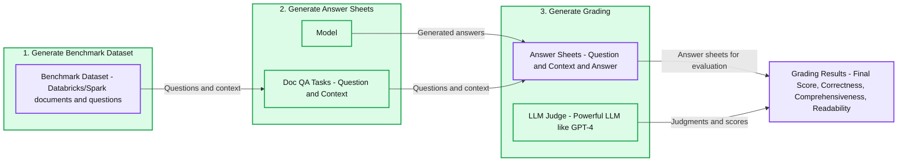

source image: https://www.databricks.com/sites/default/files/inline-images/image10.png

 

The experiment had three steps: 

 

1. **Generate evaluation dataset**: We created a dataset from 100 questions and context from Databricks documents. The context represents (chunks of) documents that are relevant to the question. 

---

2. **Generate answer sheets**: Using the evaluation dataset, we prompted different language models to generate answers and stored the question-context-answer pairs in a dataset called “answer sheets”. In this investigation, we used GPT-4, GPT-3.5, Claude-v1, Llama2-70b-chat, Vicuna-33b, and mpt-30b-chat.
3. **Generate grades**: Given the answer sheets, we used various LLMs to generate grades and reasoning for the grades. The grades are a composite score of Correctness (weighted: 60%), Comprehensiveness (weighted: 20%) and Readability (weighted: 20%). We chose this weighting scheme to reflect our preference for Correctness in the generated answers. Other applications may tune these weights differently but we expect Correctness to remain a dominant factor.

Additionally, the following techniques were used to avoid positional bias and improve reliability:

- Low temperature (temperature 0.1) to ensure reproducibility.
- Single-answer grading instead of pairwise comparison.
- Chain of thoughts to let the LLM reason about the grading process before giving the final score.
- Few-shots generation where the LLM is provided with several examples in the grading rubric for each score value on each factor (Correctness, Comprehensiveness, Readability). 

### Experiment 1: Alignment with Human Grading

To confirm the level of agreement between human annotators and LLM judges, we sent answer sheets (grading scale 0-3) from gpt-3.5-turbo and vicuna-33b to a labeling company to collect human labels, and then compared the result with GPT-4’s grading output. Below are the findings:

- Human and GPT-4 judges can reach above 80% agreement on the correctness and readability score. And if we lower the requirement to be smaller or equal than 1 score difference, the agreement level can reach above 95%.    **Summary:** Human and GPT-4 grading of GPT-3.5 answers matches exactly for 88% of correctness scores, 95% of readability scores, and 72% of comprehensiveness scores.

**Components:**
- Human and GPT-4: graders evaluating GPT-3.5 answers.
- Correctness: grading alignment metric.
- Readability: grading alignment metric.
- Comprehensiveness: grading alignment metric.
- Same Score: blue segments indicating identical grades.
- Diff = 1: orange segments indicating a one-point difference.
- Diff = 2: pink segments indicating a two-point difference.

**Flows:**
- none. No arrows are visible.

**Numbers:**
- Model labels: GPT-4 and GPT-3.5.
- Same Score: Correctness 88%, Readability 95%, Comprehensiveness 72%.
- Score differences: 1 and 2.
- Vertical axis: 0.00, 0.25, 0.50, 0.75, 1.00.

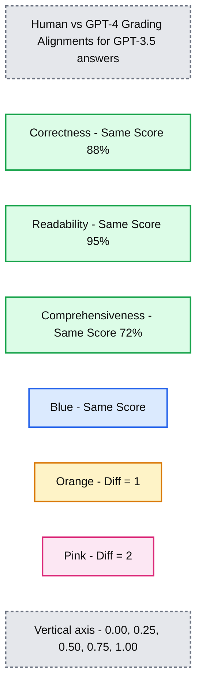

source image: https://www.databricks.com/sites/default/files/inline-images/image7_1.png
 **Summary:** Human and GPT-4 grading of vicuna-33b answers agrees most on readability, followed by correctness and comprehensiveness.

**Components:**

- Correctness: human versus GPT-4 grading of vicuna-33b answers.
- Readability: human versus GPT-4 grading of vicuna-33b answers.
- Comprehensiveness: human versus GPT-4 grading of vicuna-33b answers.
- Same Score: blue segments showing identical grades.
- Diff = 1: orange segments showing a one-point grading difference.
- Diff = 2: pink segments showing a two-point grading difference.

**Flows:**

- none. No arrows are visible.

**Numbers:**

- Model labels: GPT-4 and vicuna-33b.
- Same Score: Correctness 82.60%, Readability 96.50%, Comprehensiveness 64.30%.
- Legend differences: 2 and 1.
- Vertical axis: 0.00%, 25.00%, 50.00%, 75.00%, 100.00%.

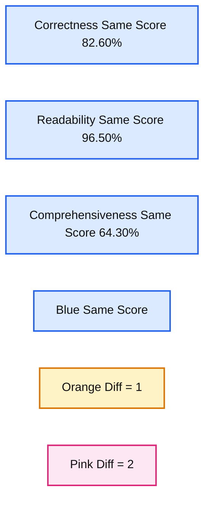

source image: https://www.databricks.com/sites/default/files/inline-images/image6_1.png

|  |  |
|---|---|

The Comprehensiveness metric has less alignment, which matches what we’ve heard from business stakeholders who shared that “comprehensive” seems more subjective than metrics like Correctness or Readability. 

### Experiment 2: Accuracy through Examples

The lmsys paper uses this [prompt](https://github.com/lm-sys/FastChat/blob/main/fastchat/llm_judge/data/judge_prompts.jsonl) to instruct the LLM judge to evaluate based on the helpfulness, relevance, accuracy, depth, creativity, and level of detail of the response. However, the paper doesn’t share specifics on the grading rubric. From our research, we found many factors can significantly affect the final score, for example:

- The importance of different factors: Helpfulness, Relevance, Accuracy, Depth, Creativity
- The interpretation of factors like Helpfulness is ambiguous 
- If different factors conflict with each other, where an answer is helpful but is not accurate 

We developed a rubric for instructing an LLM judge for a given grading scale, by trying the following:

1. **Original Prompt**: Below is the original prompt used in the lmsys paper:

| Please act as an impartial judge and evaluate the quality of the response provided by an AI assistant to the user question displayed below. Your evaluation should consider factors such as the helpfulness, relevance, accuracy, depth, creativity, and level of detail of the response. Begin your evaluation by providing a short explanation. Be as objective as possible. After providing your explanation, you must rate the response on a scale of 1 to 10 by strictly following this format |
|---|

We adapted the original lmsys paper prompt to emit our metrics about correctness, comprehensiveness and readability, and also prompt the judge to provide one line justification before giving each score (to benefit from chain-of-thought reasoning). Below are the zero-shot version of the prompt which doesn’t provide any example, and the few-shot version of the prompt which provides one example for each score. Then we used the same answer sheets as input and compared the graded results from the two prompt types.

1. **Zero Shot Learning**: require the LLM judge to emit our metrics about correctness, comprehensiveness and readability, and also prompt the judge to provide one line justification for each score. 

| Please act as an impartial judge and evaluate the quality of the provided answer which attempts to answer the provided question based on a provided context. You'll be given a function grading_function which you'll call for each provided context, question and answer to submit your reasoning and score for the correctness, comprehensiveness and readability of the answer. |
|---|

1. **Few Shots Learning**:  We adapted the zero shot prompt to provide explicit examples for each score in the scale. The new prompt:

| Please act as an impartial judge and evaluate the quality of the provided answer which attempts to answer the provided question based on a provided context. You'll be given a function grading_function which you'll call for each provided context, question and answer to submit your reasoning and score for the correctness, comprehensiveness and readability of the answer. Below is your grading rubric: - Correctness: If the answer correctly answer the question, below are the details for different scores: - Score 0: the answer is completely incorrect, doesn’t mention anything about the question or is completely contrary to the correct answer. - For example, when asked “How to terminate a databricks cluster”, the answer is empty string, or content that’s completely irrelevant, or sorry I don’t know the answer. - Score 1: the answer provides some relevance to the question and answers one aspect of the question correctly. - Example: - Question: How to terminate a databricks cluster - Answer: Databricks cluster is a cloud-based computing environment that allows users to process big data and run distributed data processing tasks efficiently. - Or answer: In the Databricks workspace, navigate to the "Clusters" tab. And then this is a hard question that I need to think more about it - Score 2: the answer mostly answer the question but is missing or hallucinating on one critical aspect. - Example: - Question: How to terminate a databricks cluster” - Answer: “In the Databricks workspace, navigate to the "Clusters" tab. Find the cluster you want to terminate from the list of active clusters. And then you’ll find a button to terminate all clusters at once” - Score 3: the answer correctly answer the question and not missing any major aspect - Example: - Question: How to terminate a databricks cluster - Answer: In the Databricks workspace, navigate to the "Clusters" tab. Find the cluster you want to terminate from the list of active clusters. Click on the down-arrow next to the cluster name to open the cluster details. Click on the "Terminate" button. A confirmation dialog will appear. Click "Terminate" again to confirm the action.”- Comprehensiveness: How comprehensive is the answer, does it fully answer all aspects of the question and provide comprehensive explanation and other necessary information. Below are the details for different scores: - Score 0: typically if the answer is completely incorrect, then the comprehensiveness is also zero score. - Score 1: if the answer is correct but too short to fully answer the question, then we can give score 1 for comprehensiveness. - Example: - Question: How to use databricks API to create a cluster? - Answer: First, you will need a Databricks access token with the appropriate permissions. You can generate this token through the Databricks UI under the 'User Settings' option. And then (the rest is missing) - Score 2: the answer is correct and roughly answer the main aspects of the question, but it’s missing description about details. Or is completely missing details about one minor aspect. - Example: - Question: How to use databricks API to create a cluster? - Answer: You will need a Databricks access token with the appropriate permissions. Then you’ll need to set up the request URL, then you can make the HTTP Request. Then you can handle the request response. - Example: - Question: How to use databricks API to create a cluster? - Answer: You will need a Databricks access token with the appropriate permissions. Then you’ll need to set up the request URL, then you can make the HTTP Request. Then you can handle the request response. - Score 3: the answer is correct, and covers all the main aspects of the question- Readability: How readable is the answer, does it have redundant information or incomplete information that hurts the readability of the answer. - Score 0: the answer is completely unreadable, e.g. fully of symbols that’s hard to read; e.g. keeps repeating the words that it’s very hard to understand the meaning of the paragraph. No meaningful information can be extracted from the answer. - Score 1: the answer is slightly readable, there are irrelevant symbols or repeated words, but it can roughly form a meaningful sentence that cover some aspects of the answer. - Example: - Question: How to use databricks API to create a cluster? - Answer: You you you you you you will need a Databricks access token with the appropriate permissions. And then then you’ll need to set up the request URL, then you can make the HTTP Request. Then Then Then Then Then Then Then Then Then - Score 2: the answer is correct and mostly readable, but there is one obvious piece that’s affecting the readability (mentioning of irrelevant pieces, repeated words) - Example: - Question: How to terminate a databricks cluster - Answer: In the Databricks workspace, navigate to the "Clusters" tab. Find the cluster you want to terminate from the list of active clusters. Click on the down-arrow next to the cluster name to open the cluster details. Click on the "Terminate" button………………………………….. A confirmation dialog will appear. Click "Terminate" again to confirm the action. - Score 3: the answer is correct and reader friendly, no obvious piece that affect readability. - Then final rating: - Ratio: 60% correctness + 20% comprehensiveness + 20% readability |
|---|

 

From this experiment, we learned several things:

- **Using the Few Shots prompt with GPT-4 didn’t make an obvious difference in the consistency of results**. When we included the detailed grading rubric with examples we didn’t see a noticeable improvement in GPT-4’s grading results across different LLM models. Interestingly, it caused a slight variance in the range of the scores. 

**Summary:** GPT-4 zero-shot judging produces tightly grouped scores across six evaluated models, with GPT-4 scoring highest and Vicuna-33b lowest.

**Components:**

- Judge: GPT-4, using zero-shot evaluation.
- gpt_4: evaluated GPT-4 model.
- gpt_35: evaluated GPT-3.5 model.
- claude_v1: evaluated Claude v1 model.
- llama2_70b_chat: evaluated Llama 2 70B Chat model.
- mpt_30b_chat: evaluated MPT 30B Chat model.
- vicuna_33b: evaluated Vicuna 33B model.
- Score: vertical axis.
- Model Name: horizontal axis.

**Flows:**

- none. No arrows are visible.

**Numbers:**

- Score axis ticks: 1.5, 2, 2.5, 3.
- Approximate plotted scores: gpt_4 3.00; gpt_35 2.94-2.98; claude_v1 2.92-2.93 with a point near 2.90; llama2_70b_chat 2.75-2.80; mpt_30b_chat 1.60-1.67; vicuna_33b 1.45-1.48 with a point near 1.52.
- Model identifiers include: GPT-4, GPT-3.5, Claude v1, Llama 2 70B, MPT 30B, Vicuna 33B.
- Zero-shot evaluation.

```mermaid
%% GPT-4 zero-shot judge score variation across six models
flowchart LR
    subgraph Scores[GPT-4 as Judge - Zero shot - Score by Model Name]
        A[gpt_4 - approximately 3.00]
        B[gpt_35 - approximately 2.94 to 2.98]
        C[claude_v1 - approximately 2.90 to 2.93]
        D[llama2_70b_chat - approximately 2.75 to 2.80]
        E[mpt_30b_chat - approximately 1.60 to 1.67]
        F[vicuna_33b - approximately 1.45 to 1.52]
    end

    classDef client fill:#dbeafe,stroke:#2563eb,stroke-width:2px,color:#111
    classDef service fill:#dcfce7,stroke:#16a34a,stroke-width:2px,color:#111
    classDef store fill:#ede9fe,stroke:#7c3aed,stroke-width:2px,color:#111
    classDef cache fill:#fef3c7,stroke:#d97706,stroke-width:2px,color:#111
    classDef queue fill:#cffafe,stroke:#0891b2,stroke-width:2px,color:#111
    classDef critical fill:#fee2e2,stroke:#dc2626,stroke-width:4px,color:#111
    classDef external fill:#e5e7eb,stroke:#6b7280,stroke-width:2px,color:#111,stroke-dasharray:4 3
    classDef decision fill:#fce7f3,stroke:#db2777,stroke-width:2px,color:#111
    class A,B,C,D,E,F service
```

source image: https://www.databricks.com/sites/default/files/inline-images/image4_3.png

**Summary:** GPT-4 judging with few-shot prompting produces scores near 3 for Claude, GPT-3.5, and GPT-4, around 2.85 for Llama 2, and around 1.6 for Vicuna and MPT.

**Components:**
- gpt-4 as Judge: evaluation using few-shot prompting.
- claude_v1: evaluated Claude model.
- gpt_35: evaluated GPT-3.5 model.
- gpt_4: evaluated GPT-4 model.
- llama2_70b_chat: evaluated Llama 2 chat model.
- vicuna_33b: evaluated Vicuna model.
- mpt_30b_chat: evaluated MPT chat model.
- Model Name: horizontal axis.
- Score: vertical axis.

**Flows:**
- none. No arrows are visible.

**Numbers:**
- Vertical axis ticks: 1.5, 2, 2.5, 3.
- Approximate plotted scores:
  - claude_v1: near 3.00, with a point at 2.80.
  - gpt_35: near 3.00, with a point at 2.88.
  - gpt_4: near 3.00, with a point at 2.88.
  - llama2_70b_chat: 2.84-2.86.
  - vicuna_33b: 1.58-1.61.
  - mpt_30b_chat: 1.53-1.60.
- Numeric model identifiers: gpt-4, claude_v1, gpt_35, gpt_4, llama2_70b_chat, vicuna_33b, mpt_30b_chat.
- No score units are shown.

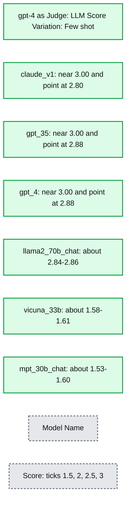

source image: https://www.databricks.com/sites/default/files/inline-images/image9.png

- **Including few examples for GPT-3.5-turbo-16k significantly improves the consistency of the scores, and makes the result usable**. Including detailed grading rubric/examples has very obvious improvement on the grading result from GPT-3.5 (chart on the right side) Though the actual average score value is slightly different between GPT-4 and GPT-3.5 (score 3.0 vs score 2.6), the ranking and precision remains fairly consistent

- On the contrary, (screenshot on the left) using GPT-3.5 without a grading rubric gets very inconsistent results and is completely unusable
- Note that we are using GPT-3.5-turbo-16k instead of GPT-3.5-turbo since the prompt can be larger than 4k tokens. 

**Summary:** GPT-3.5-turbo-16k zero-shot judging produces different score distributions across six evaluated models, with mpt_30b_chat showing the greatest variation.

**Components:**
- Judge: gpt-3.5-turbo-16k, using zero-shot evaluation.
- mpt_30b_chat: evaluated language model.
- claude_v1: evaluated language model.
- gpt_4: evaluated language model.
- llama2_70b_chat: evaluated language model.
- gpt_35: evaluated language model.
- vicuna_33b: evaluated language model.
- Model Name: horizontal axis.
- Score: vertical axis.

**Flows:**
- none. No arrows are visible.

**Numbers:**
- Score axis ticks: 1, 1.5, 2, 2.5. No units shown.
- Numeric identifiers in labels: gpt-3.5-turbo-16k, mpt_30b_chat, claude_v1, gpt_4, llama2_70b_chat, gpt_35, vicuna_33b.
- Approximate plotted score extents, read visually:
  - mpt_30b_chat: 1.64-1.99, with an outlier at 2.68.
  - claude_v1: 2.16-2.31.
  - gpt_4: 1.61-1.80.
  - llama2_70b_chat: 1.70-1.75.
  - gpt_35: 1.56-1.74.
  - vicuna_33b: 1.02-1.09.

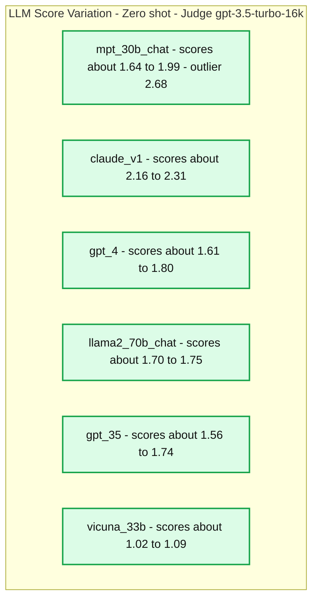

source image: https://www.databricks.com/sites/default/files/inline-images/image11.png

**Summary:** GPT-3.5-turbo-16k judges six models using few-shot prompting, with box plots showing score variation and claude_v1 receiving the highest scores.

**Components:**
- Judge: gpt-3.5-turbo-16k, using few-shot prompting.
- claude_v1: evaluated model.
- gpt_4: evaluated model.
- llama2_70b_chat: evaluated model.
- gpt_35: evaluated model.
- vicuna_33b: evaluated model.
- mpt_30b_chat: evaluated model.
- Score: vertical axis.
- Model Name: horizontal axis.

**Flows:**
- none. No arrows are visible.

**Numbers:**
- Score axis ticks: 1.8, 2, 2.2, 2.4, 2.6.
- Numeric identifiers in labels: judge gpt-3.5-turbo-16k; claude_v1; gpt_4; llama2_70b_chat; gpt_35; vicuna_33b; mpt_30b_chat.
- Approximate plotted score ranges, read visually: claude_v1 2.57-2.59; gpt_4 2.51-2.53, with an outlier near 2.47; llama2_70b_chat 2.42-2.50; gpt_35 2.47-2.50; vicuna_33b 1.77-1.80; mpt_30b_chat 1.70-1.76.

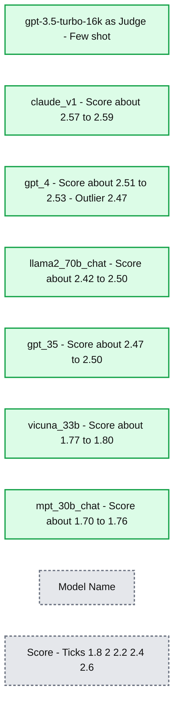

source image: https://www.databricks.com/sites/default/files/inline-images/image5_0.png

### Experiment 3: Appropriate Grade Scales

The LLM-as-judge paper uses a non-integer 0~10 scale (i.e. float) for the grading scale; in other words, it uses a high precision rubric for the final score. We found these high-precision scales cause issues downstream with the following:

- **Consistency**: Evaluators–both human and LLM–struggled to hold the same standard for the same score when grading on high precision. As a result, we found that output scores are less consistent across judges if you move from low-precision to high-precision scales. 
- **Explainability**: Additionally, if we want to cross-validate the LLM-judged results with human-judged results we must provide instructions on how to grade answers. It is very difficult to provide accurate instructions for each “score” in a high-precision grading scale–for example, what’s a good example for an answer that’s scored at 5.1 as compared to 5.6? 

We experimented with various low-precision grading scales to provide guidance on the “best” one to use, ultimately we recommend an integer scale of 0-3 or 0-4 (if you want to stick to the [Likert](https://en.wikipedia.org/wiki/Likert_scale) scale). We tried 0-10, 1-5, 0-3, and 0-1 and learned:

- Binary grading works for simple metrics like “usability” or “good/bad”.
- Scales like 0-10 are difficult to come up with distinguishing criteria between all scores.

**Summary:** GPT-4 judge scores show similar model rankings across four grading scales.

**Components:**
- Judge: GPT-4.
- Models evaluated: gpt_4, gpt_35, claude_v1, llama2_70b_chat, vicuna_33b, and mpt_30b_chat.
- Grading Scale: horizontal axis with 0~10, 1~5, 0~3, and 0~1 categories.
- Average Score: vertical axis.
- Model Name: legend identifying the six model series.

**Flows:**
- none. No arrows are visible.

**Numbers:**

| Model | 0~10 | 1~5 | 0~3 | 0~1 |
|---|---:|---:|---:|---:|
| gpt_4 | 9.99 | 5.00 | 3.00 | 1.00 |
| gpt_35 | 9.96 | 4.98 | 2.99 | 1.00 |
| claude_v1 | 10.00 | 5.00 | 2.98 | 0.99 |
| llama2_70b_chat | 9.45 | 4.76 | 2.84 | 0.95 |
| vicuna_33b | 5.24 | 3.10 | 1.57 | 0.52 |
| mpt_30b_chat | 5.36 | 3.02 | 1.50 | 0.52 |

- Vertical axis ticks: 0, 2, 4, 6, 8, 10.
- Title identifies gpt-4 as judge.
- No units or percentages are shown.

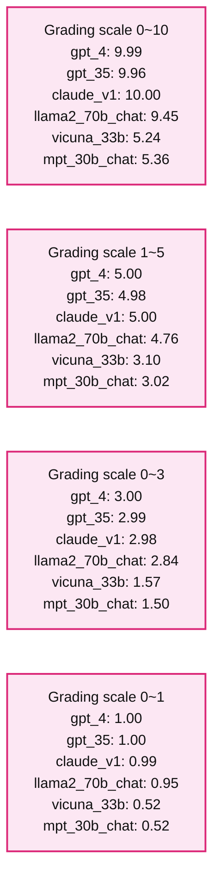

source image: https://www.databricks.com/sites/default/files/inline-images/image1_6.png

**Summary:** GPT-3.5-turbo-16k judges six models across four grading scales, with similar relative scores across scales.

**Components:**

- Judge: gpt-3.5-turbo-16k.
- Models: claude_v1, gpt_4, llama2_70b_chat, gpt_35, mpt_30b_chat, vicuna_33b.
- Grading Scale: horizontal axis grouping results by scoring range.
- Average Score: vertical axis showing mean scores.
- Model Name: legend identifying each model’s bar color.

**Flows:**

- none. No arrows are visible.

**Numbers:**

- Judge identifier: gpt-3.5-turbo-16k.
- Model identifiers containing numbers: claude_v1, gpt_4, llama2_70b_chat, gpt_35, mpt_30b_chat, vicuna_33b.
- Vertical axis ticks: 0, 2, 4, 6, 8, 10.
- Scores by grading scale:

| Model | 0~10 | 1~5 | 0~3 | 0~1 |
|---|---:|---:|---:|---:|
| claude_v1 | 9.95 | 4.96 | 2.97 | 1.00 |
| gpt_4 | 9.96 | 4.98 | 2.99 | 1.00 |
| llama2_70b_chat | 9.80 | 4.86 | 2.93 | 0.99 |
| gpt_35 | 9.94 | 4.98 | 2.98 | 0.99 |
| mpt_30b_chat | 7.05 | 3.70 | 2.18 | 0.69 |
| vicuna_33b | 6.10 | 3.39 | 1.81 | 0.61 |

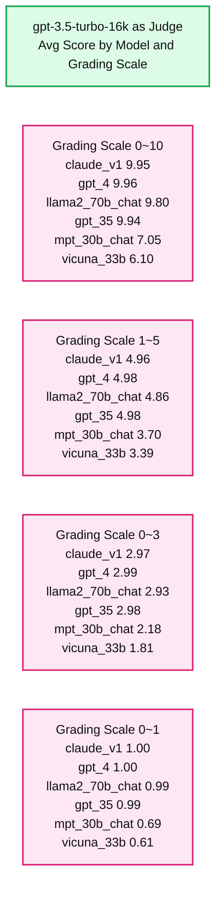

source image: https://www.databricks.com/sites/default/files/inline-images/image2_4.png

As shown in the plots above, both GPT-4 and GPT-3.5 can retain consistent ranking of results using different low-precision grading scales, thus using a lower grading scale like 0~3 or 1~5 can balance the precision with explainability)

Thus we recommend 0-3 or 1-5 as a grading scale to make it easier to align with human labels, reason about scoring criteria, and provide examples for each score in the range. 

### Experiment 4: Applicability Across Use Cases

The [LLM-as-judge](https://arxiv.org/abs/2306.05685) paper shows that both LLM and human judgment ranks the Vicuna-13B model as a close competitor to GPT-3.5:

**Summary:** Nine models’ average Chatbot Arena win rates are compared across four judges, using all votes and non-tied votes.

**Components:**
- GPT-4 Judge: GPT-4 evaluation, blue line with cross markers.
- GPT-3.5 Judge: GPT-3.5 evaluation, orange line with triangle markers.
- Human: human evaluation, red line with circle markers.
- GPT-4-Single Judge: GPT-4 single evaluation, yellow-green line with dot markers.
- All votes: left panel showing win rate.
- Non-tied votes: right panel showing win rate with ties excluded.
- Evaluated models: GPT-4, Claude, GPT-3.5, Vicuna-13B, Vicuna-7B, Koala-13B, Alpaca-13B, Dolly-12B, and LLaMA-13B.

**Flows:**
- none. Lines connect plotted measurements; there are no arrows.

**Numbers:**
- Both win-rate axes: 0.0, 0.2, 0.4, 0.6, 0.8, 1.0.
- Model and judge identifiers contain: GPT-4 and GPT-3.5.
- Model size labels: Vicuna-13B, Vicuna-7B, Koala-13B, Alpaca-13B, Dolly-12B, LLaMA-13B.
- Caption: Figure 4; nine models.
- Individual plotted values are not numerically labeled.

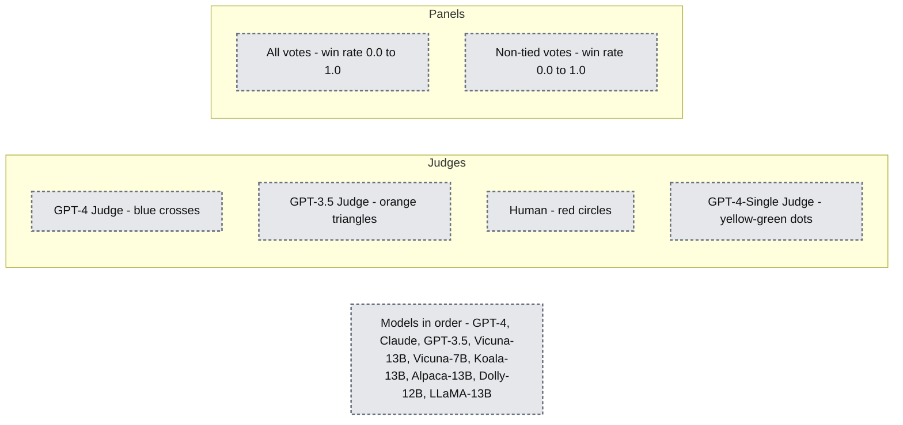

source image: https://www.databricks.com/sites/default/files/inline-images/image8.png

(The figure is coming from Figure 4 of the LLM-as-judge paper: [https://arxiv.org/pdf/2306.05685.pdf](https://arxiv.org/pdf/2306.05685.pdf) )

 

However, when we benchmarked the set of models for our document Q&A use cases, we found that even the much larger Vicuna-33B model has a noticeably worse performance than GPT-3.5 when answering questions based on context. These findings are also verified by GPT-4, GPT-3.5 and human judges (as mentioned in Experiment 1) which all agree that Vicuna-33B is performing worse than GPT-3.5.

**Summary:** GPT-4 judge average scores compare six models across four grading scales.

**Components:**
- Judge: gpt-4.
- gpt_4: evaluated language model, blue bars.
- gpt_35: evaluated language model, red bars.
- claude_v1: evaluated language model, green bars.
- llama2_70b_chat: evaluated language model, purple bars.
- vicuna_33b: evaluated language model, orange bars.
- mpt_30b_chat: evaluated language model, cyan bars.
- Grading Scale: horizontal axis.
- Average Score: vertical axis.
- Model Name: legend.

**Flows:**
- none. No arrows are visible.

**Numbers:**

Title: gpt-4 as Judge. Vertical axis ticks: 0, 2, 4, 6, 8, 10.

| Model | 0~10 scale | 1~5 scale | 0~3 scale | 0~1 scale |
|---|---:|---:|---:|---:|
| gpt_4 | 9.99 | 5.00 | 3.00 | 1.00 |
| gpt_35 | 9.96 | 4.98 | 2.99 | 1.00 |
| claude_v1 | 10.00 | 5.00 | 2.98 | 0.99 |
| llama2_70b_chat | 9.45 | 4.76 | 2.84 | 0.95 |
| vicuna_33b | 5.24 | 3.10 | 1.57 | 0.52 |
| mpt_30b_chat | 5.36 | 3.02 | 1.50 | 0.52 |

```mermaid
%% GPT-4 judge average scores by model and grading scale
flowchart TD
  J[GPT-4 as Judge]
  S[Grading scales in order: 0~10, 1~5, 0~3, 0~1]
  A[gpt_4 scores: 9.99, 5.00, 3.00, 1.00]
  B[gpt_35 scores: 9.96, 4.98, 2.99, 1.00]
  C[claude_v1 scores: 10.00, 5.00, 2.98, 0.99]
  D[llama2_70b_chat scores: 9.45, 4.76, 2.84, 0.95]
  E[vicuna_33b scores: 5.24, 3.10, 1.57, 0.52]
  F[mpt_30b_chat scores: 5.36, 3.02, 1.50, 0.52]
  Y[Average Score ticks: 0, 2, 4, 6, 8, 10]

  classDef client fill:#dbeafe,stroke:#2563eb,stroke-width:2px,color:#111
  classDef service fill:#dcfce7,stroke:#16a34a,stroke-width:2px,color:#111
  classDef store fill:#ede9fe,stroke:#7c3aed,stroke-width:2px,color:#111
  classDef cache fill:#fef3c7,stroke:#d97706,stroke-width:2px,color:#111
  classDef queue fill:#cffafe,stroke:#0891b2,stroke-width:2px,color:#111
  classDef critical fill:#fee2e2,stroke:#dc2626,stroke-width:4px,color:#111
  classDef external fill:#e5e7eb,stroke:#6b7280,stroke-width:2px,color:#111,stroke-dasharray:4 3
  classDef decision fill:#fce7f3,stroke:#db2777,stroke-width:2px,color:#111
  class J,A,B,C,D,E,F service
  class S,Y external
```

source image: https://www.databricks.com/sites/default/files/inline-images/image1_6.png

We looked closer at the benchmark dataset proposed by the paper and found that the [3 categories of tasks](https://arxiv.org/pdf/2306.05685.pdf) (writing, math, knowledge) don’t directly reflect or contribute to the model’s ability to synthesize an answer based on a context. Instead, intuitively, document Q&A use cases need benchmarks on reading comprehension and instruction following. Thus **evaluation results can’t be transferred between use cases** and we need to build use-case-specific benchmarks in order to properly evaluate how good a model can meet customer needs.

## Use MLflow to leverage our best practices

With the experiments above, we explored how different factors can significantly affect the evaluation of a chatbot and confirmed that LLM as a judge can largely reflect human preferences for the document Q&A use case. At Databricks, we are evolving the MLflow Evaluation API to help your team effectively evaluate your LLM applications based on these findings. MLflow 2.4 introduced the Evaluation API for LLMs to compare various models’ text output side-by-side, MLflow 2.6 introduced LLM-based metrics for evaluation like toxicity and perplexity, and we’re working to support LLM-as-a-judge in the near future!

In the meantime, we compiled the list of resources we referenced in our research below:

- [Doc_qa repository](https://github.com/databrickslabs/doc-qa)
  - The code and data we used to conduct the experiments
- [LLM-as-Judge Research paper from lmsys group](https://arxiv.org/abs/2306.05685)
  - The paper is the first research for using LLM as judge for the casual chat use cases, it extensively explored the feasibility and pros and cons of using LLM (GPT-4, ClaudeV1, GPT-3.5) as the judge for tasks in writing, math, world knowledge
