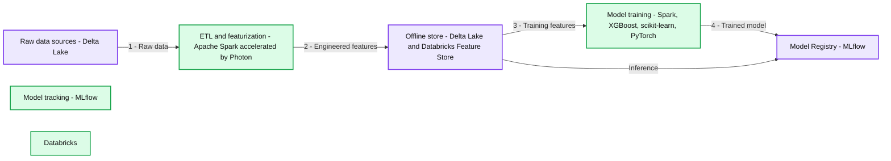
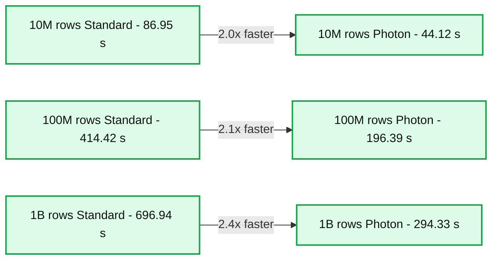

# Accelerate Feature Engineering With Photon

*Photon now available for Databricks Machine Learning Runtime Clusters*

- Source: https://www.databricks.com/blog/accelerate-feature-engineering-photon
- Published: 2024-08-02
- Authors: Ying Chen, Xiao Zhu
- Categories: platform, announcements, engineering, data-science-machine-learning, databricks-ai, platform-and-products-and-announcements, machine-learning
- Images: 3 total, 2 extracted as architecture

Training a high-quality machine learning model requires careful data and feature preparation. To fully utilize raw data stored as tables in Databricks, running ETL pipelines and feature engineering may be required to transform the raw data into helpful feature tables. If your table is large, this step could be very time-consuming. We are excited to announce that the Photon Engine can now be enabled in Databricks Machine Learning Runtime, capable of speeding up spark jobs and feature engineering workloads by 2x or more.

**Summary:** Databricks connects Delta Lake raw data to Photon-accelerated feature engineering, an offline feature store, model training, and MLflow model registration and inference.

**Components:**

- Databricks: platform encompassing the workflow.
- Raw data sources: Delta Lake.
- ETL and featurization: Apache Spark accelerated by Photon.
- Offline store: Delta Lake and Databricks Feature Store.
- Model training: Apache Spark, XGBoost, scikit-learn, and PyTorch.
- Model tracking: MLflow, shown beneath model training.
- Model Registry: MLflow.
- Inference: labeled path from the offline store to Model Registry.

**Flows:**

- Raw data sources -> ETL and featurization: raw data, step 1.
- ETL and featurization -> Offline store: engineered features, step 2.
- Offline store -> Model training: stored features for training, step 3.
- Model training -> Model Registry: trained model, step 4.
- Offline store -> Model Registry: inference path.

**Numbers:** 1, 2, 3, and 4 are flow step labels.

source image: https://www.databricks.com/sites/default/files/inline-images/accelerate-feature-engineering-photon-072424.png?v=1722626370

> “By enabling Photon and using a new PIT join, the time required to generate the training dataset using our Feature Store was reduced by more than 20 times.” - Sem Sinchenko, Advanced Analytics Expert Data Engineer, Raiffeisen Bank International AG

### **What is Photon?**

[The Photon Engine](https://www.databricks.com/blog/2021/06/17/announcing-photon-public-preview-the-next-generation-query-engine-on-the-databricks-lakehouse-platform.html) is a high-performance query engine that can run Spark SQL and Spark DataFrame faster, reducing the total cost per workload. Under the hood, Photon is implemented with C++, and specific Spark execution units are replaced with Photon’s native engine implementation.

 

### **How does Photon help machine learning workloads?**

Now that Photon can be enabled in Databricks Machine Learning Runtime, when does it make sense to integrate a Photon-enabled cluster for machine learning development workflows? Here are some of the main considerations:

1. **Faster ETL**: Photon speeds up Spark SQL and Spark DataFrame workloads for data preparation. Early customers of Photon have observed an average speedup of [2x-4x](https://www.databricks.com/blog/2021/06/17/announcing-photon-public-preview-the-next-generation-query-engine-on-the-databricks-lakehouse-platform.html) for their SQL queries.
2. **Faster feature engineering**: When using the Databricks Feature Engineering Python API for time series feature tables, point-in-time join becomes faster when Photon is enabled.

### **Faster feature engineering with Photon**

The Databricks Feature Engineering library has implemented a new version of point-in-time join for time series data. The new implementation, which was inspired by a suggestion from Semyon Sinchenko of Databricks customer Raiffeisen Bank International, uses native Spark instead of the Tempo library, making it more scalable and robust than the previous version. Moreover, the native Spark implementation hugely benefits from the Photon Engine. The larger the tables, the more improvements Photon can bring.

- When joining a feature table of 10M rows (10k unique IDs, with 1000 timestamps per ID) with a label table (100k unique IDs, with 100 timestamps per ID), Photon speeds up the point-in-time join by 2.0x
- When joining a feature table of 100M rows (100k unique IDs), Photon speeds up the point-in-time join by 2.1x
- When joining a feature table of 1B rows (1M unique IDs), Photon speeds up the point-in-time join by 2.4x

**Summary:** Photon reduces mean runtime compared with Standard for feature tables of 10M, 100M, and 1B rows, with speedups of 2.0x, 2.1x, and 2.4x.

**Components:**
- 10M, Standard: Standard runtime engine.
- 10M, Photon: Photon runtime engine.
- 100M, Standard: Standard runtime engine.
- 100M, Photon: Photon runtime engine.
- 1B, Standard: Standard runtime engine.
- 1B, Photon: Photon runtime engine.
- Vertical axis: Mean Run Time in seconds.
- Horizontal axis: Feature table number of rows, and runtime engine.

**Flows:**
- 10M, Standard -> 10M, Photon: 2.0x faster runtime comparison.
- 100M, Standard -> 100M, Photon: 2.1x faster runtime comparison.
- 1B, Standard -> 1B, Photon: 2.4x faster runtime comparison.

**Numbers:**
- 10M rows: Standard 86.95 s; Photon 44.12 s; 2.0x faster.
- 100M rows: Standard 414.42 s; Photon 196.39 s; 2.1x faster.
- 1B rows: Standard 696.94 s; Photon 294.33 s; 2.4x faster.
- Mean runtime axis ticks: 0, 100, 200, 300, 400, 500, 600, 700 s.

source image: https://www.databricks.com/sites/default/files/inline-images/FeatureTable.png?v=1722626370

The figure above compares the run time of joining feature tables of 3 different sizes with the same label table. Each experiment was performed on a Databricks AWS cluster with an r6id.xlarge instance type and one worker node. The setup was repeated five times to calculate the average run time.

 

### **Select Photon in Databricks Machine Learning Runtime cluster**

The query performance of Photon and the pre-built AI infrastructure of Databricks ML Runtime make it faster and easier to build machine learning models. Starting from Databricks Machine Learning Runtime 15.2 and above, users can create an ML Runtime cluster with Photon by selecting “Use Photon Acceleration”. Meanwhile, the native Spark version of point-in-time join comes with ML Runtime 15.4 LTS and above.

To learn more about Photon and feature engineering with Databricks, consult the following documentation pages for more information.

- [Photon and Databricks Runtime ML](https://docs.databricks.com/en/machine-learning/index.html#photon-and-databricks-runtime-ml)
- [What is Photon?](https://docs.databricks.com/en/compute/photon.html)
- [Point-in-time support using time series feature tables](https://docs.databricks.com/en/machine-learning/feature-store/time-series.html)
