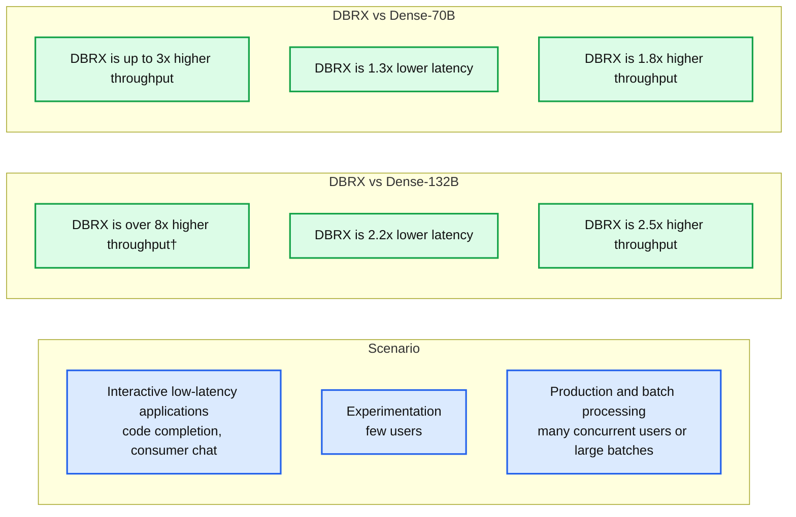
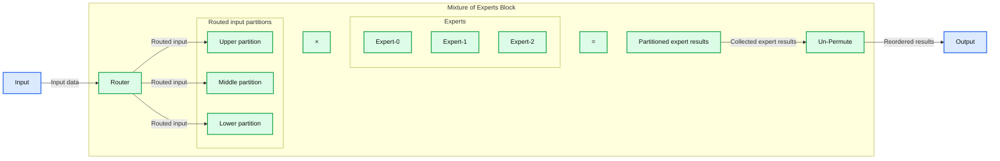

# Accelerated DBRX Inference on Databricks Model Serving

- Source: https://www.databricks.com/blog/accelerated-dbrx-inference-mosaic-ai-model-serving
- Published: 2024-04-16
- Authors: The Databricks Engineering Team
- Categories: data-science-machine-learning
- Images: 8 total, 5 extracted as architecture

## **Introduction**

In this blog post we dive into inference with DBRX, the open state-of-the-art large language model (LLM) created by Databricks (see [Introducing DBRX](https://www.databricks.com/blog/introducing-dbrx-new-state-art-open-llm)). We discuss how DBRX was designed from the ground up for both efficient inference and advanced model quality, we summarize how we achieved cutting-edge performance on our platform, and end with some practical tips on how to interact with the model.

[Databricks Model Serving](https://docs.databricks.com/en/machine-learning/model-serving/index.html) provides instant access to DBRX Instruct on a high-performance, production-grade, enterprise-ready platform. Users can instantly experiment and build prototype applications, then smoothly transition to our production-grade inference platform.

 

**Try DBRX now!**

- [AI Playground](https://docs.databricks.com/en/large-language-models/ai-playground.html) in your Databricks workspace (US only)
- With the OpenAI SDK: [Getting started querying LLMs on Databricks](https://docs.databricks.com/en/large-language-models/llm-serving-intro.html)
- Public demo: [huggingface.co/spaces/databricks/dbrx-instruct](https://huggingface.co/spaces/databricks/dbrx-instruct)

We've seen tremendous demand for DBRX Instruct. Hundreds of enterprises have begun to explore the model's capabilities on the Databricks platform.

>  Databricks is a key partner to Nasdaq on some of our most important data systems. They continue to be at the forefront of industry in managing data and leveraging AI, and we are excited about the release of DBRX. The combination of strong model performance and favorable serving economics is the kind of innovation we are looking for as we grow our use of Generative AI at Nasdaq. —Mike O'Rourke, Head of AI and Data Services, NASDAQ

To support the ML community, we also open sourced the model architecture and weights, and contributed optimized inference code to leading open source projects like [vLLM](https://github.com/vllm-project/vllm/pull/3660) and TRT-LLM.

>  DBRX-Instruct's integration has been a phenomenal addition to our suite of AI models and highlights our commitment to supporting open-source. It's delivering fast, high-quality answers to our users' diverse questions. Though it's still brand new on You.com, we're already seeing the excitement among users and look forward to its expanded use. —Saahil Jain, Senior Engineering Manager, You.com

At Databricks, we are focused on building a [Data + AI Platform](https://www.databricks.com/blog/what-is-a-data-intelligence-platform): an intelligence engine infused with generative AI, built on top of our unified data lakehouse. A powerful instantly-available LLM like DBRX Instruct is a critical building block for this. Additionally, DBRX's open weights empowers our customers to further train and adapt DBRX to extend its understanding to the unique nuances of their target domain and their proprietary data. 

DBRX Instruct is an especially capable model for applications that are important to our enterprise customers (code generation, SQL, and RAG). In retrieval augmented generation (RAG), content relevant to a prompt is retrieved from a database and presented alongside the prompt to give the model more information than it would otherwise have. To excel at this, a model must not only support long inputs (DBRX was trained with up to 32K token inputs) but it must also be able to find relevant information buried deep in its inputs (see the [Lost in the Middle](https://arxiv.org/abs/2307.03172) paper).

On long-context and RAG benchmarks, DBRX Instruct performs better than GPT-3.5 Turbo and leading open LLMs. Table 1 highlights the quality of DBRX Instruct on two RAG benchmarks - Natural Questions and HotPotQA - when the model is also provided with the top 10 passages retrieved from a corpus of Wikipedia articles.

***Table 1. RAG benchmarks. **The performance of various models measured when each model is given the top 10 passages retrieved from a Wikipedia corpus using bge-large-en-v1.5. Accuracy is measured by matching within the model's answer. DBRX Instruct has the highest score other than GPT-4 Turbo. *

## **An Inherently Efficient Architecture**

DBRX is a Mixture-of-Experts (MoE) decoder-only, transformer model. It has 132 billion total parameters, but only uses 36 billion active parameters per token during inference. See our [previous blog post](https://www.databricks.com/blog/introducing-dbrx-new-state-art-open-llm) for details on how it was trained.

**Summary:** DBRX delivers higher throughput or lower latency than Dense-132B and Dense-70B across three application scenarios.

**Components:**
- Scenario: workload category.
- DBRX vs Dense-132B: comparison of DBRX with the dense 132B model.
- DBRX vs Dense-70B: comparison of DBRX with the dense 70B model.
- Interactive low-latency applications: code completion and consumer chat.
- Experimentation: few users.
- Production and batch processing: many concurrent users or large batches.

**Flows:**
- none. No arrows are visible.

**Numbers:**
- Dense-132B: 132B model size.
- Dense-70B: 70B model size.
- Interactive applications: DBRX has over 8x higher throughput† versus Dense-132B and up to 3x higher throughput versus Dense-70B.
- Experimentation: DBRX has 2.2x lower latency versus Dense-132B and 1.3x lower latency versus Dense-70B.
- Production and batch processing: DBRX has 2.5x higher throughput versus Dense-132B and 1.8x higher throughput versus Dense-70B.

source image: https://www.databricks.com/sites/default/files/inline-images/Screenshot-2024-04-16-at-5.40.53-AM.png

**Table 2: MoE inference efficiency in various scenarios. **The table summarizes the advantage an MoE like DBRX has over a comparably sized dense model and over the popular dense 70B model form factor († max output tokens per sec @ time per output token target < 30 ms). This summary is based on a variety of benchmarks on H100 servers with 8-way tensor parallelism and 16-bit precision. Figures 1 and 2 show some underlying details.

We chose the MoE architecture over a dense model not only because MoEs are more efficient to train, but also due to the serving time benefits. Improving models is a challenging task: we would like to scale parameter counts—which our research has shown to predictably and reliably improve model capabilities—without compromising model usability and speed. MoEs allow parameter counts to be scaled without proportionally large increases in training and serving costs. 

DBRX's sparsity bakes inference efficiency into the architecture: instead of activating all the parameters, only 4 out of the total 16 "experts" per layer are activated per input token. The performance impact of this sparsity depends on the batch size, as shown in figures 1 and 2. As we discussed in [an earlier blog post](https://www.databricks.com/blog/llm-inference-performance-engineering-best-practices), both Model Bandwidth Utilization (MBU) and Model Flops Utilization (MFU) determine how far we can push inference speed on a given hardware setup.

First, at low batch sizes, DBRX has less than 0.4x the request latency of a comparably-sized dense model. In this regime the model is memory–bandwidth bound on high end GPUs like NVIDIA H100s. Simply put, modern GPUs have tensor cores that can perform trillions of floating point operations per second, so the serving engine is bottlenecked by how fast memory can provide data to the compute units. When DBRX processes a single request, it does not have to load all 132 billion parameters; it only ends up loading 36 billion parameters. Figure 1 highlights DBRX's advantage at small batch sizes, an advantage which narrows but remains large at larger batch sizes.

**Summary:** DBRX achieves higher total output tokens per second than Dense-70B and Dense-132B across the displayed time per output token range.

**Components:**
- DBRX: blue model benchmark series.
- Dense-70B: red dense model benchmark series.
- Dense-132B: yellow dense model benchmark series.
- Horizontal axis: time per output token in milliseconds.
- Vertical axis: total output tokens per second.

**Flows:**
- none. Lines connect benchmark measurements; no arrows are shown.

**Numbers:**
- Horizontal axis ticks: 20, 40, 60, 80, 100 ms.
- Vertical axis ticks: 0, 500, 1000, 1500, 2000 tokens/sec.
- Model label sizes: 70B and 132B.
- Approximate series endpoints at 100 ms: DBRX 1600, Dense-70B 790, Dense-132B 590 tokens/sec.

```mermaid
%% Benchmark series comparing total output throughput against time per output token
flowchart TD
    X[Time per output token in ms - ticks 20 40 60 80 100]
    Y[Total output tokens per sec - ticks 0 500 1000 1500 2000]
    D[DBRX - blue series - rises then plateaus near 1600 tokens per sec]
    R[Dense-70B - red series - rises to about 790 tokens per sec]
    G[Dense-132B - yellow series - rises to about 590 tokens per sec]

    classDef client fill:#dbeafe,stroke:#2563eb,stroke-width:2px,color:#111
    classDef service fill:#dcfce7,stroke:#16a34a,stroke-width:2px,color:#111
    classDef store fill:#ede9fe,stroke:#7c3aed,stroke-width:2px,color:#111
    classDef cache fill:#fef3c7,stroke:#d97706,stroke-width:2px,color:#111
    classDef queue fill:#cffafe,stroke:#0891b2,stroke-width:2px,color:#111
    classDef critical fill:#fee2e2,stroke:#dc2626,stroke-width:4px,color:#111
    classDef external fill:#e5e7eb,stroke:#6b7280,stroke-width:2px,color:#111,stroke-dasharray:4 3
    classDef decision fill:#fce7f3,stroke:#db2777,stroke-width:2px,color:#111
    class X,Y external
    class D,R,G service
```

source image: https://www.databricks.com/sites/default/files/inline-images/accelerated-dbrx-inference-mosaic-ai-model-img-1.png

***Figure 1: MoEs are substantially better for interactive applications.**** Many applications need to generate responses within a strict time budget. Comparing an MoE like DBRX to dense models, we see that DBRX is able to generate over 8x as many total tokens per second if the target is below 30 ms per output token. This means model servers can handle an order of magnitude more concurrent requests without compromising individual user experience. These benchmarks were run on H100 servers using 16-bit precision and 8-way tensor parallelism with optimized inference implementations for each model.*

Second, for workloads that are compute bound—that is, bottlenecked by the speed of the GPU—the MoE architecture significantly reduces the total number of computations that need to occur. This means that as concurrent requests or input prompt lengths increase, MoE models scale significantly better than their dense counterparts. In these regimes, DBRX can increase decode throughput up to 2.5x relative to a comparable dense model, as highlighted in figure 2. Users performing Retrieval Augmented Generation (RAG) workloads will see an especially large benefit, since these workloads typically pack several thousand tokens into the input prompt. As do workloads using DBRX to process many documents with Spark and other batch pipelines.

**Summary:** DBRX achieves higher text generation speedup than Dense-70B across the plotted concurrency range, relative to the Dense-132B baseline.

**Components:**
- DBRX: blue line with circular markers representing the DBRX model.
- Dense-70B: red line with circular markers representing a dense model.
- Dense-132B: yellow horizontal line representing the baseline dense model.
- Concurrent users: horizontal axis with logarithmically spaced labels.
- Text generation speedup: vertical axis showing relative speedup.

**Flows:**
- none. Lines connect benchmark measurements; no arrows are visible.

**Numbers:**
- Model labels: Dense-70B and Dense-132B.
- Concurrent users axis labels: 1, 2, 4, 6, 8, 10, 20, 40, 60, 80, 100, 200.
- Text generation speedup axis labels: 1, 1.25, 1.5, 1.75, 2, 2.25, 2.5, 2.75.
- Approximate speedup values from left to right:
  - DBRX: 2.59, 2.24, 2.07, 2.09, 2.05, 2.25, 2.53, 2.39, 1.97.
  - Dense-70B: 1.64, 1.66, 1.65, 1.63, 1.59, 1.28, 1.27, 1.32, 1.20.
  - Dense-132B: 1 throughout.

```mermaid
%% Benchmark series and axes for text generation speedup versus concurrent users
flowchart TD
    X[Concurrent users - logarithmic scale]
    Y[Text generation speedup]
    B[DBRX - blue series - approximately 1.97 to 2.59]
    R[Dense-70B - red series - approximately 1.20 to 1.66]
    G[Dense-132B - yellow baseline - 1]

    classDef client fill:#dbeafe,stroke:#2563eb,stroke-width:2px,color:#111
    classDef service fill:#dcfce7,stroke:#16a34a,stroke-width:2px,color:#111
    classDef store fill:#ede9fe,stroke:#7c3aed,stroke-width:2px,color:#111
    classDef cache fill:#fef3c7,stroke:#d97706,stroke-width:2px,color:#111
    classDef queue fill:#cffafe,stroke:#0891b2,stroke-width:2px,color:#111
    classDef critical fill:#fee2e2,stroke:#dc2626,stroke-width:4px,color:#111
    classDef external fill:#e5e7eb,stroke:#6b7280,stroke-width:2px,color:#111,stroke-dasharray:4 3
    classDef decision fill:#fce7f3,stroke:#db2777,stroke-width:2px,color:#111
    class X client
    class Y external
    class B,R,G service
```

source image: https://www.databricks.com/sites/default/files/inline-images/accelerated-dbrx-inference-mosaic-ai-model-img-2.png

***Figure 2: MoE's have superior scaling. **Comparing an MoE like DBRX to dense models, we see that its text generation rate* scales much better at large batch sizes (* total output tokens per second). DBRX consistently has 2x or higher throughput compared to a similarly sized dense model (Dense-132B). DBRX's speedup accelerates at large batch sizes: above 32 concurrent users DBRX reaches 2x the speed of a leading dense 70B model. These benchmarks used the same setup as those in figure 1.*

## **Fine-Grained Mixture-of-Experts**

DBRX is a *fine-grained* MoE, meaning it uses a larger number of smaller experts. DBRX has 16 experts and chooses 4, while Mixtral and Grok-1 have 8 experts and choose 2. This provides 65x more possible combinations of experts and we found that this improves model quality.

Additionally, DBRX is a relatively shallow and wide model so its inference performance scales better with tensor parallelism. DBRX and Mixtral-8x22B have roughly the same number of parameters (132B for DBRX vs 140B for Mixtral) but Mixtral has 1.4x as many layers (40 vs 56). Compared to Llama2, a dense model, DBRX has half the number of layers (40 vs 80). More layers tends to result in more expensive cross-GPU calls when running inference on multiple GPUs (a requirement for models this large). DBRX's relative shallowness is one reason it has a higher throughput at medium batch sizes (4 - 16) compared to Llama2-70B (see Figure 1).

To maintain high quality with many small experts, DBRX uses "dropless" MoE routing, a technique pioneered by our open-source training library [MegaBlocks](https://github.com/databricks/megablocks) (see [Bringing MegaBlocks to Databricks](https://www.databricks.com/blog/bringing-megablocks-databricks)). MegaBlocks has also been used to develop other leading MoE models such as Mixtral.

Previous MoE frameworks (Figure 3) forced a tradeoff between model quality and hardware efficiency. Experts had a fixed capacity so users had to choose between occasionally dropping tokens (lower quality) or wasting computation due to padding (lower hardware efficiency). In contrast (Figure 4), MegaBlocks ([paper](https://arxiv.org/pdf/2211.15841.pdf)) reformulated the MoE computation using block-sparse operations so that expert capacity could be dynamically sized and efficiently computed on modern GPU kernels.

**Summary:** A traditional Mixture-of-Experts block routes input tokens into fixed-capacity expert batches, illustrating dropped tokens and wasted capacity before restoring output order.

**Components:**

- Input: input token data; technology unspecified.
- Mixture of Experts Block: contains routing, expert computation, and output reordering.
- Router: distributes tokens among experts.
- Expert input batches: blue matrices labeled with `hidden_size` and `expert_capacity`.
- Dropped tokens: red region showing tokens exceeding an expert's capacity.
- Wasted expert capacity: red region showing unused capacity.
- Expert-0, Expert-1, Expert-2: expert computations, with `ffn_hidden_size` labeled above Expert-0.
- Multiplication and equals symbols: show each input batch multiplied by its expert to produce a result.
- Expert results: three pink matrices.
- Un-Permute: restores token ordering.
- Output: resulting token data; technology unspecified.

**Flows:**

- Input -> Router: input tokens.
- Router -> Expert-0 input batch: routed tokens through the upper branch.
- Router -> Expert-1 input batch: routed tokens through the middle branch.
- Router -> Expert-2 input batch: routed tokens through the lower branch.
- Expert results -> Un-Permute: expert outputs collected through a shared connector.
- Un-Permute -> Output: reordered output tokens.

**Numbers:** Expert identifiers 0, 1, and 2. Symbolic sizes: `hidden_size`, `ffn_hidden_size`, and `expert_capacity`. No numerical dimensions or units are shown.

```mermaid
%% Traditional MoE routing with fixed expert capacity and output reordering
flowchart LR
    I[Input] -->|Input tokens| R

    subgraph M[Mixture of Experts Block]
        R[Router]
        B0[Input batch 0 with dropped tokens]
        B1[Input batch 1]
        B2[Input batch 2 with wasted expert capacity]
        E0[Expert-0]
        E1[Expert-1]
        E2[Expert-2]
        P0[Expert result 0]
        P1[Expert result 1]
        P2[Expert result 2]
        U[Un-Permute]

        R -->|Routed tokens| B0
        R -->|Routed tokens| B1
        R -->|Routed tokens| B2

        B0 ---|Multiply by expert with ffn_hidden_size| E0
        B1 ---|Multiply by expert| E1
        B2 ---|Multiply by expert| E2
        E0 ---|Equals| P0
        E1 ---|Equals| P1
        E2 ---|Equals| P2

        P0 -->|Expert output via shared connector| U
        P1 -->|Expert output via shared connector| U
        P2 -->|Expert output via shared connector| U
    end

    U -->|Reordered tokens| O[Output]

    classDef client fill:#dbeafe,stroke:#2563eb,stroke-width:2px,color:#111
    classDef service fill:#dcfce7,stroke:#16a34a,stroke-width:2px,color:#111
    classDef store fill:#ede9fe,stroke:#7c3aed,stroke-width:2px,color:#111
    classDef cache fill:#fef3c7,stroke:#d97706,stroke-width:2px,color:#111
    classDef queue fill:#cffafe,stroke:#0891b2,stroke-width:2px,color:#111
    classDef critical fill:#fee2e2,stroke:#dc2626,stroke-width:4px,color:#111
    classDef external fill:#e5e7eb,stroke:#6b7280,stroke-width:2px,color:#111,stroke-dasharray:4 3
    classDef decision fill:#fce7f3,stroke:#db2777,stroke-width:2px,color:#111
    %% client = clients/edge/gateway/LB, service = stateless compute, store = databases/durable storage
    %% cache = Redis/CDN/anything losable, queue = Kafka/streams/async pipes, critical = the bottleneck or SPOF
    %% external = third-party, decision = a trade-off point
    class I,O client
    class M,R,E0,E1,E2,U service
    class B1,P0,P1,P2 queue
    class B0,B2 critical
```

source image: https://www.databricks.com/sites/default/files/inline-images/Screenshot-2024-04-16-at-9.52.20-AM.png

***Figure 3: A traditional Mixture-of-Experts (MoE) layer.** A router produces a mapping of input tokens to experts and produces probabilities that reflect the confidence of the assignments. Tokens are sent to their top_k experts (in DBRX top_k is 4). Experts have fixed input capacities and if the dynamically routed tokens exceed this capacity, some tokens are dropped (see top red area). Conversely, if fewer tokens are routed to an expert, computation capacity is wasted with padding (see bottom red area).*

**Summary:** DBRX’s dropless Mixture of Experts block routes input into variable-sized blocks, applies expert computation, and un-permutes the results into output.

**Components:**
- Input: input data entering the MoE block.
- Router: token-routing component.
- Blue partitioned block: routed inputs in three differently sized partitions.
- ×: multiplication operation.
- Expert-0, Expert-1, Expert-2: three expert computation blocks.
- =: result of expert multiplication.
- Pink partitioned block: expert results in three differently sized partitions.
- Un-Permute: restores the ordering of expert results.
- Output: processed data leaving the MoE block.
- Mixture of Experts Block: contains routing, expert computation, and un-permutation. Specific implementation technologies are not labeled.

**Flows:**
- Input -> Router: input data.
- Router -> Blue upper partition: routed input.
- Router -> Blue middle partition: routed input.
- Router -> Blue lower partition: routed input.
- Pink partitioned block -> Un-Permute: collected expert results.
- Un-Permute -> Output: reordered results.

**Numbers:** Expert identifiers 0, 1, and 2. No units, percentages, or explicit sizes are shown.

source image: https://www.databricks.com/sites/default/files/inline-images/Screenshot-2024-04-16-at-10.01.02-AM.png

***Figure 4: A dropless MoE layer.** The router works as before, routing each token to its top_k experts. However we now use variable sized blocks and efficient matrix multiplications to avoid dropping tokens or wasting capacity. MegaBlocks proposes using block-sparse matrix multiplications. In practice, we use optimized GroupGEMM kernels for inference.*

## **Engineered for Performance**

As explained in the previous section, inference with the DBRX architecture has innate advantages. Nonetheless, achieving state-of-the-art inference performance requires a substantial amount of careful engineering.

***Figure 5: DBRX in the Databricks AI Playground.** Foundation Model APIs users can expect to see text generation speeds of up to ~150 tokens per second for DBRX.*

We have made deep investments in our high-performance LLM inference stack and have implemented new DBRX-focused optimizations. We have applied many optimizations such as fused kernels, GroupGEMMs for MoE layers, and quantization for DBRX.

**Optimized for enterprise use cases.** We have optimized our server to support workloads with lots of traffic at high throughput, without degrading latency below acceptable levels—especially for the long context requests that DBRX excels on. As discussed in a [previous blog post](https://www.databricks.com/blog/fast-secure-and-reliable-enterprise-grade-llm-inference), building performant inference services is a challenging problem; lots of care must be put into memory management and performance tuning to maintain high availability and low latency. We utilize an aggregated continuous batching system to process several requests in parallel, maintaining high GPU utilization and providing strong streaming performance.

**Deep multi-GPU optimizations.** We have implemented several custom techniques inspired by state-of-the-art serving engines such as NVIDIA's [TensorRT-LLM](https://github.com/NVIDIA/TensorRT-LLM/) and [vLLM](https://github.com/vllm-project/vllm). This includes custom kernels implementing operator fusions to eliminate unnecessary GPU memory reads/writes as well as carefully tuned tensor parallelism and synchronization strategies. We explored different forms of parallelism strategies such as tensor parallel and expert parallel and identified their comparative advantages.

**Quantization and quality.** Quantization – a technique for making models smaller and faster – is especially important for models the size of DBRX. The main barrier to deploying DBRX is its memory requirements: at 16-bit precision, we recommend a minimum of 4x80GB NVIDIA GPUs. Being able to serve DBRX in 8-bit precision halves its serving costs and frees it to run on lower-end GPUs such as NVIDIA A10Gs. Hardware flexibility is particularly important for enterprise users who care about geo-restricted serving in regions where the availability of high-end GPUs is scarce. However, as we discussed in our [previous blog post](https://www.databricks.com/blog/serving-quantized-llms-nvidia-h100-tensor-core-gpus), great care must be taken when incorporating quantization. In our rigorous quality evals, we found that the default INT8 quantization methods in TRT-LLM and vLLM lead to model quality degradation in certain generative tasks. Some of this degradation is not apparent in benchmarks like MMLU where the models are not generating long sequences. The biggest quality problems we have seen were flagged by domain-specific (e.g., HumanEval) and long-context (e.g., ZeroSCROLLS) benchmarks. As a user of Databricks' inference products, you can trust that our engineering team carefully ensures the quality of our models even as we make them faster.

In the past, we have released many blogs on our engineering practices for fast and secure inference serving. For more details, please see our previous blog posts linked below:

- [Fast, Secure and Reliable: Enterprise-grade LLM Inference](https://www.databricks.com/blog/fast-secure-and-reliable-enterprise-grade-llm-inference)
- [Serving Quantized LLMs on NVIDIA H100 Tensor Core GPUs](https://www.databricks.com/blog/serving-quantized-llms-nvidia-h100-tensor-core-gpus)
- [LLM Inference Performance Engineering: Best Practices](https://www.databricks.com/blog/llm-inference-performance-engineering-best-practices)

***Figure 6: Folks on X really like DBRX token generation speed (**[**tweet**](https://x.com/natolambert/status/1772999462538887493)**). **Our [Hugging Face Space](https://huggingface.co/spaces/databricks/dbrx-instruct) demo uses Databricks Foundation Model APIs as its backend.*

## **Inference Tips and Tricks**

In this section we share some strategies for constructing good prompts. Prompt details are especially important for *system prompts*.

DBRX Instruct provides high performance with simple prompts. However, like other LLMs, well-crafted prompts can significantly enhance its performance and align its outputs with your specific needs. Remember that these models use randomness: the same prompt evaluated multiple times can result in different outputs.

We encourage experimentation to find what works best for each of your use-cases. Prompt engineering is an iterative process. The starting point is often a "vibe check" – manually assessing response quality with a few example inputs. For complex applications, it's best to follow this by constructing an empirical evaluation framework and then iteratively evaluating different prompting strategies.

Databricks provides an easy-to-use UI to aid this process, in [AI Playground](https://docs.databricks.com/en/large-language-models/ai-playground.html) and with [MLflow](https://mlflow.org/). We also provide mechanisms to run these evaluations at scale, such as [Inference Tables](https://docs.databricks.com/en/machine-learning/model-serving/inference-tables.html) and data analysis workflows.

### **System Prompts**

System prompts are a way to transform the generic DBRX Instruct model into a task-specific model. These prompts establish a framework for how the model should respond and can provide additional context for the conversation. They are also often used to assign a role to modulate the model's response style ("you are a kindergarten teacher").

DBRX Instruct's [default system prompt](https://github.com/databricks/dbrx/blob/c94b65ea34f161faa2229dd6f784d9ea474e111e/model/tiktoken.py#L6-L16) turns the model into a general purpose enterprise chatbot with basic safety guardrails. This behavior won't be a good fit for every customer. The system prompt can be changed easily in the AI Playground or using the "system" role in chat API requests. 

When a custom system prompt is provided, it completely overrides our default system prompt. Here is an example system prompt which uses *few-shot* prompting to turn DBRX Instruct into a PII detector.

### **Prompting Tips**

Here are a few tips to get you started prompting DBRX Instruct.

**First steps.** Start with the simplest prompts you can, to avoid unnecessary complexity. Explain what you want in a straightforward manner, but provide adequate detail and relevant context for the task. These models cannot read your mind. Think of them as an intelligent-yet-inexperienced intern.

**Use precise instructions**. Instruction-following models like DBRX Instruct tend to give the best results with precise instructions. Use active commands (“classify”, “summarize”, etc) and explicit constraints (e.g. “do not” instead of “avoid”). Use precise language (e.g. to specify the desired length of the response use “explain in about 3 sentences” rather than “explain in a few sentences”). **Example**: “Explain what makes the sky blue to a five year old in 50 or fewer words” instead of “Explain briefly and in simple terms why the sky is blue.”

**Teach by example. **Sometimes, rather than crafting detailed general instructions, the best approach is to provide the model with a few examples of inputs and outputs. The sample system prompt above uses this technique.This is referred to as "few-shot" prompting. Examples can ground the model in a particular response format and steer it towards the intended solution space. Examples should be diverse and provide good coverage. Examples of incorrect responses with information about why they were wrong can be very helpful. Typically at least 3-5 examples are needed.

**Encourage step-by-step problem solving**. For complex tasks, encouraging DBRX Instruct to proceed incrementally towards a solution often works better than having it generate an answer immediately. In addition to improving answer accuracy, step-by-step responses provide transparency and make it easier to analyze the model’s reasoning failures. There are a few techniques in this area. A task can be decomposed into a sequence of simpler sub-tasks (or recursively as a tree of simpler and simpler sub-tasks). These sub-tasks can be combined into a single prompt, or prompts can be chained together, passing the model’s response to one as the input to the next. Alternatively, we can ask DBRX Instruct to provide a “chain of thought” before its answer. This can lead to higher quality answers by giving the model “time to think” and encouraging systematic problem solving. **Chain-of-thought example**: “I baked 15 muffins. I ate 2 muffins and gave 5 muffins to a neighbor. My partner then bought 6 more muffins and ate 2. Do I have a prime number of muffins? Think step by step.”

**Formatting matters.** Like other LLMs, prompt formatting is important for DBRX Instruct. Instructions should be placed at the start. For structured prompts (few-shot, step-by-step, etc) if you use delimiters to mark section boundaries (markdown style ## headers, XML tags, triple quotation marks, etc), use a consistent delimiter style throughout the conversation.

If you are interested in learning more about prompt engineering, there are many resources readily available online. Each model has idiosyncrasies, DBRX Instruct is no exception. There are, however, many general approaches that work across models. Collections such as [Anthropic's prompt library](https://docs.anthropic.com/claude/prompt-library) can be a good source of inspiration.

## **Generation Parameters**

In addition to prompts, [inference request parameters](https://docs.databricks.com/en/machine-learning/foundation-models/api-reference.html#chat-task) impact how DBRX Instruct generates text.

Generating text is a stochastic process: the same prompt evaluated multiple times can result in different outputs. The temperature parameter can be adjusted to control the degree of randomness. temperature is a number that ranges from 0 to 1. Choose lower numbers for tasks that have well-defined answers (such as question answering and RAG) and higher numbers for tasks that benefit from creativity (writing poems, brainstorming). Setting this too high will result in nonsensical responses.

Foundation Model APIs also support advanced parameters, such as enable_safety_mode ([in private preview](https://www.databricks.com/blog/implementing-llm-guardrails-safe-and-responsible-generative-ai-deployment-databricks)). This enables guardrails on the model responses, detecting and filtering unsafe content. Soon, we'll be introducing even more features to unlock advanced use cases and give customers more control of their production AI applications.

## **Querying the Model**

You can begin experimenting immediately if you are a Databricks customer via our [AI Playground](https://docs.databricks.com/en/large-language-models/ai-playground.html). If you prefer using an SDK, our [Foundation Model APIs](https://docs.databricks.com/en/machine-learning/foundation-models/index.html) endpoints are compatible with the OpenAI SDK (you will need a Databricks [personal access token](https://docs.databricks.com/en/dev-tools/auth/pat.html#databricks-personal-access-tokens-for-workspace-users)).

## **Conclusions**

DBRX Instruct is another significant stride in our mission to democratize data and AI for every enterprise. We released the DBRX model weights and also contributed performance-optimized inference support to two leading inference platforms: TensorRT-LLM and vLLM.  We have worked closely with NVIDIA during the development of DBRX to push the performance of TensorRT-LLM for MoE models as a whole. With vLLM, we have been humbled by the overarching community support and appetite for DBRX.

While foundation models like DBRX Instruct are the central pillars in GenAI systems, we are increasingly seeing Databricks customers construct [compound AI systems](https://bair.berkeley.edu/blog/2024/02/18/compound-ai-systems/) as they move beyond flashy demos to develop high quality GenAI applications. The Databricks platform is built for models and other components to work in concert. For example, we serve RAG Studio chains (built on top of [MLflow](https://mlflow.org/)) that seamlessly connect [AI Search](https://docs.databricks.com/en/generative-ai/vector-search.html) to the [Foundation Model APIs](https://docs.databricks.com/en/machine-learning/foundation-models/index.html). [Inference Tables](https://docs.databricks.com/en/machine-learning/model-serving/inference-tables.html) allow secure logging, visualization, and metrics tracking, facilitating the collection of proprietary data sets which can then be used to train or adapt open models like DBRX to drive continuous application improvement.

As an industry we are at the start of the GenAI journey. At Databricks we are excited to see what you build with us! If you aren't a Databricks customer yet, [sign up for a free trial](https://www.databricks.com/try-databricks)!
