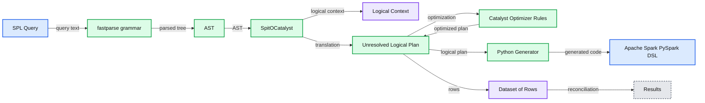

# Accelerating SIEM Migrations With the SPL to PySpark Transpiler

- Source: https://www.databricks.com/blog/accelerating-siem-migrations-spl-pyspark-transpiler
- Published: 2022-12-16
- Authors: Serge Smertin, Jason Trost
- Categories: engineering, data-science-machine-learning
- Images: 4 total, 1 extracted as architecture

In this blog post, we introduce [transpiler](https://github.com/databrickslabs/transpiler), a Databricks Labs open-source project that automates the translation of Splunk Search Processing Language (SPL) queries into scalable PySpark dataframe operations. This tool was developed in partnership with a large financial services customer to accelerate the migration of cybersecurity workloads into Databricks.

SPL is a query language used in Splunk for searching, filtering, and transforming log data. Since Splunk is a popular Security Information Event Management (SIEM) and logs management platform, SPL is widely used for security and IT use cases such as alerting and threat hunting. Over time, organizations can accumulate several hundred use cases developed in SPL, and migrating these queries to other platforms is often manual and error-prone.

Using the transpiler form a notebook

We developed a [transpiler](https://github.com/databrickslabs/transpiler) to automate and speed up this process. It transforms a significant subset of the customer's most commonly used SPL commands into their PySpark structured streaming equivalent python code. This provides the following benefits:

1. **Accelerate migration to Databricks -** SPL queries are reliably and automatically converted to PySpark. This cross-compiler can cut migration time from months to weeks or even days.
2. **Education -** It's also possible to use this tooling to teach PySpark equivalents to SIEM practitioners to accelerate their time-to-comfort level with Databricks Lakehouse foundations.
3. **Cost savings and scalability -** Lakehouse is especially useful for historical data analysis where only shallow history of records would be kept on SIEM-based architecture. Translating SPL queries into Spark operations enables running these queries on much larger historical datasets and provides opportunities for applying more advanced analytic techniques such as anomaly detection and machine learning that scale very well in Databricks.

*How transpiler works under the hood*

**Summary:** The diagram shows how the Databricks Labs transpiler converts an SPL query into PySpark DSL through parsing, Catalyst planning, and Python code generation.

**Components:**

- Databricks Labs Transpiler
- SPL Query
- fastparse grammar
- AST
- SpitOCatalyst
- Logical Context
- Unresolved Logical Plan
- Catalyst Optimizer Rules
- Dataset of Rows
- Python Generator
- Apache Spark PySpark DSL
- Results

**Flows:**

- SPL Query -> fastparse grammar: SPL query text
- fastparse grammar -> AST: Parsed abstract syntax tree
- AST -> SpitOCatalyst: AST
- SpitOCatalyst -> Logical Context: Logical context
- SpitOCatalyst -> Unresolved Logical Plan: Catalyst translation
- Unresolved Logical Plan -> Catalyst Optimizer Rules: Plan for optimization
- Catalyst Optimizer Rules -> Unresolved Logical Plan: Optimized plan
- Unresolved Logical Plan -> Python Generator: Logical plan
- Python Generator -> Apache Spark PySpark DSL: Generated PySpark code
- Dataset of Rows -> Results: Reconciled results

**Numbers:** none

source image: https://www.databricks.com/sites/default/files/inline-images/db-433-blog-img-2.png

How transpiler works under the hood

For more information about how the transpiler works and its usage, see these two presentations at the DATA+AI Summit 2022.

- [Cutting the Edge in Fighting Cybercrime: Reverse-Engineering a Search Language to Cross-Compile to PySpark](https://www.youtube.com/watch?v=y8rKzRaM7c4) at DATA+AI Summit 2022
- [Accidentally Building a Petabyte-Scale Cybersecurity Data Mesh in Azure With Delta Lake](https://www.youtube.com/watch?v=G9x-1s-1TJI) at DATA+AI Summit 2022

**Getting Started**

Below are the steps required to try out the transpiler. See the README at [https://github.com/databrickslabs/transpiler](https://github.com/databrickslabs/transpiler) for more details and examples. To use the transpiler, please create a Databricks Cluster with **DBR 11.3 LTS**. Once the cluster is created, navigate to **Libraries** tab and click on **Install new**, pick **Maven**, in coordinates field please enter **com.databricks.labs:transpiler:0.4.0**, and click **Install**:

Library installation instructions

Once installation is done, you can use the `toPython` method from `com.databricks.labs.transpiler.spl.Transpiler` Scala object:

Running the notebook on a cluster that has transpiler installed

Alternatively, Run the following command to generate PySpark code using python. The python package is available through [PyPi](https://pypi.org/project/dbl-transpiler/).

**Language support**

There's basic support for many common commands such as `addtotals, bin, collect, convert, dedup, eval, eventstats, fields, fillnull, format, head, inputlookup, join, lookup, makeresults, map, multisearch, mvcombine, mvexpand, regex, rename, return, rex, search, sort, stats, streamstats, table, where`.

There's also partial support for functions like `auto(), cidr_match(), coalesce(), count(), ctime(), earliest(), if(), isnotnull(), latest(), len(), lower(), max(), memk(), min(), mvappend(), mvcount(), mvfilter(), mvindex(), none(), null(), num(), replace(), rmcomma(), rmunit(), round(), strftime(), substr(), sum(), term(), values()`.

**Further work**

As ever our efforts are in pragmatic response to a demand. If you would like to see further command conversions please create a GitHub issue or an existing issue!
