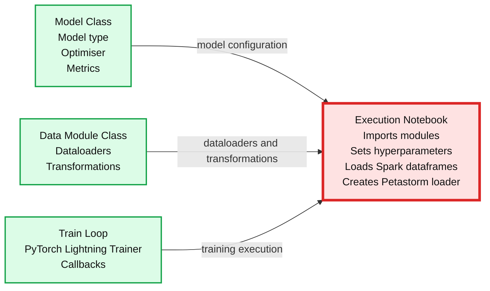
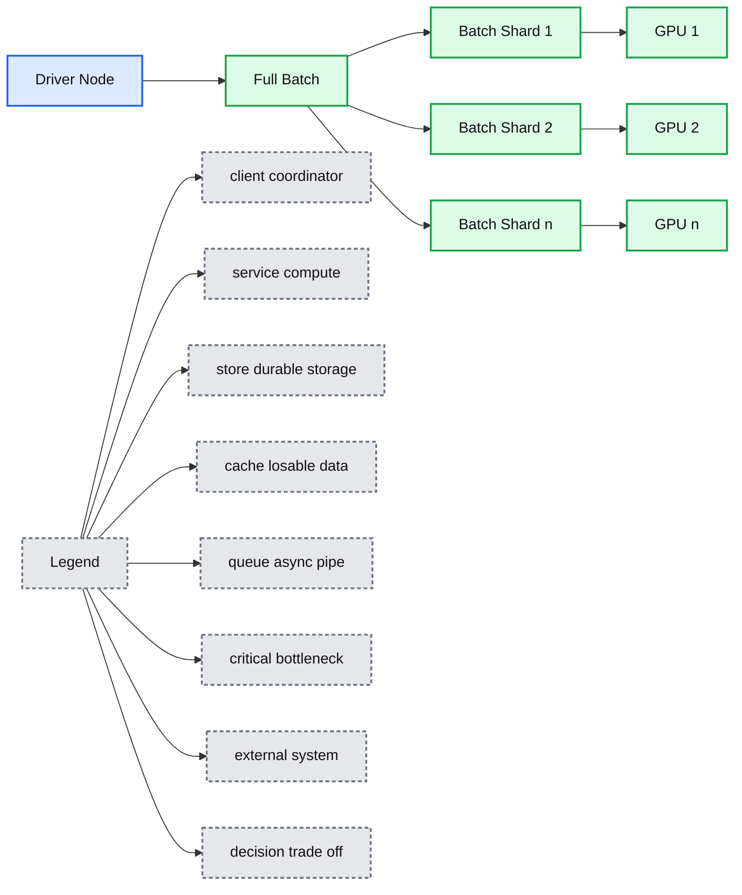
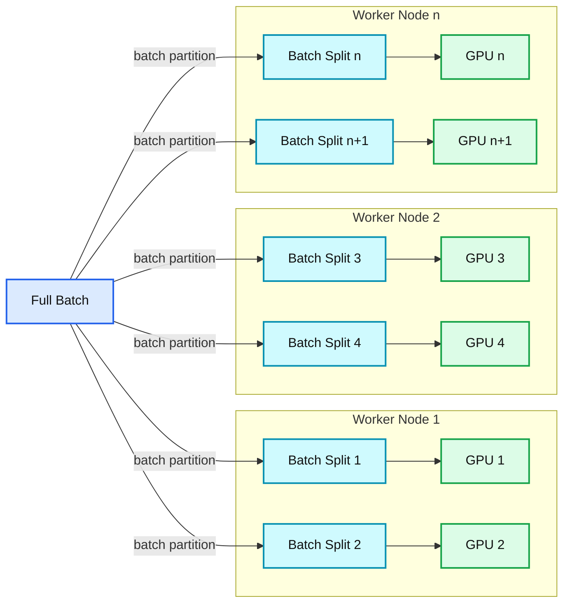
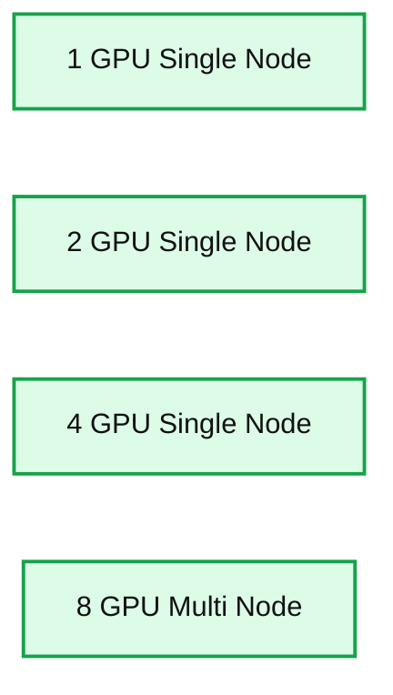
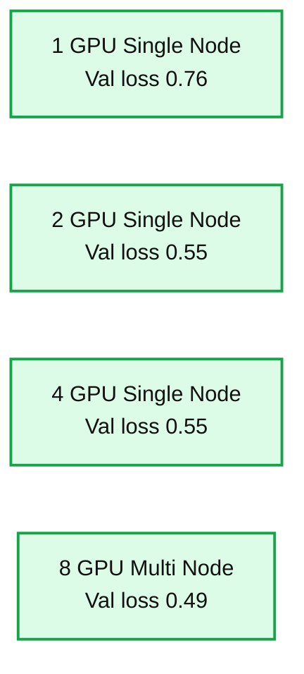

# Accelerating Your Deep Learning with PyTorch Lightning on Databricks

- Source: https://www.databricks.com/blog/accelerating-your-deep-learning-pytorch-lightning-databricks
- Published: 2022-09-07
- Authors: Brian Law, Nikolay Ulmasov
- Categories: engineering, data-science-machine-learning
- Images: 10 total, 6 extracted as architecture

PyTorch Lightning is a great way to simplify your PyTorch code and bootstrap your Deep Learning workloads. Scaling your workloads to achieve timely results with all the data in your Lakehouse brings its own challenges however. This article will explain how this can be achieved and how to efficiently scale your code with Horovod.

## Introduction

Increasingly, companies are turning to Deep Learning in order to accelerate their advanced machine learning applications. For example, Computer Vision techniques are used nowadays to improve [defect inspection for manufacturing](https://medium.com/@infopulseglobal_9037/intelligent-defect-inspection-powered-by-computer-vision-and-deep-learning-4c75fdf8673); Natural Language Processing is utilised to [augment business processes with chatbots](https://venturebeat.com/2021/05/20/despite-challenges-salesforce-says-chatbot-adoption-is-accelerating/) and [Neural Network based Recommender systems](https://venturebeat.com/2021/07/19/ai-powered-deep-neural-nets-increase-accuracy-for-credit-score-predictions/) are used to improve customer outcomes.

Training Deep Learning models, even with well optimised code, is a slow process, which limits the ability for Data Science teams to quickly iterate through experiments and deliver results. As such, it is important to know how to best harness compute capacity in order to scale this up.

In this article we will illustrate how to first structure your codebase for maximum code reuse then show how to scale this from a small single node instance across to a full GPU cluster. We will also integrate it all with MLflow to provide full experiment tracking and model logging.

## Part 1 - Data Loading and adopting PyTorch Lightning

Firstly let's start with a target architecture.

### Cluster Setup

When scaling deep learning, it is important to start small and gradually scale up the experiment in order to efficiently utilise expensive GPU resources. Scale up your code to run on multiple GPUs within a single node before looking to scale across multiple nodes to reduce code complexity.

Databricks supports Single Node clusters to support this very usage pattern. See: [Azure Single Node Clusters](https://docs.microsoft.com/en-us/azure/databricks/clusters/single-node), [AWS Single Node Clusters](https://docs.databricks.com/clusters/single-node.html), [GCP Single Node Clusters](https://docs.gcp.databricks.com/clusters/single-node.html). In terms of instance selection, Nvidia T4 GPUs provide a cost effective instance type to start with. On AWS these are available in [G4 Instances](https://aws.amazon.com/blogs/aws/now-available-ec2-instances-g4-with-nvidia-t4-tensor-core-gpus/). On Azure these are available in [NCasT4_v3 Instances](https://docs.microsoft.com/en-us/azure/virtual-machines/nct4-v3-series). On GCP these are available as [A2 instances](https://cloud.google.com/compute/docs/accelerator-optimized-machines).

To follow through the notebooks, an instance types with at least 64GB RAM is required. The modelling process is memory intensive and it is possible to run out of RAM with smaller instances which can result in the following error.

The code was built and tested on Databricks Machine Learning Runtimes 10.4 ML LTS and also 11.1 ML On DBR 10.4 ML LTS only pytorch-lightning up to 1.6.5 is supported. On DBR 11.1 ML, pytorch-lightning 1.7.2 has been tested. We have installed our libraries as [workspace level libraries](https://docs.databricks.com/libraries/cluster-libraries.html). Unlike using `%pip` which installs libraries only for the active notebook on the driver node, Workspace libraries are installed on all nodes which we will need later for distributed training.

DBR 10.4 LTS ML Configuration

DBR 11.1 ML Configuration

Figure 1: Library Configuration

### Target Architecture

*Figure 2: Key Components*

**Summary:** The diagram shows data flowing from Delta Lake through Petastorm DataLoader into PyTorch Lightning, with MLflow used for experiment logging.

**Components:**

- Delta Lake: durable data storage
- Petastorm DataLoader: data loading interface
- PyTorch Lightning: deep learning framework
- Lightning Model and Training Loop: model training component
- MLflow: experiment logging

**Flows:**

- Delta Lake -> Petastorm DataLoader: data
- Petastorm DataLoader -> PyTorch Lightning: loaded training data

**Numbers:** none

source image: https://www.databricks.com/sites/default/files/inline-images/db-277-blog-img-3.png

Figure 2: Key Components

The goal of this article is to build up a codebase structured as above. We will store our data using the open-source Linux Foundation project [Delta Lake](https://delta.io/). Under the hood, Delta Lake stores the raw data in Parquet format. Petastorm takes on the data loading duties and provides the interface between the Lakehouse and our Deep Learning model. [MLflow](https://mlflow.org/) will provide experiment tracking tools and allow for saving out the model to our model registry.

With this setup, we can avoid unnecessary data duplication costs as well as govern and manage the models that we are training.

## Part 2 - Example use case and library overview

### Example use case

For this use case example, we will use the [tensorflow flowers](https://www.tensorflow.org/datasets/catalog/tf_flowers) dataset. This dataset will be used for a classification type problem where we are trying to identify which class of flower is which.

Figure 3: Flowers Dataset

### Leveraging your data lake for deep learning with Petastorm

Historically, Data Management systems like [Lakehouses](https://www.databricks.com/research/lakehouse-a-new-generation-of-open-platforms-that-unify-data-warehousing-and-advanced-analytics) and data warehouses have developed in parallel with rather than in integration with Machine Learning frameworks. As such, PyTorch dataloader modules do not support parquet format out of the box. They also do not integrate with Lakehouse metadata structures like the hive metastore.

The [Petastorm](https://petastorm.readthedocs.io/en/latest/) project provides the interface between your Lakehouse tables and PyTorch. It also handles data sharding across training nodes and provides a caching layer. Petastorm comes prepackaged in the Databricks ML Runtime.

Let's first become familiar with the dataset and how to work with it. Of note is that all we need to do to transform a spark dataframe into a petastorm object is the code:

Once we have the `spark_converter` object we can convert that into a PyTorch Dataloader using:

This then provides a `converted_dataset` DataLoader that we can use in our pytorch code as per normal.

Open and follow the notebook titled: *[Exploring the flowers dataset](https://www.databricks.com/wp-content/uploads/notebooks/db-277-ptorch-dl/exploring-the-flowers-dataset.dbc)*. A standard ML runtime cluster will be sufficient, there is no need to run this on a GPU cluster.

### Simplify and structure your model - enter PyTorch Lightning

By default, PyTorch code can get quite verbose. There is the model definition, the training loop and the setup of the dataloaders. By default all this code is mixed together, making it hard to swap datasets and models in and out which can be key for fast experimentation.

PyTorch Lightning helps to make this simpler by greatly reducing the boilerplate required to set up the experimental model and the main training loop. It is an opinionated approach to structuring PyTorch code which allows for more readable maintainable code.

For our project, we will break up the code into three main modules

- PyTorch Model
- Data Loaders and Transformations
- Main Training Loop

This will help to make our code more portable and also improving organisation. These classes and functions will all be pulled into the main execution notebook, via `%run`, where the training hyperparameters will be defined and the code actually executed.

*Figure 4: Code Layout*

**Summary:** The diagram shows an execution notebook integrating model, data module, and training loop components.

**Components:**

- Execution Notebook: imports, hyperparameters, Spark dataframes, and Petastorm loader
- Model Class: model type, optimiser, and metrics
- Data Module Class: dataloaders and transformations
- Train Loop: PyTorch Lightning Trainer and callbacks

**Flows:**

- Model Class -> Execution Notebook: model configuration
- Data Module Class -> Execution Notebook: dataloaders and transformations
- Train Loop -> Execution Notebook: training execution

**Numbers:** none

source image: https://www.databricks.com/sites/default/files/inline-images/db-277-blog-img-5.png

Figure 4: Code Layout

#### Model Definition:

This module contains the code for the model architecture itself in a model class, `[LightningModule](https://pytorch-lightning.readthedocs.io/en/latest/common/lightning_module.html)`. This is where the model architecture lives. For reference, this is the module that needs updating to leverage popular model frameworks like [timm](https://timm.fast.ai/), [HuggingFace](https://huggingface.co/docs/transformers/index) and the like. This module will also contain the definitions for optimisers. In this case, we just use SGD but it can be parameterised to test out other types of optimisers.

 

#### DataLoader Class:

Unlike with native PyTorch, where data loader code is intermixed with the model code, PyTorch Lightning allows us to split it out into a separate [`LightningDataModule`](https://pytorch-lightning.readthedocs.io/en/latest/data/datamodule.html?highlight=DataModule) class. This allows for easier management of datasets and the ability to quickly test different interactions of your datasets.

When building a `LightningDataModule` with a Petastorm dataloader, we feed in the spark_converter object rather than the raw `spark dataframes`. The Spark Dataframe is managed by the underlying Spark cluster, which is already distributed, whereas the PyTorch Dataloader will be distributed through other means later.

 

#### Main training loop:

This is the main training function. It takes the `LightningDataModule` and the `LightningModule` defining the model before feeding it into the `Trainer` class. We will instantiate the PyTorch Lightning Trainer and define all necessary callbacks here.

As we scale up the training process later on, we do not need some processes like MLflow logging to be run on all the processing nodes. As such, we will restrict these to run on the first GPU only.

Checkpointing our model during training is important for preserving progress, but PyTorch Lighting will [by default](https://pytorch-lightning.readthedocs.io/en/stable/common/checkpointing.html#automatic-saving) handle this for us and we do not need to add code.

Follow along in the [*Building the PyTorch Lightning Modules*](https://www.databricks.com/wp-content/uploads/notebooks/db-277-ptorch-dl/building-the-pytorch-lightning-modules.dbc) notebook

 Part 3 - Scaling the training job

Whilst single GPU training is much faster than CPU training, it is often not enough. Proper production models can be large and the datasets required to train these properly will be large too. Hence we need to look into how we can scale our training across multiple GPUs.

The main approach to distributing deep learning models is via Data Parallelism where we send a copy of the model to each GPU and feed in different shards of data to each. This lets us increase the batch size and leverage higher learning rates to improve training times as discussed in [this article](https://www.databricks.com/blog/2019/08/15/how-not-to-scale-deep-learning-in-6-easy-steps.html).

To assist us in distributing the training job across GPUs we can leverage Horovod. [Horovod](https://horovod.ai/) is another Linux Foundation project that offers us an alternative to manually triggering distributed pytorch processes across multiple nodes. Databricks ML Runtime includes by default the [HorovodRunner](https://docs.databricks.com/applications/machine-learning/train-model/distributed-training/horovod-runner.html) class which helps us scale on both single node and multi-node training.

In order to leverage horovod, we need to create a new "super" Train Loop.

This function will start horovod `hvd.init()` and ensure that our DataModule and train function are triggered with the correct node number, `hvd.rank()` and total number of devices `hvd.size()`. As discussed in this [horovod article](https://horovod.readthedocs.io/en/stable/pytorch.html?highlight=scale%20learning%20rate#horovod-with-pytorch) we scale up the learning rate with the number of GPUs.

Then we return the normal train loop with the gpu count set to 1 as Horovod is handling the parallelism.

Follow along in the [*Main Execution notebook*](https://www.databricks.com/wp-content/uploads/notebooks/db-277-ptorch-dl/main-execution-notebook.dbc) and we will go through the ways to go from Single to Multi-GPU.

### Step 1 - Scaling on one node

*Figure 5: Single Node Scaling*

**Summary:** A driver node divides a full batch into shards and sends each shard to a separate GPU on one machine.

**Components:**

- Driver Node: coordinates batch distribution
- Full Batch: complete training batch
- Batch Shard 1: first batch partition
- Batch Shard 2: second batch partition
- Batch Shard n: nth batch partition
- GPU 1: processes shard 1
- GPU 2: processes shard 2
- GPU n: processes shard n

**Flows:**

- Full Batch -> Batch Shard 1: batch partition
- Full Batch -> Batch Shard 2: batch partition
- Full Batch -> Batch Shard n: batch partition
- Batch Shard 1 -> GPU 1: shard processing
- Batch Shard 2 -> GPU 2: shard processing
- Batch Shard n -> GPU n: shard processing

**Numbers:** 1, 2, n, 4, 8

source image: https://www.databricks.com/sites/default/files/inline-images/db-277-blog-img-6.png

 Figure 5: Single Node Scaling

Scaling on one node is the easiest way to scale. It is also very performant as it avoids the network traffic required for multi-node training. Unlike Spark-native ML Libraries, most deep learning training processes do not automatically recover from node failures. PyTorch Lightning, however, does automatically save out checkpoints for recovering training epochs.

In our code, we set the `default_dir` parameter to a dbfs location in the train function. This is where PyTorch Lightning will save out the checkpoints. If we set a `ckpt_restore` path to point to ckpt, the train function will resume training from that checkpoint.

To scale out our train function to multiple GPUs on one node, we will use `HorovodRunner`:

Setting `np` to negative then it will run on a single node, 4 GPUs on the driver node in this example, or across worker nodes if `np` is positive.

### Step 2 - Scaling across nodes

*Figure 5: Multinode Scaling*

**Summary:** Full batches are split across multiple worker nodes, with each batch split processed by a separate GPU.

**Components:**

- Worker Node 1: distributed compute node
- Worker Node 2: distributed compute node
- Worker Node n: distributed compute node
- Full Batch: input training batch
- Batch Split 1 through Batch Split n+1: partitioned batch data
- GPU 1 through GPU n+1: GPU-based computation

**Flows:**

- Full Batch -> Batch Split 1: batch partition
- Full Batch -> Batch Split 2: batch partition
- Full Batch -> Batch Split 3: batch partition
- Full Batch -> Batch Split 4: batch partition
- Full Batch -> Batch Split n: batch partition
- Full Batch -> Batch Split n+1: batch partition
- Batch Split 1 -> GPU 1: split data
- Batch Split 2 -> GPU 2: split data
- Batch Split 3 -> GPU 3: split data
- Batch Split 4 -> GPU 4: split data
- Batch Split n -> GPU n: split data
- Batch Split n+1 -> GPU n+1: split data

**Numbers:** 1, 2, 3, 4, n, n+1

source image: https://www.databricks.com/sites/default/files/inline-images/db-277-blog-img-7.png

 Figure 5: Multinode Scaling

We have already wrapped our training function with a horovod wrapper and we have already successfully leveraged HorovodRunner for single-node multi-gpu processing. The final step is to go to a multi-node / multi-gpu setup. If you have been following along with a single node cluster, this is the point where we will move to a multi-node cluster. For the code that follows, we will use the cluster configuration shown below:

Figure 6: Multi-node Cluster Setup

When running distributed training on Databricks, autoscaling is not currently supported so we will set our workers to a fixed number ahead of time.

A common problem that will occur as you scale up your distributed deep learning job is that the petastorm table has not been partitioned well enough to ensure that all the GPUs get a Batch Split. We need to make sure that we have at least as many data partitions as we have GPUs

We address this in our code by setting the number of GPUs in the `prepare_data` function with the `num_devices` variable.

This simply calls a standard spark repartition command. We set the number of partitions to be a multiple of the `num_devices`, the number of gpus, to make sure that the dataset has sufficient partitions for all the GPUs we have allocated for the training process. Insufficient partitions is a common cause for idling GPUs.

## Analysis

When training Deep Neural Networks, it is important to make sure we do not overfit the network. The standard way to manage this is to leverage Early Stopping. This process checks to make sure that with each epoch, we are still seeing improvements to the metric that we set it to monitor. In this case, `val_loss`.

For our experiments, we set `min_delta` to 0.01, so we expect to see at least 0.01 improvement to `val_loss` each epoch. We set `patience` to be 10 so the train loop will continue to run up to 10 epochs of no improvement before the training stops. We set this to make sure that we can eke out the last drop of performance. To keep the experimentation shorter, we also set a `stopping_threshold` of 0.55 so we will stop the training process once our `val_loss` drops below this level.

With those parameters in mind, the results of our scaling experiments are as follows:

**Summary:** The chart compares running time across four GPU cluster setups.

**Components:**

- 1 GPU Single Node
- 2 GPU Single Node
- 4 GPU Single Node
- 8 GPU Multi Node
- Running Time in minutes

**Flows:**

- none

**Numbers:** 0, 10, 20, 30, 40, 1 GPU, 2 GPU, 4 GPU, 8 GPU, mins

source image: https://www.databricks.com/sites/default/files/inline-images/db-277-blog-img-9.png

**Summary:** The chart compares validation loss across four GPU cluster configurations, with lower loss indicating better performance.

**Components:**

- 1 GPU Single Node
- 2 GPU Single Node
- 4 GPU Single Node
- 8 GPU Multi Node
- Val Loss axis

**Flows:**

- none

**Numbers:**

- 1 GPU
- 2 GPU
- 4 GPU
- 8 GPU
- Val loss values: approximately 0.76, 0.55, 0.55, and 0.49
- Y-axis range: 0.0 to 0.8
- Y-axis tick increments: 0.2

source image: https://www.databricks.com/sites/default/files/inline-images/db-277-blog-img-10.png

As we can see, in the Running Time vs Cluster Setup chart, we nearly halved the training time as we increased the system resources. The scaling is not quite linear which is due to the overhead of coordinating the training process across different GPUs. When scaling deep learning, it is common to see diminishing returns and hence it is important to make sure that the train loop is efficient prior to adding GPUs.

That is not the full picture, however, as per the best practices advised in our previous blog article, [How (Not) To Scale Deep Learning in 6 Easy Steps](https://www.databricks.com/blog/2019/08/15/how-not-to-scale-deep-learning-in-6-easy-steps.html), we used `EarlyStopping` hence it is important to check the final validation loss achieved by the various training runs as well. In this case, we set the `stopping_threshold` of 0.55. Interestingly, the single GPU setup stopped at a worse validation loss than the multi-gpu setups. The single GPU training ran till there were no more improvements in the `val_loss`.

**Get started**

We have shown how you can leverage PyTorch Lightning within Databricks and wrap it with the `HorovodRunner` to scale across multiple nodes as well as provided some guidance on how to leverage `EarlyStopping`. Now it's your turn to try.

**Notebooks:**

[Exploring the flowers dataset](https://www.databricks.com/wp-content/uploads/notebooks/db-277-ptorch-dl/building-the-pytorch-lightning-modules.dbc)
[Building the PyTorch Lightning Modules](https://www.databricks.com/wp-content/uploads/notebooks/db-277-ptorch-dl/exploring-the-flowers-dataset.dbc)
[Main Execution Notebook](https://www.databricks.com/wp-content/uploads/notebooks/db-277-ptorch-dl/main-execution-notebook.dbc)

**See Also:**

 

[HorovodRunner](https://docs.databricks.com/applications/machine-learning/train-model/distributed-training/horovod-runner.html)
[Petastorm](https://docs.databricks.com/applications/machine-learning/load-data/petastorm.html)
[Deep Learning Best Practices](https://docs.databricks.com/applications/machine-learning/train-model/dl-best-practices.html#best-practices-for-loading-data)
[How (not) to Scale Deep Learning](https://www.databricks.com/blog/2019/08/15/how-not-to-scale-deep-learning-in-6-easy-steps.html)
[Leveling the Playing Field: HorovodRunner for Distributed Deep Learning Training](https://www.databricks.com/blog/2021/01/14/leveling-the-playing-field-horovodrunner-for-distributed-deep-learning-training.html)
