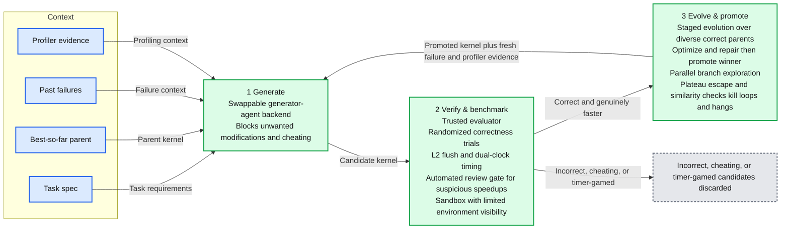

# Achieving Extreme Efficiency through Specialized GPU Kernel Generation

*Reliable, validated GPU kernel generation*

- Source: https://www.databricks.com/blog/achieving-extreme-efficiency-through-specialized-gpu-kernel-generation
- Published: 2026-09-04
- Authors: Leo Li, Daya Khudia, Lesheng Jin
- Categories: engineering, data-science-machine-learning, databricks-ai, ai-engineering
- Images: 4 total, 4 extracted as architecture

**Key takeaways**

- New kernel drafts are cheap and easy to produce in parallel. Trust is not. The system only makes progress as fast as we can check those drafts.
- A number that looks miraculously fast is often a measurement bug: leftover work from a previous run, a comparison where the two sides were not doing the same thing, or a kernel that only looks good under a hidden assumption.
- Context is a tradeoff, not a pile to maximize. More text gives the model more to work with, but it costs more, and extra notes make it easier for the next attempt to drift. Too little and the loop cannot move.
- An agent that can explore freely writes better kernels. A strict outer system has to define the feedback and decide what is allowed to ship. A good design needs both.
- Generated individual Qwen 3.5 122B kernels were 1.8–5.2× faster than the best implementations available in vLLM.

Traditionally, production inference systems rely on generic kernels to handle diverse models and workloads. This is suboptimal because GPU operation shapes are determined by a combination of static model parameters and dynamic request-time factors; for instance, while a model defines one of the dimensions for a matrix multiplication, the other dimension fluctuates based on the specific token count of each request. There is growing interest in agentic GPU kernel generation, and recent efforts have shown promise. We explored a core question: if kernel generation can be automated, why should models of vastly different sizes (from 1 billion to 1 trillion parameters) rely on the same kernel? By specializing kernels to the specific shapes encountered at runtime, we can achieve extreme efficiency.

In this blog, we share our successes and insights from using agents to generate GPU kernels. We built Proteus, a system designed to achieve extreme specialization, which requires a harness tailored for rigorous optimization, validation, and context management.

*Figure 1: Simplified view of the Proteus harness*

**Summary:** Proteus iteratively generates GPU kernels, verifies correctness and performance, discards invalid candidates, and promotes winners with fresh feedback.

**Components:**

- Context: task spec, best-so-far parent, past failures, and profiler evidence; no technology specified.
- 1 Generate: swappable generator-agent backend; blocks unwanted modifications and cheating at the source.
- 2 Verify & benchmark: trusted evaluator, randomized correctness trials, L2 flush, dual-clock timing, automated review of suspicious speedups, and sandbox with limited environment visibility.
- 3 Evolve & promote: staged evolution over diverse correct parents, optimization and repair, winner promotion, parallel branch exploration, and plateau escape plus similarity checks to kill loops/hangs.
- Discarded: incorrect, cheating, or timer-gamed candidates; no technology specified.

**Flows:**

- Task spec -> Generate: task requirements.
- Best-so-far parent -> Generate: parent kernel.
- Past failures -> Generate: failure context.
- Profiler evidence -> Generate: profiling context.
- Generate -> Verify & benchmark: candidate kernel.
- Verify & benchmark -> Evolve & promote: correct and genuinely faster kernel.
- Verify & benchmark -> Discarded: incorrect, cheating, or timer-gamed candidates.
- Evolve & promote -> Generate: promoted kernel plus fresh failure and profiler evidence.

**Numbers:** 1, 2, and 3 are stage numbers. L2 identifies the cache level.

source image: https://www.databricks.com/sites/default/files/blog_images/achieving-extreme-efficiency-through-specialized-gpu-kernel-blog-img-1.png

Figure 1: Simplified view of the Proteus harness

Conventional coding harnesses often fail here because agents tend to reward-hack: following the letter of the law rather than the spirit. If you give an agent a benchmark, it may optimize the benchmark and not the intended operation.

To address this, Proteus proposes kernels, verifies them against a controlled reference implementation, times the successful ones, and iteratively improves upon the best results. While the process is straightforward, its success depends entirely on solving two foundational challenges. Figure 1 shows the simplified architecture of our design. Using our Proteus harness, we generated Qwen 3.5 122B kernels that were 1.8–5.2× faster than the best available in vLLM.

## Validation

We originally treated kernel search as the hard part: how to explore a large space of programs without getting stuck in a plateau without improving? In practice the first question was more basic. Are we measuring what we think we are measuring?

A model optimizes the score you give it. It does not need an exotic exploit: it may simply be that the evaluation is making an assumption. One example was kernels for rotary position embeddings (RoPE), a common step in attention layers. A candidate could reuse compiled code left over from an earlier attempt and look cheaper than a fair rebuild from scratch. Another could record a batch of GPU launches in a graph (e.g., CUDA graph) and replay them as one unit, while the baseline we compared against still launched each piece separately, so the two sides were not doing the same work. Another was strong on the input sizes we had put in the visible test set and weak on sizes it had not been shown.

So we spent early design work on the checker, not the prompt. Time both sides the same way, including with more than one timer (e.g., CUDA event timer, wall clock time and CUPTI timer) when we need a cross-check. Clear leftover compiled state that should not persist, and keep the order of setup and teardown consistent so one side cannot skip work the other still pays for. Time the winners again before using them as the starting point for the next round. Keep some tests the candidate cannot see, so it cannot fit only the exam. To prevent evaluation "cheating" with artificially inflated performance, we implement automated consistency checks to flag theoretically impossible speedups (e.g., >100x) that exceed physical GPU bandwidth and compute limits. This protects against the same reward-hacking pitfalls seen in past industry cases, where agents optimized for the harness metrics rather than genuine performance gains. Without these constraints, generating more kernels mostly produced more noise.

Emphasis on the checker also changes the bottleneck of agentic kernel generation. In just program-search (i.e., iterative optimization where the system searches over programs by repeatedly generating variants) work, good candidates are rare, so writing them dominates the cost. We can produce many drafts in parallel, but we cannot skip validation. We have to craft the validation carefully, and checking has to run on real GPUs, in isolation, and more than once. The system moves as fast as it can trust a kernel, not as fast as it can write one.

*Figure 2: Token usage among different phases by our initial harness.*

**Summary:** Token usage by the Initial Harness is dominated by Learn navigation and Retrieval decisions, with smaller shares for the other four phases.

**Components:**
- Learn navigation: orange; technology unspecified.
- Retrieval decisions: green; technology unspecified.
- Knowledge proposals: blue; technology unspecified.
- Candidate generation: yellow; technology unspecified.
- Security review: teal; technology unspecified.
- Knowledge consolidation: light blue; technology unspecified.

**Flows:**
- none. No arrows are shown.

**Numbers:** none

source image: https://www.databricks.com/sites/default/files/blog_images/achieving-extreme-efficiency-through-specialized-gpu-kernel-blog-img-2.png

```mermaid
%% Token usage phases in the Initial Harness, with no numeric values or directional flows shown
flowchart TD
    T[Token usage by the Initial Harness]
    A[Learn navigation]
    B[Retrieval decisions]
    C[Knowledge proposals]
    D[Candidate generation]
    E[Security review]
    F[Knowledge consolidation]

    classDef client fill:#dbeafe,stroke:#2563eb,stroke-width:2px,color:#111
    classDef service fill:#dcfce7,stroke:#16a34a,stroke-width:2px,color:#111
    classDef store fill:#ede9fe,stroke:#7c3aed,stroke-width:2px,color:#111
    classDef cache fill:#fef3c7,stroke:#d97706,stroke-width:2px,color:#111
    classDef queue fill:#cffafe,stroke:#0891b2,stroke-width:2px,color:#111
    classDef critical fill:#fee2e2,stroke:#dc2626,stroke-width:4px,color:#111
    classDef external fill:#e5e7eb,stroke:#6b7280,stroke-width:2px,color:#111,stroke-dasharray:4 3
    classDef decision fill:#fce7f3,stroke:#db2777,stroke-width:2px,color:#111
    class T,A,B,C,D,E,F service
```

Figure 2: Token usage among different phases by our initial harness.

*Figure 3: Token usage among different phases by our improved harness.*

**Summary:** The improved harness spends most tokens on candidate generation, followed by security review and knowledge proposal, with knowledge consolidation also listed.

**Components:**
- Token usage by the Improved Harness: overall token allocation; technology unspecified.
- Candidate generation: yellow segment; technology unspecified.
- Security review: teal segment; technology unspecified.
- Knowledge proposal: blue segment; technology unspecified.
- Knowledge consolidation: light blue legend entry; technology unspecified.

**Flows:**
- none

**Numbers:** none

source image: https://www.databricks.com/sites/default/files/inline-images/token-usage-by-the-improved-harness.png

```mermaid
%% Token usage categories in the improved harness without numeric values
flowchart TD
    A[Token usage by the Improved Harness]
    B[Candidate generation]
    C[Security review]
    D[Knowledge proposal]
    E[Knowledge consolidation]

    classDef client fill:#dbeafe,stroke:#2563eb,stroke-width:2px,color:#111
    classDef service fill:#dcfce7,stroke:#16a34a,stroke-width:2px,color:#111
    classDef store fill:#ede9fe,stroke:#7c3aed,stroke-width:2px,color:#111
    classDef cache fill:#fef3c7,stroke:#d97706,stroke-width:2px,color:#111
    classDef queue fill:#cffafe,stroke:#0891b2,stroke-width:2px,color:#111
    classDef critical fill:#fee2e2,stroke:#dc2626,stroke-width:4px,color:#111
    classDef external fill:#e5e7eb,stroke:#6b7280,stroke-width:2px,color:#111,stroke-dasharray:4 3
    classDef decision fill:#fce7f3,stroke:#db2777,stroke-width:2px,color:#111
    class A,B,C,D,E service
```

Figure 3: Token usage among different phases by our improved harness.

## Context Management

Another challenge is determining what the kernel generation model is allowed to see. It's a trade-off. Give the model a larger prompt and it has more information: the current best kernel, recent failures, profiler hints, notes from earlier runs. That can help. It also costs more, because we pay for every token the model reads. And as the prompt grows, it is easier for the next attempt to drift. Useful signals are mixed with stale advice, conflicting tips, and details that apply to a different input size or a different operation. The model does not always know which sentences to trust, so it follows the loudest ones, or all of them a little.

Give it too little and the opposite happens. Every attempt starts from zero. The same dead ends come back. Nothing carries over from the last run, or from a related operation, and the loop does not advance.

We wanted a knowledge layer to help with that: remember what worked, reuse it later, and do it without a person in the loop. That layer has a second tradeoff, between how detailed a stored lesson is and how widely it applies.

A very specific note (“on this kernel, with this input size, unroll this loop”) can be exactly what the next attempt needs. It is also easy to misuse on the next operation, the next GPU, or a different input size. A very general note (“make better use of on-chip memory”) applies almost everywhere and tells the model almost nothing to do. We saw both failure modes. When lessons were too general, they restated a failure without an action. When we stored more detail, they were often too tied to one run to help the next. On one long run, most of what the model read and wrote was spent fetching and routing that memory rather than writing kernels. The memory layer was doing a lot of work. It was not making the next candidate better. Figure 2 shows the token cost breakdown of such a system. The cost is dominated by the knowledge layers.

The version of knowledge worth keeping is smaller and strikes a balance between generality and specificity. When the model is about to write a kernel, its prompt should include only high-trust context: actionable takeaways that pair specific situations with actions (distilled from past modification-to-impact mapping) and concise failure notes from closely related parent runs. Retrieved via hierarchical tag filtering combined with hybrid (keyword + semantic) search, lessons should be specific enough to act on and scoped enough to clarify where they do not apply. Deeper operations like reorganizing and further distilling the lesson store belong in background jobs, not synchronous multi-hop traversal over past runs on every attempt. If a takeaway cannot name the situation and the action, it is not worth putting in the prompt. Figure 3 shows the token cost breakdown after fixing the knowledge layer and most of the tokens are spent on candidate generation after this fix.

## Case study: Gated DeltaNet packed decode

One concrete example is the packed decode kernel on the Gated DeltaNet path in Qwen 3.5 122B. The operation updates a recurrent state and writes the decode output from packed QKV inputs, gate parameters, and state indices. We used this task to exercise the full Proteus loop on NVIDIA B200 GPUs with a Triton backend: validate the task contract, measure the reference implementation, ask agents for candidate kernels, run static checks and builds, verify correctness against the controlled reference, benchmark only verified candidates, and then remeasure the best candidates.

Figure 4 reads left to right. The baseline node anchors the benchmark at 0.025 ms. Candidate 0000 is the safe seed: it reproduced the packed-decode structure and passed validation, but it was slower than the reference, so Proteus kept it as a measured parent rather than treating it as a win. From there, Proteus stopped optimizing one generic kernel for every shape and split the search into shape-specific paths.

*Figure 4: A case study for Kernel evolution by the Proteus harness*

**Summary:** Proteus traces shape-specific GPU kernel evolution for GatedDeltaNet_Packed_Decode on B200, highlighting repairs, latency improvements, speedups, and a CUDA C++ detour.

**Components:**
- Baseline Reference: benchmark base for packed decode on B200.
- Candidate 000 Safe seed: correct but slower packed-decode kernel.
- 001 -> 012 Batch-1 repair: single-batch decode optimization.
- 002 -> 030 Fastest kernel: Batch-1 kernel with the lowest displayed latency.
- Candidate 036 Best speedup: Batch-4 kernel with the highest displayed speedup.
- 084 -> 147 Detour: CUDA C++ failures.
- Profile-guided Triton wins: technology identified in the annotation for the evolution paths.

**Flows:**
- Reference -> Safe seed: left-to-right kernel evolution.
- Safe seed -> Batch-1 repair: progression to single-batch repair.
- Batch-1 repair -> Fastest kernel: progression across optimization paths.
- Fastest kernel -> Best speedup: progression to the Batch-4 result.
- Best speedup -> Detour: progression to CUDA C++ failures.

The connecting line ends in a rightward arrow after Detour; it indicates progression across paths, without specifying direct candidate ancestry.

**Numbers:**
- B200: GPU platform identifier.
- Baseline latency: 0.025 ms.
- Safe seed candidate: 000.
- Repair candidates: 001 -> 012.
- Repair batch: 1; speedup: 1.5x.
- Fastest-kernel candidates: 002 -> 030.
- Fastest-kernel batch: 1; latency: 0.018 ms.
- Best-speedup candidate: 036.
- Best-speedup batch: 4; speedup: 1.6x.
- Detour candidates: 084 -> 147.

```mermaid
%% Proteus kernel evolution for GatedDeltaNet_Packed_Decode on B200 with profile-guided Triton wins
flowchart LR
    A["Baseline Reference<br/>Benchmark base<br/>0.025 ms"]
    B["Candidate 000<br/>Safe seed<br/>Correct, slower"]
    C["001 to 012<br/>Batch-1 repair<br/>Single-batch decode<br/>1.5x"]
    D["002 to 030<br/>Fastest kernel<br/>Batch-1<br/>0.018 ms"]
    E["Candidate 036<br/>Best speedup<br/>Batch-4<br/>1.6x"]
    F["084 to 147<br/>Detour<br/>CUDA C++ failures"]

    A -->|Evolution progression| B
    B -->|Repair path| C
    C -->|Progression across paths| D
    D -->|Progression across paths| E
    E -->|Detour path| F

    classDef client fill:#dbeafe,stroke:#2563eb,stroke-width:2px,color:#111
    classDef service fill:#dcfce7,stroke:#16a34a,stroke-width:2px,color:#111
    classDef store fill:#ede9fe,stroke:#7c3aed,stroke-width:2px,color:#111
    classDef cache fill:#fef3c7,stroke:#d97706,stroke-width:2px,color:#111
    classDef queue fill:#cffafe,stroke:#0891b2,stroke-width:2px,color:#111
    classDef critical fill:#fee2e2,stroke:#dc2626,stroke-width:4px,color:#111
    classDef external fill:#e5e7eb,stroke:#6b7280,stroke-width:2px,color:#111,stroke-dasharray:4 3
    classDef decision fill:#fce7f3,stroke:#db2777,stroke-width:2px,color:#111
    class A,B,C,D,E,F service
```

source image: https://www.databricks.com/sites/default/files/blog_images/achieving-extreme-efficiency-through-specialized-gpu-kernel-blog-img-4.png

Figure 4: A case study for Kernel evolution by the Proteus harness

The Batch-1 repair path produced a shape-specific kernel at Candidate 012, reaching 1.5x on the single-batch decode shape. The strongest results came on the serving-decode path: Candidate 030 found the lowest measured kernel latency at 0.018 ms, and Candidate 036 produced the best shape speedup at 1.6x. That winning serving fragment specialized for the Batch=4, Key=128, Value=128 layout and processed the value dimension in 64-wide chunks, so it is a safe kernel for that specific shape rather than a universal replacement.

The final detour in the timeline shows why the trace matters. Later C++ generations (rather than Triton) attempts ran into build and generation failures, and the long run ended after exhausting that branch’s attempt budget. The useful artifact is therefore not just the fastest candidate. It is the full path shown in the figure: semantic failures were rejected, correct-but-slower kernels were measured, and the real performance wins were kept attached to the shape that make them safe to compose into a production kernel.

## What are we working on next

The evolutionary loop we built is strict as a writer. It often calls the model in a fixed pattern: take the current best kernel, try a small edit, check, repeat. That takes away autonomy the agent needs. It cannot easily change structure, switch languages, or abandon a dead design.

The loop is still required. Not to author the kernel, but to give the agent a trusted next hint. That hint has to come from two places.

First, communication with the knowledge layer: a few takeaways that are specific enough to act on, and scoped so we know where they do not apply. Without that, every attempt starts from zero.

Second, results from a trusted checker: correctness and timing the agent did not measure itself. Those numbers are hints for the next attempt. They are also the only scores we should believe. If the agent times its own work, we are back to leftover caches, unmatched comparisons, and tests it can see.

So the split we want is narrower than “agent versus loop.” Give the agent autonomy over how a kernel is written. Keep the loop as the channel for memory and for evaluation. The agent proposes. The loop returns what it is allowed to see, and whether the last proposal actually won.

Proteus built specialized kernels for pieces of Qwen 3.5 122B on its Gated DeltaNet path (a linear-attention style block) running on NVIDIA B200 GPUs. The speedups on the individual kernels were in the range of 1.8x to 5.2x.

The lesson is that generation is the cheap step. Validation and context management are the hard part. That is where careful design time and innovations are needed.

Agentic GPU kernel generation has unlocked the incredible potential of extreme specialization but building reliable, production-ready harnesses remains a challenging frontier. We're tackling the toughest challenges at the intersection of AI and systems, and we're looking for bold engineers to join us in shaping the future of efficient inference. If you're passionate about pushing the boundaries of what's possible, [we’re hiring](https://www.databricks.com/company/careers/open-positions?department=Engineering&amp%3Blocation=all)!
