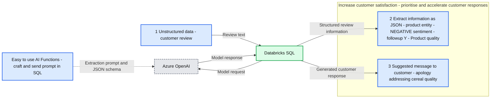
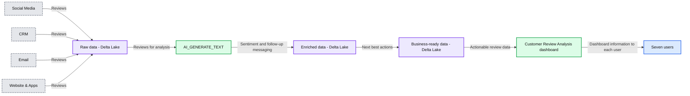

# Actioning Customer Reviews at Scale with Databricks SQL AI Functions

*AI Functions brings the power of LLMs and more into DB SQL*

- Source: https://www.databricks.com/blog/actioning-customer-reviews-scale-databricks-sql-ai-functions
- Published: 2023-05-10
- Authors: Vinny Vijeyakumaar
- Categories: engineering, data-science-machine-learning
- Images: 8 total, 2 extracted as architecture

Every morning Susan walks straight into a storm of messages, and doesn't know where to start! Susan is a customer success specialist at a global retailer, and her primary objective is to ensure customers are happy and receive personalised service whenever they encounter issues.

Overnight the company receives hundreds of reviews and feedback across multiple channels including websites, apps, social media posts, and email. Susan starts her day by logging into each of these systems and picking up the messages not yet collected by her colleagues. Next, she has to make sense of these messages, identify what needs to be responded to, and formulate a response for the customer. It isn't easy because these messages are often in different formats and every customer expresses their opinions in their own unique style.

Here's a sample of what she has to deal with:

Susan feels uneasy because she knows she isn't always interpreting, categorizing, and responding to these messages in a consistent manner. Her biggest fear is that she may inadvertently miss responding to a customer because she didn't properly interpret their message. Susan isn't alone. Many of her colleagues feel this way, as do most fellow customer service representatives out there!

The challenge for retailers is how do they aggregate, analyse, and action this freeform feedback in a timely manner? A good first step is leveraging the Lakehouse to seamlessly collate all these messages across all these systems into one place. But then what?

## Enter LLMs

[Large language models](https://en.wikipedia.org/wiki/Large_language_model) (LLMs) are perfect for this scenario. As their name implies, they are highly capable of making sense of complex unstructured text. They are also adept at summarizing key topics discussed, determining sentiment, and even generating responses. However, not every organization has the resources or expertise to develop and maintain its own LLM models.

Luckily, in today's world, we have LLMs we can leverage as a service, such as Azure OpenAI's GPT models. The question then becomes: how do we apply these models to our data in the Lakehouse?

In this walkthrough, we'll show you how you can apply Azure OpenAI's GPT models to unstructured data that is residing in your Databricks Lakehouse and end up with well-structured queryable data. We will take customer reviews, identify topics discussed, their sentiment, and determine whether the feedback requires a response from our customer success team. We'll even pre-generate a message for them!

The problems that need to be solved for Susan's company include:

- Utilizing a readily available LLM that also has enterprise support and governance
- Generate consistent meaning against freeform feedback
- Determining if a next action is required
- Most importantly, allow analysts to interact with the LLM using familiar SQL skills

## Walkthrough: Databricks SQL AI Functions

[AI Functions](https://www.databricks.com/blog/2023/04/18/introducing-ai-functions-integrating-large-language-models-databricks-sql.html) simplifies the daunting task of deriving meaning from unstructured data. In this walkthrough, we'll leverage a deployment of an Azure OpenAI model to apply conversational logic to freeform customer reviews.

**Summary:** Databricks SQL uses AI Functions and Azure OpenAI to turn customer reviews into structured JSON and suggested customer responses.

**Components:**

- Unstructured data: customer review - freeform text describing dissatisfaction with Jivano Crunch Cereal.
- Easy to use AI Functions - SQL prompt requesting information extraction and JSON output matching a schema.
- Databricks SQL - processes reviews and connects to Azure OpenAI.
- Azure OpenAI - model service receiving prompts and returning results.
- Extract information as JSON - structured output containing entity `product`, sentiment `NEGATIVE`, followup `Y`, and followup_reason `Product quality`.
- Suggested message to customer - generated apology addressing cereal quality and customer dissatisfaction.
- Increase customer satisfaction - outcome label grouping the outputs, with the instruction to prioritise and accelerate customer responses.

**Flows:**

- AI Functions SQL prompt -> Azure OpenAI: extraction prompt and requested JSON schema, shown through a dotted arrow toward the model connection.
- Customer review -> Databricks SQL: unstructured review text.
- Databricks SQL -> Azure OpenAI: model request.
- Azure OpenAI -> Databricks SQL: model response.
- Databricks SQL -> Extract information as JSON: structured review information.
- Databricks SQL -> Suggested message to customer: generated customer response.

**Numbers:** 1, 2, and 3 label the customer review, JSON extraction, and suggested message stages respectively.

source image: https://www.databricks.com/sites/default/files/inline-images/blogimg2.png

## Pre-requisites

We need the following to get started

- [Sign up](https://forms.gle/pBTvFmrAzLLbjPyg7) for the SQL AI Functions public preview
- An [Azure OpenAI key](https://learn.microsoft.com/en-us/azure/cognitive-services/openai/overview#how-do-i-get-access-to-azure-openai)
- Store the key in Databricks Secrets (documentation: [AWS](https://docs.databricks.com/security/secrets/index.html), [Azure](https://learn.microsoft.com/en-gb/azure/databricks/security/secrets/), [GCP](https://docs.gcp.databricks.com/security/secrets/index.html))
- A Databricks SQL Pro or Serverless warehouse

## Prompt Design

To get the best out of a generative model, we need a well-formed prompt (i.e. the question we ask the model) that provides us with a meaningful answer. Furthermore, we need the response in a format that can be easily loaded into a Delta table. Fortunately, we can tell the model to return its analysis in the format of a JSON object.

Here is the prompt we use for determining entity sentiment and whether the review requires a follow-up:

Running this on its own gives us a response like

Similarly, for generating a response back to the customer, we use a prompt like

## AI Functions

We'll use Databricks SQL AI Functions as our interface for interacting with Azure OpenAI. Utilising SQL provides us with three key benefits:

- Convenience: we forego the need to implement custom code to interface with Azure OpenAI's APIs
- End-users: Analysts can use these functions in their SQL queries when working with Databricks SQL and their BI tools of choice
- Notebook developers: can use these functions in SQL cells and spark.sql() commands

We first create a function to handle our prompts. We've stored the Azure OpenAI API key in a Databricks Secret, and reference it with the SECRET() function. We also pass it the Azure OpenAI resource name (resourceName) and the model's deployment name (deploymentName). We also have the ability to set the model's temperature, which controls the level of randomness and creativity in the generated output. We explicitly set the temperature to 0 to minimise randomness and maximise repeatability

Now we create our first function to annotate our review with entities (i.e. topics discussed), entity sentiments, whether a follow-up is required and why. Since the prompt will return a well-formed JSON representation, we can instruct the function to return a STRUCT type that can easily be inserted into a Delta table

We create a similar function for generating a response to complaints, including recommending alternative products to try

We **could** wrap up all the above logic into a single prompt to minimise API calls and latency. However, we recommend decomposing your questions into granular SQL functions so that they can be reused for other scenarios within your organisation.

## Analysing customer review data

Now let's put our functions to the test!

The LLM function returns well-structured data that we can now easily query!

Next we'll structure the data in a format that is more easily queried by BI tools:

Now we have multiple rows per review, with each row representing the analysis of an entity (topic) discussed in the text

## Creating response messages for our customer success team

Let's now create a dataset for our customer success team where they can identify who requires a response, the reason for the response, and even a sample message to start them off

The resulting data looks like

As customer reviews and feedback stream into the Lakehouse, Susan and her team foregoes the labour-intensive and error-prone task of manually assessing each piece of feedback. Instead, they now spend more time on the high-value task of delighting their customers!

## Supporting ad-hoc queries

Analysts can also create ad-hoc queries using the PROMPT_HANDLER() function we created before. For example, an analyst might be interested in understanding whether a review discusses beverages:

## From unstructured data to analysed data in minutes!

Now when Susan arrives at work in the morning, she's greeted with a dashboard that points her to which customers she should be spending time with and why. She's even provided with starter messages to build upon!

To many of Susan's colleagues, this seems like magic! Every magic trick has a secret, and the secret here is AI_GENERATE_TEXT() and how easy it makes applying LLMs to your Lakehouse. The Lakehouse has been working behind the scenes to centralise reviews from multiple data sources, assigning meaning to the data, and recommending next best actions

**Summary:** Customer reviews from four sources flow through raw storage, AI text enrichment, business-ready storage, and a review dashboard used by multiple people.

**Components:**
- Social Media: review source; technology unspecified.
- CRM: review source; technology unspecified.
- Email: review source; technology unspecified.
- Website & Apps: review source; technology unspecified.
- Raw data: storage with a Delta Lake logo.
- AI_GENERATE_TEXT(): AI function that identifies sentiments, recommends whether and why to follow up, and suggests customer messages.
- Enriched data: storage with a Delta Lake logo containing entity sentiment, follow-up requirements, and messaging.
- Business-ready data: storage with a Delta Lake logo containing next best actions.
- Customer Review Analysis: dashboard showing review counts, sentiment, complaint categories, and customers requiring follow-up; technology unspecified.
- Seven user avatars: dashboard recipients; roles unspecified.

**Flows:**
- Social Media -> Raw data: reviews.
- CRM -> Raw data: reviews.
- Email -> Raw data: reviews.
- Website & Apps -> Raw data: reviews.
- Raw data -> AI_GENERATE_TEXT(): reviews for analysis and message generation.
- AI_GENERATE_TEXT() -> Enriched data: sentiment, follow-up recommendations, and suggested messages.
- Enriched data -> Business-ready data: enriched reviews organized into next best actions.
- Business-ready data -> Customer Review Analysis: actionable review data.
- Customer Review Analysis -> User 1: dashboard information.
- Customer Review Analysis -> User 2: dashboard information.
- Customer Review Analysis -> User 3: dashboard information.
- Customer Review Analysis -> User 4: dashboard information.
- Customer Review Analysis -> User 5: dashboard information.
- Customer Review Analysis -> User 6: dashboard information.
- Customer Review Analysis -> User 7: dashboard information.

**Numbers:** 45 reviews received; 14 follow-ups required. Other dashboard numbers are too small to read reliably.

source image: https://www.databricks.com/sites/default/files/inline-images/blogimg7.png

Let's recap the key benefits for Susan's business:

- They are immediately able to apply AI to their data without the weeks required to train, build, and operationalise a model
- Analysts and developers can interact with this model through using familiar SQL skills

You can apply these SQL functions to the entirety of your Lakehouse such as:

- Classifying data in real-time with [Delta Live Tables](https://www.databricks.com/product/delta-live-tables)
- Build and distribute real-time [SQL Alerts](https://docs.databricks.com/sql/user/alerts/index.html) to warn on increased negative sentiment activity for a brand
- Capturing product sentiment in [Feature Store tables](https://docs.databricks.com/machine-learning/feature-store/index.html) that back their real-time serving models

## Areas for consideration

While this workflow brings immediate value to our data without the need to train and maintain our own models, we need to be cognizant of a few things:

- The key to an accurate response from an LLM is a well-constructed and detailed prompt. For example, sometimes the ordering of your rules and statements matters. Ensure you periodically fine-tune your prompts. You may spend more time engineering your prompts than writing your SQL logic!
- LLM responses can be non-deterministic. Setting the temperature to 0 will make the responses more deterministic, but it's never a guarantee. Therefore, if you are reprocessing data, the output for previously processed data could differ. You can use Delta Lake's [time travel](https://docs.databricks.com/delta/history.html) and [change data feed](https://docs.databricks.com/delta/delta-change-data-feed.html) features to identify altered responses and address them accordingly
- In addition to integrating LLM services, Databricks also makes it easy to build and operationalise LLMs that you own and are fine-tuned on your data. For example, [learn how we built Dolly](https://www.databricks.com/blog/2023/04/12/dolly-first-open-commercially-viable-instruction-tuned-llm). You can use these in conjunction with [AI Functions](https://docs.databricks.com/sql/language-manual/functions/ai_generate_text.html) to create insights truly unique to your business

## What next?

Every day the community is showcasing new creative uses of prompts. What creative uses can you apply to the data in your Databricks Lakehouse?

- Sign up for the Public Preview of AI Functions [here](https://forms.gle/pBTvFmrAzLLbjPyg7)
- Read the docs [here](https://docs.databricks.com/sql/language-manual/functions/ai_generate_text.html)
- Follow along with our demo at [dbdemos.ai](https://www.dbdemos.ai/demo.html?demoName=sql-ai-functions)
- Check out our Webinar covering how to build your own LLM like Dolly [here](https://www.databricks.com/resources/webinar/build-your-own-large-language-model-dolly)!
